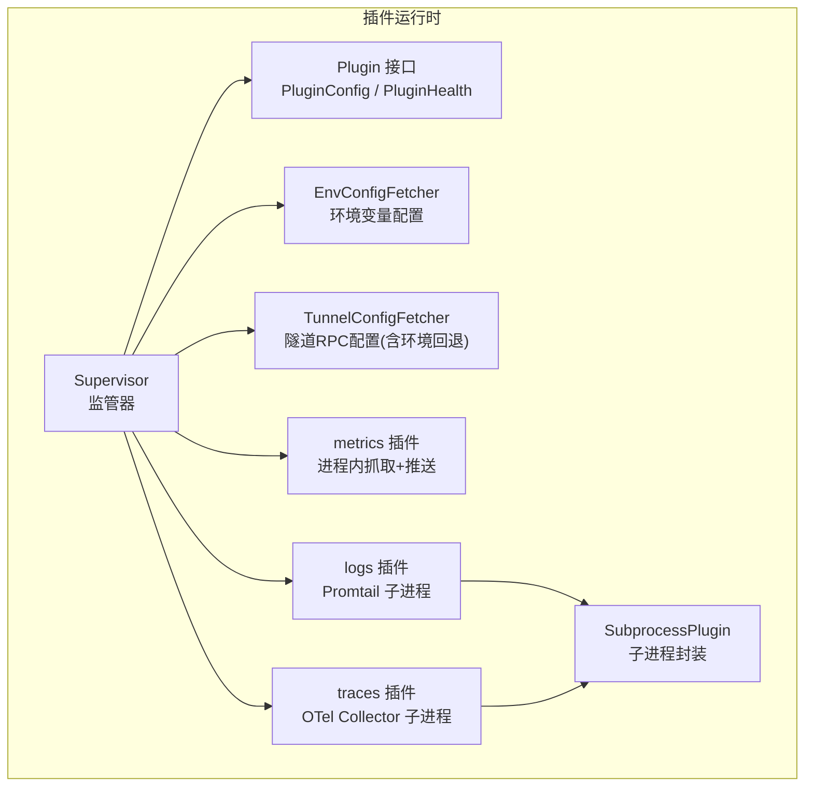
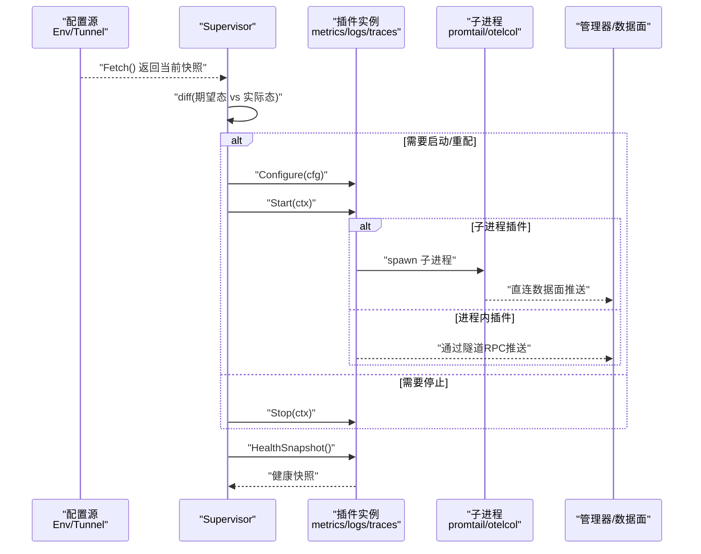
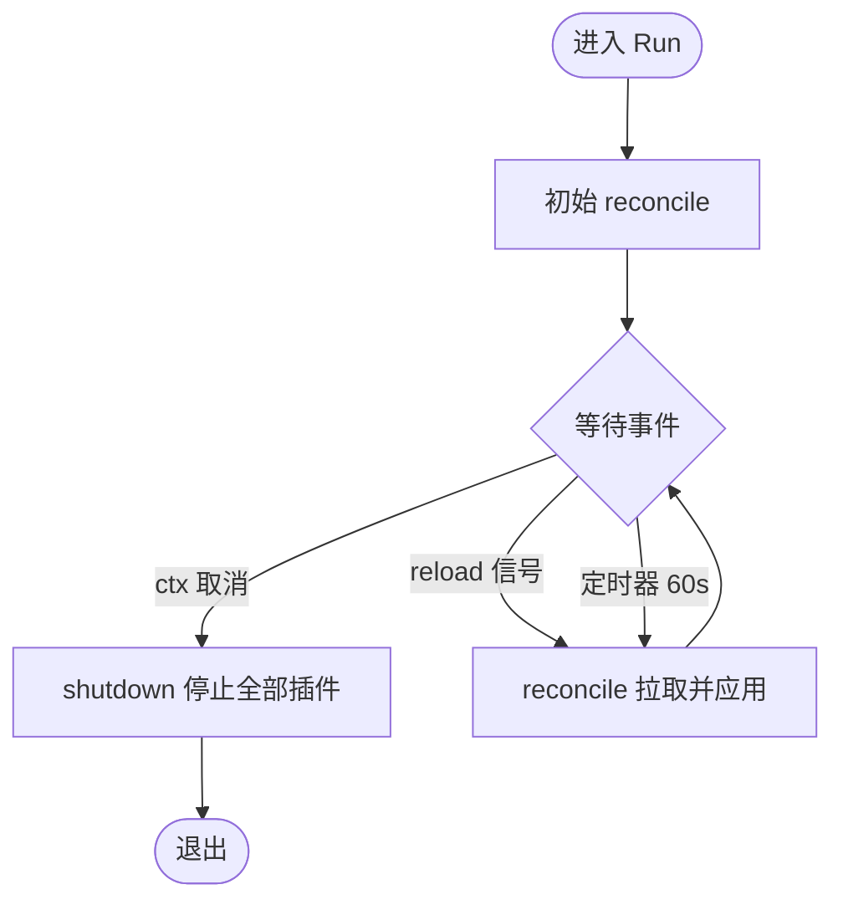
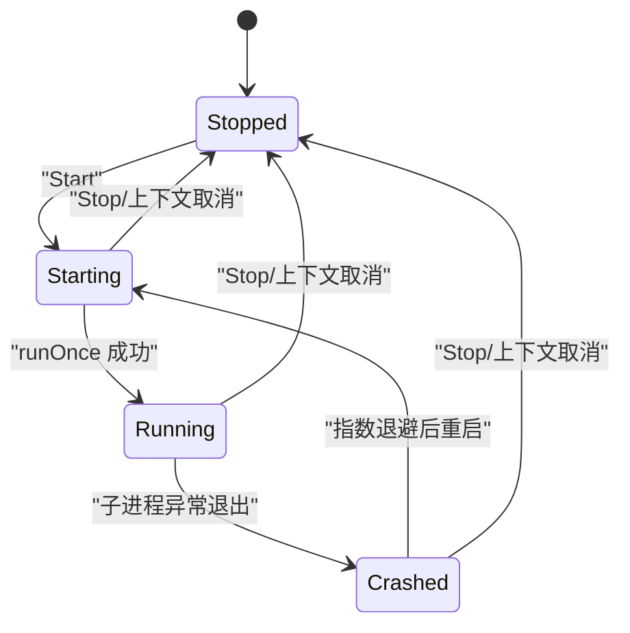
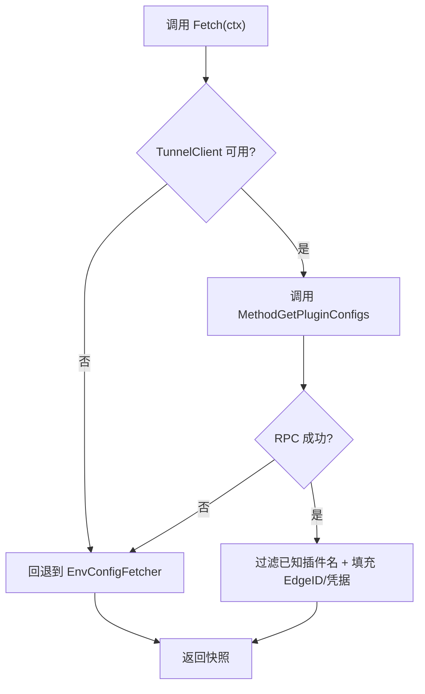
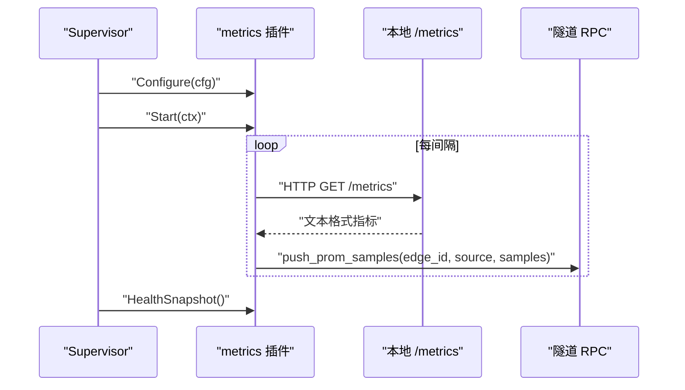
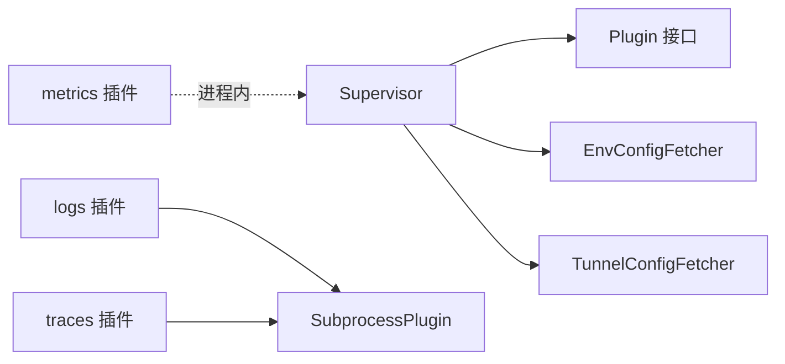

# 插件监管系统

<cite>
**本文引用的文件**   
- [supervisor.go](file://internal/edgeagent/plugins/supervisor.go)
- [plugin.go](file://internal/edgeagent/plugins/plugin.go)
- [subprocess.go](file://internal/edgeagent/plugins/subprocess.go)
- [config_env.go](file://internal/edgeagent/plugins/config_env.go)
- [config_tunnel.go](file://internal/edgeagent/plugins/config_tunnel.go)
- [metrics_plugin.go](file://internal/edgeagent/plugins/metrics/plugin.go)
- [logs_plugin.go](file://internal/edgeagent/plugins/logs/plugin.go)
- [traces_plugin.go](file://internal/edgeagent/plugins/traces/plugin.go)
</cite>

## 目录
1. [简介](#简介)
2. [项目结构](#项目结构)
3. [核心组件](#核心组件)
4. [架构总览](#架构总览)
5. [详细组件分析](#详细组件分析)
6. [依赖关系分析](#依赖关系分析)
7. [性能与可靠性考量](#性能与可靠性考量)
8. [故障排查指南](#故障排查指南)
9. [结论](#结论)
10. [附录：开发规范、部署与调试](#附录开发规范部署与调试)

## 简介
本文件面向“插件监管系统”的读者，系统性阐述边缘侧插件运行时（Supervisor）的设计与实现。内容覆盖：
- 插件发现、启动、监控与重启机制
- 插件生命周期管理（初始化、运行态监控、优雅停止、崩溃恢复）
- 子进程管理机制（进程隔离、资源限制、日志收集）
- 配置管理系统（环境变量与隧道推送配置的优先级处理）
- 健康检查机制（存活探针、指标采集、告警触发）
- 插件开发规范、部署流程与调试技巧

## 项目结构
插件监管系统位于 edgeagent 的 plugins 包中，采用“接口 + 通用实现 + 具体插件”的分层组织方式：
- 接口与公共模型：定义 Plugin、PluginConfig、PluginHealth、ConfigFetcher 等
- 监管器：Supervisor 负责拉取配置、差异对比、启停协调与健康快照汇总
- 子进程封装：SubprocessPlugin 统一封装外部二进制（如 promtail、otelcol-contrib）的生命周期与崩溃重试
- 内置插件：metrics（进程内）、logs（promtail 子进程）、traces（otelcol-contrib 子进程）
- 配置来源：EnvConfigFetcher（环境变量）、TunnelConfigFetcher（隧道 RPC，带环境回退）



图表来源
- [supervisor.go:1-276](file://internal/edgeagent/plugins/supervisor.go#L1-L276)
- [plugin.go:1-119](file://internal/edgeagent/plugins/plugin.go#L1-L119)
- [subprocess.go:1-318](file://internal/edgeagent/plugins/subprocess.go#L1-L318)
- [config_env.go:1-101](file://internal/edgeagent/plugins/config_env.go#L1-L101)
- [config_tunnel.go:1-138](file://internal/edgeagent/plugins/config_tunnel.go#L1-L138)
- [metrics_plugin.go:1-306](file://internal/edgeagent/plugins/metrics/plugin.go#L1-L306)
- [logs_plugin.go:1-54](file://internal/edgeagent/plugins/logs/plugin.go#L1-L54)
- [traces_plugin.go:1-48](file://internal/edgeagent/plugins/traces/plugin.go#L1-L48)

章节来源
- [supervisor.go:1-276](file://internal/edgeagent/plugins/supervisor.go#L1-L276)
- [plugin.go:1-119](file://internal/edgeagent/plugins/plugin.go#L1-L119)

## 核心组件
- Supervisor：维护插件注册表，周期性或信号驱动地拉取配置快照，计算期望态与实际态的差异，执行 Configure/Start/Stop，并汇总健康信息。
- Plugin 接口：所有插件的统一抽象，包含 Name、Configure、Start、Stop、HealthSnapshot。
- SubprocessPlugin：对子进程生命周期的通用封装，包括配置渲染、参数拼装、崩溃指数退避重启、日志落盘、优雅终止。
- EnvConfigFetcher/TunnelConfigFetcher：两种配置来源，前者从环境变量读取，后者通过隧道 RPC 获取，失败时回退到环境变量。
- 内置插件：
  - metrics：进程内定时抓取本地 /metrics，经隧道 RPC 推送样本。
  - logs：以 Promtail 为子进程，直接推送到数据面。
  - traces：以 otelcol-contrib 为子进程，直接推送到数据面。

章节来源
- [supervisor.go:1-276](file://internal/edgeagent/plugins/supervisor.go#L1-L276)
- [plugin.go:1-119](file://internal/edgeagent/plugins/plugin.go#L1-L119)
- [subprocess.go:1-318](file://internal/edgeagent/plugins/subprocess.go#L1-L318)
- [config_env.go:1-101](file://internal/edgeagent/plugins/config_env.go#L1-L101)
- [config_tunnel.go:1-138](file://internal/edgeagent/plugins/config_tunnel.go#L1-L138)
- [metrics_plugin.go:1-306](file://internal/edgeagent/plugins/metrics/plugin.go#L1-L306)
- [logs_plugin.go:1-54](file://internal/edgeagent/plugins/logs/plugin.go#L1-L54)
- [traces_plugin.go:1-48](file://internal/edgeagent/plugins/traces/plugin.go#L1-L48)

## 架构总览
Supervisor 作为控制平面，围绕“配置快照 → 差异对比 → 动作执行 → 健康上报”的闭环工作；具体插件按“进程内”或“子进程”两种形态接入。



图表来源
- [supervisor.go:112-230](file://internal/edgeagent/plugins/supervisor.go#L112-L230)
- [subprocess.go:135-235](file://internal/edgeagent/plugins/subprocess.go#L135-L235)
- [metrics_plugin.go:123-208](file://internal/edgeagent/plugins/metrics/plugin.go#L123-L208)
- [logs_plugin.go:27-53](file://internal/edgeagent/plugins/logs/plugin.go#L27-L53)
- [traces_plugin.go:31-47](file://internal/edgeagent/plugins/traces/plugin.go#L31-L47)

## 详细组件分析

### 监管器（Supervisor）
- 职责
  - 注册插件、接收重载信号、周期性安全轮询
  - 拉取配置快照，计算差异，执行 Configure/Start/Stop
  - 汇总各插件健康快照，供心跳上报
- 关键行为
  - 首次启动即执行一次 reconcile
  - 每 60s 安全轮询一次，避免状态漂移
  - 收到 reload 信号立即重新拉取并应用
  - 优雅关闭时对所有运行中的插件执行 Stop（带超时）
- 并发与一致性
  - 使用互斥锁保护注册表、当前配置与运行态
  - 每次 reconcile 前拷贝快照，避免在循环中持有长锁



图表来源
- [supervisor.go:112-133](file://internal/edgeagent/plugins/supervisor.go#L112-L133)
- [supervisor.go:135-230](file://internal/edgeagent/plugins/supervisor.go#L135-L230)
- [supervisor.go:232-251](file://internal/edgeagent/plugins/supervisor.go#L232-L251)

章节来源
- [supervisor.go:1-276](file://internal/edgeagent/plugins/supervisor.go#L1-L276)

### 插件接口与数据结构
- Plugin 接口
  - Name：插件标识（如 metrics/logs/traces）
  - Configure：接收配置，必要时渲染配置文件或校验 spec
  - Start：启动工作（进程内 goroutine 或子进程）
  - Stop：优雅停止（SIGTERM + 超时）
  - HealthSnapshot：非阻塞的健康快照
- 配置与状态
  - PluginConfig：启用标志、EdgeID、Endpoint、认证凭据、Spec
  - PluginState：stopped/starting/running/crashed
  - PluginHealth：名称、状态、最近错误、重启计数、PID、时间戳、目标级健康

```mermaid
classDiagram
class Plugin {
+Name() string
+Configure(cfg) error
+Start(ctx) error
+Stop(ctx) error
+HealthSnapshot() PluginHealth
}
class PluginConfig {
+bool Enabled
+uint64 EdgeID
+string Endpoint
+string AuthUser
+string AuthPass
+map~string,interface{} Spec
}
class PluginHealth {
+string Name
+PluginState State
+string LastError
+int RestartCount
+int PID
+time.Time StartedAt
+time.Time UpdatedAt
+[]TargetHealth Targets
}
class ConfigFetcher {
<<interface>>
+Fetch(ctx) map[string]PluginConfig
}
Plugin <|.. metrics_Plugin
Plugin <|.. logs_Subprocess
Plugin <|.. traces_Subprocess
ConfigFetcher <|.. EnvConfigFetcher
ConfigFetcher <|.. TunnelConfigFetcher
```

图表来源
- [plugin.go:18-119](file://internal/edgeagent/plugins/plugin.go#L18-L119)
- [metrics_plugin.go:64-102](file://internal/edgeagent/plugins/metrics/plugin.go#L64-L102)
- [logs_plugin.go:27-53](file://internal/edgeagent/plugins/logs/plugin.go#L27-L53)
- [traces_plugin.go:31-47](file://internal/edgeagent/plugins/traces/plugin.go#L31-L47)
- [config_env.go:32-41](file://internal/edgeagent/plugins/config_env.go#L32-L41)
- [config_tunnel.go:22-52](file://internal/edgeagent/plugins/config_tunnel.go#L22-L52)

章节来源
- [plugin.go:1-119](file://internal/edgeagent/plugins/plugin.go#L1-L119)

### 子进程插件封装（SubprocessPlugin）
- 设计要点
  - 将“配置渲染 + 参数拼装 + 二进制路径 + 工作目录”解耦，便于复用
  - 启动后进入 runLoop，保持“想要运行”的状态下自动重启
  - 崩溃策略：指数退避（1s→2s→4s…上限 5min），RestartCount 单调递增
  - 优雅停止：Cancel 上下文 → SIGTERM → WaitDelay 10s 后 SIGKILL
  - 日志收集：stdout/stderr 写入 workDir/<name>.log
- 健康与状态
  - 状态机：starting → running → crashed/stopped
  - 记录 PID、StartedAt、LastError、UpdatedAt



图表来源
- [subprocess.go:194-235](file://internal/edgeagent/plugins/subprocess.go#L194-L235)
- [subprocess.go:237-287](file://internal/edgeagent/plugins/subprocess.go#L237-L287)
- [subprocess.go:289-311](file://internal/edgeagent/plugins/subprocess.go#L289-L311)

章节来源
- [subprocess.go:1-318](file://internal/edgeagent/plugins/subprocess.go#L1-L318)

### 配置来源与环境变量回退
- EnvConfigFetcher
  - 从环境变量解析每个插件的配置，未知插件忽略
  - 支持 ENABLED/ENDPOINT/AUTH_USER/AUTH_PASS/SPEC_JSON 等键
  - AUTH_USER/AUTH_PASS 可回退到全局 ACCESS_KEY/SECRET_KEY
- TunnelConfigFetcher
  - 通过隧道 RPC 获取 per-edge 配置
  - 当客户端未就绪或 RPC 失败时，回退到 EnvConfigFetcher
  - EdgeID 优先使用环境变量，否则使用服务端返回
  - 仅接受已注册的插件名，防止越权注入



图表来源
- [config_tunnel.go:54-108](file://internal/edgeagent/plugins/config_tunnel.go#L54-L108)
- [config_env.go:46-71](file://internal/edgeagent/plugins/config_env.go#L46-L71)

章节来源
- [config_env.go:1-101](file://internal/edgeagent/plugins/config_env.go#L1-L101)
- [config_tunnel.go:1-138](file://internal/edgeagent/plugins/config_tunnel.go#L1-L138)

### 内置插件详解

#### metrics（进程内）
- 工作方式
  - 定时抓取本地 /metrics（默认 node_exporter），解析 Prometheus 文本格式
  - 通过隧道 RPC push_prom_samples 推送至管理器
  - 若 EdgeID 尚未就绪则延迟推送，不丢批
- 健康与指标
  - 统计 scrapeCount/failureCount，失败时更新 LastError
  - 健康快照包含 StartedAt、UpdatedAt、State=running/crashed



图表来源
- [metrics_plugin.go:123-208](file://internal/edgeagent/plugins/metrics/plugin.go#L123-L208)
- [metrics_plugin.go:214-282](file://internal/edgeagent/plugins/metrics/plugin.go#L214-L282)
- [metrics_plugin.go:284-305](file://internal/edgeagent/plugins/metrics/plugin.go#L284-L305)

章节来源
- [metrics_plugin.go:1-306](file://internal/edgeagent/plugins/metrics/plugin.go#L1-L306)

#### logs（Promtail 子进程）
- 工作方式
  - 渲染 promtail.yaml 与 positions.yaml，启动 promtail 子进程
  - 直接推送日志到数据面，不经过 ongrid-edge 字节流
- 特点
  - 位置文件与配置同目录，避免重建工作目录丢失游标

章节来源
- [logs_plugin.go:1-54](file://internal/edgeagent/plugins/logs/plugin.go#L1-L54)
- [subprocess.go:107-133](file://internal/edgeagent/plugins/subprocess.go#L107-L133)

#### traces（OTel Collector 子进程）
- 工作方式
  - 渲染 otelcol.yaml，启动 otelcol-contrib 子进程
  - 接收 OTLP gRPC/HTTP，直接推送至数据面

章节来源
- [traces_plugin.go:1-48](file://internal/edgeagent/plugins/traces/plugin.go#L1-L48)
- [subprocess.go:107-133](file://internal/edgeagent/plugins/subprocess.go#L107-L133)

## 依赖关系分析
- 松耦合
  - Supervisor 仅依赖 Plugin 接口与 ConfigFetcher 接口，具体实现可替换
  - SubprocessPlugin 屏蔽子进程细节，使 logs/traces 插件实现极简
- 配置来源可插拔
  - 生产走 TunnelConfigFetcher，冷启动/网络分区回退 EnvConfigFetcher
- 健康上报聚合
  - Supervisor 遍历所有已注册插件，合并健康快照并按名称排序



图表来源
- [supervisor.go:36-110](file://internal/edgeagent/plugins/supervisor.go#L36-L110)
- [subprocess.go:32-102](file://internal/edgeagent/plugins/subprocess.go#L32-L102)
- [config_env.go:32-41](file://internal/edgeagent/plugins/config_env.go#L32-L41)
- [config_tunnel.go:22-52](file://internal/edgeagent/plugins/config_tunnel.go#L22-L52)

章节来源
- [supervisor.go:1-276](file://internal/edgeagent/plugins/supervisor.go#L1-L276)
- [subprocess.go:1-318](file://internal/edgeagent/plugins/subprocess.go#L1-L318)
- [config_env.go:1-101](file://internal/edgeagent/plugins/config_env.go#L1-L101)
- [config_tunnel.go:1-138](file://internal/edgeagent/plugins/config_tunnel.go#L1-L138)

## 性能与可靠性考量
- 性能
  - 配置比较使用语义相等判断，避免不必要的重启
  - 子进程日志直接落盘，减少内存占用
  - metrics 插件单次抓取失败不影响其他目标
- 可靠性
  - 指数退避重启，上限 5 分钟，避免雪崩
  - 优雅停止：SIGTERM + WaitDelay，保障数据面写入完成
  - 配置来源具备回退能力，网络分区不中断运行
- 可扩展性
  - 新增插件只需实现 Plugin 接口或基于 SubprocessPlugin 包装

[本节为通用指导，无需源码引用]

## 故障排查指南
- 常见症状与定位
  - 插件频繁重启：查看子进程日志 <workDir>/<name>.log，关注崩溃原因与退避间隔
  - 配置未生效：确认 TunnelConfigFetcher 是否回退到 EnvConfigFetcher，核对 EdgeID 与凭据
  - 指标未上报：检查本地 /metrics 可达性与 EdgeID 是否就绪
- 诊断手段
  - 触发重载：调用 TriggerReload 进行即时拉取
  - 观察健康快照：HealthSnapshots 输出包含状态、错误、重启计数、PID 与时间戳
  - 打印配置源元信息：TunnelConfigFetcher 提供序列化字段用于诊断

章节来源
- [supervisor.go:84-110](file://internal/edgeagent/plugins/supervisor.go#L84-L110)
- [subprocess.go:237-287](file://internal/edgeagent/plugins/subprocess.go#L237-L287)
- [config_tunnel.go:110-118](file://internal/edgeagent/plugins/config_tunnel.go#L110-L118)

## 结论
插件监管系统通过清晰的接口分层与通用的子进程封装，实现了高内聚、低耦合的插件生命周期管理。Supervisor 以“配置快照 + 差异对比”为核心，结合健壮的重启策略与优雅停止，确保多插件场景下的稳定性与可观测性。配置来源的可插拔设计与回退机制，进一步提升了系统在复杂网络环境下的韧性。

[本节为总结性内容，无需源码引用]

## 附录：开发规范、部署与调试

### 插件开发规范
- 命名与标识
  - 使用 OpenTelemetry 信号复数形式命名（metrics/logs/traces/profiles）
- 接口实现
  - 必须实现 Name/Configure/Start/Stop/HealthSnapshot
  - Configure 需幂等且快速失败；Start/Stop 需幂等
  - HealthSnapshot 不得阻塞
- 子进程插件
  - 遵循“配置渲染 + 参数拼装”约定
  - 子进程需在 SIGTERM 后尽快退出
  - 工作目录与日志文件权限遵循最小化原则
- 配置项
  - 通过 PluginConfig.Spec 传递插件特定设置
  - Endpoint/AuthUser/AuthPass 由配置源注入，插件不应硬编码

章节来源
- [plugin.go:18-119](file://internal/edgeagent/plugins/plugin.go#L18-L119)
- [subprocess.go:52-102](file://internal/edgeagent/plugins/subprocess.go#L52-L102)

### 部署流程
- 二进制准备
  - 子进程插件所需二进制（promtail、otelcol-contrib）应随发行包提供
- 工作目录
  - 为每个插件分配独立工作目录，存放渲染配置与日志
- 服务集成
  - 将 Supervisor 纳入系统服务管理，确保重启后能恢复插件状态
- 配置下发
  - 生产环境使用 TunnelConfigFetcher；开发/测试可使用 EnvConfigFetcher

章节来源
- [subprocess.go:77-102](file://internal/edgeagent/plugins/subprocess.go#L77-L102)
- [config_tunnel.go:36-52](file://internal/edgeagent/plugins/config_tunnel.go#L36-L52)
- [config_env.go:10-34](file://internal/edgeagent/plugins/config_env.go#L10-L34)

### 调试技巧
- 开启详细日志：Supervisor 与插件均输出结构化日志，便于检索
- 手动触发重载：在运行期调用 TriggerReload 验证配置变更
- 观察健康快照：定期采集 HealthSnapshots，关注 State/LastError/RestartCount
- 子进程日志：直接查看 <workDir>/<name>.log 定位崩溃根因

章节来源
- [supervisor.go:112-133](file://internal/edgeagent/plugins/supervisor.go#L112-L133)
- [supervisor.go:94-110](file://internal/edgeagent/plugins/supervisor.go#L94-L110)
- [subprocess.go:237-287](file://internal/edgeagent/plugins/subprocess.go#L237-L287)