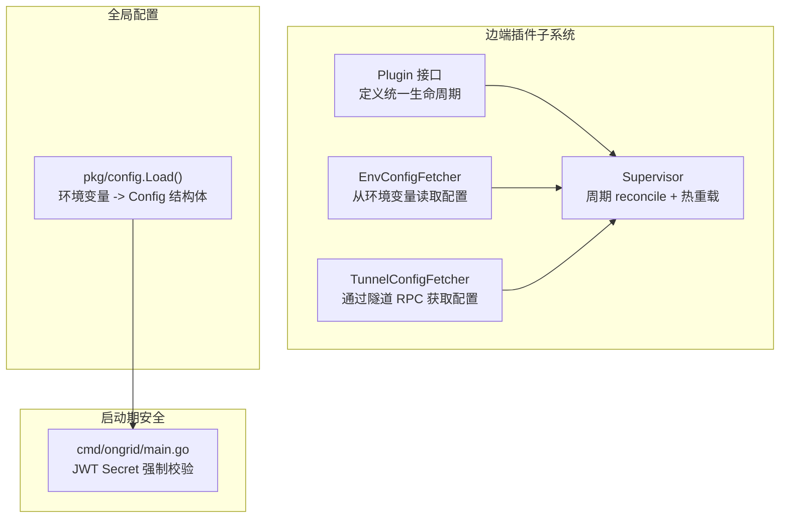
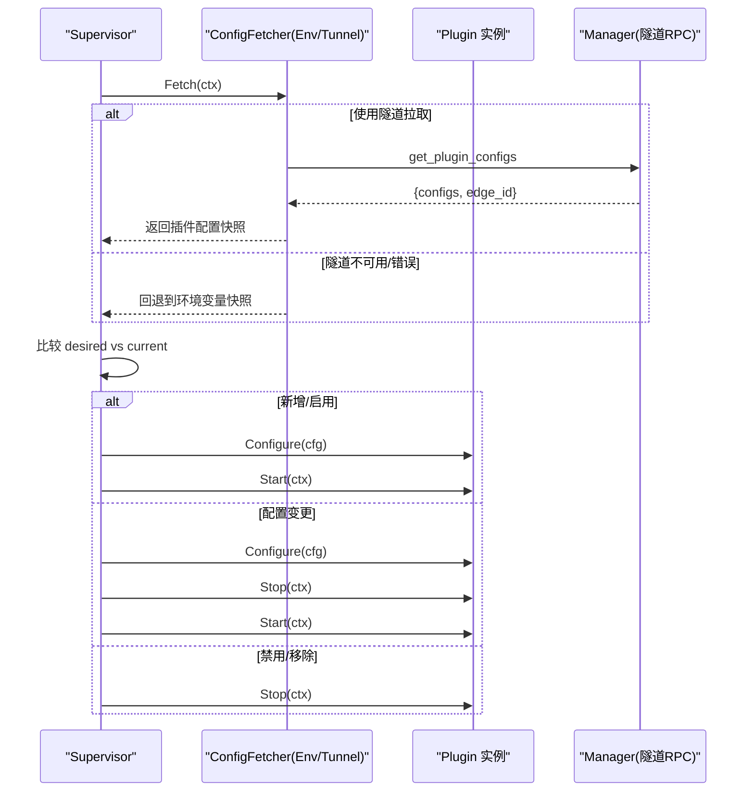
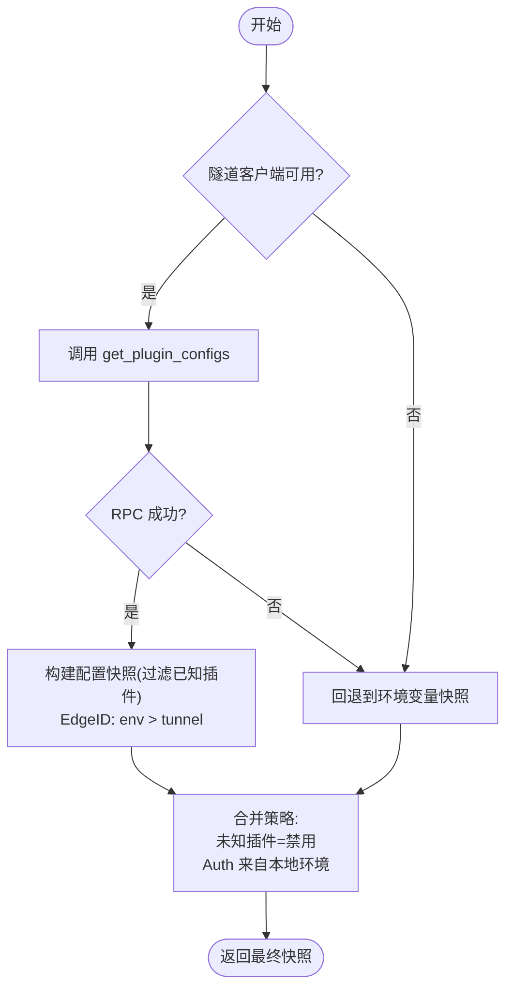
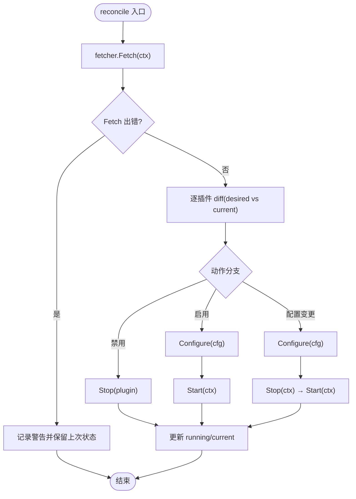
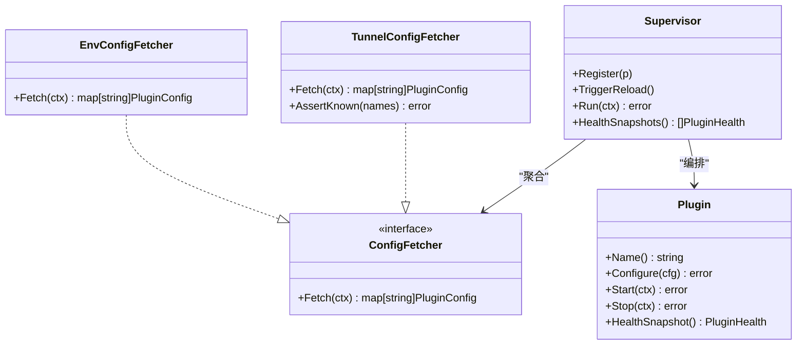

# 配置管理系统

<cite>
**本文引用的文件**   
- [internal/edgeagent/plugins/plugin.go](file://internal/edgeagent/plugins/plugin.go)
- [internal/edgeagent/plugins/config_env.go](file://internal/edgeagent/plugins/config_env.go)
- [internal/edgeagent/plugins/config_tunnel.go](file://internal/edgeagent/plugins/config_tunnel.go)
- [internal/edgeagent/plugins/supervisor.go](file://internal/edgeagent/plugins/supervisor.go)
- [internal/pkg/config/config.go](file://internal/pkg/config/config.go)
- [cmd/ongrid/main.go](file://cmd/ongrid/main.go)
</cite>

## 目录
1. [简介](#简介)
2. [项目结构](#项目结构)
3. [核心组件](#核心组件)
4. [架构总览](#架构总览)
5. [详细组件分析](#详细组件分析)
6. [依赖关系分析](#依赖关系分析)
7. [性能与可靠性考量](#性能与可靠性考量)
8. [故障排除指南](#故障排除指南)
9. [结论](#结论)
10. [附录：最佳实践与调试清单](#附录最佳实践与调试清单)

## 简介
本文件系统化梳理插件配置管理子系统，覆盖以下关键主题：
- 配置来源与优先级：环境变量、隧道推送（Manager 下发）与本地配置的合并策略
- 热重载机制：变更检测、增量更新与回滚策略
- 配置验证与默认值处理：类型检查、必填字段校验与安全参数过滤
- 敏感信息与加密保护：密钥管理、环境变量注入与配置文件加密
- 最佳实践、调试工具与故障排除

该子系统主要运行于边端进程 ongrid-edge，负责拉取并应用各插件（如 metrics/logs/traces）的配置，驱动插件生命周期。

## 项目结构
与插件配置相关的核心代码集中在 edgeagent 的 plugins 包以及全局运行时配置加载模块中：
- internal/edgeagent/plugins：插件接口、配置拉取器、Supervisor 调度器
- internal/pkg/config：全局运行时配置加载（环境变量到结构体）
- cmd/ongrid/main.go：启动期安全校验示例（JWT Secret 强制要求）

图表来源
- [internal/edgeagent/plugins/plugin.go:1-119](file://internal/edgeagent/plugins/plugin.go#L1-L119)
- [internal/edgeagent/plugins/config_env.go:1-101](file://internal/edgeagent/plugins/config_env.go#L1-L101)
- [internal/edgeagent/plugins/config_tunnel.go:1-138](file://internal/edgeagent/plugins/config_tunnel.go#L1-L138)
- [internal/edgeagent/plugins/supervisor.go:1-276](file://internal/edgeagent/plugins/supervisor.go#L1-L276)
- [internal/pkg/config/config.go:1-592](file://internal/pkg/config/config.go#L1-L592)
- [cmd/ongrid/main.go:282-303](file://cmd/ongrid/main.go#L282-L303)

章节来源
- [internal/edgeagent/plugins/plugin.go:1-119](file://internal/edgeagent/plugins/plugin.go#L1-L119)
- [internal/edgeagent/plugins/config_env.go:1-101](file://internal/edgeagent/plugins/config_env.go#L1-L101)
- [internal/edgeagent/plugins/config_tunnel.go:1-138](file://internal/edgeagent/plugins/config_tunnel.go#L1-L138)
- [internal/edgeagent/plugins/supervisor.go:1-276](file://internal/edgeagent/plugins/supervisor.go#L1-L276)
- [internal/pkg/config/config.go:1-592](file://internal/pkg/config/config.go#L1-L592)
- [cmd/ongrid/main.go:282-303](file://cmd/ongrid/main.go#L282-L303)

## 核心组件
- Plugin 接口：定义统一的 Configure/Start/Stop/HealthSnapshot 生命周期，供 Supervisor 编排
- ConfigFetcher 接口：抽象配置来源，支持 Env/Tunnel 两种实现
- EnvConfigFetcher：从环境变量按插件名前缀读取配置，提供离线/冷启动兜底
- TunnelConfigFetcher：通过隧道 RPC 拉取 Manager 下发的配置，失败时回退到 Env 快照
- Supervisor：周期性拉取配置，计算差异并执行增量更新；支持外部触发热重载
- pkg/config.Load()：集中解析环境变量为全局运行时配置，提供丰富默认值

章节来源
- [internal/edgeagent/plugins/plugin.go:1-119](file://internal/edgeagent/plugins/plugin.go#L1-L119)
- [internal/edgeagent/plugins/config_env.go:1-101](file://internal/edgeagent/plugins/config_env.go#L1-L101)
- [internal/edgeagent/plugins/config_tunnel.go:1-138](file://internal/edgeagent/plugins/config_tunnel.go#L1-L138)
- [internal/edgeagent/plugins/supervisor.go:1-276](file://internal/edgeagent/plugins/supervisor.go#L1-L276)
- [internal/pkg/config/config.go:1-592](file://internal/pkg/config/config.go#L1-L592)

## 架构总览
下图展示插件配置在边端的端到端流程：Supervisor 定时或收到信号后调用 ConfigFetcher.Fetch 获取最新快照，对比当前状态进行增量更新；当隧道不可用时自动回退到环境变量快照，保证服务可用。

图表来源
- [internal/edgeagent/plugins/supervisor.go:112-230](file://internal/edgeagent/plugins/supervisor.go#L112-L230)
- [internal/edgeagent/plugins/config_tunnel.go:54-108](file://internal/edgeagent/plugins/config_tunnel.go#L54-L108)
- [internal/edgeagent/plugins/config_env.go:46-71](file://internal/edgeagent/plugins/config_env.go#L46-L71)
- [internal/edgeagent/plugins/plugin.go:25-52](file://internal/edgeagent/plugins/plugin.go#L25-L52)

## 详细组件分析

### 组件一：配置来源与优先级机制
- 环境变量配置（EnvConfigFetcher）
  - 以插件名为前缀的环境变量键空间，包含 ENABLED、ENDPOINT、AUTH_USER/AUTH_PASS、SPEC_JSON 等
  - 未显式设置时，AUTH_USER/AUTH_PASS 可回退到边端隧道凭据（ACCESS_KEY/SECRET_KEY），减少重复配置
  - SPEC_JSON 为可选 JSON，解析失败会静默忽略，避免影响 Supervisor 稳定性
  - 所有已知插件均返回条目，未设置的插件视为禁用
- 隧道推送配置（TunnelConfigFetcher）
  - 通过隧道 RPC 获取 per-edge 配置，EdgeID 优先采用环境变量（便于多 Manager 开发场景）
  - 数据面认证信息不随 RPC 传输，由边端从环境变量填充，降低敏感信息泄露风险
  - 任何 RPC 错误都会回退到环境变量快照，确保断网/冷启动期间仍可维持合理默认
- 合并策略与优先级
  - 正常态：Tunnel 优先；异常态：Env 兜底
  - EdgeID 优先级：环境变量 > 隧道响应
  - 未知插件名会被过滤，防止越权或误配

图表来源
- [internal/edgeagent/plugins/config_tunnel.go:54-108](file://internal/edgeagent/plugins/config_tunnel.go#L54-L108)
- [internal/edgeagent/plugins/config_env.go:46-71](file://internal/edgeagent/plugins/config_env.go#L46-L71)

章节来源
- [internal/edgeagent/plugins/config_env.go:1-101](file://internal/edgeagent/plugins/config_env.go#L1-L101)
- [internal/edgeagent/plugins/config_tunnel.go:1-138](file://internal/edgeagent/plugins/config_tunnel.go#L1-L138)

### 组件二：热重载机制（变更检测、增量更新与回滚）
- 变更检测
  - Supervisor 定期（默认 60s）或收到 TriggerReload 信号后重新拉取配置快照
  - 使用 configEqual 对每个插件进行语义比较（Enabled/EdgeID/Endpoint/AuthUser/AuthPass/Spec）
- 增量更新
  - 新增/启用：Configure → Start
  - 配置变更：Configure → Stop → Start（带超时控制）
  - 禁用/移除：Stop
- 回滚策略
  - 若 Configure 失败，记录警告并跳过该插件，不影响其他插件
  - 若 Start 失败，保持上次成功状态，等待下次 reconcile
  - 退出时对所有插件执行受控 Stop，确保资源释放

图表来源
- [internal/edgeagent/plugins/supervisor.go:135-230](file://internal/edgeagent/plugins/supervisor.go#L135-L230)
- [internal/edgeagent/plugins/supervisor.go:253-275](file://internal/edgeagent/plugins/supervisor.go#L253-L275)

章节来源
- [internal/edgeagent/plugins/supervisor.go:1-276](file://internal/edgeagent/plugins/supervisor.go#L1-L276)

### 组件三：配置验证与默认值处理
- 类型检查与解析
  - 环境变量布尔/整型/浮点/时长解析具备容错，非法值回退默认
  - SPEC_JSON 解析失败静默忽略，避免崩溃
- 必填字段与安全性
  - 隧道路径下，数据面认证信息（AuthUser/AuthPass）由边端本地环境注入，不随 RPC 传输
  - 全局配置启动期安全校验示例：JWT Secret 必须替换默认值，否则拒绝启动
- 默认值体系
  - pkg/config.Load() 提供大量默认值，确保最小化配置即可运行
  - 插件侧默认：未显式启用的插件视为禁用，避免意外开启

章节来源
- [internal/pkg/config/config.go:366-486](file://internal/pkg/config/config.go#L366-L486)
- [internal/pkg/config/config.go:489-592](file://internal/pkg/config/config.go#L489-L592)
- [internal/edgeagent/plugins/config_env.go:73-100](file://internal/edgeagent/plugins/config_env.go#L73-L100)
- [cmd/ongrid/main.go:282-303](file://cmd/ongrid/main.go#L282-L303)

### 组件四：敏感信息与加密保护
- 密钥管理与注入
  - 隧道模式下，数据面认证凭据仅从本地环境变量注入，不落盘至 RPC 载荷
  - 环境变量作为注入通道，避免将敏感信息写入配置文件或数据库
- 配置文件加密
  - 当前仓库未发现针对插件 SPEC_JSON 的内置加密方案；建议结合部署平台能力（如容器编排 Secret、KMS）在启动前解密并注入环境变量
- 安全基线
  - 全局配置强约束：JWT Secret 必须替换默认值，否则拒绝启动，防止弱口令风险

章节来源
- [internal/edgeagent/plugins/config_tunnel.go:43-52](file://internal/edgeagent/plugins/config_tunnel.go#L43-L52)
- [internal/edgeagent/plugins/config_env.go:56-58](file://internal/edgeagent/plugins/config_env.go#L56-L58)
- [cmd/ongrid/main.go:282-303](file://cmd/ongrid/main.go#L282-L303)

## 依赖关系分析
- 组件耦合
  - Supervisor 依赖 ConfigFetcher 接口，解耦具体来源（Env/Tunnel）
  - TunnelConfigFetcher 依赖 tunnel.Client 与 EnvConfigFetcher 兜底
  - 插件实现依赖 Plugin 接口，被 Supervisor 统一编排
- 外部依赖
  - 隧道 RPC 用于远程配置下发
  - 环境变量用于本地注入与兜底
- 潜在循环依赖
  - 当前设计无循环依赖；接口隔离良好

图表来源
- [internal/edgeagent/plugins/plugin.go:18-52](file://internal/edgeagent/plugins/plugin.go#L18-L52)
- [internal/edgeagent/plugins/plugin.go:108-118](file://internal/edgeagent/plugins/plugin.go#L108-L118)
- [internal/edgeagent/plugins/config_env.go:36-41](file://internal/edgeagent/plugins/config_env.go#L36-L41)
- [internal/edgeagent/plugins/config_tunnel.go:36-52](file://internal/edgeagent/plugins/config_tunnel.go#L36-L52)
- [internal/edgeagent/plugins/supervisor.go:36-73](file://internal/edgeagent/plugins/supervisor.go#L36-L73)

章节来源
- [internal/edgeagent/plugins/plugin.go:1-119](file://internal/edgeagent/plugins/plugin.go#L1-L119)
- [internal/edgeagent/plugins/config_env.go:1-101](file://internal/edgeagent/plugins/config_env.go#L1-L101)
- [internal/edgeagent/plugins/config_tunnel.go:1-138](file://internal/edgeagent/plugins/config_tunnel.go#L1-L138)
- [internal/edgeagent/plugins/supervisor.go:1-276](file://internal/edgeagent/plugins/supervisor.go#L1-L276)

## 性能与可靠性考量
- 性能
  - 配置拉取频率可控（默认 60s），避免频繁 RPC 开销
  - 增量更新仅在配置变化时触发，减少不必要的重启
  - 健康快照收集轻量，适合心跳上报
- 可靠性
  - 隧道不可用自动回退环境变量，保障冷启动与网络分区下的可用性
  - 单插件失败不影响其他插件，提升整体鲁棒性
  - 停止/启动操作带超时控制，避免长时间阻塞

[本节为通用指导，无需特定文件引用]

## 故障排除指南
- 现象：插件未启动或频繁重启
  - 排查要点：
    - 确认环境变量是否按插件名前缀正确设置（ENABLED/ENDPOINT/AUTH_*）
    - 检查 SPEC_JSON 是否为合法 JSON
    - 查看 Supervisor 日志中的“configure failed”“start failed”提示
- 现象：隧道下发配置不生效
  - 排查要点：
    - 确认隧道客户端已建立连接
    - 核对 EdgeID 来源（env 优先）
    - 观察是否因 RPC 错误触发了环境变量回退
- 现象：认证失败
  - 排查要点：
    - 隧道模式：确认本地环境变量 DATAPLANE_USER/PASS 或 ACCESS_KEY/SECRET_KEY 是否正确
    - 环境变量模式：确认 AUTH_USER/AUTH_PASS 是否回退到隧道凭据
- 现象：全局配置导致启动失败
  - 排查要点：
    - JWT Secret 必须替换默认值，否则主进程拒绝启动

章节来源
- [internal/edgeagent/plugins/supervisor.go:135-230](file://internal/edgeagent/plugins/supervisor.go#L135-L230)
- [internal/edgeagent/plugins/config_tunnel.go:54-108](file://internal/edgeagent/plugins/config_tunnel.go#L54-L108)
- [internal/edgeagent/plugins/config_env.go:46-71](file://internal/edgeagent/plugins/config_env.go#L46-L71)
- [cmd/ongrid/main.go:282-303](file://cmd/ongrid/main.go#L282-L303)

## 结论
插件配置管理子系统通过接口抽象与环境变量/隧道双源拉取，实现了高可用与灵活性的平衡。Supervisor 的增量更新与回退策略保障了热重载的安全性与连续性。配合严格的默认值与启动期安全校验，系统在易用性与安全性之间取得良好折衷。后续可在配置加密、审计与更细粒度的权限控制方面持续演进。

[本节为总结性内容，无需特定文件引用]

## 附录：最佳实践与调试清单
- 最佳实践
  - 生产环境务必替换 JWT Secret 等敏感默认值
  - 优先使用隧道下发配置，环境变量作为兜底
  - 将敏感信息通过环境变量注入，避免落盘
  - 使用规范的插件命名与键空间，避免冲突
- 调试清单
  - 打印 Supervisor 的 reconcile 快照日志，确认期望状态
  - 检查 TunnelConfigFetcher.AssertKnown 输出，确认插件白名单
  - 验证 SPEC_JSON 合法性，必要时简化为最小可用集
  - 监控插件 HealthSnapshot，关注 LastError 与 RestartCount

[本节为通用指导，无需特定文件引用]