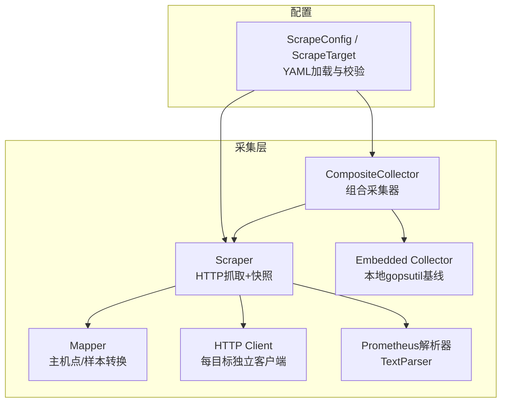
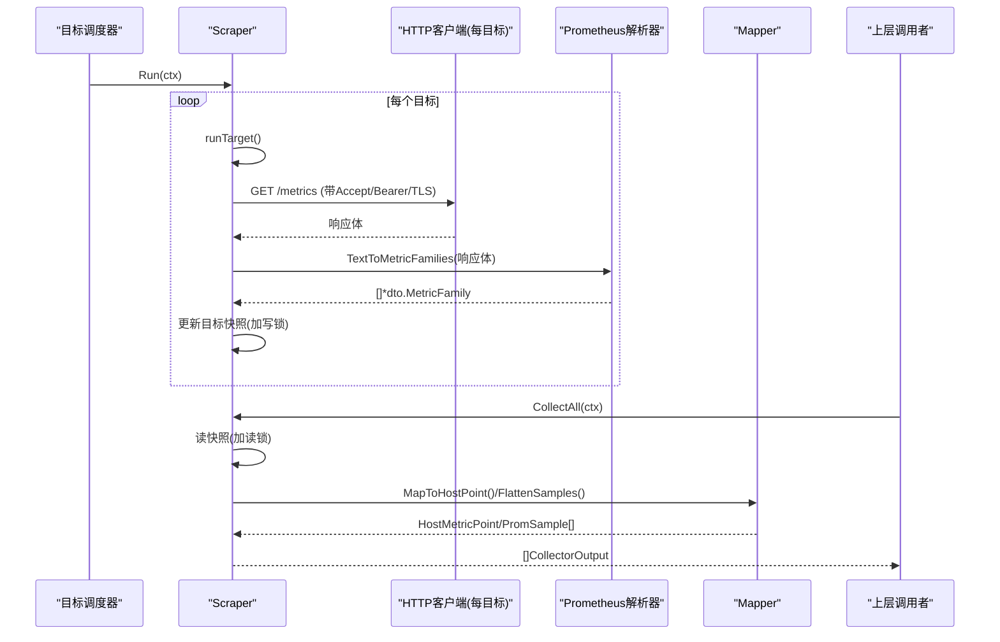
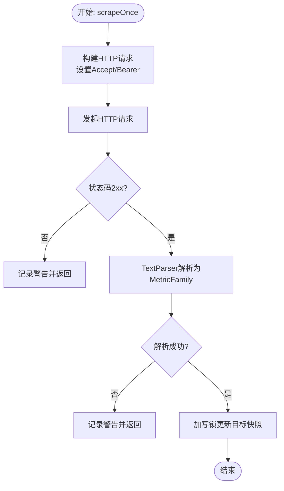
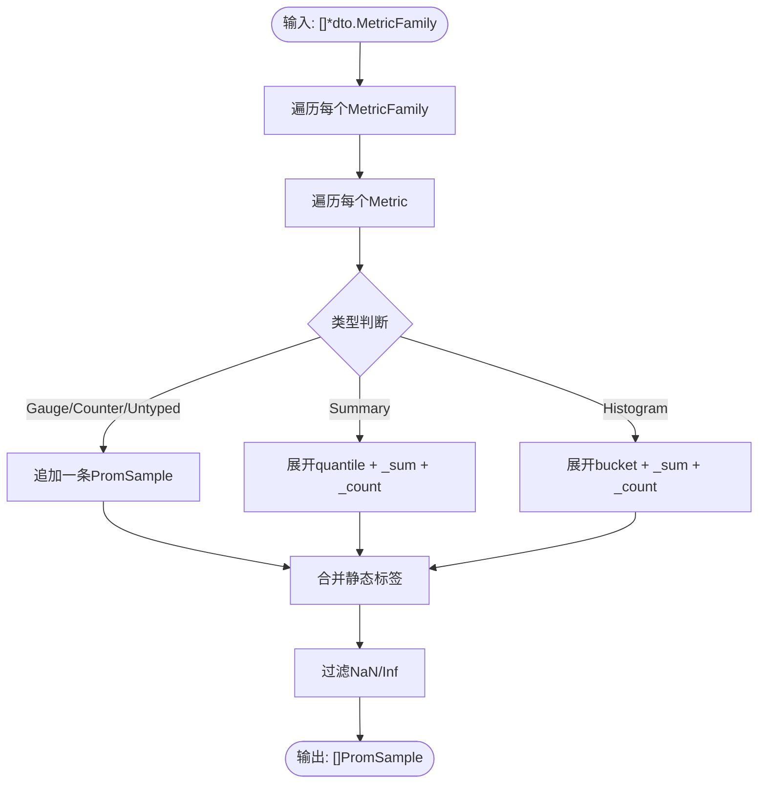
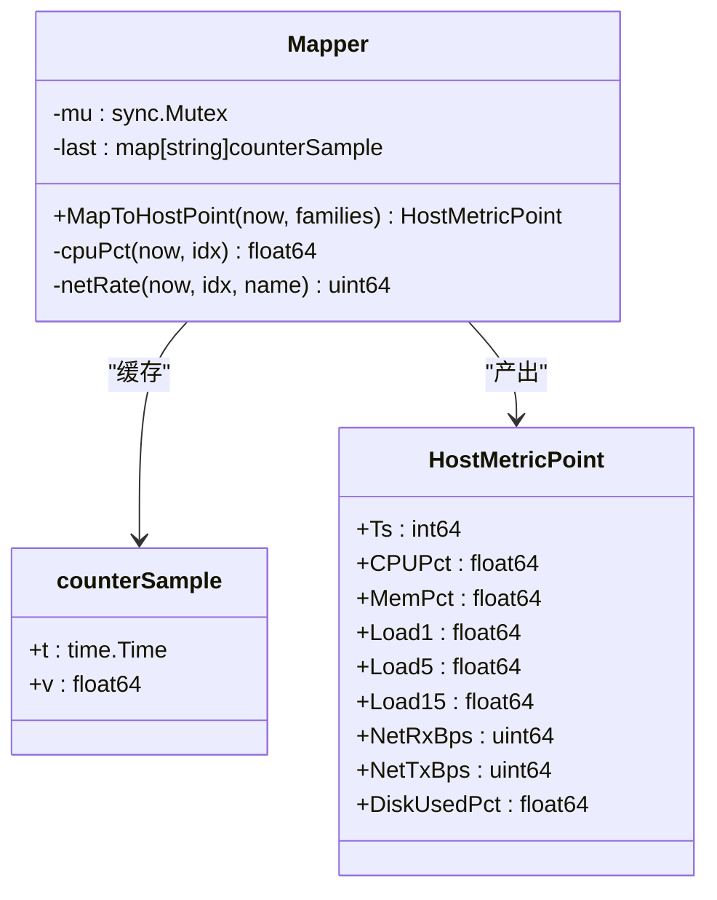
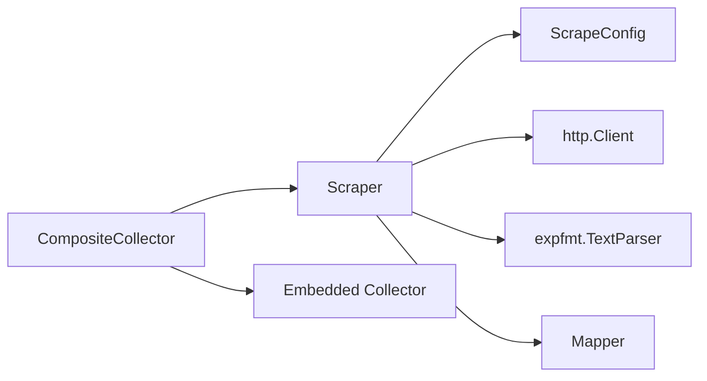

# Scrape采集器

<cite>
**本文引用的文件**   
- [scrape.go](file://internal/edgeagent/collector/scrape.go)
- [mapper.go](file://internal/edgeagent/collector/mapper.go)
- [types.go](file://internal/edgeagent/collector/types.go)
- [scrapecfg.go](file://internal/edgeagent/collector/scrapecfg.go)
- [composite.go](file://internal/edgeagent/collector/composite.go)
</cite>

## 目录
1. [简介](#简介)
2. [项目结构](#项目结构)
3. [核心组件](#核心组件)
4. [架构总览](#架构总览)
5. [详细组件分析](#详细组件分析)
6. [依赖关系分析](#依赖关系分析)
7. [性能考虑](#性能考虑)
8. [故障排查指南](#故障排查指南)
9. [结论](#结论)
10. [附录](#附录)

## 简介
本文件面向Scrape采集器的设计与实现，系统性阐述以下主题：
- HTTP目标抓取机制：多目标并发、连接池与超时控制
- Prometheus格式解析与MetricFamily处理流程
- 目标快照管理与线程安全设计
- Bearer Token认证与TLS配置选项
- 映射器（Mapper）工作原理：将原始指标转换为统一格式
- 配置示例与性能调优建议

## 项目结构
Scrape采集器位于内部边缘代理的采集模块中，围绕“按目标并发抓取→解析→快照存储→输出”的主线组织。关键文件职责如下：
- scrape.go：Scraper主逻辑，负责HTTP抓取、解析、快照更新与CollectAll输出
- mapper.go：Mapper负责从MetricFamily提取主机级8字段点以及将MetricFamily展平为PromSample
- types.go：定义Collector接口、CollectorOutput、Source等公共类型
- scrapecfg.go：ScrapeConfig与ScrapeTarget的配置加载与默认值填充
- composite.go：CompositeCollector组合嵌入式采集器与Scrape采集器，提供自动回退策略

图示来源
- [composite.go:1-92](file://internal/edgeagent/collector/composite.go#L1-L92)
- [scrape.go:1-415](file://internal/edgeagent/collector/scrape.go#L1-L415)
- [mapper.go:1-373](file://internal/edgeagent/collector/mapper.go#L1-L373)
- [scrapecfg.go:1-91](file://internal/edgeagent/collector/scrapecfg.go#L1-L91)

章节来源
- [scrape.go:1-415](file://internal/edgeagent/collector/scrape.go#L1-L415)
- [mapper.go:1-373](file://internal/edgeagent/collector/mapper.go#L1-L373)
- [types.go:1-58](file://internal/edgeagent/collector/types.go#L1-L58)
- [scrapecfg.go:1-91](file://internal/edgeagent/collector/scrapecfg.go#L1-L91)
- [composite.go:1-92](file://internal/edgeagent/collector/composite.go#L1-L92)

## 核心组件
- Scraper：驱动每个目标的定时抓取，维护每目标最近一次成功的MetricFamily快照，并提供CollectAll输出
- Mapper：从MetricFamily计算主机级8字段点（CPU%、内存使用率、负载、磁盘使用率、网络收发速率），并将MetricFamily展平为PromSample
- CompositeCollector：组合嵌入式采集器与Scrape采集器，当存在host角色抓取成功时优先使用其快速路径，否则回退到嵌入式基线
- ScrapeConfig/ScrapeTarget：描述目标URL、角色、间隔、超时、Bearer Token文件、TLS跳过验证、静态标签等

章节来源
- [scrape.go:29-77](file://internal/edgeagent/collector/scrape.go#L29-L77)
- [mapper.go:16-62](file://internal/edgeagent/collector/mapper.go#L16-L62)
- [composite.go:10-55](file://internal/edgeagent/collector/composite.go#L10-L55)
- [scrapecfg.go:12-49](file://internal/edgeagent/collector/scrapecfg.go#L12-L49)

## 架构总览
Scrape采集器采用“每目标一协程”的并发模型，配合errgroup进行生命周期管理；每个目标拥有独立的http.Client以复用连接并隔离TLS/认证参数；响应体经Prometheus文本格式解析后写入带读写锁保护的快照表；上层通过CollectAll读取快照并生成CollectorOutput。

图示来源
- [scrape.go:79-113](file://internal/edgeagent/collector/scrape.go#L79-L113)
- [scrape.go:117-183](file://internal/edgeagent/collector/scrape.go#L117-L183)
- [scrape.go:185-226](file://internal/edgeagent/collector/scrape.go#L185-L226)
- [mapper.go:40-137](file://internal/edgeagent/collector/mapper.go#L40-L137)

## 详细组件分析

### Scraper：HTTP抓取、并发与快照
- 并发模型
  - Run使用errgroup为每个目标启动一个协程，分别执行runTarget循环
  - runTarget先立即触发一次抓取，随后基于Interval定时器周期性抓取
- HTTP请求与认证
  - 设置Accept为Prometheus文本格式
  - 若配置了BearerTokenFile，则读取文件内容并注入Authorization头
  - 非2xx状态码会记录警告并丢弃响应体
- 解析与快照
  - 使用TextParser将响应体解析为MetricFamily集合
  - 将结果转为有序切片以保证可测试性
  - 在写锁保护下更新该目标的targetSnapshot（包含families、时间戳、source、role）
- 输出
  - CollectAll在读锁保护下遍历快照，结合StaticLabels与Mapper生成CollectorOutput
  - 对host角色的目标，额外计算HostMetricPoint并标记有效

图示来源
- [scrape.go:117-183](file://internal/edgeagent/collector/scrape.go#L117-L183)

章节来源
- [scrape.go:79-113](file://internal/edgeagent/collector/scrape.go#L79-L113)
- [scrape.go:117-183](file://internal/edgeagent/collector/scrape.go#L117-L183)
- [scrape.go:185-226](file://internal/edgeagent/collector/scrape.go#L185-L226)

### 连接池与超时控制
- 每目标独立http.Client，内置Transport：
  - MaxIdleConns与MaxIdleConnsPerHost限制空闲连接数
  - IdleConnTimeout控制空闲连接回收
  - TLSClientConfig强制最低TLS版本，支持可选跳过证书校验
  - Client.Timeout等于目标配置的Timeout
- 效果
  - 同一目标复用连接，减少握手开销
  - 不同目标之间隔离，避免相互影响
  - 整体超时受目标级别Timeout约束

章节来源
- [scrape.go:360-377](file://internal/edgeagent/collector/scrape.go#L360-L377)
- [scrapecfg.go:36-49](file://internal/edgeagent/collector/scrapecfg.go#L36-L49)

### Bearer Token认证与TLS配置
- Bearer Token
  - 通过BearerTokenFile指定令牌文件路径
  - 首次抓取前读取文件内容并注入Authorization头
  - 读取失败仅记录警告，不影响后续抓取
- TLS
  - 默认启用TLS且要求最小版本
  - 可通过TLSInsecure跳过证书校验（适用于自签名场景）

章节来源
- [scrape.go:130-139](file://internal/edgeagent/collector/scrape.go#L130-L139)
- [scrape.go:363-377](file://internal/edgeagent/collector/scrape.go#L363-L377)
- [scrapecfg.go:40-49](file://internal/edgeagent/collector/scrapecfg.go#L40-L49)

### Prometheus格式解析与MetricFamily处理
- 解析
  - 使用TextParser将文本格式响应体解析为MetricFamily集合
  - 将map转有序切片，保证顺序稳定
- 展平为PromSample
  - Gauge/Counter/Untyped直接映射为单条样本
  - Summary展开为各分位点样本，并附带_sum/_count
  - Histogram展开为_bucket样本，并附带_sum/_count
  - 合并静态标签（不覆盖已有键）
  - 过滤NaN/Inf以避免JSON序列化问题

图示来源
- [mapper.go:64-137](file://internal/edgeagent/collector/mapper.go#L64-L137)

章节来源
- [scrape.go:164-173](file://internal/edgeagent/collector/scrape.go#L164-L173)
- [mapper.go:64-137](file://internal/edgeagent/collector/mapper.go#L64-L137)

### 目标快照管理与线程安全
- 数据结构
  - snapshot map[string]targetSnapshot，key为目标名，value包含families、at、source、role
- 并发安全
  - 写操作（scrapeOnce更新快照）使用互斥锁
  - 读操作（CollectAll、GetHostLoad）使用读写锁的读段
- 稳定性
  - familiesToSlice对名称排序，确保测试与输出的确定性

章节来源
- [scrape.go:46-56](file://internal/edgeagent/collector/scrape.go#L46-L56)
- [scrape.go:175-183](file://internal/edgeagent/collector/scrape.go#L175-L183)
- [scrape.go:185-226](file://internal/edgeagent/collector/scrape.go#L185-L226)
- [scrape.go:400-414](file://internal/edgeagent/collector/scrape.go#L400-L414)

### 映射器（Mapper）工作原理
- 主机级8字段点
  - CPU%：基于node_cpu_seconds_total计数器差值计算busy比例
  - 内存使用率：优先使用MemAvailable，否则回退到MemFree+Buffers+Cached
  - 负载：读取node_load1/5/15
  - 磁盘使用率：匹配mountpoint="/"的filesystem size/avail计算
  - 网络收发速率：基于node_network_receive/transmit_bytes_total计数器差值，排除lo设备
- 线程安全
  - 内部使用互斥锁串行化访问，保证上次快照一致性
- 速率计算
  - 缓存每条计数器的历史值，按时间差计算速率
  - 首次调用返回0，后续基于差值计算

图示来源
- [mapper.go:16-62](file://internal/edgeagent/collector/mapper.go#L16-L62)
- [mapper.go:233-307](file://internal/edgeagent/collector/mapper.go#L233-L307)

章节来源
- [mapper.go:40-62](file://internal/edgeagent/collector/mapper.go#L40-L62)
- [mapper.go:233-307](file://internal/edgeagent/collector/mapper.go#L233-L307)

### 组合采集器（CompositeCollector）
- 行为
  - 优先收集Scrape采集器的输出
  - 若存在host角色抓取成功，则使用其快速路径；否则回退到嵌入式采集器
  - HostInfo/GetProcessList优先走嵌入式采集器，GetHostLoad优先走Scrape采集器，若无数据再回退
- 价值
  - 在具备高质量上游指标时提升准确性与丰富度
  - 在无外部指标时保持基本能力可用

章节来源
- [composite.go:10-55](file://internal/edgeagent/collector/composite.go#L10-L55)
- [composite.go:57-91](file://internal/edgeagent/collector/composite.go#L57-L91)

## 依赖关系分析
- 组件耦合
  - Scraper依赖ScrapeConfig、HTTP客户端、Prometheus解析器与Mapper
  - CompositeCollector聚合Scraper与嵌入式采集器，承担路由与回退逻辑
- 外部依赖
  - gopsutil用于HostInfo/GetProcessList（嵌入式路径）
  - errgroup用于并发编排
  - expfmt用于Prometheus文本格式解析
  - crypto/tls/net/http用于HTTPS与安全传输

图示来源
- [scrape.go:1-27](file://internal/edgeagent/collector/scrape.go#L1-L27)
- [composite.go:1-25](file://internal/edgeagent/collector/composite.go#L1-L25)

章节来源
- [scrape.go:1-27](file://internal/edgeagent/collector/scrape.go#L1-L27)
- [composite.go:1-25](file://internal/edgeagent/collector/composite.go#L1-L25)

## 性能考虑
- 并发与吞吐
  - 每目标一协程，适合大量低延迟目标；注意系统goroutine上限与I/O压力
- 连接复用
  - 每目标独立Client，合理设置MaxIdleConns/MaxIdleConnsPerHost与IdleConnTimeout
- 超时控制
  - 目标级Timeout需小于或等于调度周期，避免堆积
- 解析与内存
  - MetricFamily展平会产生较多PromSample，关注峰值内存占用
- 速率计算
  - 计数器差值计算需要稳定的采样间隔；过短间隔可能放大抖动

[本节为通用指导，无需特定文件引用]

## 故障排查指南
- 抓取失败
  - 检查URL可达性与状态码；非2xx会记录警告
  - 确认BearerTokenFile可读且非空
  - 检查TLS配置，必要时临时开启tls_insecure定位证书问题
- 解析异常
  - 确认上游输出符合Prometheus文本格式
  - 关注日志中的parse failed警告
- 指标缺失
  - host角色需暴露node_*系列指标；component角色仅需Prom样本
  - 检查StaticLabels是否被正确合并
- 性能问题
  - 调整Interval与Timeout
  - 评估并发目标数量与连接池参数

章节来源
- [scrape.go:145-172](file://internal/edgeagent/collector/scrape.go#L145-L172)
- [scrape.go:130-139](file://internal/edgeagent/collector/scrape.go#L130-L139)
- [scrape.go:363-377](file://internal/edgeagent/collector/scrape.go#L363-L377)

## 结论
Scrape采集器通过“每目标并发抓取+独立连接+严格超时”的设计，在保证稳定性的同时提供了高扩展性；借助Mapper将异构指标标准化为主机点与Prom样本，并通过CompositeCollector实现与嵌入式采集器的无缝协作。合理的配置与调优可在复杂环境中获得可靠的观测数据。

[本节为总结性内容，无需特定文件引用]

## 附录

### 配置项说明（ScrapeConfig/ScrapeTarget）
- targets：目标列表
- name：目标标识，作为Source前缀
- url：绝对URL（http/https）
- role：host/component，默认component
- interval：抓取间隔，默认30秒
- timeout：单次抓取超时，默认10秒
- bearer_token_file：Bearer令牌文件路径
- tls_insecure：是否跳过证书校验
- static_labels：静态标签，与指标标签合并（不覆盖已有键）

章节来源
- [scrapecfg.go:12-49](file://internal/edgeagent/collector/scrapecfg.go#L12-L49)
- [scrapecfg.go:51-91](file://internal/edgeagent/collector/scrapecfg.go#L51-L91)

### 配置示例
以下为典型scrape.yaml结构示意（字段含义见上节）：
- targets:
  - name: kubelet
    url: https://127.0.0.1:10250/metrics
    role: host
    interval: 15s
    timeout: 5s
    bearer_token_file: /var/run/secrets/kubelet-token
    tls_insecure: true
    static_labels:
      cluster: prod
  - name: app-exporter
    url: http://10.0.0.5:9100/metrics
    role: component
    interval: 30s
    timeout: 10s
    static_labels:
      service: payments

[本节为概念性示例，无需特定文件引用]

### 性能调优清单
- 根据目标数量与延迟特性调整并发与连接池大小
- 合理设置interval与timeout，避免长尾任务阻塞
- 对host角色目标，确保暴露node_*指标以获得准确主机负载
- 监控内存与CPU占用，必要时降低采样频率或精简static_labels

[本节为通用指导，无需特定文件引用]