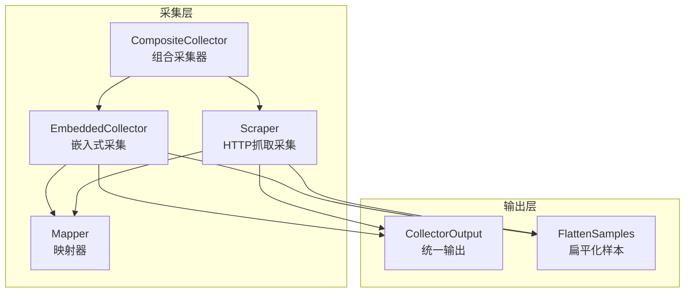
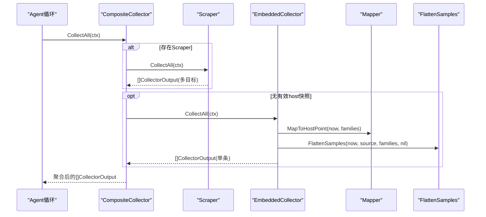
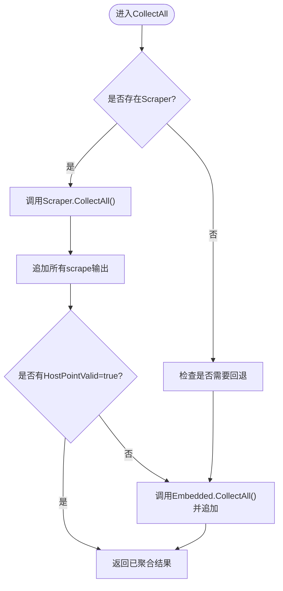
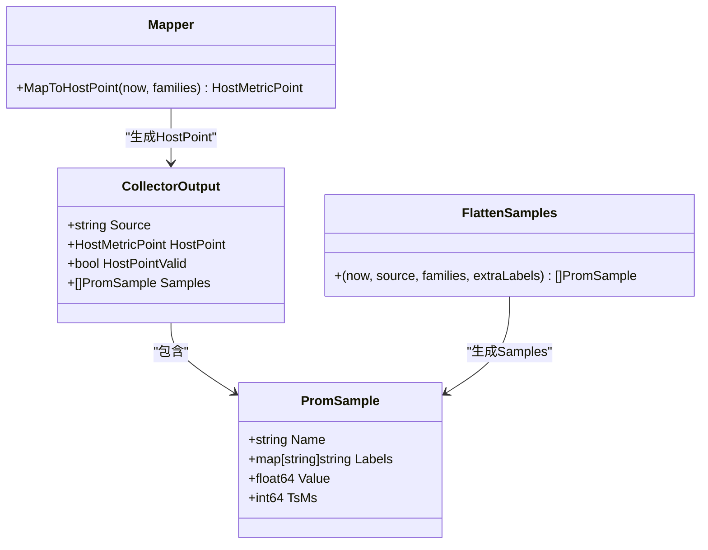
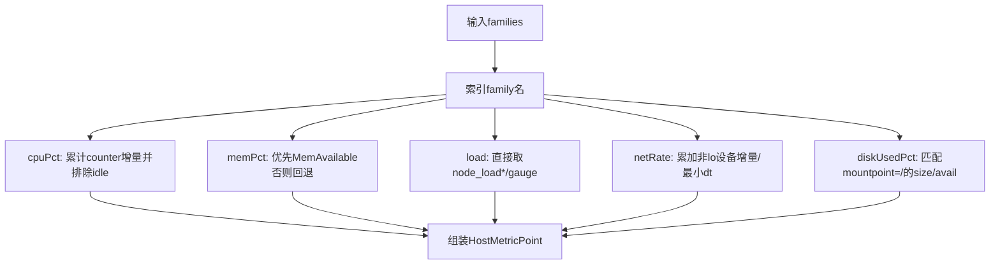
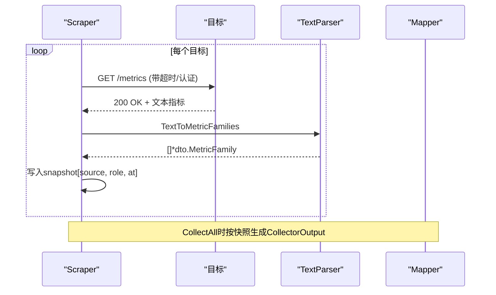
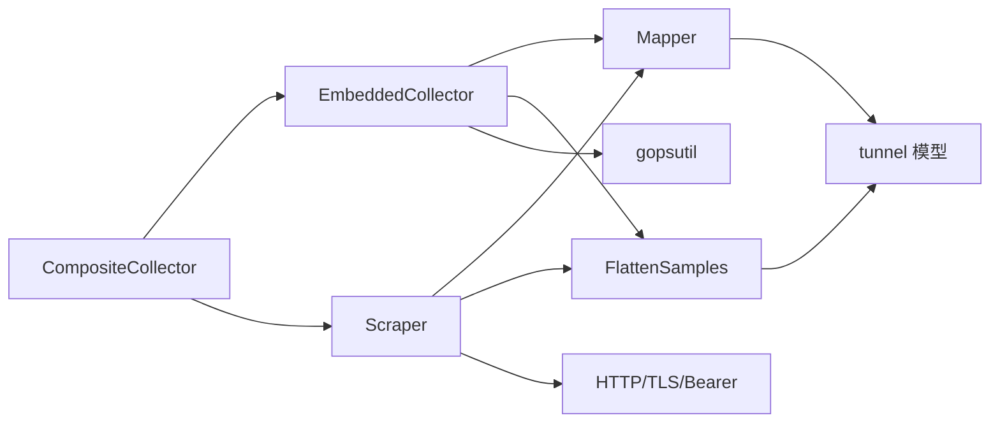

# 复合采集器

<cite>
**本文引用的文件**   
- [composite.go](file://internal/edgeagent/collector/composite.go)
- [types.go](file://internal/edgeagent/collector/types.go)
- [scrape.go](file://internal/edgeagent/collector/scrape.go)
- [embedded.go](file://internal/edgeagent/collector/embedded.go)
- [mapper.go](file://internal/edgeagent/collector/mapper.go)
</cite>

## 目录
1. [简介](#简介)
2. [项目结构](#项目结构)
3. [核心组件](#核心组件)
4. [架构总览](#架构总览)
5. [详细组件分析](#详细组件分析)
6. [依赖关系分析](#依赖关系分析)
7. [性能考量](#性能考量)
8. [故障排查指南](#故障排查指南)
9. [结论](#结论)
10. [附录：扩展新采集源规范与最佳实践](#附录扩展新采集源规范与最佳实践)

## 简介
本文件面向“复合采集器”（Composite Collector）的架构设计与实现细节，聚焦以下目标：
- 解释 CompositeCollector 的组合策略与统一调度方式
- 说明 CollectorOutput 的统一数据模型与 FlattenSamples 的扁平化逻辑
- 阐述 Source 标识符生成规则与角色标签管理
- 梳理错误处理与重试机制、采集结果聚合策略
- 提供扩展新采集源的接口规范与最佳实践

## 项目结构
复合采集器位于 edge agent 的采集子系统 internal/edgeagent/collector 中，采用“组合模式”将本地嵌入式采集与远程 scrape 采集统一抽象为同一接口。

图表来源
- [composite.go:1-92](file://internal/edgeagent/collector/composite.go#L1-L92)
- [embedded.go:1-73](file://internal/edgeagent/collector/embedded.go#L1-L73)
- [scrape.go:1-56](file://internal/edgeagent/collector/scrape.go#L1-L56)
- [mapper.go:1-137](file://internal/edgeagent/collector/mapper.go#L1-L137)
- [types.go:1-58](file://internal/edgeagent/collector/types.go#L1-L58)

章节来源
- [composite.go:1-92](file://internal/edgeagent/collector/composite.go#L1-L92)
- [types.go:1-58](file://internal/edgeagent/collector/types.go#L1-L58)

## 核心组件
- 统一接口与输出
  - Collector 接口定义了 CollectAll、HostInfo、GetHostLoad、GetProcessList 四个能力，屏蔽不同采集源差异。
  - CollectorOutput 是统一的单次采集产物，包含 Source、HostPoint（快速路径）、HostPointValid、Samples（开放集合）。
- 组合采集器
  - CompositeCollector 组合 EmbeddedCollector 与 Scraper，按策略选择 host 级快速路径来源并聚合多目标输出。
- 嵌入式采集
  - EmbeddedCollector 通过 gopsutil 读取主机指标，产出 node_exporter 兼容的 MetricFamily，再经 Mapper 生成 HostPoint 与 Samples。
- HTTP 抓取采集
  - Scraper 对多个目标并行抓取 Prometheus 文本格式指标，维护每目标的最近一次快照，并在 CollectAll 时转换为 CollectorOutput。
- 映射与扁平化
  - Mapper 负责从 MetricFamily 提取 8 字段 HostMetricPoint（CPU%、内存使用率、负载、网络速率、磁盘使用率等），并对计数器做增量速率计算。
  - FlattenSamples 将 MetricFamily 展平为 tunnel.PromSample 列表，支持 Gauge/Counter/Untyped/Histogram/Summary 类型，并合并静态标签。

章节来源
- [types.go:1-58](file://internal/edgeagent/collector/types.go#L1-L58)
- [composite.go:1-92](file://internal/edgeagent/collector/composite.go#L1-L92)
- [embedded.go:1-73](file://internal/edgeagent/collector/embedded.go#L1-L73)
- [scrape.go:1-56](file://internal/edgeagent/collector/scrape.go#L1-L56)
- [mapper.go:1-137](file://internal/edgeagent/collector/mapper.go#L1-L137)

## 架构总览
复合采集器的整体流程如下：
- 启动阶段：构建 CompositeCollector，内部持有 EmbeddedCollector 与 Scraper；若启用 scrape，则启动后台任务定期抓取各目标。
- 采集阶段：CompositeCollector.CollectAll 先收集所有 scrape 输出，若无有效的 host-role 快照则回退到 embedded 基线。
- 输出阶段：每个 CollectorOutput 携带 Source 标识与 Samples；host-role 的快照还会填充 HostPoint 以支持快速路径。

图表来源
- [composite.go:27-55](file://internal/edgeagent/collector/composite.go#L27-L55)
- [scrape.go:185-226](file://internal/edgeagent/collector/scrape.go#L185-L226)
- [embedded.go:53-73](file://internal/edgeagent/collector/embedded.go#L53-L73)
- [mapper.go:40-62](file://internal/edgeagent/collector/mapper.go#L40-L62)
- [mapper.go:64-137](file://internal/edgeagent/collector/mapper.go#L64-L137)

## 详细组件分析

### 组合策略与聚合逻辑（CompositeCollector）
- 组合策略
  - 优先使用 scrape 产出的 host-role 快照作为快速路径来源；当 scrape 尚未成功或无 host-role 快照时，回退到 embedded 基线。
- 聚合行为
  - 将所有 scrape 输出追加到结果集；必要时追加 embedded 输出，保证至少有一条 host 级快速路径可用。
- 辅助方法
  - HostInfo/GetHostLoad/GetProcessList 在 scraper 与 embedded 之间进行优先级选择，确保云侧查询能拿到合理值。

图表来源
- [composite.go:27-55](file://internal/edgeagent/collector/composite.go#L27-L55)

章节来源
- [composite.go:1-92](file://internal/edgeagent/collector/composite.go#L1-L92)

### 统一数据结构与扁平化（CollectorOutput 与 FlattenSamples）
- CollectorOutput
  - Source：标识数据来源（embedded 或 scrape:<target_name>）
  - HostPoint：8 字段的快速路径（CPUPct、MemPct、Load1/5/15、NetRxBps/TxBps、DiskUsedPct）
  - HostPointValid：是否具备有效的快速路径
  - Samples：开放集合的扁平样本列表
- FlattenSamples
  - 输入：当前时间、Source、MetricFamily 列表、可选静态标签
  - 输出：tunnel.PromSample 列表
  - 类型处理：
    - Gauge/Counter/Untyped：直接采样
    - Histogram：展开 _bucket + _sum + _count
    - Summary：展开 quantile + _sum + _count
  - 标签合并：extraLabels 覆盖但不覆盖已有键（生产者标签优先）
  - 数值过滤：NaN/Inf 被丢弃以避免 JSON 编码问题

图表来源
- [types.go:21-36](file://internal/edgeagent/collector/types.go#L21-L36)
- [mapper.go:64-137](file://internal/edgeagent/collector/mapper.go#L64-L137)

章节来源
- [types.go:1-58](file://internal/edgeagent/collector/types.go#L1-L58)
- [mapper.go:64-137](file://internal/edgeagent/collector/mapper.go#L64-L137)

### Source 标识符与角色标签管理
- Source 生成规则
  - 嵌入式：固定为 "embedded"
  - 抓取式：前缀 "scrape:" 拼接目标名称
- 角色标签（role）
  - 仅 role 为 host 的目标才会生成 HostPoint 并标记 HostPointValid=true
  - component 角色目标仅提供 Samples，不产生快速路径

章节来源
- [types.go:9-19](file://internal/edgeagent/collector/types.go#L9-L19)
- [scrape.go:175-182](file://internal/edgeagent/collector/scrape.go#L175-L182)
- [scrape.go:219-222](file://internal/edgeagent/collector/scrape.go#L219-L222)

### 快速路径映射（Mapper）
- 功能
  - 从 node_exporter 命名规范的 MetricFamily 中提取 8 字段 HostMetricPoint
  - 对计数器（如 CPU、网络字节）维护上次快照，计算差值与时间间隔得到速率
- 关键算法
  - CPU 使用率：基于 per-cpu+per-mode 的 counter 增量，idle 单独统计
  - 内存使用率：优先 MemAvailable，否则用 MemFree+Buffers+Cached 近似
  - 磁盘使用率：匹配 mountpoint="/" 的 size/avail 计算
  - 网络速率：累加非 lo 设备的字节增量，除以最小 dt

图表来源
- [mapper.go:40-62](file://internal/edgeagent/collector/mapper.go#L40-L62)
- [mapper.go:227-307](file://internal/edgeagent/collector/mapper.go#L227-L307)
- [mapper.go:175-206](file://internal/edgeagent/collector/mapper.go#L175-L206)

章节来源
- [mapper.go:1-373](file://internal/edgeagent/collector/mapper.go#L1-L373)

### 嵌入式采集（EmbeddedCollector）
- 数据采集
  - 通过 gopsutil 读取 CPU、内存、负载、网络、文件系统、时间等指标，构造 node_exporter 兼容的 MetricFamily
- 输出
  - 使用 Mapper 生成 HostPoint，并使用 FlattenSamples 生成 Samples
  - 始终标记 HostPointValid=true（只要 snapshot 非空）

章节来源
- [embedded.go:1-73](file://internal/edgeagent/collector/embedded.go#L1-L73)
- [embedded.go:176-235](file://internal/edgeagent/collector/embedded.go#L176-L235)

### 抓取采集（Scraper）
- 运行模型
  - 每个目标一个 goroutine，按 Interval 周期抓取，首次立即执行一次
  - 使用 errgroup 管理生命周期，单个目标失败不影响其他目标
- 抓取流程
  - 构建请求（支持 TLS、Bearer Token 文件）
  - 解析响应为 MetricFamily，更新 per-target 快照（source、role、at）
- 输出
  - CollectAll 遍历快照，为每个目标生成 CollectorOutput
  - 仅 role=host 的目标生成 HostPoint 并标记有效

图表来源
- [scrape.go:79-113](file://internal/edgeagent/collector/scrape.go#L79-L113)
- [scrape.go:115-183](file://internal/edgeagent/collector/scrape.go#L115-L183)
- [scrape.go:185-226](file://internal/edgeagent/collector/scrape.go#L185-L226)

章节来源
- [scrape.go:1-415](file://internal/edgeagent/collector/scrape.go#L1-L415)

## 依赖关系分析
- 组件耦合
  - CompositeCollector 依赖 EmbeddedCollector 与 Scraper，二者均依赖 Mapper 与 FlattenSamples
  - Scraper 依赖 HTTP 客户端与 expfmt 解析器
  - EmbeddedCollector 依赖 gopsutil 系统 API
- 外部依赖
  - Prometheus client_model/expfmt：用于标准指标模型与文本解析
  - gopsutil：跨平台系统指标读取
  - tunnel 包：定义 HostInfo、HostMetricPoint、PromSample 等传输结构

图表来源
- [composite.go:1-25](file://internal/edgeagent/collector/composite.go#L1-L25)
- [embedded.go:1-24](file://internal/edgeagent/collector/embedded.go#L1-L24)
- [scrape.go:1-27](file://internal/edgeagent/collector/scrape.go#L1-L27)
- [mapper.go:1-14](file://internal/edgeagent/collector/mapper.go#L1-L14)
- [types.go:1-7](file://internal/edgeagent/collector/types.go#L1-L7)

章节来源
- [composite.go:1-92](file://internal/edgeagent/collector/composite.go#L1-L92)
- [embedded.go:1-403](file://internal/edgeagent/collector/embedded.go#L1-L403)
- [scrape.go:1-415](file://internal/edgeagent/collector/scrape.go#L1-L415)
- [mapper.go:1-373](file://internal/edgeagent/collector/mapper.go#L1-L373)
- [types.go:1-58](file://internal/edgeagent/collector/types.go#L1-L58)

## 性能考量
- 并发与隔离
  - Scraper 为每个目标独立 goroutine，errgroup 统一管理，单个目标失败不影响全局
- 状态缓存
  - Mapper 维护计数器上次快照，避免重复计算；按 metric_name+排序标签串作为 key，保证稳定
- 速率计算
  - 网络速率使用最小 dt 归一化，减少抖动影响
- 资源裁剪
  - EmbeddedCollector 仅产出 fast path 所需的最小指标子集，降低开销
- 连接复用
  - Scraper 为每个目标创建 http.Client，默认开启 keep-alive，减少握手成本

[本节为通用指导，无需具体文件引用]

## 故障排查指南
- 抓取失败
  - 现象：日志中出现 “scrape: http error”、“scrape: non-2xx”、“scrape: parse failed”
  - 排查：确认 URL、TLS 配置、Bearer Token 文件可读性与内容非空
- 无 host 快速路径
  - 现象：CompositeCollector 未设置 HostPointValid=true
  - 排查：确认至少有一个 role=host 的目标成功抓取且 mapper 可导出非零值
- 嵌入式快照为空
  - 现象：返回 “collector: embedded snapshot empty”
  - 排查：检查 gopsutil 权限与系统可用性
- 速率异常
  - 现象：CPU%/网络速率为 0 或跳变
  - 排查：确认首次调用语义（rate 字段首次为 0），检查计数器是否重置

章节来源
- [scrape.go:115-183](file://internal/edgeagent/collector/scrape.go#L115-L183)
- [embedded.go:53-73](file://internal/edgeagent/collector/embedded.go#L53-L73)
- [scrape.go:264-303](file://internal/edgeagent/collector/scrape.go#L264-L303)

## 结论
复合采集器通过组合模式将本地与远程采集统一抽象，借助 Mapper 与 FlattenSamples 同时提供快速路径与开放集合两种消费通道。Source 标识与角色标签清晰区分数据来源与用途，错误处理与重试机制保证了稳定性与可扩展性。

[本节为总结性内容，无需具体文件引用]

## 附录：扩展新采集源规范与最佳实践
- 接口规范
  - 实现 Collector 接口：CollectAll、HostInfo、GetHostLoad、GetProcessList
  - CollectAll 返回 []CollectorOutput，每条对应一个 Source；如需 host 快速路径，需正确设置 HostPoint 与 HostPointValid
- Source 命名
  - 建议遵循现有约定：嵌入式使用 "embedded"，抓取式使用 "scrape:<name>"
- 角色标签
  - 若希望贡献 host 快速路径，需在输出中标记 role=host（抓取场景下由配置决定）
- 扁平化样本
  - 使用 FlattenSamples 将 MetricFamily 转为 PromSample，注意 NaN/Inf 会被丢弃
  - 可通过 extraLabels 注入静态标签（不会覆盖已有键）
- 错误与重试
  - 单个采集源失败不应中断整体流程；记录警告日志并在下次 tick 重试
- 性能建议
  - 控制 snapshot 大小与频率；避免频繁分配大对象
  - 合理使用并发与锁粒度，避免热点竞争
- 集成方式
  - 在 CompositeCollector 构造时注入新的采集源实现，保持与现有 embedded/scrape 一致的协作方式

章节来源
- [types.go:38-57](file://internal/edgeagent/collector/types.go#L38-L57)
- [composite.go:19-25](file://internal/edgeagent/collector/composite.go#L19-L25)
- [mapper.go:64-137](file://internal/edgeagent/collector/mapper.go#L64-L137)