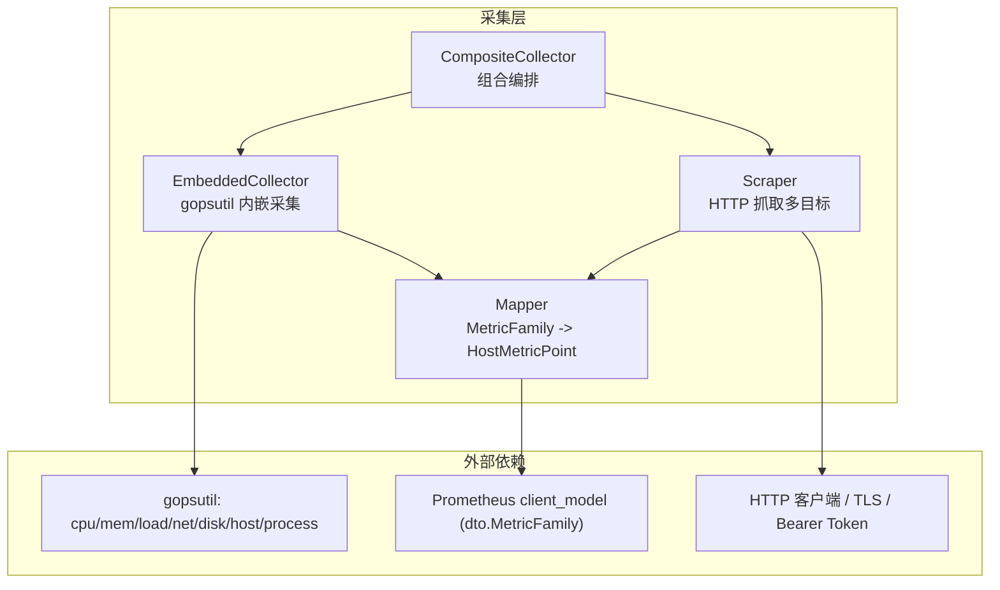
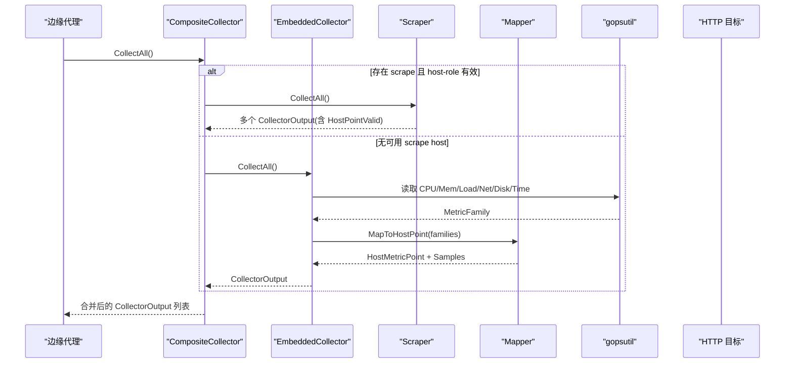
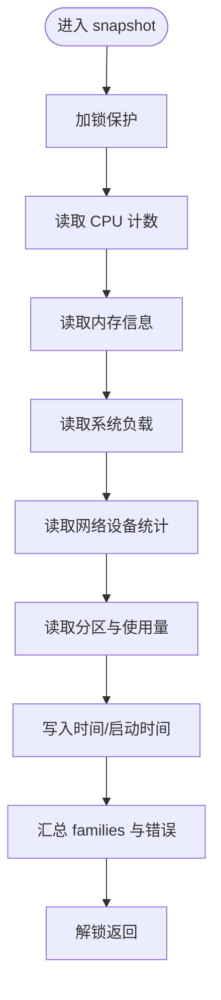
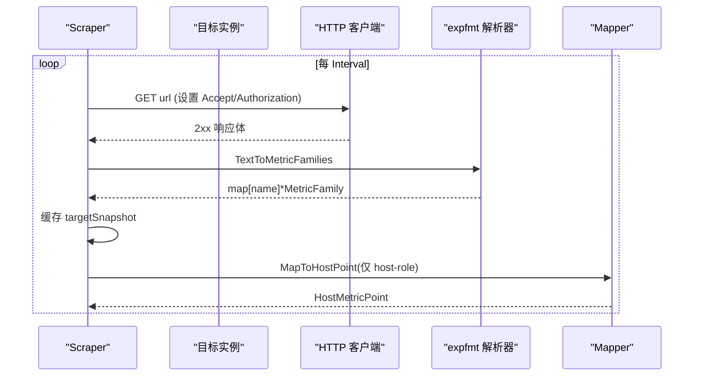
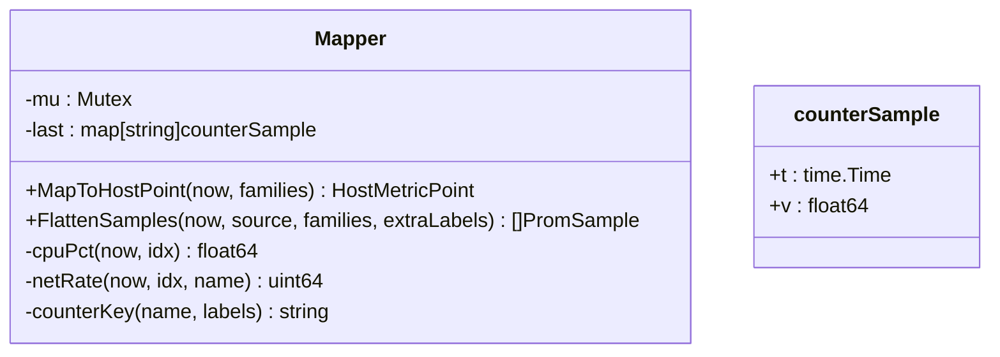
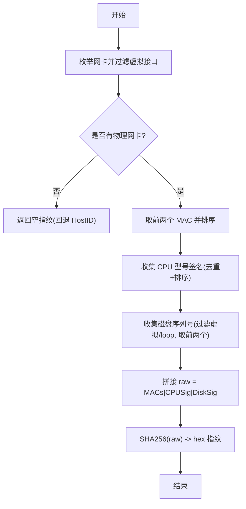
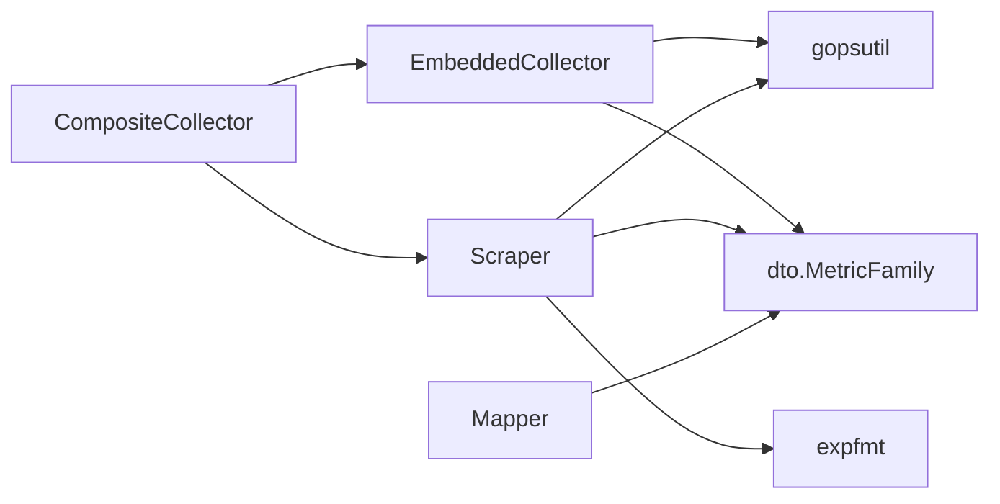

# 嵌入式采集器

<cite>
**本文引用的文件**   
- [embedded.go](file://internal/edgeagent/collector/embedded.go)
- [hwfingerprint.go](file://internal/edgeagent/collector/hwfingerprint.go)
- [mapper.go](file://internal/edgeagent/collector/mapper.go)
- [scrape.go](file://internal/edgeagent/collector/scrape.go)
- [composite.go](file://internal/edgeagent/collector/composite.go)
- [types.go](file://internal/edgeagent/collector/types.go)
- [scrape_config.example.yaml](file://internal/edgeagent/collector/scrape_config.example.yaml)
- [cpu.go](file://internal/edgeagent/biz/collector/cpu.go)
- [mem.go](file://internal/edgeagent/biz/collector/mem.go)
- [net.go](file://internal/edgeagent/biz/collector/net.go)
</cite>

## 目录
1. [简介](#简介)
2. [项目结构](#项目结构)
3. [核心组件](#核心组件)
4. [架构总览](#架构总览)
5. [详细组件分析](#详细组件分析)
6. [依赖关系分析](#依赖关系分析)
7. [性能考量](#性能考量)
8. [故障排查指南](#故障排查指南)
9. [结论](#结论)
10. [附录](#附录)

## 简介
本文件面向“嵌入式采集器”的实现与使用，聚焦于基于 gopsutil 的系统指标采集、硬件指纹生成、主机信息收集、进程列表获取与排序、系统负载计算、磁盘使用率监控以及资源限制策略。文档同时提供架构图、时序图与流程图，帮助读者从高层到代码级全面理解实现细节与优化方向。

## 项目结构
嵌入式采集器位于 edgeagent 的 collector 包中，主要包含：
- 内嵌采集器（EmbeddedCollector）：通过 gopsutil 直接读取内核接口，输出 Prometheus 兼容指标并映射为快速路径 HostMetricPoint。
- 外部抓取器（Scraper）：按配置周期性 HTTP 抓取 node_exporter 或组件 exporter 的指标，解析后复用同一 Mapper 进行统一处理。
- 组合采集器（CompositeCollector）：优先采用 scrape 的 host-role 数据，否则回退到 embedded 基线。
- 映射器（Mapper）：将 MetricFamily 快照转换为 8 字段 HostMetricPoint，并对计数器做速率转换。
- 硬件指纹（hardwareFingerprint）：基于物理网卡 MAC、CPU 型号、磁盘序列号生成稳定且抗克隆的标识。
- 类型定义（types.go）：定义 Collector 接口、CollectorOutput 等公共契约。

图表来源
- [embedded.go:26-73](file://internal/edgeagent/collector/embedded.go#L26-L73)
- [scrape.go:29-95](file://internal/edgeagent/collector/scrape.go#L29-L95)
- [composite.go:10-55](file://internal/edgeagent/collector/composite.go#L10-L55)
- [mapper.go:16-62](file://internal/edgeagent/collector/mapper.go#L16-L62)

章节来源
- [embedded.go:26-73](file://internal/edgeagent/collector/embedded.go#L26-L73)
- [scrape.go:29-95](file://internal/edgeagent/collector/scrape.go#L29-L95)
- [composite.go:10-55](file://internal/edgeagent/collector/composite.go#L10-L55)
- [types.go:21-57](file://internal/edgeagent/collector/types.go#L21-L57)

## 核心组件
- EmbeddedCollector
  - 职责：在进程内调用 gopsutil 采集 CPU、内存、负载、网络、文件系统、时间等指标；构造 MetricFamily 并通过 Mapper 生成 HostMetricPoint 与扁平样本。
  - 关键方法：CollectAll、HostInfo、GetHostLoad、GetProcessList、snapshot 及各资源 family 构建函数。
- Scraper
  - 职责：按配置对多个目标执行 HTTP 抓取，解析文本格式指标为 MetricFamily，缓存最新快照并按角色（host/component）产出 CollectorOutput。
  - 关键方法：Run、scrapeOnce、CollectAll、HostInfo、GetHostLoad、GetProcessList。
- CompositeCollector
  - 职责：组合模式，优先使用 scrape 的 host-role 快速路径，若无则回退到 embedded；其余 component 角色仅追加丰富路径样本。
- Mapper
  - 职责：从 MetricFamily 快照提取 8 字段 HostMetricPoint，维护计数器历史以计算 CPU%、网络收发速率；支持 FlattenSamples 输出丰富路径样本。
- 硬件指纹
  - 职责：基于物理 NIC MAC（最多前两个）、去重排序后的 CPU 型号签名、物理磁盘序列号（最多前两个）拼接后 SHA256，生成稳定标识；并提供 primaryIPv4 选择逻辑。

章节来源
- [embedded.go:26-174](file://internal/edgeagent/collector/embedded.go#L26-L174)
- [scrape.go:29-356](file://internal/edgeagent/collector/scrape.go#L29-L356)
- [composite.go:10-92](file://internal/edgeagent/collector/composite.go#L10-L92)
- [mapper.go:16-137](file://internal/edgeagent/collector/mapper.go#L16-L137)
- [hwfingerprint.go:15-209](file://internal/edgeagent/collector/hwfingerprint.go#L15-L209)

## 架构总览
整体流程如下：
- 启动阶段：根据运行模式创建 EmbeddedCollector 和/或 Scraper，并由 CompositeCollector 统一对外暴露 Collector 接口。
- 采集周期：
  - EmbeddedCollector：同步 snapshot 各资源 family，经 Mapper 得到 HostMetricPoint 与 Samples。
  - Scraper：后台定时抓取目标，解析并缓存 MetricFamily；CollectAll 时按目标逐一产出 CollectorOutput。
- 快速路径：HostInfo 与 GetHostLoad 用于注册与云边交互的快速指标查询。
- 丰富路径：FlattenSamples 输出所有原始样本，供新式 push_prom_samples 消费。

图表来源
- [composite.go:30-55](file://internal/edgeagent/collector/composite.go#L30-L55)
- [embedded.go:54-73](file://internal/edgeagent/collector/embedded.go#L54-L73)
- [scrape.go:188-226](file://internal/edgeagent/collector/scrape.go#L188-L226)
- [mapper.go:46-62](file://internal/edgeagent/collector/mapper.go#L46-L62)

## 详细组件分析

### 内嵌采集器（EmbeddedCollector）
- 指标覆盖
  - CPU：node_cpu_seconds_total{cpu, mode}，按每核每模式累计值构建。
  - 内存：MemTotal/MemAvailable/MemFree/Buffers/Cached。
  - 负载：node_load1/5/15。
  - 网络：每个设备的 receive/transmit bytes/packets 累计值。
  - 文件系统：size/avail/free 带 mountpoint/fstype/device 标签。
  - 时间：node_time_seconds、node_boot_time_seconds。
- 快速路径映射
  - CPU%：基于 per-cpu+per-mode 计数器差值，(total - idle)/total*100。
  - 内存占用%：优先 MemAvailable，否则回退 MemFree+Buffers+Cached。
  - 磁盘使用率：根挂载点 "/" 的 avail/size 比率。
  - 网络速率：按设备聚合字节增量除以最小时间间隔，排除 lo。
- 并发与错误
  - snapshot 加互斥锁串行化；子源错误记录但不中断整体结果。
- 进程列表
  - 遍历进程表，取 PID/Name/Cmdline/User/CPUPct/MemPct，默认按 CPU% 降序，可切换为内存占比。

图表来源
- [embedded.go:198-235](file://internal/edgeagent/collector/embedded.go#L198-L235)

章节来源
- [embedded.go:198-340](file://internal/edgeagent/collector/embedded.go#L198-L340)
- [embedded.go:132-174](file://internal/edgeagent/collector/embedded.go#L132-L174)

### 抓取器（Scraper）
- 多目标并行
  - 每个目标独立 goroutine 定时抓取，失败不阻塞其他目标。
- 认证与安全
  - 支持 Bearer Token 文件读取与 TLS 配置（可跳过校验）。
- 快照存储
  - 按目标名缓存最新 MetricFamily 快照及元信息（source、role）。
- 快速路径
  - 仅当 role=host 且 mapper 能产出非零 CPU%/MemPct/Load1 时，才视为有效 host 快照。
- 进程列表
  - 同内嵌采集器，直接走 gopsutil。

图表来源
- [scrape.go:98-183](file://internal/edgeagent/collector/scrape.go#L98-L183)
- [scrape.go:264-303](file://internal/edgeagent/collector/scrape.go#L264-L303)

章节来源
- [scrape.go:79-183](file://internal/edgeagent/collector/scrape.go#L79-L183)
- [scrape.go:264-303](file://internal/edgeagent/collector/scrape.go#L264-L303)
- [scrape_config.example.yaml:1-30](file://internal/edgeagent/collector/scrape_config.example.yaml#L1-L30)

### 组合采集器（CompositeCollector）
- 优先级
  - 若 scrape 有 host-role 且有效，则优先使用其快速路径；否则回退到 embedded。
- 丰富路径
  - 无论 host 是否有效，component-role 的 samples 都会并入输出。

章节来源
- [composite.go:30-55](file://internal/edgeagent/collector/composite.go#L30-L55)

### 映射器（Mapper）
- 状态管理
  - 维护 last 计数器缓存，键由 metric_name + 排序后的 label 组成，保证跨调用一致。
- 算法要点
  - CPU%：累加 totalDelta 与 idleDelta，(totalDelta - idleDelta)/totalDelta*100。
  - 网络速率：按设备聚合 delta，dt 取最小时间间隔，deltaSum/dtMin。
  - 内存占用%：优先 MemAvailable，否则回退 MemFree+Buffers+Cached。
  - 磁盘使用率：匹配 mountpoint="/" 的 size/avail。
- 丰富路径
  - FlattenSamples 将 Gauge/Counter/Untyped/Summary/Histogram 展开为 PromSample，过滤 NaN/Inf。

图表来源
- [mapper.go:16-62](file://internal/edgeagent/collector/mapper.go#L16-L62)
- [mapper.go:233-330](file://internal/edgeagent/collector/mapper.go#L233-L330)

章节来源
- [mapper.go:46-137](file://internal/edgeagent/collector/mapper.go#L46-L137)
- [mapper.go:233-330](file://internal/edgeagent/collector/mapper.go#L233-L330)

### 硬件指纹与主机信息
- 硬件指纹
  - 物理网卡 MAC：过滤虚拟接口（docker/veth/cni/flannel/tun/tap/…），最多取前两个，按接口名排序。
  - CPU 签名：去重并排序的 ModelName+VendorID+Family 组合。
  - 磁盘签名：过滤 virtual/loop，最多取前两个，按设备名排序。
  - 最终指纹 = SHA256("MACs|CPUSig|DiskSig")；若无物理网卡则返回空字符串，上层回退到 HostID。
- 主机信息
  - OS/Arch/CPUCount/Hostname/KernelVersion/Fingerprint(HardwareFingerprint)+HostID/IPAddress/MemTotalBytes。
  - primaryIPv4：优先物理网卡上的 IPv4，其次任意非环回地址。

图表来源
- [hwfingerprint.go:29-41](file://internal/edgeagent/collector/hwfingerprint.go#L29-L41)
- [hwfingerprint.go:46-102](file://internal/edgeagent/collector/hwfingerprint.go#L46-L102)
- [hwfingerprint.go:104-156](file://internal/edgeagent/collector/hwfingerprint.go#L104-L156)
- [hwfingerprint.go:158-208](file://internal/edgeagent/collector/hwfingerprint.go#L158-L208)

章节来源
- [hwfingerprint.go:29-208](file://internal/edgeagent/collector/hwfingerprint.go#L29-L208)
- [embedded.go:76-112](file://internal/edgeagent/collector/embedded.go#L76-L112)

### 进程列表获取与排序
- 数据来源：gopsutil process.ProcessesWithContext。
- 字段：PID、Name、Cmdline、User、CPUPct、MemPct。
- 排序：
  - sortBy=tunnel.ProcessSortByMem：按内存占比降序。
  - 默认：按 CPU 占比降序。
- 截断：topN<=0 时默认 20，超过 topN 截断。

章节来源
- [embedded.go:132-174](file://internal/edgeagent/collector/embedded.go#L132-L174)
- [scrape.go:316-356](file://internal/edgeagent/collector/scrape.go#L316-L356)

### 系统负载与磁盘使用率
- 系统负载：直接读取 load.AvgWithContext 的 1/5/15 分钟均值。
- 磁盘使用率：匹配 mountpoint="/" 的 size/avail，计算 (1 - avail/size)*100。

章节来源
- [embedded.go:275-285](file://internal/edgeagent/collector/embedded.go#L275-L285)
- [mapper.go:196-206](file://internal/edgeagent/collector/mapper.go#L196-L206)

### 资源限制策略
- 超时控制：Scrape 请求使用 context.WithTimeout，避免长时间阻塞。
- 连接池：HTTP Transport 设置 MaxIdleConns/MaxIdleConnsPerHost/IdleConnTimeout。
- 采样上限：进程列表默认 topN=20，可按需调整。
- 首采语义：rate 相关字段首次返回 0，避免误报。

章节来源
- [scrape.go:117-183](file://internal/edgeagent/collector/scrape.go#L117-L183)
- [scrape.go:363-377](file://internal/edgeagent/collector/scrape.go#L363-L377)
- [embedded.go:134-174](file://internal/edgeagent/collector/embedded.go#L134-L174)
- [mapper.go:46-62](file://internal/edgeagent/collector/mapper.go#L46-L62)

## 依赖关系分析
- 外部库
  - gopsutil：cpu/mem/load/net/disk/host/process。
  - Prometheus client_model：dto.MetricFamily。
  - expfmt：文本格式解析。
- 内部依赖
  - tunnel.HostInfo/HostMetricPoint/PromSample 等传输模型。
  - 日志：log/slog。

图表来源
- [embedded.go:14-24](file://internal/edgeagent/collector/embedded.go#L14-L24)
- [scrape.go:18-27](file://internal/edgeagent/collector/scrape.go#L18-L27)
- [mapper.go:11-14](file://internal/edgeagent/collector/mapper.go#L11-L14)

章节来源
- [embedded.go:14-24](file://internal/edgeagent/collector/embedded.go#L14-L24)
- [scrape.go:18-27](file://internal/edgeagent/collector/scrape.go#L18-L27)
- [mapper.go:11-14](file://internal/edgeagent/collector/mapper.go#L11-L14)

## 性能考量
- 并发与锁
  - snapshot 串行化避免竞争；Scrape 多目标并行，互不影响。
- 计数与速率
  - 使用稳定的 counterKey 减少哈希冲突；网络速率取最小 dt 提升精度。
- 内存与对象分配
  - 预分配切片容量；FlattenSamples 过滤非法数值避免后续序列化异常。
- 网络开销
  - Keep-Alive 连接池；Bearer Token 文件只读一次；TLS 最低版本 1.2。
- 建议
  - 合理设置 interval/timeout，避免频繁 IO。
  - 对高基数设备（如大量网卡/分区）关注标签爆炸风险。
  - 在容器环境中谨慎选择物理网卡过滤规则，必要时放宽 isPhysicalNIC 条件。

[本节为通用指导，无需列出具体文件来源]

## 故障排查指南
- 常见问题
  - 首次采样 CPU%/网络速率为 0：属正常，需要至少两次采样才能计算速率。
  - 硬件指纹为空：可能未检测到物理网卡，系统将回退到 HostID。
  - scrape 目标不可达：检查 URL、端口、防火墙、TLS 证书与 Bearer Token 文件权限。
  - 指标缺失：确认上游 exporter 暴露了 node_* 命名空间指标。
- 定位步骤
  - 查看采集器日志中的 warn 条目（如 scrape non-2xx、parse failed、http error）。
  - 验证 scrape 配置 targets 的 name/url/interval/timeout/bearer_token_file/tls_insecure。
  - 手动 curl 目标 /metrics 端点，确认返回文本格式指标。
  - 对比 Mapper 期望的指标名（node_cpu_seconds_total、node_memory_*、node_load*、node_network_*、node_filesystem_*、node_time_*、node_boot_time_*）。

章节来源
- [scrape.go:117-183](file://internal/edgeagent/collector/scrape.go#L117-L183)
- [scrape_config.example.yaml:1-30](file://internal/edgeagent/collector/scrape_config.example.yaml#L1-L30)
- [embedded.go:198-235](file://internal/edgeagent/collector/embedded.go#L198-L235)
- [mapper.go:46-62](file://internal/edgeagent/collector/mapper.go#L46-L62)

## 结论
嵌入式采集器通过内嵌 gopsutil 与外部 scrape 双通道，结合统一的 Mapper 与组合编排，既保证了在无外部依赖时的可用性，又能在具备 node_exporter 或组件 exporter 时提供更丰富的观测能力。硬件指纹机制有效解决了虚拟机克隆导致的设备识别问题。通过合理的超时、连接池与采样上限策略，系统在资源受限环境下仍保持稳定高效。

[本节为总结性内容，无需列出具体文件来源]

## 附录
- 示例抓取配置
  - 参考 scrape_config.example.yaml 中的 targets 定义，包括 host/component 角色、bearer_token_file、tls_insecure 等选项。

章节来源
- [scrape_config.example.yaml:1-30](file://internal/edgeagent/collector/scrape_config.example.yaml#L1-L30)