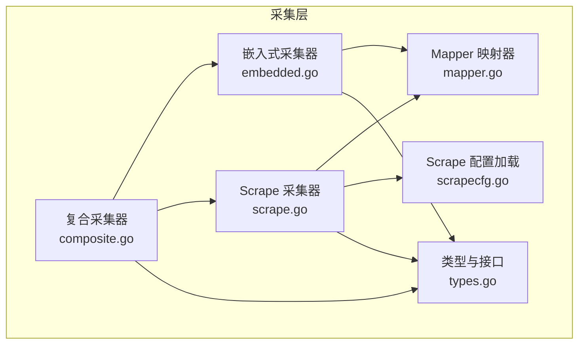
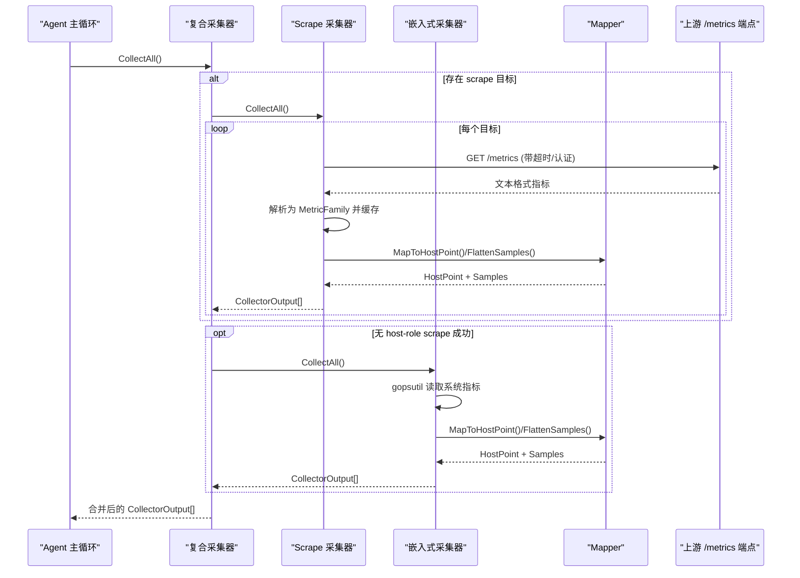
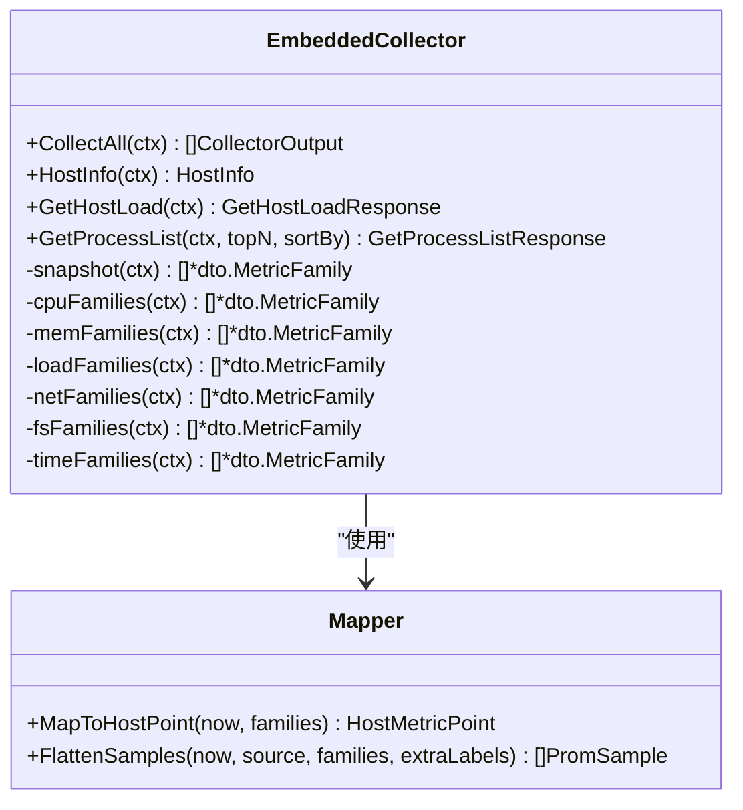
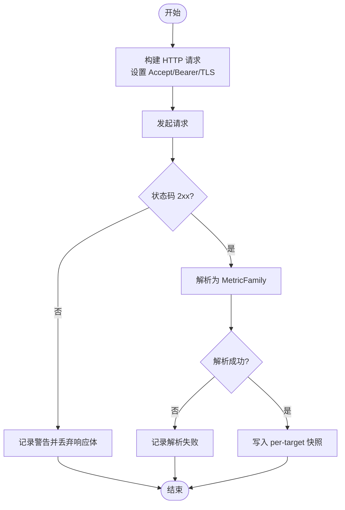
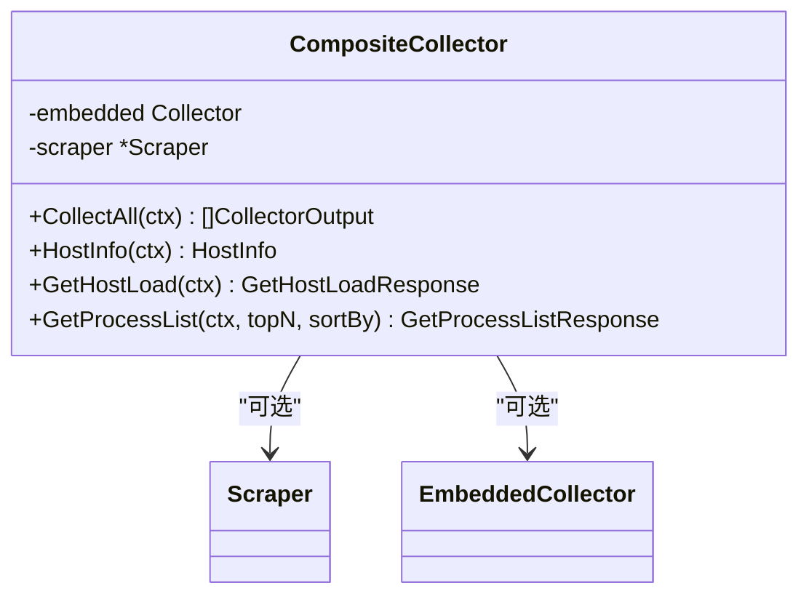
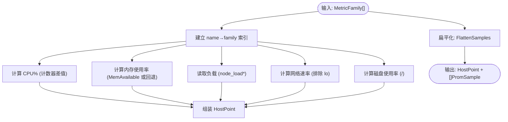
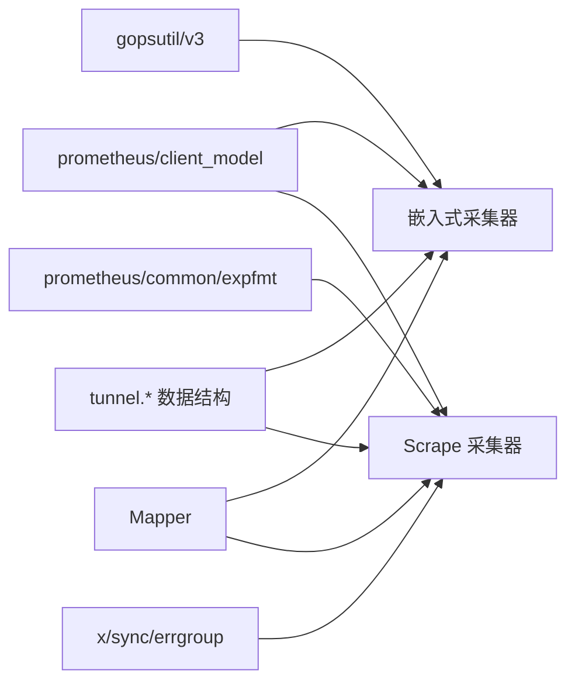

# 数据采集系统

<cite>
**本文引用的文件列表**
- [embedded.go](file://internal/edgeagent/collector/embedded.go)
- [scrape.go](file://internal/edgeagent/collector/scrape.go)
- [composite.go](file://internal/edgeagent/collector/composite.go)
- [types.go](file://internal/edgeagent/collector/types.go)
- [mapper.go](file://internal/edgeagent/collector/mapper.go)
- [scrapecfg.go](file://internal/edgeagent/collector/scrapecfg.go)
</cite>

## 目录
1. [简介](#简介)
2. [项目结构](#项目结构)
3. [核心组件](#核心组件)
4. [架构总览](#架构总览)
5. [详细组件分析](#详细组件分析)
6. [依赖关系分析](#依赖关系分析)
7. [性能与精度](#性能与精度)
8. [配置管理](#配置管理)
9. [采集频率调优指南](#采集频率调优指南)
10. [故障排查](#故障排查)
11. [结论](#结论)

## 简介
本文件面向数据采集系统的实现与使用，聚焦于边缘侧采集器（Embedded Collector）与基于 scrape 的采集器架构，以及复合采集器（Composite Collector）的组合策略。文档覆盖以下要点：
- 嵌入式采集器通过 gopsutil 在进程内读取系统指标，输出 node_exporter 兼容的 Prometheus 指标族；
- 基于 scrape 的采集器按目标定时抓取 HTTP /metrics，解析并缓存最新快照，支持多目标并发；
- 复合采集器将嵌入式基线与 scrape 结果组合，优先采用 host-role 的 scrape 数据作为主机快路径；
- 指标映射与速率计算由 Mapper 统一完成，保证 fast-path 与 rich-path 的一致性；
- 提供采集配置、性能优化、资源限制与调优建议，以及常见问题的排查方法。

## 项目结构
数据采集相关代码集中在 internal/edgeagent/collector 包中，关键文件职责如下：
- embedded.go：嵌入式采集器，gopsutil 读取 CPU/内存/负载/网络/磁盘/时间等指标；
- scrape.go：基于 scrape 的多目标采集器，HTTP 抓取、解析、缓存与导出；
- composite.go：复合采集器，组合嵌入式与 scrape 源；
- types.go：采集接口、输出结构与常量定义；
- mapper.go：指标映射与速率计算，生成 fast-path HostPoint 与 rich-path PromSample；
- scrapecfg.go：scrape 配置加载与校验。

图表来源
- [embedded.go:1-403](file://internal/edgeagent/collector/embedded.go#L1-L403)
- [scrape.go:1-415](file://internal/edgeagent/collector/scrape.go#L1-L415)
- [composite.go:1-92](file://internal/edgeagent/collector/composite.go#L1-L92)
- [mapper.go:1-373](file://internal/edgeagent/collector/mapper.go#L1-L373)
- [scrapecfg.go:1-91](file://internal/edgeagent/collector/scrapecfg.go#L1-L91)
- [types.go:1-58](file://internal/edgeagent/collector/types.go#L1-L58)

章节来源
- [embedded.go:1-403](file://internal/edgeagent/collector/embedded.go#L1-L403)
- [scrape.go:1-415](file://internal/edgeagent/collector/scrape.go#L1-L415)
- [composite.go:1-92](file://internal/edgeagent/collector/composite.go#L1-L92)
- [mapper.go:1-373](file://internal/edgeagent/collector/mapper.go#L1-L373)
- [scrapecfg.go:1-91](file://internal/edgeagent/collector/scrapecfg.go#L1-L91)
- [types.go:1-58](file://internal/edgeagent/collector/types.go#L1-L58)

## 核心组件
- 嵌入式采集器（EmbeddedCollector）
  - 通过 gopsutil 在进程内读取系统指标，构造 node_exporter 兼容的 MetricFamily；
  - 提供 HostInfo、GetHostLoad、GetProcessList 等能力，用于设备注册与快速负载查询；
  - 输出单一 CollectorOutput，Source 为 "embedded"。
- Scrape 采集器（Scraper）
  - 每个目标一个 goroutine，按 Interval 周期抓取 HTTP /metrics；
  - 解析响应体为 MetricFamily，维护 per-target 最新快照；
  - CollectAll 返回每个目标的 CollectorOutput，Source 为 "scrape:<target_name>"；
  - 当目标 role=host 时，可生成 HostPoint 作为主机快路径。
- 复合采集器（CompositeCollector）
  - 组合嵌入式与 scrape 源；
  - 若存在 host-role 的 scrape 成功快照，则优先使用其 HostPoint；否则回退到嵌入式基线；
  - 对 GetHostLoad 同样遵循“先 scrape 后 embedded”的优先级。
- Mapper
  - 从 node_exporter 命名约定中提取 8 字段 HostMetricPoint（CPU%、内存使用率、负载、网络收发速率、磁盘使用率）；
  - 同时生成 flat 的 PromSample 集合，供 push_prom_samples 通道上报；
  - 内部维护计数器缓存，计算 rate（CPU%、网络字节速率）。
- 配置加载（ScrapeConfig）
  - 从 YAML 文件加载 targets 列表，校验必填字段并应用默认值（Interval、Timeout、Role）。

章节来源
- [embedded.go:1-403](file://internal/edgeagent/collector/embedded.go#L1-L403)
- [scrape.go:1-415](file://internal/edgeagent/collector/scrape.go#L1-L415)
- [composite.go:1-92](file://internal/edgeagent/collector/composite.go#L1-L92)
- [mapper.go:1-373](file://internal/edgeagent/collector/mapper.go#L1-L373)
- [scrapecfg.go:1-91](file://internal/edgeagent/collector/scrapecfg.go#L1-L91)
- [types.go:1-58](file://internal/edgeagent/collector/types.go#L1-L58)

## 架构总览
整体采集流程分为两条路径：
- 嵌入式路径：进程内 gopsutil 读取 → 构建 MetricFamily → Mapper 生成 HostPoint 与 Samples → 输出 CollectorOutput；
- Scrape 路径：HTTP 抓取 /metrics → 解析为 MetricFamily → 缓存快照 → Mapper 生成 HostPoint（仅 host-role）与 Samples → 输出 CollectorOutput；
- 复合路径：合并两类输出，优先 host-role 的 scrape 作为主机快路径。

图表来源
- [composite.go:1-92](file://internal/edgeagent/collector/composite.go#L1-L92)
- [scrape.go:1-415](file://internal/edgeagent/collector/scrape.go#L1-L415)
- [embedded.go:1-403](file://internal/edgeagent/collector/embedded.go#L1-L403)
- [mapper.go:1-373](file://internal/edgeagent/collector/mapper.go#L1-L373)

## 详细组件分析

### 嵌入式采集器（EmbeddedCollector）
- 功能
  - 读取 CPU 各模式累计时间、内存总量/可用/空闲/缓冲/缓存、系统负载、网络设备收发计数、文件系统容量、系统时间与启动时间；
  - 输出 node_exporter 兼容的 MetricFamily，名称与标签规范一致；
  - 提供 HostInfo（操作系统、内核、CPU 核数、硬件指纹、IP）、GetHostLoad（CPU%/内存%/磁盘%/负载）、GetProcessList（按 CPU/内存排序的前 N 进程）。
- 算法与精度
  - CPU 使用率由 Mapper 基于计数器差值计算，首次调用返回 0；
  - 内存使用率优先使用 MemAvailable，缺失时回退到 MemFree+Buffers+Cached；
  - 网络速率按设备维度聚合，排除 lo 接口；
  - 磁盘使用率针对根挂载点计算。
- 错误处理
  - 子模块读取失败记录日志并跳过该族，不中断整体快照；
  - 空快照返回错误，避免上层误用。

图表来源
- [embedded.go:1-403](file://internal/edgeagent/collector/embedded.go#L1-L403)
- [mapper.go:1-373](file://internal/edgeagent/collector/mapper.go#L1-L373)

章节来源
- [embedded.go:1-403](file://internal/edgeagent/collector/embedded.go#L1-L403)
- [mapper.go:1-373](file://internal/edgeagent/collector/mapper.go#L1-L373)

### Scrape 采集器（Scraper）
- 架构
  - 每个目标独立 goroutine，Run 使用 errgroup 管理生命周期；
  - runTarget 立即执行一次抓取，随后按 Interval 定时器触发；
  - scrapeOnce 构建请求（支持 Bearer Token 与 TLS），解析响应体为 MetricFamily，更新 per-target 快照；
  - CollectAll 遍历快照，按目标生成 CollectorOutput，role=host 时生成 HostPoint。
- 目标发现与配置
  - 目标来自 ScrapeConfig.targets，包含 name/url/role/interval/timeout/bearer_token_file/tls_insecure/static_labels；
  - 未设置 role 默认为 component，仅 rich-path；role=host 可参与主机快路径。
- 并发与容错
  - 单个目标错误仅记录警告，不影响其他目标；
  - 非 2xx 或解析失败均记录告警并跳过本次快照。

图表来源
- [scrape.go:1-415](file://internal/edgeagent/collector/scrape.go#L1-L415)

章节来源
- [scrape.go:1-415](file://internal/edgeagent/collector/scrape.go#L1-L415)
- [scrapecfg.go:1-91](file://internal/edgeagent/collector/scrapecfg.go#L1-L91)

### 复合采集器（CompositeCollector）
- 设计模式
  - 组合嵌入式与 scrape 两种采集源；
  - CollectAll 优先收集 scrape 输出，若存在 host-role 且 HostPointValid，则不再追加嵌入式输出；
  - GetHostLoad 优先使用 scrape 的 HostPoint，若无有效值再回退到嵌入式。
- 优势
  - 在不破坏现有 fast-path 的前提下，扩展 rich-path 能力；
  - 允许 operator 以外部 exporter 替换内置采集，平滑迁移。

图表来源
- [composite.go:1-92](file://internal/edgeagent/collector/composite.go#L1-L92)
- [types.go:1-58](file://internal/edgeagent/collector/types.go#L1-L58)

章节来源
- [composite.go:1-92](file://internal/edgeagent/collector/composite.go#L1-L92)
- [types.go:1-58](file://internal/edgeagent/collector/types.go#L1-L58)

### Mapper 与数据处理
- Fast-path（HostPoint）
  - CPU%：基于 node_cpu_seconds_total 的每核每模式计数器差值，(total-idle)/total*100；
  - 内存使用率：优先 MemAvailable，缺失回退到 MemFree+Buffers+Cached；
  - 负载：直接取 node_load1/5/15；
  - 网络速率：按设备聚合字节计数器差值，除以最小 dt，排除 lo；
  - 磁盘使用率：针对 mountpoint="/" 的 size/avail 计算。
- Rich-path（PromSample）
  - 将 MetricFamily 扁平化为 tunnel.PromSample，支持 gauge/counter/untyped/histogram/summary；
  - 合并 static_labels，保留生产者标签优先；
  - 过滤 NaN/Inf，确保 JSON 编码安全。

图表来源
- [mapper.go:1-373](file://internal/edgeagent/collector/mapper.go#L1-L373)

章节来源
- [mapper.go:1-373](file://internal/edgeagent/collector/mapper.go#L1-L373)

## 依赖关系分析
- 外部库
  - gopsutil/v3：CPU/内存/负载/网络/磁盘/进程信息；
  - prometheus/common/expfmt：解析 text/plain 指标；
  - prometheus/client_model/go：MetricFamily 模型；
  - golang.org/x/sync/errgroup：并发任务管理。
- 内部依赖
  - tunnel.HostInfo/HostMetricPoint/PromSample：与云端交互的数据结构；
  - Mapper：统一映射逻辑，被嵌入式与 scrape 共同复用。

图表来源
- [embedded.go:1-403](file://internal/edgeagent/collector/embedded.go#L1-L403)
- [scrape.go:1-415](file://internal/edgeagent/collector/scrape.go#L1-L415)
- [mapper.go:1-373](file://internal/edgeagent/collector/mapper.go#L1-L373)

章节来源
- [embedded.go:1-403](file://internal/edgeagent/collector/embedded.go#L1-L403)
- [scrape.go:1-415](file://internal/edgeagent/collector/scrape.go#L1-L415)
- [mapper.go:1-373](file://internal/edgeagent/collector/mapper.go#L1-L373)

## 性能与精度
- 并发与连接复用
  - 每个 scrape 目标独立 goroutine，errgroup 统一管理；
  - 每个目标持有独立 http.Client，开启连接池与 Keep-Alive，减少握手开销。
- 速率计算与首样本
  - CPU% 与网络速率基于计数器差值，首次调用返回 0，后续稳定；
  - 网络速率使用最小 dt 归一化，降低抖动影响。
- 内存与 CPU 占用
  - 快照 map 与 per-target mapper 缓存，避免重复解析与重建；
  - 扁平化采样时预分配切片容量，减少扩容开销。
- 精度控制
  - 内存使用率优先使用 MemAvailable，更贴近真实可用内存；
  - 磁盘使用率限定根挂载点，避免无关分区干扰；
  - 过滤 NaN/Inf，保障下游 JSON 序列化安全。

章节来源
- [scrape.go:1-415](file://internal/edgeagent/collector/scrape.go#L1-L415)
- [mapper.go:1-373](file://internal/edgeagent/collector/mapper.go#L1-L373)

## 配置管理
- 配置文件位置与格式
  - 路径：/etc/ongrid-edge/scrape.yaml；
  - 结构：targets 数组，每项包含 name/url/role/interval/timeout/bearer_token_file/tls_insecure/static_labels。
- 必填项与默认值
  - name/url 必填；
  - role 默认 component；
  - interval 默认 30s；
  - timeout 默认 10s。
- 安全与认证
  - bearer_token_file：首次抓取时读取文件内容，附加 Authorization: Bearer；
  - tls_insecure：可跳过证书验证（谨慎使用，适用于自签名 kubelet 等场景）。
- 静态标签
  - static_labels 合并到每个 PromSample，冲突时以生产者标签为准。

章节来源
- [scrapecfg.go:1-91](file://internal/edgeagent/collector/scrapecfg.go#L1-L91)
- [scrape.go:1-415](file://internal/edgeagent/collector/scrape.go#L1-L415)

## 采集频率调优指南
- 原则
  - 高频指标（CPU/网络）建议 10–30s；低频指标（磁盘/负载）可 30–60s；
  - 高基数指标（如进程级）应谨慎提高频率，避免 cardinality 爆炸；
  - 外部 exporter 需考虑其自身刷新周期与成本。
- 实践建议
  - 为 host-role 目标设置较短 interval（如 10–15s），确保 dashboard 实时性；
  - 为 component-role 目标根据业务特性调整（如数据库 exporter 可 30s）；
  - 合理设置 timeout，避免慢目标阻塞调度；
  - 使用 static_labels 区分环境/角色，便于聚合与告警。
- 监控与评估
  - 观察 scrape 成功率、延迟分布与目标健康度；
  - 结合 HostPoint 的 CPUPct/MemPct/DiskUsedPct 判断是否达到预期精度。

[本节为通用指导，不直接分析具体文件]

## 故障排查
- 常见问题
  - 目标不可达：检查 URL、TLS 配置、bearer token 文件权限与内容；
  - 非 2xx 响应：查看目标服务状态与端口监听；
  - 解析失败：确认 /metrics 输出符合 text/plain 格式；
  - 主机快路径为空：确认至少一个 target 的 role=host 且成功抓取。
- 定位步骤
  - 查看 scrape 日志中的 warn 级别条目（构建请求失败、HTTP 错误、非 2xx、解析失败）；
  - 检查 per-target 快照是否存在（CollectAll 返回空表示尚未成功抓取）；
  - 对比 EmbeddedCollector 的输出，确认本地 gopsutil 是否正常；
  - 对于 host-role 目标，验证 Mapper 是否能生成非零 HostPoint。
- 恢复建议
  - 修正认证与 TLS 配置；
  - 重启目标服务或修复网络连通性；
  - 调整 interval/timeout 以匹配目标稳定性；
  - 必要时回退至嵌入式基线（CompositeCollector 自动回退）。

章节来源
- [scrape.go:1-415](file://internal/edgeagent/collector/scrape.go#L1-L415)
- [embedded.go:1-403](file://internal/edgeagent/collector/embedded.go#L1-L403)
- [composite.go:1-92](file://internal/edgeagent/collector/composite.go#L1-L92)

## 结论
本数据采集系统通过嵌入式与 scrape 双路径，兼顾了低开销与可扩展性。复合采集器在保证主机快路径可用的前提下，灵活引入外部 exporter 的丰富指标。Mapper 统一了 fast-path 与 rich-path 的处理逻辑，确保一致性。配合合理的配置与调优策略，可在不同规模与环境下稳定运行。