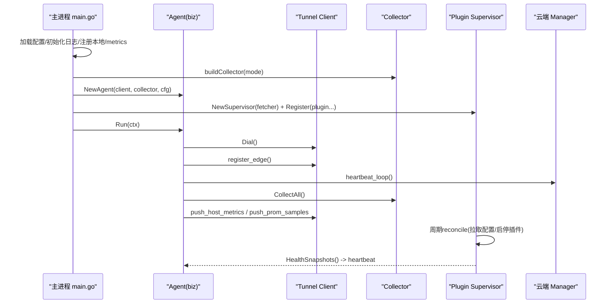
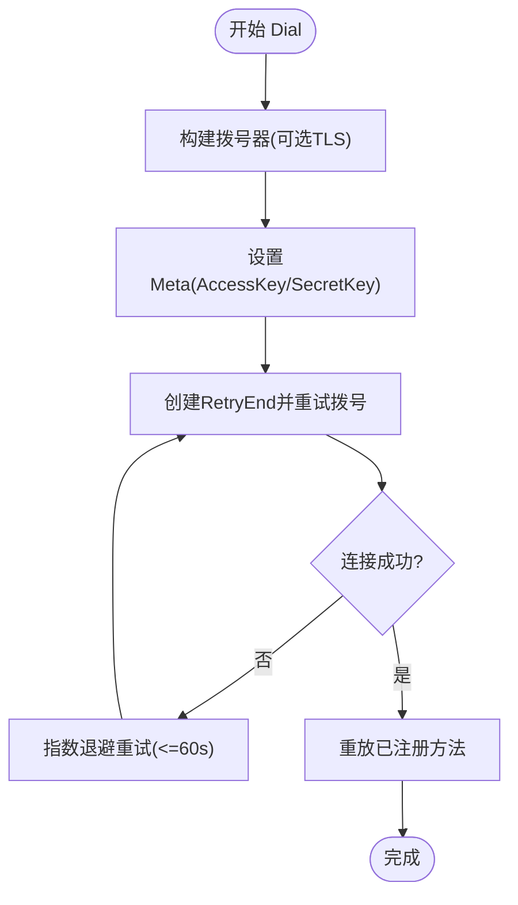
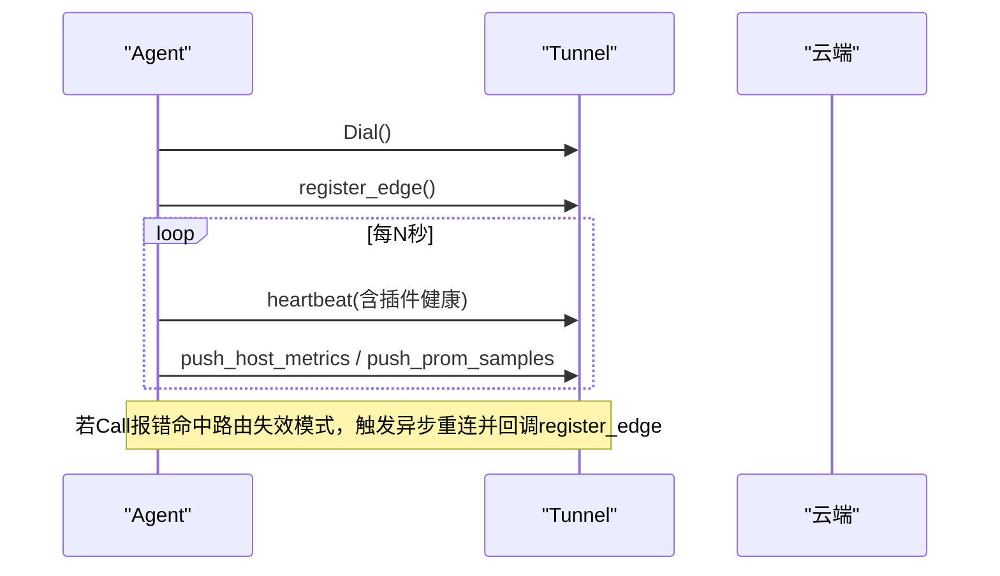
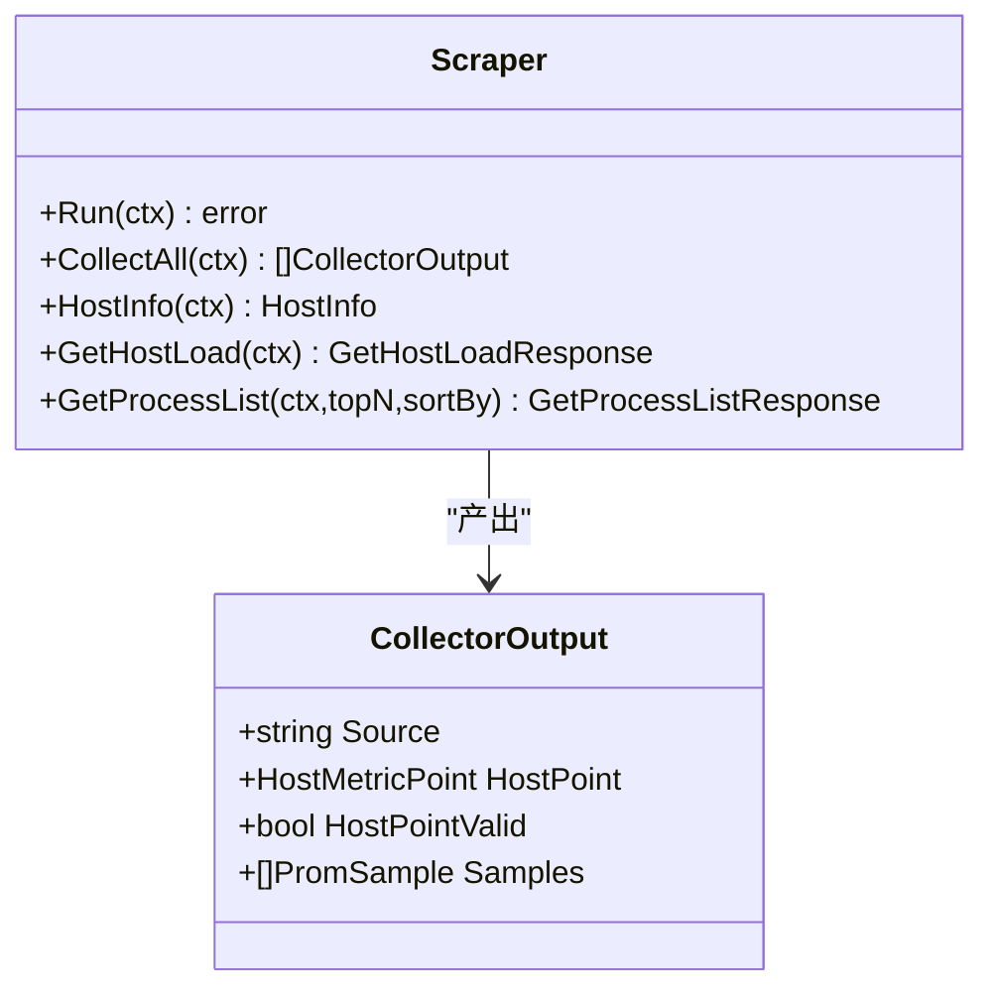
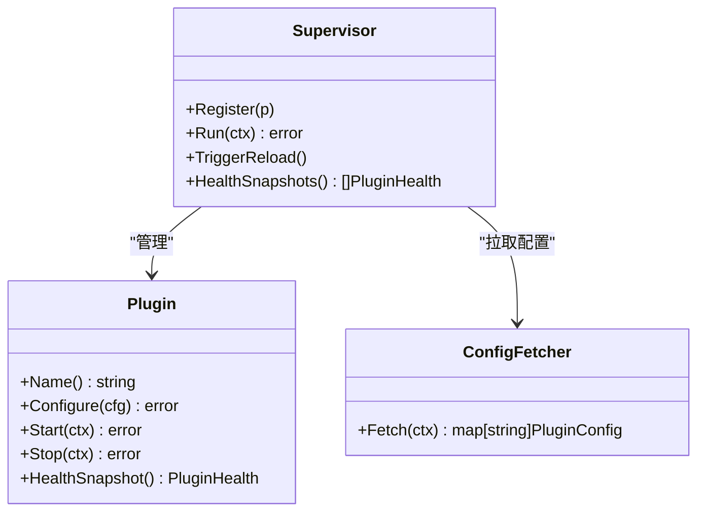
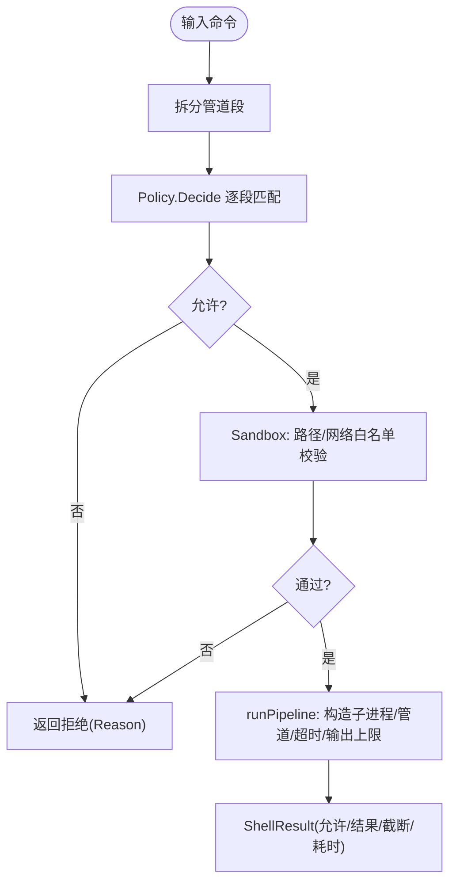
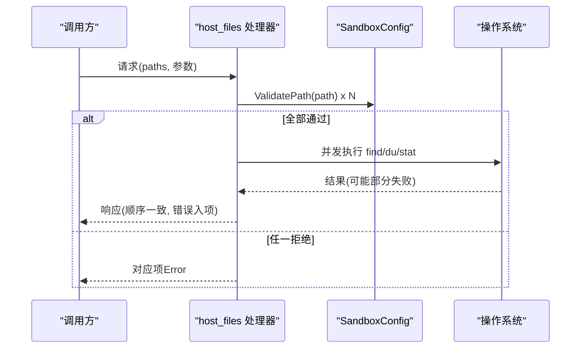
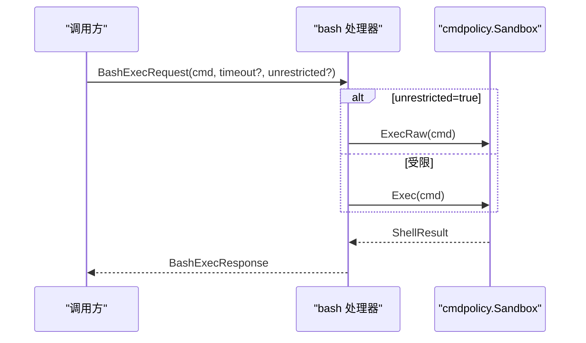
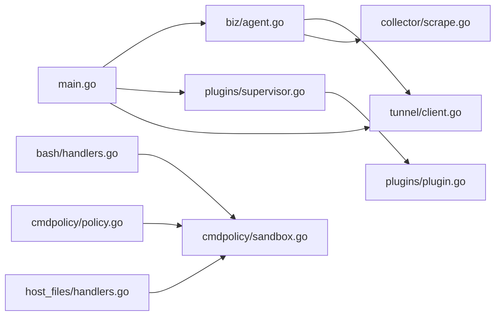

# 边缘代理服务

<cite>
**本文引用的文件**   
- [cmd/ongrid-edge/main.go](file://cmd/ongrid-edge/main.go)
- [internal/edgeagent/biz/agent.go](file://internal/edgeagent/biz/agent.go)
- [internal/pkg/tunnel/client.go](file://internal/pkg/tunnel/client.go)
- [internal/pkg/tunnel/messages.go](file://internal/pkg/tunnel/messages.go)
- [internal/edgeagent/plugins/plugin.go](file://internal/edgeagent/plugins/plugin.go)
- [internal/edgeagent/plugins/supervisor.go](file://internal/edgeagent/plugins/supervisor.go)
- [internal/edgeagent/cmdpolicy/policy.go](file://internal/edgeagent/cmdpolicy/policy.go)
- [internal/edgeagent/cmdpolicy/sandbox.go](file://internal/edgeagent/cmdpolicy/sandbox.go)
- [internal/edgeagent/host_files/handlers.go](file://internal/edgeagent/host_files/handlers.go)
- [internal/edgeagent/bash/handlers.go](file://internal/edgeagent/bash/handlers.go)
- [internal/edgeagent/restart_service/handlers.go](file://internal/edgeagent/restart_service/handlers.go)
- [internal/edgeagent/collector/scrape.go](file://internal/edgeagent/collector/scrape.go)
</cite>

## 目录
1. [简介](#简介)
2. [项目结构](#项目结构)
3. [核心组件](#核心组件)
4. [架构总览](#架构总览)
5. [详细组件分析](#详细组件分析)
6. [依赖关系分析](#依赖关系分析)
7. [性能考量](#性能考量)
8. [故障排查指南](#故障排查指南)
9. [结论](#结论)
10. [附录：插件开发与扩展指南](#附录插件开发与扩展指南)

## 简介
本文件面向“边缘代理服务（Edge Agent）”的架构与实现，系统性阐述以下主题：
- 在边缘节点上的运行机制与进程生命周期
- 与云端 Manager 的安全隧道建立、认证机制、心跳保持与数据同步策略
- 数据采集器（系统指标、日志采集、进程监控）的实现原理
- 插件系统的架构：生命周期管理、沙箱执行环境与安全控制
- 命令策略引擎：权限控制、资源限制与执行审计
- 部署配置、资源管理与故障处理策略
- 插件开发与扩展的技术指南

## 项目结构
边缘代理以单二进制 ongrid-edge 启动，负责：
- 建立到云端的加密隧道并注册自身
- 周期性上报心跳与指标
- 提供工具 RPC（主机负载、进程列表等）
- 运行与管理多种插件（日志、追踪、数据库指标、主机指标等）
- 提供受控的 Bash 执行能力与文件系统操作能力

```mermaid
graph TB
subgraph "边缘节点"
A["主进程<br/>cmd/ongrid-edge/main.go"]
B["业务循环<br/>biz/agent.go"]
C["隧道客户端<br/>pkg/tunnel/client.go"]
D["采集器(Scrape/Embedded)<br/>collector/scrape.go"]
E["插件运行时<br/>plugins/*"]
F["命令策略与沙箱<br/>cmdpolicy/*"]
G["宿主文件工具<br/>host_files/*"]
H["Bash 技能入口<br/>bash/*"]
I["重启服务技能入口<br/>restart_service/*"]
end
subgraph "云端"
M["Manager 服务"]
end
A --> B
A --> C
A --> D
A --> E
A --> F
A --> G
A --> H
A --> I
B < --> C
C < --> M
```

图表来源
- [cmd/ongrid-edge/main.go:56-314](file://cmd/ongrid-edge/main.go#L56-L314)
- [internal/edgeagent/biz/agent.go:150-232](file://internal/edgeagent/biz/agent.go#L150-L232)
- [internal/pkg/tunnel/client.go:62-141](file://internal/pkg/tunnel/client.go#L62-L141)
- [internal/edgeagent/collector/scrape.go:79-95](file://internal/edgeagent/collector/scrape.go#L79-L95)
- [internal/edgeagent/plugins/supervisor.go:112-133](file://internal/edgeagent/plugins/supervisor.go#L112-L133)
- [internal/edgeagent/cmdpolicy/sandbox.go:140-188](file://internal/edgeagent/cmdpolicy/sandbox.go#L140-L188)
- [internal/edgeagent/host_files/handlers.go:88-110](file://internal/edgeagent/host_files/handlers.go#L88-L110)
- [internal/edgeagent/bash/handlers.go:49-94](file://internal/edgeagent/bash/handlers.go#L49-L94)
- [internal/edgeagent/restart_service/handlers.go:144-162](file://internal/edgeagent/restart_service/handlers.go#L144-L162)

章节来源
- [cmd/ongrid-edge/main.go:56-314](file://cmd/ongrid-edge/main.go#L56-L314)

## 核心组件
- 隧道客户端：封装连接、重连、方法注册与调用，支持 TLS 与元信息认证。
- 业务 Agent：驱动注册、心跳、指标推送、升级流程与插件健康上报。
- 采集器：支持嵌入式（gopsutil）与 HTTP scrape 两种模式，统一输出 HostPoint 与 Prometheus Samples。
- 插件系统：Supervisor 统一管理插件配置拉取、启停、健康快照上报。
- 命令策略引擎：白名单+参数匹配+路径/网络白名单+超时/输出上限，提供 Exec 与 ExecRaw 两条路径。
- 宿主文件工具：find_large_files / du_summary / stat_file 三大能力，批量并发、严格沙箱校验。
- Bash 技能入口：将请求路由到 cmdpolicy.Sandbox，支持受限与无限制（管理员写门限）两种模式。
- 重启服务技能入口：最小化允许列表 + Mock 姿态，确保变更可审计且可控。

章节来源
- [internal/pkg/tunnel/client.go:23-37](file://internal/pkg/tunnel/client.go#L23-L37)
- [internal/edgeagent/biz/agent.go:77-135](file://internal/edgeagent/biz/agent.go#L77-L135)
- [internal/edgeagent/collector/scrape.go:29-77](file://internal/edgeagent/collector/scrape.go#L29-L77)
- [internal/edgeagent/plugins/plugin.go:18-52](file://internal/edgeagent/plugins/plugin.go#L18-L52)
- [internal/edgeagent/plugins/supervisor.go:36-73](file://internal/edgeagent/plugins/supervisor.go#L36-L73)
- [internal/edgeagent/cmdpolicy/policy.go:33-492](file://internal/edgeagent/cmdpolicy/policy.go#L33-L492)
- [internal/edgeagent/cmdpolicy/sandbox.go:52-132](file://internal/edgeagent/cmdpolicy/sandbox.go#L52-L132)
- [internal/edgeagent/host_files/handlers.go:88-110](file://internal/edgeagent/host_files/handlers.go#L88-L110)
- [internal/edgeagent/bash/handlers.go:49-94](file://internal/edgeagent/bash/handlers.go#L49-L94)
- [internal/edgeagent/restart_service/handlers.go:144-162](file://internal/edgeagent/restart_service/handlers.go#L144-L162)

## 架构总览
下图展示从启动到稳定运行的关键交互：构建采集器、注册处理器、建立隧道、注册 Edge、心跳与指标循环、插件 Supervisor 运行。



图表来源
- [cmd/ongrid-edge/main.go:100-187](file://cmd/ongrid-edge/main.go#L100-L187)
- [internal/edgeagent/biz/agent.go:150-232](file://internal/edgeagent/biz/agent.go#L150-L232)
- [internal/edgeagent/biz/agent.go:392-431](file://internal/edgeagent/biz/agent.go#L392-L431)
- [internal/edgeagent/biz/agent.go:454-530](file://internal/edgeagent/biz/agent.go#L454-L530)
- [internal/edgeagent/plugins/supervisor.go:112-133](file://internal/edgeagent/plugins/supervisor.go#L112-L133)
- [internal/pkg/tunnel/client.go:62-141](file://internal/pkg/tunnel/client.go#L62-L141)

## 详细组件分析

### 安全隧道与认证
- 连接与认证
  - 使用 geminio 作为底层传输，Dial 阶段通过 Meta 携带 AccessKey/SecretKey 进行身份标识。
  - 支持可选 CA 文件的 TLS 握手，最小版本 TLS1.2。
- 自动重连与路由失效恢复
  - Call 层检测特定错误（如“not found”、“mismatch clientID”）触发异步重连，并在成功重连后回调 OnReconnect，用于重新 register_edge。
- 方法注册
  - 支持在 Dial 前或后注册 cloud→edge 的方法；重连后会自动重新注册。
- 流式通道
  - AcceptStream 暴露 StreamConn 供 WebSSH 等场景使用。



图表来源
- [internal/pkg/tunnel/client.go:62-141](file://internal/pkg/tunnel/client.go#L62-L141)
- [internal/pkg/tunnel/client.go:143-176](file://internal/pkg/tunnel/client.go#L143-L176)
- [internal/pkg/tunnel/client.go:178-209](file://internal/pkg/tunnel/client.go#L178-L209)
- [internal/pkg/tunnel/client.go:218-243](file://internal/pkg/tunnel/client.go#L218-L243)
- [internal/pkg/tunnel/client.go:258-331](file://internal/pkg/tunnel/client.go#L258-L331)

章节来源
- [internal/pkg/tunnel/client.go:23-37](file://internal/pkg/tunnel/client.go#L23-L37)
- [internal/pkg/tunnel/client.go:62-141](file://internal/pkg/tunnel/client.go#L62-L141)
- [internal/pkg/tunnel/client.go:218-243](file://internal/pkg/tunnel/client.go#L218-L243)
- [internal/pkg/tunnel/client.go:258-331](file://internal/pkg/tunnel/client.go#L258-L331)

### 心跳与数据同步
- 心跳循环
  - 固定间隔发送 heartbeat，附带插件健康快照；连续失败超过阈值则判定隧道卡死，退出由 systemd 重启。
- 指标推送
  - 定时 CollectAll，分别走 legacy push_host_metrics 与新式 push_prom_samples 两条路径；任一失败仅记录日志，下一轮重试。
- 注册与重注册
  - 首次 Dial 成功后 register_edge，获取 EdgeID；隧道重连后再次 register_edge 保证边端 ID 绑定正确。



图表来源
- [internal/edgeagent/biz/agent.go:150-232](file://internal/edgeagent/biz/agent.go#L150-L232)
- [internal/edgeagent/biz/agent.go:392-431](file://internal/edgeagent/biz/agent.go#L392-L431)
- [internal/edgeagent/biz/agent.go:454-530](file://internal/edgeagent/biz/agent.go#L454-L530)
- [internal/pkg/tunnel/client.go:218-243](file://internal/pkg/tunnel/client.go#L218-L243)

章节来源
- [internal/edgeagent/biz/agent.go:150-232](file://internal/edgeagent/biz/agent.go#L150-L232)
- [internal/edgeagent/biz/agent.go:392-431](file://internal/edgeagent/biz/agent.go#L392-L431)
- [internal/edgeagent/biz/agent.go:454-530](file://internal/edgeagent/biz/agent.go#L454-L530)

### 数据采集器
- 模式选择
  - off/auto/embedded/scrape 四种模式；默认 off，配合插件方式采集 node_* 与进程指标。
- Scrape 模式
  - 多目标并行抓取 HTTP /metrics，解析为 MetricFamily，映射为 Prometheus Samples；HostInfo/GetHostLoad/GetProcessList 仍基于 gopsutil。
- 输出模型
  - CollectorOutput 包含 Source、HostPoint（兼容旧接口）、Samples（新接口）。



图表来源
- [internal/edgeagent/collector/scrape.go:29-77](file://internal/edgeagent/collector/scrape.go#L29-L77)
- [internal/edgeagent/collector/scrape.go:185-226](file://internal/edgeagent/collector/scrape.go#L185-L226)
- [internal/edgeagent/collector/scrape.go:228-356](file://internal/edgeagent/collector/scrape.go#L228-L356)

章节来源
- [internal/edgeagent/collector/scrape.go:79-95](file://internal/edgeagent/collector/scrape.go#L79-L95)
- [internal/edgeagent/collector/scrape.go:185-226](file://internal/edgeagent/collector/scrape.go#L185-L226)
- [internal/edgeagent/collector/scrape.go:228-356](file://internal/edgeagent/collector/scrape.go#L228-L356)

### 插件系统
- 插件接口
  - Name/Configure/Start/Stop/HealthSnapshot，统一 in-process 与 subprocess 插件视图。
- 配置来源
  - ConfigFetcher 抽象：优先隧道实时推送，回退 env 配置；manager 可通过 plugin_configs_changed 通知 edge 拉取最新配置。
- 生命周期协调
  - Supervisor 周期 reconcile：新增启用→Configure+Start；配置变化→Configure；禁用→Stop；异常→crashed 状态上报。
- 健康上报
  - 每个心跳携带插件级与目标级健康快照，便于 UI 快速定位问题。



图表来源
- [internal/edgeagent/plugins/plugin.go:18-52](file://internal/edgeagent/plugins/plugin.go#L18-L52)
- [internal/edgeagent/plugins/supervisor.go:36-73](file://internal/edgeagent/plugins/supervisor.go#L36-L73)
- [internal/edgeagent/plugins/supervisor.go:112-133](file://internal/edgeagent/plugins/supervisor.go#L112-L133)
- [internal/edgeagent/plugins/supervisor.go:135-230](file://internal/edgeagent/plugins/supervisor.go#L135-L230)

章节来源
- [internal/edgeagent/plugins/plugin.go:18-52](file://internal/edgeagent/plugins/plugin.go#L18-L52)
- [internal/edgeagent/plugins/supervisor.go:112-133](file://internal/edgeagent/plugins/supervisor.go#L112-L133)
- [internal/edgeagent/plugins/supervisor.go:135-230](file://internal/edgeagent/plugins/supervisor.go#L135-L230)

### 命令策略引擎与沙箱
- 策略定义
  - 内置只读基线：按二进制分类（ReadFS/ReadSystem/Mixed/Network/Denied），对 Mixed/Network 类支持读写匹配器与拒绝参数集。
  - YAML 覆盖：支持增量替换二进制规则、调整全局限制（超时、最大参数个数、路径/网络白名单等）。
- 决策与执行
  - Decide：先按管道分段检查，再逐段匹配规则；Sandbox.Decide 叠加路径校验与网络目标白名单。
  - Exec：按管道组装子进程，限制环境变量、超时、输出上限；返回 ShellResult（允许/拒绝、stdout/stderr、退出码、是否截断、耗时）。
  - ExecRaw：绕过策略直接 /bin/sh -c 执行，需管理员写门限开启，保留超时与输出上限保护。



图表来源
- [internal/edgeagent/cmdpolicy/policy.go:707-800](file://internal/edgeagent/cmdpolicy/policy.go#L707-L800)
- [internal/edgeagent/cmdpolicy/sandbox.go:76-132](file://internal/edgeagent/cmdpolicy/sandbox.go#L76-L132)
- [internal/edgeagent/cmdpolicy/sandbox.go:140-188](file://internal/edgeagent/cmdpolicy/sandbox.go#L140-L188)
- [internal/edgeagent/cmdpolicy/sandbox.go:260-342](file://internal/edgeagent/cmdpolicy/sandbox.go#L260-L342)

章节来源
- [internal/edgeagent/cmdpolicy/policy.go:33-492](file://internal/edgeagent/cmdpolicy/policy.go#L33-L492)
- [internal/edgeagent/cmdpolicy/policy.go:592-641](file://internal/edgeagent/cmdpolicy/policy.go#L592-L641)
- [internal/edgeagent/cmdpolicy/policy.go:707-800](file://internal/edgeagent/cmdpolicy/policy.go#L707-L800)
- [internal/edgeagent/cmdpolicy/sandbox.go:76-132](file://internal/edgeagent/cmdpolicy/sandbox.go#L76-L132)
- [internal/edgeagent/cmdpolicy/sandbox.go:140-188](file://internal/edgeagent/cmdpolicy/sandbox.go#L140-L188)
- [internal/edgeagent/cmdpolicy/sandbox.go:260-342](file://internal/edgeagent/cmdpolicy/sandbox.go#L260-L342)

### 宿主文件工具（find/du/stat）
- 能力
  - find_large_files：按大小筛选大文件，支持排除路径、TopN、跨平台解析。
  - du_summary：递归统计目录树，汇总总量，附带磁盘占用快照。
  - stat_file：纯 Go 实现，返回类型、大小、时间戳、权限、所有者/组等。
- 安全与并发
  - 所有路径均经 SandboxConfig.ValidatePath 校验；批处理并发度与超时严格限制；单个路径失败不影响其他路径。



图表来源
- [internal/edgeagent/host_files/handlers.go:88-110](file://internal/edgeagent/host_files/handlers.go#L88-L110)
- [internal/edgeagent/host_files/handlers.go:123-139](file://internal/edgeagent/host_files/handlers.go#L123-L139)
- [internal/edgeagent/host_files/handlers.go:197-224](file://internal/edgeagent/host_files/handlers.go#L197-L224)
- [internal/edgeagent/host_files/handlers.go:534-557](file://internal/edgeagent/host_files/handlers.go#L534-L557)
- [internal/edgeagent/host_files/handlers.go:664-718](file://internal/edgeagent/host_files/handlers.go#L664-L718)

章节来源
- [internal/edgeagent/host_files/handlers.go:88-110](file://internal/edgeagent/host_files/handlers.go#L88-L110)
- [internal/edgeagent/host_files/handlers.go:123-139](file://internal/edgeagent/host_files/handlers.go#L123-L139)
- [internal/edgeagent/host_files/handlers.go:197-224](file://internal/edgeagent/host_files/handlers.go#L197-L224)
- [internal/edgeagent/host_files/handlers.go:534-557](file://internal/edgeagent/host_files/handlers.go#L534-L557)
- [internal/edgeagent/host_files/handlers.go:664-718](file://internal/edgeagent/host_files/handlers.go#L664-L718)

### Bash 技能入口
- 注册与策略
  - 默认只读策略，支持 /etc/ongrid-edge/bash-policy.yaml 覆盖；复用 host_files 的路径校验器。
- 执行路径
  - 受限模式：走 Sandbox.Exec，遵循策略与沙箱约束。
  - 无限制模式：Sandbox.ExecRaw，绕过策略但保留超时与输出上限，需管理员写门限开启。



图表来源
- [internal/edgeagent/bash/handlers.go:49-94](file://internal/edgeagent/bash/handlers.go#L49-L94)
- [internal/edgeagent/bash/handlers.go:99-157](file://internal/edgeagent/bash/handlers.go#L99-L157)
- [internal/edgeagent/cmdpolicy/sandbox.go:140-188](file://internal/edgeagent/cmdpolicy/sandbox.go#L140-L188)
- [internal/edgeagent/cmdpolicy/sandbox.go:200-253](file://internal/edgeagent/cmdpolicy/sandbox.go#L200-L253)

章节来源
- [internal/edgeagent/bash/handlers.go:49-94](file://internal/edgeagent/bash/handlers.go#L49-L94)
- [internal/edgeagent/bash/handlers.go:99-157](file://internal/edgeagent/bash/handlers.go#L99-L157)

### 重启服务技能入口
- 最小允许列表：nginx/redis/prometheus/loki/tempo/grafana/mysql/ongrid 等。
- 当前为 Mock 姿态，不实际调用 systemctl；后续可扩展真实 shell-out。
- 双重校验：即使云端审批通过，边缘侧仍会二次校验 service 是否在允许列表。

章节来源
- [internal/edgeagent/restart_service/handlers.go:144-162](file://internal/edgeagent/restart_service/handlers.go#L144-L162)
- [internal/edgeagent/restart_service/handlers.go:167-219](file://internal/edgeagent/restart_service/handlers.go#L167-L219)

## 依赖关系分析
- 低耦合设计
  - biz/agent 与 collector 之间通过接口解耦，避免循环依赖。
  - tunnel 包独立于 protobuf 生成代码，保持轻量。
- 关键依赖链
  - main → biz.Agent → tunnel.Client → geminio
  - main → plugins.Supervisor → Plugin 实现
  - bash handler → cmdpolicy.Sandbox → Policy + PathValidator(host_files)
  - host_files handlers → SandboxConfig.ValidatePath + exec.Command



图表来源
- [cmd/ongrid-edge/main.go:100-187](file://cmd/ongrid-edge/main.go#L100-L187)
- [internal/edgeagent/biz/agent.go:150-232](file://internal/edgeagent/biz/agent.go#L150-L232)
- [internal/edgeagent/collector/scrape.go:79-95](file://internal/edgeagent/collector/scrape.go#L79-L95)
- [internal/edgeagent/bash/handlers.go:49-94](file://internal/edgeagent/bash/handlers.go#L49-L94)
- [internal/edgeagent/cmdpolicy/policy.go:33-492](file://internal/edgeagent/cmdpolicy/policy.go#L33-L492)
- [internal/edgeagent/cmdpolicy/sandbox.go:52-132](file://internal/edgeagent/cmdpolicy/sandbox.go#L52-L132)
- [internal/edgeagent/host_files/handlers.go:88-110](file://internal/edgeagent/host_files/handlers.go#L88-L110)
- [internal/edgeagent/plugins/supervisor.go:112-133](file://internal/edgeagent/plugins/supervisor.go#L112-L133)
- [internal/edgeagent/plugins/plugin.go:18-52](file://internal/edgeagent/plugins/plugin.go#L18-L52)

章节来源
- [cmd/ongrid-edge/main.go:100-187](file://cmd/ongrid-edge/main.go#L100-L187)
- [internal/edgeagent/biz/agent.go:150-232](file://internal/edgeagent/biz/agent.go#L150-L232)
- [internal/edgeagent/collector/scrape.go:79-95](file://internal/edgeagent/collector/scrape.go#L79-L95)
- [internal/edgeagent/bash/handlers.go:49-94](file://internal/edgeagent/bash/handlers.go#L49-L94)
- [internal/edgeagent/cmdpolicy/policy.go:33-492](file://internal/edgeagent/cmdpolicy/policy.go#L33-L492)
- [internal/edgeagent/cmdpolicy/sandbox.go:52-132](file://internal/edgeagent/cmdpolicy/sandbox.go#L52-L132)
- [internal/edgeagent/host_files/handlers.go:88-110](file://internal/edgeagent/host_files/handlers.go#L88-L110)
- [internal/edgeagent/plugins/supervisor.go:112-133](file://internal/edgeagent/plugins/supervisor.go#L112-L133)
- [internal/edgeagent/plugins/plugin.go:18-52](file://internal/edgeagent/plugins/plugin.go#L18-L52)

## 性能考量
- 指标采集
  - 默认 off 模式减少周期性开销，结合插件方式按需拉起 node_exporter/process-exporter。
  - scrape 模式为每个目标独立 HTTP 客户端与 goroutine，避免互相阻塞。
- 管道执行
  - 管道各段共享同一上下文与超时；stderr 合并收集，stdout 截断保护内存。
- 插件协调
  - Supervisor 周期 60s 安全网拉取配置，变更时立即 TriggerReload；停止/启动带超时保护。
- 隧道重连
  - 指数退避上限 60s；路由失效时异步重连，避免阻塞单次 RPC。

[本节为通用指导，无需列出具体文件来源]

## 故障排查指南
- 隧道无法连接
  - 检查 CloudAddr/TLS CA 配置与证书有效性；关注 dial 失败与退避日志。
- 心跳持续失败
  - 连续失败达到阈值会触发进程退出并由 systemd 重启；确认网络连通性与云端鉴权。
- 指标未上报
  - 确认 collector mode 与 scrape 配置；查看 push_host_metrics/push_prom_samples 的失败日志。
- 插件崩溃
  - 通过心跳中的插件健康快照定位 LastError；必要时手动 TriggerReload 拉取最新配置。
- Bash 执行被拒
  - 查看 Reason 字段，确认二进制是否在白名单、参数是否命中 DeniedArgs、路径/网络是否允许。
- 宿主文件工具报错
  - 检查路径是否在允许列表、find/du 是否存在、磁盘空间与权限；注意单路径错误不会中断整批。

章节来源
- [internal/pkg/tunnel/client.go:62-141](file://internal/pkg/tunnel/client.go#L62-L141)
- [internal/edgeagent/biz/agent.go:392-431](file://internal/edgeagent/biz/agent.go#L392-L431)
- [internal/edgeagent/biz/agent.go:454-530](file://internal/edgeagent/biz/agent.go#L454-L530)
- [internal/edgeagent/plugins/supervisor.go:135-230](file://internal/edgeagent/plugins/supervisor.go#L135-L230)
- [internal/edgeagent/cmdpolicy/sandbox.go:76-132](file://internal/edgeagent/cmdpolicy/sandbox.go#L76-L132)
- [internal/edgeagent/host_files/handlers.go:123-139](file://internal/edgeagent/host_files/handlers.go#L123-L139)

## 结论
Edge Agent 以“轻内核 + 强插件”的方式在边缘节点上运行：通过安全隧道与云端保持可靠通信，采用双通道指标上报兼顾兼容与扩展；命令执行与文件访问均在策略与沙箱约束下运行，具备细粒度白名单、路径/网络校验与资源限制；插件系统提供统一的配置拉取与生命周期管理，使日志、追踪、数据库指标等能力可按需启用与热更新。整体设计强调可观测性、可运维性与安全性。

[本节为总结性内容，无需列出具体文件来源]

## 附录：插件开发与扩展指南
- 实现插件接口
  - 实现 Name/Configure/Start/Stop/HealthSnapshot；in-process 插件以 goroutine 形式运行，subprocess 插件通过 SubprocessPlugin 包装。
- 配置与拉取
  - 通过 ConfigFetcher 提供配置源；默认支持隧道实时推送与 env 回退；manager 推送变更后可触发 Reload。
- 健康上报
  - 定期返回 HealthSnapshot，包含状态、PID、最近错误、重启次数、目标级健康等。
- 安全与隔离
  - 如需执行外部命令，建议复用 cmdpolicy.Sandbox 与 PathValidator，遵循白名单与输出/超时限制。
- 注册与编排
  - 在 main 中实例化插件并注册到 Supervisor；根据需求决定是否随 agent 启动或延迟启用。

章节来源
- [internal/edgeagent/plugins/plugin.go:18-52](file://internal/edgeagent/plugins/plugin.go#L18-L52)
- [internal/edgeagent/plugins/supervisor.go:36-73](file://internal/edgeagent/plugins/supervisor.go#L36-L73)
- [internal/edgeagent/plugins/supervisor.go:112-133](file://internal/edgeagent/plugins/supervisor.go#L112-L133)
- [internal/edgeagent/plugins/supervisor.go:135-230](file://internal/edgeagent/plugins/supervisor.go#L135-L230)