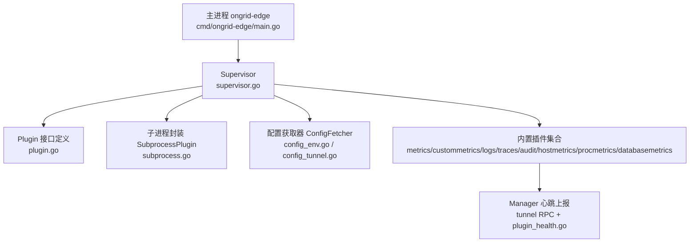
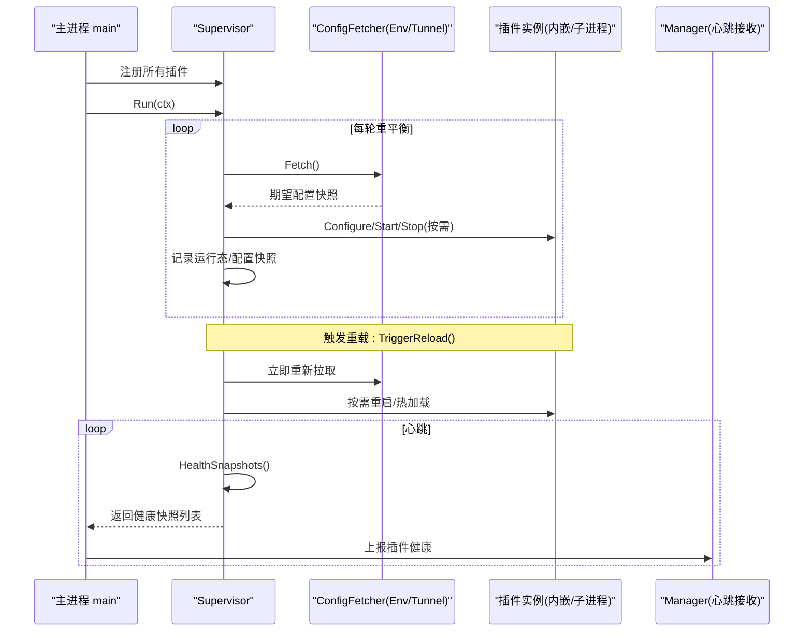
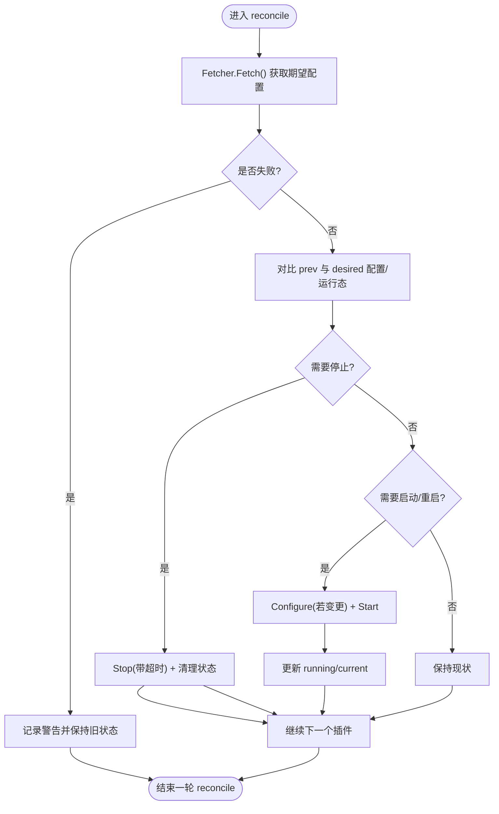
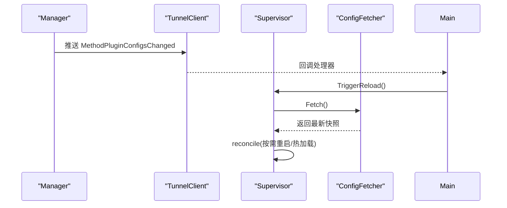
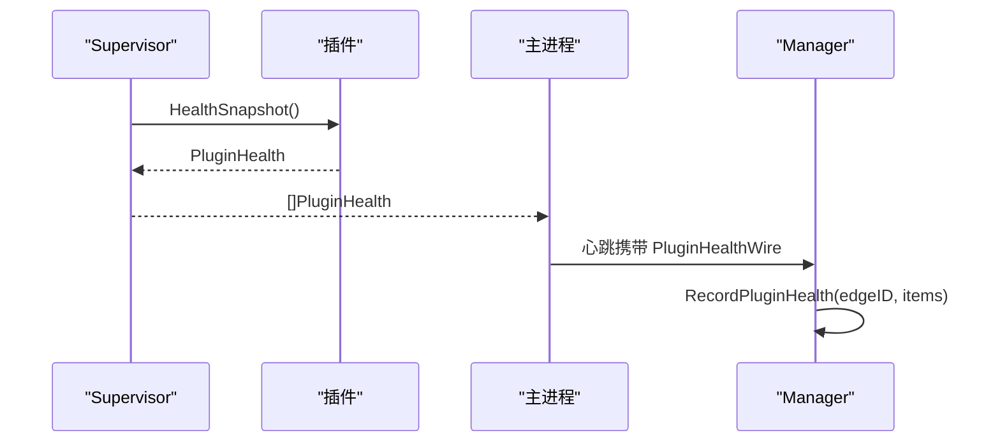
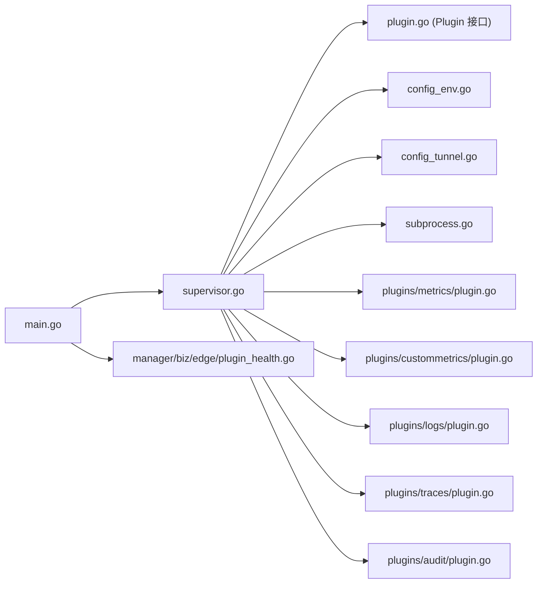

# 插件管理系统

<cite>
**本文引用的文件**
- [cmd/ongrid-edge/main.go](file://cmd/ongrid-edge/main.go)
- [internal/edgeagent/plugins/plugin.go](file://internal/edgeagent/plugins/plugin.go)
- [internal/edgeagent/plugins/supervisor.go](file://internal/edgeagent/plugins/supervisor.go)
- [internal/edgeagent/plugins/subprocess.go](file://internal/edgeagent/plugins/subprocess.go)
- [internal/edgeagent/plugins/config_env.go](file://internal/edgeagent/plugins/config_env.go)
- [internal/edgeagent/plugins/config_tunnel.go](file://internal/edgeagent/plugins/config_tunnel.go)
- [internal/edgeagent/plugins/metrics/plugin.go](file://internal/edgeagent/plugins/metrics/plugin.go)
- [internal/edgeagent/plugins/custommetrics/plugin.go](file://internal/edgeagent/plugins/custommetrics/plugin.go)
- [internal/edgeagent/plugins/logs/plugin.go](file://internal/edgeagent/plugins/logs/plugin.go)
- [internal/edgeagent/plugins/traces/plugin.go](file://internal/edgeagent/plugins/traces/plugin.go)
- [internal/edgeagent/plugins/audit/plugin.go](file://internal/edgeagent/plugins/audit/plugin.go)
- [internal/manager/biz/edge/plugin_health.go](file://internal/manager/biz/edge/plugin_health.go)
</cite>

## 目录
1. [简介](#简介)
2. [项目结构](#项目结构)
3. [核心组件](#核心组件)
4. [架构总览](#架构总览)
5. [详细组件分析](#详细组件分析)
6. [依赖关系分析](#依赖关系分析)
7. [性能与可靠性考量](#性能与可靠性考量)
8. [故障排查指南](#故障排查指南)
9. [结论](#结论)
10. [附录：内置插件集成与自定义开发](#附录内置插件集成与自定义开发)

## 简介
本文件面向边缘代理（ongrid-edge）的“插件管理系统”，系统性阐述插件生命周期管理、Supervisor 设计模式、子进程管理策略、配置热重载机制、健康快照采集与上报，以及内置插件（audit/logs/traces/metrics 等）的集成方式与自定义插件开发指南。文档同时提供调试方法与故障排查技巧，帮助读者快速定位问题并高效扩展能力。

## 项目结构
边缘侧插件系统位于 internal/edgeagent/plugins 下，由 Supervisor 统一编排；具体插件以“in-process”或“subprocess”两种形态实现，并通过统一的 Plugin 接口暴露给上层。主入口在 cmd/ongrid-edge/main.go 中完成插件注册、Supervisor 启动与健康上报链路装配。



图表来源
- [cmd/ongrid-edge/main.go:189-305](file://cmd/ongrid-edge/main.go#L189-L305)
- [internal/edgeagent/plugins/supervisor.go:1-133](file://internal/edgeagent/plugins/supervisor.go#L1-L133)
- [internal/edgeagent/plugins/plugin.go:1-119](file://internal/edgeagent/plugins/plugin.go#L1-L119)
- [internal/edgeagent/plugins/subprocess.go:1-102](file://internal/edgeagent/plugins/subprocess.go#L1-L102)
- [internal/edgeagent/plugins/config_env.go:1-71](file://internal/edgeagent/plugins/config_env.go#L1-L71)
- [internal/edgeagent/plugins/config_tunnel.go:1-108](file://internal/edgeagent/plugins/config_tunnel.go#L1-L108)
- [internal/manager/biz/edge/plugin_health.go:1-70](file://internal/manager/biz/edge/plugin_health.go#L1-L70)

章节来源
- [cmd/ongrid-edge/main.go:189-305](file://cmd/ongrid-edge/main.go#L189-L305)

## 核心组件
- Plugin 接口：统一描述插件的生命周期方法（Name/Configure/Start/Stop/HealthSnapshot），屏蔽 in-process 与 subprocess 差异。
- Supervisor：维护插件注册表，周期性拉取配置快照，对比期望与实际状态，执行 Configure/Start/Stop 操作，并在退出时优雅关闭所有插件。
- SubprocessPlugin：通用子进程包装器，负责渲染配置、启动/停止子进程、崩溃恢复（指数退避）、日志捕获与健康状态更新。
- ConfigFetcher：抽象配置来源，支持环境变量与环境回退（EnvConfigFetcher）与隧道拉取（TunnelConfigFetcher）。
- 内置插件：metrics、custommetrics、logs、traces、audit、hostmetrics、procmetrics、databasemetrics 等，按信号域命名（metrics/logs/traces）。

章节来源
- [internal/edgeagent/plugins/plugin.go:18-119](file://internal/edgeagent/plugins/plugin.go#L18-L119)
- [internal/edgeagent/plugins/supervisor.go:12-133](file://internal/edgeagent/plugins/supervisor.go#L12-L133)
- [internal/edgeagent/plugins/subprocess.go:17-102](file://internal/edgeagent/plugins/subprocess.go#L17-L102)
- [internal/edgeagent/plugins/config_env.go:10-71](file://internal/edgeagent/plugins/config_env.go#L10-L71)
- [internal/edgeagent/plugins/config_tunnel.go:12-108](file://internal/edgeagent/plugins/config_tunnel.go#L12-L108)

## 架构总览
Supervisor 作为控制面，驱动插件发现、启动、监控与优雅关闭；子进程插件通过 SubprocessPlugin 获得隔离、资源边界与崩溃恢复；配置来源支持在线下发与离线回退；健康快照随心跳上报至 Manager，形成闭环观测。



图表来源
- [cmd/ongrid-edge/main.go:245-305](file://cmd/ongrid-edge/main.go#L245-L305)
- [internal/edgeagent/plugins/supervisor.go:114-230](file://internal/edgeagent/plugins/supervisor.go#L114-L230)
- [internal/edgeagent/plugins/config_env.go:46-71](file://internal/edgeagent/plugins/config_env.go#L46-L71)
- [internal/edgeagent/plugins/config_tunnel.go:58-108](file://internal/edgeagent/plugins/config_tunnel.go#L58-L108)
- [internal/manager/biz/edge/plugin_health.go:41-70](file://internal/manager/biz/edge/plugin_health.go#L41-L70)

## 详细组件分析

### Supervisor 设计与协调流程
- 职责：维护插件注册表、当前配置快照与运行态；周期性 reconcile，处理新增启用、禁用、配置变更场景。
- 并发模型：Run 在独立 goroutine 运行；Register 应在启动前调用；reloadSignal 用于外部触发即时重载。
- 优雅关闭：ctx 取消后，遍历已运行插件，带超时 Stop，确保可回收。



图表来源
- [internal/edgeagent/plugins/supervisor.go:135-230](file://internal/edgeagent/plugins/supervisor.go#L135-L230)

章节来源
- [internal/edgeagent/plugins/supervisor.go:12-133](file://internal/edgeagent/plugins/supervisor.go#L12-L133)
- [internal/edgeagent/plugins/supervisor.go:135-230](file://internal/edgeagent/plugins/supervisor.go#L135-L230)
- [internal/edgeagent/plugins/supervisor.go:232-251](file://internal/edgeagent/plugins/supervisor.go#L232-L251)

### 子进程管理策略（SubprocessPlugin）
- 进程隔离：每个子进程拥有独立工作目录、配置文件与日志文件，避免共享状态污染。
- 资源限制：通过 systemd 的 ReadWritePaths= 与 ProtectSystem=strict 约束子进程写权限范围。
- 崩溃恢复：runLoop 检测非预期退出，采用指数退避（1s→2s→…上限5分钟）重启；RestartCount 单调递增，仅在从禁用到启用的新配置时重置。
- 优雅关闭：Cancel 发送 SIGTERM，WaitDelay 设置 SIGKILL 兜底时间，Stop 等待 runLoop 退出但带超时保护。

```mermaid
classDiagram
class SubprocessPlugin {
-name string
-binary string
-workDir string
-configFile string
-configRender func
-args func
-log Logger
-cfg PluginConfig
-cmd *exec.Cmd
-cancelRun context.CancelFunc
-health PluginHealth
-wantRunning bool
-stoppedCh chan struct{}
+Name() string
+Configure(cfg) error
+Start(ctx) error
+Stop(ctx) error
+HealthSnapshot() PluginHealth
-runLoop(ctx, stopped)
-runOnce(ctx) error
-setState(st, err, pid)
-bumpRestart()
}
```

图表来源
- [internal/edgeagent/plugins/subprocess.go:32-102](file://internal/edgeagent/plugins/subprocess.go#L32-L102)
- [internal/edgeagent/plugins/subprocess.go:194-311](file://internal/edgeagent/plugins/subprocess.go#L194-L311)

章节来源
- [internal/edgeagent/plugins/subprocess.go:107-183](file://internal/edgeagent/plugins/subprocess.go#L107-L183)
- [internal/edgeagent/plugins/subprocess.go:194-311](file://internal/edgeagent/plugins/subprocess.go#L194-L311)

### 配置热重载机制（TriggerReload）与工作目录管理
- 热重载：Manager 推送 MethodPluginConfigsChanged 时，主进程调用 supervisor.TriggerReload()，使 Supervisor 立即拉取最新配置并 reconcile。
- 配置来源：优先 TunnelConfigFetcher（在线下发），不可用时回退 EnvConfigFetcher（离线/冷启动可用）。
- 工作目录：每个插件在 workDir/plugins/<name> 下拥有独立目录，存放渲染后的配置文件、位置文件、日志与数据，便于隔离与审计。



图表来源
- [cmd/ongrid-edge/main.go:298-305](file://cmd/ongrid-edge/main.go#L298-L305)
- [internal/edgeagent/plugins/supervisor.go:84-92](file://internal/edgeagent/plugins/supervisor.go#L84-L92)
- [internal/edgeagent/plugins/config_tunnel.go:58-108](file://internal/edgeagent/plugins/config_tunnel.go#L58-L108)
- [internal/edgeagent/plugins/config_env.go:46-71](file://internal/edgeagent/plugins/config_env.go#L46-L71)

章节来源
- [cmd/ongrid-edge/main.go:245-305](file://cmd/ongrid-edge/main.go#L245-L305)
- [internal/edgeagent/plugins/supervisor.go:84-92](file://internal/edgeagent/plugins/supervisor.go#L84-L92)
- [internal/edgeagent/plugins/config_tunnel.go:12-108](file://internal/edgeagent/plugins/config_tunnel.go#L12-L108)
- [internal/edgeagent/plugins/config_env.go:10-71](file://internal/edgeagent/plugins/config_env.go#L10-L71)

### 健康快照（HealthSnapshots）收集与上报
- 采集：Supervisor 定期调用各插件 HealthSnapshot()，汇总为 []PluginHealth。
- 上报：主进程在每次心跳中将快照转换为 tunnel.PluginHealthWire 并上报。
- 存储：Manager 端 edge biz 层 RecordPluginHealth 将最近一次快照保存在内存，供 UI 展示。



图表来源
- [internal/edgeagent/plugins/supervisor.go:94-110](file://internal/edgeagent/plugins/supervisor.go#L94-L110)
- [cmd/ongrid-edge/main.go:258-297](file://cmd/ongrid-edge/main.go#L258-L297)
- [internal/manager/biz/edge/plugin_health.go:41-70](file://internal/manager/biz/edge/plugin_health.go#L41-L70)

章节来源
- [internal/edgeagent/plugins/supervisor.go:94-110](file://internal/edgeagent/plugins/supervisor.go#L94-L110)
- [cmd/ongrid-edge/main.go:258-297](file://cmd/ongrid-edge/main.go#L258-L297)
- [internal/manager/biz/edge/plugin_health.go:1-70](file://internal/manager/biz/edge/plugin_health.go#L1-L70)

### 内置插件集成方式
- metrics（in-process）：本地抓取 Prometheus /metrics，经 push_prom_samples 上报；支持目标 URL、间隔、超时、TLS、Bearer Token、额外标签等 Spec。
- custommetrics（in-process）：多目标抓取，维护 TargetHealth 列表，支持 per-target 开关、间隔、超时与 scrape_up 指标。
- logs（subprocess promtail）：渲染 promtail.yaml，直接推送至 manager nginx Loki 端点；自动发现 audit 输出路径。
- traces（subprocess otelcol-contrib）：渲染 otelcol.yaml，接受 OTLP gRPC/HTTP，推送至 /v1/traces。
- audit（subprocess auditbeat）：Linux 专用，写入 JSONL 到 <workDir>/audit/audit.jsonl，由 logs 插件自动 tail。

章节来源
- [internal/edgeagent/plugins/metrics/plugin.go:1-121](file://internal/edgeagent/plugins/metrics/plugin.go#L1-L121)
- [internal/edgeagent/plugins/custommetrics/plugin.go:1-133](file://internal/edgeagent/plugins/custommetrics/plugin.go#L1-L133)
- [internal/edgeagent/plugins/logs/plugin.go:1-54](file://internal/edgeagent/plugins/logs/plugin.go#L1-L54)
- [internal/edgeagent/plugins/traces/plugin.go:1-48](file://internal/edgeagent/plugins/traces/plugin.go#L1-L48)
- [internal/edgeagent/plugins/audit/plugin.go:1-92](file://internal/edgeagent/plugins/audit/plugin.go#L1-L92)

## 依赖关系分析
- 主进程依赖：插件注册、Supervisor 启动、健康上报函数注入、重载回调注册。
- Supervisor 依赖：ConfigFetcher 抽象（Env/Tunnel）、Plugin 接口、日志与定时器。
- SubprocessPlugin 依赖：os/exec、syscall、文件系统 I/O、上下文与超时控制。
- 内置插件依赖：metrics/custommetrics 依赖 tunnel RPC；logs/traces/audit 依赖各自二进制与渲染逻辑。



图表来源
- [cmd/ongrid-edge/main.go:189-305](file://cmd/ongrid-edge/main.go#L189-L305)
- [internal/edgeagent/plugins/supervisor.go:1-133](file://internal/edgeagent/plugins/supervisor.go#L1-L133)
- [internal/edgeagent/plugins/plugin.go:1-119](file://internal/edgeagent/plugins/plugin.go#L1-L119)
- [internal/edgeagent/plugins/config_env.go:1-71](file://internal/edgeagent/plugins/config_env.go#L1-L71)
- [internal/edgeagent/plugins/config_tunnel.go:1-108](file://internal/edgeagent/plugins/config_tunnel.go#L1-L108)
- [internal/edgeagent/plugins/subprocess.go:1-102](file://internal/edgeagent/plugins/subprocess.go#L1-L102)
- [internal/edgeagent/plugins/metrics/plugin.go:1-121](file://internal/edgeagent/plugins/metrics/plugin.go#L1-L121)
- [internal/edgeagent/plugins/custommetrics/plugin.go:1-133](file://internal/edgeagent/plugins/custommetrics/plugin.go#L1-L133)
- [internal/edgeagent/plugins/logs/plugin.go:1-54](file://internal/edgeagent/plugins/logs/plugin.go#L1-L54)
- [internal/edgeagent/plugins/traces/plugin.go:1-48](file://internal/edgeagent/plugins/traces/plugin.go#L1-L48)
- [internal/edgeagent/plugins/audit/plugin.go:1-92](file://internal/edgeagent/plugins/audit/plugin.go#L1-L92)
- [internal/manager/biz/edge/plugin_health.go:1-70](file://internal/manager/biz/edge/plugin_health.go#L1-L70)

章节来源
- [cmd/ongrid-edge/main.go:189-305](file://cmd/ongrid-edge/main.go#L189-L305)

## 性能与可靠性考量
- 子进程崩溃恢复：指数退避避免雪崩重启，最大退避上限防止频繁抖动。
- 配置比较语义化：configEqual 基于关键字段与 Spec 内容比较，减少不必要的重启。
- 健康上报频率：随心跳周期上报，保证近实时可见性且不引入额外开销。
- 优雅关闭：Stop 带超时，shutdown 阶段对所有插件统一 Stop，避免悬挂进程。
- 配置回退：Tunnel 不可用时回退 Env，保障离线/冷启动可用性。

[本节为通用指导，不直接分析具体文件]

## 故障排查指南
- 插件未启动/频繁重启
  - 检查子进程二进制是否存在于 binDir；查看 SubprocessPlugin 日志与 workDir 下的 .log 文件。
  - 关注 LastError 与 RestartCount，确认是否为配置错误或二进制缺失导致。
- 配置未生效
  - 确认 Manager 是否推送了 MethodPluginConfigsChanged；检查 Supervisor 是否收到 TriggerReload。
  - 核对 ConfigFetcher 返回的快照（Tunnel/Env），确认 Enabled 与 Endpoint/AuthUser/AuthPass 是否正确。
- 指标/日志/链路无数据
  - metrics/custommetrics：检查 target_url、scrape_interval/timeout、TLS/Bearer 配置；观察 scrape 成功计数与错误信息。
  - logs：确认 promtail 配置与 positions.yaml 持久化；验证 audit JSONL 路径是否被自动发现。
  - traces：确认 otelcol 配置与 /v1/traces 可达性。
- 健康状态异常
  - 查看 Manager 侧 plugin_health 缓存是否更新；确认心跳是否正常上报。

章节来源
- [internal/edgeagent/plugins/subprocess.go:194-311](file://internal/edgeagent/plugins/subprocess.go#L194-L311)
- [internal/edgeagent/plugins/supervisor.go:135-230](file://internal/edgeagent/plugins/supervisor.go#L135-L230)
- [internal/edgeagent/plugins/metrics/plugin.go:214-282](file://internal/edgeagent/plugins/metrics/plugin.go#L214-L282)
- [internal/edgeagent/plugins/custommetrics/plugin.go:187-229](file://internal/edgeagent/plugins/custommetrics/plugin.go#L187-L229)
- [internal/edgeagent/plugins/logs/plugin.go:27-53](file://internal/edgeagent/plugins/logs/plugin.go#L27-L53)
- [internal/edgeagent/plugins/traces/plugin.go:31-47](file://internal/edgeagent/plugins/traces/plugin.go#L31-L47)
- [internal/edgeagent/plugins/audit/plugin.go:46-92](file://internal/edgeagent/plugins/audit/plugin.go#L46-L92)
- [internal/manager/biz/edge/plugin_health.go:41-70](file://internal/manager/biz/edge/plugin_health.go#L41-L70)

## 结论
插件管理系统通过 Supervisor 统一编排、SubprocessPlugin 提供进程级隔离与自愈、ConfigFetcher 实现灵活配置来源、以及健康快照上报闭环，构建了高可用、可扩展的边缘可观测性与安全能力体系。内置插件覆盖审计、日志、追踪与指标采集，配合热重载与优雅关闭，满足生产环境的稳定性与运维需求。

[本节为总结性内容，不直接分析具体文件]

## 附录：内置插件集成与自定义开发

### 内置插件清单与用途
- audit：审计事件采集（auditbeat），输出 JSONL 供 logs 插件自动 tail。
- logs：Promtail 子进程，推送至 Loki。
- traces：OpenTelemetry Collector 子进程，推送至 /v1/traces。
- metrics：内嵌抓取 node_exporter 等 /metrics，经 tunnel 上报。
- custommetrics：多目标 Prometheus 抓取，支持 per-target 健康。
- hostmetrics：node_exporter 子进程，暴露 node_* 指标。
- procmetrics：process-exporter 子进程，暴露进程级指标。
- databasemetrics：数据库导出器子进程，读取本地密钥并采集。

章节来源
- [cmd/ongrid-edge/main.go:199-237](file://cmd/ongrid-edge/main.go#L199-L237)

### 自定义插件开发指南
- 选择实现形态
  - In-process：适合轻量抓取/计算，直接实现 Plugin 接口。
  - Subprocess：适合复用第三方二进制，使用 SubprocessPlugin 包装。
- 关键步骤
  - 定义 Name 常量与 New 构造器，返回实现 Plugin 的对象。
  - 若为子进程：提供 Binary、WorkDir、ConfigFile、ConfigRender、Args。
  - 若为内嵌：实现 Configure/Start/Stop/HealthSnapshot，注意并发安全与优雅关闭。
  - 在 main 中注册插件，加入 registered 列表，以便 Supervisor 管理。
- 配置项
  - 使用 PluginConfig.Spec 传递插件特定参数；Endpoint/AuthUser/AuthPass 用于数据面连接。
- 健康与可观测性
  - 及时更新 HealthSnapshot，必要时维护 Targets 列表（如 custommetrics）。
- 测试建议
  - 使用静态 ConfigFetcher 与 fake Plugin 进行单元测试；覆盖配置变更、崩溃恢复与优雅关闭路径。

章节来源
- [internal/edgeagent/plugins/plugin.go:18-119](file://internal/edgeagent/plugins/plugin.go#L18-L119)
- [internal/edgeagent/plugins/subprocess.go:52-102](file://internal/edgeagent/plugins/subprocess.go#L52-L102)
- [cmd/ongrid-edge/main.go:199-237](file://cmd/ongrid-edge/main.go#L199-L237)