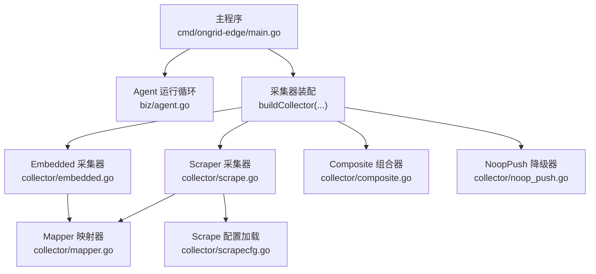
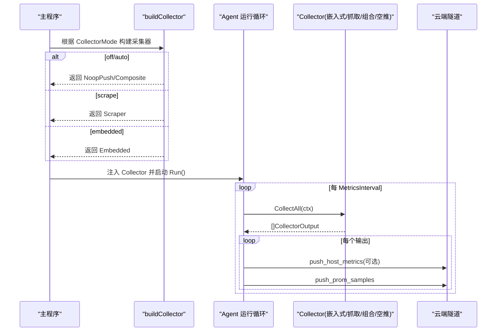
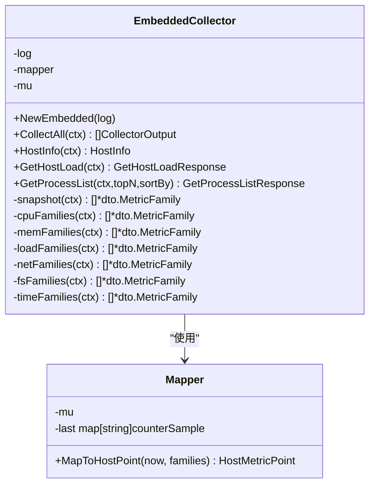
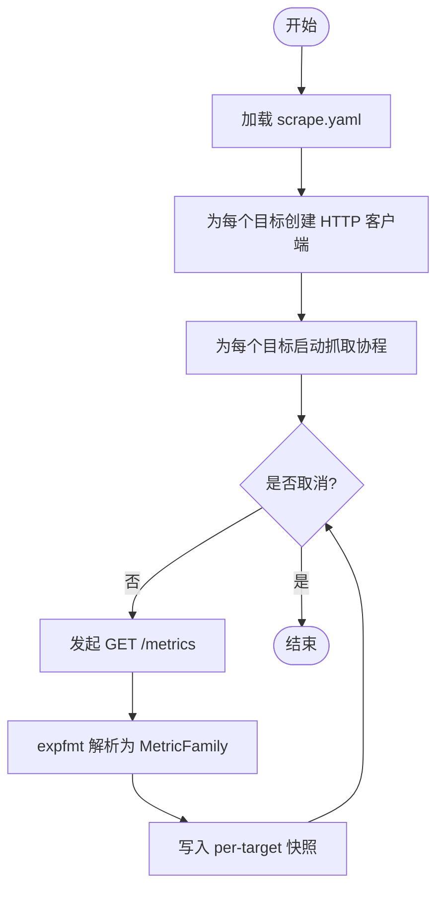
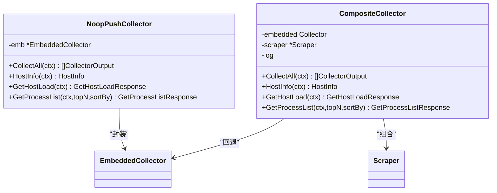
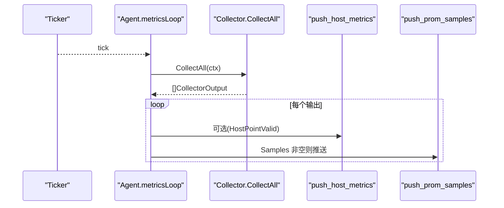
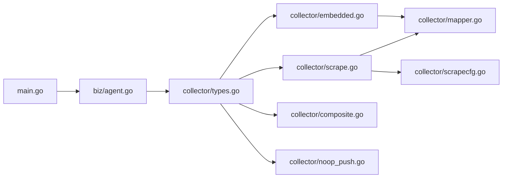

# 数据采集系统

<cite>
**本文引用的文件**   
- [cmd/ongrid-edge/main.go](file://cmd/ongrid-edge/main.go)
- [internal/edgeagent/biz/agent.go](file://internal/edgeagent/biz/agent.go)
- [internal/edgeagent/collector/doc.go](file://internal/edgeagent/collector/doc.go)
- [internal/edgeagent/collector/types.go](file://internal/edgeagent/collector/types.go)
- [internal/edgeagent/collector/embedded.go](file://internal/edgeagent/collector/embedded.go)
- [internal/edgeagent/collector/scrape.go](file://internal/edgeagent/collector/scrape.go)
- [internal/edgeagent/collector/composite.go](file://internal/edgeagent/collector/composite.go)
- [internal/edgeagent/collector/noop_push.go](file://internal/edgeagent/collector/noop_push.go)
- [internal/edgeagent/collector/mapper.go](file://internal/edgeagent/collector/mapper.go)
- [internal/edgeagent/collector/scrapecfg.go](file://internal/edgeagent/collector/scrapecfg.go)
</cite>

## 目录
1. [简介](#简介)
2. [项目结构](#项目结构)
3. [核心组件](#核心组件)
4. [架构总览](#架构总览)
5. [详细组件分析](#详细组件分析)
6. [依赖关系分析](#依赖关系分析)
7. [性能与资源限制](#性能与资源限制)
8. [故障排查指南](#故障排查指南)
9. [结论](#结论)
10. [附录：配置示例与模式对比](#附录配置示例与模式对比)

## 简介
本文件面向边缘代理的数据采集子系统，系统性阐述多模式采集架构（embedded/scrape/auto/off）的实现原理、适用场景与调度机制。重点覆盖：
- Embedded 采集器基于 gopsutil 的本地指标收集（CPU、内存、负载、网络、磁盘等），并输出 node_exporter 兼容命名；
- Scraper 采集器的 Prometheus 指标抓取实现（目标发现、并发控制、数据转换）；
- Composite 组合模式与 NoopPush 降级策略；
- 采集调度器的工作机制、性能优化策略与资源限制；
- 不同采集模式的配置要点与性能对比分析。

## 项目结构
数据采集相关代码主要位于 edge agent 进程内，按“业务编排 + 采集实现”分层组织：
- 入口与模式装配：cmd/ongrid-edge/main.go
- 运行循环与调度：internal/edgeagent/biz/agent.go
- 采集接口与实现：internal/edgeagent/collector/*

图表来源
- [cmd/ongrid-edge/main.go:316-376](file://cmd/ongrid-edge/main.go#L316-L376)
- [internal/edgeagent/biz/agent.go:454-473](file://internal/edgeagent/biz/agent.go#L454-L473)
- [internal/edgeagent/collector/embedded.go:1-403](file://internal/edgeagent/collector/embedded.go#L1-L403)
- [internal/edgeagent/collector/scrape.go:1-415](file://internal/edgeagent/collector/scrape.go#L1-L415)
- [internal/edgeagent/collector/composite.go:1-92](file://internal/edgeagent/collector/composite.go#L1-L92)
- [internal/edgeagent/collector/noop_push.go:1-69](file://internal/edgeagent/collector/noop_push.go#L1-L69)
- [internal/edgeagent/collector/mapper.go:1-373](file://internal/edgeagent/collector/mapper.go#L1-L373)
- [internal/edgeagent/collector/scrapecfg.go:1-91](file://internal/edgeagent/collector/scrapecfg.go#L1-L91)

章节来源
- [cmd/ongrid-edge/main.go:316-376](file://cmd/ongrid-edge/main.go#L316-L376)
- [internal/edgeagent/biz/agent.go:454-473](file://internal/edgeagent/biz/agent.go#L454-L473)

## 核心组件
- 采集接口与输出
  - Collector 接口定义统一的 CollectAll、HostInfo、GetHostLoad、GetProcessList 能力；
  - CollectorOutput 包含 Source、HostPoint（8字段快速路径）、Samples（开放集 Prom 样本）。
- 采集器实现
  - EmbeddedCollector：gopsutil 本地读取，输出 node_exporter 兼容 MetricFamily；
  - Scraper：HTTP /metrics 抓取，支持多目标并发、Bearer Token、TLS 选项；
  - CompositeCollector：组合 embedded 与 scrape，host-role 优先使用 scrape 的快速路径；
  - NoopPushCollector：抑制周期性 push，保留按需 RPC 快照能力。
- 映射与转换
  - Mapper：从 MetricFamily 提取 HostMetricPoint（含 CPU%、内存使用率、负载、网络速率、磁盘使用率）；
  - FlattenSamples：将 MetricFamily 扁平化为 tunnel.PromSample 列表。
- 配置
  - ScrapeConfig/ScrapeTarget：描述目标 URL、角色（host/component）、间隔、超时、认证与静态标签等。

章节来源
- [internal/edgeagent/collector/types.go:1-58](file://internal/edgeagent/collector/types.go#L1-L58)
- [internal/edgeagent/collector/embedded.go:1-403](file://internal/edgeagent/collector/embedded.go#L1-L403)
- [internal/edgeagent/collector/scrape.go:1-415](file://internal/edgeagent/collector/scrape.go#L1-L415)
- [internal/edgeagent/collector/composite.go:1-92](file://internal/edgeagent/collector/composite.go#L1-L92)
- [internal/edgeagent/collector/noop_push.go:1-69](file://internal/edgeagent/collector/noop_push.go#L1-L69)
- [internal/edgeagent/collector/mapper.go:1-373](file://internal/edgeagent/collector/mapper.go#L1-L373)
- [internal/edgeagent/collector/scrapecfg.go:1-91](file://internal/edgeagent/collector/scrapecfg.go#L1-L91)

## 架构总览
多模式采集在启动时根据配置选择具体实现，统一通过 Agent 的定时循环驱动采集与推送。

图表来源
- [cmd/ongrid-edge/main.go:316-376](file://cmd/ongrid-edge/main.go#L316-L376)
- [internal/edgeagent/biz/agent.go:454-530](file://internal/edgeagent/biz/agent.go#L454-L530)

## 详细组件分析

### 多模式采集架构（off/auto/embedded/scrape）
- off/none/""
  - 行为：不执行周期性 push，仅保留按需 RPC（host_info/get_host_load/get_process_list）；
  - 适用：已启用 hostmetrics/procmetrics 插件，由 manager 侧直接抓取子进程暴露的指标，避免重复系列；
  - 实现：NoopPush 包装 Embedded，CollectAll 返回空切片。
- auto
  - 行为：同时启用 embedded 基线与 scrape 目标；若存在 host-role 的 scrape 成功快照，则用其替代 embedded 的快速路径；
  - 适用：希望平滑迁移到外部 exporter 的同时保留本地兜底；
  - 实现：CompositeCollector 组合 embedded 与 scraper。
- embedded
  - 行为：仅使用 gopsutil 本地采集并周期性 push；
  - 适用：无外部 exporter 或需要最小依赖的场景；
  - 实现：EmbeddedCollector。
- scrape
  - 行为：仅通过 HTTP 抓取 /metrics，并按目标维度输出；
  - 适用：已有 node_exporter/process-exporter 或其他 Prometheus 暴露端点；
  - 实现：Scraper。

章节来源
- [cmd/ongrid-edge/main.go:316-376](file://cmd/ongrid-edge/main.go#L316-L376)
- [internal/edgeagent/collector/noop_push.go:1-69](file://internal/edgeagent/collector/noop_push.go#L1-L69)
- [internal/edgeagent/collector/composite.go:1-92](file://internal/edgeagent/collector/composite.go#L1-L92)

### Embedded 采集器（gopsutil 本地指标）
- 指标范围
  - CPU：node_cpu_seconds_total{cpu,mode}；
  - 内存：node_memory_MemTotal_bytes、MemAvailable_bytes、MemFree_bytes、Buffers_bytes、Cached_bytes；
  - 负载：node_load1/5/15；
  - 网络：node_network_receive/transmit_{bytes,packets}_total{device}；
  - 文件系统：node_filesystem_size/avail/free_bytes{mountpoint,fstype,device}；
  - 时间：node_time_seconds、node_boot_time_seconds。
- 快速路径
  - 通过 Mapper 计算 CPUPct、NetRxBps/NetTxBps、DiskUsedPct、Load1/5/15、MemPct；
  - 首次调用 rate 类字段为 0，后续基于计数器差值计算。
- 主机信息
  - OS/Arch/CPUCount/Hostname/KernelVersion/Fingerprint/HardwareFingerprint/IPAddress/MemTotalBytes 等。
- 进程列表
  - 遍历进程表，按 CPU 或内存排序，返回 topN。

图表来源
- [internal/edgeagent/collector/embedded.go:1-403](file://internal/edgeagent/collector/embedded.go#L1-L403)
- [internal/edgeagent/collector/mapper.go:1-373](file://internal/edgeagent/collector/mapper.go#L1-L373)

章节来源
- [internal/edgeagent/collector/embedded.go:1-403](file://internal/edgeagent/collector/embedded.go#L1-L403)
- [internal/edgeagent/collector/mapper.go:1-373](file://internal/edgeagent/collector/mapper.go#L1-L373)

### Scraper 采集器（Prometheus 指标抓取）
- 目标发现与配置
  - 从 YAML 配置文件加载 targets，支持 name/url/role/interval/timeout/bearer_token_file/tls_insecure/static_labels；
  - role=host 表示该目标可作为 host 快速路径来源；默认 component。
- 并发与生命周期
  - 每个 target 一个 goroutine，errgroup 管理生命周期；
  - 首次立即抓取一次，随后按 interval 定时抓取；
  - 失败只记录日志，不影响其他目标。
- 认证与安全
  - 支持 Bearer Token 文件读取并设置 Authorization；
  - TLS 客户端最低版本 1.2，可跳过证书校验（谨慎使用）。
- 数据转换
  - 解析 text/plain 格式为 MetricFamily；
  - 存储最近成功快照，按 source="scrape:<name>" 输出；
  - 对 host-role 目标生成 HostPoint 快速路径。

图表来源
- [internal/edgeagent/collector/scrape.go:1-415](file://internal/edgeagent/collector/scrape.go#L1-L415)
- [internal/edgeagent/collector/scrapecfg.go:1-91](file://internal/edgeagent/collector/scrapecfg.go#L1-L91)

章节来源
- [internal/edgeagent/collector/scrape.go:1-415](file://internal/edgeagent/collector/scrape.go#L1-L415)
- [internal/edgeagent/collector/scrapecfg.go:1-91](file://internal/edgeagent/collector/scrapecfg.go#L1-L91)

### Composite 组合模式与 NoopPush 降级
- CompositeCollector
  - 合并 scrape 输出与 embedded 基线；
  - 若存在 host-role 的 scrape 快照且有效，则优先使用其快速路径；否则回退到 embedded；
  - 所有 scrape 目标的 rich-path 样本均被输出。
- NoopPushCollector
  - 屏蔽周期性 push（CollectAll 返回空），但保留 HostInfo/GetHostLoad/GetProcessList 的实时快照；
  - 用于 off 模式，避免与外部 exporter 产生重复 node_* 系列。

图表来源
- [internal/edgeagent/collector/composite.go:1-92](file://internal/edgeagent/collector/composite.go#L1-L92)
- [internal/edgeagent/collector/noop_push.go:1-69](file://internal/edgeagent/collector/noop_push.go#L1-L69)

章节来源
- [internal/edgeagent/collector/composite.go:1-92](file://internal/edgeagent/collector/composite.go#L1-L92)
- [internal/edgeagent/collector/noop_push.go:1-69](file://internal/edgeagent/collector/noop_push.go#L1-L69)

### 采集调度器工作机制
- 心跳与指标双循环
  - heartbeatLoop：定期发送心跳，连续失败达到阈值后退出以触发 systemd 重启；
  - metricsLoop：按 MetricsInterval 采样，逐条 push_host_metrics（可选）与 push_prom_samples。
- 错误处理
  - 单次 push 失败仅记录日志，不阻塞下一次采样；
  - 采集器错误可能返回部分结果，仍会尝试推送可用数据。
- 升级流程
  - 收到 apply_package 信号后优雅退出，供 systemd 替换二进制后重启。

图表来源
- [internal/edgeagent/biz/agent.go:454-530](file://internal/edgeagent/biz/agent.go#L454-L530)

章节来源
- [internal/edgeagent/biz/agent.go:454-530](file://internal/edgeagent/biz/agent.go#L454-L530)

## 依赖关系分析
- 模块耦合
  - main 负责模式装配与生命周期管理；
  - biz.Agent 作为调度中心，解耦于具体采集实现；
  - collector 包提供多种实现，并通过 Mapper 统一输出；
  - scrapecfg 提供配置解析与校验。
- 外部依赖
  - gopsutil：本地指标读取；
  - expfmt：Prometheus text 格式解析；
  - errgroup：并发控制。

图表来源
- [cmd/ongrid-edge/main.go:316-376](file://cmd/ongrid-edge/main.go#L316-L376)
- [internal/edgeagent/biz/agent.go:1-559](file://internal/edgeagent/biz/agent.go#L1-L559)
- [internal/edgeagent/collector/types.go:1-58](file://internal/edgeagent/collector/types.go#L1-L58)
- [internal/edgeagent/collector/embedded.go:1-403](file://internal/edgeagent/collector/embedded.go#L1-L403)
- [internal/edgeagent/collector/scrape.go:1-415](file://internal/edgeagent/collector/scrape.go#L1-L415)
- [internal/edgeagent/collector/composite.go:1-92](file://internal/edgeagent/collector/composite.go#L1-L92)
- [internal/edgeagent/collector/noop_push.go:1-69](file://internal/edgeagent/collector/noop_push.go#L1-L69)
- [internal/edgeagent/collector/mapper.go:1-373](file://internal/edgeagent/collector/mapper.go#L1-L373)
- [internal/edgeagent/collector/scrapecfg.go:1-91](file://internal/edgeagent/collector/scrapecfg.go#L1-L91)

## 性能与资源限制
- 并发模型
  - Scraper 为每个目标独立 goroutine，errgroup 统一管理；
  - Embedded 采集使用互斥锁保护 snapshot，避免并发竞争。
- 网络与连接复用
  - 每个目标一个 http.Client，开启 keep-alive，减少握手开销；
  - 支持 TLS 1.2+，可按需跳过证书校验（生产慎用）。
- 指标转换与去重
  - Mapper 维护计数器缓存，按 (metric_name + 排序后的 label 串) 稳定键位计算差值；
  - FlattenSamples 过滤 NaN/Inf，避免 JSON 编码异常。
- 调度参数
  - HeartbeatInterval、MetricsInterval、MetricsBatchSize 可在 Agent 构造时调整；
  - scrape 目标支持独立 interval 与 timeout，便于差异化控制。
- 资源建议
  - 合理设置 scrape interval 与 batch size，避免频繁网络往返；
  - 对高基数设备（如大量网卡/分区）注意指标数量增长对带宽与后端压力。

章节来源
- [internal/edgeagent/collector/scrape.go:1-415](file://internal/edgeagent/collector/scrape.go#L1-L415)
- [internal/edgeagent/collector/embedded.go:1-403](file://internal/edgeagent/collector/embedded.go#L1-L403)
- [internal/edgeagent/collector/mapper.go:1-373](file://internal/edgeagent/collector/mapper.go#L1-L373)
- [internal/edgeagent/biz/agent.go:115-135](file://internal/edgeagent/biz/agent.go#L115-L135)

## 故障排查指南
- 常见问题定位
  - scrape 失败：检查目标 URL、状态码、Bearer Token 文件可读性、TLS 配置；
  - 指标缺失：确认目标暴露的 metric 名称是否符合 node_exporter 约定；
  - 重复指标：off 模式下避免与外部 exporter 同时启用 push；
  - 进程列表为空：权限不足或内核接口不可用。
- 日志关键字
  - “scrape: http error”、“scrape: non-2xx”、“scrape: parse failed”；
  - “collector: embedded snapshot partial/empty”；
  - “agent: push_host_metrics/prom_samples failed”。
- 恢复策略
  - 自动重试：每次 tick 重新采集并推送；
  - 隧道异常：心跳连续失败达到阈值后退出，交由 systemd 重启。

章节来源
- [internal/edgeagent/collector/scrape.go:117-183](file://internal/edgeagent/collector/scrape.go#L117-L183)
- [internal/edgeagent/collector/embedded.go:54-73](file://internal/edgeagent/collector/embedded.go#L54-L73)
- [internal/edgeagent/biz/agent.go:478-530](file://internal/edgeagent/biz/agent.go#L478-L530)

## 结论
本采集系统通过清晰的接口抽象与多模式装配，兼顾了本地直采与远程抓取的灵活性。Composite 与 NoopPush 提供了平滑迁移与降级保障；Mapper 与 FlattenSamples 确保两类输出的一致性。配合合理的调度与资源限制，可在不同部署形态下稳定运行。

## 附录：配置示例与模式对比

### 模式对比
- off/none/""
  - 优点：避免与外部 exporter 重复；按需 RPC 仍可用；
  - 缺点：无周期性 push；
  - 适用：已启用 hostmetrics/procmetrics 插件。
- embedded
  - 优点：零外部依赖；轻量；
  - 缺点：无法获取第三方服务指标；
  - 适用：单机或最小化部署。
- scrape
  - 优点：灵活对接任意 /metrics；
  - 缺点：依赖目标可用性；
  - 适用：已有 node_exporter 或自定义 exporter。
- auto
  - 优点：平滑过渡；host-role 优先；
  - 缺点：复杂度略高；
  - 适用：逐步迁移至外部 exporter。

章节来源
- [cmd/ongrid-edge/main.go:316-376](file://cmd/ongrid-edge/main.go#L316-L376)

### scrape.yaml 关键项说明
- targets[].name：目标标识，Source 前缀为 "scrape:<name>"；
- targets[].url：绝对 /metrics 地址；
- targets[].role：host 或 component，默认 component；
- targets[].interval：抓取周期，默认 30s；
- targets[].timeout：请求超时，默认 10s；
- targets[].bearer_token_file：Bearer Token 文件路径；
- targets[].tls_insecure：是否跳过证书校验（谨慎使用）；
- targets[].static_labels：静态标签，与生产者标签冲突时以生产者为准。

章节来源
- [internal/edgeagent/collector/scrapecfg.go:12-91](file://internal/edgeagent/collector/scrapecfg.go#L12-L91)