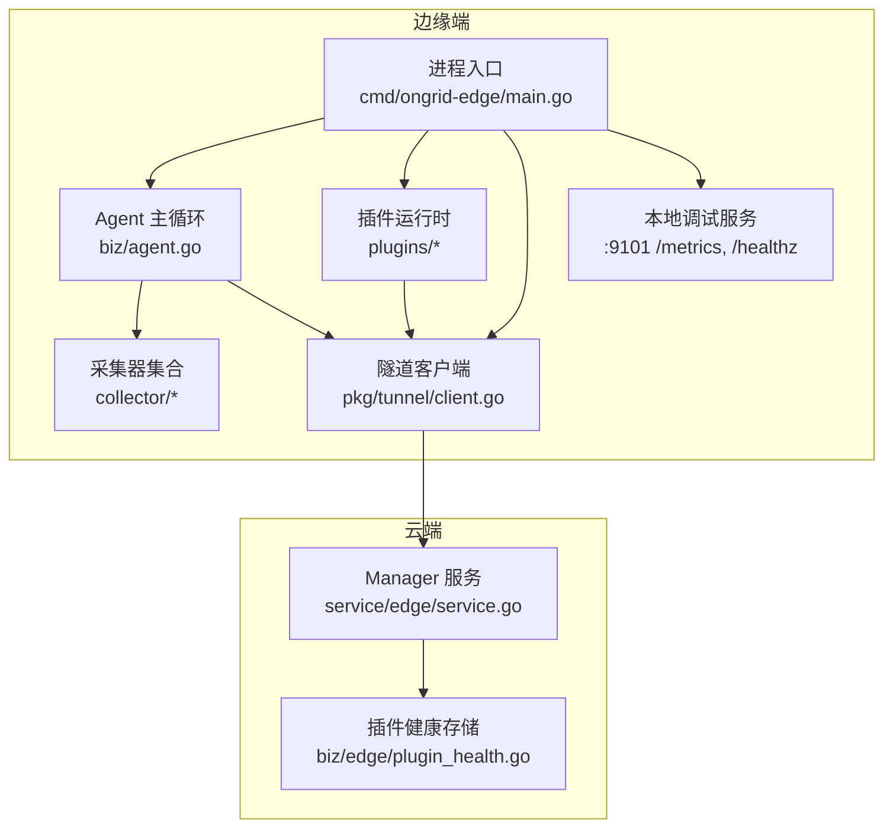
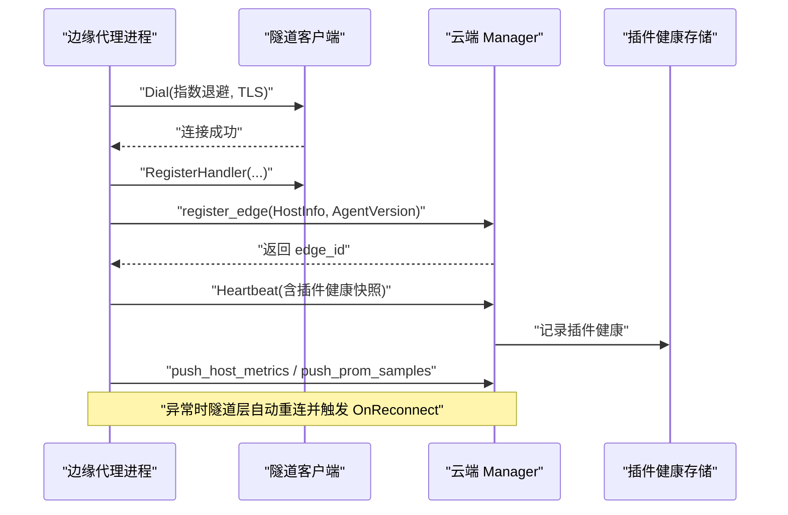
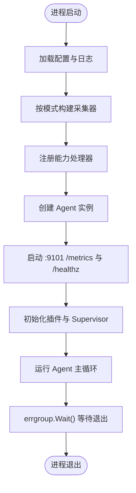
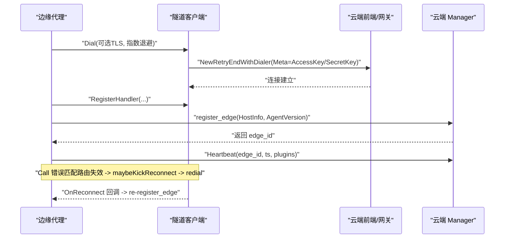
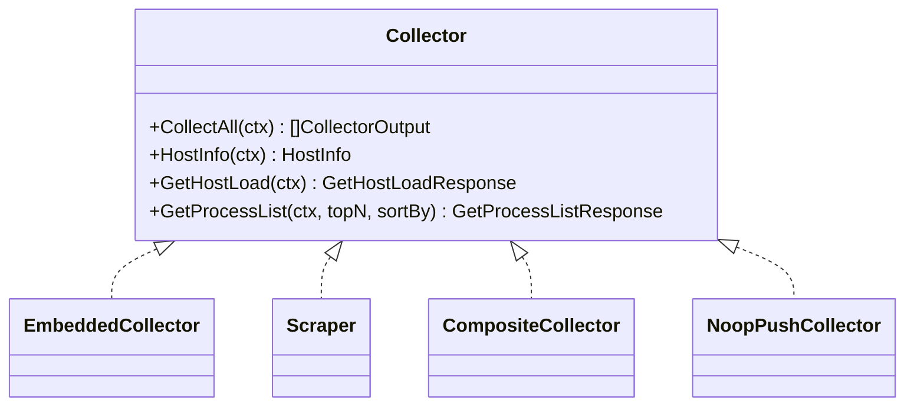
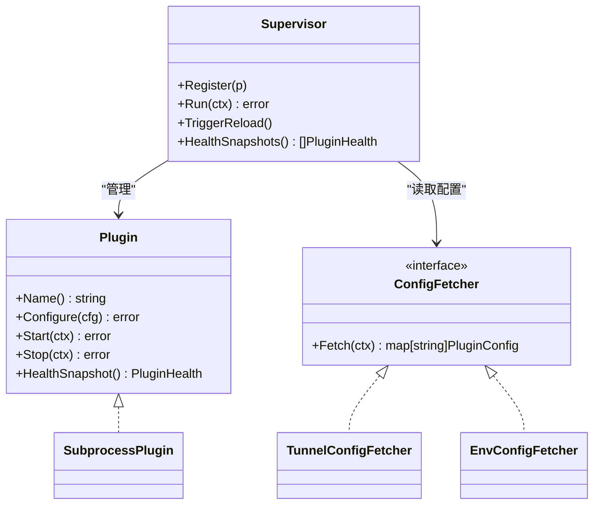
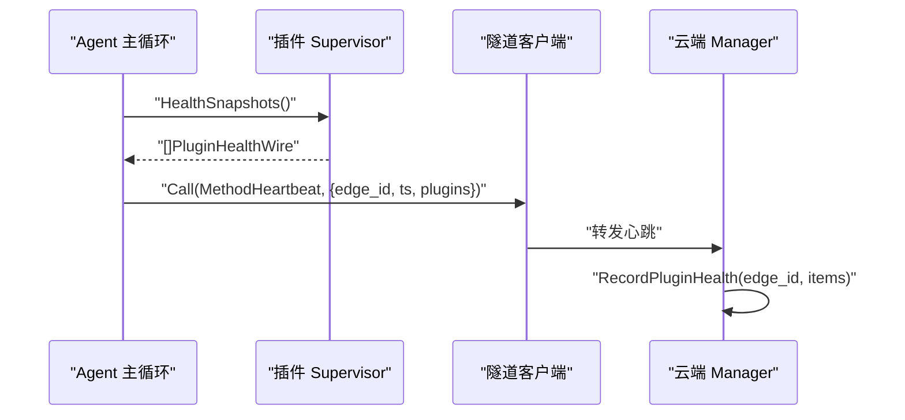
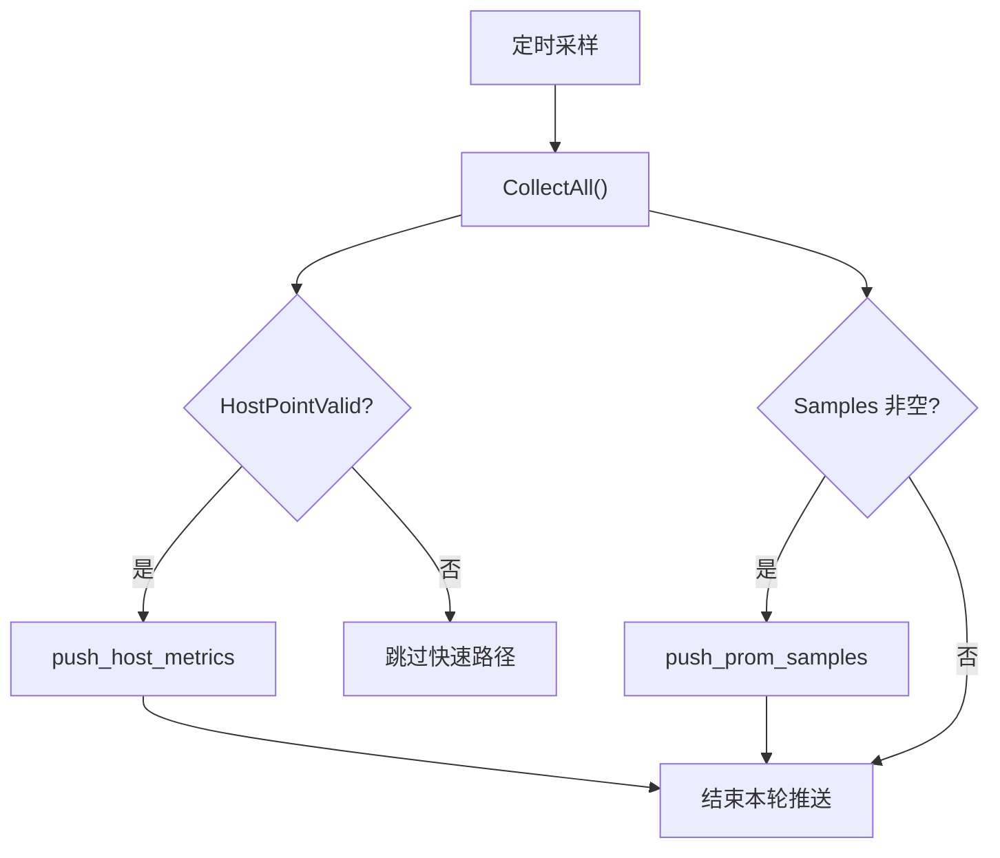
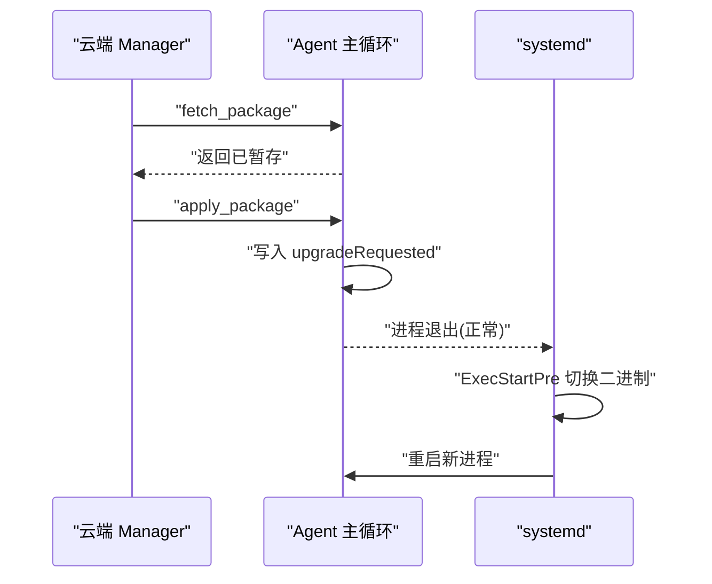
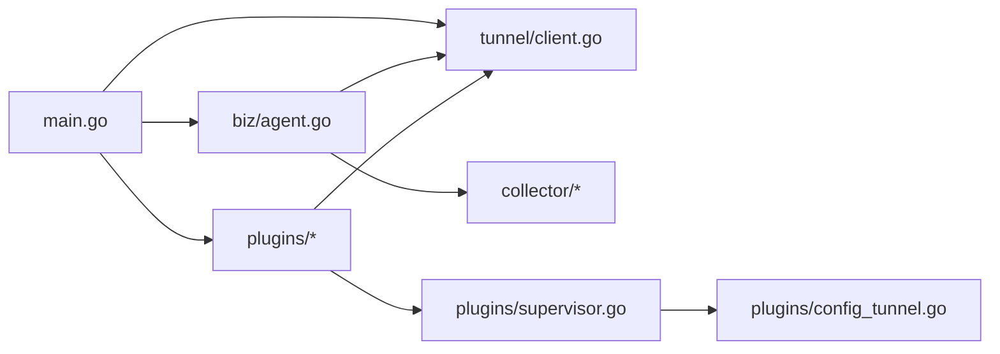

# 边缘代理架构设计

<cite>
**本文引用的文件列表**
- [cmd/ongrid-edge/main.go](file://cmd/ongrid-edge/main.go)
- [internal/edgeagent/biz/agent.go](file://internal/edgeagent/biz/agent.go)
- [internal/pkg/tunnel/client.go](file://internal/pkg/tunnel/client.go)
- [internal/pkg/tunnel/types.go](file://internal/pkg/tunnel/types.go)
- [internal/edgeagent/collector/types.go](file://internal/edgeagent/collector/types.go)
- [internal/edgeagent/collector/composite.go](file://internal/edgeagent/collector/composite.go)
- [internal/edgeagent/collector/embedded.go](file://internal/edgeagent/collector/embedded.go)
- [internal/edgeagent/collector/scrape.go](file://internal/edgeagent/collector/scrape.go)
- [internal/edgeagent/plugins/plugin.go](file://internal/edgeagent/plugins/plugin.go)
- [internal/edgeagent/plugins/supervisor.go](file://internal/edgeagent/plugins/supervisor.go)
- [internal/edgeagent/plugins/subprocess.go](file://internal/edgeagent/plugins/subprocess.go)
- [internal/edgeagent/plugins/config_tunnel.go](file://internal/edgeagent/plugins/config_tunnel.go)
- [internal/manager/service/edge/service.go](file://internal/manager/service/edge/service.go)
- [internal/manager/biz/edge/plugin_health.go](file://internal/manager/biz/edge/plugin_health.go)
</cite>

## 目录
1. [简介](#简介)
2. [项目结构](#项目结构)
3. [核心组件](#核心组件)
4. [架构总览](#架构总览)
5. [详细组件分析](#详细组件分析)
6. [依赖关系分析](#依赖关系分析)
7. [性能考量](#性能考量)
8. [故障排查指南](#故障排查指南)
9. [结论](#结论)
10. [附录](#附录)

## 简介
本文件面向“边缘代理（Edge Agent）”的架构设计与实现，聚焦以下目标：
- 进程模型与服务发现、通信机制
- 与云端 Manager 的安全隧道建立、认证流程、连接管理与心跳保持
- 数据采集器的多模式支持（embedded/scrape/auto/off）及适用场景与性能特征
- 插件系统的设计：插件发现、生命周期管理、健康监控
- 错误处理策略、资源管理与优雅关闭
- 架构图与数据流图展示各组件交互

## 项目结构
边缘代理以单进程形态运行，入口为 ongrid-edge。其内部按能力划分为多个子模块：
- 业务编排：biz/agent 负责心跳、指标推送、升级等主循环
- 采集器：collector 提供多种采集后端（gopsutil 内嵌、HTTP scrape、组合模式）
- 插件运行时：plugins 提供统一接口与 Supervisor 管理日志、追踪、数据库指标等插件
- 隧道客户端：pkg/tunnel 封装与云端的长连接、RPC 调用、重连与回调
- 本地调试服务：/metrics 与 /healthz

图表来源
- [cmd/ongrid-edge/main.go:56-110](file://cmd/ongrid-edge/main.go#L56-L110)
- [internal/edgeagent/biz/agent.go:150-232](file://internal/edgeagent/biz/agent.go#L150-L232)
- [internal/pkg/tunnel/client.go:62-141](file://internal/pkg/tunnel/client.go#L62-L141)
- [internal/manager/service/edge/service.go:78-94](file://internal/manager/service/edge/service.go#L78-L94)

章节来源
- [cmd/ongrid-edge/main.go:56-110](file://cmd/ongrid-edge/main.go#L56-L110)

## 核心组件
- 进程与生命周期
  - 进程入口负责加载配置、初始化日志与指标注册表、构建隧道客户端、根据模式构建采集器、注册各类能力处理器、启动本地调试服务、创建并运行 Agent 主循环、启动插件 Supervisor，并通过 errgroup 统一管理协程生命周期。
- 隧道客户端
  - 基于 geminio 实现带指数退避的重拨、TLS CA 校验、方法级 RPC 注册与自动重注册、错误检测触发异步重连、OnReconnect 钩子用于上层状态恢复。
- Agent 主循环
  - 在 Dial 成功后执行 register_edge，随后启动心跳与指标推送两个定时循环；监听升级信号，优雅退出以便 systemd 完成二进制替换。
- 采集器
  - 通过 Collector 接口抽象，支持 embedded（gopsutil）、scrape（HTTP /metrics）、auto（组合）、off（仅保留按需 RPC）。
- 插件系统
  - 统一的 Plugin 接口 + Supervisor 协调器，支持 in-process 与 subprocess 两种形态；TunnelConfigFetcher 从云端拉取配置，EnvConfigFetcher 作为离线回退。

章节来源
- [cmd/ongrid-edge/main.go:89-110](file://cmd/ongrid-edge/main.go#L89-L110)
- [internal/pkg/tunnel/client.go:62-141](file://internal/pkg/tunnel/client.go#L62-L141)
- [internal/edgeagent/biz/agent.go:150-232](file://internal/edgeagent/biz/agent.go#L150-L232)
- [internal/edgeagent/collector/types.go:21-57](file://internal/edgeagent/collector/types.go#L21-L57)
- [internal/edgeagent/plugins/plugin.go:18-52](file://internal/edgeagent/plugins/plugin.go#L18-L52)

## 架构总览
下图展示了 Edge Agent 与云端 Manager 的整体交互：包括安全隧道建立、注册、心跳、指标推送、插件配置下发与健康上报。

图表来源
- [internal/pkg/tunnel/client.go:62-141](file://internal/pkg/tunnel/client.go#L62-L141)
- [internal/edgeagent/biz/agent.go:150-232](file://internal/edgeagent/biz/agent.go#L150-L232)
- [internal/manager/service/edge/service.go:78-94](file://internal/manager/service/edge/service.go#L78-L94)
- [internal/manager/biz/edge/plugin_health.go:36-70](file://internal/manager/biz/edge/plugin_health.go#L36-L70)

## 详细组件分析

### 进程模型与生命周期
- 进程入口
  - 解析参数、加载配置、初始化日志与指标注册表
  - 构建隧道客户端、根据 collector_mode 选择采集器
  - 注册 host_files、restart_service、bash、webshell 等能力
  - 创建 Agent 实例并启动 /metrics 调试服务
  - 注册插件、创建 Supervisor 并启动
  - 使用 errgroup 统一等待所有协程退出
- 优雅关闭
  - 通过 signal.NotifyContext 捕获 SIGINT/SIGTERM
  - Agent.Run 在收到升级信号后返回，errgroup 取消上下文，所有协程有序退出
  - 插件 Supervisor 在退出时对每个插件 Stop，带超时保护

图表来源
- [cmd/ongrid-edge/main.go:56-110](file://cmd/ongrid-edge/main.go#L56-L110)
- [cmd/ongrid-edge/main.go:169-187](file://cmd/ongrid-edge/main.go#L169-L187)
- [internal/edgeagent/plugins/supervisor.go:112-133](file://internal/edgeagent/plugins/supervisor.go#L112-L133)

章节来源
- [cmd/ongrid-edge/main.go:56-110](file://cmd/ongrid-edge/main.go#L56-L110)
- [cmd/ongrid-edge/main.go:169-187](file://cmd/ongrid-edge/main.go#L169-L187)

### 安全隧道与认证流程
- 连接建立
  - 支持明文 TCP 或 TLS（可指定 CA 文件），最小 TLS 版本 1.2
  - 首次 Dial 采用指数退避（最大 60s），失败持续重试
- 认证与会话
  - 每次 (re)connect 携带 AccessKey/SecretKey 到 Meta
  - 服务端 AuthFunc 验证凭据并返回 Session（包含 EdgeID）
- 连接管理与重连
  - Call 检测到路由失效（如 manager 重启导致 frontier 路由丢失）时触发异步重连
  - OnReconnect 回调用于重新 register_edge，确保新连接绑定同一 canonical edge_id
- 心跳与卡死检测
  - 周期性发送 Heartbeat，连续失败超过阈值则判定隧道卡死，主动退出由 systemd 重启

图表来源
- [internal/pkg/tunnel/client.go:62-141](file://internal/pkg/tunnel/client.go#L62-L141)
- [internal/pkg/tunnel/client.go:218-287](file://internal/pkg/tunnel/client.go#L218-L287)
- [internal/pkg/tunnel/types.go:33-50](file://internal/pkg/tunnel/types.go#L33-L50)
- [internal/edgeagent/biz/agent.go:150-232](file://internal/edgeagent/biz/agent.go#L150-L232)

章节来源
- [internal/pkg/tunnel/client.go:62-141](file://internal/pkg/tunnel/client.go#L62-L141)
- [internal/pkg/tunnel/types.go:33-50](file://internal/pkg/tunnel/types.go#L33-L50)
- [internal/edgeagent/biz/agent.go:150-232](file://internal/edgeagent/biz/agent.go#L150-L232)

### 数据采集器多模式
- 模式定义与行为
  - off/none/""：默认安装推荐，不周期推送，保留按需 RPC（host_info/get_host_load/get_process_list）
  - auto：legacy 模式，同时启用 embedded 与 scrape；若 scrape 配置不可用则回退到 embedded
  - scrape：仅 HTTP /metrics 抓取，支持多目标
  - embedded：仅 gopsutil 内嵌采集
- 输出路径
  - 快速路径：push_host_metrics（8 字段 HostPoint）
  - 开放路径：push_prom_samples（Prometheus 样本集）
- 组合与回退
  - CompositeCollector：优先使用 scrape 的 host-role 输出，否则回退到 embedded
  - NoopPush：在 off 模式下抑制周期推送但保留按需 RPC

图表来源
- [internal/edgeagent/collector/types.go:21-57](file://internal/edgeagent/collector/types.go#L21-L57)
- [internal/edgeagent/collector/composite.go:13-55](file://internal/edgeagent/collector/composite.go#L13-L55)
- [internal/edgeagent/collector/noop_push.go:1-35](file://internal/edgeagent/collector/noop_push.go#L1-L35)

章节来源
- [cmd/ongrid-edge/main.go:316-376](file://cmd/ongrid-edge/main.go#L316-L376)
- [internal/edgeagent/collector/composite.go:13-55](file://internal/edgeagent/collector/composite.go#L13-L55)
- [internal/edgeagent/collector/embedded.go:26-51](file://internal/edgeagent/collector/embedded.go#L26-L51)
- [internal/edgeagent/collector/scrape.go:29-50](file://internal/edgeagent/collector/scrape.go#L29-L50)

### 插件系统：发现、生命周期与健康监控
- 插件接口与形态
  - Plugin 接口统一了 Configure/Start/Stop/HealthSnapshot
  - SubprocessPlugin 封装子进程生命周期、崩溃重启、日志落盘、健康状态更新
- 配置获取
  - TunnelConfigFetcher：通过 tunnel RPC 拉取 per-edge 配置，Auth 复用隧道凭据
  - EnvConfigFetcher：当隧道不可达时回退到环境变量快照
- 协调器（Supervisor）
  - 定期拉取配置并 diff 当前状态，执行 start/stop/reconfigure
  - 每 60s 安全网轮询，支持外部 TriggerReload
  - 健康快照汇总并在心跳中上报给云端
- 健康上报
  - 心跳携带插件健康（名称、状态、PID、重启次数、最近错误、Targets 明细）
  - 云端在内存中维护最新快照，供 UI 展示

图表来源
- [internal/edgeagent/plugins/plugin.go:18-52](file://internal/edgeagent/plugins/plugin.go#L18-L52)
- [internal/edgeagent/plugins/subprocess.go:32-102](file://internal/edgeagent/plugins/subprocess.go#L32-L102)
- [internal/edgeagent/plugins/supervisor.go:36-73](file://internal/edgeagent/plugins/supervisor.go#L36-L73)
- [internal/edgeagent/plugins/config_tunnel.go:12-34](file://internal/edgeagent/plugins/config_tunnel.go#L12-L34)

章节来源
- [internal/edgeagent/plugins/plugin.go:18-52](file://internal/edgeagent/plugins/plugin.go#L18-L52)
- [internal/edgeagent/plugins/supervisor.go:112-133](file://internal/edgeagent/plugins/supervisor.go#L112-L133)
- [internal/edgeagent/plugins/subprocess.go:194-235](file://internal/edgeagent/plugins/subprocess.go#L194-L235)
- [internal/manager/biz/edge/plugin_health.go:36-70](file://internal/manager/biz/edge/plugin_health.go#L36-L70)

### 心跳与插件健康上报
- 心跳循环
  - 固定间隔发送 Heartbeat，附带 edge_id、时间戳与插件健康快照
  - 连续失败达到阈值则判定隧道卡死，主动退出让 systemd 重启
- 插件健康
  - Supervisor 收集各插件健康快照，Agent 在心跳中上报
  - 云端接收后写入内存缓存，UI 展示最近上报时间与状态

图表来源
- [internal/edgeagent/biz/agent.go:385-431](file://internal/edgeagent/biz/agent.go#L385-L431)
- [internal/edgeagent/plugins/supervisor.go:94-110](file://internal/edgeagent/plugins/supervisor.go#L94-L110)
- [internal/manager/biz/edge/plugin_health.go:36-70](file://internal/manager/biz/edge/plugin_health.go#L36-L70)

章节来源
- [internal/edgeagent/biz/agent.go:385-431](file://internal/edgeagent/biz/agent.go#L385-L431)
- [internal/manager/biz/edge/plugin_health.go:36-70](file://internal/manager/biz/edge/plugin_health.go#L36-L70)

### 指标推送与双通道
- 双通道设计
  - 快速路径：push_host_metrics（8 字段 HostPoint），适用于历史兼容与仪表盘快速展示
  - 开放路径：push_prom_samples（Prometheus 样本集），支持任意指标族
- 推送策略
  - 每个 tick 采样一次，分别尝试两条通道；任一失败仅记录告警日志，下一 tick 重试
  - 不缓冲 open-set 样本，避免过期数据影响时序一致性

图表来源
- [internal/edgeagent/biz/agent.go:445-530](file://internal/edgeagent/biz/agent.go#L445-L530)

章节来源
- [internal/edgeagent/biz/agent.go:445-530](file://internal/edgeagent/biz/agent.go#L445-L530)

### 远程升级与优雅关闭
- 远程升级
  - 云端下发 fetch_package 将新版本包下载到 stage 目录
  - apply_package 确认后，Agent 向 upgradeRequested 通道写入信号，Run 监听到后优雅退出
  - systemd 重启后脚本检查 healthy_marker 决定是否回滚
- 优雅关闭
  - 所有 goroutine 受 errgroup 与 context 控制，插件 Supervisor 在退出时 Stop 所有插件
  - 隧道 Close 停止后续重连

图表来源
- [internal/edgeagent/biz/agent.go:303-351](file://internal/edgeagent/biz/agent.go#L303-L351)
- [internal/edgeagent/biz/agent.go:213-232](file://internal/edgeagent/biz/agent.go#L213-L232)

章节来源
- [internal/edgeagent/biz/agent.go:303-351](file://internal/edgeagent/biz/agent.go#L303-L351)
- [internal/edgeagent/biz/agent.go:213-232](file://internal/edgeagent/biz/agent.go#L213-L232)

## 依赖关系分析
- 组件耦合
  - main 组装各子系统，低耦合通过接口（Collector、Plugin、ConfigFetcher）解耦
  - Agent 仅依赖 tunnel.Client 与 Collector 接口，避免循环依赖
  - 插件运行时与 Supervisor 通过统一接口协作，SubprocessPlugin 屏蔽子进程细节
- 外部依赖
  - geminio 提供底层 RPC 与重试语义
  - gopsutil 提供主机指标
  - Prometheus 生态用于 scrape 与样本格式

图表来源
- [cmd/ongrid-edge/main.go:89-110](file://cmd/ongrid-edge/main.go#L89-L110)
- [internal/edgeagent/biz/agent.go:150-232](file://internal/edgeagent/biz/agent.go#L150-L232)
- [internal/edgeagent/plugins/supervisor.go:112-133](file://internal/edgeagent/plugins/supervisor.go#L112-L133)
- [internal/edgeagent/plugins/config_tunnel.go:12-34](file://internal/edgeagent/plugins/config_tunnel.go#L12-L34)

章节来源
- [cmd/ongrid-edge/main.go:89-110](file://cmd/ongrid-edge/main.go#L89-L110)
- [internal/edgeagent/biz/agent.go:150-232](file://internal/edgeagent/biz/agent.go#L150-L232)

## 性能考量
- 采集模式选择
  - off：适合部署 hostmetrics/procmetrics 插件并由云端直接抓取的节点，减少重复数据与带宽占用
  - embedded：轻量、无额外进程，适合小规模或临时采集
  - scrape：支持多目标，灵活扩展第三方 exporter，注意并发抓取对网络与 CPU 的影响
  - auto：兼顾两者，但可能产生重复系列，需评估标签与源标识
- 推送策略
  - 双通道并行推送，失败不阻塞下一轮；避免边端缓冲，保证时序新鲜度
- 插件开销
  - 子进程插件存在进程间开销与崩溃重启成本，建议按需开启并通过 Supervisor 的 backoff 控制重启风暴
- 心跳与重连
  - 心跳间隔与卡死阈值平衡了稳定性与故障恢复速度；隧道层自动重连降低上层复杂度

[本节为通用指导，无需特定文件引用]

## 故障排查指南
- 隧道无法建立
  - 检查 CloudAddr/ServerAddr、AccessKey/SecretKey、TLSCAFile 是否正确
  - 观察 Dial 日志中的退避与错误信息
- 注册失败
  - register_edge 失败多为认证不匹配；确认服务端凭据一致
- 心跳频繁失败
  - 关注 consecutive_fail 计数；若达到阈值会触发隧道卡死退出
- 插件未运行
  - 查看 Supervisor 日志与插件健康快照；确认二进制是否存在、工作目录是否可写
  - 子进程崩溃会记录 LastError 与 RestartCount
- 指标缺失或重复
  - 对比采集模式与 Source 标签；off 模式下应依赖插件直接暴露的指标
  - auto 模式下注意 host-role 与 embedded 的覆盖逻辑

章节来源
- [internal/pkg/tunnel/client.go:62-141](file://internal/pkg/tunnel/client.go#L62-L141)
- [internal/edgeagent/biz/agent.go:385-431](file://internal/edgeagent/biz/agent.go#L385-L431)
- [internal/edgeagent/plugins/subprocess.go:194-235](file://internal/edgeagent/plugins/subprocess.go#L194-L235)

## 结论
Edge Agent 采用单进程、插件化与双通道指标推送的架构，结合隧道层的透明重连与心跳机制，实现了高可用、可扩展的边缘观测与控制面。通过多模式采集器与 Supervisor 驱动的插件生命周期管理，既保证了灵活性，也兼顾了运维友好性与可观测性。

[本节为总结性内容，无需特定文件引用]

## 附录
- 关键符号与路径参考
  - 进程入口：cmd/ongrid-edge/main.go
  - Agent 主循环：internal/edgeagent/biz/agent.go
  - 隧道客户端：internal/pkg/tunnel/client.go
  - 采集器接口与实现：internal/edgeagent/collector/*
  - 插件接口与 Supervisor：internal/edgeagent/plugins/*
  - 云端心跳与插件健康：internal/manager/service/edge/service.go、internal/manager/biz/edge/plugin_health.go

[本节为索引性内容，无需特定文件引用]