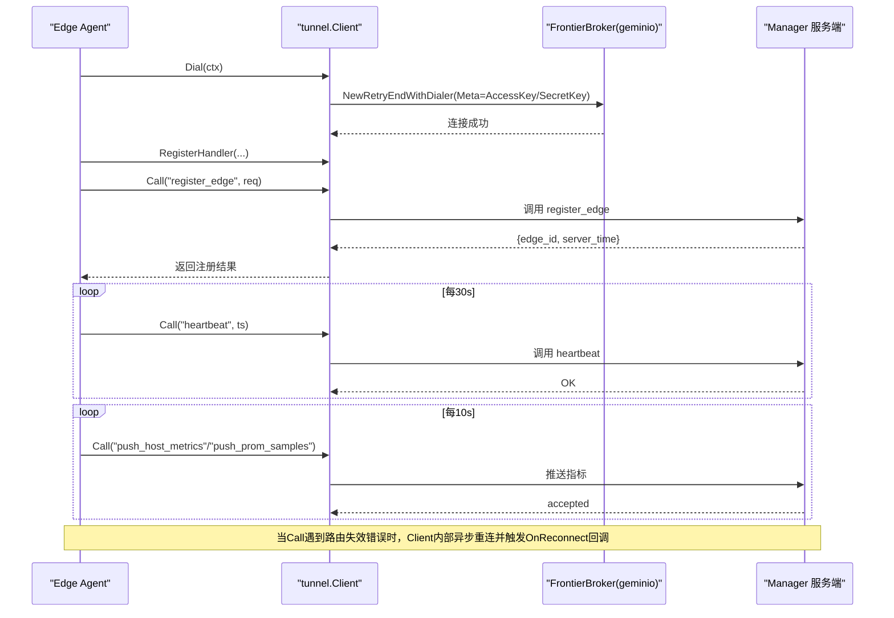
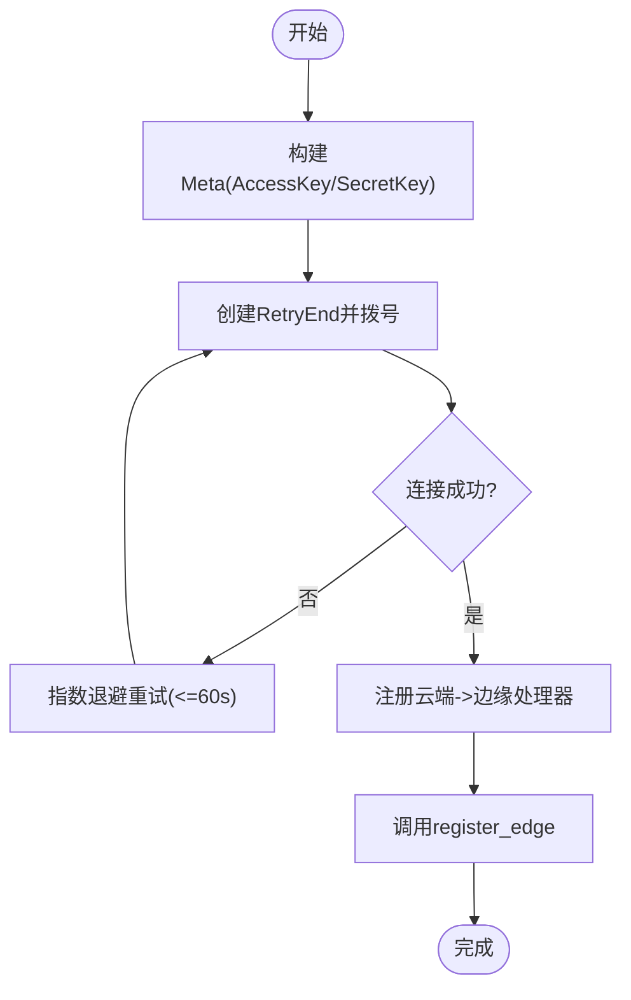
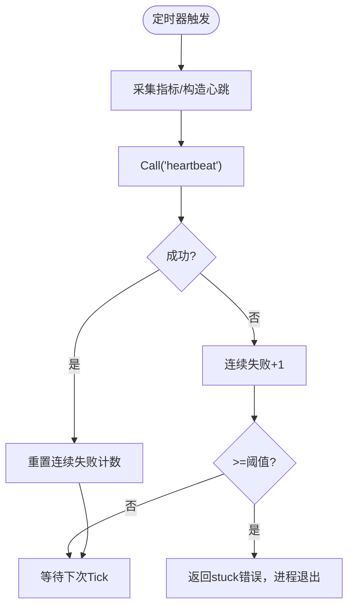
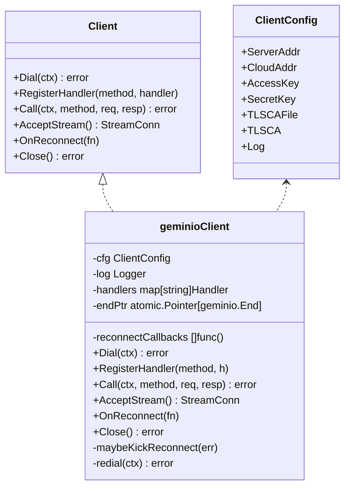
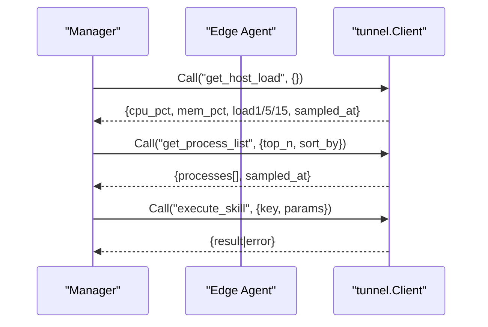
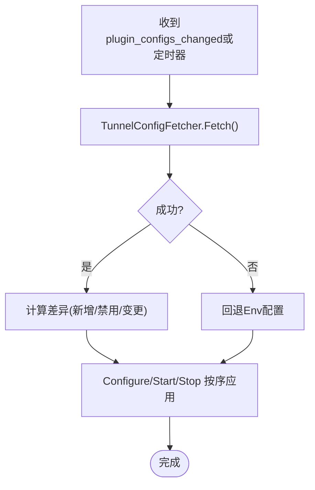
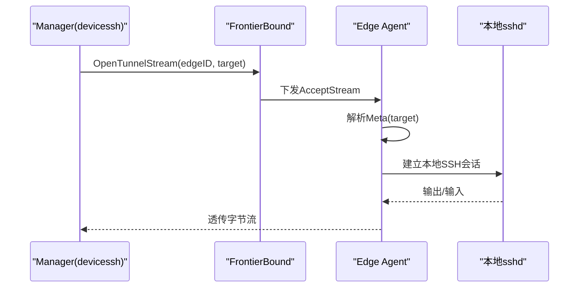
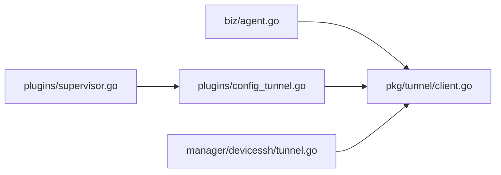

# 隧道通信机制

<cite>
**本文引用的文件**   
- [internal/pkg/tunnel/client.go](file://internal/pkg/tunnel/client.go)
- [internal/pkg/tunnel/types.go](file://internal/pkg/tunnel/types.go)
- [internal/pkg/tunnel/messages.go](file://internal/pkg/tunnel/messages.go)
- [api/tunnel/v1/tunnel.proto](file://api/tunnel/v1/tunnel.proto)
- [internal/edgeagent/biz/agent.go](file://internal/edgeagent/biz/agent.go)
- [internal/edgeagent/plugins/supervisor.go](file://internal/edgeagent/plugins/supervisor.go)
- [internal/edgeagent/plugins/config_tunnel.go](file://internal/edgeagent/plugins/config_tunnel.go)
- [internal/manager/biz/devicessh/tunnel.go](file://internal/manager/biz/devicessh/tunnel.go)
</cite>

## 目录
1. [简介](#简介)
2. [项目结构](#项目结构)
3. [核心组件](#核心组件)
4. [架构总览](#架构总览)
5. [详细组件分析](#详细组件分析)
6. [依赖关系分析](#依赖关系分析)
7. [性能与并发](#性能与并发)
8. [故障排查指南](#故障排查指南)
9. [结论](#结论)
10. [附录：协议与方法清单](#附录协议与方法清单)

## 简介
本文件系统性阐述边缘代理（Edge Agent）与云端 Manager 之间的安全隧道通信机制，覆盖以下关键主题：
- 认证流程（AccessKey/SecretKey）与握手
- 连接管理与心跳保持
- tunnel.Client 的实现原理：重连策略、错误处理、超时配置
- 双向通信协议：RPC 调用模式、消息格式、流式数据传输
- 插件配置同步机制（MethodPluginConfigsChanged）
- 连接池管理、并发控制与资源清理策略
- 通信流程图与错误处理示例路径

## 项目结构
围绕隧道通信的核心代码主要分布在如下位置：
- 协议定义：api/tunnel/v1/tunnel.proto
- 客户端实现与类型：internal/pkg/tunnel/*.go
- 边缘 Agent 主循环与业务编排：internal/edgeagent/biz/agent.go
- 插件生命周期与配置拉取：internal/edgeagent/plugins/*
- 云端侧通过隧道转发 SSH 的 Dialer：internal/manager/biz/devicessh/tunnel.go

```mermaid
graph TB
subgraph "边缘端"
EA["Edge Agent<br/>biz/agent.go"]
TC["tunnel.Client<br/>pkg/tunnel/client.go"]
PL["插件Supervisor<br/>plugins/supervisor.go"]
PCF["插件配置拉取器<br/>plugins/config_tunnel.go"]
end
subgraph "云端端"
MGR["Manager 服务"]
FB["FrontierBound(网关/路由)"]
DS["设备SSH隧道Dialer<br/>devicessh/tunnel.go"]
end
EA --> |注册/心跳/指标/RPC| TC
TC --> |geminio End(长连接)| FB
FB --> MGR
EA --> |OnReconnect回调: register_edge| TC
PL --> |TriggerReload| PCF
PCF --> |get_plugin_configs| TC
DS --> |OpenTunnelStream->AcceptStream| TC
```

图表来源
- [internal/edgeagent/biz/agent.go:150-232](file://internal/edgeagent/biz/agent.go#L150-L232)
- [internal/pkg/tunnel/client.go:62-141](file://internal/pkg/tunnel/client.go#L62-L141)
- [internal/edgeagent/plugins/supervisor.go:112-133](file://internal/edgeagent/plugins/supervisor.go#L112-L133)
- [internal/edgeagent/plugins/config_tunnel.go:54-108](file://internal/edgeagent/plugins/config_tunnel.go#L54-L108)
- [internal/manager/biz/devicessh/tunnel.go:182-202](file://internal/manager/biz/devicessh/tunnel.go#L182-L202)

章节来源
- [internal/pkg/tunnel/client.go:62-141](file://internal/pkg/tunnel/client.go#L62-L141)
- [internal/edgeagent/biz/agent.go:150-232](file://internal/edgeagent/biz/agent.go#L150-L232)
- [internal/edgeagent/plugins/supervisor.go:112-133](file://internal/edgeagent/plugins/supervisor.go#L112-L133)
- [internal/edgeagent/plugins/config_tunnel.go:54-108](file://internal/edgeagent/plugins/config_tunnel.go#L54-L108)
- [internal/manager/biz/devicessh/tunnel.go:182-202](file://internal/manager/biz/devicessh/tunnel.go#L182-L202)

## 核心组件
- tunnel.Client 接口与实现
  - 负责建立并维护到云端的 geminio End 长连接，提供 Call/RegisterHandler/AcceptStream/OnReconnect/Close 等能力。
  - 内置指数退避重连、TLS CA 校验、Meta 注入（AccessKey/SecretKey）、错误分类与自动重连触发。
- Edge Agent 主循环
  - 在 Dial 成功后执行 register_edge，周期性发送心跳与指标，注册云端→边缘的 RPC 处理器。
  - 监听 OnReconnect 回调以重新注册 edge 身份。
- 插件 Supervisor 与配置拉取
  - 定时或事件驱动拉取插件配置，支持从 manager 获取最新快照，并在变更时触发热更新。
- 云端侧隧道转发（WebSSH）
  - 通过 OpenTunnelStream 打开字节流，边缘端 AcceptStream 接受后转发至本地 sshd，形成端到端交互式会话。

章节来源
- [internal/pkg/tunnel/types.go:68-106](file://internal/pkg/tunnel/types.go#L68-L106)
- [internal/pkg/tunnel/client.go:218-243](file://internal/pkg/tunnel/client.go#L218-L243)
- [internal/edgeagent/biz/agent.go:274-351](file://internal/edgeagent/biz/agent.go#L274-L351)
- [internal/edgeagent/plugins/supervisor.go:135-230](file://internal/edgeagent/plugins/supervisor.go#L135-L230)
- [internal/manager/biz/devicessh/tunnel.go:182-202](file://internal/manager/biz/devicessh/tunnel.go#L182-L202)

## 架构总览
下图展示从边缘到云端的完整通信链路，包括认证、注册、心跳、指标上报、RPC 调度与流式通道。



图表来源
- [internal/pkg/tunnel/client.go:62-141](file://internal/pkg/tunnel/client.go#L62-L141)
- [internal/pkg/tunnel/client.go:218-243](file://internal/pkg/tunnel/client.go#L218-L243)
- [internal/edgeagent/biz/agent.go:392-431](file://internal/edgeagent/biz/agent.go#L392-L431)
- [internal/edgeagent/biz/agent.go:454-530](file://internal/edgeagent/biz/agent.go#L454-L530)

## 详细组件分析

### 认证与握手（AccessKey/SecretKey）
- 连接阶段
  - 客户端在 Dial 时将 AccessKey/SecretKey 序列化为 Meta 元数据，随 TCP/TLS 握手一并发送到服务端。
  - 服务端在建立 End 前解析 Meta，并通过 AuthFunc 验证凭据，失败则关闭连接。
- 注册阶段
  - 首次连接成功后，Agent 调用 register_edge 上报主机信息与版本；服务端据此分配 edge_id 并回写时间戳。
- 重连后的再注册
  - 当底层路由失效导致重连时，OnReconnect 回调会再次执行 register_edge，确保新连接绑定正确的 edge_id。



图表来源
- [internal/pkg/tunnel/client.go:78-118](file://internal/pkg/tunnel/client.go#L78-L118)
- [internal/edgeagent/biz/agent.go:354-383](file://internal/edgeagent/biz/agent.go#L354-L383)

章节来源
- [internal/pkg/tunnel/types.go:33-50](file://internal/pkg/tunnel/types.go#L33-L50)
- [internal/pkg/tunnel/messages.go:508-514](file://internal/pkg/tunnel/messages.go#L508-L514)
- [internal/edgeagent/biz/agent.go:354-383](file://internal/edgeagent/biz/agent.go#L354-L383)

### 连接管理与心跳保持
- 心跳
  - 默认每 30s 发送一次心跳，携带当前时间与插件健康信息。连续失败达到阈值（默认5次）将判定隧道“卡死”，退出进程由 systemd 重启恢复。
- 指标上报
  - 默认每 10s 采集一次，分别走 legacy push_host_metrics 与新的 push_prom_samples 两条路径。
- 错误与恢复
  - 心跳与指标上报的错误仅记录日志，不中断循环；底层重连由 tunnel.Client 透明处理。



图表来源
- [internal/edgeagent/biz/agent.go:392-431](file://internal/edgeagent/biz/agent.go#L392-L431)
- [internal/edgeagent/biz/agent.go:454-530](file://internal/edgeagent/biz/agent.go#L454-L530)

章节来源
- [internal/edgeagent/biz/agent.go:392-431](file://internal/edgeagent/biz/agent.go#L392-L431)
- [internal/edgeagent/biz/agent.go:454-530](file://internal/edgeagent/biz/agent.go#L454-L530)

### tunnel.Client 实现原理
- 重连策略
  - 初始拨号采用指数退避（1s 起，上限 60s）。
  - 运行期若检测到“路由失效”类错误（包含特定关键字），触发异步重连，最多同时一个重连协程。
- 错误处理
  - Call 层对网络/远端错误进行包装；对特定错误模式识别并触发重连。
  - OnReconnect 回调顺序执行，且被 recover 保护，避免单个回调 panic 阻塞后续恢复。
- 超时配置
  - Dial 内部使用独立上下文，重连最长 90s。
  - TLS 握手与 TCP 拨号均设置 10s 超时。
- 流式通道
  - AcceptStream 暴露 net.Conn 风格的读写接口，用于 WebSSH 等场景。



图表来源
- [internal/pkg/tunnel/types.go:33-106](file://internal/pkg/tunnel/types.go#L33-L106)
- [internal/pkg/tunnel/client.go:39-60](file://internal/pkg/tunnel/client.go#L39-L60)
- [internal/pkg/tunnel/client.go:218-331](file://internal/pkg/tunnel/client.go#L218-L331)

章节来源
- [internal/pkg/tunnel/client.go:62-141](file://internal/pkg/tunnel/client.go#L62-L141)
- [internal/pkg/tunnel/client.go:218-331](file://internal/pkg/tunnel/client.go#L218-L331)
- [internal/pkg/tunnel/client.go:345-379](file://internal/pkg/tunnel/client.go#L345-L379)

### 双向通信协议设计
- 传输与编码
  - 基于 geminio 的 JSON 编解码，方法名作为路由键，请求/响应体为 JSON。
- 方法清单（节选）
  - 注册/心跳/指标：register_edge、heartbeat、push_host_metrics、push_prom_samples
  - 查询类：get_host_load、get_process_list、get_netstat
  - 技能框架：execute_skill
  - 插件配置：get_plugin_configs、plugin_configs_changed
  - 升级相关：agent_upgrade、fetch_package、apply_package
  - WebSSH：shell_open/shell_input/shell_resize/shell_close/shell_output/shell_exit
- 消息模型
  - 对应 api/tunnel/v1/tunnel.proto 中的 HostInfo、HostMetricPoint、ProcessInfo 等结构，Go 侧在 messages.go 中以 JSON 标签镜像。



图表来源
- [internal/pkg/tunnel/messages.go:17-80](file://internal/pkg/tunnel/messages.go#L17-L80)
- [internal/pkg/tunnel/messages.go:380-433](file://internal/pkg/tunnel/messages.go#L380-L433)
- [internal/pkg/tunnel/messages.go:194-207](file://internal/pkg/tunnel/messages.go#L194-L207)

章节来源
- [api/tunnel/v1/tunnel.proto:1-166](file://api/tunnel/v1/tunnel.proto#L1-L166)
- [internal/pkg/tunnel/messages.go:17-80](file://internal/pkg/tunnel/messages.go#L17-L80)

### 插件配置同步机制（MethodPluginConfigsChanged）
- 拉取方式
  - 插件 Supervisor 周期（默认 60s）或通过外部信号触发拉取。
  - TunnelConfigFetcher 通过 get_plugin_configs 拉取全量快照，若失败则回退到环境变量配置，保证冷启动或断网期间仍可维持基本运行。
- 变更通知
  - 云端可通过 plugin_configs_changed 推送变更，边缘收到后 TriggerReload 合并多次信号，避免频繁拉取。
- 应用策略
  - 对比 desired vs current，决定 Configure/Start/Stop 的顺序与是否重启子进程。



图表来源
- [internal/edgeagent/plugins/config_tunnel.go:54-108](file://internal/edgeagent/plugins/config_tunnel.go#L54-L108)
- [internal/edgeagent/plugins/supervisor.go:135-230](file://internal/edgeagent/plugins/supervisor.go#L135-L230)

章节来源
- [internal/edgeagent/plugins/config_tunnel.go:54-108](file://internal/edgeagent/plugins/config_tunnel.go#L54-L108)
- [internal/edgeagent/plugins/supervisor.go:135-230](file://internal/edgeagent/plugins/supervisor.go#L135-L230)

### 流式数据传输（WebSSH）
- 云端侧
  - 通过 OpenTunnelStream(edgeID, target) 打开一条字节流，target 可指定目标地址（如 host:IP:22）。
- 边缘侧
  - AcceptStream 接收流，读取 Meta 解析目标，随后与本地 sshd 建立会话并双向转发。
- 生命周期
  - 流的生命周期与 SSH Session 绑定，关闭任一端都会触发整体清理。



图表来源
- [internal/manager/biz/devicessh/tunnel.go:182-202](file://internal/manager/biz/devicessh/tunnel.go#L182-L202)
- [internal/pkg/tunnel/client.go:345-379](file://internal/pkg/tunnel/client.go#L345-L379)

章节来源
- [internal/manager/biz/devicessh/tunnel.go:182-202](file://internal/manager/biz/devicessh/tunnel.go#L182-L202)
- [internal/pkg/tunnel/client.go:345-379](file://internal/pkg/tunnel/client.go#L345-L379)

## 依赖关系分析
- 模块耦合
  - Edge Agent 依赖 tunnel.Client 提供的统一抽象，屏蔽底层 geminio 细节。
  - 插件 Supervisor 与 TunnelConfigFetcher 组合，解耦配置来源与环境变量。
  - 云端 devicessh 通过 OpenTunnelStream 与边缘 AcceptStream 对接，形成跨边界的字节管道。
- 外部依赖
  - geminio 负责长连接、重试与路由发现；JSON 编解码用于消息体。
- 潜在环路与边界
  - 无直接循环导入；通过接口与常量方法名解耦。



图表来源
- [internal/edgeagent/biz/agent.go:150-232](file://internal/edgeagent/biz/agent.go#L150-L232)
- [internal/edgeagent/plugins/supervisor.go:112-133](file://internal/edgeagent/plugins/supervisor.go#L112-L133)
- [internal/edgeagent/plugins/config_tunnel.go:54-108](file://internal/edgeagent/plugins/config_tunnel.go#L54-L108)
- [internal/manager/biz/devicessh/tunnel.go:182-202](file://internal/manager/biz/devicessh/tunnel.go#L182-L202)

章节来源
- [internal/edgeagent/biz/agent.go:150-232](file://internal/edgeagent/biz/agent.go#L150-L232)
- [internal/edgeagent/plugins/supervisor.go:112-133](file://internal/edgeagent/plugins/supervisor.go#L112-L133)
- [internal/edgeagent/plugins/config_tunnel.go:54-108](file://internal/edgeagent/plugins/config_tunnel.go#L54-L108)
- [internal/manager/biz/devicessh/tunnel.go:182-202](file://internal/manager/biz/devicessh/tunnel.go#L182-L202)

## 性能与并发
- 连接复用
  - 使用 geminio RetryEnd 维持长连接，避免频繁建链开销。
- 并发控制
  - 心跳与指标两个 goroutine 并行；插件 Supervisor 串行 apply，避免竞态。
  - OnReconnect 回调顺序执行，panic 被 recover 保护，防止阻塞恢复。
- 资源清理
  - Close 单例关闭，避免重复释放；AcceptStream 返回的流由上层负责关闭。
- 超时与退避
  - Dial 指数退避上限 60s；重连上下文上限 90s；TCP/TLS 握手 10s。
- 建议
  - 在高吞吐场景下关注 PushPromSamples 的批量大小与网络抖动；必要时调整 MetricsInterval 与 BatchSize。

[本节为通用指导，无需源码引用]

## 故障排查指南
- 常见问题定位
  - 无法注册：检查 AccessKey/SecretKey 是否正确，服务端是否拒绝连接。
  - 持续重连：观察是否出现“路由失效”错误；确认前端负载均衡/网关状态。
  - 心跳失败：查看连续失败计数，超过阈值会触发进程重启。
  - 插件配置不同步：确认 plugin_configs_changed 是否到达，或回退 Env 配置是否生效。
- 参考实现路径
  - 重连判断与触发：[internal/pkg/tunnel/client.go:258-331](file://internal/pkg/tunnel/client.go#L258-L331)
  - 心跳卡死检测与退出：[internal/edgeagent/biz/agent.go:392-431](file://internal/edgeagent/biz/agent.go#L392-L431)
  - 插件配置拉取与回退：[internal/edgeagent/plugins/config_tunnel.go:54-108](file://internal/edgeagent/plugins/config_tunnel.go#L54-L108)
  - 流式通道建立与关闭：[internal/manager/biz/devicessh/tunnel.go:182-202](file://internal/manager/biz/devicessh/tunnel.go#L182-L202)

章节来源
- [internal/pkg/tunnel/client.go:258-331](file://internal/pkg/tunnel/client.go#L258-L331)
- [internal/edgeagent/biz/agent.go:392-431](file://internal/edgeagent/biz/agent.go#L392-L431)
- [internal/edgeagent/plugins/config_tunnel.go:54-108](file://internal/edgeagent/plugins/config_tunnel.go#L54-L108)
- [internal/manager/biz/devicessh/tunnel.go:182-202](file://internal/manager/biz/devicessh/tunnel.go#L182-L202)

## 结论
该隧道通信机制以 geminio 为基础，结合 JSON 编解码与稳定的方法名路由，实现了高可用的边缘-云端双向通信。通过指数退避、错误分类与 OnReconnect 回调，系统在弱网与服务端重启场景下具备良好韧性；插件配置同步与流式通道进一步扩展了可观测性与运维能力。

[本节为总结性内容，无需源码引用]

## 附录：协议与方法清单
- 方法与用途
  - register_edge：边缘首次注册，上报主机信息与版本
  - heartbeat：心跳保活，附带插件健康
  - push_host_metrics / push_prom_samples：指标上报
  - get_host_load / get_process_list / get_netstat：云端查询
  - execute_skill：技能框架统一入口
  - get_plugin_configs / plugin_configs_changed：插件配置拉取与推送
  - agent_upgrade / fetch_package / apply_package：边缘二进制升级
  - shell_*：WebSSH 流式交互
- 消息模型
  - HostInfo、HostMetricPoint、ProcessInfo 等详见 proto 与 Go 镜像结构

章节来源
- [api/tunnel/v1/tunnel.proto:1-166](file://api/tunnel/v1/tunnel.proto#L1-L166)
- [internal/pkg/tunnel/messages.go:17-80](file://internal/pkg/tunnel/messages.go#L17-L80)
- [internal/pkg/tunnel/messages.go:213-270](file://internal/pkg/tunnel/messages.go#L213-L270)
- [internal/pkg/tunnel/messages.go:326-377](file://internal/pkg/tunnel/messages.go#L326-L377)
- [internal/pkg/tunnel/messages.go:380-433](file://internal/pkg/tunnel/messages.go#L380-L433)
- [internal/pkg/tunnel/messages.go:439-502](file://internal/pkg/tunnel/messages.go#L439-L502)