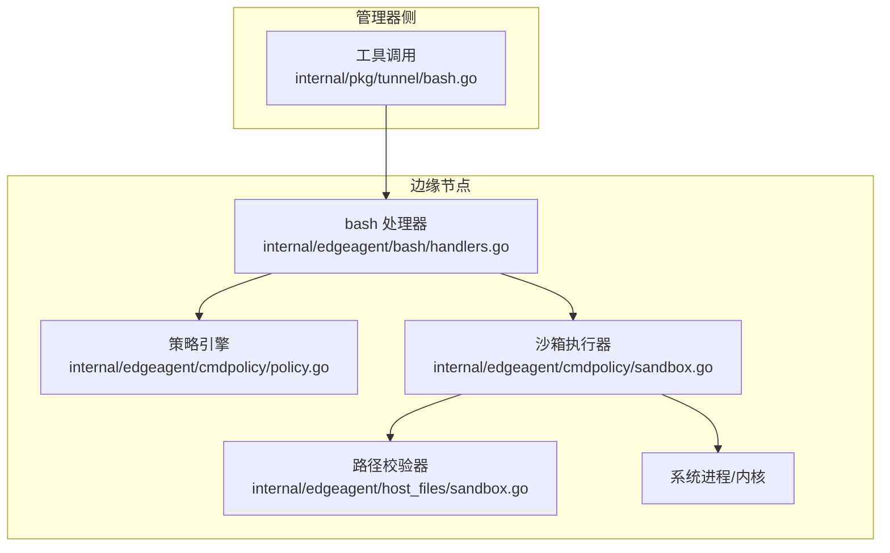
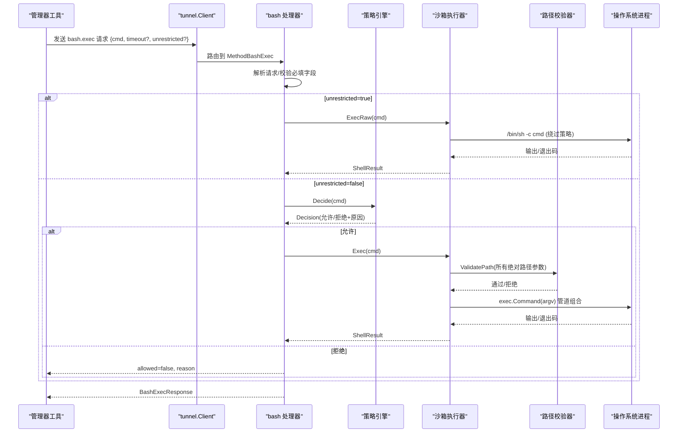
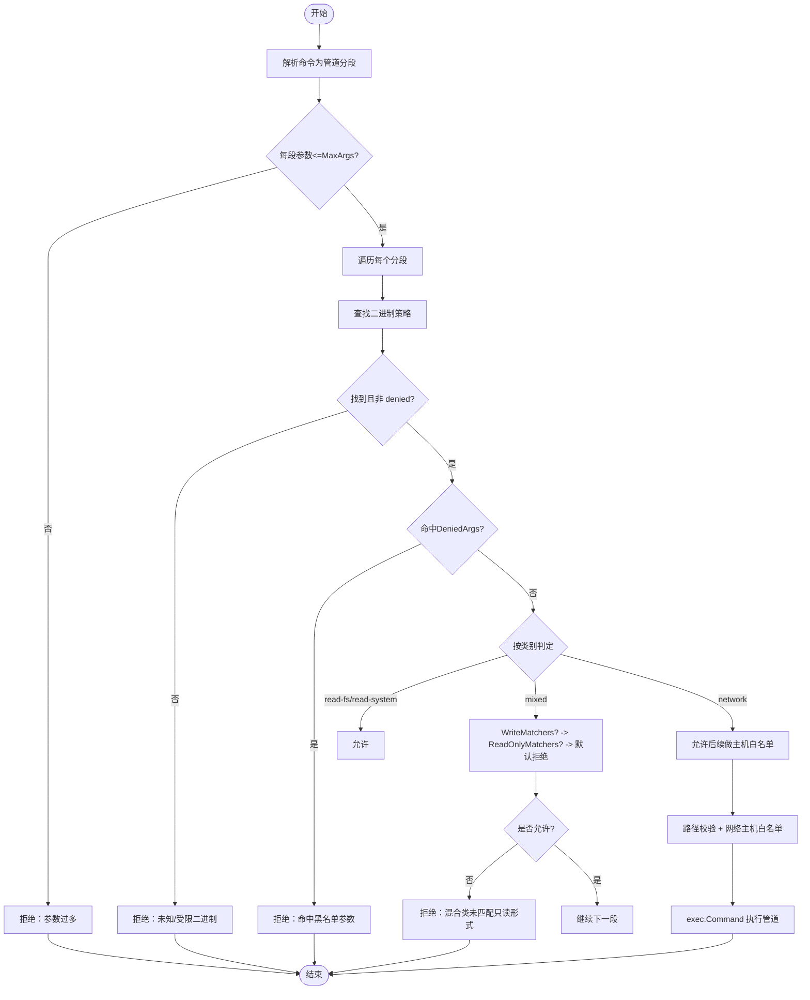
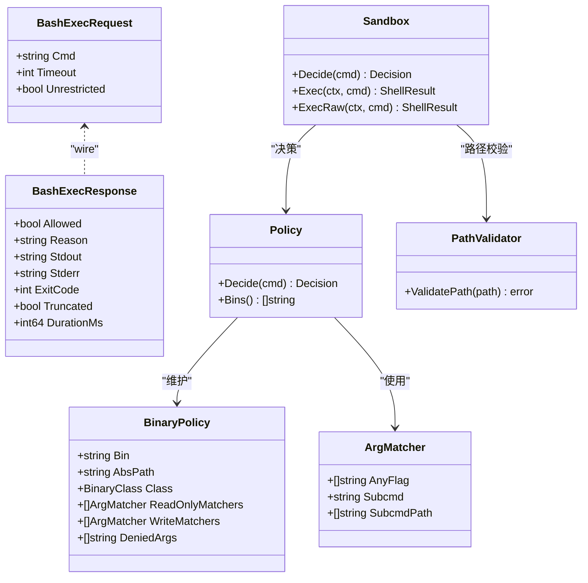

# 命令执行接口

<cite>
**本文引用的文件**
- [internal/edgeagent/bash/handlers.go](file://internal/edgeagent/bash/handlers.go)
- [internal/pkg/tunnel/bash.go](file://internal/pkg/tunnel/bash.go)
- [internal/edgeagent/cmdpolicy/types.go](file://internal/edgeagent/cmdpolicy/types.go)
- [internal/edgeagent/cmdpolicy/policy.go](file://internal/edgeagent/cmdpolicy/policy.go)
- [internal/edgeagent/cmdpolicy/sandbox.go](file://internal/edgeagent/cmdpolicy/sandbox.go)
- [internal/edgeagent/cmdpolicy/parse.go](file://internal/edgeagent/cmdpolicy/parse.go)
- [internal/edgeagent/host_files/sandbox.go](file://internal/edgeagent/host_files/sandbox.go)
- [deploy/edge/bash-policy.example.yaml](file://deploy/edge/bash-policy.example.yaml)
- [skills/bash/SKILL.md](file://skills/bash/SKILL.md)
</cite>

## 目录
1. [简介](#简介)
2. [项目结构](#项目结构)
3. [核心组件](#核心组件)
4. [架构总览](#架构总览)
5. [详细组件分析](#详细组件分析)
6. [依赖关系分析](#依赖关系分析)
7. [性能与资源限制](#性能与资源限制)
8. [安全配置指南](#安全配置指南)
9. [调试与排障](#调试与排障)
10. [结论](#结论)

## 简介
本文件面向边缘节点的“命令执行接口”，围绕以下目标展开：
- 协议定义：Manager 到 Edge 的 bash.exec 调用格式、参数与返回体。
- 权限验证流程：白名单策略、路径校验、网络出口白名单、管理员写门限。
- 沙箱机制：最小 Shell 语法解析、管道组合、环境变量清洗、输出截断、超时控制。
- 审计日志：关键事件记录与可观测性集成点。
- 策略引擎：规则匹配、动态授权（YAML 覆盖）、执行限制。
- 示例与排障：典型用法、常见问题定位方法。

## 项目结构
命令执行能力由“协议 + 策略 + 沙箱 + 处理器”四层构成，位于 edgeagent 与 tunnel 包中：
- 协议层：tunnel/bash.go 定义 wire 请求/响应与方法名。
- 策略层：cmdpolicy/* 提供默认只读策略、YAML 覆盖、决策与类型。
- 沙箱层：cmdpolicy/sandbox.go 负责路径校验、网络白名单、进程管线执行。
- 处理器层：bash/handlers.go 注册并处理 MethodBashExec，桥接策略与执行。

图表来源
- [internal/pkg/tunnel/bash.go:1-72](file://internal/pkg/tunnel/bash.go#L1-L72)
- [internal/edgeagent/bash/handlers.go:1-158](file://internal/edgeagent/bash/handlers.go#L1-L158)
- [internal/edgeagent/cmdpolicy/policy.go:1-800](file://internal/edgeagent/cmdpolicy/policy.go#L1-L800)
- [internal/edgeagent/cmdpolicy/sandbox.go:1-550](file://internal/edgeagent/cmdpolicy/sandbox.go#L1-L550)
- [internal/edgeagent/host_files/sandbox.go:1-305](file://internal/edgeagent/host_files/sandbox.go#L1-L305)

章节来源
- [internal/pkg/tunnel/bash.go:1-72](file://internal/pkg/tunnel/bash.go#L1-L72)
- [internal/edgeagent/bash/handlers.go:1-158](file://internal/edgeagent/bash/handlers.go#L1-L158)

## 核心组件
- 协议定义（tunnel/bash.go）
  - 方法名：MethodBashExec = "bash.exec"
  - 请求体：包含 cmd、可选 timeout_seconds、可选 unrestricted
  - 响应体：allowed、reason、stdout、stderr、exit_code、truncated、duration_ms
- 策略引擎（cmdpolicy/*）
  - 默认只读基线：read-fs、read-system、mixed、network、denied 五类
  - YAML 覆盖：/etc/ongrid-edge/bash-policy.yaml，支持二进制扩展/替换、全局阈值覆盖
  - 决策函数：Policy.Decide 对管道分段进行逐段判定
- 沙箱执行器（cmdpolicy/sandbox.go）
  - Decide 增强：在策略基础上增加路径校验与网络主机白名单检查
  - Exec：按策略允许的 argv 数组直接 exec.Command，不经过真实 shell
  - ExecRaw：绕过策略，通过 /bin/sh -c 执行（需管理员写门限开启）
  - 输出截断、超时、管道组合、进程组隔离
- 路径校验器（host_files/sandbox.go）
  - 基于 denylist + 可选 allowlist 的路径访问控制
  - 符号链接规范化与存在性回退策略
- 处理器（bash/handlers.go）
  - 启动时加载默认策略与可选 YAML 覆盖
  - 将 BashExecRequest 转换为 ShellResult 并返回

章节来源
- [internal/pkg/tunnel/bash.go:1-72](file://internal/pkg/tunnel/bash.go#L1-L72)
- [internal/edgeagent/cmdpolicy/types.go:1-182](file://internal/edgeagent/cmdpolicy/types.go#L1-L182)
- [internal/edgeagent/cmdpolicy/policy.go:1-800](file://internal/edgeagent/cmdpolicy/policy.go#L1-L800)
- [internal/edgeagent/cmdpolicy/sandbox.go:1-550](file://internal/edgeagent/cmdpolicy/sandbox.go#L1-L550)
- [internal/edgeagent/host_files/sandbox.go:1-305](file://internal/edgeagent/host_files/sandbox.go#L1-L305)
- [internal/edgeagent/bash/handlers.go:1-158](file://internal/edgeagent/bash/handlers.go#L1-L158)

## 架构总览
命令执行的端到端流程如下：

图表来源
- [internal/pkg/tunnel/bash.go:1-72](file://internal/pkg/tunnel/bash.go#L1-L72)
- [internal/edgeagent/bash/handlers.go:1-158](file://internal/edgeagent/bash/handlers.go#L1-L158)
- [internal/edgeagent/cmdpolicy/policy.go:1-800](file://internal/edgeagent/cmdpolicy/policy.go#L1-L800)
- [internal/edgeagent/cmdpolicy/sandbox.go:1-550](file://internal/edgeagent/cmdpolicy/sandbox.go#L1-L550)
- [internal/edgeagent/host_files/sandbox.go:1-305](file://internal/edgeagent/host_files/sandbox.go#L1-L305)

## 详细组件分析

### 协议定义（bash.exec）
- 方法名：bash.exec
- 请求字段
  - cmd：字符串，仅支持简单命令与单层管道；禁止重定向、&&、||、$()、反引号等
  - timeout_seconds：可选，上限受处理器保护（最大 5 分钟）
  - unrestricted：可选布尔值，为 true 时绕过策略，走 /bin/sh -c 执行
- 响应字段
  - allowed：是否被策略/路径/网络放行
  - reason：拒绝原因（便于 LLM 自我修正）
  - stdout/stderr：可能截断的输出
  - exit_code：进程退出码；-1 表示内部错误或超时
  - truncated：是否触发输出上限
  - duration_ms：执行耗时（毫秒）

章节来源
- [internal/pkg/tunnel/bash.go:1-72](file://internal/pkg/tunnel/bash.go#L1-L72)

### 策略引擎工作原理
- 分类体系
  - read-fs：文件系统只读（ls/cat/find/grep/awk/sed 等）
  - read-system：系统状态只读（ps/df/free/ss/lsof/journalctl 等）
  - mixed：根据参数区分读写（iptables/systemctl/ip/tc/crontab 等）
  - network：出站网络探测（ping/dig/nc/curl/wget/traceroute 等）
  - denied：一律拒绝（shell、脚本语言、破坏性命令等）
- 规则匹配
  - DeniedArgs：子串黑名单，优先于一切
  - WriteMatchers：命中即拒绝（写语义）
  - ReadOnlyMatchers：命中即允许
  - 默认策略：mixed/network 未命中任何规则时，mixed 拒绝，network 放行但需通过主机白名单
- 决策流程（单段）
  - 空 argv → 拒绝
  - 不在策略中 → 拒绝
  - denied 类 → 拒绝
  - 未安装 → 拒绝
  - 命中 DeniedArgs → 拒绝
  - 按类别判定（read 直接允许；mixed/network 按匹配器；否则按默认）
- 管道处理
  - SplitPipes 将输入拆分为多个 argv 片段，每段独立判定
  - MaxArgs 限制每段参数数量，防止 ARG_MAX 洪水攻击

章节来源
- [internal/edgeagent/cmdpolicy/types.go:1-182](file://internal/edgeagent/cmdpolicy/types.go#L1-L182)
- [internal/edgeagent/cmdpolicy/policy.go:1-800](file://internal/edgeagent/cmdpolicy/policy.go#L1-L800)
- [internal/edgeagent/cmdpolicy/parse.go:1-235](file://internal/edgeagent/cmdpolicy/parse.go#L1-L235)

### 沙箱执行与环境隔离
- 路径校验
  - 对所有以 "/" 开头的参数调用 PathValidator.ValidatePath
  - 复用 host_files.SandboxConfig，统一路径策略（denylist + 可选 allowlist）
- 网络出口白名单
  - 针对 ClassNetwork 的二进制，提取目标主机（curl/wget/dig/ping/nc 等）
  - 支持 CIDR、主机名前缀后缀、精确匹配；空列表=全部拒绝
- 执行环境
  - 使用 exec.Command 直接传入 argv，不进入真实 shell
  - 环境变量清洗：PATH/LANG/LC_ALL 固定
  - 管道组合：前一段 stdout→后一段 stdin
  - 进程组隔离：Setpgid，便于超时整体终止
- 输出与超时
  - 输出上限：StdoutCap/StderrCap，超出则截断并标记 Truncated
  - 超时：context.WithTimeout，超时返回非零退出码与提示
- 管理员写门限（unrestricted）
  - 当 unrestricted=true 时，绕过策略与路径/网络白名单，直接 /bin/sh -c 执行
  - 仍受输出上限与超时约束；建议仅在明确授权场景下启用

图表来源
- [internal/edgeagent/cmdpolicy/policy.go:1-800](file://internal/edgeagent/cmdpolicy/policy.go#L1-L800)
- [internal/edgeagent/cmdpolicy/sandbox.go:1-550](file://internal/edgeagent/cmdpolicy/sandbox.go#L1-L550)
- [internal/edgeagent/cmdpolicy/parse.go:1-235](file://internal/edgeagent/cmdpolicy/parse.go#L1-L235)

章节来源
- [internal/edgeagent/cmdpolicy/sandbox.go:1-550](file://internal/edgeagent/cmdpolicy/sandbox.go#L1-L550)
- [internal/edgeagent/host_files/sandbox.go:1-305](file://internal/edgeagent/host_files/sandbox.go#L1-L305)

### 处理器与注册流程
- 启动阶段
  - 加载默认只读策略
  - 若存在 /etc/ongrid-edge/bash-policy.yaml，则合并覆盖
  - 初始化路径校验器（复用 host_files 默认配置）
  - 构造 Sandbox 并注册 MethodBashExec 处理器
- 请求处理
  - 解析 JSON 请求体，校验 cmd 必填
  - 可选 per-call 超时覆盖（上限 5 分钟）
  - 根据 unrestricted 选择 ExecRaw 或 Exec
  - 将 ShellResult 映射为 BashExecResponse 返回

章节来源
- [internal/edgeagent/bash/handlers.go:1-158](file://internal/edgeagent/bash/handlers.go#L1-L158)

### 策略覆盖与示例
- 覆盖文件位置：/etc/ongrid-edge/bash-policy.yaml
- 覆盖语义
  - binaries[*]：同名条目完全替换，新名称追加
  - network_host_allowlist/path_allowlist：设置则替换
  - stdout_cap_bytes/stderr_cap_bytes/timeout_seconds/max_argv_length：大于 0 则替换
- 示例参考：deploy/edge/bash-policy.example.yaml
  - 定义了 read-fs/read-system/mixed/network/denied 各类二进制
  - 提供了 iptables/systemctl/ip/tc/crontab 等 mixed 类的读写匹配器
  - 提供网络主机白名单与资源上限示例

章节来源
- [deploy/edge/bash-policy.example.yaml:1-178](file://deploy/edge/bash-policy.example.yaml#L1-L178)
- [internal/edgeagent/cmdpolicy/policy.go:1-800](file://internal/edgeagent/cmdpolicy/policy.go#L1-L800)

## 依赖关系分析
- 模块耦合
  - bash 处理器依赖 tunnel 协议与 cmdpolicy 策略/沙箱
  - 沙箱依赖策略与 host_files 路径校验器
  - 策略依赖 parse 分词器与 YAML 覆盖加载
- 外部依赖
  - 操作系统进程执行（exec.Command）
  - 网络 I/O（ClassNetwork 工具）
  - 文件系统访问（路径校验）

图表来源
- [internal/pkg/tunnel/bash.go:1-72](file://internal/pkg/tunnel/bash.go#L1-L72)
- [internal/edgeagent/cmdpolicy/types.go:1-182](file://internal/edgeagent/cmdpolicy/types.go#L1-L182)
- [internal/edgeagent/cmdpolicy/policy.go:1-800](file://internal/edgeagent/cmdpolicy/policy.go#L1-L800)
- [internal/edgeagent/cmdpolicy/sandbox.go:1-550](file://internal/edgeagent/cmdpolicy/sandbox.go#L1-L550)

章节来源
- [internal/edgeagent/cmdpolicy/types.go:1-182](file://internal/edgeagent/cmdpolicy/types.go#L1-L182)
- [internal/edgeagent/cmdpolicy/policy.go:1-800](file://internal/edgeagent/cmdpolicy/policy.go#L1-L800)
- [internal/edgeagent/cmdpolicy/sandbox.go:1-550](file://internal/edgeagent/cmdpolicy/sandbox.go#L1-L550)
- [internal/pkg/tunnel/bash.go:1-72](file://internal/pkg/tunnel/bash.go#L1-L72)

## 性能与资源限制
- 输出上限
  - stdout/stderr 分别受 StdoutCap/StderrCap 限制，超出会截断并标记 truncated
- 超时控制
  - 默认 30 秒，可通过请求中的 timeout_seconds 覆盖（处理器限制最大 5 分钟）
- 参数规模
  - MaxArgs 限制每段参数数量，避免 ARG_MAX 洪水
- 管道开销
  - 多段管道会增加进程创建与 IO 拷贝成本，建议尽量精简命令链

[本节为通用指导，无需特定文件引用]

## 安全配置指南
- 最小权限原则
  - 保持默认只读策略不变，仅按需添加必要二进制
  - 对 mixed 类严格限定只读匹配器，避免模糊匹配导致误放
- 路径访问控制
  - 使用 host_files 的 denylist 与可选 allowlist 双重保障
  - 注意符号链接与不存在路径的回退策略
- 网络出口白名单
  - 默认拒绝所有出站；按需添加 CIDR 或主机名前缀
  - 谨慎开放 .internal 等宽泛后缀
- 管理员写门限
  - 仅在必要时开启 unrestricted；确保管理面鉴权与审计完备
- 审计与可观测性
  - 结合 manager 侧审计与 edge 插件（如 auditbeat）形成闭环

章节来源
- [internal/edgeagent/host_files/sandbox.go:1-305](file://internal/edgeagent/host_files/sandbox.go#L1-L305)
- [internal/edgeagent/cmdpolicy/sandbox.go:1-550](file://internal/edgeagent/cmdpolicy/sandbox.go#L1-L550)
- [deploy/edge/bash-policy.example.yaml:1-178](file://deploy/edge/bash-policy.example.yaml#L1-L178)

## 调试与排障
- 常见错误与定位
  - 策略拒绝：关注 response.reason，通常包含具体拒绝原因（如“二进制不在策略中”、“命中黑名单参数”）
  - 路径拒绝：检查 path_allowlist 与 host_files 的 denylist/allowlist 配置
  - 网络拒绝：确认 network_host_allowlist 是否包含目标主机/CIDR
  - 超时：检查 timeout_seconds 与命令实际耗时，必要时拆分命令
  - 输出截断：增大 StdoutCap/StderrCap 或调整命令减少输出
- 日志与审计
  - 处理器在 unrestricted 模式下会记录 WARN 级别日志，便于追踪特权执行
  - 策略加载失败会降级为默认策略并记录警告，不影响启动
- 测试与验证
  - 使用 skills/bash/SKILL.md 中的调用规则进行自测
  - 通过 BashExecResponse.truncated 与 duration_ms 辅助判断执行状态

章节来源
- [internal/edgeagent/bash/handlers.go:1-158](file://internal/edgeagent/bash/handlers.go#L1-L158)
- [skills/bash/SKILL.md:111-124](file://skills/bash/SKILL.md#L111-L124)

## 结论
该命令执行接口通过“协议 + 策略 + 沙箱 + 处理器”的分层设计，实现了：
- 严格的白名单与参数级读写分离
- 路径与网络出口的双重校验
- 可控的执行环境与资源上限
- 可扩展的策略覆盖与管理员写门限
在实际部署中，建议遵循最小权限原则，配合审计与监控，逐步放开必要的只读能力，并在需要时谨慎启用特权通道。