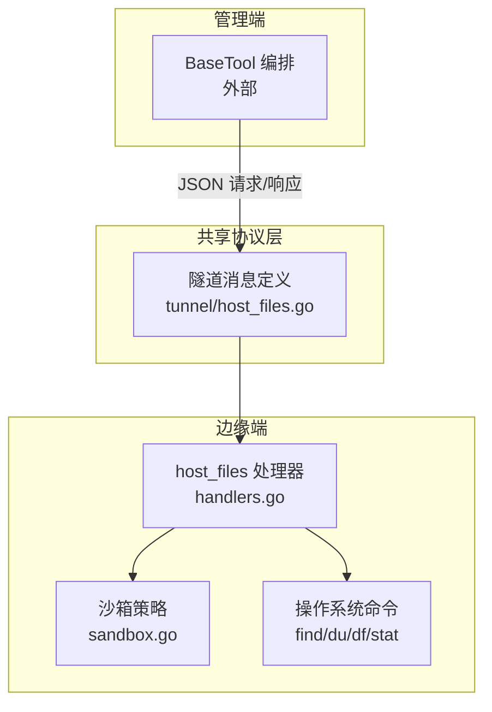
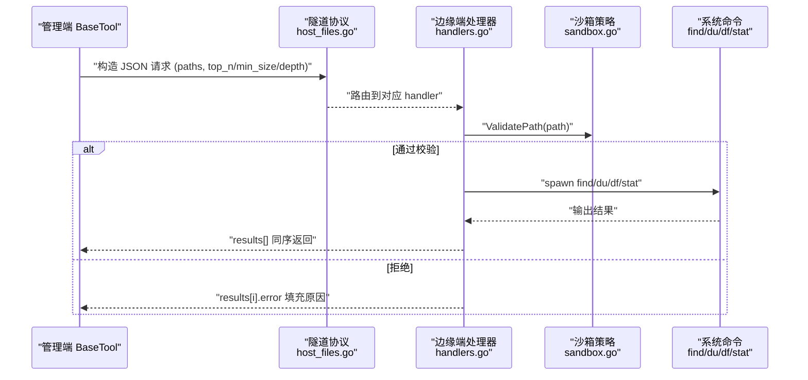
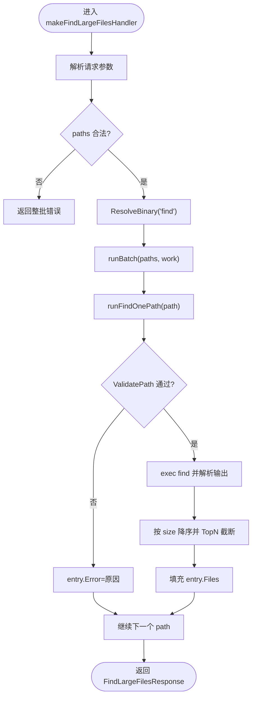
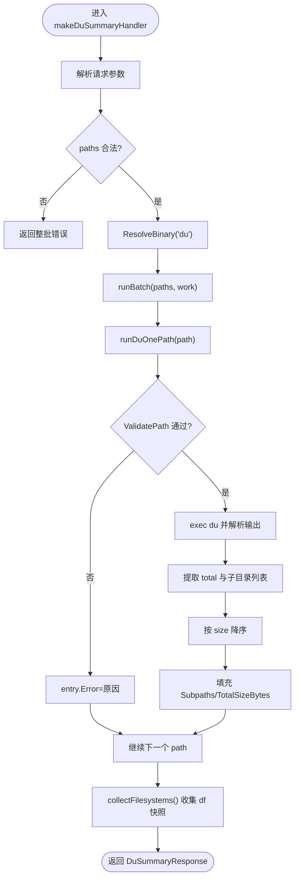
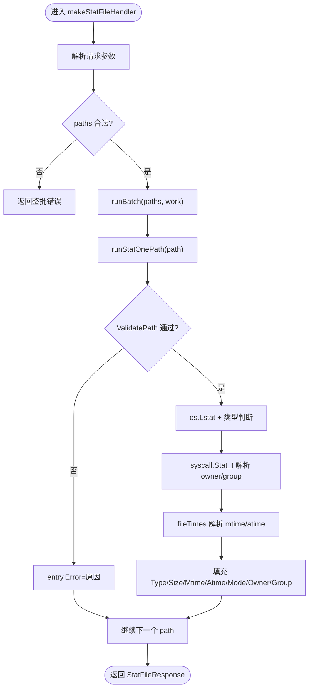
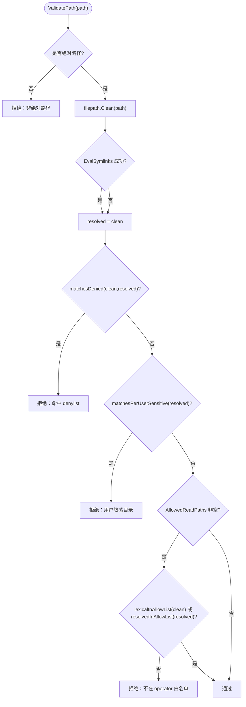
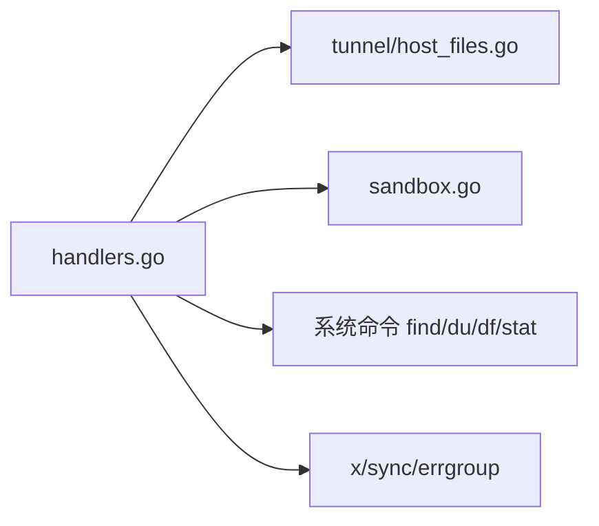

# 文件操作接口

<cite>
**本文引用的文件**   
- [handlers.go](file://internal/edgeagent/host_files/handlers.go)
- [sandbox.go](file://internal/edgeagent/host_files/sandbox.go)
- [host_files.go](file://internal/pkg/tunnel/host_files.go)
- [SKILL.md](file://skills/host-files/SKILL.md)
- [handlers_test.go](file://internal/edgeagent/host_files/handlers_test.go)
- [sandbox_test.go](file://internal/edgeagent/host_files/sandbox_test.go)
</cite>

## 目录
1. [简介](#简介)
2. [项目结构](#项目结构)
3. [核心组件](#核心组件)
4. [架构总览](#架构总览)
5. [详细组件分析](#详细组件分析)
6. [依赖关系分析](#依赖关系分析)
7. [性能考量](#性能考量)
8. [故障排查指南](#故障排查指南)
9. [结论](#结论)
10. [附录](#附录)

## 简介
本文件面向边缘节点的文件系统访问服务，聚焦以下能力：
- 文件读取与元信息获取：查找大文件、目录占用统计、单文件/目录 stat。
- 批量协议：一次请求携带多个路径，按顺序返回结果，支持部分成功。
- 安全沙箱：路径遍历防护（绝对路径、符号链接解析、前缀匹配）、二进制白名单、可选白名单叠加。
- 并发与超时控制：批内并发上限、每路径超时、整批超时。
- 审计追踪：调用日志记录、错误分类、覆盖度提示（df 快照）。
- 使用示例、最佳实践与性能调优建议。

该能力通过隧道协议在管理端与边缘端之间交互，由边缘端注册处理器并执行本地 find/du/stat 等只读工具。

章节来源
- [SKILL.md:1-129](file://skills/host-files/SKILL.md#L1-L129)

## 项目结构
围绕“文件操作接口”的核心代码分布在三个位置：
- 边缘端处理器与沙箱：internal/edgeagent/host_files
- 隧道协议与消息模型：internal/pkg/tunnel
- 技能说明与调用约定：skills/host-files/SKILL.md

图表来源
- [handlers.go:94-110](file://internal/edgeagent/host_files/handlers.go#L94-L110)
- [sandbox.go:100-133](file://internal/edgeagent/host_files/sandbox.go#L100-L133)
- [host_files.go:24-37](file://internal/pkg/tunnel/host_files.go#L24-L37)

章节来源
- [handlers.go:94-110](file://internal/edgeagent/host_files/handlers.go#L94-L110)
- [host_files.go:24-37](file://internal/pkg/tunnel/host_files.go#L24-L37)
- [SKILL.md:1-34](file://skills/host-files/SKILL.md#L1-L34)

## 核心组件
- 隧道方法常量与消息体
  - 方法名：host_files.find_large_files / host_files.du_summary / host_files.stat_file
  - 请求均包含 paths[]（1..16），响应为 results[]，保持输入顺序，支持 per-path 错误。
- 边缘端处理器
  - find_large_files：基于 find 扫描，TopN 排序，最小尺寸过滤，排除虚拟文件系统。
  - du_summary：基于 du 输出，按深度展开子目录，附带 df 挂载点容量快照。
  - stat_file：纯 Go 实现，返回类型、大小、时间戳、权限、所有者/组。
- 沙箱策略
  - 默认拒绝列表：/proc /sys /dev /run 及高敏感路径；可选白名单叠加。
  - 二进制白名单：仅允许 find/du/df/stat/ls 等只读工具。
  - 路径校验：绝对路径、规范化、符号链接解析、前缀匹配。
- 并发与超时
  - 批内并发上限：4
  - 每路径超时：30s
  - 整批超时：60s
  - 最大路径数：16

章节来源
- [host_files.go:24-37](file://internal/pkg/tunnel/host_files.go#L24-L37)
- [host_files.go:43-97](file://internal/pkg/tunnel/host_files.go#L43-L97)
- [host_files.go:114-181](file://internal/pkg/tunnel/host_files.go#L114-L181)
- [host_files.go:187-221](file://internal/pkg/tunnel/host_files.go#L187-L221)
- [handlers.go:60-86](file://internal/edgeagent/host_files/handlers.go#L60-L86)
- [handlers.go:123-139](file://internal/edgeagent/host_files/handlers.go#L123-L139)
- [sandbox.go:57-109](file://internal/edgeagent/host_files/sandbox.go#L57-L109)
- [sandbox.go:152-193](file://internal/edgeagent/host_files/sandbox.go#L152-L193)

## 架构总览
从管理端 BaseTool 到边缘端处理器的端到端流程如下：

图表来源
- [handlers.go:149-191](file://internal/edgeagent/host_files/handlers.go#L149-L191)
- [handlers.go:390-433](file://internal/edgeagent/host_files/handlers.go#L390-L433)
- [handlers.go:635-662](file://internal/edgeagent/host_files/handlers.go#L635-L662)
- [sandbox.go:152-193](file://internal/edgeagent/host_files/sandbox.go#L152-L193)
- [host_files.go:24-37](file://internal/pkg/tunnel/host_files.go#L24-L37)

## 详细组件分析

### 组件一：find_large_files（查找大文件）
- 功能要点
  - 支持 TopN 截断、最小尺寸过滤、排除路径前缀。
  - Linux 使用 GNU find -printf，Darwin 使用 BSD find + stat。
  - 结果按 size 降序排列，附带 human 可读大小。
- 关键流程
  - 参数校验（paths 非空、数量限制、top_n/min_size 默认值）。
  - 解析二进制白名单中的 find 路径。
  - 对每个 path 并发执行 runFindOnePath，失败不中断批次。
  - 输出 FindLargeFilesResponse。

图表来源
- [handlers.go:149-191](file://internal/edgeagent/host_files/handlers.go#L149-L191)
- [handlers.go:197-224](file://internal/edgeagent/host_files/handlers.go#L197-L224)
- [handlers.go:231-262](file://internal/edgeagent/host_files/handlers.go#L231-L262)
- [handlers.go:266-282](file://internal/edgeagent/host_files/handlers.go#L266-L282)
- [handlers.go:287-298](file://internal/edgeagent/host_files/handlers.go#L287-L298)
- [handlers.go:303-322](file://internal/edgeagent/host_files/handlers.go#L303-L322)
- [handlers.go:326-346](file://internal/edgeagent/host_files/handlers.go#L326-L346)
- [handlers.go:350-369](file://internal/edgeagent/host_files/handlers.go#L350-L369)
- [handlers.go:373-381](file://internal/edgeagent/host_files/handlers.go#L373-L381)

章节来源
- [handlers.go:149-191](file://internal/edgeagent/host_files/handlers.go#L149-L191)
- [handlers.go:197-224](file://internal/edgeagent/host_files/handlers.go#L197-L224)
- [handlers.go:231-262](file://internal/edgeagent/host_files/handlers.go#L231-L262)
- [handlers.go:266-282](file://internal/edgeagent/host_files/handlers.go#L266-L282)
- [handlers.go:287-298](file://internal/edgeagent/host_files/handlers.go#L287-L298)
- [handlers.go:303-322](file://internal/edgeagent/host_files/handlers.go#L303-L322)
- [handlers.go:326-346](file://internal/edgeagent/host_files/handlers.go#L326-L346)
- [handlers.go:350-369](file://internal/edgeagent/host_files/handlers.go#L350-L369)
- [handlers.go:373-381](file://internal/edgeagent/host_files/handlers.go#L373-L381)
- [host_files.go:43-97](file://internal/pkg/tunnel/host_files.go#L43-L97)

### 组件二：du_summary（目录占用统计）
- 功能要点
  - 支持 depth 控制展开层级，Linux 使用 --max-depth=N -B1，Darwin 使用 -d N -k。
  - 解析 TSV 输出，提取 total 与子目录条目，按 size 降序。
  - 附加 df 快照（"/" 与各 path 所在唯一挂载点），用于覆盖率提示。
- 关键流程
  - 参数校验与 du 二进制解析。
  - 对每个 path 并发执行 runDuOnePath。
  - 收集 Filesystems 列表（best-effort）。
  - 输出 DuSummaryResponse。

图表来源
- [handlers.go:390-433](file://internal/edgeagent/host_files/handlers.go#L390-L433)
- [handlers.go:439-470](file://internal/edgeagent/host_files/handlers.go#L439-L470)
- [handlers.go:475-532](file://internal/edgeagent/host_files/handlers.go#L475-L532)
- [handlers.go:535-557](file://internal/edgeagent/host_files/handlers.go#L535-L557)
- [handlers.go:562-625](file://internal/edgeagent/host_files/handlers.go#L562-L625)
- [host_files.go:114-181](file://internal/pkg/tunnel/host_files.go#L114-L181)

章节来源
- [handlers.go:390-433](file://internal/edgeagent/host_files/handlers.go#L390-L433)
- [handlers.go:439-470](file://internal/edgeagent/host_files/handlers.go#L439-L470)
- [handlers.go:475-532](file://internal/edgeagent/host_files/handlers.go#L475-L532)
- [handlers.go:535-557](file://internal/edgeagent/host_files/handlers.go#L535-L557)
- [handlers.go:562-625](file://internal/edgeagent/host_files/handlers.go#L562-L625)
- [host_files.go:114-181](file://internal/pkg/tunnel/host_files.go#L114-L181)

### 组件三：stat_file（文件/目录元信息）
- 功能要点
  - 纯 Go 实现，os.Lstat + syscall.Stat_t 获取 owner/group。
  - 识别 file/dir/symlink，返回 size/mtime/atime/mode/owner/group。
- 关键流程
  - 参数校验与并发执行 runStatOnePath。
  - 对每个 path 进行 ValidatePath 与 Lstat。
  - 输出 StatFileResponse。

图表来源
- [handlers.go:635-662](file://internal/edgeagent/host_files/handlers.go#L635-L662)
- [handlers.go:666-718](file://internal/edgeagent/host_files/handlers.go#L666-L718)
- [host_files.go:187-221](file://internal/pkg/tunnel/host_files.go#L187-L221)

章节来源
- [handlers.go:635-662](file://internal/edgeagent/host_files/handlers.go#L635-L662)
- [handlers.go:666-718](file://internal/edgeagent/host_files/handlers.go#L666-L718)
- [host_files.go:187-221](file://internal/pkg/tunnel/host_files.go#L187-L221)

### 组件四：沙箱与安全策略
- 路径校验
  - 必须为绝对路径；规范化后尝试 EvalSymlinks 解析真实目标。
  - 先检查 denylist（含虚拟文件系统和高敏感路径），再检查 per-user 敏感目录（/home/<user>/.ssh 等）。
  - 若配置了 AllowedReadPaths，则需额外命中 allowlist（原始或已解析形式）。
- 二进制白名单
  - 启动时 discoverBinaries 解析 find/du/df/stat/ls 的绝对路径。
  - 运行时 ResolveBinary 严格限定可执行命令集合。
- 默认策略
  - DeniedReadPaths 包含 /proc /sys /dev /run /etc/shadow /etc/sudoers /root/.ssh /root/.gnupg。
  - AllowedReadPaths 默认为空（仅 denylist 生效），可按需收紧。

图表来源
- [sandbox.go:152-193](file://internal/edgeagent/host_files/sandbox.go#L152-L193)
- [sandbox.go:197-210](file://internal/edgeagent/host_files/sandbox.go#L197-L210)
- [sandbox.go:214-228](file://internal/edgeagent/host_files/sandbox.go#L214-L228)
- [sandbox.go:233-264](file://internal/edgeagent/host_files/sandbox.go#L233-L264)
- [sandbox.go:288-304](file://internal/edgeagent/host_files/sandbox.go#L288-L304)

章节来源
- [sandbox.go:57-109](file://internal/edgeagent/host_files/sandbox.go#L57-L109)
- [sandbox.go:152-193](file://internal/edgeagent/host_files/sandbox.go#L152-L193)
- [sandbox.go:197-210](file://internal/edgeagent/host_files/sandbox.go#L197-L210)
- [sandbox.go:214-228](file://internal/edgeagent/host_files/sandbox.go#L214-L228)
- [sandbox.go:233-264](file://internal/edgeagent/host_files/sandbox.go#L233-L264)
- [sandbox.go:288-304](file://internal/edgeagent/host_files/sandbox.go#L288-L304)

## 依赖关系分析
- 模块耦合
  - handlers.go 依赖 tunnel/host_files.go 的消息结构与方法常量。
  - handlers.go 依赖 sandbox.go 的路径与二进制策略。
  - handlers.go 通过 os/exec 调用系统命令（find/du/df/stat）。
- 外部依赖
  - golang.org/x/sync/errgroup 用于批内并发控制。
  - 标准库：bufio、encoding/json、log/slog、os、path/filepath、runtime、sort、strconv、strings、syscall、time。

图表来源
- [handlers.go:36-58](file://internal/edgeagent/host_files/handlers.go#L36-L58)
- [host_files.go:1-37](file://internal/pkg/tunnel/host_files.go#L1-L37)

章节来源
- [handlers.go:36-58](file://internal/edgeagent/host_files/handlers.go#L36-L58)
- [host_files.go:1-37](file://internal/pkg/tunnel/host_files.go#L1-L37)

## 性能考量
- 并发控制
  - 批内并发上限 hostFilesBatchConcurrency=4，避免磁盘 I/O 饱和与 CPU 争用。
- 超时保护
  - 每路径 hostFilesPerPathTimeout=30s，整批 hostFilesBatchTimeout=60s，防止单次请求长时间阻塞。
- 输出裁剪
  - find_large_files 支持 TopN 截断与 min_size_bytes 过滤，减少结果集。
  - du_summary 推荐 depth=1，逐层下钻，避免一次性深遍历。
- 平台差异
  - Linux 使用 -printf/-B1 提升解析效率；Darwin 使用 -exec stat 兼容 BSD。
- 资源探测
  - collectFilesystems 以 best-effort 方式补充 df 快照，不影响主流程。

章节来源
- [handlers.go:60-86](file://internal/edgeagent/host_files/handlers.go#L60-L86)
- [handlers.go:123-139](file://internal/edgeagent/host_files/handlers.go#L123-L139)
- [handlers.go:231-262](file://internal/edgeagent/host_files/handlers.go#L231-L262)
- [handlers.go:562-625](file://internal/edgeagent/host_files/handlers.go#L562-L625)
- [handlers.go:439-470](file://internal/edgeagent/host_files/handlers.go#L439-L470)

## 故障排查指南
- 常见错误定位
  - 路径被拒绝：检查是否为绝对路径、是否存在符号链接逃逸、是否命中 denylist 或 per-user 敏感目录。
  - 二进制缺失：确认 find/du 是否在 PATH 或回退目录中，且未被 operator 白名单剔除。
  - 整批失败：paths 为空或超过 16 条将导致整批错误；per-path 错误不会中断其他项。
  - 超时：单个路径耗时过长会被 per-path 超时切断；整批超过 60s 会取消。
- 验证手段
  - 使用单元测试样例构造临时目录树，验证 find/du/stat 行为与排序/截断逻辑。
  - 针对 macOS 的 realpath 差异，确保测试中将临时目录规范化后再加入 allow-list。
- 参考用例
  - 批量部分成功：混合 allowed/blocked paths，验证 results 顺序与 error 字段。
  - 全拒绝路径：/proc、/root/.ssh 等应全部落入 error。
  - 并发上限：runBatch 峰值并发不超过 4，输出顺序不变。

章节来源
- [handlers_test.go:129-139](file://internal/edgeagent/host_files/handlers_test.go#L129-L139)
- [handlers_test.go:192-242](file://internal/edgeagent/host_files/handlers_test.go#L192-L242)
- [handlers_test.go:244-294](file://internal/edgeagent/host_files/handlers_test.go#L244-L294)
- [handlers_test.go:300-378](file://internal/edgeagent/host_files/handlers_test.go#L300-L378)
- [handlers_test.go:427-521](file://internal/edgeagent/host_files/handlers_test.go#L427-L521)
- [handlers_test.go:570-605](file://internal/edgeagent/host_files/handlers_test.go#L570-L605)
- [sandbox_test.go:15-30](file://internal/edgeagent/host_files/sandbox_test.go#L15-L30)
- [sandbox_test.go:35-82](file://internal/edgeagent/host_files/sandbox_test.go#L35-L82)
- [sandbox_test.go:101-126](file://internal/edgeagent/host_files/sandbox_test.go#L101-L126)
- [sandbox_test.go:128-152](file://internal/edgeagent/host_files/sandbox_test.go#L128-L152)

## 结论
文件操作接口通过严格的沙箱策略与批处理协议，在保障安全的前提下提供高效的只读文件系统诊断能力。其设计兼顾跨平台兼容性、并发与超时控制、以及可扩展的策略机制，适合在边缘节点上作为 AIOps 排障的基础设施。

## 附录

### API 协议与数据模型
- 方法名
  - host_files.find_large_files
  - host_files.du_summary
  - host_files.stat_file
- 通用约束
  - paths[]：必填，长度 1..16
  - 响应 results[]：与 paths 同序，每项可能包含 data 或 error
- 请求/响应字段
  - find_large_files
    - 请求：paths[], top_n, min_size_bytes, exclude_paths
    - 响应：results[].{path, scanned_path, files[], error?}
    - files[]：HostFileInfo.{path, size_bytes, size_human, mtime, owner}
  - du_summary
    - 请求：paths[], depth
    - 响应：results[].{path, subpaths[], total_size_bytes, total_size_human, error?}
    - subpaths[]：HostDuEntry.{subpath, size_bytes, size_human}
    - filesystems[]：HostFilesystem.{mountpoint, used_bytes, size_bytes, used_human, size_human}
  - stat_file
    - 请求：paths[]
    - 响应：results[].{path, type, size_bytes, size_human, mtime, atime, mode, owner, group, error?}

章节来源
- [host_files.go:24-37](file://internal/pkg/tunnel/host_files.go#L24-L37)
- [host_files.go:43-97](file://internal/pkg/tunnel/host_files.go#L43-L97)
- [host_files.go:114-181](file://internal/pkg/tunnel/host_files.go#L114-L181)
- [host_files.go:187-221](file://internal/pkg/tunnel/host_files.go#L187-L221)

### 使用示例与最佳实践
- 典型流程
  - 先用 query_promql 观察 disk_used_pct 趋势，定位设备与挂载点。
  - 一次传入多个根路径进行 du_summary 下钻，逐步缩小范围。
  - 对疑似热点目录使用 find_large_files 定位具体大文件。
  - 使用 stat_file 快速核对文件类型、权限与所有者。
- 反模式
  - 不要对单个 path 多次调用，尽量 batch 合并。
  - 不要在 /proc /sys 运行 du，永远跑不完。
  - 不要触碰敏感路径，命中 denylist 会直接报错。
- 安全建议
  - 仅在必要时开启 AllowedReadPaths 进一步收敛。
  - 定期审查 AllowedBinaries，移除不再需要的命令。
  - 结合日志与告警，监控异常路径访问与高频失败。

章节来源
- [SKILL.md:36-129](file://skills/host-files/SKILL.md#L36-L129)