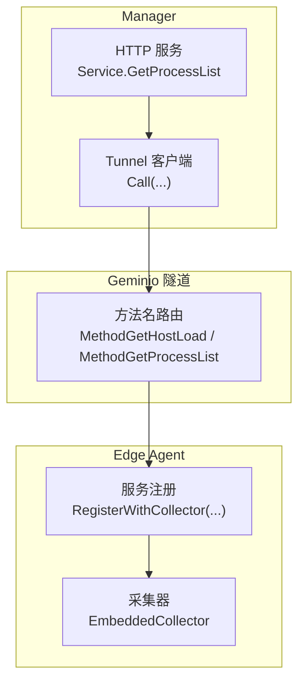
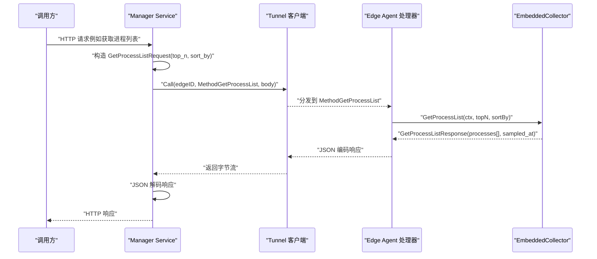
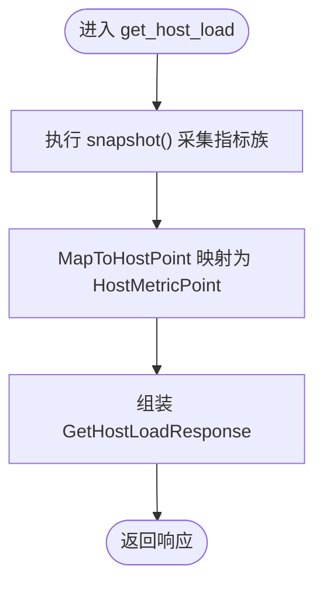
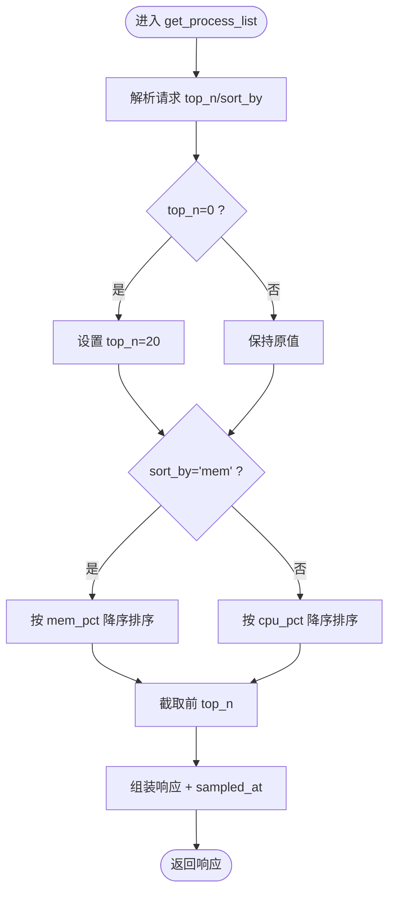
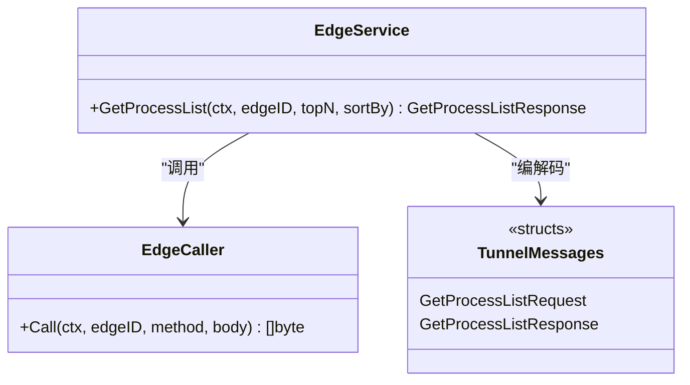
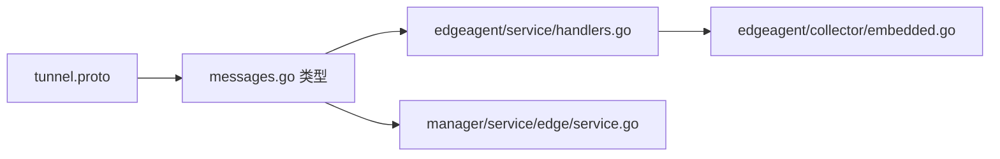

# 系统信息查询接口

<cite>
**本文引用的文件**   
- [tunnel.proto](file://api/tunnel/v1/tunnel.proto)
- [messages.go](file://internal/pkg/tunnel/messages.go)
- [handlers.go](file://internal/edgeagent/service/handlers.go)
- [embedded.go](file://internal/edgeagent/collector/embedded.go)
- [service.go](file://internal/manager/service/edge/service.go)
</cite>

## 目录
1. [简介](#简介)
2. [项目结构](#项目结构)
3. [核心组件](#核心组件)
4. [架构总览](#架构总览)
5. [详细组件分析](#详细组件分析)
6. [依赖关系分析](#依赖关系分析)
7. [性能与限制](#性能与限制)
8. [错误处理与重试](#错误处理与重试)
9. [调用示例](#调用示例)
10. [故障排查指南](#故障排查指南)
11. [结论](#结论)

## 简介
本文件面向边缘节点暴露的系统信息查询接口，聚焦以下两个能力：
- 主机负载查询（get_host_load）：返回 CPU、内存、磁盘使用率与系统负载的即时快照。
- 进程列表查询（get_process_list）：返回按 CPU 或内存排序的前 N 个进程信息。

接口通过云端到边端的隧道协议以 JSON 报文传输，由 Manager 侧发起，Edge Agent 侧注册并处理。

## 项目结构
与系统信息查询相关的代码主要分布在如下位置：
- 协议定义：api/tunnel/v1/tunnel.proto
- 消息类型与方法名常量：internal/pkg/tunnel/messages.go
- Edge 端服务注册与处理器：internal/edgeagent/service/handlers.go
- Edge 端采集实现（gopsutil）：internal/edgeagent/collector/embedded.go
- Manager 侧 HTTP 到 RPC 的转发层：internal/manager/service/edge/service.go

图表来源
- [service.go:96-118](file://internal/manager/service/edge/service.go#L96-L118)
- [messages.go:17-24](file://internal/pkg/tunnel/messages.go#L17-L24)
- [handlers.go:27-68](file://internal/edgeagent/service/handlers.go#L27-L68)
- [embedded.go:114-174](file://internal/edgeagent/collector/embedded.go#L114-L174)

章节来源
- [tunnel.proto:90-134](file://api/tunnel/v1/tunnel.proto#L90-L134)
- [messages.go:17-24](file://internal/pkg/tunnel/messages.go#L17-L24)
- [handlers.go:27-68](file://internal/edgeagent/service/handlers.go#L27-L68)
- [embedded.go:114-174](file://internal/edgeagent/collector/embedded.go#L114-L174)
- [service.go:96-118](file://internal/manager/service/edge/service.go#L96-L118)

## 核心组件
- 协议与消息体
  - get_host_load：请求为空对象；响应包含 cpu_pct、mem_pct、disk_used_pct、load1/5/15、sampled_at。
  - get_process_list：请求包含 top_n、sort_by（cpu/mem）；响应为 processes 数组与 sampled_at。
- Edge 端处理器
  - 将云→边的方法名映射到具体 Collector 实现，负责参数默认值填充与结果序列化。
- Edge 端采集器
  - EmbeddedCollector 基于 gopsutil 实时采样 CPU/内存/负载/磁盘/进程等指标。
- Manager 侧转发
  - Service.GetProcessList 将 HTTP 请求转换为 tunnel.Call 调用，完成 JSON 编解码与错误透传。

章节来源
- [tunnel.proto:90-134](file://api/tunnel/v1/tunnel.proto#L90-L134)
- [messages.go:380-433](file://internal/pkg/tunnel/messages.go#L380-L433)
- [handlers.go:27-68](file://internal/edgeagent/service/handlers.go#L27-L68)
- [embedded.go:114-174](file://internal/edgeagent/collector/embedded.go#L114-L174)
- [service.go:96-118](file://internal/manager/service/edge/service.go#L96-L118)

## 架构总览
下图展示了从 Manager 到 Edge 的完整调用链，包括方法名、请求/响应结构与关键编解码点。

图表来源
- [service.go:96-118](file://internal/manager/service/edge/service.go#L96-L118)
- [messages.go:403-433](file://internal/pkg/tunnel/messages.go#L403-L433)
- [handlers.go:48-67](file://internal/edgeagent/service/handlers.go#L48-L67)
- [embedded.go:132-174](file://internal/edgeagent/collector/embedded.go#L132-L174)

## 详细组件分析

### 主机负载查询（get_host_load）
- 协议定义
  - 方法名：get_host_load
  - 请求体：空对象
  - 响应字段：
    - cpu_pct：CPU 使用百分比
    - mem_pct：内存使用百分比
    - disk_used_pct：根文件系统使用百分比
    - load1/load5/load15：系统 1/5/15 分钟负载均值
    - sampled_at：采样时间戳（Unix 秒）
- 数据源与计算
  - 通过 EmbeddedCollector 在 Edge 端实时采样，内部复用与 Prometheus 兼容的指标族映射逻辑，最终输出结构化响应。
- 行为特性
  - 按需采集，无本地缓存；每次调用均触发一次快照。
  - 对磁盘使用率的补充字段用于避免上层误读。

图表来源
- [embedded.go:114-130](file://internal/edgeagent/collector/embedded.go#L114-L130)
- [embedded.go:198-235](file://internal/edgeagent/collector/embedded.go#L198-L235)
- [messages.go:380-401](file://internal/pkg/tunnel/messages.go#L380-L401)

章节来源
- [tunnel.proto:90-103](file://api/tunnel/v1/tunnel.proto#L90-L103)
- [messages.go:380-401](file://internal/pkg/tunnel/messages.go#L380-L401)
- [embedded.go:114-130](file://internal/edgeagent/collector/embedded.go#L114-L130)

### 进程列表查询（get_process_list）
- 协议定义
  - 方法名：get_process_list
  - 请求体：
    - top_n：返回前 N 条记录（未设置时默认 20）
    - sort_by：排序键，支持 "cpu" 或 "mem"（未设置时默认 "cpu"）
  - 响应体：
    - processes：进程信息数组，每项包含 pid、name、cmdline、cpu_pct、mem_pct、user
    - sampled_at：采样时间戳（Unix 秒）
- 数据处理流程
  - 遍历内核进程表，收集必要字段；按指定键排序后截断至 top_n。
- 典型用途
  - 监控页面“设备进程面板”、LLM 工具 get_host_processes 共用同一 RPC。

图表来源
- [handlers.go:48-67](file://internal/edgeagent/service/handlers.go#L48-L67)
- [embedded.go:132-174](file://internal/edgeagent/collector/embedded.go#L132-L174)
- [messages.go:403-433](file://internal/pkg/tunnel/messages.go#L403-L433)

章节来源
- [tunnel.proto:105-134](file://api/tunnel/v1/tunnel.proto#L105-L134)
- [messages.go:403-433](file://internal/pkg/tunnel/messages.go#L403-L433)
- [handlers.go:48-67](file://internal/edgeagent/service/handlers.go#L48-L67)
- [embedded.go:132-174](file://internal/edgeagent/collector/embedded.go#L132-L174)

### Manager 侧转发（HTTP → Tunnel Call）
- 职责
  - 接收 HTTP 请求，构造 GetProcessListRequest，调用 EdgeCaller.Call 发送 RPC，再反序列化为响应。
- 错误透传
  - 编解码失败会包装错误并向上返回；连接不可达或远端错误直接透传。

图表来源
- [service.go:96-118](file://internal/manager/service/edge/service.go#L96-L118)
- [messages.go:403-433](file://internal/pkg/tunnel/messages.go#L403-L433)

章节来源
- [service.go:96-118](file://internal/manager/service/edge/service.go#L96-L118)
- [messages.go:403-433](file://internal/pkg/tunnel/messages.go#L403-L433)

## 依赖关系分析
- 方法名常量
  - MethodGetHostLoad、MethodGetProcessList 统一定义于 messages.go，供两端一致引用。
- 协议与 Go 类型
  - tunnel.proto 定义了 wire 形状；Go 侧 internal/pkg/tunnel/messages.go 提供同构结构体与 JSON 标签，确保前后端一致。
- Edge 端注册
  - service/handlers.go 将方法名绑定到具体 Collector 实现；当 collector 为 nil 时安装 stub 处理器以保证兼容性。
- 采集实现
  - embedded.go 基于 gopsutil 读取系统资源与进程信息，保证低耦合与可替换性。

图表来源
- [messages.go:17-24](file://internal/pkg/tunnel/messages.go#L17-L24)
- [handlers.go:27-68](file://internal/edgeagent/service/handlers.go#L27-L68)
- [embedded.go:114-174](file://internal/edgeagent/collector/embedded.go#L114-L174)
- [service.go:96-118](file://internal/manager/service/edge/service.go#L96-L118)

章节来源
- [messages.go:17-24](file://internal/pkg/tunnel/messages.go#L17-L24)
- [handlers.go:27-68](file://internal/edgeagent/service/handlers.go#L27-L68)
- [embedded.go:114-174](file://internal/edgeagent/collector/embedded.go#L114-L174)
- [service.go:96-118](file://internal/manager/service/edge/service.go#L96-L118)

## 性能与限制
- 查询频率
  - 当前实现为按需实时采样，无服务端或边端缓存；高频调用将直接增加系统开销。建议合理控制轮询间隔（例如 ≥5s）。
- 数据范围
  - get_process_list 的 top_n 默认 20，过大将导致更多进程遍历与排序开销；建议在 UI 或上游限流。
- 资源消耗
  - 进程扫描涉及多次系统调用（名称、命令行、用户、CPU/内存占比），在高并发下可能放大 CPU 占用。
- 网络与序列化
  - 采用 JSON 编解码，体积适中；若需更高吞吐可在后续阶段切换二进制协议（设计已预留扩展点）。

[本节为通用指导，不直接分析具体文件]

## 错误处理与重试
- 错误分类
  - 编解码错误：请求/响应 JSON 编解码失败，返回包装后的错误。
  - 连接/远端错误：隧道不可用、远端拒绝或超时等，错误直接透传。
- 重试策略
  - 当前未在业务层实现显式重试；调用方可根据错误类型实施指数退避与最大重试次数控制。
- 可观测性
  - 建议在调用链路中记录耗时与错误码，便于定位瓶颈与异常。

章节来源
- [service.go:101-118](file://internal/manager/service/edge/service.go#L101-L118)
- [handlers.go:48-67](file://internal/edgeagent/service/handlers.go#L48-L67)

## 调用示例
以下为概念性示例，展示请求/响应结构与关键字段含义。实际调用请结合上层 HTTP 封装与鉴权机制。

- 主机负载查询（get_host_load）
  - 请求体：{}
  - 响应体关键字段：
    - cpu_pct：浮点数，CPU 使用百分比
    - mem_pct：浮点数，内存使用百分比
    - disk_used_pct：浮点数，根文件系统使用百分比
    - load1/load5/load15：浮点数，系统负载均值
    - sampled_at：整数，Unix 秒时间戳
- 进程列表查询（get_process_list）
  - 请求体关键字段：
    - top_n：整数，返回前 N 条（默认 20）
    - sort_by：字符串，"cpu" 或 "mem"（默认 "cpu"）
  - 响应体关键字段：
    - processes：数组，元素包含 pid、name、cmdline、cpu_pct、mem_pct、user
    - sampled_at：整数，Unix 秒时间戳

章节来源
- [messages.go:380-433](file://internal/pkg/tunnel/messages.go#L380-L433)

## 故障排查指南
- 现象：返回空进程列表或空负载
  - 检查 Edge 端是否安装了真实 Collector（非 stub）；确认 RegisterWithCollector 已注入。
  - 查看 Edge 日志中是否存在“invoked (stub)”提示。
- 现象：频繁超时或连接断开
  - 检查隧道连通性与认证配置；确认 Edge 在线且方法路由正常。
- 现象：进程列表过大导致延迟高
  - 降低 top_n 或缩短轮询频率；必要时在上游增加节流。
- 现象：磁盘使用率为 0 或不准确
  - 确认底层文件系统可用；部分容器化环境挂载受限可能导致无法统计。

章节来源
- [handlers.go:70-84](file://internal/edgeagent/service/handlers.go#L70-L84)
- [embedded.go:132-174](file://internal/edgeagent/collector/embedded.go#L132-L174)

## 结论
系统信息查询接口通过简洁的 JSON 协议与清晰的职责分层，实现了按需、实时的主机负载与进程信息获取。建议在应用层做好频率控制与错误重试，以获得稳定且高效的观测体验。未来如需更高吞吐，可在保留调用契约的前提下升级序列化格式。