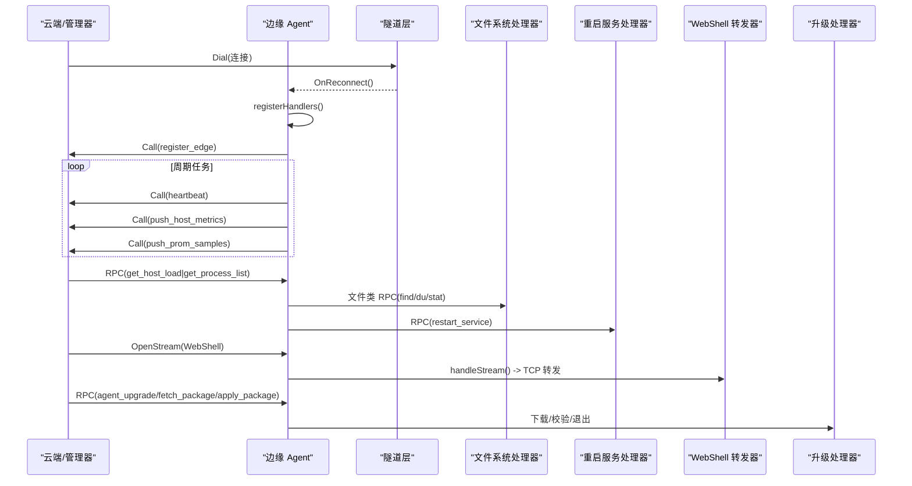
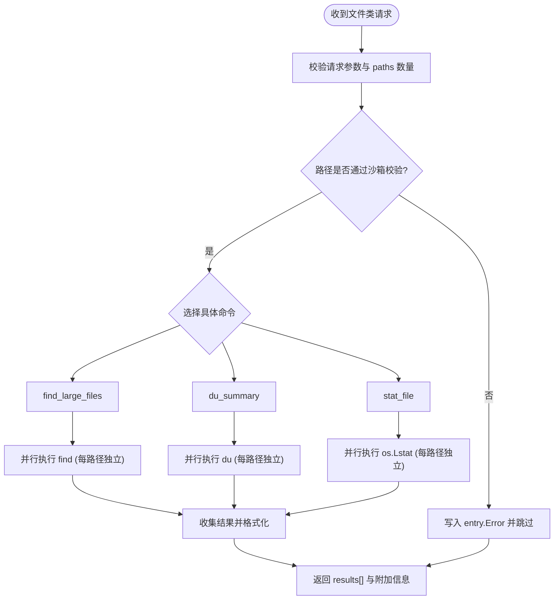
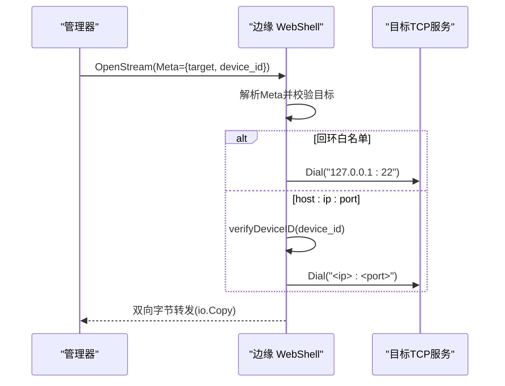
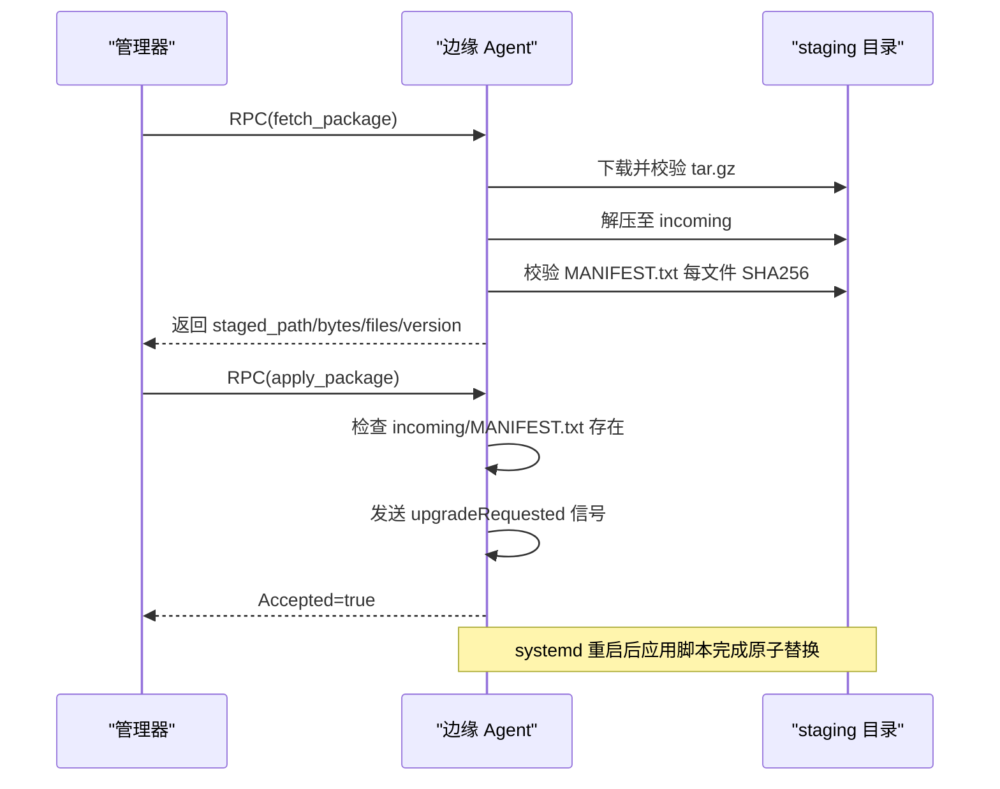
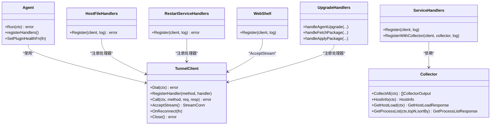

# 边缘服务接口

<cite>
**本文引用的文件**   
- [internal/pkg/tunnel/types.go](file://internal/pkg/tunnel/types.go)
- [internal/pkg/tunnel/messages.go](file://internal/pkg/tunnel/messages.go)
- [internal/edgeagent/biz/agent.go](file://internal/edgeagent/biz/agent.go)
- [internal/edgeagent/service/handlers.go](file://internal/edgeagent/service/handlers.go)
- [internal/edgeagent/host_files/handlers.go](file://internal/edgeagent/host_files/handlers.go)
- [internal/edgeagent/host_files/sandbox.go](file://internal/edgeagent/host_files/sandbox.go)
- [internal/edgeagent/restart_service/handlers.go](file://internal/edgeagent/restart_service/handlers.go)
- [internal/edgeagent/webshell/handler.go](file://internal/edgeagent/webshell/handler.go)
- [internal/edgeagent/biz/upgrade.go](file://internal/edgeagent/biz/upgrade.go)
- [internal/edgeagent/biz/upgrade_package.go](file://internal/edgeagent/biz/upgrade_package.go)
</cite>

## 目录
1. [简介](#简介)
2. [项目结构](#项目结构)
3. [核心组件](#核心组件)
4. [架构总览](#架构总览)
5. [详细组件分析](#详细组件分析)
6. [依赖关系分析](#依赖关系分析)
7. [性能与并发特性](#性能与并发特性)
8. [错误处理与重试机制](#错误处理与重试机制)
9. [安全控制与审计](#安全控制与审计)
10. [使用示例与集成指南](#使用示例与集成指南)
11. [故障排查与调试方法](#故障排查与调试方法)
12. [结论](#结论)

## 简介
本文件面向“边缘节点”暴露的服务接口，覆盖系统信息查询、文件操作、服务重启、WebShell、以及边缘代理升级等能力。文档从协议定义、请求/响应结构、安全控制（身份验证、权限检查、审计）、性能特征（并发、时延、资源消耗）、错误处理策略（异常分类、错误码、重试）到使用示例与集成指南进行全面说明，帮助读者快速理解并正确集成这些接口。

## 项目结构
边缘侧以“隧道客户端 + 处理器注册”的方式运行：
- 隧道层提供连接、认证、RPC 调用与双向流通道；
- 业务层按功能域注册处理器（系统信息、文件、重启、WebShell、升级）；
- 沙箱与白名单用于限制敏感路径与可执行二进制，确保最小权限。

```mermaid
graph TB
subgraph "边缘进程"
A["Agent 主循环<br/>心跳/指标/升级"] --> B["服务处理器注册<br/>get_host_load / get_process_list"]
A --> C["文件操作处理器<br/>find_large_files / du_summary / stat_file"]
A --> D["重启服务处理器<br/>restart_service"]
A --> E["WebShell 流转发器<br/>AcceptStream -> TCP 转发"]
A --> F["升级处理器<br/>agent_upgrade / fetch_package / apply_package"]
end
subgraph "云端/管理器"
M["Manager 侧调用方"]
end
M < --> |"geminio 隧道 RPC/流"| A
```

图表来源
- [internal/edgeagent/biz/agent.go:154-232](file://internal/edgeagent/biz/agent.go#L154-L232)
- [internal/edgeagent/service/handlers.go:23-85](file://internal/edgeagent/service/handlers.go#L23-L85)
- [internal/edgeagent/host_files/handlers.go:88-110](file://internal/edgeagent/host_files/handlers.go#L88-L110)
- [internal/edgeagent/restart_service/handlers.go:144-162](file://internal/edgeagent/restart_service/handlers.go#L144-L162)
- [internal/edgeagent/webshell/handler.go:49-76](file://internal/edgeagent/webshell/handler.go#L49-L76)
- [internal/edgeagent/biz/upgrade.go:19-155](file://internal/edgeagent/biz/upgrade.go#L19-L155)
- [internal/edgeagent/biz/upgrade_package.go:55-159](file://internal/edgeagent/biz/upgrade_package.go#L55-L159)

章节来源
- [internal/edgeagent/biz/agent.go:154-232](file://internal/edgeagent/biz/agent.go#L154-L232)
- [internal/pkg/tunnel/types.go:68-106](file://internal/pkg/tunnel/types.go#L68-L106)

## 核心组件
- 隧道客户端与处理器模型
  - Client 接口负责拨号、注册处理器、发起 RPC、接受双向流、重连回调与关闭。
  - Handler 是每条入站 RPC 的处理器签名，参数包含上下文、会话、方法名与 JSON 体。
- Agent 主循环
  - 负责注册所有云→边的处理器、拨号、注册边设备、周期性心跳与指标上报、监听升级信号并优雅退出。
- 各功能处理器
  - 系统信息查询：get_host_load、get_process_list
  - 文件操作：find_large_files、du_summary、stat_file（带沙箱校验）
  - 服务重启：restart_service（白名单 + Mock 模式）
  - WebShell：基于 AcceptStream 的 TCP 转发（目标地址白名单 + device_id 防伪造）
  - 升级：agent_upgrade、fetch_package、apply_package（分阶段下载、校验、原子替换）

章节来源
- [internal/pkg/tunnel/types.go:16-31](file://internal/pkg/tunnel/types.go#L16-L31)
- [internal/pkg/tunnel/types.go:68-106](file://internal/pkg/tunnel/types.go#L68-L106)
- [internal/edgeagent/biz/agent.go:266-351](file://internal/edgeagent/biz/agent.go#L266-L351)

## 架构总览
边缘侧通过隧道与云端建立长连接，云端可主动下发 RPC 或打开双向流。边缘侧在启动后完成处理器注册，随后进入心跳与指标上报循环，并在需要时触发优雅退出以实现升级。



图表来源
- [internal/edgeagent/biz/agent.go:154-232](file://internal/edgeagent/biz/agent.go#L154-L232)
- [internal/edgeagent/biz/agent.go:392-431](file://internal/edgeagent/biz/agent.go#L392-L431)
- [internal/edgeagent/biz/agent.go:454-530](file://internal/edgeagent/biz/agent.go#L454-L530)
- [internal/edgeagent/host_files/handlers.go:88-110](file://internal/edgeagent/host_files/handlers.go#L88-L110)
- [internal/edgeagent/restart_service/handlers.go:144-162](file://internal/edgeagent/restart_service/handlers.go#L144-L162)
- [internal/edgeagent/webshell/handler.go:49-76](file://internal/edgeagent/webshell/handler.go#L49-L76)
- [internal/edgeagent/biz/upgrade.go:19-155](file://internal/edgeagent/biz/upgrade.go#L19-L155)
- [internal/edgeagent/biz/upgrade_package.go:55-159](file://internal/edgeagent/biz/upgrade_package.go#L55-L159)

## 详细组件分析

### 系统信息查询接口
- 协议与方法
  - 方法名：get_host_load、get_process_list
  - 传输：JSON 编码的请求/响应体
- 请求格式
  - get_host_load：无参
  - get_process_list：{ top_n, sort_by }，默认 top_n=20，sort_by="cpu"
- 响应结构
  - get_host_load：返回 CPU/内存/磁盘使用率、负载均值、采样时间戳
  - get_process_list：返回 TopN 进程列表（PID、名称、命令行、CPU%、内存%、用户）及采样时间戳
- 行为与约束
  - 处理器由 service.RegisterWithCollector 安装，若未注入 Collector 则返回空响应桩
  - 支持排序维度 cpu/mem

章节来源
- [internal/edgeagent/service/handlers.go:23-85](file://internal/edgeagent/service/handlers.go#L23-L85)
- [internal/pkg/tunnel/messages.go:380-433](file://internal/pkg/tunnel/messages.go#L380-L433)

### 文件操作接口（find_large_files / du_summary / stat_file）
- 协议与方法
  - 方法名：find_large_files、du_summary、stat_file
  - 传输：JSON 编码的请求/响应体
- 批量协议
  - 每个请求携带 paths[]（1..16），响应 results[] 与输入顺序一一对应
  - 单路径失败不影响其他路径，统一在对应 entry.Error 中返回
- 并发与超时
  - 批内并发上限 hostFilesBatchConcurrency=4
  - 单路径超时 hostFilesPerPathTimeout=30s
  - 整批超时 hostFilesBatchTimeout=60s
- find_large_files
  - 请求：paths[], top_n, min_size_bytes, exclude_paths[]
  - 响应：results[]，每项含扫描路径、匹配文件列表（大小、mtime、所有者、人类可读大小）
- du_summary
  - 请求：paths[], depth
  - 响应：results[]，每项含子目录统计、总计大小；附带 Filesystems 快照（df 输出解析）
- stat_file
  - 请求：paths[]
  - 响应：results[]，每项含类型、大小、mtime/atime、权限、所有者/组
- 安全沙箱
  - 路径校验：拒绝虚拟文件系统（/proc,/sys,/dev,/run）与敏感路径（shadow、sudoers、~/.ssh、~/.gnupg 等）
  - 可选允许路径白名单；当 AllowedReadPaths 非空时需额外命中
  - 二进制白名单：仅允许 find/du/df/stat/ls 等预发现的可执行文件
  - ResolveBinary 每次调用均查表，防止运行时被替换绕过



图表来源
- [internal/edgeagent/host_files/handlers.go:112-139](file://internal/edgeagent/host_files/handlers.go#L112-L139)
- [internal/edgeagent/host_files/handlers.go:149-191](file://internal/edgeagent/host_files/handlers.go#L149-L191)
- [internal/edgeagent/host_files/handlers.go:390-433](file://internal/edgeagent/host_files/handlers.go#L390-L433)
- [internal/edgeagent/host_files/handlers.go:635-662](file://internal/edgeagent/host_files/handlers.go#L635-L662)
- [internal/edgeagent/host_files/sandbox.go:123-193](file://internal/edgeagent/host_files/sandbox.go#L123-L193)
- [internal/edgeagent/host_files/sandbox.go:272-304](file://internal/edgeagent/host_files/sandbox.go#L272-L304)

章节来源
- [internal/edgeagent/host_files/handlers.go:88-110](file://internal/edgeagent/host_files/handlers.go#L88-L110)
- [internal/edgeagent/host_files/sandbox.go:71-109](file://internal/edgeagent/host_files/sandbox.go#L71-L109)

### 服务重启接口（restart_service）
- 协议与方法
  - 方法名：restart_service
  - 传输：JSON 编码的请求/响应体
- 请求格式
  - { service, reason }，service 需经规范化（去空白、小写、去除 .service 后缀）
- 响应结构
  - { service, restarted, mocked, started_at, ended_at }
- 安全与策略
  - 严格的本地白名单（nginx、redis、prometheus、loki、tempo、grafana、mysql、ongrid）
  - 当前为 Mocked=true 的占位实现，不实际调用 systemctl；Mocked=false 将明确报错，避免误触发
  - 处理器内部再次校验白名单，作为防御纵深

章节来源
- [internal/edgeagent/restart_service/handlers.go:49-90](file://internal/edgeagent/restart_service/handlers.go#L49-L90)
- [internal/edgeagent/restart_service/handlers.go:144-162](file://internal/edgeagent/restart_service/handlers.go#L144-L162)
- [internal/edgeagent/restart_service/handlers.go:167-219](file://internal/edgeagent/restart_service/handlers.go#L167-L219)

### WebShell 接口（基于双向流的 TCP 转发）
- 协议与通道
  - 通过隧道 AcceptStream 打开双向流，Meta 字段携带目标描述
  - 目标格式：
    - 回环白名单："127.0.0.1:22" 或 "localhost:22"
    - 跨主机："host:<ip>:<port>"，必须携带 device_id 且与本机指纹一致
- 流程
  - 解析 Meta → 校验目标 → 建立本地 TCP 连接 → 双向 io.Copy 转发
  - 任一方向出错即关闭另一端
- 安全
  - 严格的目标白名单与 device_id 防伪造
  - 未注册前拒绝跨主机目标



图表来源
- [internal/edgeagent/webshell/handler.go:49-76](file://internal/edgeagent/webshell/handler.go#L49-L76)
- [internal/edgeagent/webshell/handler.go:103-174](file://internal/edgeagent/webshell/handler.go#L103-L174)
- [internal/edgeagent/webshell/handler.go:183-221](file://internal/edgeagent/webshell/handler.go#L183-L221)

章节来源
- [internal/edgeagent/webshell/handler.go:49-76](file://internal/edgeagent/webshell/handler.go#L49-L76)
- [internal/edgeagent/webshell/handler.go:103-174](file://internal/edgeagent/webshell/handler.go#L103-L174)

### 升级接口（agent_upgrade / fetch_package / apply_package）
- agent_upgrade
  - 请求：{ url, sha256 }，URL 必须 http(s)，sha256 为 64 位小写十六进制
  - 行为：流式下载到 staging 目录，计算并比对 SHA256，成功后写入 pending/pending.sha256，发送退出信号
- fetch_package
  - 请求：{ url, sha256, version? }
  - 行为：下载 tar.gz，校验外层 SHA256，解压至 incoming，逐文件校验 MANIFEST.txt，不重启
- apply_package
  - 请求：空
  - 行为：确认存在 staged bundle，发送退出信号，交由 systemd ExecStartPre 脚本完成原子替换
- 安全与健壮性
  - 最大包大小限制、zip-slip 防护、禁止特殊条目（符号链接/设备）
  - 失败清理：任何阶段失败均删除临时文件，保证幂等与安全



图表来源
- [internal/edgeagent/biz/upgrade_package.go:55-159](file://internal/edgeagent/biz/upgrade_package.go#L55-L159)
- [internal/edgeagent/biz/upgrade.go:19-155](file://internal/edgeagent/biz/upgrade.go#L19-L155)

章节来源
- [internal/edgeagent/biz/upgrade.go:19-155](file://internal/edgeagent/biz/upgrade.go#L19-L155)
- [internal/edgeagent/biz/upgrade_package.go:55-159](file://internal/edgeagent/biz/upgrade_package.go#L55-L159)

## 依赖关系分析
- 模块耦合
  - biz.Agent 依赖 tunnel.Client 进行通信与处理器注册
  - service/handlers.go 依赖 biz.Collector 获取系统指标
  - host_files/restart_service/webshell 各自依赖 tunnel.Client 或 Acceptor 接口
- 外部依赖
  - 文件系统工具（find/du/df/stat）通过白名单解析
  - HTTP 客户端用于升级包下载（bundle 下载忽略 TLS 校验，以 SHA256 为信任锚）



图表来源
- [internal/edgeagent/biz/agent.go:154-232](file://internal/edgeagent/biz/agent.go#L154-L232)
- [internal/edgeagent/service/handlers.go:23-85](file://internal/edgeagent/service/handlers.go#L23-L85)
- [internal/edgeagent/host_files/handlers.go:88-110](file://internal/edgeagent/host_files/handlers.go#L88-L110)
- [internal/edgeagent/restart_service/handlers.go:144-162](file://internal/edgeagent/restart_service/handlers.go#L144-L162)
- [internal/edgeagent/webshell/handler.go:49-76](file://internal/edgeagent/webshell/handler.go#L49-L76)
- [internal/edgeagent/biz/upgrade.go:19-155](file://internal/edgeagent/biz/upgrade.go#L19-L155)
- [internal/edgeagent/biz/upgrade_package.go:55-159](file://internal/edgeagent/biz/upgrade_package.go#L55-L159)

章节来源
- [internal/pkg/tunnel/types.go:68-106](file://internal/pkg/tunnel/types.go#L68-L106)

## 性能与并发特性
- 心跳与指标
  - 心跳间隔默认 30s，指标采集间隔默认 10s，批大小默认 30
  - 连续心跳失败达到阈值（5次）判定隧道卡死，触发进程退出以便 systemd 重启
- 文件操作
  - 批内并发上限 4，单路径 30s 超时，整批 60s 超时
  - 对大型目录扫描可能受限于磁盘 I/O 与 CPU，建议合理设置 top_n/min_size/depth
- WebShell
  - 每流一个 goroutine，互不阻塞；网络与目标端延迟决定端到端时延
- 升级
  - 大文件下载采用流式处理与 SHA256 在线校验，最长 45 分钟超时
  - 解压过程限制总大小与条目类型，避免资源耗尽

章节来源
- [internal/edgeagent/biz/agent.go:115-135](file://internal/edgeagent/biz/agent.go#L115-L135)
- [internal/edgeagent/biz/agent.go:392-431](file://internal/edgeagent/biz/agent.go#L392-L431)
- [internal/edgeagent/host_files/handlers.go:60-86](file://internal/edgeagent/host_files/handlers.go#L60-L86)
- [internal/edgeagent/biz/upgrade_package.go:30-53](file://internal/edgeagent/biz/upgrade_package.go#L30-L53)

## 错误处理与重试机制
- 异常分类
  - 参数错误：如 paths 为空、超出上限、非法 URL/SHA256
  - 权限/沙箱拒绝：路径不在允许范围或命中拒绝清单
  - 平台/环境错误：缺少必要二进制、权限不足
  - 网络/IO 错误：下载失败、解压失败、校验失败
- 错误码与返回
  - 多数处理器以 JSON 响应中的 Error 字段或整体 RPC 错误返回
  - 文件类接口对单路径错误采用 per-path Error 字段，不中断批次
- 重试机制
  - 心跳失败计数达到阈值触发进程退出，由 systemd 自动重启
  - 指标推送失败直接丢弃，下一周期重试
  - WebShell 接受流失败短暂休眠并重试

章节来源
- [internal/edgeagent/biz/agent.go:392-431](file://internal/edgeagent/biz/agent.go#L392-L431)
- [internal/edgeagent/biz/agent.go:454-530](file://internal/edgeagent/biz/agent.go#L454-L530)
- [internal/edgeagent/host_files/handlers.go:112-139](file://internal/edgeagent/host_files/handlers.go#L112-L139)
- [internal/edgeagent/webshell/handler.go:60-76](file://internal/edgeagent/webshell/handler.go#L60-L76)

## 安全控制与审计
- 身份验证与会话
  - 隧道层使用 AccessKey/SecretKey 元数据进行认证，服务端根据凭据生成 Session（包含 EdgeID）
- 权限检查
  - 文件操作：路径白名单/黑名单 + 二进制白名单
  - 重启服务：本地白名单 + Mock 开关保护
  - WebShell：目标地址白名单 + device_id 防伪造
- 审计
  - 重启服务处理器记录 service、reason、mocked 等信息
  - 文件操作处理器记录 paths/top_n/depth 等关键参数
  - 升级处理器记录 URL、SHA256、stage 路径与字节数

章节来源
- [internal/pkg/tunnel/types.go:8-31](file://internal/pkg/tunnel/types.go#L8-L31)
- [internal/edgeagent/host_files/sandbox.go:123-193](file://internal/edgeagent/host_files/sandbox.go#L123-L193)
- [internal/edgeagent/restart_service/handlers.go:167-219](file://internal/edgeagent/restart_service/handlers.go#L167-L219)
- [internal/edgeagent/webshell/handler.go:103-174](file://internal/edgeagent/webshell/handler.go#L103-L174)
- [internal/edgeagent/biz/upgrade.go:72-143](file://internal/edgeagent/biz/upgrade.go#L72-L143)

## 使用示例与集成指南
- 系统信息查询
  - 调用 get_host_load 获取实时负载
  - 调用 get_process_list 传入 top_n 与 sort_by 获取进程列表
- 文件操作
  - 调用 find_large_files 指定 paths、top_n、min_size_bytes、exclude_paths
  - 调用 du_summary 指定 paths 与 depth，结合返回的 Filesystems 做容量概览
  - 调用 stat_file 批量查询文件元数据
- 服务重启
  - 调用 restart_service 传入 service 与 reason，注意 service 必须在白名单
- WebShell
  - 通过隧道打开双向流，Meta 中 target 为 "127.0.0.1:22" 或 "host:<ip>:<port>"，后者需携带匹配的 device_id
- 升级
  - 先调用 fetch_package 下载并校验完整包，再调用 apply_package 触发重启与应用

章节来源
- [internal/edgeagent/service/handlers.go:23-85](file://internal/edgeagent/service/handlers.go#L23-L85)
- [internal/edgeagent/host_files/handlers.go:149-191](file://internal/edgeagent/host_files/handlers.go#L149-L191)
- [internal/edgeagent/host_files/handlers.go:390-433](file://internal/edgeagent/host_files/handlers.go#L390-L433)
- [internal/edgeagent/host_files/handlers.go:635-662](file://internal/edgeagent/host_files/handlers.go#L635-L662)
- [internal/edgeagent/restart_service/handlers.go:167-219](file://internal/edgeagent/restart_service/handlers.go#L167-L219)
- [internal/edgeagent/webshell/handler.go:103-174](file://internal/edgeagent/webshell/handler.go#L103-L174)
- [internal/edgeagent/biz/upgrade_package.go:55-159](file://internal/edgeagent/biz/upgrade_package.go#L55-L159)

## 故障排查与调试方法
- 常见问题定位
  - 心跳失败持续：检查隧道连通性与云端状态，关注连续失败计数
  - 文件操作超时：缩小扫描范围、降低 depth/top_n，确认路径在白名单
  - 重启服务被拒：确认 service 是否在白名单，检查 Mock 模式配置
  - WebShell 连接失败：检查 target 是否合法、device_id 是否与本机指纹一致
  - 升级失败：核对 URL 可达性与 SHA256，查看 staging 目录日志
- 调试要点
  - 启用 slog 日志，关注处理器入口与关键步骤
  - 针对文件操作，优先用 stat_file 验证路径与权限
  - 升级流程分步验证：fetch_package 成功后再 apply_package

章节来源
- [internal/edgeagent/biz/agent.go:392-431](file://internal/edgeagent/biz/agent.go#L392-L431)
- [internal/edgeagent/host_files/handlers.go:149-191](file://internal/edgeagent/host_files/handlers.go#L149-L191)
- [internal/edgeagent/restart_service/handlers.go:167-219](file://internal/edgeagent/restart_service/handlers.go#L167-L219)
- [internal/edgeagent/webshell/handler.go:103-174](file://internal/edgeagent/webshell/handler.go#L103-L174)
- [internal/edgeagent/biz/upgrade_package.go:55-159](file://internal/edgeagent/biz/upgrade_package.go#L55-L159)

## 结论
边缘服务接口围绕“最小权限、可观测、可升级”的原则设计：通过隧道层统一认证与会话管理，配合沙箱与白名单限制敏感操作；以批处理与并发控制提升吞吐与时延表现；以分阶段升级与强校验保障变更安全。建议在集成时严格遵循参数约束与安全策略，并结合日志与监控进行排障与优化。