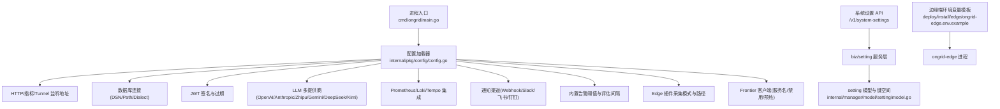
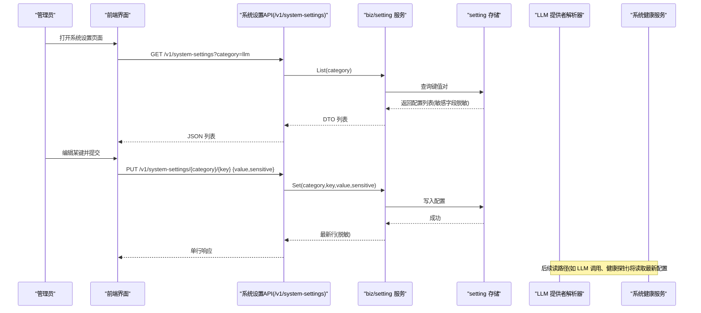
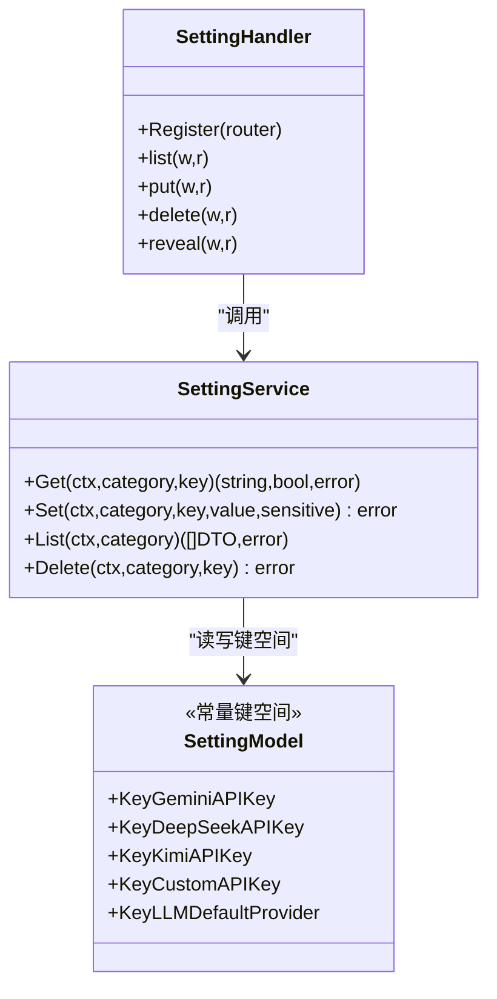
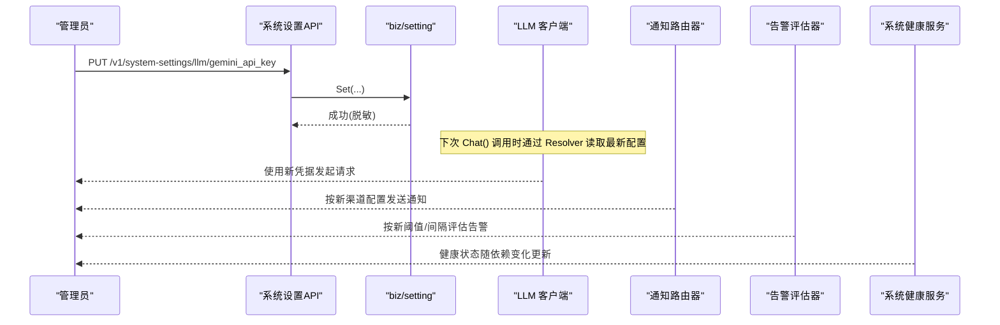
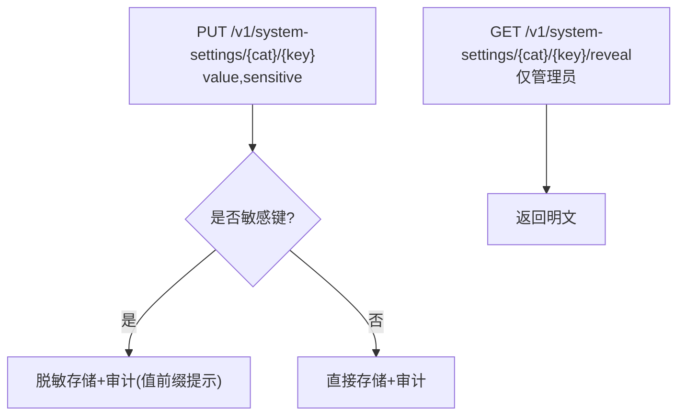
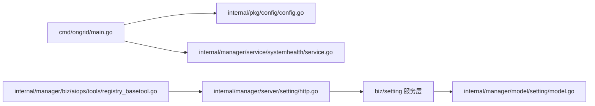

# 配置管理

<cite>
**本文引用的文件**   
- [cmd/ongrid/main.go](file://cmd/ongrid/main.go)
- [internal/pkg/config/config.go](file://internal/pkg/config/config.go)
- [deploy/install/edge/ongrid-edge.env.example](file://deploy/install/edge/ongrid-edge.env.example)
- [internal/manager/server/setting/http.go](file://internal/manager/server/setting/http.go)
- [internal/manager/model/setting/model.go](file://internal/manager/model/setting/model.go)
- [internal/manager/service/systemhealth/service.go](file://internal/manager/service/systemhealth/service.go)
- [internal/manager/biz/aiops/tools/registry_basetool.go](file://internal/manager/biz/aiops/tools/registry_basetool.go)
- [.record/2026-07-06-fix-frontierbound-startup-warmup.md](file://.record/2026-07-06-fix-frontierbound-startup-warmup.md)
- [deploy/install/systemd/README.md](file://deploy/install/systemd/README.md)
</cite>

## 目录
1. [简介](#简介)
2. [项目结构](#项目结构)
3. [核心组件](#核心组件)
4. [架构总览](#架构总览)
5. [详细组件分析](#详细组件分析)
6. [依赖关系分析](#依赖关系分析)
7. [性能与可用性考虑](#性能与可用性考虑)
8. [故障排查指南](#故障排查指南)
9. [结论](#结论)
10. [附录：API 与使用示例](#附录api-与使用示例)

## 简介
本文件系统化梳理 OnGrid 的配置管理体系，覆盖环境变量、配置文件与运行时配置的层次结构；说明加载优先级与覆盖规则（默认值、环境特定配置、用户自定义配置）；阐述运行时配置更新机制（热重载、验证与回滚策略）；解释敏感信息加密存储与访问控制（密钥管理、权限控制与审计追踪）；并提供不同部署环境的配置模板与最佳实践，以及配置管理的 API 接口和使用示例。

## 项目结构
OnGrid 的配置体系围绕“进程启动时从环境变量加载”和“运行时通过系统设置 API 持久化并热生效”两条主线展开：
- 启动期配置：由统一配置加载器从环境变量解析，提供默认值与环境适配能力。
- 运行期配置：通过系统设置 API 进行增删改查，敏感字段在 UI 中自动脱敏，管理员可单独查看明文。



图示来源
- [cmd/ongrid/main.go:195-212](file://cmd/ongrid/main.go#L195-L212)
- [internal/pkg/config/config.go:18-48](file://internal/pkg/config/config.go#L18-L48)
- [internal/manager/server/setting/http.go:1-50](file://internal/manager/server/setting/http.go#L1-L50)
- [internal/manager/model/setting/model.go:93-120](file://internal/manager/model/setting/model.go#L93-L120)
- [deploy/install/edge/ongrid-edge.env.example:1-44](file://deploy/install/edge/ongrid-edge.env.example#L1-L44)

章节来源
- [cmd/ongrid/main.go:195-212](file://cmd/ongrid/main.go#L195-L212)
- [internal/pkg/config/config.go:18-48](file://internal/pkg/config/config.go#L18-L48)
- [internal/manager/server/setting/http.go:1-50](file://internal/manager/server/setting/http.go#L1-L50)
- [internal/manager/model/setting/model.go:93-120](file://internal/manager/model/setting/model.go#L93-L120)
- [deploy/install/edge/ongrid-edge.env.example:1-44](file://deploy/install/edge/ongrid-edge.env.example#L1-L44)

## 核心组件
- 配置加载器：负责从环境变量读取所有关键配置项，提供合理的默认值，并在主进程启动时输出关键配置摘要。
- 系统设置 API：提供 /v1/system-settings 的 CRUD 能力，支持分类与键值对形式，敏感字段自动脱敏，管理员可 reveal 明文。
- 模型与键空间：定义各类运行时配置键（如各 LLM 提供商的 API Key、BaseURL、Models、Default Model 等）。
- 健康检查与探针：系统健康服务聚合多项依赖状态（DB、Prom、Grafana、Loki、Tempo、Alert、Edges、LLM 等），用于运维观测。
- 边缘端配置模板：提供 ongrid-edge 的环境变量模板，涵盖云侧连接、采集模式、插件工作目录等。

章节来源
- [internal/pkg/config/config.go:366-486](file://internal/pkg/config/config.go#L366-L486)
- [internal/manager/server/setting/http.go:40-50](file://internal/manager/server/setting/http.go#L40-L50)
- [internal/manager/model/setting/model.go:93-120](file://internal/manager/model/setting/model.go#L93-L120)
- [internal/manager/service/systemhealth/service.go:97-112](file://internal/manager/service/systemhealth/service.go#L97-L112)
- [deploy/install/edge/ongrid-edge.env.example:1-44](file://deploy/install/edge/ongrid-edge.env.example#L1-L44)

## 架构总览
OnGrid 的配置体系分为三层：
- 默认层：代码内建默认值，保证开箱即用。
- 环境层：通过环境变量覆盖默认值，支持按部署环境差异化。
- 运行期层：通过系统设置 API 持久化到数据库，支持在线修改与热生效。



图示来源
- [internal/manager/server/setting/http.go:40-50](file://internal/manager/server/setting/http.go#L40-L50)
- [internal/manager/server/setting/http.go:67-137](file://internal/manager/server/setting/http.go#L67-L137)
- [internal/manager/model/setting/model.go:93-120](file://internal/manager/model/setting/model.go#L93-L120)
- [internal/manager/service/systemhealth/service.go:97-112](file://internal/manager/service/systemhealth/service.go#L97-L112)

## 详细组件分析

### 配置加载器（环境变量 + 默认值）
- 职责：集中解析环境变量，构建统一的 Config 对象；为各子系统提供默认值与开关。
- 关键特性：
  - 支持布尔、整型、浮点、时长、CSV 等多类型解析。
  - 为 Prometheus、Grafana、Loki、Tempo、通知渠道、告警规则、Edge 插件等提供默认值。
  - 主进程启动后记录关键配置摘要，便于排障。
- 典型环境变量（节选）：
  - HTTP/Metrics/Tunnel 监听地址：ONGRID_HTTP_ADDR、ONGRID_METRICS_ADDR、ONGRID_TUNNEL_ADDR
  - 公共出口 URL：ONGRID_PUBLIC_URL
  - 数据库：ONGRID_DB_DIALECT、ONGRID_DB_DSN、ONGRID_DB_PATH
  - JWT：ONGRID_JWT_SECRET、ONGRID_JWT_ACCESS_TTL、ONGRID_JWT_REFRESH_TTL
  - LLM：各提供商 API Key/Model/BaseURL/Models/Default Provider
  - Prom：ENABLED/URL/RemoteWriteURL/QueryURL/TLSInsecure/TLSCAFile
  - Grafana：InternalRootURL、BootstrapUser/Password、TLSInsecure
  - 通知：全局 ENABLED、默认渠道、超时、Webhook/Slack/Feishu/DingTalk 通道参数
  - 告警：ENABLED、Cooldown、CPU/Mem/Disk/Load 阈值、EvaluatorInterval、EdgeOfflineThreshold、PromIngestFailLimit
  - Edge：CloudAddr、AccessKey、SecretKey、CollectorMode、ScrapeConfigFile、CollectorInterval
  - Frontier：Addr、ServiceName、Disabled、Warmup

```mermaid
flowchart TD
Start(["进程启动"]) --> LoadEnv["读取环境变量<br/>internal/pkg/config/config.go"]
LoadEnv --> ApplyDefaults["应用默认值"]
ApplyDefaults --> BuildCfg["组装 Config 对象"]
BuildCfg --> LogSummary["记录关键配置摘要"]
LogSummary --> Ready(["服务就绪"))
```

图示来源
- [internal/pkg/config/config.go:366-486](file://internal/pkg/config/config.go#L366-L486)
- [cmd/ongrid/main.go:198-212](file://cmd/ongrid/main.go#L198-L212)

章节来源
- [internal/pkg/config/config.go:366-486](file://internal/pkg/config/config.go#L366-L486)
- [cmd/ongrid/main.go:198-212](file://cmd/ongrid/main.go#L198-L212)

### 系统设置 API（运行时配置）
- 路由：
  - GET /v1/system-settings — 列出配置（支持 category 过滤）
  - PUT /v1/system-settings/{category}/{key} — 更新配置
  - DELETE /v1/system-settings/{category}/{key} — 删除配置
  - GET /v1/system-settings/{category}/{key}/reveal — 管理员查看明文
- 权限与审计：
  - 读取：任意已认证用户
  - 写入/删除/reveal：仅管理员
  - 写入操作附带审计事件（含敏感值前缀提示）
- 敏感字段策略：
  - 自动识别 *_api_key/_secret/_token/_password 后缀标记为敏感
  - 列表返回脱敏值；管理员可通过 reveal 获取明文



图示来源
- [internal/manager/server/setting/http.go:40-50](file://internal/manager/server/setting/http.go#L40-L50)
- [internal/manager/server/setting/http.go:67-137](file://internal/manager/server/setting/http.go#L67-L137)
- [internal/manager/model/setting/model.go:93-120](file://internal/manager/model/setting/model.go#L93-L120)

章节来源
- [internal/manager/server/setting/http.go:40-50](file://internal/manager/server/setting/http.go#L40-L50)
- [internal/manager/server/setting/http.go:67-137](file://internal/manager/server/setting/http.go#L67-L137)
- [internal/manager/model/setting/model.go:93-120](file://internal/manager/model/setting/model.go#L93-L120)

### 运行时配置热更新与影响面
- 热更新范围：
  - LLM 提供商凭据与模型选择：通过系统设置 API 更新后，LLM 客户端在每次 Chat 调用时通过 Resolver 读取最新配置，具备缓存 TTL，避免频繁 DB 往返。
  - 通知渠道：通知路由器根据配置动态启用/禁用渠道与默认渠道。
  - 告警评估：内置告警阈值与评估间隔可在运行期调整，影响评估周期与触发条件。
  - 健康探针：系统健康服务聚合依赖状态，随配置变化反映在健康结果中。
- 热重载边界：
  - 网络监听地址、数据库连接串等需要重启才能生效。
  - 部分组件存在启动预热窗口（例如 Frontier 客户端 Warmup），以避免注册竞态导致的服务不可用。



图示来源
- [internal/manager/server/setting/http.go:81-137](file://internal/manager/server/setting/http.go#L81-L137)
- [cmd/ongrid/main.go:401-407](file://cmd/ongrid/main.go#L401-L407)
- [internal/manager/service/systemhealth/service.go:97-112](file://internal/manager/service/systemhealth/service.go#L97-L112)

章节来源
- [cmd/ongrid/main.go:401-407](file://cmd/ongrid/main.go#L401-L407)
- [internal/manager/server/setting/http.go:81-137](file://internal/manager/server/setting/http.go#L81-L137)
- [internal/manager/service/systemhealth/service.go:97-112](file://internal/manager/service/systemhealth/service.go#L97-L112)

### 敏感信息加密存储与访问控制
- 存储与脱敏：
  - 敏感键自动标记（*_api_key/_secret/_token/_password），列表返回脱敏值。
  - 管理员可通过 reveal 接口获取明文，但不会在常规列表中暴露。
- 权限控制：
  - 读取：已认证用户
  - 写入/删除/reveal：仅管理员角色
- 审计追踪：
  - 写入与删除操作均生成审计事件，包含资源标识与值前缀提示（非完整明文）。
- 密钥管理建议：
  - 生产环境务必更换默认 JWT Secret，并通过安全方式注入环境变量或系统设置。
  - 结合 RBAC 与审计日志，限制敏感配置变更范围。



图示来源
- [internal/manager/server/setting/http.go:81-137](file://internal/manager/server/setting/http.go#L81-L137)
- [internal/manager/server/setting/http.go:139-167](file://internal/manager/server/setting/http.go#L139-L167)
- [internal/manager/server/setting/http.go:192-202](file://internal/manager/server/setting/http.go#L192-L202)

章节来源
- [internal/manager/server/setting/http.go:81-137](file://internal/manager/server/setting/http.go#L81-L137)
- [internal/manager/server/setting/http.go:139-167](file://internal/manager/server/setting/http.go#L139-L167)
- [internal/manager/server/setting/http.go:192-202](file://internal/manager/server/setting/http.go#L192-L202)

### 不同部署环境的配置模板与最佳实践
- systemd 纯原生模式：
  - Manager 二进制、Frontier、Prom/Loki/Tempo/Qdrant 均以 systemd unit 运行。
  - 配置文件位于 /etc/ongrid/，数据目录位于 /var/lib/ongrid-*，日志位于 /var/log/ongrid。
- 边缘端环境变量模板：
  - 提供 ongrid-edge 的环境变量模板，包括云侧连接、采集模式、插件工作目录、升级阶段目录等。
  - 插件运行时需设置 Edge ID，以便遥测数据带 edge_id 标签。
- 最佳实践：
  - 生产环境关闭不需要的功能开关（如 Prom、Frontier Disabled 场景）。
  - 合理设置 JWT 过期时间、告警冷却时间与评估间隔，避免噪声与资源消耗。
  - 使用独立的外部 Grafana/Prometheus/Loki/Tempo 时，确保 TLS 与 CA 配置正确。

章节来源
- [deploy/install/systemd/README.md:1-54](file://deploy/install/systemd/README.md#L1-L54)
- [deploy/install/edge/ongrid-edge.env.example:1-44](file://deploy/install/edge/ongrid-edge.env.example#L1-L44)

## 依赖关系分析
- 配置加载器被主进程在启动早期调用，随后各子系统基于 Config 初始化。
- 系统设置 API 与 biz/setting 服务层解耦，面向外部暴露稳定接口。
- 健康服务聚合多个依赖（DB、Prom、Grafana、Loki、Tempo、Alert、Edges、LLM），用于整体健康度判断。
- AI 工具注册表在协调器侧按需加载配置相关工具（如草稿与应用配置变更工具），受权限与确认流程保护。



图示来源
- [cmd/ongrid/main.go:195-212](file://cmd/ongrid/main.go#L195-L212)
- [internal/pkg/config/config.go:18-48](file://internal/pkg/config/config.go#L18-L48)
- [internal/manager/service/systemhealth/service.go:97-112](file://internal/manager/service/systemhealth/service.go#L97-L112)
- [internal/manager/server/setting/http.go:40-50](file://internal/manager/server/setting/http.go#L40-L50)
- [internal/manager/model/setting/model.go:93-120](file://internal/manager/model/setting/model.go#L93-L120)
- [internal/manager/biz/aiops/tools/registry_basetool.go:158-188](file://internal/manager/biz/aiops/tools/registry_basetool.go#L158-L188)

章节来源
- [cmd/ongrid/main.go:195-212](file://cmd/ongrid/main.go#L195-L212)
- [internal/pkg/config/config.go:18-48](file://internal/pkg/config/config.go#L18-L48)
- [internal/manager/service/systemhealth/service.go:97-112](file://internal/manager/service/systemhealth/service.go#L97-L112)
- [internal/manager/server/setting/http.go:40-50](file://internal/manager/server/setting/http.go#L40-L50)
- [internal/manager/model/setting/model.go:93-120](file://internal/manager/model/setting/model.go#L93-L120)
- [internal/manager/biz/aiops/tools/registry_basetool.go:158-188](file://internal/manager/biz/aiops/tools/registry_basetool.go#L158-L188)

## 性能与可用性考虑
- 配置加载开销极低（纯内存解析），适合进程启动阶段一次性完成。
- 系统设置 API 读取路径带有内部 TTL 缓存（例如 LLM 配置），减少 DB 压力。
- 告警评估间隔与冷却时间可调，避免高频评估与重复通知带来的存储与 CPU 压力。
- Frontier 客户端 Warmup 窗口用于缓解注册竞态，降低首次请求失败率。

章节来源
- [internal/pkg/config/config.go:366-486](file://internal/pkg/config/config.go#L366-L486)
- [cmd/ongrid/main.go:401-407](file://cmd/ongrid/main.go#L401-L407)
- [internal/pkg/config/config.go:232-257](file://internal/pkg/config/config.go#L232-L257)
- [.record/2026-07-06-fix-frontierbound-startup-warmup.md:46-68](file://.record/2026-07-06-fix-frontierbound-startup-warmup.md#L46-L68)

## 故障排查指南
- 启动失败或端口冲突：
  - 检查 HTTP/Metrics/Tunnel 监听地址是否正确，避免与其他服务冲突。
- 无法连接后端（DB/Prom/Loki/Tempo/Grafana）：
  - 核对对应 URL、TLS 与 CA 配置；必要时开启 TLSInsecure 用于自签证书测试。
- 通知未送达：
  - 确认全局通知开关与各渠道 Enabled/URL/Secret 配置；检查默认渠道列表。
- 告警异常：
  - 调整评估间隔与冷却时间；检查阈值与 Edge 离线阈值。
- Frontier 注册不稳定：
  - 适当增大 Warmup 时间，或在 e2e/staging 环境中设为 0 以快速定位问题。

章节来源
- [internal/pkg/config/config.go:366-486](file://internal/pkg/config/config.go#L366-L486)
- [.record/2026-07-06-fix-frontierbound-startup-warmup.md:46-68](file://.record/2026-07-06-fix-frontierbound-startup-warmup.md#L46-L68)

## 结论
OnGrid 的配置体系以“环境变量 + 默认值”作为启动基线，通过“系统设置 API”实现运行期可观测、可编辑、可审计的动态配置管理。敏感信息采用自动脱敏与管理员可见的 reveal 机制，配合 RBAC 与审计日志保障安全合规。针对不同部署形态提供了清晰的模板与最佳实践，帮助运维团队快速落地与稳定运行。

## 附录：API 与使用示例
- 列出系统设置（支持 category 过滤）
  - 方法：GET
  - 路径：/v1/system-settings?category=llm
  - 鉴权：已认证用户
  - 返回：items 列表（敏感字段脱敏）、total 计数
- 更新系统设置
  - 方法：PUT
  - 路径：/v1/system-settings/{category}/{key}
  - 请求体：{ value: string, sensitive?: boolean }
  - 鉴权：管理员
  - 返回：最新行（脱敏）
- 删除系统设置
  - 方法：DELETE
  - 路径：/v1/system-settings/{category}/{key}
  - 鉴权：管理员
  - 返回：204 No Content
- 查看明文（仅管理员）
  - 方法：GET
  - 路径：/v1/system-settings/{category}/{key}/reveal
  - 返回：{ value: string }

章节来源
- [internal/manager/server/setting/http.go:40-50](file://internal/manager/server/setting/http.go#L40-L50)
- [internal/manager/server/setting/http.go:67-137](file://internal/manager/server/setting/http.go#L67-L137)
- [internal/manager/server/setting/http.go:139-167](file://internal/manager/server/setting/http.go#L139-L167)