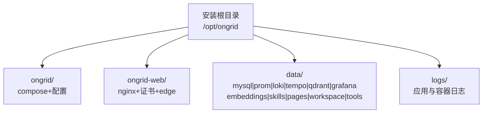
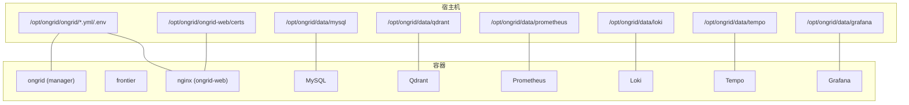
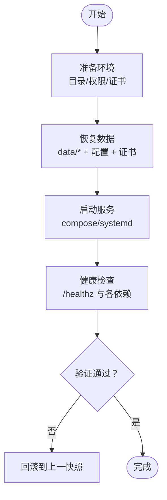
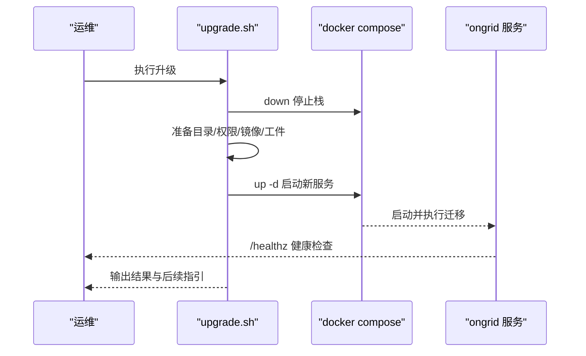
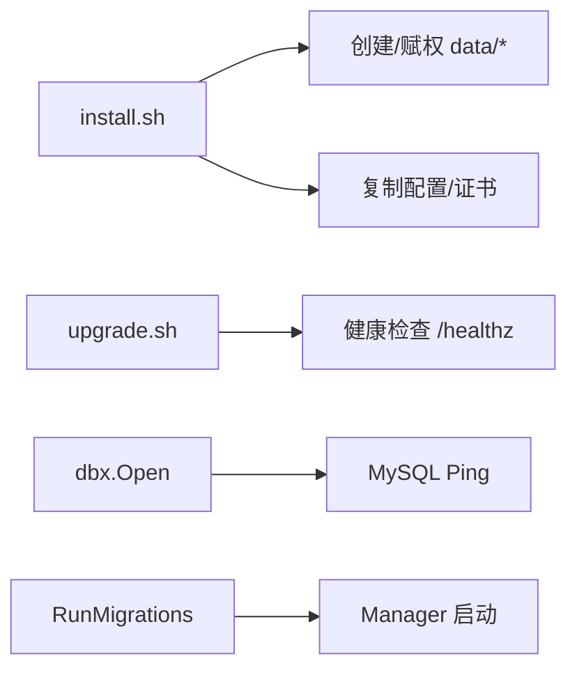

# 备份恢复

<cite>
**本文引用的文件**   
- [ROADMAP.md](file://ROADMAP.md)
- [install.sh](file://deploy/install/install.sh)
- [upgrade.sh](file://deploy/install/upgrade.sh)
- [install-systemd.sh](file://deploy/install/systemd/install-systemd.sh)
- [README.md](file://deploy/install/systemd/README.md)
- [dbx.go](file://internal/pkg/dbx/dbx.go)
- [migrate.go](file://internal/pkg/dbx/migrate.go)
- [docker-compose.yml](file://deploy/install/docker-compose.yml)
</cite>

## 目录
1. [简介](#简介)
2. [项目结构](#项目结构)
3. [核心组件](#核心组件)
4. [架构总览](#架构总览)
5. [详细组件分析](#详细组件分析)
6. [依赖关系分析](#依赖关系分析)
7. [性能与容量规划](#性能与容量规划)
8. [故障排查指南](#故障排查指南)
9. [结论](#结论)
10. [附录](#附录)

## 简介
本指南面向运维与平台工程师，提供 ongrid 的完整数据备份与恢复方案。内容覆盖：
- 数据库（MySQL、Qdrant向量库）与时序/日志/追踪存储（Prometheus、Loki、Tempo）的备份策略与操作要点
- 文件数据范围（配置、证书、运行时工件、用户数据等）
- 自动备份任务编排与调度建议
- 灾难恢复流程与业务中断最小化策略
- 版本迁移与平滑升级路径
- 备份完整性校验方法
- 异地备份与高可用设计建议

## 项目结构
ongrid 采用“单安装根目录 + 四子目录”布局，所有状态与配置集中管理，便于统一备份与恢复：
- 安装根目录（默认 /opt/ongrid）
  - ongrid/：compose 栈与配置文件（docker-compose.yml、.env、VERSION、frontier.yaml、prometheus.yml、loki-config.yaml、tempo-config.yaml、prometheus-rules.yml、grafana/、searxng/ 等）
  - ongrid-web/：nginx 输入（nginx.conf、TLS 证书、edge 静态资源）
  - data/：各有状态服务的数据卷挂载点（mysql、prometheus、loki、tempo、qdrant、grafana）以及 manager 运行时目录（embeddings、skills、pages、workspace、tools）
  - logs/：进程输出与容器日志落盘位置

图表来源
- [install.sh:559-604](file://deploy/install/install.sh#L559-L604)
- [install.sh:682-772](file://deploy/install/install.sh#L682-L772)
- [install-systemd.sh:229-234](file://deploy/install/systemd/install-systemd.sh#L229-L234)
- [README.md:17-42](file://deploy/install/systemd/README.md#L17-L42)

章节来源
- [install.sh:559-604](file://deploy/install/install.sh#L559-L604)
- [install.sh:682-772](file://deploy/install/install.sh#L682-L772)
- [install-systemd.sh:229-234](file://deploy/install/systemd/install-systemd.sh#L229-L234)
- [README.md:17-42](file://deploy/install/systemd/README.md#L17-L42)

## 核心组件
- 有状态数据存储
  - MySQL：manager 业务数据（IAM、设备、告警、工作流等）
  - Qdrant：向量检索（知识库等）
  - Prometheus：时序指标
  - Loki：日志聚合
  - Tempo：分布式追踪
  - Grafana：仪表盘与数据源配置
- 无状态或可重建组件
  - ongrid-manager、frontier、nginx/web 前端（通过 bind-mount 注入运行时工件）
- 关键目录与权限
  - data/ 下各子目录按上游镜像运行用户设置属主，确保容器写入正常
  - web/certs 存放 TLS 证书，升级不覆盖，避免中断

章节来源
- [install.sh:719-772](file://deploy/install/install.sh#L719-L772)
- [install.sh:784-800](file://deploy/install/install.sh#L784-L800)
- [install-systemd.sh:300-397](file://deploy/install/systemd/install-systemd.sh#L300-L397)

## 架构总览
下图展示 compose 模式下主要组件与数据持久化路径的关系，突出备份目标与恢复入口。

图表来源
- [docker-compose.yml](file://deploy/install/docker-compose.yml)
- [install.sh:719-772](file://deploy/install/install.sh#L719-L772)
- [install.sh:784-800](file://deploy/install/install.sh#L784-L800)

## 详细组件分析

### 数据备份策略与范围
- 数据库（MySQL）
  - 使用 mysqldump 或物理备份工具对 data/mysql 进行一致性快照；建议在低峰期执行，必要时配合只读副本或停机窗口
  - 若使用外部托管 MySQL，启用云厂商快照与跨地域复制
- 向量数据库（Qdrant）
  - 直接备份 data/qdrant 目录；注意在写放大期间尽量降低写入或短暂停止服务后快照
- 时序/日志/追踪（Prometheus/Loki/Tempo）
  - 分别备份 data/prometheus、data/loki、data/tempo；考虑保留策略与压缩归档
- 配置与证书
  - 备份 ongrid/ 下的 docker-compose.yml、.env、VERSION、frontier.yaml、prometheus.yml、loki-config.yaml、tempo-config.yaml、prometheus-rules.yml、grafana/、searxng/ 等
  - 备份 ongrid-web/certs 中的 TLS 证书与私钥
- 运行时工件与用户数据
  - embeddings、skills、pages、workspace、tools 等由 manager 写入的目录需纳入备份
- 日志
  - logs/ 作为辅助恢复与审计依据，建议长期归档

章节来源
- [install.sh:559-604](file://deploy/install/install.sh#L559-L604)
- [install.sh:719-772](file://deploy/install/install.sh#L719-L772)
- [install.sh:784-800](file://deploy/install/install.sh#L784-L800)

### 自动备份任务与调度
- 推荐方式
  - 使用系统 cron 或 systemd timer 定时触发脚本
  - 脚本职责：停止相关服务（可选）、执行一致性快照、生成校验和、上传至远端对象存储或异地磁盘
- 关键注意事项
  - 对于热备场景，优先选择支持在线快照的工具；否则建议在维护窗口内短停对应服务
  - 为每个备份生成 SHA256 并随包下发，便于后续校验
  - 保留策略：按日/周/月分层保留，结合磁盘配额与生命周期规则

[本节为通用实践说明，无需代码引用]

### 数据恢复流程（含灾难恢复与最小中断）
- 标准恢复步骤
  1) 准备新环境或原机重装，确保目录结构与权限一致
  2) 将最新备份恢复到 data/ 与 ongrid/、ongrid-web/certs 对应位置
  3) 启动 stack（compose 或 systemd），等待健康检查通过
  4) 验证关键功能（登录、查询、推送链路）
- 快速回滚
  - 若升级失败，保持 INSTALL_DIR/.env 不变，重新执行 upgrade.sh 或使用最近一次成功快照恢复
- 最小中断策略
  - 先在新节点完成恢复与预热，再切换流量（DNS/负载均衡）
  - 对 MySQL 可使用只读副本先行同步，最后切主

图表来源
- [upgrade.sh:728-780](file://deploy/install/upgrade.sh#L728-L780)
- [install.sh:719-772](file://deploy/install/install.sh#L719-L772)

章节来源
- [upgrade.sh:728-780](file://deploy/install/upgrade.sh#L728-L780)
- [install.sh:719-772](file://deploy/install/install.sh#L719-L772)

### 版本迁移与平滑升级
- 升级路径
  - 使用 upgrade.sh 原地升级，保留 .env 与数据卷；自动处理历史命名卷迁移（--migrate-volumes 或 --no-migrate-volumes）
  - 升级过程中会拉取/加载新镜像、提取运行时工件、刷新配置、重启服务并执行健康检查
- 数据库迁移
  - 启动时通过 gorm AutoMigrate 执行模型变更；迁移过程记录耗时，便于定位慢迁移
- 注意事项
  - 升级前建议全量备份；升级后核对版本与关键功能
  - 若存在旧版 named volumes，按提示迁移至 host bind mount

图表来源
- [upgrade.sh:375-389](file://deploy/install/upgrade.sh#L375-L389)
- [upgrade.sh:637-660](file://deploy/install/upgrade.sh#L637-L660)
- [upgrade.sh:728-780](file://deploy/install/upgrade.sh#L728-L780)
- [migrate.go:26-46](file://internal/pkg/dbx/migrate.go#L26-L46)

章节来源
- [upgrade.sh:375-389](file://deploy/install/upgrade.sh#L375-L389)
- [upgrade.sh:637-660](file://deploy/install/upgrade.sh#L637-L660)
- [upgrade.sh:728-780](file://deploy/install/upgrade.sh#L728-L780)
- [migrate.go:26-46](file://internal/pkg/dbx/migrate.go#L26-L46)

### 备份数据验证与完整性检查
- 文件级校验
  - 对备份包计算并保存 SHA256，恢复前比对
  - 校验 data/ 下关键目录大小与文件数量是否合理
- 服务级验证
  - 启动后访问 /healthz 确认 manager 健康
  - 针对各依赖进行连通性探测（MySQL ping、Qdrant 列表集合、PromQL/Loki/Tempo 简单查询）
- 数据库一致性
  - MySQL：mysqldump 导入后进行表行数/索引统计抽样对比
  - Qdrant：列出集合与向量维度/数量抽样对比
  - TSDB/日志/追踪：回放少量样本数据验证可读性

章节来源
- [upgrade.sh:765-780](file://deploy/install/upgrade.sh#L765-L780)
- [dbx.go:51-77](file://internal/pkg/dbx/dbx.go#L51-L77)

### 异地备份与高可用设计建议
- 异地备份
  - 使用 rsync/S3 同步 to 冷备区域；结合保留策略与加密传输
- 高可用
  - 路线图包含 Manager 快照打包、一键恢复、跨地域复制、演练模式等能力
  - 未来可引入 Active-Standby 管理器对、共享 MySQL（DRBD/托管集群）、浮动 IP、会话迁移等

章节来源
- [ROADMAP.md:316-358](file://ROADMAP.md#L316-L358)

## 依赖关系分析
- 安装与升级脚本负责：
  - 解析环境变量与布局（INSTALL_DIR、DATA_DIR、LOG_DIR、WEB_DIR、APP_DIR）
  - 创建并赋权 data/ 子目录（按上游镜像 UID）
  - 复制/刷新配置文件与证书
  - 拉起/停止服务并执行健康检查
- 数据库层：
  - dbx.Open 负责 MySQL/SQLite 连接与 Ping 探测
  - RunMigrations 顺序执行各模块迁移器，记录耗时

图表来源
- [install.sh:719-772](file://deploy/install/install.sh#L719-L772)
- [install.sh:784-800](file://deploy/install/install.sh#L784-L800)
- [upgrade.sh:765-780](file://deploy/install/upgrade.sh#L765-L780)
- [dbx.go:51-77](file://internal/pkg/dbx/dbx.go#L51-L77)
- [migrate.go:26-46](file://internal/pkg/dbx/migrate.go#L26-L46)

章节来源
- [install.sh:719-772](file://deploy/install/install.sh#L719-L772)
- [install.sh:784-800](file://deploy/install/install.sh#L784-L800)
- [upgrade.sh:765-780](file://deploy/install/upgrade.sh#L765-L780)
- [dbx.go:51-77](file://internal/pkg/dbx/dbx.go#L51-L77)
- [migrate.go:26-46](file://internal/pkg/dbx/migrate.go#L26-L46)

## 性能与容量规划
- 备份窗口
  - 大体积 TSDB（Prometheus/Loki/Tempo）与 Qdrant 建议离线快照或在低峰期执行
- I/O 与网络
  - 异地备份建议使用增量与并行传输，开启压缩与校验
- 存储分层
  - 热数据（近期备份）本地 SSD/NVMe；温/冷数据归档至对象存储或磁带库
- 监控与告警
  - 监控备份任务成功率、耗时、空间使用率与 RPO/RTO 达成情况

[本节为通用指导，无需代码引用]

## 故障排查指南
- 常见错误与定位
  - 权限问题：data/ 子目录属主与 UID 不匹配导致容器无法写入
  - 证书缺失：首次安装自动生成自签证书，生产应替换为真实证书
  - 健康检查失败：查看 ongrid 日志与依赖连通性
- 参考路径
  - 目录与权限初始化：install.sh 中 data/ 子目录创建与 chown
  - 证书生成与放置：install.sh/upgrade.sh 中证书逻辑
  - 健康检查：upgrade.sh 中对 /healthz 的轮询

章节来源
- [install.sh:719-772](file://deploy/install/install.sh#L719-L772)
- [install.sh:784-800](file://deploy/install/install.sh#L784-L800)
- [upgrade.sh:765-780](file://deploy/install/upgrade.sh#L765-L780)

## 结论
ongrid 以“单安装根 + 四子目录”的清晰布局，使备份与恢复具备强可操作性。结合脚本提供的健康检查与迁移机制，可在保证一致性的前提下实现快速恢复与平滑升级。建议在生产环境落地自动化备份、异地容灾与定期演练，持续优化 RPO/RTO。

## 附录
- systemd 模式布局与路径说明
  - 二进制、配置、状态与日志目录约定，便于在无 Docker 环境下实施备份与恢复

章节来源
- [README.md:17-42](file://deploy/install/systemd/README.md#L17-L42)
- [install-systemd.sh:229-234](file://deploy/install/systemd/install-systemd.sh#L229-L234)