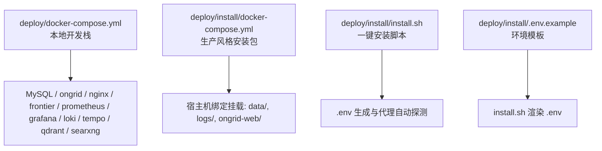
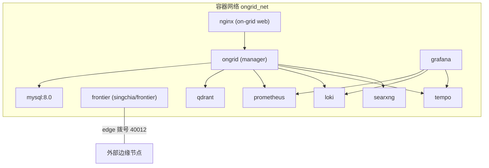
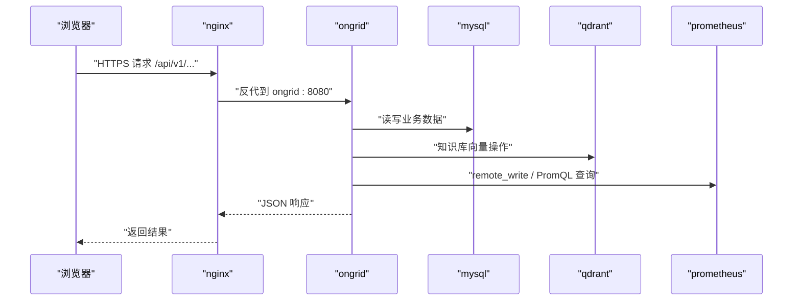

# Docker Compose部署

<cite>
**本文引用的文件列表**
- [deploy/docker-compose.yml](file://deploy/docker-compose.yml)
- [deploy/install/docker-compose.yml](file://deploy/install/docker-compose.yml)
- [deploy/install/.env.example](file://deploy/install/.env.example)
- [deploy/install/install.sh](file://deploy/install/install.sh)
- [deploy/README.md](file://deploy/README.md)
- [deploy/install/README.md](file://deploy/install/README.md)
</cite>

## 目录
1. [简介](#简介)
2. [项目结构](#项目结构)
3. [核心组件](#核心组件)
4. [架构总览](#架构总览)
5. [详细组件分析](#详细组件分析)
6. [依赖关系分析](#依赖关系分析)
7. [性能与容量规划](#性能与容量规划)
8. [常见问题排查](#常见问题排查)
9. [结论](#结论)
10. [附录：常用命令速查](#附录常用命令速查)

## 简介
本指南面向使用 Docker Compose 部署 ongrid 的运维与开发者，覆盖一键安装脚本参数、compose 配置结构、环境变量说明、数据目录规划、镜像拉取优化（含国内网络加速）、启动/停止/重启命令、服务状态与日志查看，以及常见问题的定位方法。文档同时区分“本地开发栈”和“生产风格安装包”两套 compose 文件的差异与适用场景。

## 项目结构
仓库中与 Docker Compose 部署相关的核心位置如下：
- 本地开发栈：deploy/docker-compose.yml
- 生产风格安装包：deploy/install/docker-compose.yml + deploy/install/install.sh + deploy/install/.env.example
- 配套说明：deploy/README.md、deploy/install/README.md

图示来源
- [deploy/docker-compose.yml:1-397](file://deploy/docker-compose.yml#L1-L397)
- [deploy/install/docker-compose.yml:1-610](file://deploy/install/docker-compose.yml#L1-L610)
- [deploy/install/install.sh:1-800](file://deploy/install/install.sh#L1-L800)
- [deploy/install/.env.example:1-303](file://deploy/install/.env.example#L1-L303)

章节来源
- [deploy/README.md:1-130](file://deploy/README.md#L1-L130)
- [deploy/install/README.md:1-616](file://deploy/install/README.md#L1-L616)

## 核心组件
- 管理面服务 ongrid：HTTP API、AIOps、通知、RAG/知识库、边缘升级包分发等。
- 前端与反向代理 nginx：TLS 终止、SPA 静态资源、/api 反代、/grafana 同源访问。
- 上游边车 broker frontier：边缘节点拨号接入。
- 观测与存储：MySQL（默认后端）、Prometheus（云侧 TSDB）、Loki（日志）、Tempo（链路追踪）、qdrant（向量库）、Grafana（可视化）。
- 搜索 SearXNG：web_search 技能默认后端。

章节来源
- [deploy/docker-compose.yml:13-360](file://deploy/docker-compose.yml#L13-L360)
- [deploy/install/docker-compose.yml:51-610](file://deploy/install/docker-compose.yml#L51-L610)

## 架构总览
下图展示本地开发栈与服务间依赖关系（端口仅用于开发；生产模式通过 nginx 统一入口）：

图示来源
- [deploy/docker-compose.yml:13-360](file://deploy/docker-compose.yml#L13-L360)

## 详细组件分析

### 一键安装脚本 install.sh 用法与参数
- 运行方式
  - 进入解压后的安装包目录，执行 sudo ./install.sh
  - 支持 --mode compose（默认）或 --mode systemd
- 关键参数
  - --profile monitoring：兼容旧版本保留；在 ADR-009 后 Prometheus 已为核心服务，该参数对是否拉起 prometheus 不再有效（始终启动）
  - --no-seed：跳过末尾关于管理员引导的提示
  - --force：在已有安装基础上重新安装，保留 .env 与数据卷
- 其他能力
  - 自动检测并安装 Docker（优先官方脚本，失败回退到发行版包管理器）
  - 自动探测宿主代理并写入 .env（HTTP_PROXY/HTTPS_PROXY/NO_PROXY），同时收集内部域名追加到 NO_PROXY
  - 自动生成自签 TLS 证书（若 certs 下不存在）
  - 创建统一安装目录布局（/opt/ongrid/{ongrid,ongrid-web,data,logs}）并 chown 对应 uid
  - 自动为 CN 网络配置 Docker 镜像加速器（当无法直连 Docker Hub 时）

章节来源
- [deploy/install/install.sh:355-433](file://deploy/install/install.sh#L355-L433)
- [deploy/install/install.sh:465-556](file://deploy/install/install.sh#L465-L556)
- [deploy/install/install.sh:559-800](file://deploy/install/install.sh#L559-L800)
- [deploy/install/README.md:253-260](file://deploy/install/README.md#L253-L260)

### docker-compose.yml 配置结构（本地开发 vs 生产风格）
- 本地开发栈（deploy/docker-compose.yml）
  - 使用 named volume 保存 MySQL 数据；其余服务多为临时态
  - 暴露必要端口便于本机调试（如 3306、9090、3000、40012）
  - 提供 SQLite 切换注释示例，适合单机快速体验
- 生产风格安装包（deploy/install/docker-compose.yml）
  - 所有有状态服务均 bind-mount 到宿主机 ${ONGRID_DATA_DIR}/<service>
  - 不向 host 暴露数据库与内部服务端口（除 nginx 对外 443/80 与 metrics 9100）
  - 通过 .env 注入全部敏感项（密码、密钥、URL 等）
  - 内置全局代理 anchor，统一注入 HTTP(S)_PROXY 与 NO_PROXY 到需要外联的服务

章节来源
- [deploy/docker-compose.yml:1-397](file://deploy/docker-compose.yml#L1-L397)
- [deploy/install/docker-compose.yml:1-610](file://deploy/install/docker-compose.yml#L1-L610)

### 服务定义与依赖
- ongrid
  - 依赖 mysql 健康检查通过后启动；依赖 qdrant 已启动
  - 暴露 metrics 端口 9100（生产模式仅内网可达）
  - 挂载 edge-bundles、embedding cache、skills、workspace、tools、pages、app snapshot 等
- nginx
  - 依赖 ongrid 已启动
  - 挂载 nginx.conf、certs、edge 静态资源、SPA html
  - 对外暴露 HTTPS 与可选 HTTP→HTTPS 重定向端口
- frontier
  - 暴露 edge 拨号端口 40012（服务内部 40011 不对外）
- prometheus
  - 接收 remote_write、提供 PromQL 查询（供 AI 工具使用）
  - 通过 extra_hosts 解析 host.docker.internal（兼容不同 Docker 版本）
- loki/tempo/qdrant/grafana/searxng
  - 均为内部服务，持久化数据 bind-mount 到宿主机

章节来源
- [deploy/docker-compose.yml:39-360](file://deploy/docker-compose.yml#L39-L360)
- [deploy/install/docker-compose.yml:83-610](file://deploy/install/docker-compose.yml#L83-L610)

### 网络配置
- 自定义 bridge 网络 ongrid_net，容器间通过服务名互通
- 生产模式仅暴露必要端口（nginx 443/80、metrics 9100、tunnel 40012），其余保持内网隔离

章节来源
- [deploy/docker-compose.yml:394-397](file://deploy/docker-compose.yml#L394-L397)
- [deploy/install/docker-compose.yml:379-387](file://deploy/install/docker-compose.yml#L379-L387)

### 数据卷与持久化策略
- 本地开发栈
  - MySQL 使用 named volume mysql_data
- 生产风格安装包
  - 所有有状态服务数据 bind-mount 到 ${ONGRID_DATA_DIR}/<service>
  - manager 运行时目录（embeddings/skills/pages/workspace/tools）也 bind-mount 到 data 子目录
  - 安装脚本负责 mkdir + chown 到各服务的运行用户 uid，避免首次启动权限错误

章节来源
- [deploy/docker-compose.yml:26-37](file://deploy/docker-compose.yml#L26-L37)
- [deploy/install/docker-compose.yml:64-76](file://deploy/install/docker-compose.yml#L64-L76)
- [deploy/install/docker-compose.yml:259-312](file://deploy/install/docker-compose.yml#L259-L312)
- [deploy/install/install.sh:719-772](file://deploy/install/install.sh#L719-L772)

### .env 环境配置要点
- 路径与端口
  - ONGRID_INSTALL_DIR、ONGRID_WEB_DIR、ONGRID_DATA_DIR、ONGRID_LOG_DIR、ONGRID_APP_DIR
  - ONGRID_HTTP_PORT、ONGRID_HTTP_REDIRECT_PORT、ONGRID_TUNNEL_PORT、ONGRID_METRICS_PORT
- 数据库
  - MYSQL_ROOT_PASSWORD、MYSQL_PASSWORD（生产必须修改默认值）
- Grafana 初始化
  - GRAFANA_ADMIN_USER、GRAFANA_ADMIN_PASSWORD（用于首次 SA token 引导）
- JWT 与管理员种子
  - ONGRID_JWT_SECRET（空则自动生成）、ONGRID_ADMIN_EMAIL、ONGRID_ADMIN_PASSWORD
- 公网 URL
  - ONGRID_PUBLIC_URL（下发给边缘的数据平面端点）
- LLM 提供商
  - OPENAI_API_KEY/MODEL/BASE_URL
  - ZHIPU/ANTHROPIC/GEMINI/DEEPSEEK/KIMI 等键值与模型
  - LLM_DEFAULT_PROVIDER（选择默认路由）
- RAG/知识库
  - ONGRID_QDRANT_URL、EMBEDDING_PROVIDER（local/openai）、MODEL/DIM/BASE_URL/API_KEY/CACHE_DIR
- 云侧 Prometheus
  - PROM_ENABLED/PROM_URL/PROM_REMOTE_WRITE_URL/PROM_QUERY_URL/TLS_INSECURE/TLS_CA_FILE
- 告警阈值与通知通道
  - ALERT_*、NOTIFY_*（log/webhook/slack/feishu/dingtalk）
- 容器出站代理
  - ONGRID_HTTP_PROXY/HTTPS_PROXY/NO_PROXY（install.sh 自动探测并写入）

章节来源
- [deploy/install/.env.example:1-303](file://deploy/install/.env.example#L1-L303)
- [deploy/install/docker-compose.yml:90-254](file://deploy/install/docker-compose.yml#L90-L254)

### 代理设置与 NO_PROXY 自动收集
- 自动透传
  - install.sh 从当前 shell 环境与 /etc/environment 读取 HTTP(S)_PROXY/NO_PROXY，写入 .env 的 ONGRID_*_PROXY 变量
  - 仅 ongrid 与 searxng 两个会外联的服务注入代理
- 内部域名 NO_PROXY 自动收集
  - 从 $ONGRID_NO_PROXY_EXTRA、/etc/hosts、/etc/resolv.conf search/domain、hostname/FQDN 合并去重
  - compose 默认 NO_PROXY 已包含所有 compose 服务名与 k8s 风格域后缀

章节来源
- [deploy/install/install.sh:125-297](file://deploy/install/install.sh#L125-L297)
- [deploy/install/docker-compose.yml:38-49](file://deploy/install/docker-compose.yml#L38-L49)

### 数据目录规划与权限
- 统一父目录 /opt/ongrid（可被 ONGRID_INSTALL_DIR 整体迁移）
  - ongrid/：compose 根、.env、VERSION、配置文件
  - ongrid-web/：nginx 输入（nginx.conf、certs、edge）
  - data/：各组件状态（mysql/prom/loki/tempo/qdrant/grafana/embeddings/skills/pages/workspace/tools）
  - logs/：manager 进程 stdout
- 权限
  - 安装脚本按各服务运行 uid 进行 chown（如 mysql:999、prometheus:65534、loki/tempo:10001、grafana:472、manager:65532）
  - 确保首次启动无 “permission denied”

章节来源
- [deploy/install/.env.example:10-76](file://deploy/install/.env.example#L10-L76)
- [deploy/install/install.sh:559-772](file://deploy/install/install.sh#L559-L772)

### 容器镜像拉取优化（国内网络）
- 自动检测 Docker Hub 连通性，不可达时写入 /etc/docker/daemon.json 并添加多个国内镜像源，然后重启 docker 守护进程
- 若已存在 registry-mirrors 配置，则不会覆盖
- 也可手动编辑 daemon.json 配置镜像加速地址

章节来源
- [deploy/install/install.sh:522-556](file://deploy/install/install.sh#L522-L556)

### 启动、停止、重启命令
- 本地开发栈
  - 启动：docker compose -f deploy/docker-compose.yml up -d
  - 停止：docker compose -f deploy/docker-compose.yml down
  - 指定服务：docker compose -f deploy/docker-compose.yml up -d ongrid prometheus
- 生产风格安装包
  - 启动：cd /opt/ongrid && sudo docker compose --env-file .env up -d
  - 停止：cd /opt/ongrid && sudo docker compose --env-file .env down
  - 重启单服务：sudo docker compose --env-file .env restart ongrid

章节来源
- [deploy/README.md:14-22](file://deploy/README.md#L14-L22)
- [deploy/install/README.md:212-252](file://deploy/install/README.md#L212-L252)

### 查看服务状态与日志
- 服务状态
  - cd /opt/ongrid && sudo docker compose --env-file .env ps
- 健康检查
  - curl -kfsS https://localhost:${ONGRID_HTTP_PORT}/healthz
- 容器日志
  - sudo docker logs --tail=200 ongrid
  - sudo docker logs --tail=200 ongrid-prometheus
- 内部服务验证
  - sudo docker exec ongrid-prometheus wget -qO- http://localhost:9090/-/ready

章节来源
- [deploy/install/README.md:564-576](file://deploy/install/README.md#L564-L576)

## 依赖关系分析
- ongrid 依赖
  - MySQL（健康检查后才连接）
  - qdrant（知识库向量检索）
  - Prometheus（remote_write 与 query_promql）
  - Loki/Tempo（日志/链路，通过 nginx 反代）
  - Grafana（可视化和仪表盘）
  - SearXNG（web_search 技能）
- nginx 依赖 ongrid（反代 /api）
- prometheus 通过 extra_hosts 解析 host.docker.internal（兼容 Linux 上 host-gateway）

图示来源
- [deploy/install/docker-compose.yml:83-112](file://deploy/install/docker-compose.yml#L83-L112)
- [deploy/install/docker-compose.yml:339-387](file://deploy/install/docker-compose.yml#L339-L387)

章节来源
- [deploy/install/docker-compose.yml:83-112](file://deploy/install/docker-compose.yml#L83-L112)
- [deploy/install/docker-compose.yml:339-387](file://deploy/install/docker-compose.yml#L339-L387)

## 性能与容量规划
- Prometheus 保留策略：时间 90 天、大小 20GB（可通过 compose 参数调整）
- 磁盘建议
  - data/mysql、data/prometheus 走高性能盘（SSD/NVMe）
  - data/loki、data/tempo 走大容量盘
- 内存与 CPU
  - 最低 2 GB 内存、10 GB 可用磁盘（参考安装要求）
- 网络
  - 仅暴露必要端口；其余服务保持内网隔离

章节来源
- [deploy/install/docker-compose.yml:401-434](file://deploy/install/docker-compose.yml#L401-L434)
- [deploy/install/README.md:384-407](file://deploy/install/README.md#L384-L407)

## 常见问题排查
- 端口占用
  - 现象：bind: address already in use
  - 处理：修改 .env 中相关端口（HTTP/REDIRECT/TUNNEL/METRICS），再 up -d
- host-gateway 不支持
  - 现象：invalid IP address in add-host: "host-gateway"
  - 处理：install.sh 会自动写入桥网关 IP；或手动设置 ONGRID_HOST_GATEWAY=<IP>
- MySQL healthcheck 超时
  - 现象：冷启动慢导致 ongrid 等待过久
  - 处理：观察 ongrid-mysql 日志；必要时延长 start_period 或扩容资源
- /healthz 不通
  - 现象：JWT 未设置或 DB_DSN 错误
  - 处理：检查 .env 中 JWT_SECRET 与数据库连接串
- AI Chat 接口 500
  - 现象：OPENAI_API_KEY 未配置
  - 处理：填写 key 或不调用 chat 接口
- Edge 连不上
  - 现象：i/o timeout
  - 处理：检查云端防火墙放行 40012；edge 侧 journalctl 查看拨号日志

章节来源
- [deploy/install/README.md:564-578](file://deploy/install/README.md#L564-L578)

## 结论
- 本地开发推荐使用 deploy/docker-compose.yml，快速拉起全栈；生产环境建议使用 deploy/install 下的安装脚本与 compose，结合 .env 集中管理配置与数据持久化。
- 通过 install.sh 的一键安装与自动代理/镜像加速能力，显著降低部署门槛；通过统一的目录结构与权限管理，提升可维护性与可移植性。
- 在生产环境中，建议将 ongrid 指向已有的观测栈（Prometheus/Loki/Tempo/Grafana/qdrant），减少重复运维负担。

## 附录：常用命令速查
- 本地开发
  - make compose-up / make compose-down（见 README）
  - docker compose -f deploy/docker-compose.yml up -d
- 生产风格
  - cd /opt/ongrid && sudo docker compose --env-file .env up -d
  - sudo docker compose --env-file .env ps
  - sudo docker logs --tail=200 ongrid
  - curl -kfsS https://localhost:${ONGRID_HTTP_PORT}/healthz

章节来源
- [deploy/README.md:14-22](file://deploy/README.md#L14-L22)
- [deploy/install/README.md:564-576](file://deploy/install/README.md#L564-L576)