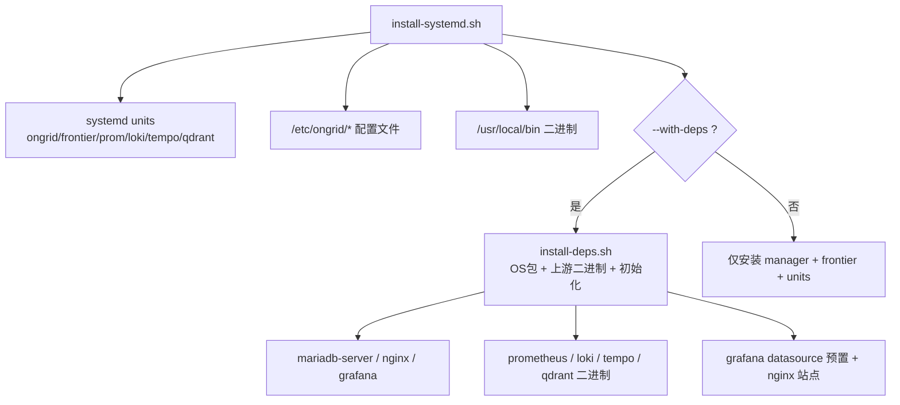
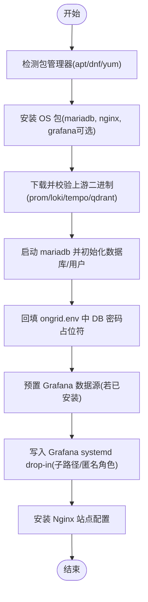
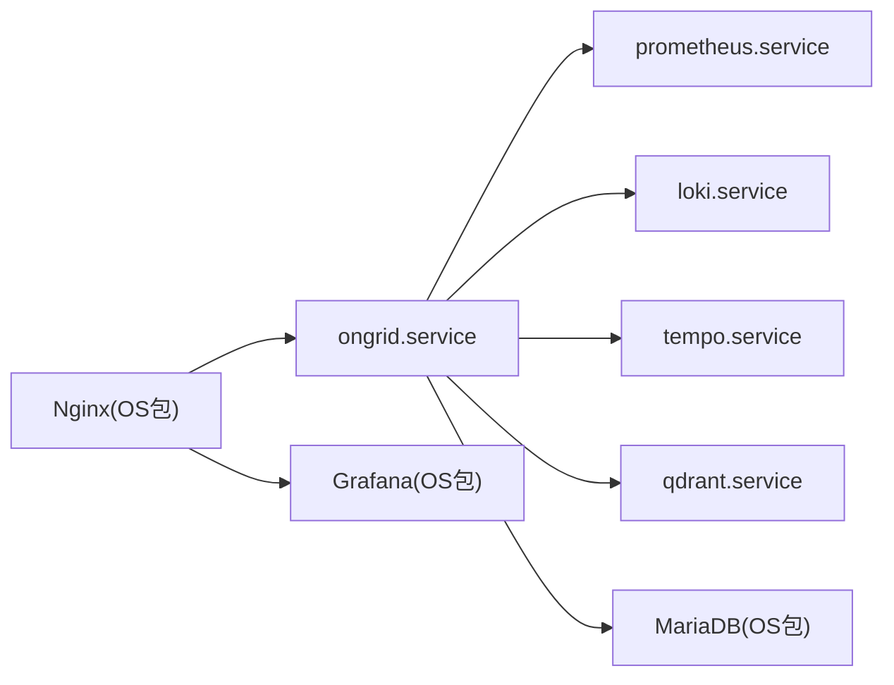

# Systemd原生部署

<cite>
**本文引用的文件**
- [install-systemd.sh](file://deploy/install/systemd/install-systemd.sh)
- [install-deps.sh](file://deploy/install/systemd/install-deps.sh)
- [README.md](file://deploy/install/systemd/README.md)
- [uninstall-systemd.sh](file://deploy/install/systemd/uninstall-systemd.sh)
- [ongrid.service](file://deploy/install/systemd/ongrid.service)
- [ongrid-frontier.service](file://deploy/install/systemd/ongrid-frontier.service)
- [prometheus.service](file://deploy/install/systemd/prometheus.service)
- [loki.service](file://deploy/install/systemd/loki.service)
- [tempo.service](file://deploy/install/systemd/tempo.service)
- [qdrant.service](file://deploy/install/systemd/qdrant.service)
- [nginx-ongrid.conf](file://deploy/install/systemd/nginx-ongrid.conf)
</cite>

## 目录
1. [简介](#简介)
2. [项目结构](#项目结构)
3. [核心组件](#核心组件)
4. [架构总览](#架构总览)
5. [详细组件分析](#详细组件分析)
6. [依赖关系分析](#依赖关系分析)
7. [性能与资源要求](#性能与资源要求)
8. [故障排查与日志](#故障排查与日志)
9. [升级与回滚](#升级与回滚)
10. [结论](#结论)

## 简介
本指南面向需要在无容器环境下使用 systemd 原生方式部署 ongrid 的运维人员。内容覆盖：
- install-systemd.sh 脚本用法与参数，特别是 --with-deps 的作用
- 各 systemd 服务（ongrid、frontier、prometheus、loki、tempo、qdrant）的职责与配置要点
- 依赖组件自动安装流程（MariaDB、Nginx、Grafana 等）
- 配置文件位置与修改方法
- 服务管理命令（启动、停止、重启、查看状态）
- 日志查看方法与常见故障定位技巧
- 系统资源要求与调优建议
- 升级与回滚操作步骤

## 项目结构
systemd 模式的核心安装与卸载脚本位于 deploy/install/systemd 目录，包含：
- 主安装脚本：install-systemd.sh
- 依赖安装脚本：install-deps.sh
- 卸载脚本：uninstall-systemd.sh
- 六个 systemd unit 文件：ongrid.service、ongrid-frontier.service、prometheus.service、loki.service、tempo.service、qdrant.service
- Nginx 站点模板：nginx-ongrid.conf
- 说明文档：README.md



图表来源
- [install-systemd.sh:437-440](file://deploy/install/systemd/install-systemd.sh#L437-L440)
- [install-deps.sh:171-242](file://deploy/install/systemd/install-deps.sh#L171-L242)
- [install-deps.sh:305-350](file://deploy/install/systemd/install-deps.sh#L305-L350)
- [install-deps.sh:427-480](file://deploy/install/systemd/install-deps.sh#L427-L480)

章节来源
- [README.md:17-42](file://deploy/install/systemd/README.md#L17-L42)
- [install-systemd.sh:18-21](file://deploy/install/systemd/install-systemd.sh#L18-L21)

## 核心组件
- ongrid.service：AIOps 管理器，提供 HTTP API、SSE、UI 静态资源代理等能力
- ongrid-frontier.service：边缘隧道复用器，负责与边缘节点建立并维护长连接
- prometheus.service：指标采集与存储（TSDB），暴露远程写入接收端点
- loki.service：日志聚合与查询后端
- tempo.service：分布式链路追踪存储
- qdrant.service：向量数据库，用于 RAG 场景的语义检索

这些组件以独立的 systemd 单元运行，各自拥有独立用户与数据目录，遵循最小权限原则。

章节来源
- [ongrid.service:1-75](file://deploy/install/systemd/ongrid.service#L1-L75)
- [ongrid-frontier.service:1-51](file://deploy/install/systemd/ongrid-frontier.service#L1-L51)
- [prometheus.service:1-38](file://deploy/install/systemd/prometheus.service#L1-L38)
- [loki.service:1-32](file://deploy/install/systemd/loki.service#L1-L32)
- [tempo.service:1-32](file://deploy/install/systemd/tempo.service#L1-L32)
- [qdrant.service:1-37](file://deploy/install/systemd/qdrant.service#L1-L37)

## 架构总览
systemd 模式下，manager 通过环境变量与本地依赖通信；Nginx 作为反向代理对外提供 HTTPS 入口，并将 /grafana 子路径转发到 Grafana。

```mermaid
graph TB
subgraph "外部访问"
Client["浏览器/客户端"]
Nginx["Nginx (443/80)"]
end
subgraph "应用层"
Manager["ongrid.manager (:8080)")
Frontier["ongrid-frontier (:40011/:40012)"]
Grafana["Grafana (:3000)"]
end
subgraph "可观测性栈"
Prom["Prometheus (:9090)"]
Loki["Loki (:3100)"]
Tempo["Tempo (:3200)"]
Qdrant["Qdrant (:6333/:6334)"]
end
subgraph "数据存储"
MariaDB["MariaDB (3306)"]
end
Client --> Nginx
Nginx --> Manager
Nginx --> Grafana
Manager --> Prom
Manager --> Loki
Manager --> Tempo
Manager --> Qdrant
Manager --> MariaDB
Frontier --> Manager
```

图表来源
- [nginx-ongrid.conf:9-52](file://deploy/install/systemd/nginx-ongrid.conf#L9-L52)
- [ongrid.service:18-21](file://deploy/install/systemd/ongrid.service#L18-L21)
- [prometheus.service:11-17](file://deploy/install/systemd/prometheus.service#L11-L17)
- [loki.service:11-12](file://deploy/install/systemd/loki.service#L11-L12)
- [tempo.service:11-12](file://deploy/install/systemd/tempo.service#L11-L12)
- [qdrant.service:11-17](file://deploy/install/systemd/qdrant.service#L11-L17)

## 详细组件分析

### install-systemd.sh 使用方法与参数
- 基本用法
  - 需要 root 执行
  - 默认将 manager 与 frontier 二进制安装至 PREFIX_BIN（默认 /usr/local/bin），并生成 systemd 单元与配置文件
- 关键参数
  - --with-deps：在首次安装时同时调用 install-deps.sh，完成 OS 包（mariadb-server、nginx、grafana）、上游二进制（prometheus、loki、tempo、qdrant）下载与校验、MariaDB 初始化、Grafana 数据源预置、Nginx 站点配置等
  - -h/--help：打印帮助信息
- 安装布局与环境变量
  - 支持两种布局：FHS 默认（/usr/local）与折叠式（/opt/ongrid）
  - 可通过 ONGRID_INSTALL_PREFIX/BIN/ETC/STATE/LOG 等环境变量重定向安装路径
- 代理与 no_proxy 自动探测
  - 自动从当前 shell 环境与 /etc/environment 读取 http_proxy/https_proxy/no_proxy
  - 自动收集内部域名（/etc/hosts、resolv.conf search/domain、hostname/FQDN、ONGRID_NO_PROXY_EXTRA）并合并为 NO_PROXY
  - 首次安装时将上述值内联写入 /etc/ongrid/ongrid.env，后续可通过 systemctl edit 覆盖
- 前置依赖检查
  - 若未找到 prom/loki/tempo/qdrant 二进制，会给出明确提示并阻止半可用状态
- 嵌入模型与缓存
  - 若 tarball 包含 embeddings，则复制到 STATE_DIR/embeddings，供本地 ONNX 嵌入器使用

章节来源
- [install-systemd.sh:43-67](file://deploy/install/systemd/install-systemd.sh#L43-L67)
- [install-systemd.sh:89-101](file://deploy/install/systemd/install-systemd.sh#L89-L101)
- [install-systemd.sh:112-203](file://deploy/install/systemd/install-systemd.sh#L112-L203)
- [install-systemd.sh:258-274](file://deploy/install/systemd/install-systemd.sh#L258-L274)
- [install-systemd.sh:336-397](file://deploy/install/systemd/install-systemd.sh#L336-L397)
- [install-systemd.sh:405-419](file://deploy/install/systemd/install-systemd.sh#L405-L419)

### install-deps.sh 依赖自动安装流程
- 功能职责
  - 安装 OS 包：mariadb-server、nginx、grafana（可选跳过）
  - 下载并校验上游二进制：prometheus、loki、tempo、qdrant（支持离线 bundle 优先）
  - 初始化 MariaDB 数据库与用户，自动回填 ongrid.env 中的 DSN 密码占位符
  - 预置 Grafana 数据源（当 grafana 已安装）
  - 写入 Grafana systemd drop-in（子路径、匿名角色等）
  - 安装 Nginx 站点配置（/etc/nginx/conf.d/ongrid.conf）
- 关键选项
  - --skip-grafana：跳过 Grafana 仓库添加与安装（适用于网络受限或计划稍后安装）
  - --apt-timeout <秒>：限制 apt/dnf 安装超时时间
  - --gh-proxy <前缀>：为 github.com 下载 URL 添加代理前缀（如 ghproxy.com）
- 版本与校验
  - 固定版本与 sha256 校验，确保一致性与安全
- 架构适配
  - 自动识别 x86_64/amd64 与 aarch64/arm64，选择对应资产
- 本地嵌入器运行时库
  - 若 tarball 包含 libonnxruntime.so，则安装至 /usr/lib 并创建符号链接，启用本地嵌入器



图表来源
- [install-deps.sh:171-242](file://deploy/install/systemd/install-deps.sh#L171-L242)
- [install-deps.sh:305-350](file://deploy/install/systemd/install-deps.sh#L305-L350)
- [install-deps.sh:378-418](file://deploy/install/systemd/install-deps.sh#L378-L418)
- [install-deps.sh:427-480](file://deploy/install/systemd/install-deps.sh#L427-L480)

章节来源
- [install-deps.sh:43-77](file://deploy/install/systemd/install-deps.sh#L43-L77)
- [install-deps.sh:97-138](file://deploy/install/systemd/install-deps.sh#L97-L138)
- [install-deps.sh:247-281](file://deploy/install/systemd/install-deps.sh#L247-L281)
- [install-deps.sh:352-373](file://deploy/install/systemd/install-deps.sh#L352-L373)

### systemd 服务详解与配置要点

#### ongrid.service（管理器）
- 作用：AIOps 管理器，HTTP API、SSE、UI 资源、工作进程调度
- 关键配置
  - 运行用户：ongrid
  - 环境变量文件：/etc/ongrid/ongrid.env
  - 工作目录：/var/lib/ongrid
  - 监听端口：默认 8080（可通过环境变量调整）
  - 安全隔离：ProtectSystem=true、PrivateTmp=true、Restrict* 等
  - 资源限制：LimitNOFILE=65536、MemoryMax=4G、CPUQuota=400%
  - 本地嵌入器：ONNX_PATH=/usr/lib/libonnxruntime.so
- 依赖顺序：After/Wants 包括 network-online.target 与各依赖服务

章节来源
- [ongrid.service:1-75](file://deploy/install/systemd/ongrid.service#L1-L75)

#### ongrid-frontier.service（边缘隧道复用器）
- 作用：与边缘节点建立并维护长连接，转发控制面流量
- 关键配置
  - 运行用户：ongrid
  - 配置文件：/etc/ongrid/frontier.yaml
  - 工作目录：/var/lib/ongrid
  - 资源限制：LimitNOFILE=65536、MemoryMax=2G、CPUQuota=200%

章节来源
- [ongrid-frontier.service:1-51](file://deploy/install/systemd/ongrid-frontier.service#L1-L51)

#### prometheus.service（指标存储）
- 作用：指标 TSDB，开启远程写入接收端点与生命周期接口
- 关键配置
  - 运行用户：ongrid-prometheus
  - 配置文件：/etc/ongrid/prometheus/prometheus.yml
  - 数据目录：/var/lib/ongrid-prometheus
  - 监听地址：127.0.0.1:9090
  - 保留策略：--storage.tsdb.retention.time=15d

章节来源
- [prometheus.service:1-38](file://deploy/install/systemd/prometheus.service#L1-L38)

#### loki.service（日志存储）
- 作用：日志聚合与查询后端
- 关键配置
  - 运行用户：ongrid-loki
  - 配置文件：/etc/ongrid/loki-config.yaml
  - 数据目录：/var/lib/ongrid-loki

章节来源
- [loki.service:1-32](file://deploy/install/systemd/loki.service#L1-L32)

#### tempo.service（链路追踪存储）
- 作用：分布式链路追踪存储
- 关键配置
  - 运行用户：ongrid-tempo
  - 配置文件：/etc/ongrid/tempo-config.yaml
  - 数据目录：/var/lib/ongrid-tempo

章节来源
- [tempo.service:1-32](file://deploy/install/systemd/tempo.service#L1-L32)

#### qdrant.service（向量数据库）
- 作用：RAG 场景的向量检索
- 关键配置
  - 运行用户：ongrid-qdrant
  - 环境变量：HTTP_PORT=6333、GRPC_PORT=6334、STORAGE_PATH=/var/lib/ongrid-qdrant/storage、SNAPSHOTS_PATH=/var/lib/ongrid-qdrant/snapshots
  - 工作目录：/var/lib/ongrid-qdrant

章节来源
- [qdrant.service:1-37](file://deploy/install/systemd/qdrant.service#L1-L37)

#### Nginx 站点配置（nginx-ongrid.conf）
- 作用：对外提供 HTTPS 入口，反代 ongrid 与 Grafana
- 关键点
  - 监听 443 SSL，启用 HTTP/2
  - / 反代 to ongrid :8080，关闭缓冲以支持 SSE/流式响应
  - /grafana/ 反代 to Grafana :3000，需配合 Grafana 子路径设置
  - 80 端口重定向到 https

章节来源
- [nginx-ongrid.conf:1-60](file://deploy/install/systemd/nginx-ongrid.conf#L1-L60)

## 依赖关系分析
- 启动顺序
  - ongrid.service 显式 After/Wants 依赖 network-online.target 与各依赖服务，保证正常启动顺序与弱依赖（Wants）行为
- 数据与配置隔离
  - 每个服务使用独立用户与 StateDirectory= 映射的数据目录，避免越权访问
- 外部依赖
  - MariaDB：由 install-deps.sh 安装并初始化
  - Nginx：由 install-deps.sh 安装并写入站点配置
  - Grafana：可选安装，提供可视化仪表盘与数据源



图表来源
- [ongrid.service:9-10](file://deploy/install/systemd/ongrid.service#L9-L10)
- [install-deps.sh:171-242](file://deploy/install/systemd/install-deps.sh#L171-L242)

章节来源
- [ongrid.service:9-10](file://deploy/install/systemd/ongrid.service#L9-L10)
- [install-deps.sh:171-242](file://deploy/install/systemd/install-deps.sh#L171-L242)

## 性能与资源要求
- 资源限制（示例）
  - ongrid：LimitNOFILE=65536、MemoryMax=4G、CPUQuota=400%
  - ongrid-frontier：LimitNOFILE=65536、MemoryMax=2G、CPUQuota=200%
  - 其他依赖：LimitNOFILE=65536
- 建议
  - 根据实际负载调整 MemoryMax/CPUQuota
  - 合理设置 Prometheus 保留周期（默认 15d）
  - 确保磁盘空间满足 TSDB/日志/追踪/向量数据增长需求
  - 在高并发场景下关注 LimitNOFILE 与内核文件描述符上限

章节来源
- [ongrid.service:61-64](file://deploy/install/systemd/ongrid.service#L61-L64)
- [ongrid-frontier.service:41-44](file://deploy/install/systemd/ongrid-frontier.service#L41-L44)
- [prometheus.service:34](file://deploy/install/systemd/prometheus.service#L34)
- [prometheus.service:14](file://deploy/install/systemd/prometheus.service#L14)

## 故障排查与日志
- 查看服务状态
  - systemctl status ongrid
  - systemctl status ongrid-frontier
  - systemctl status prometheus
  - systemctl status loki
  - systemctl status tempo
  - systemctl status qdrant
- 查看实时日志
  - journalctl -u ongrid -f
  - journalctl -u ongrid-frontier -f
  - journalctl -u prometheus -f
  - journalctl -u loki -f
  - journalctl -u tempo -f
  - journalctl -u qdrant -f
- 常见问题定位
  - 依赖缺失：install-systemd.sh 会在缺少 prom/loki/tempo/qdrant 二进制时给出警告，需先安装
  - 数据库未初始化：install-deps.sh 会自动创建数据库与用户并回填 ongrid.env 的 DSN 密码占位符
  - Grafana 子路径问题：install-deps.sh 会写入 Grafana systemd drop-in 以启用子路径与匿名 Editor 角色
  - Nginx 证书与 server_name：按 nginx-ongrid.conf 注释指引替换证书并编辑 server_name
  - 代理与 no_proxy：首次安装自动探测并写入 ongrid.env，必要时通过 systemctl edit ongrid 覆盖

章节来源
- [install-systemd.sh:258-274](file://deploy/install/systemd/install-systemd.sh#L258-L274)
- [install-deps.sh:378-418](file://deploy/install/systemd/install-deps.sh#L378-L418)
- [install-deps.sh:453-471](file://deploy/install/systemd/install-deps.sh#L453-L471)
- [nginx-ongrid.conf:1-6](file://deploy/install/systemd/nginx-ongrid.conf#L1-L6)

## 升级与回滚
- 升级步骤（推荐）
  - 备份重要数据（/etc/ongrid、/var/lib/ongrid、各依赖 StateDirectory= 目录）
  - 重新执行 install-systemd.sh（会保留已有 env 与配置）
  - 若使用 --with-deps，将更新 OS 包与上游二进制（带版本与 sha256 校验）
  - 重启相关服务：sudo systemctl restart ongrid ongrid-frontier prometheus loki tempo qdrant
- 回滚步骤
  - 停止并移除单元：sudo bash uninstall-systemd.sh
  - 如需彻底清理数据与用户：sudo bash uninstall-systemd.sh --purge [--yes]
  - 恢复备份的配置与数据目录
  - 重新安装旧版本二进制与配置

章节来源
- [install-systemd.sh:437-440](file://deploy/install/systemd/install-systemd.sh#L437-L440)
- [uninstall-systemd.sh:26-54](file://deploy/install/systemd/uninstall-systemd.sh#L26-L54)
- [uninstall-systemd.sh:160-213](file://deploy/install/systemd/uninstall-systemd.sh#L160-L213)

## 结论
systemd 原生部署提供了对资源、安全与启动顺序的细粒度控制，适合无法或不愿运行容器的生产环境。通过 install-systemd.sh 与 install-deps.sh 的配合，可实现一键化安装与自动化依赖管理；借助 systemd 的安全隔离与资源限制，可在保障稳定性的同时获得良好的性能表现。建议在上线前充分审阅 ongrid.env 与 Grafana/Nginx 配置，并根据业务规模进行资源调优。