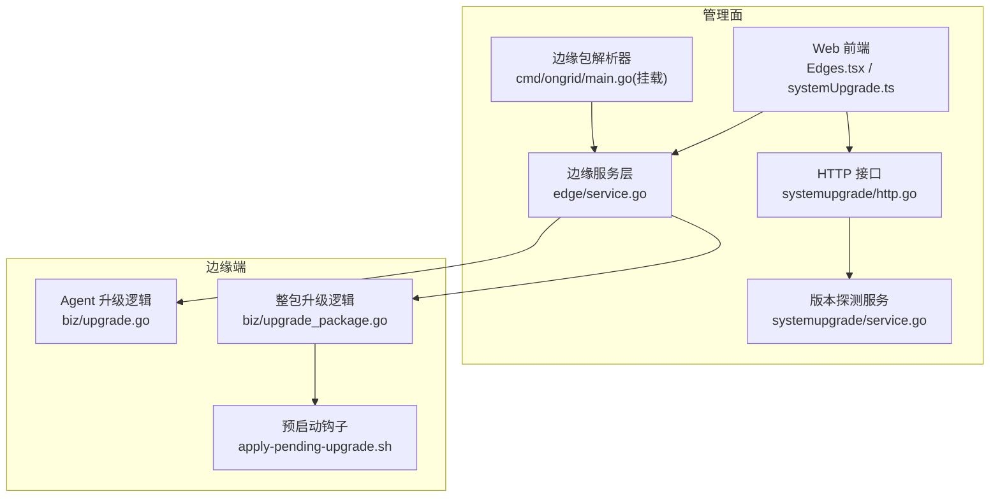
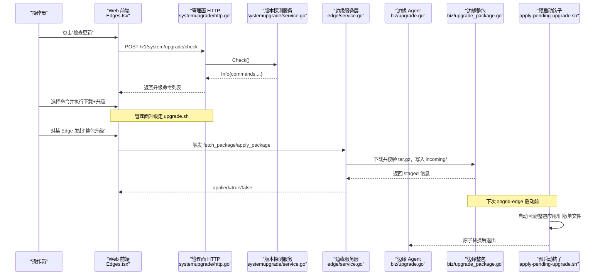
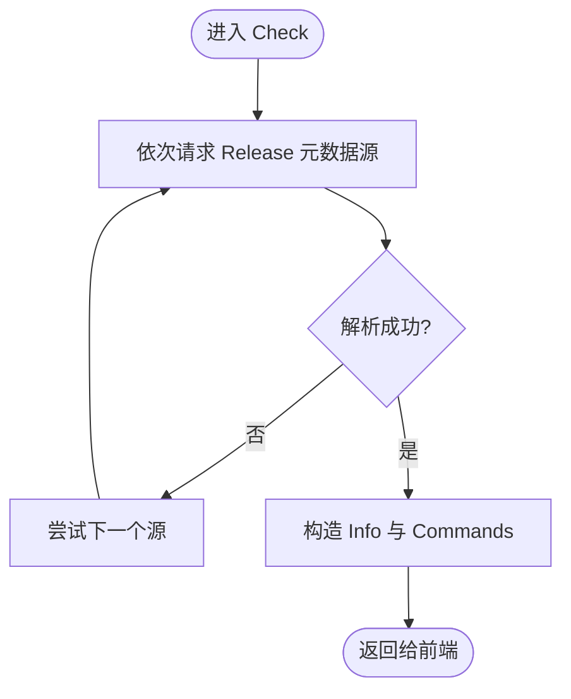
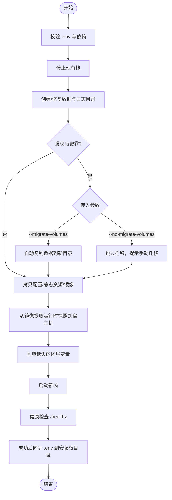
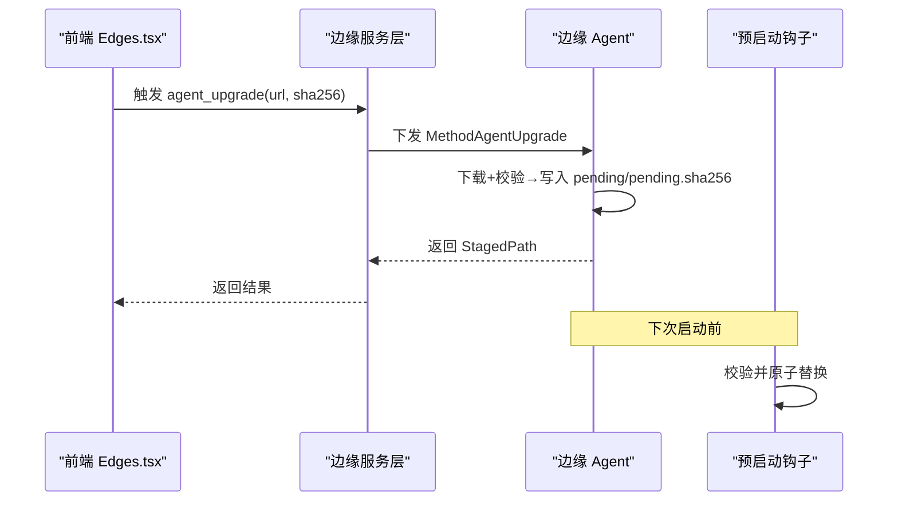
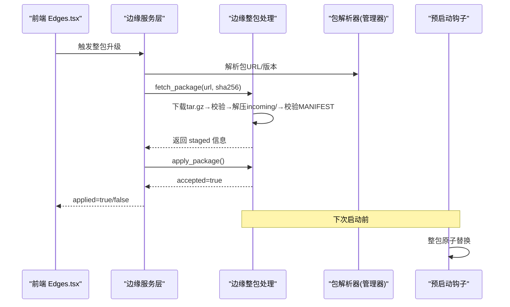
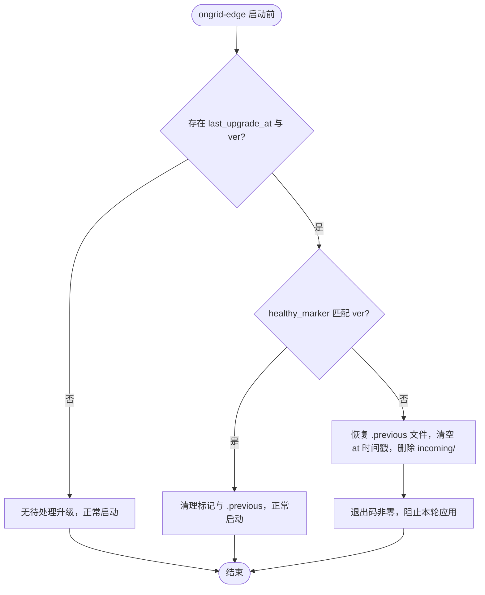
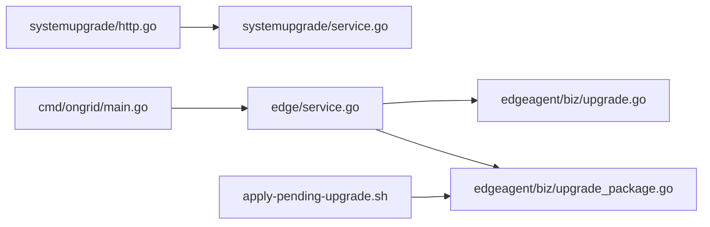

# 升级与回滚

<cite>
**本文引用的文件**   
- [deploy/install/upgrade.sh](file://deploy/install/upgrade.sh)
- [deploy/install/apply-pending-upgrade.sh](file://deploy/install/apply-pending-upgrade.sh)
- [internal/manager/service/systemupgrade/service.go](file://internal/manager/service/systemupgrade/service.go)
- [internal/manager/server/systemupgrade/http.go](file://internal/manager/server/systemupgrade/http.go)
- [web/src/api/systemUpgrade.ts](file://web/src/api/systemUpgrade.ts)
- [internal/edgeagent/biz/upgrade.go](file://internal/edgeagent/biz/upgrade.go)
- [internal/edgeagent/biz/upgrade_package.go](file://internal/edgeagent/biz/upgrade_package.go)
- [internal/manager/service/edge/service.go](file://internal/manager/service/edge/service.go)
- [cmd/ongrid/main.go](file://cmd/ongrid/main.go)
- [web/src/pages/Edges.tsx](file://web/src/pages/Edges.tsx)
</cite>

## 目录
1. [简介](#简介)
2. [项目结构](#项目结构)
3. [核心组件](#核心组件)
4. [架构总览](#架构总览)
5. [详细组件分析](#详细组件分析)
6. [依赖关系分析](#依赖关系分析)
7. [性能与可用性考虑](#性能与可用性考虑)
8. [故障排查指南](#故障排查指南)
9. [结论](#结论)
10. [附录](#附录)

## 简介
本指南面向运维与平台工程师，提供 Ongrid 管理面（Manager）与边缘 Agent（Edge）的在线与离线升级、回滚、兼容性检查、数据备份、进度监控、失败处理、批量自动化以及业务连续性保障等完整操作手册。文档严格基于仓库内实现进行说明，并给出关键流程的可视化图示与源码定位。

## 项目结构
与升级相关的关键路径与职责：
- 管理面升级脚本与镜像资源：deploy/install/upgrade.sh
- 边缘侧预启动应用与自动回滚钩子：deploy/install/apply-pending-upgrade.sh
- 管理面版本探测与命令生成：internal/manager/service/systemupgrade/service.go + internal/manager/server/systemupgrade/http.go
- 前端升级入口与提示：web/src/api/systemUpgrade.ts、web/src/pages/Edges.tsx
- 边缘二进制与整包升级逻辑：internal/edgeagent/biz/upgrade.go、internal/edgeagent/biz/upgrade_package.go
- 管理面对 Edge 的 RPC 调度：internal/manager/service/edge/service.go
- 管理面入口与边缘包解析器挂载：cmd/ongrid/main.go

**图表来源** 
- [internal/manager/server/systemupgrade/http.go:31-55](file://internal/manager/server/systemupgrade/http.go#L31-L55)
- [internal/manager/service/systemupgrade/service.go:86-117](file://internal/manager/service/systemupgrade/service.go#L86-L117)
- [internal/manager/service/edge/service.go:120-146](file://internal/manager/service/edge/service.go#L120-L146)
- [internal/edgeagent/biz/upgrade.go:35-154](file://internal/edgeagent/biz/upgrade.go#L35-L154)
- [internal/edgeagent/biz/upgrade_package.go:55-159](file://internal/edgeagent/biz/upgrade_package.go#L55-L159)
- [deploy/install/apply-pending-upgrade.sh:80-221](file://deploy/install/apply-pending-upgrade.sh#L80-L221)
- [cmd/ongrid/main.go:793-808](file://cmd/ongrid/main.go#L793-L808)

**章节来源**
- [deploy/install/upgrade.sh:302-368](file://deploy/install/upgrade.sh#L302-L368)
- [internal/manager/service/systemupgrade/service.go:86-117](file://internal/manager/service/systemupgrade/service.go#L86-L117)
- [internal/manager/server/systemupgrade/http.go:31-55](file://internal/manager/server/systemupgrade/http.go#L31-L55)
- [web/src/api/systemUpgrade.ts:21-23](file://web/src/api/systemUpgrade.ts#L21-L23)
- [web/src/pages/Edges.tsx:263-298](file://web/src/pages/Edges.tsx#L263-L298)
- [internal/manager/service/edge/service.go:120-146](file://internal/manager/service/edge/service.go#L120-L146)
- [internal/edgeagent/biz/upgrade.go:35-154](file://internal/edgeagent/biz/upgrade.go#L35-L154)
- [internal/edgeagent/biz/upgrade_package.go:55-159](file://internal/edgeagent/biz/upgrade_package.go#L55-L159)
- [deploy/install/apply-pending-upgrade.sh:80-221](file://deploy/install/apply-pending-upgrade.sh#L80-L221)
- [cmd/ongrid/main.go:793-808](file://cmd/ongrid/main.go#L793-L808)

## 核心组件
- 管理面版本探测与命令生成：根据当前版本与远端发布元数据比较，输出可执行的升级命令（支持 amd64/arm64 与自动检测）。
- 管理面对边缘的升级通道：通过隧道调用边缘 Agent 的升级方法，支持单二进制与整包两种模式。
- 边缘侧下载与校验：对目标 URL 下载二进制或包，计算并比对 SHA256，写入 staging 目录，等待系统重启时由预启动钩子完成原子替换。
- 预启动钩子与自动回滚：在 ongrid-edge 每次启动前运行，按优先级执行“自动回滚 → 整包应用 → 旧版单文件应用”，保证失败可恢复。
- 管理面本地升级脚本：用于 Manager 自身及依赖组件的原地升级，包含镜像加载、配置回填、健康检查与数据卷迁移策略。

**章节来源**
- [internal/manager/service/systemupgrade/service.go:227-282](file://internal/manager/service/systemupgrade/service.go#L227-L282)
- [internal/manager/service/edge/service.go:120-146](file://internal/manager/service/edge/service.go#L120-L146)
- [internal/edgeagent/biz/upgrade.go:35-154](file://internal/edgeagent/biz/upgrade.go#L35-L154)
- [internal/edgeagent/biz/upgrade_package.go:55-159](file://internal/edgeagent/biz/upgrade_package.go#L55-L159)
- [deploy/install/apply-pending-upgrade.sh:80-221](file://deploy/install/apply-pending-upgrade.sh#L80-L221)
- [deploy/install/upgrade.sh:302-368](file://deploy/install/upgrade.sh#L302-L368)

## 架构总览
下图展示从 Web 触发到边缘实际应用的端到端流程，包括在线升级与整包升级两条路径。

**图表来源** 
- [web/src/pages/Edges.tsx:263-298](file://web/src/pages/Edges.tsx#L263-L298)
- [internal/manager/server/systemupgrade/http.go:31-55](file://internal/manager/server/systemupgrade/http.go#L31-L55)
- [internal/manager/service/systemupgrade/service.go:86-117](file://internal/manager/service/systemupgrade/service.go#L86-L117)
- [internal/manager/service/edge/service.go:120-146](file://internal/manager/service/edge/service.go#L120-L146)
- [internal/edgeagent/biz/upgrade_package.go:55-159](file://internal/edgeagent/biz/upgrade_package.go#L55-L159)
- [deploy/install/apply-pending-upgrade.sh:80-221](file://deploy/install/apply-pending-upgrade.sh#L80-L221)

## 详细组件分析

### 管理面在线升级（版本探测与命令生成）
- 功能要点
  - 支持多源发布元数据地址，优先使用内置默认源；兼容 GitHub Releases 格式。
  - 版本号比较采用三段式语义化版本解析，忽略 v 前缀与构建后缀。
  - 自动生成 Linux amd64/arm64 与自动检测架构的命令，便于一键复制执行。
- 适用场景
  - 管理员在 Web 界面查看是否有新版本，并获取可直接粘贴到服务器的安装命令。
- 关键实现位置
  - 版本探测与命令生成：[internal/manager/service/systemupgrade/service.go:86-117](file://internal/manager/service/systemupgrade/service.go#L86-L117)、[internal/manager/service/systemupgrade/service.go:227-282](file://internal/manager/service/systemupgrade/service.go#L227-L282)
  - HTTP 路由与鉴权：[internal/manager/server/systemupgrade/http.go:31-55](file://internal/manager/server/systemupgrade/http.go#L31-L55)
  - 前端调用：[web/src/api/systemUpgrade.ts:21-23](file://web/src/api/systemUpgrade.ts#L21-L23)

**图表来源** 
- [internal/manager/service/systemupgrade/service.go:86-117](file://internal/manager/service/systemupgrade/service.go#L86-L117)
- [internal/manager/service/systemupgrade/service.go:227-282](file://internal/manager/service/systemupgrade/service.go#L227-L282)

**章节来源**
- [internal/manager/service/systemupgrade/service.go:86-117](file://internal/manager/service/systemupgrade/service.go#L86-L117)
- [internal/manager/service/systemupgrade/service.go:227-282](file://internal/manager/service/systemupgrade/service.go#L227-L282)
- [internal/manager/server/systemupgrade/http.go:31-55](file://internal/manager/server/systemupgrade/http.go#L31-L55)
- [web/src/api/systemUpgrade.ts:21-23](file://web/src/api/systemUpgrade.ts#L21-L23)

### 管理面本地升级（原地升级）
- 功能要点
  - 原地升级，保留 .env 与数据卷；停止现有栈，准备宿主目录，拷贝新配置与静态资源，加载镜像，提取运行时快照，回填缺失环境变量，拉起新栈并健康检查。
  - 自动检测 Docker host-gateway 能力并回填代理与内部域名白名单。
  - 针对历史命名卷（bind-mount 之前）提供 --migrate-volumes 与 --no-migrate-volumes 两种策略。
  - 成功后将升级后的 .env 同步回安装根目录，供后续升级与 systemd 单元读取。
- 前置条件
  - 已存在 .env 且位于脚本同级目录；Docker 与 docker compose v2 可用。
- 参数选项
  - --migrate-volumes：自动将历史命名卷数据复制到新的 bind-mount 目标。
  - --no-migrate-volumes：跳过自动迁移，需手动迁移后再启动。
- 适用场景
  - 管理面所在主机需要原地升级到新版本，同时保持数据与配置不丢失。
- 关键实现位置
  - 主流程与环境变量回填：[deploy/install/upgrade.sh:302-368](file://deploy/install/upgrade.sh#L302-L368)
  - 历史卷迁移与权限设置：[deploy/install/upgrade.sh:457-534](file://deploy/install/upgrade.sh#L457-L534)
  - 镜像加载与运行时快照提取：[deploy/install/upgrade.sh:637-690](file://deploy/install/upgrade.sh#L637-L690)
  - 健康检查与 .env 同步：[deploy/install/upgrade.sh:760-797](file://deploy/install/upgrade.sh#L760-L797)

**图表来源** 
- [deploy/install/upgrade.sh:302-368](file://deploy/install/upgrade.sh#L302-L368)
- [deploy/install/upgrade.sh:457-534](file://deploy/install/upgrade.sh#L457-L534)
- [deploy/install/upgrade.sh:637-690](file://deploy/install/upgrade.sh#L637-L690)
- [deploy/install/upgrade.sh:760-797](file://deploy/install/upgrade.sh#L760-L797)

**章节来源**
- [deploy/install/upgrade.sh:302-368](file://deploy/install/upgrade.sh#L302-L368)
- [deploy/install/upgrade.sh:457-534](file://deploy/install/upgrade.sh#L457-L534)
- [deploy/install/upgrade.sh:637-690](file://deploy/install/upgrade.sh#L637-L690)
- [deploy/install/upgrade.sh:760-797](file://deploy/install/upgrade.sh#L760-L797)

### 边缘 Agent 单二进制升级
- 功能要点
  - 管理面通过隧道向边缘发送下载 URL 与预期 SHA256。
  - 边缘 Agent 流式下载至临时文件，边写边算哈希，校验通过后重命名为 pending，并写入 pending.sha256 作为辅助文件。
  - 信号通知主循环退出，systemd 重启进程，由预启动钩子完成原子替换。
- 适用场景
  - 仅升级 ongrid-edge 二进制，无需拉取整包。
- 关键实现位置
  - 边缘接收与校验：[internal/edgeagent/biz/upgrade.go:35-154](file://internal/edgeagent/biz/upgrade.go#L35-L154)
  - 管理面调度：[internal/manager/service/edge/service.go:120-146](file://internal/manager/service/edge/service.go#L120-L146)
  - 前端触发入口（弹窗输入 URL 与 SHA256）：[web/src/pages/Edges.tsx:663-697](file://web/src/pages/Edges.tsx#L663-L697)

**图表来源** 
- [web/src/pages/Edges.tsx:663-697](file://web/src/pages/Edges.tsx#L663-L697)
- [internal/manager/service/edge/service.go:120-146](file://internal/manager/service/edge/service.go#L120-L146)
- [internal/edgeagent/biz/upgrade.go:35-154](file://internal/edgeagent/biz/upgrade.go#L35-L154)
- [deploy/install/apply-pending-upgrade.sh:189-212](file://deploy/install/apply-pending-upgrade.sh#L189-L212)

**章节来源**
- [internal/edgeagent/biz/upgrade.go:35-154](file://internal/edgeagent/biz/upgrade.go#L35-L154)
- [internal/manager/service/edge/service.go:120-146](file://internal/manager/service/edge/service.go#L120-L146)
- [web/src/pages/Edges.tsx:663-697](file://web/src/pages/Edges.tsx#L663-L697)
- [deploy/install/apply-pending-upgrade.sh:189-212](file://deploy/install/apply-pending-upgrade.sh#L189-L212)

### 边缘整包升级（One-Click Upgrade）
- 功能要点
  - 管理面提供整包下载端点（由 FileBundleResolver 提供），边缘 Agent 接收 fetch_package 请求，下载 tar.gz，校验外层 SHA256，解压到 incoming/，再逐文件校验 MANIFEST.txt。
  - apply_package 确认 staging 完成后，通知主循环退出，systemd 重启进程，预启动钩子执行整包应用。
  - 整包包含插件与工具，适合一次性升级多个组件。
- 适用场景
  - 需要同时升级 ongrid-edge 及其插件、工具链，减少多次切换风险。
- 关键实现位置
  - 整包下载与校验：[internal/edgeagent/biz/upgrade_package.go:55-159](file://internal/edgeagent/biz/upgrade_package.go#L55-L159)
  - 预启动钩子整包应用：[deploy/install/apply-pending-upgrade.sh:123-187](file://deploy/install/apply-pending-upgrade.sh#L123-L187)
  - 管理面入口与包解析器挂载：[cmd/ongrid/main.go:793-808](file://cmd/ongrid/main.go#L793-L808)
  - 前端整包升级交互与提示：[web/src/pages/Edges.tsx:263-298](file://web/src/pages/Edges.tsx#L263-L298)

**图表来源** 
- [web/src/pages/Edges.tsx:263-298](file://web/src/pages/Edges.tsx#L263-L298)
- [internal/manager/service/edge/service.go:120-146](file://internal/manager/service/edge/service.go#L120-L146)
- [internal/edgeagent/biz/upgrade_package.go:55-159](file://internal/edgeagent/biz/upgrade_package.go#L55-L159)
- [deploy/install/apply-pending-upgrade.sh:123-187](file://deploy/install/apply-pending-upgrade.sh#L123-L187)
- [cmd/ongrid/main.go:793-808](file://cmd/ongrid/main.go#L793-L808)

**章节来源**
- [internal/edgeagent/biz/upgrade_package.go:55-159](file://internal/edgeagent/biz/upgrade_package.go#L55-L159)
- [deploy/install/apply-pending-upgrade.sh:123-187](file://deploy/install/apply-pending-upgrade.sh#L123-L187)
- [cmd/ongrid/main.go:793-808](file://cmd/ongrid/main.go#L793-L808)
- [web/src/pages/Edges.tsx:263-298](file://web/src/pages/Edges.tsx#L263-L298)

### 自动回滚机制
- 触发条件
  - 上次升级已应用但本次未写入 healthy_marker 匹配 last_upgrade_ver，则视为异常，自动恢复 .previous 文件。
- 行为特性
  - 幂等且尽力而为：若 staging 不完整或校验失败，不会阻塞启动，直接以磁盘上现有版本运行。
  - 清理策略：健康确认后清理 healthy_marker 与 .previous 残留，避免磁盘膨胀。
- 关键实现位置
  - 自动回滚与整包应用：[deploy/install/apply-pending-upgrade.sh:80-187](file://deploy/install/apply-pending-upgrade.sh#L80-L187)

**图表来源** 
- [deploy/install/apply-pending-upgrade.sh:80-187](file://deploy/install/apply-pending-upgrade.sh#L80-L187)

**章节来源**
- [deploy/install/apply-pending-upgrade.sh:80-187](file://deploy/install/apply-pending-upgrade.sh#L80-L187)

## 依赖关系分析
- 管理面对外暴露 /v1/system/upgrade 与 /v1/system/upgrade/check，受租户上下文与角色鉴权保护。
- 版本探测服务依赖外部发布元数据源，具备超时与错误聚合能力。
- 边缘升级依赖 tunnel 通道与 systemd 生命周期控制，所有文件替换均通过原子 rename 保证一致性。
- 管理面本地升级依赖 docker 与 docker compose，镜像与静态资源来自打包产物。

**图表来源** 
- [internal/manager/server/systemupgrade/http.go:31-55](file://internal/manager/server/systemupgrade/http.go#L31-L55)
- [internal/manager/service/systemupgrade/service.go:86-117](file://internal/manager/service/systemupgrade/service.go#L86-L117)
- [internal/manager/service/edge/service.go:120-146](file://internal/manager/service/edge/service.go#L120-L146)
- [internal/edgeagent/biz/upgrade.go:35-154](file://internal/edgeagent/biz/upgrade.go#L35-L154)
- [internal/edgeagent/biz/upgrade_package.go:55-159](file://internal/edgeagent/biz/upgrade_package.go#L55-L159)
- [cmd/ongrid/main.go:793-808](file://cmd/ongrid/main.go#L793-L808)
- [deploy/install/apply-pending-upgrade.sh:80-187](file://deploy/install/apply-pending-upgrade.sh#L80-L187)

**章节来源**
- [internal/manager/server/systemupgrade/http.go:31-55](file://internal/manager/server/systemupgrade/http.go#L31-L55)
- [internal/manager/service/systemupgrade/service.go:86-117](file://internal/manager/service/systemupgrade/service.go#L86-L117)
- [internal/manager/service/edge/service.go:120-146](file://internal/manager/service/edge/service.go#L120-L146)
- [internal/edgeagent/biz/upgrade.go:35-154](file://internal/edgeagent/biz/upgrade.go#L35-L154)
- [internal/edgeagent/biz/upgrade_package.go:55-159](file://internal/edgeagent/biz/upgrade_package.go#L55-L159)
- [cmd/ongrid/main.go:793-808](file://cmd/ongrid/main.go#L793-L808)
- [deploy/install/apply-pending-upgrade.sh:80-187](file://deploy/install/apply-pending-upgrade.sh#L80-L187)

## 性能与可用性考虑
- 下载与校验
  - 边缘侧下载与校验使用长超时（分钟级）与流式写入，降低弱网环境失败率。
  - 整包大小限制与解压总量限制，防止恶意或异常包耗尽磁盘。
- 原子性与幂等
  - 所有文件替换采用同文件系统 rename，确保原子性；预启动钩子幂等执行，避免重复应用。
- 健康检查
  - 管理面升级脚本在拉起新栈后进行 /healthz 轮询，确保服务就绪。
- 资源占用
  - 整包解压与校验会短暂增加 CPU 与 IO 压力，建议在低峰期执行。

[本节为通用指导，不直接分析具体文件]

## 故障排查指南
- 管理面升级失败
  - 现象：健康检查未通过或日志报错。
  - 排查步骤
    - 查看容器日志：docker compose -f <安装目录>/docker-compose.yml logs ongrid
    - 检查 .env 是否被正确回填与同步（升级成功后才会同步回安装根目录）。
    - 若检测到历史命名卷且未传参，需重新执行并添加 --migrate-volumes 或 --no-migrate-volumes。
  - 参考实现：[deploy/install/upgrade.sh:760-797](file://deploy/install/upgrade.sh#L760-L797)、[deploy/install/upgrade.sh:457-534](file://deploy/install/upgrade.sh#L457-L534)

- 边缘整包升级失败
  - 现象：前端提示 stage 成功但 apply 失败，或边缘未上线。
  - 排查步骤
    - 检查 staging 目录是否存在 incoming/MANIFEST.txt 与对应文件。
    - 核对 MANIFEST 中每文件的 SHA256 与实际一致。
    - 观察预启动钩子日志（journal 或 syslog），确认是否触发了自动回滚。
  - 参考实现：[internal/edgeagent/biz/upgrade_package.go:55-159](file://internal/edgeagent/biz/upgrade_package.go#L55-L159)、[deploy/install/apply-pending-upgrade.sh:123-187](file://deploy/install/apply-pending-upgrade.sh#L123-L187)

- 边缘单二进制升级失败
  - 现象：pending 文件存在但未生效，或 SHA256 不匹配。
  - 排查步骤
    - 检查 pending 与 pending.sha256 是否存在且一致。
    - 确认预启动钩子是否执行了旧版单文件应用分支。
  - 参考实现：[internal/edgeagent/biz/upgrade.go:35-154](file://internal/edgeagent/biz/upgrade.go#L35-L154)、[deploy/install/apply-pending-upgrade.sh:189-212](file://deploy/install/apply-pending-upgrade.sh#L189-L212)

**章节来源**
- [deploy/install/upgrade.sh:760-797](file://deploy/install/upgrade.sh#L760-L797)
- [deploy/install/upgrade.sh:457-534](file://deploy/install/upgrade.sh#L457-L534)
- [internal/edgeagent/biz/upgrade_package.go:55-159](file://internal/edgeagent/biz/upgrade_package.go#L55-L159)
- [deploy/install/apply-pending-upgrade.sh:123-187](file://deploy/install/apply-pending-upgrade.sh#L123-L187)
- [internal/edgeagent/biz/upgrade.go:35-154](file://internal/edgeagent/biz/upgrade.go#L35-L154)
- [deploy/install/apply-pending-upgrade.sh:189-212](file://deploy/install/apply-pending-upgrade.sh#L189-L212)

## 结论
Ongrid 的升级体系围绕“安全下载与强校验、原子替换与自动回滚、健康检查与幂等执行”展开。管理面提供在线版本探测与本地原地升级脚本，边缘侧支持单二进制与整包两种升级方式，并通过预启动钩子确保失败可恢复。建议在生产环境中结合灰度与批量策略，配合健康检查与日志观测，最大化保障业务连续性。

[本节为总结，不直接分析具体文件]

## 附录

### 升级前准备工作清单
- 数据备份
  - 确认数据目录（MySQL、Prometheus、Loki、Tempo、Qdrant、Grafana 等）已落盘到宿主机绑定目录，必要时提前备份。
  - 若存在历史命名卷，评估是否需要 --migrate-volumes 自动迁移或手动迁移。
- 版本兼容性检查
  - 通过 /v1/system/upgrade/check 获取最新版本与命令，确认架构与版本差异。
- 依赖组件升级
  - 确保 Docker 与 docker compose v2 可用；如需 host-gateway，确认内核与 Docker 版本支持。
- 网络与代理
  - 如企业环境有代理，脚本会自动回填代理与内部域名白名单，必要时手工调整 .env。

**章节来源**
- [deploy/install/upgrade.sh:302-368](file://deploy/install/upgrade.sh#L302-L368)
- [deploy/install/upgrade.sh:457-534](file://deploy/install/upgrade.sh#L457-L534)
- [internal/manager/server/systemupgrade/http.go:31-55](file://internal/manager/server/systemupgrade/http.go#L31-L55)
- [internal/manager/service/systemupgrade/service.go:227-282](file://internal/manager/service/systemupgrade/service.go#L227-L282)

### 升级脚本使用方法与参数
- 管理面本地升级
  - 基本用法：在新版本解压目录中，将现有 .env 复制到脚本同级，然后执行 sudo ./upgrade.sh。
  - 参数
    - --migrate-volumes：自动迁移历史命名卷数据到新目录。
    - --no-migrate-volumes：跳过自动迁移，需手动迁移。
  - 健康检查：脚本会在拉起新栈后轮询 /healthz，最长约 90 秒。
- 边缘整包升级
  - 通过前端“整包升级”按钮触发，后端负责解析包、边缘下载与校验、预启动钩子应用。
- 边缘单二进制升级
  - 通过前端弹窗输入下载 URL 与 SHA256，后端下发到边缘执行。

**章节来源**
- [deploy/install/upgrade.sh:302-368](file://deploy/install/upgrade.sh#L302-L368)
- [deploy/install/upgrade.sh:457-534](file://deploy/install/upgrade.sh#L457-L534)
- [deploy/install/upgrade.sh:760-797](file://deploy/install/upgrade.sh#L760-L797)
- [web/src/pages/Edges.tsx:263-298](file://web/src/pages/Edges.tsx#L263-L298)
- [web/src/pages/Edges.tsx:663-697](file://web/src/pages/Edges.tsx#L663-L697)

### 升级过程中的状态监控与进度查看
- 管理面升级
  - 关注脚本输出的 INFO/WARN/ERROR 日志；健康检查通过后表示升级成功。
- 边缘整包升级
  - 前端会显示 stage 的文件数量与版本信息；若 apply 失败，会提示错误原因。
- 边缘单二进制升级
  - 前端弹窗提交后，若无异常即认为 staging 成功；实际替换发生在下一次启动。

**章节来源**
- [deploy/install/upgrade.sh:760-797](file://deploy/install/upgrade.sh#L760-L797)
- [web/src/pages/Edges.tsx:263-298](file://web/src/pages/Edges.tsx#L263-L298)

### 升级失败的处理流程与手动干预
- 管理面
  - 若健康检查未通过，检查容器日志与 .env 回填情况；必要时回退到上一版本的镜像与配置。
- 边缘
  - 若整包应用失败，预启动钩子会尝试自动回滚；若仍异常，人工检查 staging 目录与 MANIFEST 校验结果，必要时删除 incoming/ 重试。
  - 若单二进制升级失败，检查 pending 与 pending.sha256 的一致性，必要时删除后重试。

**章节来源**
- [deploy/install/upgrade.sh:760-797](file://deploy/install/upgrade.sh#L760-L797)
- [deploy/install/apply-pending-upgrade.sh:80-187](file://deploy/install/apply-pending-upgrade.sh#L80-L187)
- [internal/edgeagent/biz/upgrade_package.go:55-159](file://internal/edgeagent/biz/upgrade_package.go#L55-L159)
- [internal/edgeagent/biz/upgrade.go:35-154](file://internal/edgeagent/biz/upgrade.go#L35-L154)

### 回滚操作的完整流程
- 自动回滚
  - 当上次升级未报告健康时，预启动钩子会恢复 .previous 文件并清理 staging。
- 手动回滚
  - 管理面：回退到上一版本的镜像与配置，重新启动服务。
  - 边缘：删除 pending 与 pending.sha256，或清理 incoming/，确保磁盘上的旧版本继续运行。

**章节来源**
- [deploy/install/apply-pending-upgrade.sh:80-187](file://deploy/install/apply-pending-upgrade.sh#L80-L187)
- [deploy/install/upgrade.sh:760-797](file://deploy/install/upgrade.sh#L760-L797)

### 版本兼容性与迁移策略
- 版本比较
  - 采用三段式语义化版本比较，忽略 v 前缀与构建后缀。
- 数据迁移
  - 管理面升级脚本支持历史命名卷迁移；边缘整包升级通过 MANIFEST 与原子替换保证一致性。
- 配置回填
  - 升级脚本自动回填缺失的环境变量（如 Grafana 管理员密码、host-gateway 等），确保新栈能正常启动。

**章节来源**
- [internal/manager/service/systemupgrade/service.go:284-323](file://internal/manager/service/systemupgrade/service.go#L284-L323)
- [deploy/install/upgrade.sh:457-534](file://deploy/install/upgrade.sh#L457-L534)
- [deploy/install/upgrade.sh:696-721](file://deploy/install/upgrade.sh#L696-L721)

### 升级后的验证测试清单
- 管理面
  - 访问 /healthz 返回正常。
  - 登录 Web 界面，确认仪表盘、告警、设备列表等功能正常。
  - 检查 Prometheus/Loki/Tempo/Grafana 数据是否可见。
- 边缘
  - 确认 ongrid-edge 版本上报正确。
  - 检查插件与工具是否可用（如日志采集、指标采集等）。
  - 观察一段时间内的健康状态与日志是否正常。

[本节为通用指导，不直接分析具体文件]

### 批量升级的自动化方案
- 管理面
  - 在多台主机上并行执行 upgrade.sh，结合 --migrate-volumes 或 --no-migrate-volumes 策略，统一编排（例如 Ansible/Puppet/Cron）。
- 边缘
  - 通过管理面批量触发整包升级或单二进制升级，结合前端提示与日志观测，分批次滚动升级以降低风险。
- 注意事项
  - 控制并发度，避免集中拉取镜像与解压造成带宽与 IO 瓶颈。
  - 预留回滚窗口，一旦发现问题立即回滚。

[本节为通用指导，不直接分析具体文件]

### 升级过程中的业务连续性保障措施
- 原子替换与自动回滚：确保任何中间态都不会导致不可恢复的状态。
- 健康检查：管理面升级后轮询 /healthz，边缘通过 healthy_marker 判定。
- 最小变更范围：整包升级仅替换必要文件，其余配置与数据保持不变。
- 灰度与分批：先小范围试点，稳定后再全量推广。

[本节为通用指导，不直接分析具体文件]