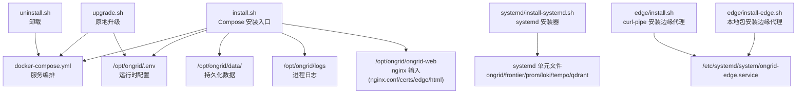
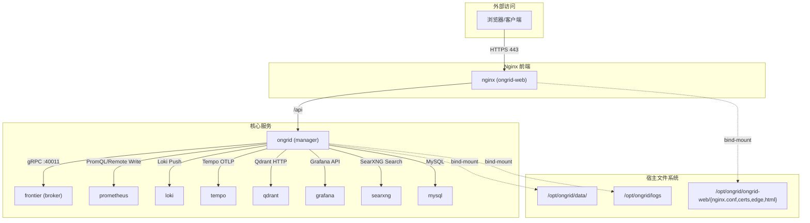
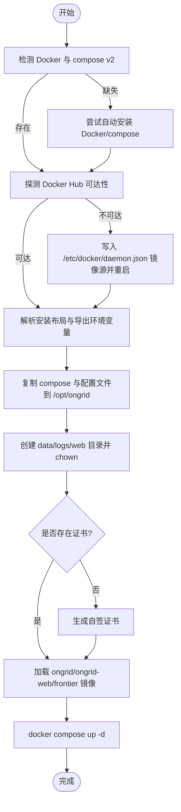
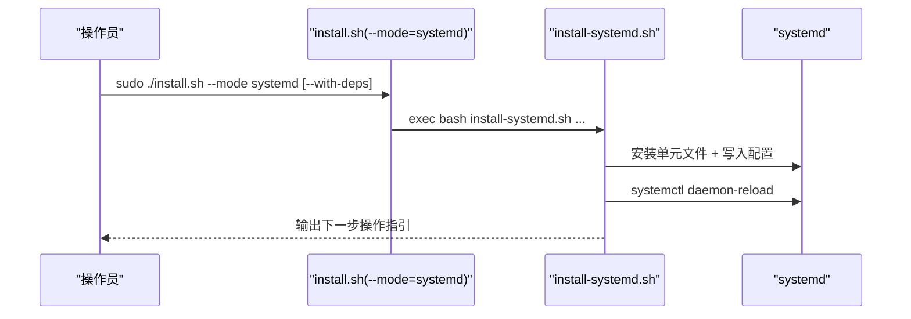
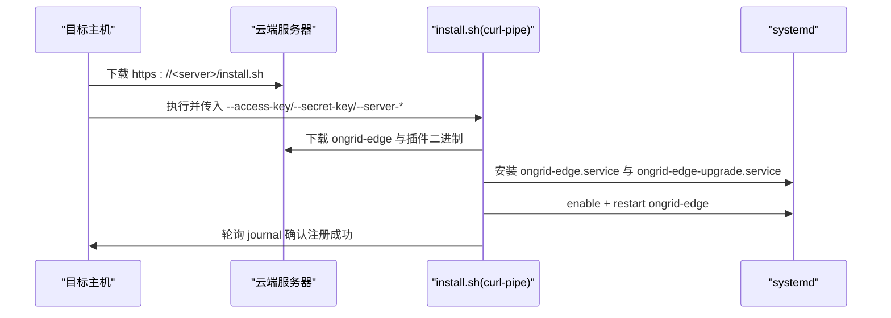
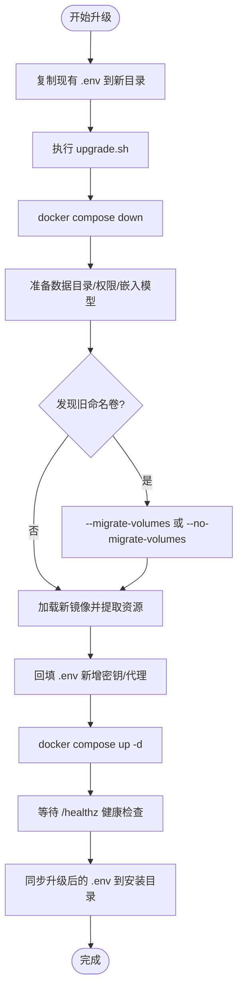

# 安装部署

<cite>
**本文引用的文件**   
- [deploy/install/install.sh](file://deploy/install/install.sh)
- [deploy/install/docker-compose.yml](file://deploy/install/docker-compose.yml)
- [deploy/install/systemd/install-systemd.sh](file://deploy/install/systemd/install-systemd.sh)
- [deploy/install/upgrade.sh](file://deploy/install/upgrade.sh)
- [deploy/install/uninstall.sh](file://deploy/install/uninstall.sh)
- [deploy/install/edge/install.sh](file://deploy/install/edge/install.sh)
- [deploy/install/edge/uninstall.sh](file://deploy/install/edge/uninstall.sh)
- [deploy/install/edge/install-edge.sh](file://deploy/install/edge/install-edge.sh)
</cite>

## 目录
1. [简介](#简介)
2. [项目结构](#项目结构)
3. [核心组件](#核心组件)
4. [架构总览](#架构总览)
5. [详细组件分析](#详细组件分析)
6. [依赖关系分析](#依赖关系分析)
7. [性能与容量规划](#性能与容量规划)
8. [故障排查指南](#故障排查指南)
9. [结论](#结论)
10. [附录](#附录)

## 简介
本指南面向生产环境，提供一键安装脚本的使用说明、两种部署模式（Docker Compose 与 systemd 原生）的差异与适用场景、容器化部署的完整流程（配置、数据目录、日志）、systemd 原生部署与服务管理、镜像构建与多阶段优化建议、边缘代理单独部署方法、升级与回滚策略以及常见问题排查。

## 项目结构
仓库中与安装部署相关的核心脚本与配置文件集中在 deploy/install 目录下：
- install.sh：Compose 模式的一键安装入口，负责环境探测、镜像加载、目录初始化、证书生成、compose 启动等
- docker-compose.yml：生产级 compose 编排，包含 ongrid、nginx、frontier、prometheus、loki、tempo、qdrant、grafana、searxng 等服务
- upgrade.sh：原地升级脚本，保留 .env 与数据卷，自动迁移旧命名卷并拉起新服务
- uninstall.sh：停止并可选清理安装目录与数据
- systemd/install-systemd.sh：systemd 原生模式安装器，安装 manager + frontier + 依赖单元
- edge/*：边缘代理安装与卸载脚本（curl-pipe 与本地包两种方式）

图表来源
- [deploy/install/install.sh:559-604](file://deploy/install/install.sh#L559-L604)
- [deploy/install/docker-compose.yml:51-610](file://deploy/install/docker-compose.yml#L51-L610)
- [deploy/install/systemd/install-systemd.sh:424-448](file://deploy/install/systemd/install-systemd.sh#L424-L448)
- [deploy/install/edge/install.sh:377-450](file://deploy/install/edge/install.sh#L377-L450)
- [deploy/install/edge/install-edge.sh:336-378](file://deploy/install/edge/install-edge.sh#L336-L378)

章节来源
- [deploy/install/install.sh:559-604](file://deploy/install/install.sh#L559-L604)
- [deploy/install/docker-compose.yml:51-610](file://deploy/install/docker-compose.yml#L51-L610)

## 核心组件
- 一键安装脚本（Compose 模式）
  - 功能：检测 Docker 与 compose v2、自动配置国内镜像源、创建单根安装目录 /opt/ongrid 及其子目录（ongrid、ongrid-web、data、logs），复制配置与静态资源，生成自签 TLS 证书，加载镜像，拉起服务
  - 关键路径与环境变量：ONGRID_INSTALL_DIR、ONGRID_DATA_DIR、ONGRID_LOG_DIR、ONGRID_WEB_DIR、ONGRID_APP_DIR
- 一键安装脚本（systemd 模式）
  - 功能：安装 manager 与 frontier 二进制，写入 systemd 单元，预置环境变量文件，支持 --with-deps 自动安装依赖（mariadb/nginx/grafana 及 prom/loki/tempo/qdrant 二进制）
- 升级脚本
  - 功能：拉取新版本镜像、提取镜像内资源到宿主机 bind-mount、合并 .env 新增密钥、健康检查后重启服务、兼容旧命名卷迁移
- 卸载脚本
  - 功能：停止 stack、删除命名卷与 bind-mount 数据目录、移除安装目录；可联动卸载 co-resident 的 ongrid-edge
- 边缘代理安装
  - curl-pipe 方式：从 https://<server>/edge/ 下载二进制与插件，安装 systemd 单元，校验连接状态
  - 本地包方式：从解压后的 bundle 中安装二进制与插件，渲染 env 与 unit 模板

章节来源
- [deploy/install/install.sh:355-414](file://deploy/install/install.sh#L355-L414)
- [deploy/install/install.sh:559-604](file://deploy/install/install.sh#L559-L604)
- [deploy/install/systemd/install-systemd.sh:44-67](file://deploy/install/systemd/install-systemd.sh#L44-L67)
- [deploy/install/upgrade.sh:302-368](file://deploy/install/upgrade.sh#L302-L368)
- [deploy/install/uninstall.sh:26-59](file://deploy/install/uninstall.sh#L26-L59)
- [deploy/install/edge/install.sh:103-138](file://deploy/install/edge/install.sh#L103-L138)
- [deploy/install/edge/install-edge.sh:54-77](file://deploy/install/edge/install-edge.sh#L54-L77)

## 架构总览
下图展示了 Compose 模式下各服务的依赖与数据流向。所有状态通过 host bind-mount 持久化，外部访问经 nginx 终止 TLS 并反向代理至 ongrid。

图表来源
- [deploy/install/docker-compose.yml:83-312](file://deploy/install/docker-compose.yml#L83-L312)
- [deploy/install/docker-compose.yml:314-335](file://deploy/install/docker-compose.yml#L314-L335)
- [deploy/install/docker-compose.yml:339-387](file://deploy/install/docker-compose.yml#L339-L387)
- [deploy/install/docker-compose.yml:394-434](file://deploy/install/docker-compose.yml#L394-L434)
- [deploy/install/docker-compose.yml:439-458](file://deploy/install/docker-compose.yml#L439-L458)
- [deploy/install/docker-compose.yml:464-485](file://deploy/install/docker-compose.yml#L464-L485)
- [deploy/install/docker-compose.yml:492-508](file://deploy/install/docker-compose.yml#L492-L508)
- [deploy/install/docker-compose.yml:517-546](file://deploy/install/docker-compose.yml#L517-L546)
- [deploy/install/docker-compose.yml:548-599](file://deploy/install/docker-compose.yml#L548-L599)

## 详细组件分析

### 一键安装（Compose 模式）
- 前置条件
  - 需要 Docker 与 docker compose v2；若未安装，脚本会尝试自动安装（优先 get.docker.com，失败则回退到发行版包管理器）
  - 若检测到无法直连 Docker Hub，会自动在 /etc/docker/daemon.json 写入国内镜像源并重启 daemon
- 安装布局
  - 单根目录 /opt/ongrid，四个子目录职责清晰：
    - ongrid：compose 文件、.env、VERSION、frontier.yaml、prometheus.yml、loki-config.yaml、tempo-config.yaml、prometheus/、grafana/、searxng/、prometheus-rules.yml
    - ongrid-web：nginx 输入（nginx.conf、certs/、edge/、html/）
    - data：所有有状态服务的数据目录（mysql、prometheus、loki、tempo、qdrant、grafana）以及 manager 运行时目录（embeddings、skills、pages、workspace、tools）
    - logs：manager 进程 stdout 与容器 json-log 目标
- 代理与 NO_PROXY
  - 自动探测宿主 HTTP_PROXY/HTTPS_PROXY/NO_PROXY（含 /etc/environment 回退），并将结果写入 .env 的 ONGRID_HTTP(S)_PROXY 与 ONGRID_NO_PROXY
  - 自动收集内部域名（/etc/hosts、/etc/resolv.conf search/domain、hostname/FQDN、用户额外列表）追加到 NO_PROXY，避免内部服务误走代理
- 证书与端口
  - 首次运行若无证书将生成自签证书（CN=ongrid，有效期 365 天）
  - 默认对外暴露 443/80（可通过 .env 覆盖）
- 数据卷迁移提示
  - 若发现旧命名卷，会提示按 README 进行“数据卷迁移”后再拉起

图表来源
- [deploy/install/install.sh:465-518](file://deploy/install/install.sh#L465-L518)
- [deploy/install/install.sh:527-555](file://deploy/install/install.sh#L527-L555)
- [deploy/install/install.sh:559-604](file://deploy/install/install.sh#L559-L604)
- [deploy/install/install.sh:606-680](file://deploy/install/install.sh#L606-L680)
- [deploy/install/install.sh:784-800](file://deploy/install/install.sh#L784-L800)

章节来源
- [deploy/install/install.sh:355-414](file://deploy/install/install.sh#L355-L414)
- [deploy/install/install.sh:465-518](file://deploy/install/install.sh#L465-L518)
- [deploy/install/install.sh:527-555](file://deploy/install/install.sh#L527-L555)
- [deploy/install/install.sh:559-604](file://deploy/install/install.sh#L559-L604)
- [deploy/install/install.sh:606-680](file://deploy/install/install.sh#L606-L680)
- [deploy/install/install.sh:784-800](file://deploy/install/install.sh#L784-L800)

### 一键安装（systemd 原生模式）
- 使用方式
  - 顶层 install.sh 支持 --mode systemd，随后分发到 systemd/install-systemd.sh
  - 可选 --with-deps 自动安装 mariadb/nginx/grafana 与 prom/loki/tempo/qdrant 二进制，并引导 schema 与 datasource 配置
- 安装布局
  - 默认遵循 FHS：PREFIX=/usr/local，ETC_DIR=/etc/ongrid，STATE_DIR=/var/lib/ongrid，LOG_DIR=/var/log/ongrid
  - 也可采用折叠布局 PREFIX=/opt/ongrid，使与 Compose 模式一致
- 单元与配置
  - 安装 ongrid、ongrid-frontier、prometheus、loki、tempo、qdrant 六个单元
  - 预写 ongrid.env（首次安装），自动注入宿主代理与内部 no_proxy 域名
  - 对 loki/tempo 的配置路径重写为 StateDirectory 对应路径，确保可写

图表来源
- [deploy/install/install.sh:400-414](file://deploy/install/install.sh#L400-L414)
- [deploy/install/systemd/install-systemd.sh:424-448](file://deploy/install/systemd/install-systemd.sh#L424-L448)
- [deploy/install/systemd/install-systemd.sh:336-397](file://deploy/install/systemd/install-systemd.sh#L336-L397)

章节来源
- [deploy/install/install.sh:400-414](file://deploy/install/install.sh#L400-L414)
- [deploy/install/systemd/install-systemd.sh:44-67](file://deploy/install/systemd/install-systemd.sh#L44-L67)
- [deploy/install/systemd/install-systemd.sh:336-397](file://deploy/install/systemd/install-systemd.sh#L336-L397)
- [deploy/install/systemd/install-systemd.sh:424-448](file://deploy/install/systemd/install-systemd.sh#L424-L448)

### Docker Compose 部署流程（配置、数据、日志）
- 配置文件
  - .env：集中存放所有敏感与运行时参数（数据库密码、JWT Secret、LLM Key、Grafana Admin 等）
  - prometheus.yml、prometheus-rules.yml、loki-config.yaml、tempo-config.yaml、frontier.yaml、searxng/settings.yml 均通过 bind-mount 生效
- 数据目录规划
  - 统一挂载到 ${ONGRID_DATA_DIR:-/opt/ongrid/data}/<service>，便于备份与替换存储后端
  - 各服务以各自容器内 uid 运行，install.sh 会在首次启动前 chown 对应目录
- 日志管理
  - manager 进程 stdout 输出到 ${ONGRID_LOG_DIR:-/opt/ongrid/logs}
  - 容器 json-file 驱动默认限制 max-size/max-file，避免磁盘膨胀
- 网络与端口
  - 仅 nginx 暴露 443/80；其他服务仅容器网络可达
  - Prometheus 作为核心服务启用 remote_write 接收与 PromQL 查询

章节来源
- [deploy/install/docker-compose.yml:51-610](file://deploy/install/docker-compose.yml#L51-L610)
- [deploy/install/install.sh:559-604](file://deploy/install/install.sh#L559-L604)
- [deploy/install/install.sh:682-772](file://deploy/install/install.sh#L682-L772)

### systemd 原生部署与服务管理
- 安装步骤
  - 执行 install.sh --mode systemd，按需加 --with-deps
  - 编辑 /etc/ongrid/ongrid.env（或 /opt/ongrid/ongrid/ongrid.env）完善 DB 密码、LLM Key 等
  - 启动顺序：先 prom/loki/tempo/qdrant，再 ongrid-frontier、ongrid
- 服务管理
  - 常用命令：systemctl start/stop/restart/status <unit>
  - 查看日志：journalctl -u ongrid -f 或 journalctl -u ongrid-frontier -f
- 卸载
  - 使用 uninstall.sh --mode systemd 或 systemd/uninstall-systemd.sh

章节来源
- [deploy/install/systemd/install-systemd.sh:44-67](file://deploy/install/systemd/install-systemd.sh#L44-L67)
- [deploy/install/systemd/install-systemd.sh:336-397](file://deploy/install/systemd/install-systemd.sh#L336-L397)
- [deploy/install/systemd/install-systemd.sh:444-477](file://deploy/install/systemd/install-systemd.sh#L444-L477)

### 边缘代理单独部署
- curl-pipe 安装
  - 从 https://<server>/install.sh 管道执行，传入 access_key、secret_key、server-edge-addr、server-http-addr
  - 自动下载 ongrid-edge 二进制与插件（promtail、node_exporter、process_exporter、otelcol-contrib、数据库导出器等），安装 systemd 单元并验证连接
- 本地包安装
  - 在解压后的 bundle 中执行 install-edge.sh，交互式或环境变量传入云地址与密钥
  - 渲染 env 与 unit 模板，安装 apply-pending-upgrade.sh 用于远程整包升级
- 卸载
  - 支持 curl-pipe 卸载与本地包卸载，均幂等安全

图表来源
- [deploy/install/edge/install.sh:103-138](file://deploy/install/edge/install.sh#L103-L138)
- [deploy/install/edge/install.sh:206-234](file://deploy/install/edge/install.sh#L206-L234)
- [deploy/install/edge/install.sh:377-450](file://deploy/install/edge/install.sh#L377-L450)
- [deploy/install/edge/install.sh:452-517](file://deploy/install/edge/install.sh#L452-L517)
- [deploy/install/edge/install-edge.sh:336-378](file://deploy/install/edge/install-edge.sh#L336-L378)

章节来源
- [deploy/install/edge/install.sh:103-138](file://deploy/install/edge/install.sh#L103-L138)
- [deploy/install/edge/install.sh:206-234](file://deploy/install/edge/install.sh#L206-L234)
- [deploy/install/edge/install.sh:377-450](file://deploy/install/edge/install.sh#L377-L450)
- [deploy/install/edge/install.sh:452-517](file://deploy/install/edge/install.sh#L452-L517)
- [deploy/install/edge/install-edge.sh:336-378](file://deploy/install/edge/install-edge.sh#L336-L378)

### 升级与回滚策略
- Compose 模式升级
  - 将新版 tarball 解压，把现有 .env 复制到新目录同级，执行 upgrade.sh
  - 自动处理：镜像加载、资源提取、.env 新增字段回填、旧命名卷迁移（需显式 --migrate-volumes 或 --no-migrate-volumes）、健康检查、拉起服务
  - 回滚：将 .env 中的 ONGRID_VERSION 改回上一版本，重新执行 upgrade.sh 拉起旧镜像
- systemd 模式升级
  - 使用新版 tarball 中的 systemd 安装器重新安装单元与配置，必要时更新二进制与依赖
- 边缘代理升级
  - 通过远程整包升级机制（apply-pending-upgrade.sh）实现原子替换与回滚

图表来源
- [deploy/install/upgrade.sh:302-368](file://deploy/install/upgrade.sh#L302-L368)
- [deploy/install/upgrade.sh:373-389](file://deploy/install/upgrade.sh#L373-L389)
- [deploy/install/upgrade.sh:441-534](file://deploy/install/upgrade.sh#L441-L534)
- [deploy/install/upgrade.sh:637-690](file://deploy/install/upgrade.sh#L637-L690)
- [deploy/install/upgrade.sh:692-758](file://deploy/install/upgrade.sh#L692-L758)
- [deploy/install/upgrade.sh:765-780](file://deploy/install/upgrade.sh#L765-L780)
- [deploy/install/upgrade.sh:782-797](file://deploy/install/upgrade.sh#L782-L797)

章节来源
- [deploy/install/upgrade.sh:302-368](file://deploy/install/upgrade.sh#L302-L368)
- [deploy/install/upgrade.sh:373-389](file://deploy/install/upgrade.sh#L373-L389)
- [deploy/install/upgrade.sh:441-534](file://deploy/install/upgrade.sh#L441-L534)
- [deploy/install/upgrade.sh:637-690](file://deploy/install/upgrade.sh#L637-L690)
- [deploy/install/upgrade.sh:692-758](file://deploy/install/upgrade.sh#L692-L758)
- [deploy/install/upgrade.sh:765-780](file://deploy/install/upgrade.sh#L765-L780)
- [deploy/install/upgrade.sh:782-797](file://deploy/install/upgrade.sh#L782-L797)

### 容器化部署最佳实践（镜像构建与多阶段优化）
- 多阶段构建
  - 使用独立 builder 阶段编译 Go 二进制与前端产物，最终镜像仅包含运行时依赖，减小体积
- 镜像分层与缓存
  - 将依赖安装与源码拷贝分步，充分利用 Docker 层缓存
- 非 root 运行
  - 镜像内以非 root 用户运行，结合只读根文件系统与安全能力最小化
- 资源绑定与热更新
  - 将可执行文件与静态资源通过 bind-mount 暴露到宿主机，便于热更新与审计

[本节为通用指导，不直接分析具体文件]

## 依赖关系分析
- 服务间依赖
  - ongrid 依赖 mysql、frontier、prometheus、loki、tempo、qdrant、grafana、searxng
  - grafana 依赖 prometheus、loki、tempo
  - tempo 依赖 prometheus
- 外部依赖
  - Docker 与 compose v2
  - OpenSSL（生成自签证书）
  - 可选：系统包管理器（apt/dnf/yum）

图表来源
- [deploy/install/docker-compose.yml:83-312](file://deploy/install/docker-compose.yml#L83-L312)
- [deploy/install/docker-compose.yml:394-434](file://deploy/install/docker-compose.yml#L394-L434)
- [deploy/install/docker-compose.yml:439-458](file://deploy/install/docker-compose.yml#L439-L458)
- [deploy/install/docker-compose.yml:464-485](file://deploy/install/docker-compose.yml#L464-L485)
- [deploy/install/docker-compose.yml:492-508](file://deploy/install/docker-compose.yml#L492-L508)
- [deploy/install/docker-compose.yml:517-546](file://deploy/install/docker-compose.yml#L517-L546)
- [deploy/install/docker-compose.yml:548-599](file://deploy/install/docker-compose.yml#L548-L599)

章节来源
- [deploy/install/docker-compose.yml:83-312](file://deploy/install/docker-compose.yml#L83-L312)
- [deploy/install/docker-compose.yml:394-434](file://deploy/install/docker-compose.yml#L394-L434)
- [deploy/install/docker-compose.yml:439-458](file://deploy/install/docker-compose.yml#L439-L458)
- [deploy/install/docker-compose.yml:464-485](file://deploy/install/docker-compose.yml#L464-L485)
- [deploy/install/docker-compose.yml:492-508](file://deploy/install/docker-compose.yml#L492-L508)
- [deploy/install/docker-compose.yml:517-546](file://deploy/install/docker-compose.yml#L517-L546)
- [deploy/install/docker-compose.yml:548-599](file://deploy/install/docker-compose.yml#L548-L599)

## 性能与容量规划
- 存储
  - 将 /opt/ongrid/data 指向高性能 SSD/NVMe；Prometheus TSDB 建议 20GB 以上并按 90 天保留
  - Grafana SQLite 与 Loki/Tempo 数据目录也建议独立盘
- 内存与 CPU
  - 根据边端规模与指标/日志/追踪量评估各组件资源配额
- 网络
  - 确保边缘侧能访问公网（如需 LLM/embedding API）或通过代理正确转发
  - 内部服务走容器网络，避免经过企业代理导致连接重置

[本节为通用指导，不直接分析具体文件]

## 故障排查指南
- 常见错误与定位
  - Docker 未安装或不可用：检查 docker info 与 compose v2 是否可用
  - Docker Hub 不可达：查看 /etc/docker/daemon.json 镜像源配置
  - 旧命名卷残留：按提示使用 --migrate-volumes 或手动迁移数据
  - 权限问题：确认 data 目录已按各服务 uid 正确 chown
  - 证书问题：替换自签证书为真实证书，或临时使用 -k 跳过校验
  - 代理问题：检查 .env 中 ONGRID_*_PROXY 与 NO_PROXY 是否正确
  - 边缘代理未连接：检查 access_key/secret_key 与 server-edge-addr/server-http-addr，查看 journal 是否有 unauthorized
- 快速自检
  - 访问 https://localhost:<HTTP_PORT>/healthz 确认 ongrid 健康
  - 查看各容器日志：docker compose logs -f <service>
  - 查看 systemd 单元：journalctl -u ongrid -f

章节来源
- [deploy/install/install.sh:527-555](file://deploy/install/install.sh#L527-L555)
- [deploy/install/install.sh:696-717](file://deploy/install/install.sh#L696-L717)
- [deploy/install/install.sh:784-800](file://deploy/install/install.sh#L784-L800)
- [deploy/install/upgrade.sh:765-780](file://deploy/install/upgrade.sh#L765-L780)
- [deploy/install/edge/install.sh:452-517](file://deploy/install/edge/install.sh#L452-L517)

## 结论
通过一键安装脚本与配套工具，本项目提供了 Compose 与 systemd 两种部署路径，覆盖了从环境准备、配置管理、数据与日志持久化、升级回滚到边缘代理部署的全流程。生产环境建议采用 Compose 模式以获得更完整的观测栈与便捷运维体验；在严格合规或无容器环境可采用 systemd 原生模式。配合合理的容量规划与排障手段，可保障业务连续性与可观测性。

## 附录
- 环境变量参考（节选）
  - MYSQL_ROOT_PASSWORD、MYSQL_PASSWORD：数据库凭据
  - ONGRID_JWT_SECRET、ONGRID_SECRET_KEY：鉴权与密钥库
  - OPENAI_API_KEY、OPENAI_MODEL、OPENAI_BASE_URL：LLM 接入
  - GRAFANA_ADMIN_USER、GRAFANA_ADMIN_PASSWORD：Grafana 管理员
  - ONGRID_HTTP(S)_PROXY、ONGRID_NO_PROXY：出站代理与白名单
  - ONGRID_HOST_GATEWAY：host-gateway 兼容值（bridge IP 或 host-gateway）
- 端口映射
  - 443/80：nginx 对外 HTTPS/HTTP
  - 9100：ongrid metrics（可选暴露）
  - 40012：frontier 隧道端口（对外）

章节来源
- [deploy/install/docker-compose.yml:83-312](file://deploy/install/docker-compose.yml#L83-L312)
- [deploy/install/docker-compose.yml:339-387](file://deploy/install/docker-compose.yml#L339-L387)
- [deploy/install/docker-compose.yml:394-434](file://deploy/install/docker-compose.yml#L394-L434)
- [deploy/install/docker-compose.yml:439-458](file://deploy/install/docker-compose.yml#L439-L458)
- [deploy/install/docker-compose.yml:464-485](file://deploy/install/docker-compose.yml#L464-L485)
- [deploy/install/docker-compose.yml:492-508](file://deploy/install/docker-compose.yml#L492-L508)
- [deploy/install/docker-compose.yml:517-546](file://deploy/install/docker-compose.yml#L517-L546)
- [deploy/install/docker-compose.yml:548-599](file://deploy/install/docker-compose.yml#L548-L599)