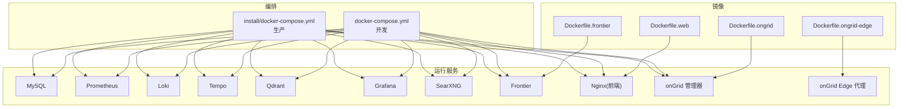
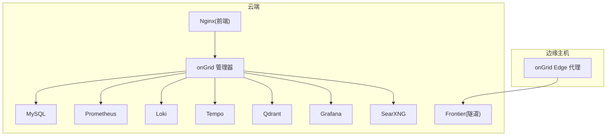
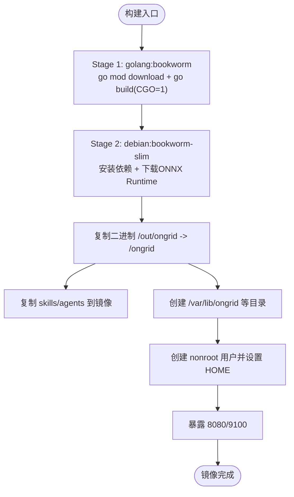
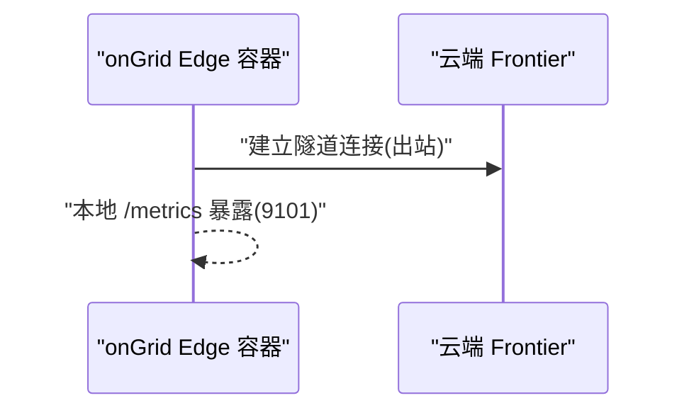
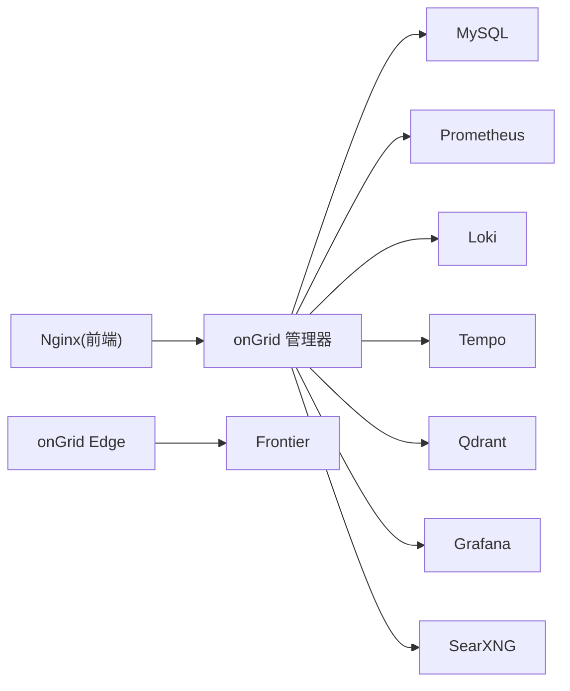
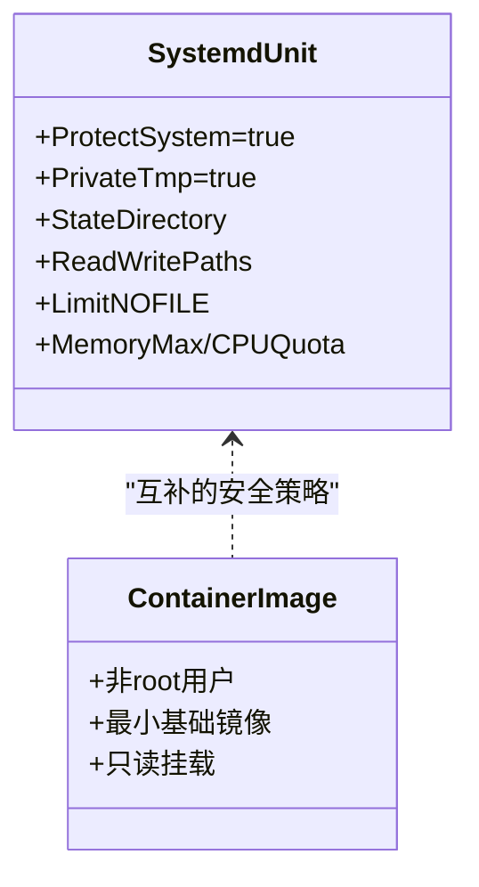
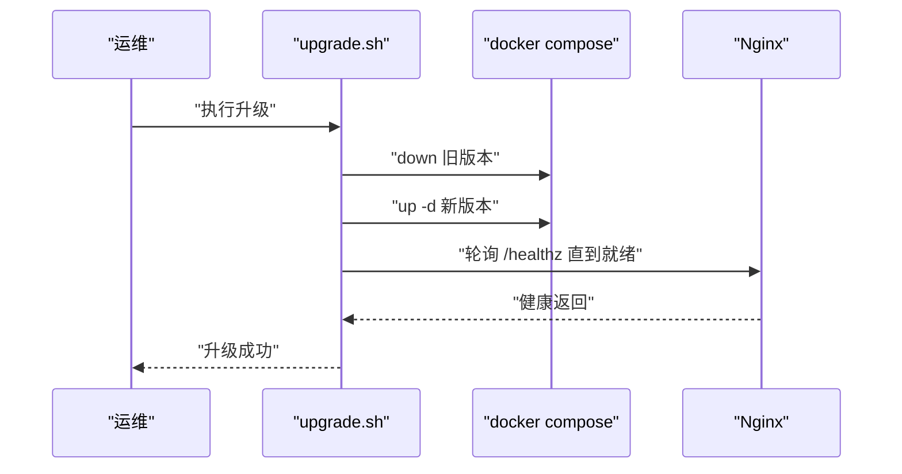

# 容器化部署

<cite>
**本文引用的文件**   
- [deploy/Dockerfile.ongrid](file://deploy/Dockerfile.ongrid)
- [deploy/Dockerfile.ongrid-edge](file://deploy/Dockerfile.ongrid-edge)
- [deploy/Dockerfile.frontier](file://deploy/Dockerfile.frontier)
- [deploy/Dockerfile.web](file://deploy/Dockerfile.web)
- [deploy/docker-compose.yml](file://deploy/docker-compose.yml)
- [deploy/install/docker-compose.yml](file://deploy/install/docker-compose.yml)
- [deploy/README.md](file://deploy/README.md)
- [deploy/install/README.md](file://deploy/install/README.md)
- [deploy/install/systemd/ongrid.service](file://deploy/install/systemd/ongrid.service)
- [deploy/install/systemd/prometheus.service](file://deploy/install/systemd/prometheus.service)
- [deploy/install/systemd/loki.service](file://deploy/install/systemd/loki.service)
- [deploy/install/systemd/tempo.service](file://deploy/install/systemd/tempo.service)
- [deploy/install/systemd/qdrant.service](file://deploy/install/systemd/qdrant.service)
</cite>

## 目录
1. [简介](#简介)
2. [项目结构](#项目结构)
3. [核心组件](#核心组件)
4. [架构总览](#架构总览)
5. [详细组件分析](#详细组件分析)
6. [依赖关系分析](#依赖关系分析)
7. [性能与优化](#性能与优化)
8. [安全加固](#安全加固)
9. [编排与高可用](#编排与高可用)
10. [网络与服务发现](#网络与服务发现)
11. [存储与持久化](#存储与持久化)
12. [日志、监控与可观测性](#日志监控与可观测性)
13. [镜像版本管理与发布流程](#镜像版本管理与发布流程)
14. [故障排查与调试](#故障排查与调试)
15. [在 Kubernetes 中部署 OnGrid](#在-kubernetes-中部署-ongrid)
16. [结论](#结论)

## 简介
本指南面向生产与开发环境，系统化说明 OnGrid 的容器化构建、镜像优化、编排策略、网络与存储配置、安全加固、可观测性集成、版本发布与回滚，以及在 Kubernetes 中的落地方案。文档严格基于仓库内 Dockerfile、Compose 与安装脚本等源码进行分析与总结，确保可操作性与一致性。

## 项目结构
OnGrid 的容器化资产集中在 deploy 目录：
- 多镜像构建定义：Dockerfile.ongrid（云端管理器）、Dockerfile.ongrid-edge（边缘代理）、Dockerfile.frontier（上游 Broker）、Dockerfile.web（前端 SPA + Nginx）
- 本地开发编排：deploy/docker-compose.yml
- 生产式安装编排：deploy/install/docker-compose.yml
- 安装与运维手册：deploy/README.md、deploy/install/README.md
- systemd 单元（非容器形态参考）：deploy/install/systemd/*.service

**图示来源** 
- [deploy/Dockerfile.ongrid:1-231](file://deploy/Dockerfile.ongrid#L1-L231)
- [deploy/Dockerfile.ongrid-edge:1-71](file://deploy/Dockerfile.ongrid-edge#L1-L71)
- [deploy/Dockerfile.frontier:1-52](file://deploy/Dockerfile.frontier#L1-L52)
- [deploy/Dockerfile.web:1-79](file://deploy/Dockerfile.web#L1-L79)
- [deploy/docker-compose.yml:1-397](file://deploy/docker-compose.yml#L1-L397)
- [deploy/install/docker-compose.yml:1-610](file://deploy/install/docker-compose.yml#L1-L610)

**章节来源**
- [deploy/README.md:1-130](file://deploy/README.md#L1-L130)

## 核心组件
- ongrid（云端管理器）：Go 二进制，CGO 启用以加载 ONNX Runtime；最终镜像基于 debian:bookworm-slim，非 root 运行，暴露 HTTP API 与 Prometheus /metrics。
- ongrid-edge（边缘代理）：纯 Go 静态编译，distroless 运行时，仅出站拨号到云端隧道，暴露本地 /metrics。
- frontier（上游 Broker）：singchia/frontier，提供隧道服务端点。
- web（前端 SPA + Nginx）：Node 构建产物嵌入 nginx 镜像，默认提供静态资源与反向代理。

关键特性：
- 多阶段构建与缓存加速（Go build cache、npm cache、apt 重试）
- 代理支持（构建期与运行期）
- 非 root 用户与安全最小权限
- 健康检查与依赖等待（compose）
- 数据持久化（bind-mount 或命名卷）

**章节来源**
- [deploy/Dockerfile.ongrid:1-231](file://deploy/Dockerfile.ongrid#L1-L231)
- [deploy/Dockerfile.ongrid-edge:1-71](file://deploy/Dockerfile.ongrid-edge#L1-L71)
- [deploy/Dockerfile.frontier:1-52](file://deploy/Dockerfile.frontier#L1-L52)
- [deploy/Dockerfile.web:1-79](file://deploy/Dockerfile.web#L1-L79)
- [deploy/docker-compose.yml:1-397](file://deploy/docker-compose.yml#L1-L397)
- [deploy/install/docker-compose.yml:1-610](file://deploy/install/docker-compose.yml#L1-L610)

## 架构总览
OnGrid 采用“云-边”协同架构：
- 云端：管理器（HTTP API + AIops + 遥测聚合）+ 前端（Nginx + SPA）+ 观测栈（Prometheus/Loki/Tempo/Grafana）+ 向量库（Qdrant）+ 搜索（SearXNG）+ 数据库（MySQL）
- 边缘：Edge Agent 作为客户端拨号至云端 Frontier 隧道端口，推送指标/日志/追踪并接收指令

**图示来源** 
- [deploy/docker-compose.yml:1-397](file://deploy/docker-compose.yml#L1-L397)
- [deploy/install/docker-compose.yml:1-610](file://deploy/install/docker-compose.yml#L1-L610)

## 详细组件分析

### ongrid 镜像（云端管理器）
- 构建阶段
  - 使用 golang:1.25-bookworm 作为 builder，启用 CGO 以链接 fastembed-go 所需的 libonnxruntime
  - 通过 --mount=type=cache 缓存 go mod 与编译产物，显著缩短增量构建时间
  - 输出静态二进制到 /out/ongrid
- 运行阶段
  - 基于 debian:bookworm-slim，安装必要系统库（git、openssh-client、ca-certificates、tzdata、libgomp1、iputils-ping、python3/pip 等）
  - 下载并安装固定版本的 ONNX Runtime 共享库，设置 ONNX_PATH
  - 复制 skills/agents 内置包，创建 /var/lib/ongrid 工作目录
  - 以 nonroot 用户运行，HOME 指向状态目录避免写入冲突
  - 暴露 8080(HTTP)、9100(metrics)

**图示来源** 
- [deploy/Dockerfile.ongrid:1-231](file://deploy/Dockerfile.ongrid#L1-L231)

**章节来源**
- [deploy/Dockerfile.ongrid:1-231](file://deploy/Dockerfile.ongrid#L1-L231)

### ongrid-edge 镜像（边缘代理）
- 构建阶段
  - 使用 golang:1.25-alpine，CGO_ENABLED=0 生成纯静态二进制
  - 输出 /out/ongrid-edge
- 运行阶段
  - 基于 gcr.io/distroless/static-debian12:nonroot，最小攻击面
  - 仅暴露 9101 用于本地 /metrics；正常模式不监听入站流量，仅出站连接云端

**图示来源** 
- [deploy/Dockerfile.ongrid-edge:1-71](file://deploy/Dockerfile.ongrid-edge#L1-L71)

**章节来源**
- [deploy/Dockerfile.ongrid-edge:1-71](file://deploy/Dockerfile.ongrid-edge#L1-L71)

### frontier 镜像（上游 Broker）
- 使用 golang:1.24-alpine 构建，alpine 作为运行时
- 暴露 40011(服务绑定) 与 40012(边缘拨号)

**章节来源**
- [deploy/Dockerfile.frontier:1-52](file://deploy/Dockerfile.frontier#L1-L52)

### web 镜像（前端 SPA + Nginx）
- 构建阶段
  - node:20-alpine 构建 SPA，npm ci 与 vite 缓存加速
- 运行阶段
  - nginx:1.27-alpine 承载静态资源与反向代理
  - 默认配置随镜像分发，生产通过 bind-mount 覆盖

**章节来源**
- [deploy/Dockerfile.web:1-79](file://deploy/Dockerfile.web#L1-L79)

## 依赖关系分析
- 构建期依赖
  - Go 模块缓存与编译缓存（--mount=type=cache）
  - npm 包缓存与 vite 构建缓存
  - apt 源与 ONNX Runtime 下载（带重试）
- 运行期依赖
  - MySQL（默认后端，compose 健康检查后启动 ongrid）
  - Prometheus/Loki/Tempo/Qdrant/Grafana/SearXNG/Frontier（内部网络通信）
  - 可选外部观测栈（通过环境变量切换）

**图示来源** 
- [deploy/docker-compose.yml:1-397](file://deploy/docker-compose.yml#L1-L397)
- [deploy/install/docker-compose.yml:1-610](file://deploy/install/docker-compose.yml#L1-L610)

**章节来源**
- [deploy/docker-compose.yml:1-397](file://deploy/docker-compose.yml#L1-L397)
- [deploy/install/docker-compose.yml:1-610](file://deploy/install/docker-compose.yml#L1-L610)

## 性能与优化
- 构建优化
  - Go 模块与编译缓存：--mount=type=cache 复用，无变更时增量构建从分钟级降至秒级
  - npm/vite 缓存：/root/.npm 与 /app/node_modules/.vite 缓存
  - apt 重试机制：Acquire::Retries 与循环重试，降低偶发失败影响
- 运行优化
  - 非 root 运行减少特权开销
  - 按需安装依赖，剔除不必要工具链
  - 将大体积模型与工具落盘持久化，避免镜像膨胀

**章节来源**
- [deploy/Dockerfile.ongrid:59-86](file://deploy/Dockerfile.ongrid#L59-L86)
- [deploy/Dockerfile.ongrid:149-158](file://deploy/Dockerfile.ongrid#L149-L158)
- [deploy/Dockerfile.web:53-65](file://deploy/Dockerfile.web#L53-L65)

## 安全加固
- 非 root 运行
  - ongrid：debian bookworm-slim 创建 nonroot(uid/gid 65532)，HOME 指向状态目录
  - ongrid-edge：distroless static-debian12:nonroot
  - frontier：alpine 创建非 root 用户
- 文件系统隔离
  - systemd 单元示例：ProtectSystem=true、PrivateTmp=true、StateDirectory/LogsDirectory 白名单
- 最小权限与能力
  - 仅授予 CAP_NET_BIND_SERVICE（systemd 模式），限制 SUID/SGID、内核参数访问等
- 网络最小暴露
  - ongrid-edge 仅暴露本地 /metrics；对外统一由 Nginx 反代并通过认证门控

**图示来源** 
- [deploy/install/systemd/ongrid.service:1-75](file://deploy/install/systemd/ongrid.service#L1-L75)
- [deploy/install/systemd/prometheus.service:1-38](file://deploy/install/systemd/prometheus.service#L1-L38)
- [deploy/install/systemd/loki.service:1-32](file://deploy/install/systemd/loki.service#L1-L32)
- [deploy/install/systemd/tempo.service:1-32](file://deploy/install/systemd/tempo.service#L1-L32)
- [deploy/install/systemd/qdrant.service:1-37](file://deploy/install/systemd/qdrant.service#L1-L37)

**章节来源**
- [deploy/Dockerfile.ongrid:218-231](file://deploy/Dockerfile.ongrid#L218-L231)
- [deploy/Dockerfile.ongrid-edge:62-71](file://deploy/Dockerfile.ongrid-edge#L62-L71)
- [deploy/Dockerfile.frontier:37-52](file://deploy/Dockerfile.frontier#L37-L52)
- [deploy/install/systemd/ongrid.service:31-75](file://deploy/install/systemd/ongrid.service#L31-L75)

## 编排与高可用
- 健康检查与依赖等待
  - MySQL 健康检查通过后 ongrid 才启动
  - Nginx 依赖 ongrid 启动
- 滚动更新
  - 通过 compose 替换镜像并重启服务实现滚动升级
  - 生产安装脚本支持 upgrade.sh 原子化流程（先 down、再 up、healthz 校验）
- 资源限制
  - systemd 单元示例：LimitNOFILE、MemoryMax、CPUQuota
  - 容器可通过 Compose/K8s 的 resources 字段限制 CPU/内存

**图示来源** 
- [deploy/install/README.md:278-292](file://deploy/install/README.md#L278-L292)
- [deploy/docker-compose.yml:50-55](file://deploy/docker-compose.yml#L50-L55)

**章节来源**
- [deploy/docker-compose.yml:50-55](file://deploy/docker-compose.yml#L50-L55)
- [deploy/install/README.md:278-292](file://deploy/install/README.md#L278-L292)

## 网络与服务发现
- 开发环境
  - 自定义 bridge 网络 ongrid_net，服务间通过容器名解析
  - 部分端口映射到宿主机（如 Prometheus UI、Grafana、Tunnel 端口）
- 生产环境
  - 仅暴露必要端口（HTTPS/HTTP 跳转/Tunnel/Metrics），其余服务保持 docker 内网
  - 通过 .env 变量控制端口与路由前缀
- 服务发现
  - Docker 内置 DNS：服务名即主机名（如 mysql、prometheus、frontier）
  - 可选外部观测栈：通过环境变量指向外部地址

**章节来源**
- [deploy/docker-compose.yml:394-397](file://deploy/docker-compose.yml#L394-L397)
- [deploy/install/docker-compose.yml:339-387](file://deploy/install/docker-compose.yml#L339-L387)

## 存储与持久化
- 开发环境
  - 使用命名卷（mysql_data、prometheus_data、grafana_data、qdrant_data、loki_data、tempo_data）
- 生产环境
  - 所有有状态服务数据 bind-mount 到宿主机目录（默认 /opt/ongrid/data/<service>）
  - manager 日志目录独立（/opt/ongrid/logs）
  - 前端静态资源与证书目录独立（/opt/ongrid/ongrid-web）
- 迁移与备份
  - 提供自动/手动迁移脚本，兼容 v0.7.45 前后命名卷到 bind-mount 的变化
  - 推荐对关键目录做快照或归档

**章节来源**
- [deploy/docker-compose.yml:386-397](file://deploy/docker-compose.yml#L386-L397)
- [deploy/install/docker-compose.yml:601-610](file://deploy/install/docker-compose.yml#L601-L610)
- [deploy/install/README.md:368-443](file://deploy/install/README.md#L368-L443)

## 日志、监控与可观测性
- 日志
  - manager 进程输出 JSON 日志到 /var/log/ongrid，便于宿主机采集器抓取
  - Loki 作为日志后端，通过 Nginx 反代与认证门控接入
- 指标
  - Prometheus 作为核心 TSDB，接收 manager remote_write 与 open-set 样本
  - ongrid 暴露 /metrics，Prometheus 定期抓取
- 追踪
  - Tempo 作为追踪后端，manager 通过 OTLP HTTP 上报
- Grafana
  - 预置数据源与仪表盘模板，匿名查看者模式配合 Nginx 会话校验

**章节来源**
- [deploy/install/docker-compose.yml:259-312](file://deploy/install/docker-compose.yml#L259-L312)
- [deploy/install/docker-compose.yml:394-434](file://deploy/install/docker-compose.yml#L394-L434)
- [deploy/install/docker-compose.yml:436-485](file://deploy/install/docker-compose.yml#L436-L485)
- [deploy/install/docker-compose.yml:548-599](file://deploy/install/docker-compose.yml#L548-L599)

## 镜像版本管理与发布流程
- 构建参数
  - VERSION 注入二进制版本信息
  - GOPROXY 与代理环境变量支持企业网络
- 构建与打包
  - Makefile 封装 docker build 与 fetch-* 目标，统一代理与平台参数
  - 发布包包含 ongrid 镜像 tarball 与 install/upgrade 脚本
- 升级流程
  - 要求 operator 将已安装的 .env 拷贝到升级包目录
  - 升级脚本按优先级解析路径与配置，执行 down/up/healthz 校验
  - 失败不回写 .env，保证幂等与可重试

**章节来源**
- [deploy/Dockerfile.ongrid:20-56](file://deploy/Dockerfile.ongrid#L20-L56)
- [deploy/Dockerfile.ongrid-edge:20-48](file://deploy/Dockerfile.ongrid-edge#L20-48)
- [deploy/install/README.md:261-292](file://deploy/install/README.md#L261-L292)

## 故障排查与调试
- 常见症状与定位
  - /healthz 不通：检查 .env 中 JWT_SECRET 与 DB_DSN
  - AI Chat 接口 500：确认 OPENAI_API_KEY 是否配置
  - Edge 连不上：检查防火墙与 Tunnel 端口可达性
  - host-gateway 报错：Docker 引擎过旧，需设置 ONGRID_HOST_GATEWAY 为桥网关 IP
- 诊断命令
  - docker compose ps、docker logs、curl -kfsS https://localhost:8443/healthz
  - 进入容器验证 Prometheus/Loki/Tempo 健康端点

**章节来源**
- [deploy/install/README.md:564-577](file://deploy/install/README.md#L564-L577)
- [deploy/README.md:86-98](file://deploy/README.md#L86-L98)

## 在 Kubernetes 中部署 OnGrid
以下清单为概念性指导，结合仓库现有 Compose 与 systemd 单元进行抽象映射。实际部署建议：
- 镜像
  - ongrid、ongrid-edge、web(frontier 使用 singchia/frontier 官方镜像)
- 资源对象
  - Deployment：onGrid 管理器、Nginx 前端、各观测组件（Prometheus/Loki/Tempo/Qdrant/Grafana）
  - Service：对外暴露 HTTPS/HTTP 跳转/Tunnel/Metrics；内部服务 ClusterIP
  - ConfigMap/Secret：集中管理 .env 类配置与敏感信息
  - PersistentVolumeClaim：对应各数据目录（MySQL/Prom/Loki/Tempo/Qdrant/Grafana）
  - Ingress：TLS 终止与路径路由（/api、/grafana、/prometheus、/edge 等）
- 健康检查
  - livenessProbe：/healthz 或各组件健康端点
  - readinessProbe：/ready 或业务就绪信号
- 资源限制
  - requests/limits 设定 CPU/内存，参考 systemd 单元的 LimitNOFILE/MemoryMax/CPUQuota 经验值
- 滚动更新
  - strategy: rollingUpdate 配置 maxUnavailable/maxSurge
- 网络与服务发现
  - 使用 Service 名称作为 DNS 解析（如 http://prometheus:9090/prometheus）
- 存储与持久化
  - PVC 绑定到各数据目录，确保 Pod 重建后数据不丢失
- 安全加固
  - 非 root 运行、最小权限、只读根文件系统（securityContext）
  - 网络策略限制非必要访问
- 可观测性
  - 收集容器 stdout/stderr 日志，转发至 Loki
  - 暴露 /metrics 给 Prometheus 抓取
  - 开启 OTLP 上报至 Tempo

[本节为概念性指导，未直接分析具体源码文件]

## 结论
OnGrid 的容器化方案在多阶段构建、镜像瘦身、代理适配、非 root 运行与健康检查等方面具备良好实践。生产部署推荐使用 bind-mount 的数据布局与统一的安装/升级脚本，结合外部观测栈提升可维护性与安全性。在 Kubernetes 环境中，可将现有 Compose 编排映射为原生资源对象，遵循健康检查、资源限制、滚动更新与安全加固的最佳实践。