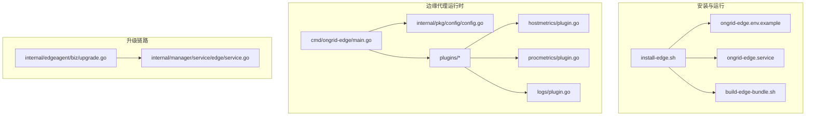
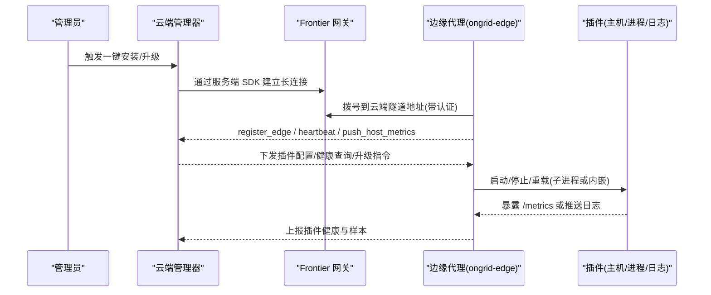
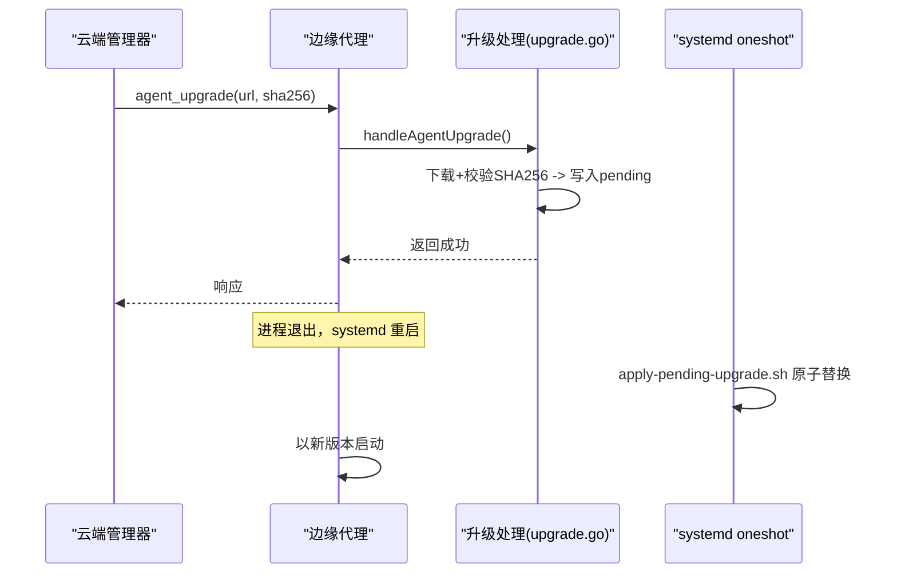
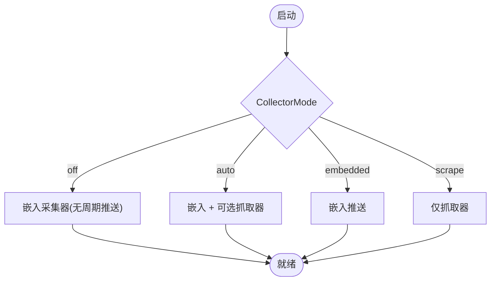
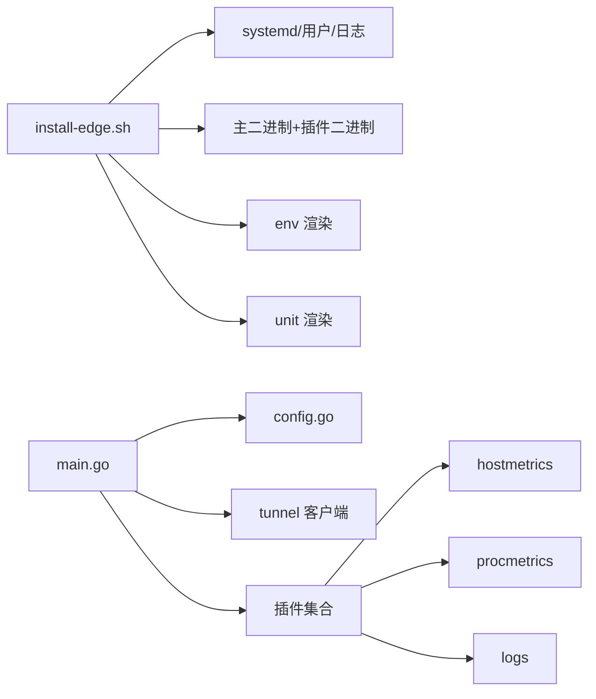

# 边缘代理部署

<cite>
**本文引用的文件**   
- [install-edge.sh](file://deploy/install/edge/install-edge.sh)
- [ongrid-edge.env.example](file://deploy/install/edge/ongrid-edge.env.example)
- [ongrid-edge.service](file://deploy/install/edge/ongrid-edge.service)
- [build-edge-bundle.sh](file://deploy/install/edge/build-edge-bundle.sh)
- [main.go（边缘入口）](file://cmd/ongrid-edge/main.go)
- [config.go（配置加载）](file://internal/pkg/config/config.go)
- [hostmetrics/plugin.go](file://internal/edgeagent/plugins/hostmetrics/plugin.go)
- [procmetrics/plugin.go](file://internal/edgeagent/plugins/procmetrics/plugin.go)
- [logs/plugin.go](file://internal/edgeagent/plugins/logs/plugin.go)
- [upgrade.go（边缘升级处理）](file://internal/edgeagent/biz/upgrade.go)
- [service.go（管理器升级调度）](file://internal/manager/service/edge/service.go)
</cite>

## 目录
1. [简介](#简介)
2. [项目结构](#项目结构)
3. [核心组件](#核心组件)
4. [架构总览](#架构总览)
5. [详细组件分析](#详细组件分析)
6. [依赖关系分析](#依赖关系分析)
7. [性能与资源限制](#性能与资源限制)
8. [故障排查指南](#故障排查指南)
9. [安全最佳实践](#安全最佳实践)
10. [结论](#结论)
11. [附录：批量部署与自动化示例](#附录批量部署与自动化示例)

## 简介
本指南面向运维与平台工程师，聚焦于“边缘代理”的专门部署。内容覆盖安装脚本用法、与云端管理器的通信与安全隧道、服务与环境变量配置、数据采集插件（主机指标、进程指标、日志采集等）、批量部署方案、升级与维护流程、性能调优与资源限制、常见问题诊断以及安全与访问控制建议。

## 项目结构
与边缘代理部署直接相关的核心文件位于 deploy/install/edge 与 internal/edgeagent/plugins 等目录；边缘代理二进制入口在 cmd/ongrid-edge/main.go，配置加载在 internal/pkg/config/config.go。

**图示来源** 
- [install-edge.sh:1-485](file://deploy/install/edge/install-edge.sh#L1-L485)
- [ongrid-edge.env.example:1-44](file://deploy/install/edge/ongrid-edge.env.example#L1-L44)
- [ongrid-edge.service:1-51](file://deploy/install/edge/ongrid-edge.service#L1-L51)
- [build-edge-bundle.sh:1-84](file://deploy/install/edge/build-edge-bundle.sh#L1-L84)
- [main.go（边缘入口）:1-423](file://cmd/ongrid-edge/main.go#L1-L423)
- [config.go（配置加载）:1-592](file://internal/pkg/config/config.go#L1-L592)
- [hostmetrics/plugin.go:1-277](file://internal/edgeagent/plugins/hostmetrics/plugin.go#L1-L277)
- [procmetrics/plugin.go:1-128](file://internal/edgeagent/plugins/procmetrics/plugin.go#L1-L128)
- [logs/plugin.go:1-54](file://internal/edgeagent/plugins/logs/plugin.go#L1-L54)
- [upgrade.go（边缘升级处理）:1-93](file://internal/edgeagent/biz/upgrade.go#L1-L93)
- [service.go（管理器升级调度）:120-146](file://internal/manager/service/edge/service.go#L120-L146)

**章节来源**
- [install-edge.sh:1-485](file://deploy/install/edge/install-edge.sh#L1-L485)
- [main.go（边缘入口）:1-423](file://cmd/ongrid-edge/main.go#L1-L423)
- [config.go（配置加载）:1-592](file://internal/pkg/config/config.go#L1-L592)

## 核心组件
- 安装脚本 install-edge.sh：负责检测系统环境、安装二进制与插件、渲染环境变量与服务单元、创建用户与目录、执行自检并启动服务。
- 服务单元 ongrid-edge.service：以非 root 用户运行，严格沙箱化，仅开放必要读写路径，并在每次重启前触发升级应用钩子。
- 环境变量模板 ongrid-edge.env.example：定义连接云端地址、认证密钥、采集模式、插件路径、工作目录、升级阶段目录等关键参数。
- 构建打包 build-edge-bundle.sh：将松散的各架构二进制打包为 ADR-024 兼容的升级包，生成 MANIFEST 与校验信息。
- 边缘代理主程序 main.go：加载配置、建立隧道、注册能力与插件、提供本地 /metrics 与 /healthz、协调插件生命周期与健康上报。
- 配置加载 config.go：统一从环境变量解析 Edge 相关配置项（如云端地址、AccessKey/SecretKey、采集模式、抓取间隔等）。

**章节来源**
- [install-edge.sh:1-485](file://deploy/install/edge/install-edge.sh#L1-L485)
- [ongrid-edge.service:1-51](file://deploy/install/edge/ongrid-edge.service#L1-L51)
- [ongrid-edge.env.example:1-44](file://deploy/install/edge/ongrid-edge.env.example#L1-L44)
- [build-edge-bundle.sh:1-84](file://deploy/install/edge/build-edge-bundle.sh#L1-L84)
- [main.go（边缘入口）:1-423](file://cmd/ongrid-edge/main.go#L1-L423)
- [config.go（配置加载）:1-592](file://internal/pkg/config/config.go#L1-L592)

## 架构总览
边缘代理通过隧道客户端连接云端管理器，周期性或按需上报主机指标、进程指标与日志；同时支持远程整包升级，由 systemd 特权 oneshot 单元在重启前完成原子替换。

**图示来源** 
- [main.go（边缘入口）:80-120](file://cmd/ongrid-edge/main.go#L80-L120)
- [config.go（配置加载）:330-364](file://internal/pkg/config/config.go#L330-L364)
- [hostmetrics/plugin.go:1-120](file://internal/edgeagent/plugins/hostmetrics/plugin.go#L1-L120)
- [procmetrics/plugin.go:1-128](file://internal/edgeagent/plugins/procmetrics/plugin.go#L1-L128)
- [logs/plugin.go:1-54](file://internal/edgeagent/plugins/logs/plugin.go#L1-L54)
- [service.go（管理器升级调度）:120-146](file://internal/manager/service/edge/service.go#L120-L146)

## 详细组件分析

### 安装脚本使用方法与参数
- 基本用法
  - 进入解压后的 edge bundle 目录后执行：sudo ./install-edge.sh
  - 卸载：sudo ./install-edge.sh --uninstall
- 选项
  - --prefix=PATH：指定安装根目录（默认 /mnt/data/tools-temp），所有 bin/lib/etc/var 均嵌套在该命名空间下，便于整体清理。
  - --uninstall：停止/禁用服务并移除文件（保留日志目录以便事后分析）。
  - -h/--help：打印帮助与必填参数说明。
- 必填参数（环境变量或交互式输入）
  - ONGRID_CLOUD_ADDR：云端隧道地址（例如 ongrid.example.com:40012）
  - EDGE_ACCESS_KEY：来自云端的 Access Key
  - EDGE_SECRET_KEY：来自云端的 Secret Key
- 安装行为要点
  - 自动检测 OS/Arch，选择对应二进制；若未找到则回退到 ./ongrid-edge。
  - 创建专用系统用户 ongrid-edge，加入必要的只读组（adm、systemd-journal）以读取日志。
  - 安装主二进制与插件二进制（promtail、node_exporter、process_exporter、数据库导出器等），并预创建状态与工作目录。
  - 渲染环境变量文件与 systemd 单元，启用并重启服务，输出自检结果与最后日志。
  - 自检包括：插件二进制存在性、状态目录可写性、journald 可读性、数据面可达性。

**章节来源**
- [install-edge.sh:1-485](file://deploy/install/edge/install-edge.sh#L1-L485)

### 服务配置与环境变量设置
- 服务单元 ongrid-edge.service
  - 以非 root 用户运行，开启严格沙箱（ProtectSystem=strict），仅允许读写状态与日志目录。
  - 通过 Wants/After 依赖 ongrid-edge-upgrade.service，确保每次（重）启动前先执行升级应用钩子。
  - 使用 EnvironmentFile 加载渲染后的 env 文件，ExecStart 指向 PREFIX 下的二进制。
- 环境变量（由 install-edge.sh 基于模板渲染）
  - 连接与认证：ONGRID_EDGE_CLOUD_ADDR、ONGRID_EDGE_ACCESS_KEY、ONGRID_EDGE_SECRET_KEY
  - 采集模式与间隔：ONGRID_EDGE_COLLECTOR_MODE（off/auto/embedded/scrape）、ONGRID_EDGE_COLLECTOR_INTERVAL
  - 抓取配置路径：ONGRID_EDGE_SCRAPE_CONFIG_FILE
  - 插件路径与工作目录：ONGRID_EDGE_PLUGIN_BIN_DIR、ONGRID_EDGE_PLUGIN_WORK_DIR
  - 升级阶段目录：ONGRID_EDGE_UPGRADE_STAGE_DIR
  - 插件通用标识：ONGRID_EDGE_ID（用于注入标签）
  - 日志插件开关与目标：ONGRID_EDGE_PLUGIN_LOGS_ENABLED、ENDPOINT、AUTH_USER/AUTH_PASS（可选）
- 配置加载
  - 边缘侧通过 config.Load() 解析上述环境变量，形成 EdgeConfig 供主程序使用。

**章节来源**
- [ongrid-edge.service:1-51](file://deploy/install/edge/ongrid-edge.service#L1-L51)
- [ongrid-edge.env.example:1-44](file://deploy/install/edge/ongrid-edge.env.example#L1-L44)
- [config.go（配置加载）:330-364](file://internal/pkg/config/config.go#L330-L364)

### 与云端管理器的通信与安全隧道
- 连接参数
  - CloudAddr、AccessKey、SecretKey 由环境变量提供，主程序构造 tunnel.Client 进行拨号。
- 能力注册与心跳
  - 主程序注册服务处理器、插件健康上报、任务名（TaskName）上报等。
- 插件配置拉取
  - 通过隧道 RPC get_plugin_configs 获取插件配置，失败时回退到本地 env 快照，保证离线可用。
- 升级通道
  - 管理器通过 UpgradeAgent 调用边缘 MethodAgentUpgrade，边缘下载包至 stage 目录并标记 pending，随后退出，systemd 在下次启动前执行 apply-pending-upgrade.sh 完成原子替换。

**图示来源** 
- [main.go（边缘入口）:150-187](file://cmd/ongrid-edge/main.go#L150-L187)
- [upgrade.go（边缘升级处理）:1-93](file://internal/edgeagent/biz/upgrade.go#L1-L93)
- [service.go（管理器升级调度）:120-146](file://internal/manager/service/edge/service.go#L120-L146)
- [ongrid-edge.service:1-51](file://deploy/install/edge/ongrid-edge.service#L1-L51)

**章节来源**
- [main.go（边缘入口）:80-120](file://cmd/ongrid-edge/main.go#L80-L120)
- [config.go（配置加载）:330-364](file://internal/pkg/config/config.go#L330-L364)
- [upgrade.go（边缘升级处理）:1-93](file://internal/edgeagent/biz/upgrade.go#L1-L93)
- [service.go（管理器升级调度）:120-146](file://internal/manager/service/edge/service.go#L120-L146)

### 数据采集功能配置
- 主机指标（hostmetrics 插件）
  - 子进程 node_exporter，默认监听 :9102，支持 collectors_enabled/disabled 与 extra_args。
  - 内嵌补充指标生产者，向 textfile 目录写入 conntrack 指标，避免内核路径变更导致面板空白。
- 进程指标（procmetrics 插件）
  - 子进程 process-exporter，默认监听 :9256，支持 process_names 分组规则（按 comm 或正则）。
- 日志采集（logs 插件）
  - 子进程 promtail，根据 manager 下发的 PluginConfig 渲染配置文件，推送到管理器的 Loki 端点。
  - 支持 journald 与文件 tail，位置文件与配置同目录，避免重启丢失游标。
- 采集模式（CollectorMode）
  - off：默认，不周期推送，RPC 仍可用；适合配合 hostmetrics/procmetrics 插件由管理器直接抓取。
  - auto：兼容模式，嵌入 gopsutil 推送 + 可选抓取器。
  - embedded：仅嵌入推送。
  - scrape：仅多目标 HTTP 抓取（需 scrape.yaml）。

**图示来源** 
- [main.go（边缘入口）:316-376](file://cmd/ongrid-edge/main.go#L316-L376)
- [config.go（配置加载）:330-364](file://internal/pkg/config/config.go#L330-L364)
- [hostmetrics/plugin.go:1-120](file://internal/edgeagent/plugins/hostmetrics/plugin.go#L1-L120)
- [procmetrics/plugin.go:1-128](file://internal/edgeagent/plugins/procmetrics/plugin.go#L1-L128)
- [logs/plugin.go:1-54](file://internal/edgeagent/plugins/logs/plugin.go#L1-L54)

**章节来源**
- [hostmetrics/plugin.go:1-277](file://internal/edgeagent/plugins/hostmetrics/plugin.go#L1-L277)
- [procmetrics/plugin.go:1-128](file://internal/edgeagent/plugins/procmetrics/plugin.go#L1-L128)
- [logs/plugin.go:1-54](file://internal/edgeagent/plugins/logs/plugin.go#L1-L54)
- [main.go（边缘入口）:316-376](file://cmd/ongrid-edge/main.go#L316-L376)
- [config.go（配置加载）:330-364](file://internal/pkg/config/config.go#L330-L364)

### 升级与维护操作
- 整包升级（ADR-024）
  - 管理器侧通过 build-edge-bundle.sh 生成包含 MANIFEST 的 tar.gz 包，并附带 sha256。
  - 前端 UI 提供升级弹窗，输入 URL 与 sha256，后端调用 UpgradeAgent 下发。
  - 边缘侧下载并校验，写入 pending，退出后由 systemd oneshot 执行 apply-pending-upgrade.sh 完成原子替换。
- 维护建议
  - 升级前确认目标版本与架构匹配。
  - 升级后观察心跳与插件健康，必要时回滚到 previous。

**章节来源**
- [build-edge-bundle.sh:1-84](file://deploy/install/edge/build-edge-bundle.sh#L1-L84)
- [service.go（管理器升级调度）:120-146](file://internal/manager/service/edge/service.go#L120-L146)
- [upgrade.go（边缘升级处理）:1-93](file://internal/edgeagent/biz/upgrade.go#L1-L93)
- [ongrid-edge.service:1-51](file://deploy/install/edge/ongrid-edge.service#L1-L51)

### 批量部署与自动化脚本示例
- 批量思路
  - 准备统一的 install-edge.sh 与所需二进制（含插件），通过 SSH 分发到目标主机。
  - 使用 Ansible/Puppet/Chef 或自研脚本循环执行安装命令，传入 --prefix 与认证参数。
  - 安装完成后检查 systemctl is-active 与 journalctl 输出，记录结果。
- 参考命令（概念性）
  - 在每台目标主机上执行：sudo ./install-edge.sh --prefix=/opt/edge --access-key=... --secret-key=... --cloud-addr=...
  - 或使用环境变量提前注入：export ONGRID_CLOUD_ADDR=... && export EDGE_ACCESS_KEY=... && export EDGE_SECRET_KEY=... && sudo ./install-edge.sh --prefix=/opt/edge

[本节为概念性指导，无需代码片段]

## 依赖关系分析
- 安装脚本依赖
  - systemd（Linux）、useradd/usermod、journalctl、runuser/sudo、sha256sum、tar 等基础工具。
- 运行时依赖
  - 插件二进制：promtail、node_exporter、process_exporter、数据库导出器、auditbeat、otelcol-contrib（可选）。
  - 系统权限：对 /var/log/journal 的只读访问（systemd-journal 组成员）。
- 网络依赖
  - 云端隧道地址可达（TCP 443 或指定端口），数据面端点（如 Loki/Tempo）可通过管理器 PublicURL 访问。

**图示来源** 
- [install-edge.sh:1-485](file://deploy/install/edge/install-edge.sh#L1-L485)
- [main.go（边缘入口）:1-120](file://cmd/ongrid-edge/main.go#L1-L120)
- [config.go（配置加载）:1-120](file://internal/pkg/config/config.go#L1-L120)
- [hostmetrics/plugin.go:1-120](file://internal/edgeagent/plugins/hostmetrics/plugin.go#L1-L120)
- [procmetrics/plugin.go:1-128](file://internal/edgeagent/plugins/procmetrics/plugin.go#L1-L128)
- [logs/plugin.go:1-54](file://internal/edgeagent/plugins/logs/plugin.go#L1-L54)

**章节来源**
- [install-edge.sh:1-485](file://deploy/install/edge/install-edge.sh#L1-L485)
- [main.go（边缘入口）:1-120](file://cmd/ongrid-edge/main.go#L1-L120)
- [config.go（配置加载）:1-120](file://internal/pkg/config/config.go#L1-L120)

## 性能与资源限制
- 采集间隔
  - 通过 ONGRID_EDGE_COLLECTOR_INTERVAL 调整嵌入采集器采样频率（默认 10s）。
  - scrape 模式下每个目标自带 interval，注意不要过短造成 I/O 压力。
- 插件端口与并发
  - hostmetrics 默认 :9102，procmetrics 默认 :9256，避免与宿主其他服务冲突。
  - 合理限制 collectors_enabled 列表，减少不必要的子系统扫描。
- 日志采集
  - logs 插件推送频率受 Promtail 配置影响，建议结合磁盘与网络带宽评估。
- 资源隔离
  - systemd 沙箱 ProtectSystem=strict + ReadWritePaths 限定，避免越权访问。
  - 如需更细粒度限制，可在 systemd 层追加 MemoryLimit/CPUQuota 等（视发行版支持）。

[本节为通用指导，无需具体文件分析]

## 故障排查指南
- 安装后无数据
  - 检查插件二进制是否齐全且可执行。
  - 验证状态目录对 ongrid-edge 用户可写。
  - 确认 journald 可读（systemd-journal 组成员）。
  - 探测数据面主机 TCP 连通性。
- 无法连接云端
  - 核对 ONGRID_CLOUD_ADDR、EDGE_ACCESS_KEY、EDGE_SECRET_KEY。
  - 检查防火墙与代理设置，确保隧道端口可达。
- 升级失败
  - 确认 URL 可达且 sha256 正确。
  - 查看 stage 目录 pending 文件与 apply 日志。
  - 必要时手动回滚到 previous。

**章节来源**
- [install-edge.sh:393-466](file://deploy/install/edge/install-edge.sh#L393-L466)
- [upgrade.go（边缘升级处理）:1-93](file://internal/edgeagent/biz/upgrade.go#L1-L93)

## 安全最佳实践
- 最小权限原则
  - 使用专用系统用户运行，仅授予必要只读组（adm、systemd-journal）。
  - 通过 ReadWritePaths 限制可写目录，ProtectSystem=strict 保护系统目录。
- 认证与传输
  - 使用强随机 AccessKey/SecretKey，定期轮换。
  - 确保管理器 PublicURL 使用 HTTPS，边缘侧证书校验策略一致。
- 审计与合规
  - 启用 audit 插件（Linux），将审计日志纳入 Loki 集中存储。
  - 保留升级前后版本信息与 MANIFEST，便于追溯。

**章节来源**
- [install-edge.sh:159-173](file://deploy/install/edge/install-edge.sh#L159-L173)
- [ongrid-edge.service:1-51](file://deploy/install/edge/ongrid-edge.service#L1-L51)
- [config.go（配置加载）:330-364](file://internal/pkg/config/config.go#L330-L364)

## 结论
通过 install-edge.sh 提供的标准化安装流程、严格的 systemd 沙箱与插件化架构，边缘代理能够在多种环境下稳定运行，并与云端管理器实现安全可靠的通信与远程升级。结合合理的采集模式与资源限制，可有效平衡观测性与系统开销。

[本节为总结，无需具体文件分析]

## 附录：批量部署与自动化示例
- 使用 Ansible 批量安装（概念性步骤）
  - 将 install-edge.sh 与所需二进制同步到目标主机。
  - 通过 template 模块渲染 .env 或直接传递环境变量。
  - 执行 shell 模块调用 install-edge.sh，并收集 systemctl status 与 journalctl 输出。
- 使用 Shell 循环（概念性步骤）
  - 遍历主机清单，逐台执行安装命令，记录成功/失败与日志摘要。
  - 安装后执行自检逻辑（插件存在性、状态目录可写、journald 可读、数据面可达）。

[本节为概念性指导，无需代码片段]