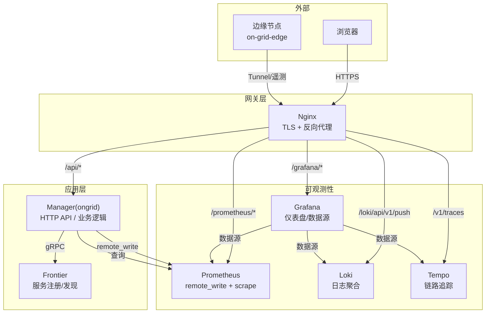
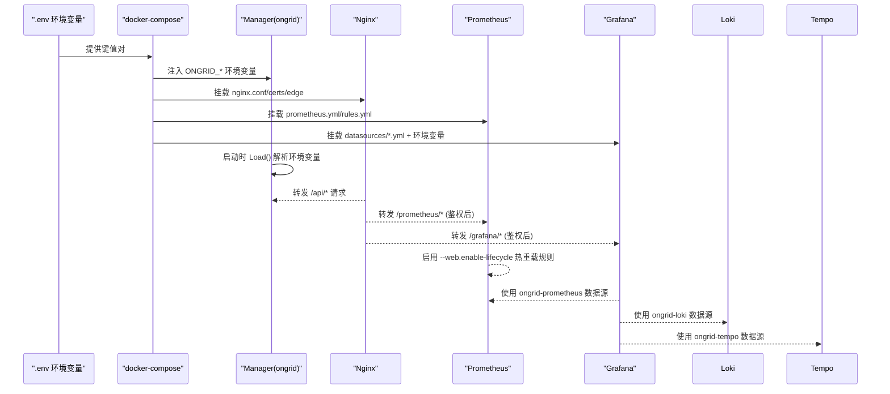
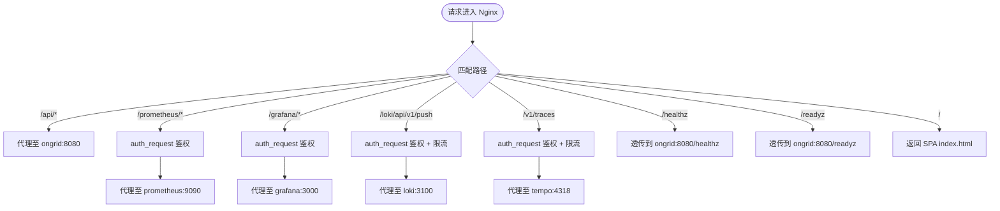
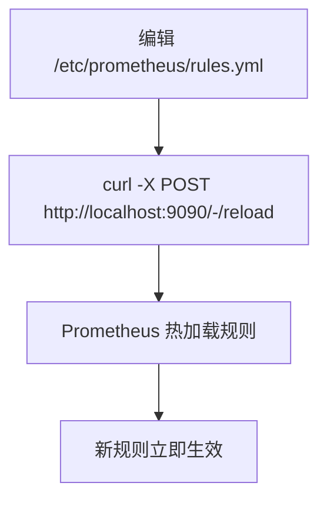
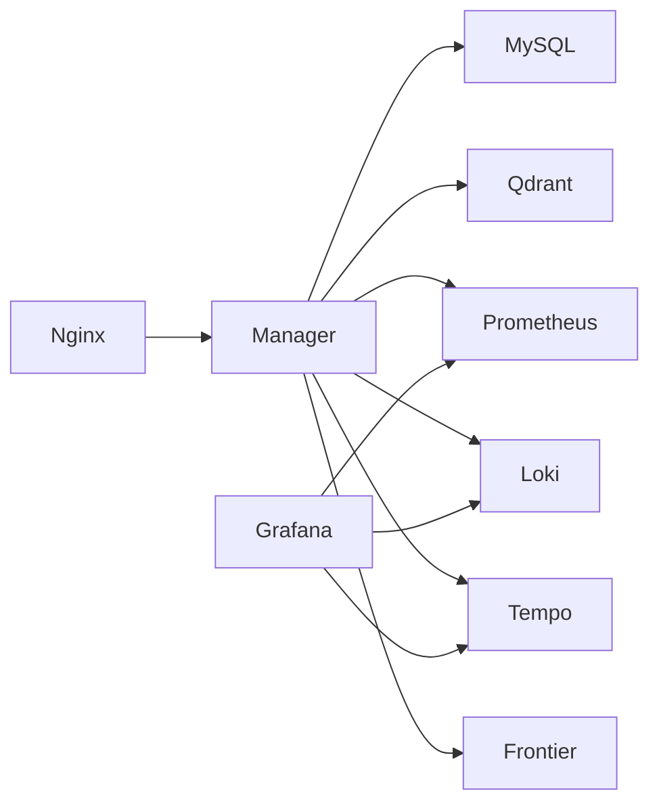

# 配置管理

<cite>
**本文引用的文件**   
- [internal/pkg/config/config.go](file://internal/pkg/config/config.go)
- [deploy/install/docker-compose.yml](file://deploy/install/docker-compose.yml)
- [deploy/install/nginx.conf](file://deploy/install/nginx.conf)
- [deploy/install/prometheus.yml](file://deploy/install/prometheus.yml)
- [deploy/grafana/provisioning/datasources/prometheus.yml](file://deploy/grafana/provisioning/datasources/prometheus.yml)
- [deploy/grafana/provisioning/datasources/loki.yml](file://deploy/grafana/provisioning/datasources/loki.yml)
- [deploy/grafana/provisioning/datasources/tempo.yml](file://deploy/grafana/provisioning/datasources/tempo.yml)
- [deploy/install/prometheus-rules.yml](file://deploy/install/prometheus-rules.yml)
- [deploy/install/edge/ongrid-edge.env.example](file://deploy/install/edge/ongrid-edge.env.example)
- [tests/e2e/secrets.example.env](file://tests/e2e/secrets.example.env)
</cite>

## 目录
1. [简介](#简介)
2. [项目结构](#项目结构)
3. [核心组件](#核心组件)
4. [架构总览](#架构总览)
5. [详细组件分析](#详细组件分析)
6. [依赖关系分析](#依赖关系分析)
7. [性能与容量规划](#性能与容量规划)
8. [故障排查指南](#故障排查指南)
9. [结论](#结论)
10. [附录](#附录)

## 简介
本指南面向运维与平台工程人员，系统化说明 ongrid 的配置体系：环境变量、反向代理、监控与可观测性数据源、边缘端配置等。文档覆盖配置分类与组织、加载与生效机制、热重载策略、安全与访问控制、版本管理与变更追踪、模板与最佳实践、多环境差异管理以及常见问题的诊断与恢复方法。

## 项目结构
配置相关的关键位置与职责如下：
- 运行时配置加载（Go）：从环境变量解析并构建统一配置对象，提供默认值与类型转换。
- 生产编排（docker-compose）：定义服务、端口、卷挂载、环境变量注入与依赖顺序。
- 反向代理（nginx）：TLS 终止、SPA 静态资源、API 转发、鉴权旁路、遥测数据面入口。
- 指标采集（Prometheus）：自拉取 ongrid 指标、启用 remote_write 接收器、规则文件热加载。
- 可视化与关联（Grafana）：通过 provisioning 预置数据源，支持 traces-to-logs/metrics 联动。
- 边缘端（on-grid-edge）：独立的环境变量模板，用于连接云端与插件运行。

图表来源
- [deploy/install/docker-compose.yml:83-313](file://deploy/install/docker-compose.yml#L83-L313)
- [deploy/install/nginx.conf:26-51](file://deploy/install/nginx.conf#L26-L51)
- [deploy/install/prometheus.yml:16-25](file://deploy/install/prometheus.yml#L16-L25)
- [deploy/grafana/provisioning/datasources/prometheus.yml:1-11](file://deploy/grafana/provisioning/datasources/prometheus.yml#L1-L11)
- [deploy/grafana/provisioning/datasources/loki.yml:1-19](file://deploy/grafana/provisioning/datasources/loki.yml#L1-L19)
- [deploy/grafana/provisioning/datasources/tempo.yml:1-51](file://deploy/grafana/provisioning/datasources/tempo.yml#L1-L51)

章节来源
- [deploy/install/docker-compose.yml:83-313](file://deploy/install/docker-compose.yml#L83-L313)
- [deploy/install/nginx.conf:26-51](file://deploy/install/nginx.conf#L26-L51)
- [deploy/install/prometheus.yml:16-25](file://deploy/install/prometheus.yml#L16-L25)
- [deploy/grafana/provisioning/datasources/prometheus.yml:1-11](file://deploy/grafana/provisioning/datasources/prometheus.yml#L1-L11)
- [deploy/grafana/provisioning/datasources/loki.yml:1-19](file://deploy/grafana/provisioning/datasources/loki.yml#L1-L19)
- [deploy/grafana/provisioning/datasources/tempo.yml:1-51](file://deploy/grafana/provisioning/datasources/tempo.yml#L1-L51)

## 核心组件
本节聚焦“运行时配置”的加载模型与关键分组，帮助快速定位与环境映射。

- 配置加载模型
  - 所有运行时配置由统一的 Load() 函数从环境变量读取，并提供合理默认值。
  - 字段分组体现系统分层：网络与指标、数据库、JWT、AI/LLM、管理员引导、边缘端、Frontier 客户端、Prometheus、Grafana、通知、告警、日志、链路追踪、技能扩展等。
- 关键分组与作用
  - 基础配置：HTTP/Metrics/Tunnel 监听地址、对外公共 URL。
  - 数据库配置：方言选择（MySQL/SQLite）、DSN 或文件路径。
  - JWT 配置：签名密钥、访问令牌与刷新令牌 TTL。
  - AI/LLM 配置：OpenAI 与其他提供商（Anthropic/Zhipu/Gemini/DeepSeek/Kimi）的密钥、模型、BaseURL、默认提供者与日 Token 限额。
  - 管理员引导：首次启动创建管理员账号（可选）。
  - 边缘端配置：云端隧道地址、AccessKey/SecretKey、采集模式与间隔、抓取配置文件路径。
  - Frontier 客户端：服务名、地址、是否禁用、预热等待时间。
  - Prometheus：开关、URL、RemoteWrite 与 Query 端点、TLS 选项。
  - Grafana：内部根 URL、一次性引导凭据、TLS 校验跳过。
  - 通知渠道：全局开关、默认通道列表、超时；Webhook/Slack/飞书/钉钉等通道开关与凭据。
  - 内置告警：开关、冷却时间、CPU/内存/磁盘阈值、负载阈值、评估间隔、边缘离线判定、Prom 写入失败计数阈值。
  - 日志/追踪：Loki/Tempo 查询 URL（空则页面返回不可用状态）。
  - 技能扩展：外部目录白名单（逗号/分号分隔）。

章节来源
- [internal/pkg/config/config.go:18-48](file://internal/pkg/config/config.go#L18-L48)
- [internal/pkg/config/config.go:50-64](file://internal/pkg/config/config.go#L50-L64)
- [internal/pkg/config/config.go:66-88](file://internal/pkg/config/config.go#L66-L88)
- [internal/pkg/config/config.go:90-119](file://internal/pkg/config/config.go#L90-L119)
- [internal/pkg/config/config.go:121-156](file://internal/pkg/config/config.go#L121-L156)
- [internal/pkg/config/config.go:158-196](file://internal/pkg/config/config.go#L158-L196)
- [internal/pkg/config/config.go:198-230](file://internal/pkg/config/config.go#L198-L230)
- [internal/pkg/config/config.go:232-257](file://internal/pkg/config/config.go#L232-L257)
- [internal/pkg/config/config.go:259-272](file://internal/pkg/config/config.go#L259-L272)
- [internal/pkg/config/config.go:274-279](file://internal/pkg/config/config.go#L274-L279)
- [internal/pkg/config/config.go:281-286](file://internal/pkg/config/config.go#L281-L286)
- [internal/pkg/config/config.go:288-320](file://internal/pkg/config/config.go#L288-L320)
- [internal/pkg/config/config.go:322-328](file://internal/pkg/config/config.go#L322-L328)
- [internal/pkg/config/config.go:330-364](file://internal/pkg/config/config.go#L330-L364)
- [internal/pkg/config/config.go:366-486](file://internal/pkg/config/config.go#L366-L486)

## 架构总览
下图展示配置在系统中的落地位置与生效方式：
- docker-compose 将 .env 中的键值注入容器环境变量。
- Go 进程启动时调用 Load() 解析环境变量，生成运行时配置。
- nginx 作为统一入口，按 location 路由到后端服务，并对遥测数据面进行鉴权与限流。
- Prometheus 通过命令行参数启用 remote_write 接收器，并通过 rule_files 实现规则热加载。
- Grafana 通过 provisioning 数据源 YAML 自动初始化数据源，部分 URL 通过环境变量插值。

图表来源
- [deploy/install/docker-compose.yml:83-313](file://deploy/install/docker-compose.yml#L83-L313)
- [deploy/install/nginx.conf:89-118](file://deploy/install/nginx.conf#L89-L118)
- [deploy/install/prometheus.yml:1-14](file://deploy/install/prometheus.yml#L1-L14)
- [deploy/grafana/provisioning/datasources/prometheus.yml:1-11](file://deploy/grafana/provisioning/datasources/prometheus.yml#L1-L11)
- [deploy/grafana/provisioning/datasources/loki.yml:1-19](file://deploy/grafana/provisioning/datasources/loki.yml#L1-L19)
- [deploy/grafana/provisioning/datasources/tempo.yml:1-51](file://deploy/grafana/provisioning/datasources/tempo.yml#L1-L51)

## 详细组件分析

### 环境变量与运行时配置（Manager）
- 作用
  - 集中承载 Manager 的所有运行时行为开关与连接信息。
- 主要类别
  - 基础：HTTP/Metrics/Tunnel 监听地址、PublicURL。
  - 数据库：Dialect/DSN/Path。
  - JWT：Secret、AccessTTL、RefreshTTL。
  - LLM：OpenAI 与各提供商的 APIKey/Model/BaseURL/Models 列表、默认提供者、每日 Token 限制。
  - 管理员引导：Email/Password（仅首次启动有效）。
  - 边缘端：CloudAddr、AccessKey/SecretKey、CollectorMode、ScrapeConfigFile、CollectorInterval。
  - Frontier：Addr、ServiceName、Disabled、Warmup。
  - Prometheus：Enabled、URL、RemoteWriteURL、QueryURL、TLSInsecure、TLSCAPath。
  - Grafana：InternalRootURL、BootstrapUser/Password、TLSInsecure。
  - 通知：Enabled、DefaultChannels、Timeout；各通道 Enabled/Name/URL/Secret。
  - 告警：Enabled、Cooldown、CPU/Mem/Disk/Load 阈值、EvaluatorInterval、EdgeOfflineThreshold、PromIngestFailLimit。
  - 日志/追踪：Loki/Tempo 查询 URL。
  - 技能：ExternalDirs。
- 加载与验证
  - 全部通过 os.Getenv 读取，配合 getEnv/getEnvBool/getEnvInt/getEnvFloat/getEnvDuration 等工具完成类型转换与回退默认值。
  - MVP 阶段未引入严格校验，但可通过单元测试与集成测试覆盖。
- 生效方式
  - 进程启动时一次性加载；如需动态调整，需重启进程或通过上层能力（如设置持久化后读库）实现。

章节来源
- [internal/pkg/config/config.go:366-486](file://internal/pkg/config/config.go#L366-L486)
- [internal/pkg/config/config.go:489-591](file://internal/pkg/config/config.go#L489-L591)

### 生产编排与 .env 映射（docker-compose）
- 作用
  - 定义服务拓扑、端口、卷挂载、环境变量注入、健康检查与日志轮转。
- 关键要点
  - 所有敏感项来自 .env，避免硬编码。
  - 全局代理锚点 x-ongrid-proxy-env 统一注入 NO_PROXY/HTTP(S)_PROXY，避免容器内网被企业代理劫持。
  - Manager 不暴露 8080 给宿主机，仅 Metrics 端口暴露；前端与 API 经 Nginx 统一出口。
  - Prometheus 启用 --web.enable-lifecycle 以支持规则热重载。
  - Grafana 通过环境变量插值数据源 URL（不支持 shell 风格默认值），默认子路径 /grafana。
- 典型环境变量
  - 数据库：MYSQL_ROOT_PASSWORD、MYSQL_PASSWORD。
  - JWT：ONGRID_JWT_SECRET、ACCESS_TTL、REFRESH_TTL。
  - Secret Key（HLD-017）：用于凭据落盘加密。
  - LLM：OPENAI_API_KEY/MODEL/BASE_URL 及各提供商对应键。
  - AIOps/RAG：Qdrant/Embedding Provider/Model/Dim/CacheDir。
  - OTEL：OTEL_ENDPOINT。
  - Prometheus：ENABLED/URL/REMOTE_WRITE_URL/QUERY_URL/TLS_INSECURE/TLS_CA_FILE。
  - PublicURL：下发给边缘的数据面根 URL。
  - Grafana：INTERNAL_URL、BOOTSTRAP_USER/PASSWORD、TLS_INSECURE。
  - 通知：ENABLED/DEFAULT_CHANNELS/TIMEOUT 与各通道 ENABLED/NAME/URL/SECRET。
  - 告警：ENABLED/COOLDOWN/EVAL_INTERVAL/CPU/MEM/DISK/LOAD 等。
  - 代理：ONGRID_HTTP(S)_PROXY/NO_PROXY 及标准大小写别名。

章节来源
- [deploy/install/docker-compose.yml:1-50](file://deploy/install/docker-compose.yml#L1-L50)
- [deploy/install/docker-compose.yml:83-313](file://deploy/install/docker-compose.yml#L83-L313)
- [deploy/install/docker-compose.yml:389-434](file://deploy/install/docker-compose.yml#L389-L434)
- [deploy/install/docker-compose.yml:548-599](file://deploy/install/docker-compose.yml#L548-L599)

### 反向代理与安全（Nginx）
- 作用
  - TLS 终止、SPA 静态资源、/api 反向代理、遥测数据面入口（Loki/Tempo）、健康探针透传、Prometheus/Grafana 受控访问。
- 安全与访问控制
  - 数据面鉴权：/loki/api/v1/push 与 /v1/traces 通过 auth_request 调用 manager 的 edgeauth 接口，基于 Basic Auth（access_key/secret_key）校验。
  - 限流：按 edge 身份维度限流，防止单边缘耗尽带宽。
  - 头部传递：X-Real-IP/X-Forwarded-For/X-Forwarded-Proto 等。
  - SPA 缓存：/assets 强缓存，根路径 no-cache。
- 热重载
  - 修改 nginx.conf 后需 reload（通常由部署脚本触发）。

图表来源
- [deploy/install/nginx.conf:89-118](file://deploy/install/nginx.conf#L89-L118)
- [deploy/install/nginx.conf:120-131](file://deploy/install/nginx.conf#L120-L131)
- [deploy/install/nginx.conf:133-169](file://deploy/install/nginx.conf#L133-L169)
- [deploy/install/nginx.conf:171-196](file://deploy/install/nginx.conf#L171-L196)
- [deploy/install/nginx.conf:198-214](file://deploy/install/nginx.conf#L198-L214)
- [deploy/install/nginx.conf:216-242](file://deploy/install/nginx.conf#L216-L242)
- [deploy/install/nginx.conf:244-282](file://deploy/install/nginx.conf#L244-L282)

章节来源
- [deploy/install/nginx.conf:1-284](file://deploy/install/nginx.conf#L1-L284)

### 指标与告警（Prometheus）
- 作用
  - 自拉取 ongrid-manager 指标；启用 remote_write 接收器供边缘上报；加载 self-observability 规则。
- 关键配置
  - global.scrape_interval/evaluation_interval。
  - rule_files 引用 rules.yml，结合 --web.enable-lifecycle 实现热重载。
  - scrape_configs：prometheus 自身与 ongrid-manager。
- 规则文件
  - 包含 OngridManagerDown、OngridOrphanWorkerSessions、OngridLLMErrorRateHigh、OngridDBPoolSaturated、OngridAlertEvaluatorStalled、OngridHTTP5xxRateHigh 等。

图表来源
- [deploy/install/prometheus.yml:1-14](file://deploy/install/prometheus.yml#L1-L14)
- [deploy/install/prometheus.yml:16-25](file://deploy/install/prometheus.yml#L16-L25)
- [deploy/install/prometheus-rules.yml:1-79](file://deploy/install/prometheus-rules.yml#L1-L79)

章节来源
- [deploy/install/prometheus.yml:1-36](file://deploy/install/prometheus.yml#L1-L36)
- [deploy/install/prometheus-rules.yml:1-79](file://deploy/install/prometheus-rules.yml#L1-L79)

### 可视化与数据源（Grafana）
- 作用
  - 通过 provisioning 预置数据源，无需登录即可在 Explore 中使用。
- 数据源
  - ongrid-prometheus：默认数据源，指向 http://prometheus:9090/prometheus。
  - ongrid-loki：URL 通过 ${ONGRID_LOG_URL} 插值。
  - ongrid-tempo：URL 通过 ${ONGRID_TRACE_QUERY_URL} 插值，并启用 traces-to-logs/metrics 联动。
- 注意
  - Grafana 环境变量插值不支持 shell 风格默认值，需在 compose 中提供默认值。

章节来源
- [deploy/grafana/provisioning/datasources/prometheus.yml:1-11](file://deploy/grafana/provisioning/datasources/prometheus.yml#L1-L11)
- [deploy/grafana/provisioning/datasources/loki.yml:1-19](file://deploy/grafana/provisioning/datasources/loki.yml#L1-L19)
- [deploy/grafana/provisioning/datasources/tempo.yml:1-51](file://deploy/grafana/provisioning/datasources/tempo.yml#L1-L51)
- [deploy/install/docker-compose.yml:548-599](file://deploy/install/docker-compose.yml#L548-L599)

### 边缘端配置（on-grid-edge）
- 作用
  - 指定云端隧道地址、认证凭据、采集模式与抓取配置路径、插件工作目录等。
- 关键项
  - CloudAddr、AccessKey、SecretKey。
  - CollectorMode（off/auto/embedded/scrape）、ScrapeConfigFile、CollectorInterval。
  - 插件相关：ID、日志插件开关与端点、认证默认继承隧道凭据。
- 生效方式
  - systemd EnvironmentFile 读取该 env 文件；二进制直接消费环境变量。

章节来源
- [deploy/install/edge/ongrid-edge.env.example:1-44](file://deploy/install/edge/ongrid-edge.env.example#L1-L44)

### 测试与示例（E2E secrets）
- 作用
  - 为需要真实第三方服务的测试用例提供模板，缺失凭据时跳过而非失败。
- 内容
  - LLM 提供商、Slack/Telegram/LarkSuite/DingTalk/Webhook、Git/Vault、代理与 live-mode 开关。

章节来源
- [tests/e2e/secrets.example.env:1-68](file://tests/e2e/secrets.example.env#L1-L68)

## 依赖关系分析
- 组件耦合
  - Manager 依赖 MySQL/Qdrant/Prometheus/Loki/Tempo/Frontier，这些依赖通过 docker-compose 网络与环境变量连接。
  - Nginx 作为唯一对外入口，承担鉴权与限流，降低后端暴露面。
  - Grafana 通过 provisioning 与 Prometheus/Loki/Tempo 解耦，URL 通过环境变量注入。
- 外部依赖
  - LLM 提供商（OpenAI/Anthropic/Zhipu/Gemini/DeepSeek/Kimi）通过环境变量接入。
  - 通知渠道（Webhook/Slack/飞书/钉钉）通过环境变量或 UI 配置。
- 潜在循环
  - 无代码级循环依赖；服务间通过 HTTP/gRPC 单向调用。

图表来源
- [deploy/install/docker-compose.yml:83-313](file://deploy/install/docker-compose.yml#L83-L313)
- [deploy/install/nginx.conf:26-51](file://deploy/install/nginx.conf#L26-L51)
- [deploy/grafana/provisioning/datasources/prometheus.yml:1-11](file://deploy/grafana/provisioning/datasources/prometheus.yml#L1-L11)
- [deploy/grafana/provisioning/datasources/loki.yml:1-19](file://deploy/grafana/provisioning/datasources/loki.yml#L1-L19)
- [deploy/grafana/provisioning/datasources/tempo.yml:1-51](file://deploy/grafana/provisioning/datasources/tempo.yml#L1-L51)

## 性能与容量规划
- Prometheus
  - retention.time=90d、retention.size=20GB，建议 SSD 存储；根据样本量与保留期评估磁盘增长。
  - scrape_interval 与 evaluation_interval 默认 30s，可按负载调优。
- Nginx
  - 长连接 keepalive、gzip、WebSocket 升级头桥接；按需调整 client_max_body_size 与超时。
- Manager
  - DB 连接池、LLM 并发与超时、通知发送超时与冷却时间需结合业务峰值与上游配额调整。
- 边缘端
  - CollectorInterval 与 Scrape 目标数量影响远端写入与 CPU 占用，应平衡实时性与开销。

[本节为通用指导，不直接分析具体文件]

## 故障排查指南
- 无法访问 API
  - 检查 Nginx 证书与端口映射；确认 /api/* 转发至 ongrid:8080。
- 遥测数据面推送失败
  - 检查 /loki/api/v1/push 与 /v1/traces 的 auth_request 鉴权结果与限流；确认边缘 AccessKey/SecretKey 一致。
- Prometheus 规则未生效
  - 确认 --web.enable-lifecycle 已启用；编辑 rules.yml 后调用 /-/reload。
- Grafana 数据源不可用
  - 核对 datasource URL 插值是否正确；确保 Grafana 能访问内部服务域名。
- LLM 错误率高
  - 检查对应提供商 APIKey/Model/BaseURL；查看 Manager 日志与 ongrid_llm_calls_total 指标。
- 数据库连接池饱和
  - 观察 ongrid_db_pool_in_use 与 open_connections；必要时增大最大连接数或优化慢查询。

章节来源
- [deploy/install/prometheus-rules.yml:1-79](file://deploy/install/prometheus-rules.yml#L1-L79)
- [deploy/install/nginx.conf:133-196](file://deploy/install/nginx.conf#L133-L196)
- [deploy/install/prometheus.yml:1-14](file://deploy/install/prometheus.yml#L1-L14)
- [deploy/grafana/provisioning/datasources/prometheus.yml:1-11](file://deploy/grafana/provisioning/datasources/prometheus.yml#L1-L11)
- [deploy/grafana/provisioning/datasources/loki.yml:1-19](file://deploy/grafana/provisioning/datasources/loki.yml#L1-L19)
- [deploy/grafana/provisioning/datasources/tempo.yml:1-51](file://deploy/grafana/provisioning/datasources/tempo.yml#L1-L51)

## 结论
本指南梳理了 ongrid 的配置体系与落地方式：以环境变量为核心的运行时配置、compose 编排的环境注入、Nginx 的安全与路由、Prometheus 的规则热重载、Grafana 的数据源预置，以及边缘端的独立配置。遵循本文的分类、模板与最佳实践，可有效提升配置的可维护性、安全性与可观测性。

[本节为总结性内容，不直接分析具体文件]

## 附录

### 配置分类与组织结构
- 基础配置：HTTP/Metrics/Tunnel/PublicURL。
- 数据库配置：Dialect/DSN/Path。
- 安全与认证：JWT Secret/TTL、Secret Key（落盘加密）。
- AI/LLM 配置：OpenAI 与各提供商的密钥、模型、BaseURL、默认提供者、Token 限额。
- 通知渠道配置：全局开关、默认通道、超时；Webhook/Slack/飞书/钉钉等通道开关与凭据。
- 告警配置：阈值、冷却、评估间隔、边缘离线判定、Prom 写入失败阈值。
- 可观测性：Prometheus/Loki/Tempo 的连接与 TLS 选项。
- 边缘端配置：云端隧道、采集模式、抓取配置路径、插件工作目录。
- 技能扩展：外部目录白名单。

章节来源
- [internal/pkg/config/config.go:18-48](file://internal/pkg/config/config.go#L18-L48)
- [internal/pkg/config/config.go:366-486](file://internal/pkg/config/config.go#L366-L486)

### 配置验证与测试方法
- 单元与集成测试
  - 利用 tests/e2e/secrets.example.env 模板准备第三方凭据；缺失凭据的测试会跳过。
- 配置自检
  - 启动后检查 /healthz、/readyz；查看 ongrid-manager 指标与健康规则。
- 规则热重载
  - 修改 prometheus-rules.yml 后调用 /-/reload 验证规则生效。

章节来源
- [tests/e2e/secrets.example.env:1-68](file://tests/e2e/secrets.example.env#L1-L68)
- [deploy/install/prometheus.yml:1-14](file://deploy/install/prometheus.yml#L1-L14)

### 热重载机制与生效方式
- Prometheus 规则：通过 --web.enable-lifecycle 与 /-/reload 实现热重载。
- Nginx：修改 nginx.conf 后需 reload（由部署脚本触发）。
- Manager：运行时配置通过环境变量加载，修改后需重启进程；部分功能可通过 UI 更新持久化设置后重新读取。

章节来源
- [deploy/install/prometheus.yml:1-14](file://deploy/install/prometheus.yml#L1-L14)
- [deploy/install/nginx.conf:1-284](file://deploy/install/nginx.conf#L1-L284)
- [internal/pkg/config/config.go:366-486](file://internal/pkg/config/config.go#L366-L486)

### 安全考虑
- 敏感信息
  - 所有密钥与密码通过 .env 注入，避免硬编码；Secret Key（HLD-017）用于凭据落盘加密。
- 访问控制
  - 数据面入口通过 Nginx auth_request 调用 manager 的 edgeauth 接口进行鉴权；Prometheus/Grafana 通过鉴权旁路保护。
- TLS
  - Nginx 强制 HTTPS，最小协议 TLSv1.2；Prometheus/Grafana 可配置 TLSInsecure 与 CA 文件。
- 代理与内网
  - 全局代理锚点避免容器内网流量误走企业代理；NO_PROXY 包含所有内部服务名。

章节来源
- [deploy/install/docker-compose.yml:1-50](file://deploy/install/docker-compose.yml#L1-L50)
- [deploy/install/docker-compose.yml:83-313](file://deploy/install/docker-compose.yml#L83-L313)
- [deploy/install/nginx.conf:66-118](file://deploy/install/nginx.conf#L66-L118)
- [deploy/install/nginx.conf:133-196](file://deploy/install/nginx.conf#L133-L196)
- [internal/pkg/config/config.go:198-230](file://internal/pkg/config/config.go#L198-L230)
- [internal/pkg/config/config.go:90-119](file://internal/pkg/config/config.go#L90-L119)

### 版本管理与变更追踪
- 配置即代码
  - docker-compose、nginx.conf、prometheus.yml、datasources/*.yml 纳入版本管理；变更通过 PR 审查。
- 发布包
  - install.sh 将配置模板渲染到目标主机；升级脚本保证配置迁移与兼容性。
- 变更记录
  - 仓库 .record 目录记录关键修复与变更，便于回溯。

章节来源
- [deploy/install/docker-compose.yml:1-20](file://deploy/install/docker-compose.yml#L1-L20)
- [deploy/install/nginx.conf:1-5](file://deploy/install/nginx.conf#L1-L5)
- [deploy/install/prometheus.yml:1-5](file://deploy/install/prometheus.yml#L1-L5)

### 模板与最佳实践
- 模板
  - .env：集中存放所有敏感与可调参数；参考 deploy/install/docker-compose.yml 中的占位符。
  - 边缘端：deploy/install/edge/ongrid-edge.env.example 提供最小可用模板。
  - E2E：tests/e2e/secrets.example.env 提供第三方凭据模板。
- 最佳实践
  - 使用只读挂载（:ro）减少镜像层污染；数据目录统一绑定到宿主磁盘。
  - 区分内外网：对外仅暴露 Nginx 端口；内部服务仅通过 docker 网络访问。
  - 明确默认值：Go 侧提供合理默认，compose 侧尽量不重复硬编码。
  - 日志与指标：开启 json-file 驱动与轮转，避免磁盘打满。

章节来源
- [deploy/install/edge/ongrid-edge.env.example:1-44](file://deploy/install/edge/ongrid-edge.env.example#L1-L44)
- [tests/e2e/secrets.example.env:1-68](file://tests/e2e/secrets.example.env#L1-L68)
- [deploy/install/docker-compose.yml:83-313](file://deploy/install/docker-compose.yml#L83-L313)

### 不同环境的配置差异管理
- 开发环境
  - 使用本地 compose（非生产版），开放必要端口，简化依赖。
- 生产环境
  - 使用 deploy/install 下的生产模板；所有敏感项来自 .env；数据目录外置。
- 灰度/预发
  - 通过独立 .env 与数据目录隔离；复用同一套模板与脚本。
- 边缘节点
  - 通过 install-edge.sh 渲染 ongrid-edge.env；支持自定义 --prefix 安装路径。

章节来源
- [deploy/install/docker-compose.yml:1-20](file://deploy/install/docker-compose.yml#L1-L20)
- [deploy/install/edge/ongrid-edge.env.example:1-44](file://deploy/install/edge/ongrid-edge.env.example#L1-L44)