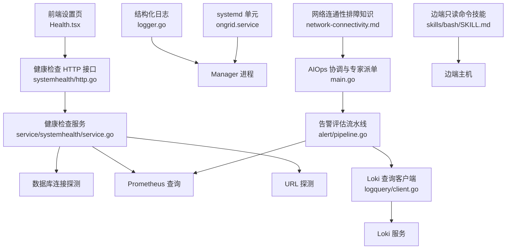
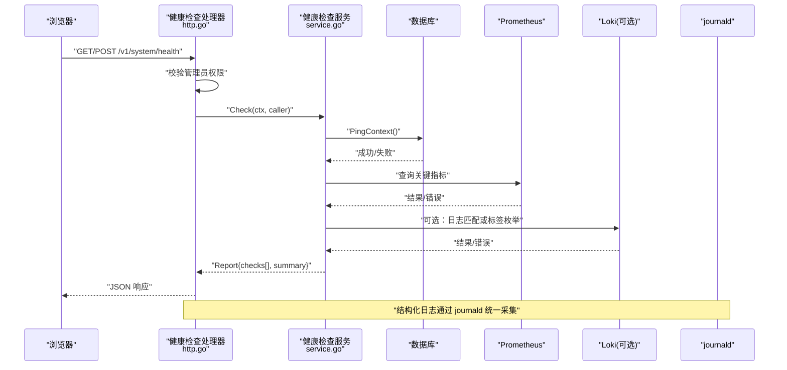
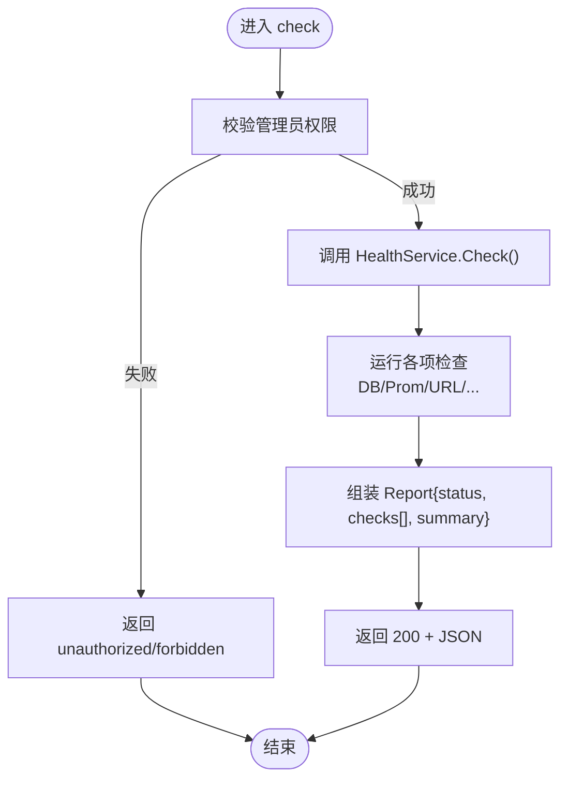
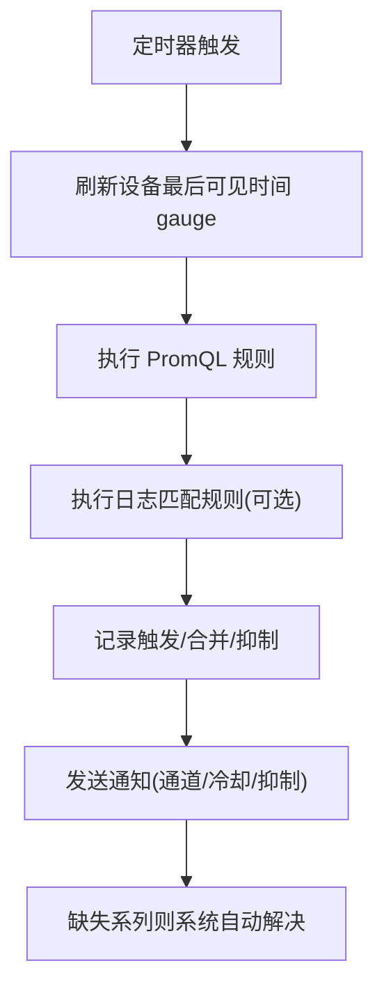
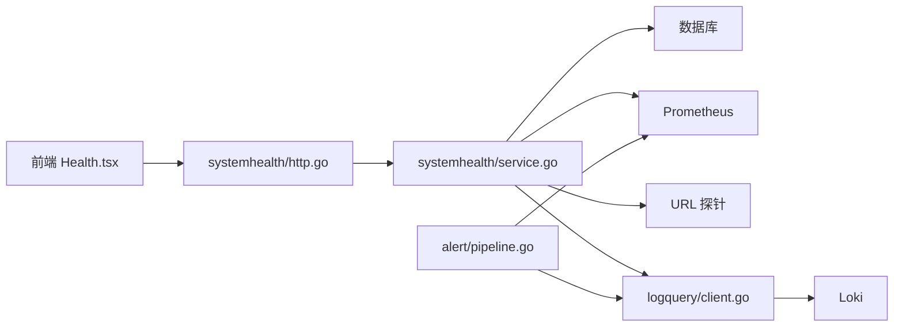

# 故障排查

<cite>
**本文引用的文件**   
- [internal/manager/server/systemhealth/http.go](file://internal/manager/server/systemhealth/http.go)
- [internal/manager/service/systemhealth/service.go](file://internal/manager/service/systemhealth/service.go)
- [web/src/pages/settings/Health.tsx](file://web/src/pages/settings/Health.tsx)
- [internal/pkg/logger/logger.go](file://internal/pkg/logger/logger.go)
- [internal/pkg/logquery/client.go](file://internal/pkg/logquery/client.go)
- [deploy/install/systemd/ongrid.service](file://deploy/install/systemd/ongrid.service)
- [internal/manager/biz/knowledge/builtin_vault/diagnostics/network-connectivity.md](file://internal/manager/biz/knowledge/builtin_vault/diagnostics/network-connectivity.md)
- [internal/manager/biz/alert/pipeline.go](file://internal/manager/biz/alert/pipeline.go)
- [cmd/ongrid/main.go](file://cmd/ongrid/main.go)
- [web/src/api/alerts.ts](file://web/src/api/alerts.ts)
- [skills/bash/SKILL.md](file://skills/bash/SKILL.md)
</cite>

## 目录
1. [简介](#简介)
2. [项目结构](#项目结构)
3. [核心组件](#核心组件)
4. [架构总览](#架构总览)
5. [详细组件分析](#详细组件分析)
6. [依赖关系分析](#依赖关系分析)
7. [性能考虑](#性能考虑)
8. [故障排查指南](#故障排查指南)
9. [结论](#结论)
10. [附录](#附录)

## 简介
本指南面向运维与研发人员，提供 ongrid 系统的统一故障排查与调试方法。内容覆盖日志收集与分析、常见问题诊断步骤与解决方案、性能调优建议、调试工具与技巧（gRPC/HTTP/WebSocket）、错误码参考、系统健康检查与自诊断工具使用，以及有效故障报告的收集与提交规范。

## 项目结构
与故障排查直接相关的代码与配置主要分布在以下位置：
- 健康检查 API 与服务实现：internal/manager/server/systemhealth/* 与 internal/manager/service/systemhealth/*
- 前端健康检查页面：web/src/pages/settings/Health.tsx
- 结构化日志输出：internal/pkg/logger/logger.go
- Loki 日志查询客户端：internal/pkg/logquery/client.go
- systemd 服务单元与资源限制：deploy/install/systemd/ongrid.service
- 告警评估流水线（含日志匹配）：internal/manager/biz/alert/pipeline.go
- AIOps 协调提示词与专家派单策略：cmd/ongrid/main.go
- 事件与调查接口定义：web/src/api/alerts.ts
- 边端只读命令执行能力与限制：skills/bash/SKILL.md
- 网络连通性排障知识库：internal/manager/biz/knowledge/builtin_vault/diagnostics/network-connectivity.md

**图表来源**
- [internal/manager/server/systemhealth/http.go:1-96](file://internal/manager/server/systemhealth/http.go#L1-L96)
- [internal/manager/service/systemhealth/service.go:1-62](file://internal/manager/service/systemhealth/service.go#L1-L62)
- [web/src/pages/settings/Health.tsx:125-275](file://web/src/pages/settings/Health.tsx#L125-L275)
- [internal/pkg/logger/logger.go:1-27](file://internal/pkg/logger/logger.go#L1-L27)
- [internal/pkg/logquery/client.go:1-280](file://internal/pkg/logquery/client.go#L1-L280)
- [deploy/install/systemd/ongrid.service:1-75](file://deploy/install/systemd/ongrid.service#L1-L75)
- [internal/manager/biz/alert/pipeline.go:1-505](file://internal/manager/biz/alert/pipeline.go#L1-L505)
- [cmd/ongrid/main.go:3586-3644](file://cmd/ongrid/main.go#L3586-L3644)
- [skills/bash/SKILL.md:148-188](file://skills/bash/SKILL.md#L148-L188)
- [internal/manager/biz/knowledge/builtin_vault/diagnostics/network-connectivity.md:1-91](file://internal/manager/biz/knowledge/builtin_vault/diagnostics/network-connectivity.md#L1-L91)

**章节来源**
- [internal/manager/server/systemhealth/http.go:1-96](file://internal/manager/server/systemhealth/http.go#L1-L96)
- [internal/manager/service/systemhealth/service.go:1-62](file://internal/manager/service/systemhealth/service.go#L1-L62)
- [web/src/pages/settings/Health.tsx:125-275](file://web/src/pages/settings/Health.tsx#L125-L275)
- [internal/pkg/logger/logger.go:1-27](file://internal/pkg/logger/logger.go#L1-L27)
- [internal/pkg/logquery/client.go:1-280](file://internal/pkg/logquery/client.go#L1-L280)
- [deploy/install/systemd/ongrid.service:1-75](file://deploy/install/systemd/ongrid.service#L1-L75)
- [internal/manager/biz/alert/pipeline.go:1-505](file://internal/manager/biz/alert/pipeline.go#L1-L505)
- [cmd/ongrid/main.go:3586-3644](file://cmd/ongrid/main.go#L3586-L3644)
- [skills/bash/SKILL.md:148-188](file://skills/bash/SKILL.md#L148-L188)
- [internal/manager/biz/knowledge/builtin_vault/diagnostics/network-connectivity.md:1-91](file://internal/manager/biz/knowledge/builtin_vault/diagnostics/network-connectivity.md#L1-L91)

## 核心组件
- 健康检查 API：提供 /v1/system/health 的 GET/POST 接口，返回平台自检报告，包含各检查项状态、消息与耗时等。
- 健康检查服务：聚合数据库、Prometheus、外部 URL 探针等检查项，汇总为 Report。
- 结构化日志：基于 slog JSON 输出到 stderr，便于被 systemd/journald 采集。
- Loki 查询客户端：封装 /loki/api/v1/query_range 与 label 相关接口，供日志匹配规则与日志页面使用。
- systemd 服务单元：定义启动顺序、资源限制、文件系统隔离与日志输出路径。
- 告警评估流水线：周期性执行 metric_raw/log_match/log_volume 等规则，驱动事件生成与通知。
- AIOps 协调与专家派单：根据用户问题自动分派至 compute/network/disk/ops/sre 等专家子代理，减少无效工具调用。
- 边端只读命令技能：在沙箱内执行白名单只读命令，用于快速定位系统层问题。
- 网络连通性排障知识：提供从物理链路到应用层的分层排障步骤与决策树。

**章节来源**
- [internal/manager/server/systemhealth/http.go:1-96](file://internal/manager/server/systemhealth/http.go#L1-L96)
- [internal/manager/service/systemhealth/service.go:1-62](file://internal/manager/service/systemhealth/service.go#L1-L62)
- [internal/pkg/logger/logger.go:1-27](file://internal/pkg/logger/logger.go#L1-L27)
- [internal/pkg/logquery/client.go:1-280](file://internal/pkg/logquery/client.go#L1-L280)
- [deploy/install/systemd/ongrid.service:1-75](file://deploy/install/systemd/ongrid.service#L1-L75)
- [internal/manager/biz/alert/pipeline.go:1-505](file://internal/manager/biz/alert/pipeline.go#L1-L505)
- [cmd/ongrid/main.go:3586-3644](file://cmd/ongrid/main.go#L3586-L3644)
- [skills/bash/SKILL.md:148-188](file://skills/bash/SKILL.md#L148-L188)
- [internal/manager/biz/knowledge/builtin_vault/diagnostics/network-connectivity.md:1-91](file://internal/manager/biz/knowledge/builtin_vault/diagnostics/network-connectivity.md#L1-L91)

## 架构总览
下图展示了健康检查请求从前端到后端服务的完整流程，以及与日志、指标、外部服务的交互关系。

**图表来源**
- [internal/manager/server/systemhealth/http.go:1-96](file://internal/manager/server/systemhealth/http.go#L1-L96)
- [internal/manager/service/systemhealth/service.go:1-62](file://internal/manager/service/systemhealth/service.go#L1-L62)
- [internal/pkg/logquery/client.go:1-280](file://internal/pkg/logquery/client.go#L1-L280)
- [internal/pkg/logger/logger.go:1-27](file://internal/pkg/logger/logger.go#L1-L27)

## 详细组件分析

### 健康检查 API 与服务
- 路由注册：GET/POST /v1/system/health 均触发同一处理逻辑。
- 鉴权：仅允许 admin 角色访问；未认证返回 unauthorized，无权限返回 forbidden。
- 错误映射：内部错误映射为 upstream，参数非法为 invalid，未找到为 not-found。
- 服务实现：聚合多项检查（数据库、Prometheus、URL 探针），返回带分组、状态、消息与耗时的报告。

**图表来源**
- [internal/manager/server/systemhealth/http.go:1-96](file://internal/manager/server/systemhealth/http.go#L1-L96)
- [internal/manager/service/systemhealth/service.go:1-62](file://internal/manager/service/systemhealth/service.go#L1-L62)

**章节来源**
- [internal/manager/server/systemhealth/http.go:1-96](file://internal/manager/server/systemhealth/http.go#L1-L96)
- [internal/manager/service/systemhealth/service.go:1-62](file://internal/manager/service/systemhealth/service.go#L1-L62)
- [web/src/pages/settings/Health.tsx:125-275](file://web/src/pages/settings/Health.tsx#L125-L275)

### 结构化日志与统一采集
- 日志格式：JSON Lines，写入 stderr，便于容器化与 systemd 采集。
- 属性注入：可通过 WithService 添加 service 字段，便于多实例区分。
- 采集路径：systemd 将 stdout/stderr 输出到 journald，支持 journalctl 检索。

**章节来源**
- [internal/pkg/logger/logger.go:1-27](file://internal/pkg/logger/logger.go#L1-L27)
- [deploy/install/systemd/ongrid.service:1-75](file://deploy/install/systemd/ongrid.service#L1-L75)

### Loki 日志查询客户端
- 功能：封装 query_range、label names/values 接口，默认超时 30s，单次响应体上限 8MiB。
- 租户隔离：读取时固定 X-Scope-OrgID=ongrid，适配单租户部署。
- 错误处理：非 200 状态码会记录警告并返回错误信息；空查询或缺少时间窗口会拒绝。

**章节来源**
- [internal/pkg/logquery/client.go:1-280](file://internal/pkg/logquery/client.go#L1-L280)

### systemd 服务与资源限制
- 启动顺序：After/Wants 依赖 mariadb/prometheus/loki/tempo/qdrant，避免热重连风暴。
- 安全隔离：ProtectSystem=true、PrivateTmp=true、RestrictSUIDSGID=true 等。
- 资源限制：LimitNOFILE/LimitNPROC/MemoryMax/CPUQuota 控制进程资源占用。
- 日志输出：StandardOutput/StandardError=journal，SyslogIdentifier=ongrid。

**章节来源**
- [deploy/install/systemd/ongrid.service:1-75](file://deploy/install/systemd/ongrid.service#L1-L75)

### 告警评估流水线与日志匹配
- 周期执行：按 interval 定时评估 metric_raw/metric_anomaly/metric_forecast/metric_burn_rate/log_match/log_volume 等规则。
- 恢复检测：对比上一轮 firing snapshot，若某 dedupe key 不再出现则系统自动 resolve。
- 日志匹配：当 LogQuerier 可用时，Phase-B 使用 log_match/log_volume 进行最近窗口内的日志计数与模式匹配。

**图表来源**
- [internal/manager/biz/alert/pipeline.go:1-505](file://internal/manager/biz/alert/pipeline.go#L1-L505)

**章节来源**
- [internal/manager/biz/alert/pipeline.go:1-505](file://internal/manager/biz/alert/pipeline.go#L1-L505)

### AIOps 协调与专家派单
- 基础提示词：强制每次 tool_call 前给出推理说明，禁止重复调用相同工具与参数，最多 8 次工具调用即收敛。
- 专家分类：compute/network/disk/ops/sre/incident-investigator 等，按问题形状自动分派。
- 并发策略：跨域问题可并发派发多个专家；单域问题同步调用一个专家即可。

**章节来源**
- [cmd/ongrid/main.go:3586-3644](file://cmd/ongrid/main.go#L3586-L3644)

### 边端只读命令技能
- 能力：在边端主机上执行白名单只读命令，如 journalctl/ss/iptables 等。
- 限制：stdout/stderr 容量限制、默认超时、网络出站默认全拒、Path allowlist 受限。
- 建议：遇到拒绝不要重试同一条命令，应依据 response.reason 调整后再发。

**章节来源**
- [skills/bash/SKILL.md:148-188](file://skills/bash/SKILL.md#L148-L188)

### 网络连通性排障知识
- 分层步骤：物理链路 → 路由与地址 → DNS → TCP/TLS → 防火墙/NAT → 应用层。
- 决策树：根据现象快速定位到具体层（驱动/路由/DNS/证书/conntrack 等）。

**章节来源**
- [internal/manager/biz/knowledge/builtin_vault/diagnostics/network-connectivity.md:1-91](file://internal/manager/biz/knowledge/builtin_vault/diagnostics/network-connectivity.md#L1-L91)

## 依赖关系分析
- 健康检查 API 依赖健康检查服务；服务依赖数据库、Prometheus、URL 探针与可选的日志查询。
- 告警流水线依赖 Prometheus 与 Loki 客户端；同时与事件存储和通知通道集成。
- 前端健康页面通过 REST 调用后端健康检查接口，展示检查结果与详情。

**图表来源**
- [web/src/pages/settings/Health.tsx:125-275](file://web/src/pages/settings/Health.tsx#L125-L275)
- [internal/manager/server/systemhealth/http.go:1-96](file://internal/manager/server/systemhealth/http.go#L1-L96)
- [internal/manager/service/systemhealth/service.go:1-62](file://internal/manager/service/systemhealth/service.go#L1-L62)
- [internal/pkg/logquery/client.go:1-280](file://internal/pkg/logquery/client.go#L1-L280)
- [internal/manager/biz/alert/pipeline.go:1-505](file://internal/manager/biz/alert/pipeline.go#L1-L505)

## 性能考虑
- 日志查询：Loki 客户端默认 30s 超时与 8MiB 响应体上限，避免长尾查询拖垮管理器；建议在 UI 或规则中缩小时间窗口与限制行数。
- 健康检查：逐项检查需控制耗时，避免阻塞主循环；对慢依赖（如远程 URL）应设置合理超时与降级策略。
- systemd 资源：根据实际负载调整 LimitNOFILE/LimitNPROC/MemoryMax/CPUQuota，确保 SSE 流、数据库连接池与 LLM HTTP 池有足够资源。
- 告警评估：合理设置 interval 与 cooldown，避免频繁触发与风暴；利用 dedupe key 与恢复检测降低噪声。

[本节为通用指导，不直接分析具体文件]

## 故障排查指南

### 日志收集与分析
- 应用日志
  - 查看 manager 进程日志：journalctl -u ongrid --since "10 minutes ago"
  - 过滤结构化字段：journalctl -u ongrid -f | jq .service
- 系统日志
  - 查看内核与驱动：dmesg -T | tail -n 100
  - 查看网络栈：ss -tnp 'state established' | head -n 50
- 容器日志
  - 若以容器运行，使用 docker logs 或 containerd/crictl 对应命令获取标准输出
- 统一查看
  - 所有服务 StandardOutput/StandardError=journal，可在 journald 中统一检索
  - 结合 service 与 trace_id 等属性进行关联分析

**章节来源**
- [internal/pkg/logger/logger.go:1-27](file://internal/pkg/logger/logger.go#L1-L27)
- [deploy/install/systemd/ongrid.service:1-75](file://deploy/install/systemd/ongrid.service#L1-L75)

### 常见问题的诊断步骤与解决方案
- 网络连接问题
  - 使用网络连通性排障知识中的分层步骤逐步排除：物理链路 → 路由/地址 → DNS → TCP/TLS → 防火墙/NAT → 应用层
  - 关注 conntrack 表是否打满，必要时提升 nf_conntrack_max 或优化短连接 keepalive
- 数据库连接失败
  - 通过健康检查 API 的数据库检查项确认连通性与延迟
  - 检查 systemd 依赖顺序与重启策略，确保数据库先于 manager 启动
- 服务启动异常
  - 查看 ongrid.service 的 After/Wants 依赖与 Restart/RestartSec 配置
  - 检查资源限制（MemoryMax/CPUQuota/LimitNOFILE）是否过低导致 OOM 或文件描述符耗尽

**章节来源**
- [internal/manager/biz/knowledge/builtin_vault/diagnostics/network-connectivity.md:1-91](file://internal/manager/biz/knowledge/builtin_vault/diagnostics/network-connectivity.md#L1-L91)
- [internal/manager/server/systemhealth/http.go:1-96](file://internal/manager/server/systemhealth/http.go#L1-L96)
- [deploy/install/systemd/ongrid.service:1-75](file://deploy/install/systemd/ongrid.service#L1-L75)

### 性能调优指导
- 资源使用优化
  - 根据负载调整 systemd 资源限制；监控 MemoryMax/CPUQuota 命中率
  - 合理设置 GOGC/GOMAXPROCS（已在服务单元中配置）
- 查询性能调优
  - 缩短 Loki/Prometheus 查询时间窗口与 limit；避免宽范围大结果集
  - 使用 label 选择器精准定位目标，减少扫描范围
- 缓存策略配置
  - 对于热点数据（如拓扑、设备清单）在前端或服务层增加短期缓存，降低后端压力

[本节为通用指导，不直接分析具体文件]

### 调试工具与技巧
- gRPC 调试
  - 使用 grpcurl 或 grpcui 调用 gRPC 服务，配合 -insecure 跳过 TLS 验证（仅开发环境）
- HTTP 接口测试
  - 使用 curl 或 Postman 调用 /v1/system/health，观察返回结构与错误码
- WebSocket 连接调试
  - 使用浏览器开发者工具 Network 面板查看 WS 握手与帧；或使用 wscat 命令行工具
- 边端只读命令
  - 通过 host_bash 技能执行只读命令，注意 stdout/stderr 容量限制与网络出站白名单

**章节来源**
- [web/src/api/alerts.ts:1-137](file://web/src/api/alerts.ts#L1-L137)
- [skills/bash/SKILL.md:148-188](file://skills/bash/SKILL.md#L148-L188)

### 错误码参考与含义解释
- 健康检查 API 错误码
  - unauthorized：未认证
  - forbidden：无权限（非 admin）
  - invalid：参数非法
  - not-found：资源不存在
  - upstream：上游依赖错误（默认映射）
- 事件与调查状态（前端类型）
  - pending/running/ready/failed/skipped/not_started/feature_disabled

**章节来源**
- [internal/manager/server/systemhealth/http.go:1-96](file://internal/manager/server/systemhealth/http.go#L1-L96)
- [web/src/api/alerts.ts:1-137](file://web/src/api/alerts.ts#L1-L137)

### 系统健康检查与自诊断工具
- 使用健康检查 API
  - 前端“设置-健康”页面会自动拉取并展示检查结果；也可手动触发
  - 后端返回 Report，包含每个 Check 的状态、消息、详情与耗时
- 自定义检查项
  - 在服务实现中新增检查项，遵循 Check 结构（id/group/label/status/message/details/duration_ms）

**章节来源**
- [web/src/pages/settings/Health.tsx:125-275](file://web/src/pages/settings/Health.tsx#L125-L275)
- [internal/manager/service/systemhealth/service.go:1-62](file://internal/manager/service/systemhealth/service.go#L1-L62)

### 如何收集和提交有效的故障报告
- 必要信息
  - 发生时间与持续时间、受影响范围（设备/边端/集群）
  - 健康检查报告（JSON）、关键错误码与消息
  - 相关日志片段（应用/系统/容器），附带 service 与 trace_id
  - 指标快照（PromQL 查询与结果截图）
  - 变更历史（最近部署/配置变更/扩容缩容）
- 提交方式
  - 通过工单系统或 Issue 模板提交，附上上述信息；如涉及敏感信息请脱敏

[本节为通用指导，不直接分析具体文件]

## 结论
通过统一的结构化日志、健康检查 API、告警流水线与 AIOps 专家派单机制，ongrid 提供了端到端的故障发现、定位与处置能力。结合 systemd 的资源隔离与日志采集、Loki/Prometheus 的可观测性支撑，以及边端只读命令的快速诊断手段，运维与研发可以高效完成从现象到根因的闭环。

[本节为总结，不直接分析具体文件]

## 附录
- 常用命令速查
  - journalctl -u ongrid -f
  - ss -tnp 'state established'
  - dig +short <hostname>
  - nc -zv <host> <port>
  - iptables -S
  - conntrack -L | wc -l
- 参考文档
  - 网络连通性排障知识：internal/manager/biz/knowledge/builtin_vault/diagnostics/network-connectivity.md

**章节来源**
- [internal/manager/biz/knowledge/builtin_vault/diagnostics/network-connectivity.md:1-91](file://internal/manager/biz/knowledge/builtin_vault/diagnostics/network-connectivity.md#L1-L91)