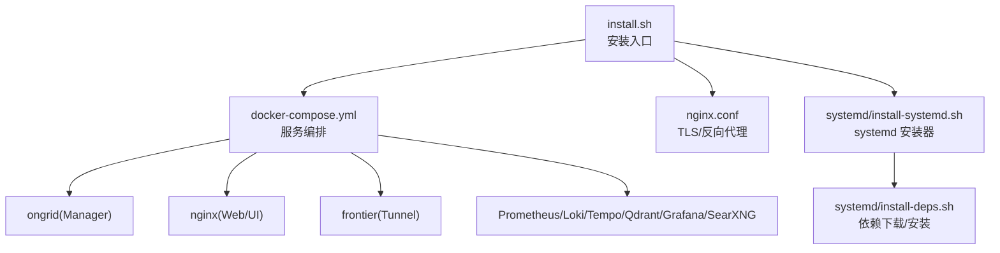
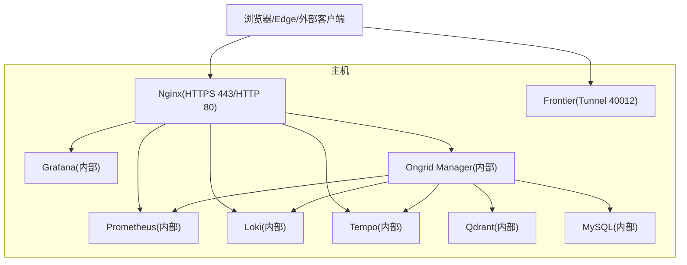
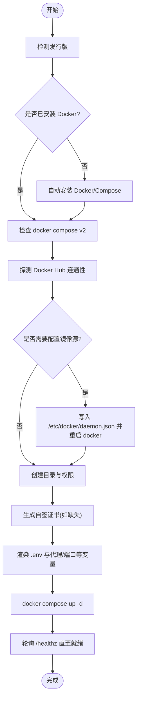

# 环境准备

<cite>
**本文引用的文件**   
- [README.md](file://README.md)
- [deploy/install/install.sh](file://deploy/install/install.sh)
- [deploy/install/docker-compose.yml](file://deploy/install/docker-compose.yml)
- [deploy/install/nginx.conf](file://deploy/install/nginx.conf)
- [deploy/install/systemd/install-systemd.sh](file://deploy/install/systemd/install-systemd.sh)
- [deploy/install/systemd/install-deps.sh](file://deploy/install/systemd/install-deps.sh)
- [deploy/install/edge/ongrid-edge.env.example](file://deploy/install/edge/ongrid-edge.env.example)
</cite>

## 目录
1. [简介](#简介)
2. [项目结构](#项目结构)
3. [核心组件](#核心组件)
4. [架构总览](#架构总览)
5. [详细组件分析](#详细组件分析)
6. [依赖关系分析](#依赖关系分析)
7. [性能与容量规划](#性能与容量规划)
8. [故障排查指南](#故障排查指南)
9. [结论](#结论)
10. [附录：环境变量与权限清单](#附录环境变量与权限清单)

## 简介
本指南聚焦于生产与开发环境的“环境准备”，覆盖硬件要求、操作系统与软件依赖（含 Docker 版本）、网络与端口、代理与镜像加速、系统预检查脚本使用方法，以及关键环境变量与权限要求。内容基于仓库中的安装脚本、Compose 编排与 systemd 安装器实现进行提炼，确保可操作且与代码一致。

## 项目结构
与“环境准备”直接相关的部署与安装资产集中在 deploy/install 目录：
- install.sh：一键安装入口，负责环境探测、Docker 自动安装、镜像源配置、目录布局、证书生成、compose 启动等
- docker-compose.yml：生产级容器编排，定义 ongrid、nginx、frontier、prometheus、loki、tempo、qdrant、searxng、grafana 等服务
- nginx.conf：对外 TLS 终止、反向代理、数据面鉴权与限速
- systemd/install-systemd.sh 与 install-deps.sh：纯 systemd 模式安装器与依赖下载/安装脚本
- edge/ongrid-edge.env.example：边缘端环境变量模板

图表来源
- [deploy/install/install.sh:441-557](file://deploy/install/install.sh#L441-L557)
- [deploy/install/docker-compose.yml:51-610](file://deploy/install/docker-compose.yml#L51-L610)
- [deploy/install/nginx.conf:1-284](file://deploy/install/nginx.conf#L1-L284)
- [deploy/install/systemd/install-systemd.sh:1-477](file://deploy/install/systemd/install-systemd.sh#L1-L477)
- [deploy/install/systemd/install-deps.sh:1-502](file://deploy/install/systemd/install-deps.sh#L1-L502)

章节来源
- [deploy/install/install.sh:441-557](file://deploy/install/install.sh#L441-L557)
- [deploy/install/docker-compose.yml:51-610](file://deploy/install/docker-compose.yml#L51-L610)
- [deploy/install/nginx.conf:1-284](file://deploy/install/nginx.conf#L1-L284)
- [deploy/install/systemd/install-systemd.sh:1-477](file://deploy/install/systemd/install-systemd.sh#L1-L477)
- [deploy/install/systemd/install-deps.sh:1-502](file://deploy/install/systemd/install-deps.sh#L1-L502)

## 核心组件
- 安装入口与预检：install.sh 负责检测发行版、安装 Docker、配置镜像源、创建目录与权限、生成自签证书、渲染 .env、拉起 compose 并等待健康检查
- 容器编排：docker-compose.yml 定义 Manager、Nginx、Frontier、Prometheus、Loki、Tempo、Qdrant、SearXNG、Grafana 及其数据卷挂载、端口映射与环境变量
- 对外访问与安全：nginx.conf 提供 HTTPS、反向代理、数据面鉴权（auth_request）与速率限制
- systemd 模式：install-systemd.sh 安装二进制与服务单元；install-deps.sh 安装 OS 包与上游二进制（Prom/Loki/Tempo/Qdrant），并初始化 MariaDB 与 Grafana 数据源

章节来源
- [deploy/install/install.sh:441-557](file://deploy/install/install.sh#L441-L557)
- [deploy/install/docker-compose.yml:51-610](file://deploy/install/docker-compose.yml#L51-L610)
- [deploy/install/nginx.conf:1-284](file://deploy/install/nginx.conf#L1-L284)
- [deploy/install/systemd/install-systemd.sh:1-477](file://deploy/install/systemd/install-systemd.sh#L1-L477)
- [deploy/install/systemd/install-deps.sh:1-502](file://deploy/install/systemd/install-deps.sh#L1-L502)

## 架构总览
下图展示生产模式下各组件的交互与对外暴露面。注意：除 Nginx 与 Frontier 外，其余服务仅内部可达。

图表来源
- [deploy/install/docker-compose.yml:83-610](file://deploy/install/docker-compose.yml#L83-L610)
- [deploy/install/nginx.conf:1-284](file://deploy/install/nginx.conf#L1-L284)

## 详细组件分析

### 硬件与操作系统要求
- CPU/内存/磁盘
  - 未提供官方最低配置建议。请根据实际负载评估：
    - 数据库（MySQL）、时序存储（Prometheus）、日志（Loki）、链路（Tempo）、向量库（Qdrant）与 Grafana 均会占用显著磁盘与内存
    - 建议将数据目录（ONGRID_DATA_DIR）置于高性能磁盘（SSD/NVMe）
- 操作系统兼容性
  - 安装脚本支持 Debian/Ubuntu 与 RHEL/Rocky/CentOS/Fedora 等发行族
  - README 明确推荐 Ubuntu 22.04+、Debian 12+、RHEL/Rocky 9
- 架构
  - 支持 linux-amd64 与 linux-arm64

章节来源
- [deploy/install/install.sh:444-460](file://deploy/install/install.sh#L444-L460)
- [deploy/install/systemd/install-deps.sh:105-137](file://deploy/install/systemd/install-deps.sh#L105-L137)
- [README.md:44-72](file://README.md#L44-L72)

### 软件依赖与版本
- Docker 与 Compose
  - 若未检测到 docker CLI，install.sh 尝试自动安装（优先 get.docker.com，失败回退到发行版包管理器）
  - 需要 docker compose v2（子命令 docker compose）
  - 对 host-gateway 的支持检测用于 Prometheus 访问宿主机 node_exporter
- systemd 模式依赖
  - install-deps.sh 通过 apt/dnf/yum 安装 mariadb-server、nginx、grafana（可选跳过）
  - 从上游下载并校验 prometheus、loki、tempo、qdrant 二进制，或从打包产物中安装
  - 安装 libonnxruntime.so 以启用本地 ONNX 嵌入模型

章节来源
- [deploy/install/install.sh:462-557](file://deploy/install/install.sh#L462-L557)
- [deploy/install/systemd/install-deps.sh:146-187](file://deploy/install/systemd/install-deps.sh#L146-L187)
- [deploy/install/systemd/install-deps.sh:305-373](file://deploy/install/systemd/install-deps.sh#L305-L373)

### 网络与端口
- 对外端口（默认值）
  - HTTP 重定向：80 → 443
  - HTTPS：443（可通过 ONGRID_HTTP_PORT 调整）
  - Edge 隧道：40012（可通过 ONGRID_TUNNEL_PORT 调整）
  - 指标抓取：9100（manager 指标，可通过 ONGRID_METRICS_PORT 调整）
- 内部端口（不对外暴露）
  - MySQL:3306、Prometheus:9090、Loki:3100、Tempo:4318/3200、Qdrant:6333、Grafana:3000、Manager:8080、Frontier 服务绑定:40011
- 防火墙规则
  - 开放 80/443（Web UI/API）、40012（Edge 隧道）、9100（可选，供宿主 Prometheus 抓取）
  - 其他端口保持内网可达即可
- 零入站特性说明
  - README 强调“零入站端口”是 Edge 侧主动拨出；但云端管理节点仍需开放上述端口以接收 Edge 连接与 Web 访问

章节来源
- [deploy/install/docker-compose.yml:257-382](file://deploy/install/docker-compose.yml#L257-L382)
- [deploy/install/nginx.conf:58-80](file://deploy/install/nginx.conf#L58-L80)
- [README.md:35-36](file://README.md#L35-L36)

### 代理设置与 NO_PROXY
- 主机代理自动探测
  - install.sh 与 systemd 安装器会从当前进程环境与 /etc/environment 读取 http_proxy/https_proxy/no_proxy（大小写兼容）
  - 自动收集内部域名追加至 NO_PROXY（来源：/etc/hosts、/etc/resolv.conf search/domain、hostname + FQDN、以及可配置的 ONGRID_NO_PROXY_EXTRA）
- 容器代理传播
  - docker-compose.yml 使用 anchor 统一注入 HTTP_PROXY/HTTPS_PROXY/NO_PROXY 及小写变体，避免 daemon.json 全局 no-proxy 过窄导致内部服务误走代理
- 企业场景建议
  - 在运行安装前 export HTTP_PROXY/HTTPS_PROXY/NO_PROXY，或在 /etc/environment 中配置
  - 如需排除内部域名，export ONGRID_NO_PROXY_EXTRA=internal.corp,db.local

章节来源
- [deploy/install/install.sh:125-297](file://deploy/install/install.sh#L125-L297)
- [deploy/install/systemd/install-systemd.sh:112-203](file://deploy/install/systemd/install-systemd.sh#L112-L203)
- [deploy/install/docker-compose.yml:38-50](file://deploy/install/docker-compose.yml#L38-L50)

### 国内镜像拉取加速
- Docker Hub 不可达时自动配置
  - install.sh 探测 registry-1.docker.io 连通性；若不可达且未自定义 registry-mirrors，则写入 /etc/docker/daemon.json 并重启 docker
  - 内置多个国内镜像源（示例：ustc、daocloud、rat.dev 等）
- 注意事项
  - 若已存在 registry-mirrors 配置，不会覆盖
  - 重启后等待 docker info 恢复再执行后续步骤

章节来源
- [deploy/install/install.sh:522-555](file://deploy/install/install.sh#L522-L555)

### 系统预检查脚本与用法
- 一键安装即包含预检查
  - 检测发行版、安装 Docker（必要时）、验证 docker compose v2、检查 Docker Hub 连通性与镜像源、创建目录与权限、生成自签证书、渲染 .env、拉起服务并轮询 /healthz
- 典型用法
  - 下载发行包解压后，进入目录执行 sudo ./install.sh
  - 支持 --mode systemd 切换为纯 systemd 安装模式
- 常见问题定位
  - Docker 未安装或版本过低：按提示手动安装 >= 指定版本
  - 端口冲突：修改 .env 中对应端口后重新拉起
  - 证书问题：首次自签证书浏览器会告警，替换真实证书后可消除

章节来源
- [deploy/install/install.sh:441-557](file://deploy/install/install.sh#L441-L557)
- [deploy/install/install.sh:1140-1203](file://deploy/install/install.sh#L1140-L1203)
- [deploy/install/README.md:334-337](file://deploy/install/README.md#L334-L337)

### 环境变量与权限
- 关键目录与权限
  - 数据目录：${ONGRID_DATA_DIR}/mysql|prometheus|loki|tempo|qdrant|grafana|embeddings|skills|pages|workspace|tools
  - 日志目录：${ONGRID_LOG_DIR}
  - Web 输入目录：${ONGRID_WEB_DIR}（nginx.conf/certs/edge/html）
  - 应用快照目录：${ONGRID_APP_DIR}（/ongrid,/skills,/agents 只读挂载）
  - install.sh 会为各子目录 chown 到对应容器用户 uid，避免启动时报权限错误
- 关键环境变量（节选）
  - 监听与前端：ONGRID_HTTP_ADDR、ONGRID_HTTP_PORT、ONGRID_HTTP_REDIRECT_PORT、ONGRID_TUNNEL_PORT、ONGRID_METRICS_PORT
  - 数据库：MYSQL_ROOT_PASSWORD、MYSQL_PASSWORD、ONGRID_DB_DSN
  - JWT 与管理员：ONGRID_JWT_SECRET、ONGRID_ADMIN_EMAIL、ONGRID_ADMIN_PASSWORD
  - LLM 与知识库：OPENAI_API_KEY/MODEL/BASE_URL、ZHIPU/ANTHROPIC/GEMINI/DEEPSEEK/KIMI_*、ONGRID_QDRANT_URL、ONGRID_EMBEDDING_PROVIDER/MODEL/DIM/CACHE_DIR
  - 通知渠道：ONGRID_NOTIFY_*_ENABLED/URL/SECRET 等
  - 代理：ONGRID_HTTP_PROXY/HTTPS_PROXY/NO_PROXY（由安装器自动填充）
- 边缘端环境变量
  - ongrid-edge.env.example 提供云地址、AccessKey/SecretKey、采集间隔、插件路径等模板

章节来源
- [deploy/install/docker-compose.yml:83-312](file://deploy/install/docker-compose.yml#L83-L312)
- [deploy/install/install.sh:593-782](file://deploy/install/install.sh#L593-L782)
- [deploy/install/edge/ongrid-edge.env.example:1-44](file://deploy/install/edge/ongrid-edge.env.example#L1-L44)

## 依赖关系分析
- 安装流程依赖链
  - install.sh → 自动安装 Docker/Compose → 镜像源配置 → 目录与权限 → 证书 → .env → docker compose up
  - systemd 模式：install-systemd.sh → install-deps.sh（apt/dnf/yum 安装 OS 包与上游二进制）→ 初始化 MariaDB → 写入 Grafana 数据源 → 安装 systemd 单元
- 服务间依赖
  - ongrid 依赖 mysql、frontier、prometheus、loki、tempo、qdrant、grafana（部分为可选）
  - nginx 反向代理 ongrid/prometheus/grafana/loki/tempo
  - frontier 作为 Edge 隧道服务，仅暴露 40012 端口

图表来源
- [deploy/install/install.sh:441-557](file://deploy/install/install.sh#L441-L557)
- [deploy/install/install.sh:1140-1203](file://deploy/install/install.sh#L1140-L1203)

章节来源
- [deploy/install/install.sh:441-557](file://deploy/install/install.sh#L441-L557)
- [deploy/install/systemd/install-systemd.sh:1-477](file://deploy/install/systemd/install-systemd.sh#L1-L477)
- [deploy/install/systemd/install-deps.sh:1-502](file://deploy/install/systemd/install-deps.sh#L1-L502)

## 性能与容量规划
- 磁盘
  - Prometheus 默认保留 90 天/20GB（可在 prometheus 参数中调整）
  - Loki/Tempo/Qdrant/Grafana 均有独立数据目录，建议 SSD/NVMe
  - 将 ${ONGRID_DATA_DIR} 指向高性能存储以提升吞吐与延迟
- 内存
  - 多组件常驻内存（Prometheus/Loki/Tempo/Qdrant/Grafana/Manager），需结合数据量与并发评估
- 网络
  - 合理设置代理与 NO_PROXY，避免内部服务误走代理造成拥塞
  - 控制 Edge 数据面速率限制（nginx 已内置 per-edge 限流）

[本节为通用指导，无需源码引用]

## 故障排查指南
- Docker 相关
  - 未安装或版本过低：按提示安装 docker >= 指定版本并确保 docker compose v2 可用
  - 镜像拉取慢/失败：确认是否已自动配置镜像源；也可手动编辑 /etc/docker/daemon.json
- 端口冲突
  - 修改 .env 中的 ONGRID_HTTP_PORT/ONGRID_HTTP_REDIRECT_PORT/ONGRID_TUNNEL_PORT/ONGRID_METRICS_PORT，然后重新拉起
- 证书与浏览器告警
  - 首次使用自签证书会告警；替换真实证书后恢复正常
- 代理与内网域名
  - 若出现内部服务无法解析或走代理异常，检查 /etc/hosts、/etc/resolv.conf 与 ONGRID_NO_PROXY_EXTRA
- systemd 模式
  - 缺少上游二进制：install-deps.sh 会提示并引导安装；或从打包产物中安装
  - MariaDB 未初始化：install-deps.sh 会自动创建数据库与用户，并回填 DSN

章节来源
- [deploy/install/install.sh:522-557](file://deploy/install/install.sh#L522-L557)
- [deploy/install/install.sh:1140-1203](file://deploy/install/install.sh#L1140-L1203)
- [deploy/install/systemd/install-deps.sh:376-418](file://deploy/install/systemd/install-deps.sh#L376-L418)

## 结论
通过 install.sh 与 systemd 安装器，本项目提供了开箱即用的生产与开发环境准备能力：自动安装依赖、智能代理与镜像源配置、完善的目录与权限处理、以及清晰的对外暴露面。建议在正式环境前完成容量评估、证书替换与代理策略调优，并在升级前备份 ${ONGRID_DATA_DIR} 与 ${ONGRID_LOG_DIR}。

[本节为总结，无需源码引用]

## 附录：环境变量与权限清单
- 关键目录
  - ${ONGRID_INSTALL_DIR}：安装根目录（默认 /opt/ongrid）
  - ${ONGRID_DATA_DIR}：所有组件数据目录（mysql/prometheus/loki/tempo/qdrant/grafana/embeddings/skills/pages/workspace/tools）
  - ${ONGRID_LOG_DIR}：manager 进程日志与容器 json-log 输出
  - ${ONGRID_WEB_DIR}：nginx 输入（nginx.conf/certs/edge/html）
  - ${ONGRID_APP_DIR}：应用快照（/ongrid,/skills,/agents 只读挂载）
- 关键端口（默认）
  - 80/443（HTTP 重定向/HTTPS）、40012（Edge 隧道）、9100（指标）
- 关键环境变量（节选）
  - 监听与前端：ONGRID_HTTP_ADDR、ONGRID_HTTP_PORT、ONGRID_HTTP_REDIRECT_PORT、ONGRID_TUNNEL_PORT、ONGRID_METRICS_PORT
  - 数据库：MYSQL_ROOT_PASSWORD、MYSQL_PASSWORD、ONGRID_DB_DSN
  - 安全与会话：ONGRID_JWT_SECRET、ONGRID_ADMIN_EMAIL、ONGRID_ADMIN_PASSWORD
  - LLM 与知识库：OPENAI_API_KEY/MODEL/BASE_URL、ZHIPU/ANTHROPIC/GEMINI/DEEPSEEK/KIMI_*、ONGRID_QDRANT_URL、ONGRID_EMBEDDING_PROVIDER/MODEL/DIM/CACHE_DIR
  - 通知：ONGRID_NOTIFY_*_ENABLED/URL/SECRET
  - 代理：ONGRID_HTTP_PROXY/HTTPS_PROXY/NO_PROXY
- 边缘端环境变量（参考模板）
  - ongrid-edge.env.example 包含云地址、AccessKey/SecretKey、采集间隔、插件路径等

章节来源
- [deploy/install/docker-compose.yml:83-312](file://deploy/install/docker-compose.yml#L83-L312)
- [deploy/install/install.sh:593-782](file://deploy/install/install.sh#L593-L782)
- [deploy/install/edge/ongrid-edge.env.example:1-44](file://deploy/install/edge/ongrid-edge.env.example#L1-L44)