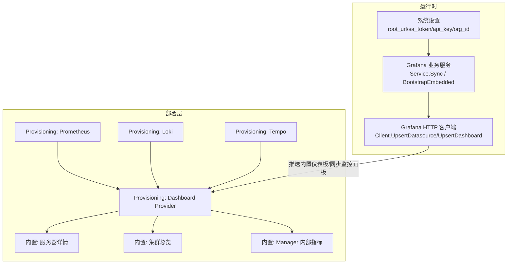
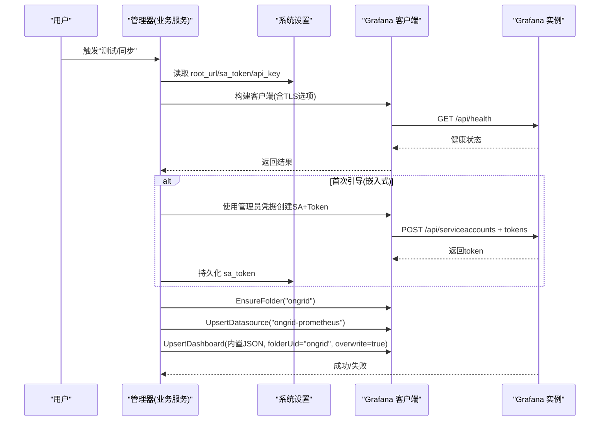
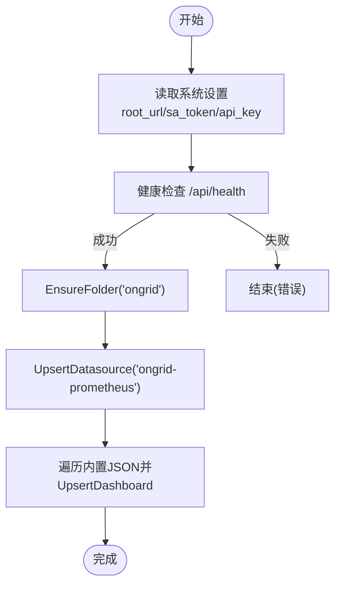
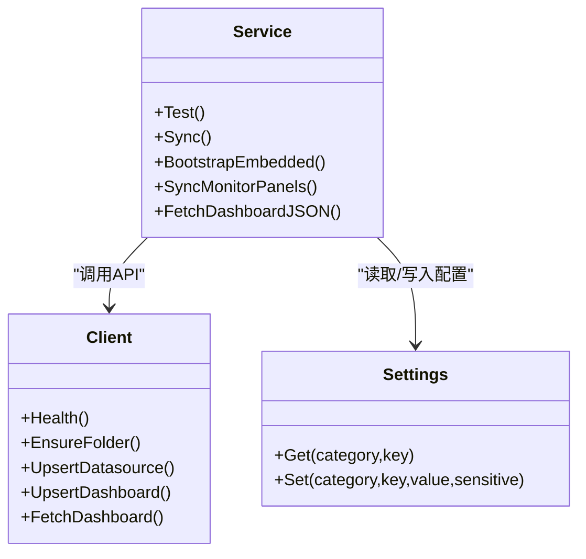

# Grafana仪表板

<cite>
**本文引用的文件**   
- [internal/pkg/grafana/client.go](file://internal/pkg/grafana/client.go)
- [internal/manager/biz/grafana/service.go](file://internal/manager/biz/grafana/service.go)
- [cmd/ongrid/main.go](file://cmd/ongrid/main.go)
- [deploy/grafana/provisioning/datasources/prometheus.yml](file://deploy/grafana/provisioning/datasources/prometheus.yml)
- [deploy/grafana/provisioning/datasources/loki.yml](file://deploy/grafana/provisioning/datasources/loki.yml)
- [deploy/grafana/provisioning/datasources/tempo.yml](file://deploy/grafana/provisioning/datasources/tempo.yml)
- [deploy/grafana/provisioning/dashboards/default.yml](file://deploy/grafana/provisioning/dashboards/default.yml)
- [deploy/grafana/provisioning/dashboards/json/server-detail.json](file://deploy/grafana/provisioning/dashboards/json/server-detail.json)
- [deploy/install/grafana/provisioning/dashboards/json/cluster-overview.json](file://deploy/install/grafana/provisioning/dashboards/json/cluster-overview.json)
- [deploy/install/grafana/provisioning/dashboards/json/manager-internals.json](file://deploy/install/grafana/provisioning/dashboards/json/manager-internals.json)
- [internal/manager/model/setting/model.go](file://internal/manager/model/setting/model.go)
- [deploy/README.md](file://deploy/README.md)
- [internal/manager/biz/knowledge/builtin_vault/diagnostics/grafana-datasource-errors.md](file://internal/manager/biz/knowledge/builtin_vault/diagnostics/grafana-datasource-errors.md)
</cite>

## 目录
1. [简介](#简介)
2. [项目结构](#项目结构)
3. [核心组件](#核心组件)
4. [架构总览](#架构总览)
5. [详细组件分析](#详细组件分析)
6. [依赖关系分析](#依赖关系分析)
7. [性能与可用性考虑](#性能与可用性考虑)
8. [故障排查指南](#故障排查指南)
9. [结论](#结论)
10. [附录](#附录)

## 简介
本指南面向使用 ongrid 的运维与平台工程师，聚焦于 Grafana 仪表板的配置与管理。内容涵盖：
- 数据源配置（Prometheus、Loki、Tempo）
- 内置仪表板结构与使用（集群总览、服务器详情、Manager 内部指标）
- 自定义仪表板创建步骤（查询、图表类型、布局）
- 仪表板共享与导出
- 告警面板配置与阈值设置
- 权限管理与访问控制

## 项目结构
本项目通过“部署级 Provisioning”和“运行时同步”两条路径管理 Grafana：
- 部署级 Provisioning：以 YAML 预置数据源与仪表板提供者，确保首次启动即可用。
- 运行时同步：管理器在启动或用户操作时，将内置仪表板与监控面板镜像到用户的 Grafana 实例。

图示来源
- [deploy/grafana/provisioning/datasources/prometheus.yml:1-11](file://deploy/grafana/provisioning/datasources/prometheus.yml#L1-L11)
- [deploy/grafana/provisioning/datasources/loki.yml:1-19](file://deploy/grafana/provisioning/datasources/loki.yml#L1-L19)
- [deploy/grafana/provisioning/datasources/tempo.yml:1-51](file://deploy/grafana/provisioning/datasources/tempo.yml#L1-L51)
- [deploy/grafana/provisioning/dashboards/default.yml:1-14](file://deploy/grafana/provisioning/dashboards/default.yml#L1-L14)
- [deploy/grafana/provisioning/dashboards/json/server-detail.json:1-457](file://deploy/grafana/provisioning/dashboards/json/server-detail.json#L1-L457)
- [deploy/install/grafana/provisioning/dashboards/json/cluster-overview.json:1-589](file://deploy/install/grafana/provisioning/dashboards/json/cluster-overview.json#L1-L589)
- [deploy/install/grafana/provisioning/dashboards/json/manager-internals.json:1-177](file://deploy/install/grafana/provisioning/dashboards/json/manager-internals.json#L1-L177)
- [internal/manager/biz/grafana/service.go:1-506](file://internal/manager/biz/grafana/service.go#L1-L506)
- [internal/pkg/grafana/client.go:1-355](file://internal/pkg/grafana/client.go#L1-L355)

章节来源
- [deploy/README.md:45-63](file://deploy/README.md#L45-L63)
- [deploy/grafana/provisioning/dashboards/default.yml:1-14](file://deploy/grafana/provisioning/dashboards/default.yml#L1-L14)

## 核心组件
- Grafana HTTP 客户端：封装对 Grafana Admin API 的健康检查、数据源上卷、文件夹创建、仪表板上卷等能力。
- Grafana 业务服务：从系统设置读取 root_url、sa_token/api_key，执行 Test/Sync；支持嵌入式 Grafana 的 SA 自动引导；将内置仪表板与监控面板镜像到用户 Grafana。
- 部署级 Provisioning：提供默认数据源与仪表板提供者，并包含若干内置仪表板 JSON。
- 系统设置键：定义 Grafana 集成所需的关键配置项。

章节来源
- [internal/pkg/grafana/client.go:1-355](file://internal/pkg/grafana/client.go#L1-L355)
- [internal/manager/biz/grafana/service.go:1-506](file://internal/manager/biz/grafana/service.go#L1-L506)
- [internal/manager/model/setting/model.go:147-165](file://internal/manager/model/setting/model.go#L147-L165)
- [deploy/grafana/provisioning/datasources/prometheus.yml:1-11](file://deploy/grafana/provisioning/datasources/prometheus.yml#L1-L11)
- [deploy/grafana/provisioning/datasources/loki.yml:1-19](file://deploy/grafana/provisioning/datasources/loki.yml#L1-L19)
- [deploy/grafana/provisioning/datasources/tempo.yml:1-51](file://deploy/grafana/provisioning/datasources/tempo.yml#L1-L51)

## 架构总览
下图展示了 ongrid 如何与 Grafana 交互，以及内置数据源与仪表板的来源与流向。

图示来源
- [internal/manager/biz/grafana/service.go:103-168](file://internal/manager/biz/grafana/service.go#L103-L168)
- [internal/manager/biz/grafana/service.go:189-257](file://internal/manager/biz/grafana/service.go#L189-L257)
- [internal/pkg/grafana/client.go:65-84](file://internal/pkg/grafana/client.go#L65-L84)
- [internal/pkg/grafana/client.go:161-177](file://internal/pkg/grafana/client.go#L161-L177)
- [internal/pkg/grafana/client.go:113-147](file://internal/pkg/grafana/client.go#L113-L147)
- [internal/pkg/grafana/client.go:277-303](file://internal/pkg/grafana/client.go#L277-L303)

## 详细组件分析

### 数据源配置（Prometheus、Loki、Tempo）
- Prometheus
  - 名称/UID：固定为 ongrid-prometheus，作为默认数据源。
  - 访问模式：proxy。
  - URL：指向容器网络中的 prometheus 服务。
  - 可编辑性：provisioning 中设为不可编辑，避免重启被覆盖。
- Loki
  - 名称/UID：固定为 ongrid-loki。
  - URL：通过环境变量注入（默认指向 loki 服务）。
  - jsonData：超时与最大行数等参数。
- Tempo
  - 名称/UID：固定为 ongrid-tempo。
  - URL：通过环境变量注入（默认指向 tempo 服务）。
  - tracesToLogsV2：启用从 Trace 跳转到对应日志流（关联 ongrid-loki）。
  - tracesToMetrics：启用 RED 面板（rate/error/duration），基于 spanmetrics 写入 ongrid-prometheus。
  - serviceMap/nodeGraph/search/lokiSearch：开启服务拓扑、节点图、搜索与日志联动。

章节来源
- [deploy/grafana/provisioning/datasources/prometheus.yml:1-11](file://deploy/grafana/provisioning/datasources/prometheus.yml#L1-L11)
- [deploy/grafana/provisioning/datasources/loki.yml:1-19](file://deploy/grafana/provisioning/datasources/loki.yml#L1-L19)
- [deploy/grafana/provisioning/datasources/tempo.yml:1-51](file://deploy/grafana/provisioning/datasources/tempo.yml#L1-L51)

### 内置仪表板结构与功能
- 集群总览
  - 展示在线 edge 数、平均 CPU/内存利用率、TopN 资源占用、集群 CPU/Mem 趋势等。
  - 数据源：onGrid Prometheus（UID: ongrid-prometheus）。
- 服务器详情
  - 针对单台服务器的 CPU、内存、Load、网络吞吐等指标。
  - 模板变量：device_id，用于按设备过滤。
- Manager 内部指标
  - 展示 manager 进程健康、goroutine、堆内存、FD、HTTP 请求率/延迟、LLM 调用统计、DB 池、告警评估等。

章节来源
- [deploy/install/grafana/provisioning/dashboards/json/cluster-overview.json:1-589](file://deploy/install/grafana/provisioning/dashboards/json/cluster-overview.json#L1-L589)
- [deploy/grafana/provisioning/dashboards/json/server-detail.json:1-457](file://deploy/grafana/provisioning/dashboards/json/server-detail.json#L1-L457)
- [deploy/install/grafana/provisioning/dashboards/json/manager-internals.json:1-177](file://deploy/install/grafana/provisioning/dashboards/json/manager-internals.json#L1-L177)
- [deploy/README.md:59-63](file://deploy/README.md#L59-L63)

### 运行时同步与内置仪表板推送
- 业务服务负责：
  - 读取系统设置（root_url、sa_token/api_key）。
  - 确保文件夹存在（folder uid: ongrid）。
  - 上卷 Prometheus 数据源（支持 Bearer 或 BasicAuth）。
  - 推送所有内置仪表板（overwrite=true）。
- 嵌入式引导：
  - 若未配置 token，则尝试使用管理员凭据创建 Service Account 并生成 token，持久化后用于后续调用。
- 监控面板镜像：
  - 将前端 Monitor 页面的用户自定义 PromQL 面板与核心面板合并，生成一个受管仪表板（uid: ongrid-monitor），并在每次变更后异步镜像到 Grafana。

图示来源
- [internal/manager/biz/grafana/service.go:189-257](file://internal/manager/biz/grafana/service.go#L189-L257)
- [internal/pkg/grafana/client.go:161-177](file://internal/pkg/grafana/client.go#L161-L177)
- [internal/pkg/grafana/client.go:113-147](file://internal/pkg/grafana/client.go#L113-L147)
- [internal/pkg/grafana/client.go:277-303](file://internal/pkg/grafana/client.go#L277-L303)

章节来源
- [internal/manager/biz/grafana/service.go:103-168](file://internal/manager/biz/grafana/service.go#L103-L168)
- [internal/manager/biz/grafana/service.go:313-342](file://internal/manager/biz/grafana/service.go#L313-L342)
- [internal/manager/biz/grafana/service.go:356-397](file://internal/manager/biz/grafana/service.go#L356-L397)
- [cmd/ongrid/main.go:478-530](file://cmd/ongrid/main.go#L478-L530)

### 自定义仪表板创建步骤
- 准备数据源
  - 确认 Prometheus/Loki/Tempo 已正确 provisioned 且可达。
- 编写查询
  - Prometheus：使用 PromQL，注意时间窗口与聚合维度。
  - Loki：使用 LogQL，关注标签基数与时间范围。
  - Tempo：结合 tracesToLogs/tracesToMetrics 进行链路下钻与 RED 指标展示。
- 选择图表类型
  - 时序图（timeseries）、数值（stat）、仪表盘（gauge）、条形图（bargauge）等。
- 布局设计
  - 采用网格布局（如 12 列宽），合理分配行高与列宽，保持信息密度与可读性。
- 保存与验证
  - 在 Grafana 中预览，必要时使用 Explore 验证查询。
  - 如需纳入 ongrid 管理，可通过“在 Grafana 查看”按钮打开受管仪表板进行对比与调整。

章节来源
- [deploy/grafana/provisioning/dashboards/json/server-detail.json:1-457](file://deploy/grafana/provisioning/dashboards/json/server-detail.json#L1-L457)
- [deploy/install/grafana/provisioning/dashboards/json/cluster-overview.json:1-589](file://deploy/install/grafana/provisioning/dashboards/json/cluster-overview.json#L1-L589)

### 仪表板共享与导出
- 共享
  - 在 Grafana 中将仪表板放入共享文件夹或通过链接分享（需遵循组织权限策略）。
- 导出
  - 通过 Grafana UI 导出 JSON，或在 ongrid 侧通过“FetchDashboardJSON”接口获取指定 uid 的完整仪表板包（由管理器代理访问 Grafana）。
- 版本与回滚
  - 建议保留导出副本，便于回滚与审计。

章节来源
- [internal/manager/biz/grafana/service.go:288-311](file://internal/manager/biz/grafana/service.go#L288-L311)
- [internal/pkg/grafana/client.go:249-270](file://internal/pkg/grafana/client.go#L249-L270)

### 告警面板配置与阈值设置
- 在面板字段配置中设置阈值（绝对/百分比），并定义颜色区间（绿/橙/红）。
- 示例参考：
  - 服务器详情仪表板中 CPU/内存阈值与单位设置。
  - 集群总览中 TopN 与阈值样式。
- 建议：
  - 阈值与业务 SLA 对齐，避免误报。
  - 配合时间窗口与聚合函数，减少噪声。

章节来源
- [deploy/grafana/provisioning/dashboards/json/server-detail.json:62-86](file://deploy/grafana/provisioning/dashboards/json/server-detail.json#L62-L86)
- [deploy/install/grafana/provisioning/dashboards/json/cluster-overview.json:96-113](file://deploy/install/grafana/provisioning/dashboards/json/cluster-overview.json#L96-L113)

### 权限管理与访问控制
- 认证方式
  - 管理器与 Grafana 通信支持两种 Bearer 凭证：
    - Service Account Token（推荐，嵌入式引导自动生成）。
    - API Key（外部 Grafana 场景，直接粘贴现有 key）。
- 访问控制
  - 通过 Grafana 的组织与角色控制仪表板与数据源的可见性与编辑权限。
  - 部署级 Provisioning 的数据源标记为不可编辑，防止重启被覆盖。
- 安全建议
  - 最小权限原则：仅授予必要角色的访问权。
  - 定期轮换 SA Token 或 API Key。

章节来源
- [internal/manager/model/setting/model.go:147-165](file://internal/manager/model/setting/model.go#L147-L165)
- [internal/manager/biz/grafana/service.go:267-286](file://internal/manager/biz/grafana/service.go#L267-L286)
- [deploy/grafana/provisioning/datasources/prometheus.yml:1-11](file://deploy/grafana/provisioning/datasources/prometheus.yml#L1-L11)

## 依赖关系分析
- 组件耦合
  - 业务服务依赖系统设置与 Grafana 客户端。
  - 客户端依赖 HTTP 传输与鉴权头（Bearer/Basic）。
- 外部依赖
  - Prometheus/Loki/Tempo 后端服务。
  - Grafana Admin API。
- 潜在循环依赖
  - 无直接循环；业务服务与客户端单向依赖。

图示来源
- [internal/manager/biz/grafana/service.go:1-506](file://internal/manager/biz/grafana/service.go#L1-L506)
- [internal/pkg/grafana/client.go:1-355](file://internal/pkg/grafana/client.go#L1-L355)
- [internal/manager/model/setting/model.go:147-165](file://internal/manager/model/setting/model.go#L147-L165)

章节来源
- [internal/manager/biz/grafana/service.go:1-506](file://internal/manager/biz/grafana/service.go#L1-L506)
- [internal/pkg/grafana/client.go:1-355](file://internal/pkg/grafana/client.go#L1-L355)

## 性能与可用性考虑
- 连接与超时
  - 客户端默认超时 15s；可配置 TLS 跳过校验（仅内网可信环境）。
- 数据源可达性
  - 优先保证 Grafana 能访问后端（容器网络/DNS/代理/TLS）。
- 查询性能
  - 避免高基数标签与过宽时间窗口；合理使用 $__rate_interval。
- 同步稳定性
  - 同步失败不阻塞 API 响应；下次编辑会重试。

章节来源
- [internal/pkg/grafana/client.go:39-48](file://internal/pkg/grafana/client.go#L39-L48)
- [internal/manager/biz/grafana/service.go:85-101](file://internal/manager/biz/grafana/service.go#L85-L101)

## 故障排查指南
常见问题定位流程：
- 数据源报错/空面板
  - 先测试数据源健康（Grafana 设置页或 API）。
  - 从 Grafana 所在主机直连后端健康端点，排除网络/鉴权/TLS 问题。
  - 若后端健康但面板无数据，检查时间范围、指标/标签变更、模板变量解析。
  - 若全部面板为空，检查数据源 UID 是否漂移。
- 决策树
  - 数据源测试失败 → 修正 URL/鉴权/TLS（从 Grafana 视角可达）。
  - 后端健康但 Grafana 不可达 → 修正容器 DNS/网络/代理。
  - 单个面板为空 → 在 Explore 运行相同查询，核对时间与指标。
  - 全空（变更后）→ 数据源 UID 漂移，重新指向或固定稳定 UID。

章节来源
- [internal/manager/biz/knowledge/builtin_vault/diagnostics/grafana-datasource-errors.md:1-87](file://internal/manager/biz/knowledge/builtin_vault/diagnostics/grafana-datasource-errors.md#L1-L87)

## 结论
通过“部署级 Provisioning + 运行时同步”的双轨机制，本项目实现了开箱即用的 Grafana 数据源与内置仪表板，同时支持灵活的自定义与受管同步。建议在生产环境中：
- 固定数据源 UID 与命名规范，避免漂移。
- 严格管理 SA Token/API Key，最小权限授权。
- 建立仪表板导出与版本管理机制，保障可回滚与审计。

## 附录
- 关键环境变量与端口
  - Grafana 本地开发：http://localhost:3000
  - Prometheus 本地开发：http://localhost:9090
  - 安装栈中 Grafana 经 nginx 暴露于 /grafana/ 路径，并复用 ongrid 会话鉴权。

章节来源
- [deploy/README.md:45-63](file://deploy/README.md#L45-L63)