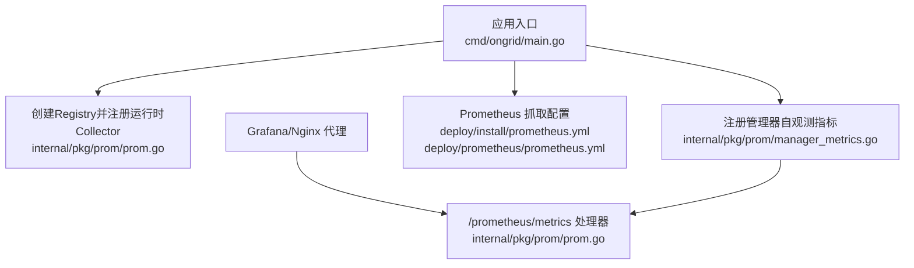
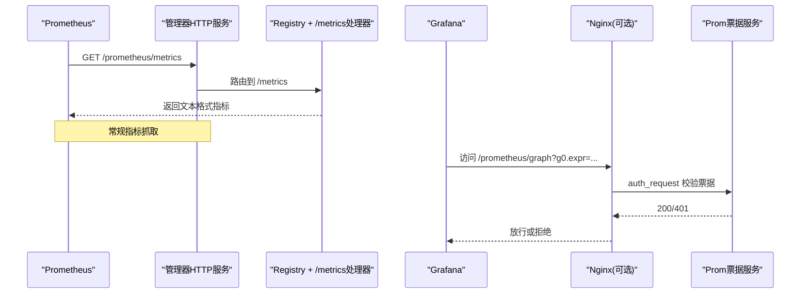
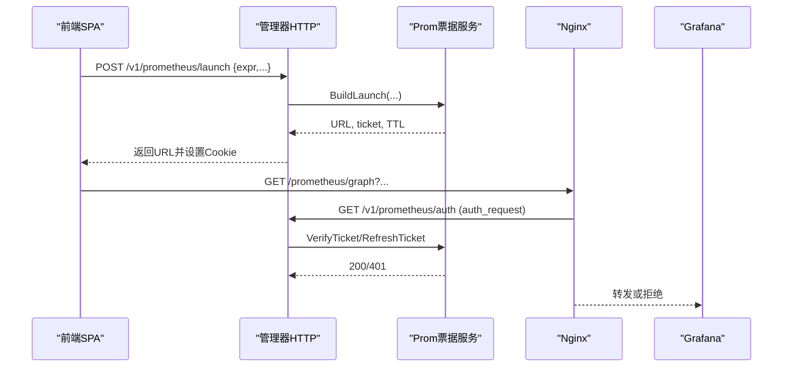
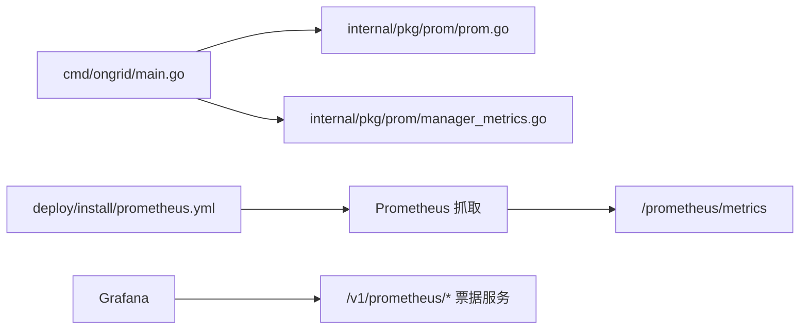

# Prometheus指标收集

<cite>
**本文引用的文件**   
- [cmd/ongrid/main.go](file://cmd/ongrid/main.go)
- [internal/pkg/prom/prom.go](file://internal/pkg/prom/prom.go)
- [internal/pkg/prom/manager_metrics.go](file://internal/pkg/prom/manager_metrics.go)
- [internal/manager/server/prometheus/http.go](file://internal/manager/server/prometheus/http.go)
- [internal/manager/service/prometheus/service.go](file://internal/manager/service/prometheus/service.go)
- [deploy/install/prometheus.yml](file://deploy/install/prometheus.yml)
- [deploy/prometheus/prometheus.yml](file://deploy/prometheus/prometheus.yml)
</cite>

## 目录
1. [简介](#简介)
2. [项目结构](#项目结构)
3. [核心组件](#核心组件)
4. [架构总览](#架构总览)
5. [详细组件分析](#详细组件分析)
6. [依赖关系分析](#依赖关系分析)
7. [性能与容量规划](#性能与容量规划)
8. [故障排查指南](#故障排查指南)
9. [结论](#结论)
10. [附录](#附录)

## 简介
本文件面向在 ongrid 管理器中集成与使用 Prometheus 的运维与开发者，系统性说明：
- Prometheus 抓取配置结构与关键参数（全局设置、抓取间隔、评估间隔）
- ongrid 管理器的自观测指标暴露端点 /prometheus/metrics 的实现与用法
- 自定义指标的注册与采集规则配置方式
- HTTP 处理器对指标数据的处理与格式化
- 系统关键性能指标解读（CPU、内存、请求延迟等）
- 如何添加新的监控目标与抓取配置
- 指标数据写入策略与保留策略的配置要点

## 项目结构
本项目将“进程级指标注册与HTTP暴露”和“业务侧自观测指标”解耦为两个层次：
- 进程级指标注册与HTTP暴露：提供统一的 Registry 与 /metrics 处理器
- 业务侧自观测指标：在启动时集中注册，供 Prometheus 抓取

图表来源
- [cmd/ongrid/main.go:393-398](file://cmd/ongrid/main.go#L393-L398)
- [internal/pkg/prom/prom.go:16-29](file://internal/pkg/prom/prom.go#L16-L29)
- [internal/pkg/prom/manager_metrics.go:155-317](file://internal/pkg/prom/manager_metrics.go#L155-L317)
- [deploy/install/prometheus.yml:6-25](file://deploy/install/prometheus.yml#L6-L25)
- [deploy/prometheus/prometheus.yml:6-20](file://deploy/prometheus/prometheus.yml#L6-L20)

章节来源
- [cmd/ongrid/main.go:393-398](file://cmd/ongrid/main.go#L393-L398)
- [internal/pkg/prom/prom.go:16-29](file://internal/pkg/prom/prom.go#L16-L29)
- [internal/pkg/prom/manager_metrics.go:155-317](file://internal/pkg/prom/manager_metrics.go#L155-L317)
- [deploy/install/prometheus.yml:6-25](file://deploy/install/prometheus.yml#L6-L25)
- [deploy/prometheus/prometheus.yml:6-20](file://deploy/prometheus/prometheus.yml#L6-L20)

## 核心组件
- 进程级指标注册器与处理器
  - 负责创建 prometheus.Registry，注册 Go 运行时与进程 Collector，并提供 /metrics HTTP 处理器。
- 管理器自观测指标
  - 在启动阶段一次性注册，包含告警评估延迟、remote_write 结果、设备心跳、HTTP 请求计数与耗时、数据库连接池、LLM 调用统计、聊天工作会话、边缘连接数等。
- Prometheus 抓取配置
  - 云侧与开发环境分别提供 prometheus.yml，定义 global、rule_files、scrape_configs 等。
- Grafana 访问代理与安全票据
  - 通过 /v1/prometheus/* 接口签发与刷新票据，配合 Nginx auth_request 实现安全访问 Grafana。

章节来源
- [internal/pkg/prom/prom.go:16-29](file://internal/pkg/prom/prom.go#L16-L29)
- [internal/pkg/prom/manager_metrics.go:155-317](file://internal/pkg/prom/manager_metrics.go#L155-L317)
- [deploy/install/prometheus.yml:6-25](file://deploy/install/prometheus.yml#L6-L25)
- [deploy/prometheus/prometheus.yml:6-20](file://deploy/prometheus/prometheus.yml#L6-L20)
- [internal/manager/server/prometheus/http.go:56-63](file://internal/manager/server/prometheus/http.go#L56-L63)
- [internal/manager/service/prometheus/service.go:45-82](file://internal/manager/service/prometheus/service.go#L45-L82)

## 架构总览
下图展示了 ongrid 管理器如何向 Prometheus 暴露指标，以及 Grafana 如何通过票据机制安全访问。

图表来源
- [internal/pkg/prom/prom.go:26-29](file://internal/pkg/prom/prom.go#L26-L29)
- [internal/manager/server/prometheus/http.go:56-63](file://internal/manager/server/prometheus/http.go#L56-L63)
- [internal/manager/service/prometheus/service.go:84-108](file://internal/manager/service/prometheus/service.go#L84-L108)

## 详细组件分析

### 1) 进程级指标注册与 /metrics 处理器
- 功能
  - 创建独立 Registry，注册 Go 运行时与进程 Collector，避免与默认注册表冲突。
  - 提供标准 /metrics 处理器，输出 Prometheus 文本格式。
- 关键点
  - 标签基数红线：禁止使用高基数字段作为标签（如 org_id/user_id/edge_id）。
  - 每个业务域在构造时自行注册其指标。

章节来源
- [internal/pkg/prom/prom.go:1-30](file://internal/pkg/prom/prom.go#L1-L30)

### 2) 管理器自观测指标注册与使用
- 功能
  - 在启动时集中注册大量业务指标，包括：
    - 告警评估延迟（按规则类型与结果分桶）
    - remote_write 成功/失败计数
    - 设备最后心跳时间（秒前）
    - HTTP 请求总数与耗时（按方法、路由模板、状态类）
    - 数据库连接池状态（打开/在用/空闲/等待计数）
    - LLM 调用次数、耗时与Token消耗
    - 聊天工作会话数量
    - 告警评估Tick计数
    - 边缘连接数
    - RCA 调查并发数
- 使用方式
  - 各模块通过包内提供的 Observe/Set/Inc 等方法更新指标，无需传递句柄。
  - 重复注册场景采用“已存在则复用”的策略，避免 panic。

章节来源
- [internal/pkg/prom/manager_metrics.go:155-317](file://internal/pkg/prom/manager_metrics.go#L155-L317)
- [internal/pkg/prom/manager_metrics.go:355-396](file://internal/pkg/prom/manager_metrics.go#L355-L396)
- [internal/pkg/prom/manager_metrics.go:480-532](file://internal/pkg/prom/manager_metrics.go#L480-L532)

### 3) Prometheus 抓取配置（global/scrape/evaluation）
- 全局设置
  - scrape_interval：抓取周期
  - evaluation_interval：规则评估周期
- 规则文件
  - rule_files：挂载本地规则文件，支持热重载（需启用生命周期API）
- 抓取任务
  - prometheus：自抓自身（metrics_path 指向 /prometheus/metrics）
  - ongrid-manager：抓取管理器指标（端口由部署决定）
- 注意
  - 主机与进程指标通过 edge → tunnel push → remote_write 回写，不再静态抓取 host.docker.internal。

章节来源
- [deploy/install/prometheus.yml:6-25](file://deploy/install/prometheus.yml#L6-L25)
- [deploy/prometheus/prometheus.yml:6-20](file://deploy/prometheus/prometheus.yml#L6-L20)

### 4) Grafana 访问代理与票据机制
- 流程
  - SPA 先调用 /v1/prometheus/launch 获取票据与跳转URL
  - 浏览器携带票据访问 Grafana，Nginx 通过 auth_request 调用 /v1/prometheus/auth 校验并滑动续期
- 安全与限流
  - 票据TTL较长以覆盖长时间浏览；每次成功校验会刷新票据
  - PromQL 查询路径有长度限制与超时保护

图表来源
- [internal/manager/server/prometheus/http.go:76-107](file://internal/manager/server/prometheus/http.go#L76-L107)
- [internal/manager/server/prometheus/http.go:109-137](file://internal/manager/server/prometheus/http.go#L109-L137)
- [internal/manager/service/prometheus/service.go:45-82](file://internal/manager/service/prometheus/service.go#L45-L82)
- [internal/manager/service/prometheus/service.go:84-126](file://internal/manager/service/prometheus/service.go#L84-L126)

章节来源
- [internal/manager/server/prometheus/http.go:56-63](file://internal/manager/server/prometheus/http.go#L56-L63)
- [internal/manager/server/prometheus/http.go:76-107](file://internal/manager/server/prometheus/http.go#L76-L107)
- [internal/manager/server/prometheus/http.go:109-137](file://internal/manager/server/prometheus/http.go#L109-L137)
- [internal/manager/service/prometheus/service.go:45-82](file://internal/manager/service/prometheus/service.go#L45-L82)
- [internal/manager/service/prometheus/service.go:84-126](file://internal/manager/service/prometheus/service.go#L84-L126)

### 5) 自定义指标注册与采集规则配置
- 注册新指标
  - 在对应模块构造时，使用 NewRegistry() 返回的 registry 进行注册；或使用包级 RegisterManagerMetrics 统一注册。
  - 遵循标签基数红线，避免高基数字段。
- 采集规则
  - 在 prometheus.yml 中添加 job，指定 metrics_path 与 targets
  - 如需告警规则，新增 rule_files 并在变更时触发重载（需启用 --web.enable-lifecycle）

章节来源
- [internal/pkg/prom/prom.go:16-29](file://internal/pkg/prom/prom.go#L16-L29)
- [internal/pkg/prom/manager_metrics.go:155-317](file://internal/pkg/prom/manager_metrics.go#L155-L317)
- [deploy/install/prometheus.yml:10-25](file://deploy/install/prometheus.yml#L10-L25)

### 6) HTTP 处理器对指标数据的处理与格式化
- /metrics 处理器
  - 基于 promhttp.HandlerFor，输出标准 Prometheus 文本格式
- 其他相关接口
  - /v1/prometheus/query_range：鉴权后透传 Prom range 查询结果给前端渲染面板
  - 错误响应统一 JSON 结构，便于前端降级展示

章节来源
- [internal/pkg/prom/prom.go:26-29](file://internal/pkg/prom/prom.go#L26-L29)
- [internal/manager/server/prometheus/http.go:166-243](file://internal/manager/server/prometheus/http.go#L166-L243)

### 7) 系统关键性能指标解读
- CPU/内存/GC/文件描述符
  - 来自 Go 运行时 Collector，典型指标名含 go_ 前缀（如 goroutines、heap_alloc、gc_duration_seconds 等）
- 进程资源
  - 来自进程 Collector（process_*），如 cpu_seconds_total、resident_memory_bytes 等
- 管理器自观测
  - HTTP 请求计数与耗时：用于观察QPS与延迟分布
  - 数据库连接池：OpenConnections/InUse/Idle/WaitCountTotal 用于容量诊断
  - LLM 调用：calls_total/call_duration_seconds/tokens_total 用于成本与SLA监控
  - 告警评估延迟与Tick：评估健康度与异常定位
  - 边缘连接数：在线/离线状态监控

章节来源
- [internal/pkg/prom/manager_metrics.go:155-317](file://internal/pkg/prom/manager_metrics.go#L155-L317)
- [internal/pkg/prom/manager_metrics.go:355-396](file://internal/pkg/prom/manager_metrics.go#L355-L396)

### 8) 如何添加新的监控目标与抓取配置
- 步骤
  - 确认目标暴露 /metrics 且可被 Prometheus 访问
  - 在 prometheus.yml 的 scrape_configs 下新增 job，指定 job_name、static_configs.targets、可选 scrape_interval 与 metrics_path
  - 若需要告警规则，新增 rule_files 并保证路径可被容器挂载
- 注意事项
  - 避免高基数标签
  - 合理设置抓取间隔，避免过载
  - 对于远程写入的目标，确保 remote_write 端点可达且认证正确

章节来源
- [deploy/install/prometheus.yml:16-25](file://deploy/install/prometheus.yml#L16-L25)
- [deploy/prometheus/prometheus.yml:10-20](file://deploy/prometheus/prometheus.yml#L10-L20)

### 9) 指标数据存储策略与保留策略配置
- 存储与保留
  - 由外部 Prometheus 实例负责持久化与保留策略（storage.tsdb.* 等），不在 ongrid 代码中配置
- 远程写入
  - 当启用 Prom 时，管理器可通过 remote_write 将内部样本推送到远端 Prometheus
  - 远端保留策略由远端 Prometheus 配置决定

章节来源
- [cmd/ongrid/main.go:1076-1116](file://cmd/ongrid/main.go#L1076-L1116)

## 依赖关系分析
- 启动装配
  - main 创建 Registry，注册运行时与进程 Collector
  - 注册管理器自观测指标
  - 根据配置构建 promquery/promwrite 客户端（可选）
- 指标消费方
  - Prometheus 通过 scrape_configs 抓取 /prometheus/metrics
  - Grafana 通过票据机制安全访问

图表来源
- [cmd/ongrid/main.go:393-398](file://cmd/ongrid/main.go#L393-L398)
- [internal/pkg/prom/prom.go:16-29](file://internal/pkg/prom/prom.go#L16-L29)
- [internal/pkg/prom/manager_metrics.go:155-317](file://internal/pkg/prom/manager_metrics.go#L155-L317)
- [deploy/install/prometheus.yml:16-25](file://deploy/install/prometheus.yml#L16-L25)
- [internal/manager/server/prometheus/http.go:56-63](file://internal/manager/server/prometheus/http.go#L56-L63)

章节来源
- [cmd/ongrid/main.go:393-398](file://cmd/ongrid/main.go#L393-L398)
- [internal/pkg/prom/prom.go:16-29](file://internal/pkg/prom/prom.go#L16-L29)
- [internal/pkg/prom/manager_metrics.go:155-317](file://internal/pkg/prom/manager_metrics.go#L155-L317)
- [deploy/install/prometheus.yml:16-25](file://deploy/install/prometheus.yml#L16-L25)
- [internal/manager/server/prometheus/http.go:56-63](file://internal/manager/server/prometheus/http.go#L56-L63)

## 性能与容量规划
- 抓取间隔
  - 建议根据指标基数与变化频率调整，避免过短导致负载过高
- 标签基数控制
  - 严禁使用用户/租户/设备ID等高基数字段作为标签
- 直方图桶
  - 针对慢路径（如LLM调用）使用更粗的尾部桶，减少内存占用
- 远程写入
  - 关注远端Prometheus的存储与网络吞吐，必要时拆分job或降低采样率

[本节为通用指导，不直接分析具体文件]

## 故障排查指南
- /metrics 不可达
  - 检查监听地址与端口是否正确暴露
  - 确认 Prometheus 抓取配置中的 targets 与 metrics_path
- 指标缺失或为空
  - 确认启动时是否调用了 RegisterManagerMetrics
  - 检查是否有 AlreadyRegisteredError 导致的降级日志
- Grafana 无法访问
  - 检查票据签发与校验逻辑是否正常
  - 确认 Nginx auth_request 子请求返回码
- 远程写入失败
  - 检查远端Prometheus可达性与认证
  - 查看 prom_write_total{result="fail"} 增长情况

章节来源
- [internal/pkg/prom/manager_metrics.go:303-317](file://internal/pkg/prom/manager_metrics.go#L303-L317)
- [internal/manager/server/prometheus/http.go:109-137](file://internal/manager/server/prometheus/http.go#L109-L137)
- [internal/manager/service/prometheus/service.go:84-126](file://internal/manager/service/prometheus/service.go#L84-L126)
- [internal/pkg/prom/manager_metrics.go:493-503](file://internal/pkg/prom/manager_metrics.go#L493-L503)

## 结论
- ongrid 管理器通过统一的 Registry 与 /metrics 处理器暴露进程与业务指标
- 启动阶段集中注册自观测指标，便于 Prometheus 抓取与可视化
- Grafana 通过票据机制安全访问，兼顾体验与安全
- 合理的抓取间隔、标签基数控制与远程写入策略是稳定运行的关键

[本节为总结性内容，不直接分析具体文件]

## 附录
- 常用指标示例（名称示意）
  - go_goroutines、go_memstats_heap_alloc_bytes、process_cpu_seconds_total
  - ongrid_http_requests_total、ongrid_http_request_duration_seconds
  - ongrid_db_pool_open_connections、ongrid_db_pool_in_use、ongrid_db_pool_idle、ongrid_db_pool_wait_count_total
  - ongrid_llm_calls_total、ongrid_llm_call_duration_seconds、ongrid_llm_router_tokens_total
  - alert_evaluator_latency_seconds、prom_write_total、device_last_seen_seconds_ago、ongrid_edge_connections

章节来源
- [internal/pkg/prom/manager_metrics.go:155-317](file://internal/pkg/prom/manager_metrics.go#L155-L317)
- [internal/pkg/prom/manager_metrics.go:355-396](file://internal/pkg/prom/manager_metrics.go#L355-L396)