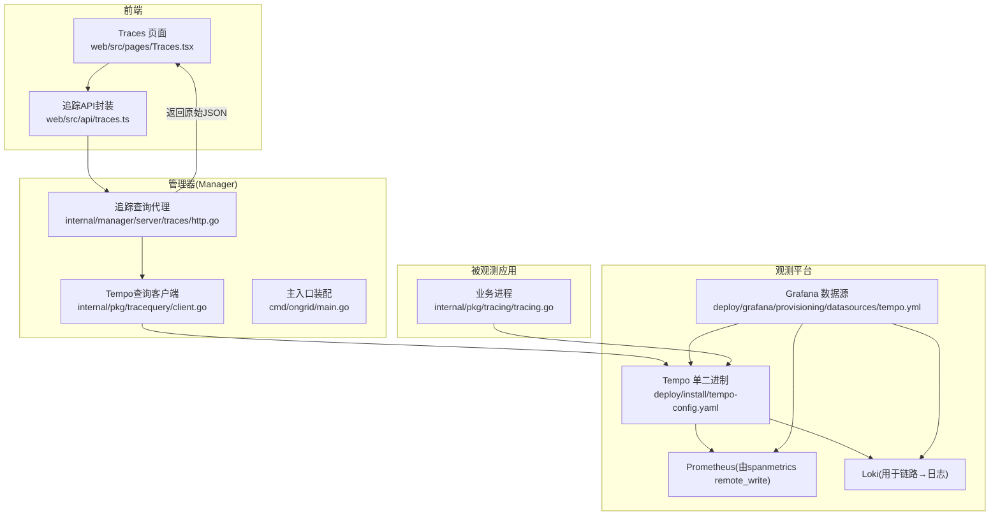
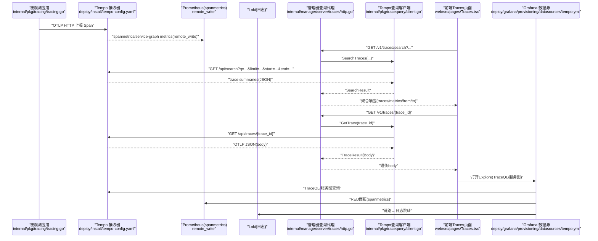
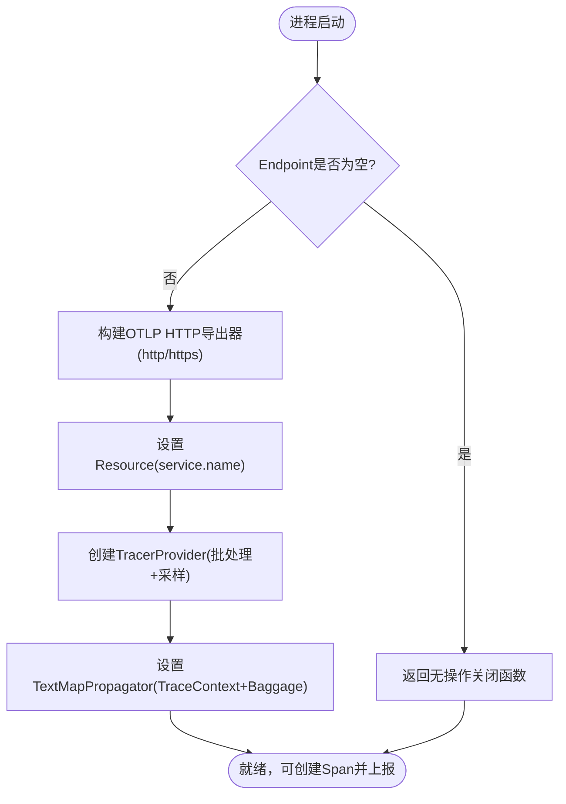
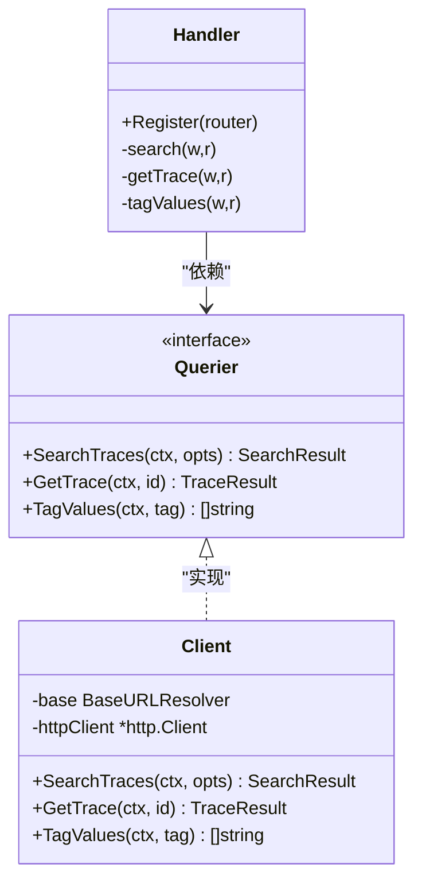
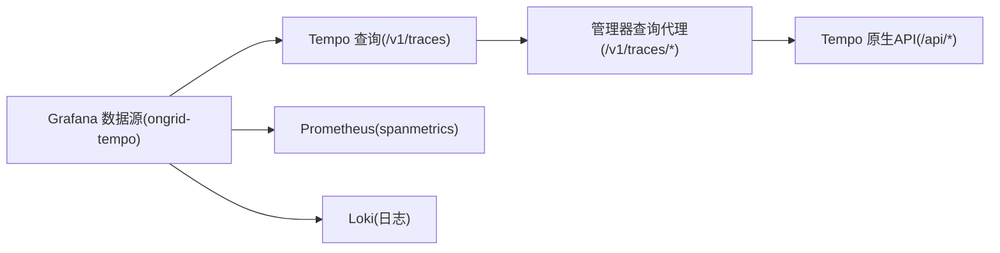
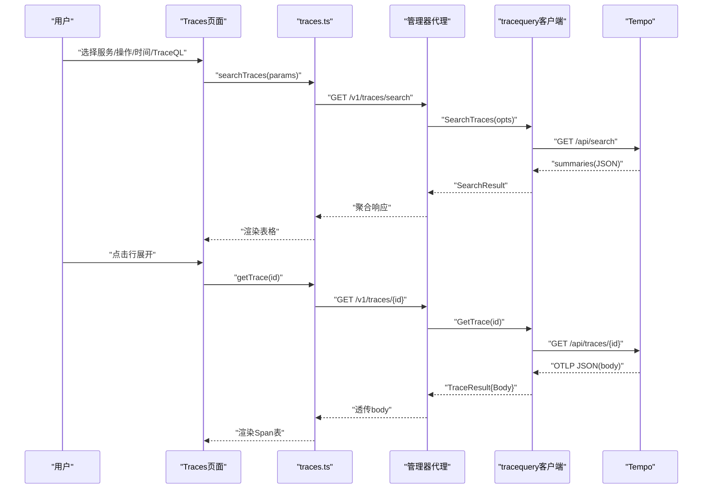
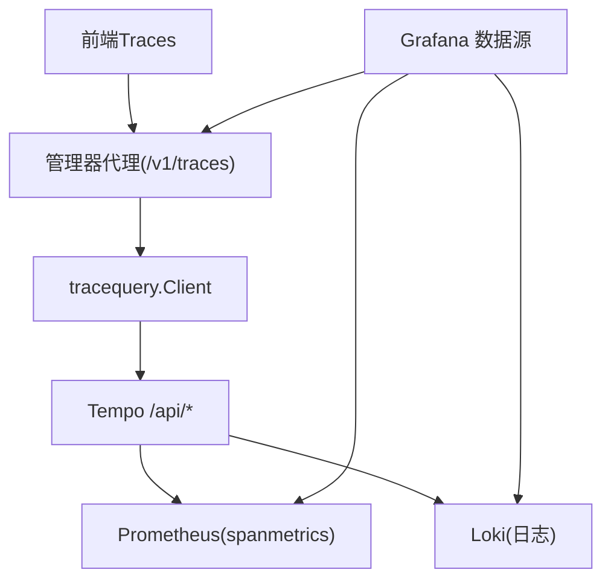

# 分布式追踪

<cite>
**本文引用的文件**   
- [tempo-config.yaml](file://deploy/install/tempo-config.yaml)
- [tracing.go](file://internal/pkg/tracing/tracing.go)
- [http.go](file://internal/manager/server/traces/http.go)
- [client.go](file://internal/pkg/tracequery/client.go)
- [main.go](file://cmd/ongrid/main.go)
- [tempo.yml](file://deploy/grafana/provisioning/datasources/tempo.yml)
- [Traces.tsx](file://web/src/pages/Traces.tsx)
- [traces.ts](file://web/src/api/traces.ts)
</cite>

## 目录
1. [简介](#简介)
2. [项目结构](#项目结构)
3. [核心组件](#核心组件)
4. [架构总览](#架构总览)
5. [详细组件分析](#详细组件分析)
6. [依赖关系分析](#依赖关系分析)
7. [性能与容量规划](#性能与容量规划)
8. [故障排查指南](#故障排查指南)
9. [结论](#结论)
10. [附录](#附录)

## 简介
本指南面向在 ongrid 中部署和使用 Tempo 分布式追踪的工程师，覆盖以下主题：
- Tempo 服务配置与数据源设置（含 Spanmetrics、Service Graph、本地存储与保留策略）
- 追踪数据采集与上报机制（OTLP、Span 生成与传播、采样）
- 在 Grafana 中查看与分析追踪数据（TraceQL、链路到日志/指标联动）
- 慢请求定位与性能瓶颈分析方法
- 采样策略与存储优化建议
- 与日志、指标的关联分析
- 系统性能调优与容量规划

## 项目结构
与追踪相关的关键位置如下：
- 后端代理与查询客户端：内部 HTTP 处理器将前端请求转发至 Tempo；HTTP 客户端封装对 Tempo API 的调用
- 应用侧埋点初始化：进程启动时初始化 OTel SDK，向 Tempo 发送 Span
- Grafana 数据源：通过 provisioned YAML 配置 Tempo 数据源，启用 tracesToLogs、tracesToMetrics、服务图
- 前端页面：提供 TraceQL 搜索、服务/操作筛选、直接 trace_id 跳转、Grafana Explore 深度链接

图示来源
- [http.go:1-229](file://internal/manager/server/traces/http.go#L1-L229)
- [client.go:1-253](file://internal/pkg/tracequery/client.go#L1-L253)
- [tempo-config.yaml:1-78](file://deploy/install/tempo-config.yaml#L1-L78)
- [tempo.yml:1-51](file://deploy/grafana/provisioning/datasources/tempo.yml#L1-L51)
- [Traces.tsx:1-881](file://web/src/pages/Traces.tsx#L1-L881)
- [traces.ts:1-113](file://web/src/api/traces.ts#L1-L113)
- [main.go:1160-1187](file://cmd/ongrid/main.go#L1160-L1187)
- [tracing.go:1-107](file://internal/pkg/tracing/tracing.go#L1-L107)

章节来源
- [http.go:1-229](file://internal/manager/server/traces/http.go#L1-L229)
- [client.go:1-253](file://internal/pkg/tracequery/client.go#L1-L253)
- [tempo-config.yaml:1-78](file://deploy/install/tempo-config.yaml#L1-L78)
- [tempo.yml:1-51](file://deploy/grafana/provisioning/datasources/tempo.yml#L1-L51)
- [Traces.tsx:1-881](file://web/src/pages/Traces.tsx#L1-L881)
- [traces.ts:1-113](file://web/src/api/traces.ts#L1-L113)
- [main.go:1160-1187](file://cmd/ongrid/main.go#L1160-L1187)
- [tracing.go:1-107](file://internal/pkg/tracing/tracing.go#L1-L107)

## 核心组件
- 追踪采集与上报（SDK 初始化）
  - 负责创建 TracerProvider、设置资源属性（service.name）、配置 OTLP HTTP 导出器、批处理与采样策略、文本映射传播器（TraceContext + Baggage）
  - 当 Endpoint 为空时，Init 返回无操作关闭函数，便于在不启用追踪的场景下安全 defer
- 查询代理与客户端
  - 管理器暴露 /v1/traces/* 路由，统一鉴权后代理到 Tempo 的 /api/search、/api/traces/<id>、/api/search/tag/<tag>/values
  - 客户端封装对 Tempo 的 GET 请求，支持 TraceQL 与标签过滤、时间窗口、时长范围、结果上限等
- Grafana 数据源
  - 预置 ongrid-tempo 数据源，启用 tracesToLogsV2（到 ongrid-loki）、tracesToMetrics（到 ongrid-prometheus，基于 spanmetrics）、服务图与节点图
- 前端 Traces 页面
  - 提供快速筛选（service.name、operation）、时间范围、TraceQL 输入、快捷预设、trace_id 直达、实时刷新、跳转到 Grafana Explore

章节来源
- [tracing.go:1-107](file://internal/pkg/tracing/tracing.go#L1-L107)
- [http.go:1-229](file://internal/manager/server/traces/http.go#L1-L229)
- [client.go:1-253](file://internal/pkg/tracequery/client.go#L1-L253)
- [tempo.yml:1-51](file://deploy/grafana/provisioning/datasources/tempo.yml#L1-L51)
- [Traces.tsx:1-881](file://web/src/pages/Traces.tsx#L1-L881)
- [traces.ts:1-113](file://web/src/api/traces.ts#L1-L113)

## 架构总览
下图展示从应用埋点到 Grafana 可视化的端到端链路。

图示来源
- [tracing.go:1-107](file://internal/pkg/tracing/tracing.go#L1-L107)
- [tempo-config.yaml:1-78](file://deploy/install/tempo-config.yaml#L1-L78)
- [http.go:1-229](file://internal/manager/server/traces/http.go#L1-L229)
- [client.go:1-253](file://internal/pkg/tracequery/client.go#L1-L253)
- [tempo.yml:1-51](file://deploy/grafana/provisioning/datasources/tempo.yml#L1-L51)
- [Traces.tsx:1-881](file://web/src/pages/Traces.tsx#L1-L881)

## 详细组件分析

### 组件A：追踪采集与上报（OTLP + 传播 + 采样）
- 初始化流程
  - 根据 Config.Endpoint 决定启用或禁用导出
  - 构建 OTLP HTTP 导出器（可切换 http/https）
  - 设置 Resource（service.name 为关键维度），注册全局 TracerProvider
  - 使用 ParentBased + TraceIDRatioBased 采样，默认全量
  - 设置 TextMapPropagator 包含 TraceContext 与 Baggage，实现跨进程/跨服务传播
  - 批处理超时短（秒级），确保事故场景下延迟低
- 典型用法
  - 进程启动时调用 Init(ctx, cfg)，defer Shutdown
  - 后续通过 otel.Tracer("your-tracer") 创建 Span
  - HTTP 中间件自动注入/提取上下文（参见主入口装配）

图示来源
- [tracing.go:1-107](file://internal/pkg/tracing/tracing.go#L1-L107)

章节来源
- [tracing.go:1-107](file://internal/pkg/tracing/tracing.go#L1-L107)
- [main.go:1160-1187](file://cmd/ongrid/main.go#L1160-L1187)

### 组件B：查询代理与客户端（/v1/traces → /api/*）
- 路由设计
  - GET /v1/traces/search：参数包括 q（TraceQL）、service、operation、start、end、limit、minDuration、maxDuration；当 q 为空时，按 service/operation 构造 tags 进行非 TraceQL 查询
  - GET /v1/traces/{trace_id}：按 ID 获取完整 OTLP 形状 body
  - GET /v1/traces/tags/{tag}/values：列举某 tag 的可能值（如 service.name、name）
- 错误与可用性
  - 当未启用后端（q=nil）时，所有路由返回 503，前端可显示“追踪已禁用”
  - 对上游非 2xx 返回包装为 BadGateway，并携带错误片段
- 客户端细节
  - SearchTraces：支持 TraceQL 与 legacy tags；limit 默认 100；start/end 以 Unix 秒传递；可选 min/max duration
  - TagValues：读取 v1 接口 tagValues 列表
  - GetTrace：路径编码 trace_id，返回原始 JSON body
  - do：统一超时、User-Agent、Accept、响应体大小限制（16MiB）

图示来源
- [http.go:1-229](file://internal/manager/server/traces/http.go#L1-L229)
- [client.go:1-253](file://internal/pkg/tracequery/client.go#L1-L253)

章节来源
- [http.go:1-229](file://internal/manager/server/traces/http.go#L1-L229)
- [client.go:1-253](file://internal/pkg/tracequery/client.go#L1-L253)

### 组件C：Grafana 数据源与联动
- 数据源 ongrid-tempo
  - URL 来自环境变量（ONGRID_TRACE_QUERY_URL），指向管理器提供的 /v1/traces 代理
  - tracesToLogsV2：按 service.name、edge_id 等标签映射到 ongrid-loki，支持 filterByTraceID
  - tracesToMetrics：基于 spanmetrics 指标（rate/error/duration）在 ongrid-prometheus 上渲染 RED 面板
  - 服务图/节点图：启用 nodeGraph，服务图数据来源于 Prometheus
- 常见运维要点
  - 若面板报“无数据”，优先检查时间窗、标签是否匹配、UID 漂移
  - 若报“数据源错误”，从 Grafana 容器侧测试可达性与鉴权/TLS

图示来源
- [tempo.yml:1-51](file://deploy/grafana/provisioning/datasources/tempo.yml#L1-L51)
- [http.go:1-229](file://internal/manager/server/traces/http.go#L1-L229)
- [client.go:1-253](file://internal/pkg/tracequery/client.go#L1-L253)

章节来源
- [tempo.yml:1-51](file://deploy/grafana/provisioning/datasources/tempo.yml#L1-L51)

### 组件D：前端 Traces 页面
- 功能要点
  - 快捷预设：错误 trace、超过 1s 的慢 trace、全部
  - Facet 筛选：service.name、operation、时间范围、trace_id 直达
  - TraceQL 高级查询：非空时覆盖 facet
  - 实时模式：每 5 秒轮询
  - 跳转 Grafana Explore：保持当前 TraceQL 或从 facet 合成
- 数据兼容
  - 兼容不同版本 Tempo 的 summary 字段（durationMs/traceDurationMs、startTimeUnixNano/startTime）
  - 兼容 OTLP 新旧包裹结构（batches/resourceSpans、scopeSpans/instrumentationLibrarySpans）

图示来源
- [Traces.tsx:1-881](file://web/src/pages/Traces.tsx#L1-L881)
- [traces.ts:1-113](file://web/src/api/traces.ts#L1-L113)
- [http.go:1-229](file://internal/manager/server/traces/http.go#L1-L229)
- [client.go:1-253](file://internal/pkg/tracequery/client.go#L1-L253)

章节来源
- [Traces.tsx:1-881](file://web/src/pages/Traces.tsx#L1-L881)
- [traces.ts:1-113](file://web/src/api/traces.ts#L1-L113)

## 依赖关系分析
- 组件耦合
  - 前端仅依赖管理器的 /v1/traces 接口，不直接访问 Tempo
  - 管理器通过 tracequery.Client 访问 Tempo，且支持动态 base URL 解析（便于热更新）
  - Grafana 数据源通过环境变量指向管理器代理，避免暴露原生 /api/*
- 外部依赖
  - Tempo 单二进制：distributor/ingester/compactor/querier 组合，本地块存储，spanmetrics/service-graph 生成器写入 Prometheus
  - Prometheus/Loki：作为指标与日志后端，支撑 RED 面板与链路→日志跳转

图示来源
- [http.go:1-229](file://internal/manager/server/traces/http.go#L1-L229)
- [client.go:1-253](file://internal/pkg/tracequery/client.go#L1-L253)
- [tempo-config.yaml:1-78](file://deploy/install/tempo-config.yaml#L1-L78)
- [tempo.yml:1-51](file://deploy/grafana/provisioning/datasources/tempo.yml#L1-L51)

章节来源
- [http.go:1-229](file://internal/manager/server/traces/http.go#L1-L229)
- [client.go:1-253](file://internal/pkg/tracequery/client.go#L1-L253)
- [tempo-config.yaml:1-78](file://deploy/install/tempo-config.yaml#L1-L78)
- [tempo.yml:1-51](file://deploy/grafana/provisioning/datasources/tempo.yml#L1-L51)

## 性能与容量规划
- 采样策略
  - 根采样（Head Sampling）：在根 Span 处按比例采样，成本低但可能丢失尾部问题
  - 尾采样（Tail Sampling）：在整条链路完成后决策，适合保留错误/慢路径，开销更高
  - 混合策略：基础头采样 + 条件尾采样（始终保留错误/慢请求）
  - 工程落地：在 OTel Collector 前做尾采样，而非在 Tempo 内
- 存储与保留
  - 本地块大小约 100MB，压缩窗口 1h，默认保留 7 天（可按需调整）
  - 单 trace 最大字节数限制，防止异常大 trace 撑爆内存
- 吞吐与队列
  - 按租户限流与突发阈值控制 ingester 写入速率
  - 池化 worker 与队列深度影响吞吐与延迟
- 查询性能
  - 基于 trace_id 的查找为 O(1) 级别；TraceQL 跨属性扫描成本较高
  - 推荐先通过指标告警/Exemplar 定位 trace_id，再回查 Tempo
- 容量规划建议
  - 估算入站 Span 体积（QPS × 平均 Span 大小 × 保留天数）
  - 结合磁盘 I/O 与对象存储（若迁移）评估吞吐
  - 监控 distributor/ingester/compactor/querier 关键指标，关注 p99 查询延迟与 flush 速率

章节来源
- [tempo-config.yaml:1-78](file://deploy/install/tempo-config.yaml#L1-L78)

## 故障排查指南
- 数据源错误/面板无数据
  - 先在 Grafana 数据源设置页执行“保存并测试”，或在 Grafana 容器侧 curl 后端健康端点
  - 确认 URL/UID/鉴权/TLS 正确；Provisioning 会覆盖 UI 修改
  - “无数据”多为时间窗/标签/模板变量问题，可在 Explore 复现
- 追踪不可用
  - 若后端未启用，管理器代理会返回 503；前端应显示“追踪已禁用”
  - 检查 OTLP 上报端口、网络连通性、TLS 配置
- 查询缓慢
  - 缩小时间窗、增加 TraceQL 过滤条件
  - 避免高基数标签的宽泛扫描
- 指标缺失
  - 确认 spanmetrics/service-graph 已启用且 remote_write 成功
  - 检查 Prometheus 是否收到 ongrid-tempo 的指标

章节来源
- [http.go:1-229](file://internal/manager/server/traces/http.go#L1-L229)
- [tempo.yml:1-51](file://deploy/grafana/provisioning/datasources/tempo.yml#L1-L51)

## 结论
本方案以“轻索引、重检索”的 Tempo 为核心，配合 spanmetrics/service-graph 将追踪信号转化为可告警、可联动的指标与可视化能力。通过统一的 /v1/traces 代理与 Grafana 数据源，既保障安全边界，又提供丰富的分析体验。在生产环境中，建议采用合理的采样策略与容量规划，并以“指标先行、回溯追踪”的方式提升排障效率。

## 附录

### A. Tempo 配置要点速览
- 监听端口：HTTP 3200、gRPC 9095
- OTLP 接收：gRPC 4317、HTTP 4318
- 保留策略：默认 7 天，块大小 ~100MB，压缩窗口 1h
- Spanmetrics 与服务图：remote_write 到 Prometheus，开启 exemplars
- 存储：本地 backend，WAL 与 blocks 分离目录
- 限流与上限：按租户 rate/burst、单 trace 最大字节数

章节来源
- [tempo-config.yaml:1-78](file://deploy/install/tempo-config.yaml#L1-L78)

### B. Grafana 数据源关键项
- 名称/UID：ongrid-tempo
- URL：${ONGRID_TRACE_QUERY_URL}（指向管理器代理）
- tracesToLogsV2：映射 service.name、edge_id 到 Loki，支持按 trace_id 过滤
- tracesToMetrics：基于 spanmetrics 的 Sample/Error Rate 等面板
- 服务图/节点图：启用 nodeGraph

章节来源
- [tempo.yml:1-51](file://deploy/grafana/provisioning/datasources/tempo.yml#L1-L51)

### C. 前端常用操作
- 快捷预设：错误 trace、超过 1s 的慢 trace、全部
- Facet 筛选：service.name、operation、时间范围、trace_id 直达
- TraceQL：高级查询，非空时覆盖 facet
- 实时模式：每 5 秒自动刷新
- 跳转 Grafana Explore：保持当前 TraceQL 或从 facet 合成

章节来源
- [Traces.tsx:1-881](file://web/src/pages/Traces.tsx#L1-L881)
- [traces.ts:1-113](file://web/src/api/traces.ts#L1-L113)