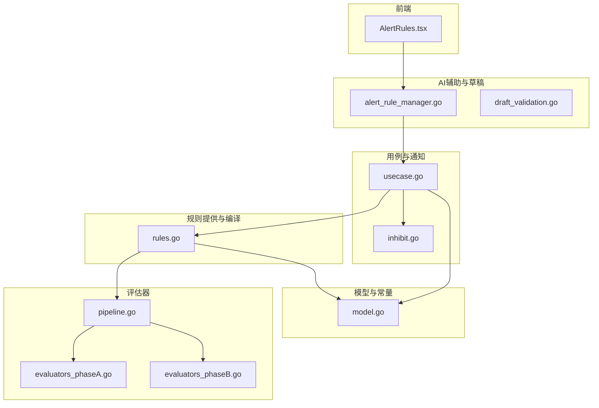
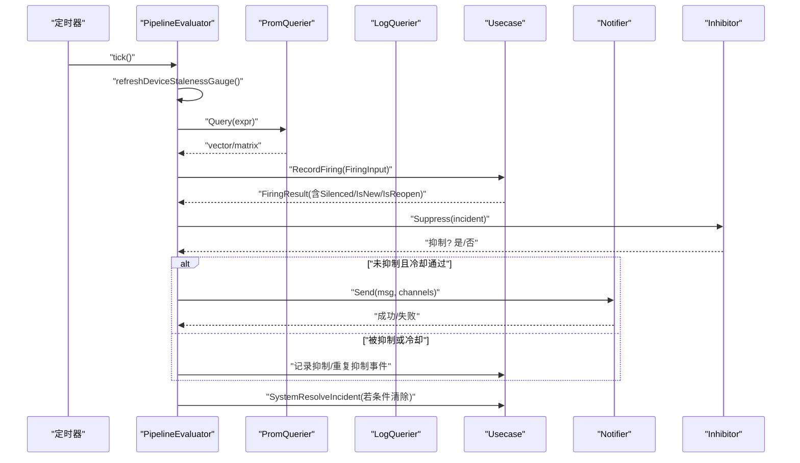
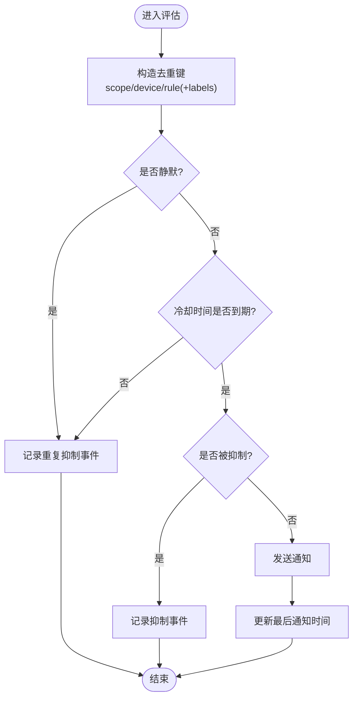
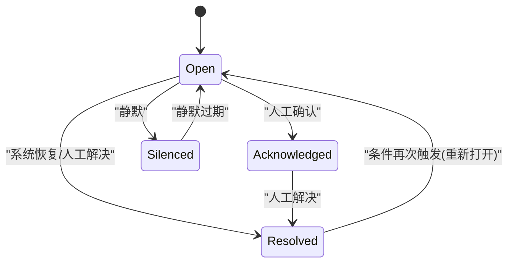
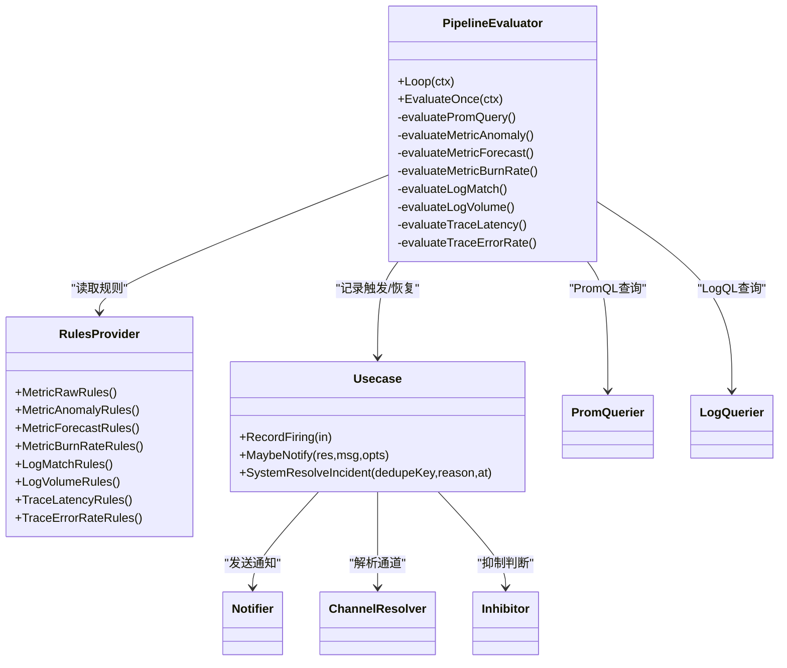

# 告警规则配置

<cite>
**本文引用的文件**   
- [pipeline.go](file://internal/manager/biz/alert/pipeline.go)
- [rules.go](file://internal/manager/biz/alert/rules.go)
- [evaluators_phaseA.go](file://internal/manager/biz/alert/evaluators_phaseA.go)
- [evaluators_phaseB.go](file://internal/manager/biz/alert/evaluators_phaseB.go)
- [inhibit.go](file://internal/manager/biz/alert/inhibit.go)
- [usecase.go](file://internal/manager/biz/alert/usecase.go)
- [model.go](file://internal/manager/model/alert/model.go)
- [alert_rule_manager.go](file://internal/manager/biz/aiops/alertconfig/alert_rule_manager.go)
- [draft_validation.go](file://internal/manager/biz/aiops/alertconfig/draft_validation.go)
- [AlertRules.tsx](file://web/src/pages/AlertRules.tsx)
</cite>

## 目录
1. [简介](#简介)
2. [项目结构](#项目结构)
3. [核心组件](#核心组件)
4. [架构总览](#架构总览)
5. [详细组件分析](#详细组件分析)
6. [依赖关系分析](#依赖关系分析)
7. [性能与稳定性](#性能与稳定性)
8. [故障排查指南](#故障排查指南)
9. [结论](#结论)
10. [附录](#附录)

## 简介
本文件面向在 onGrid 平台中定义、管理与运行 PromQL 告警规则的操作员与开发者，系统阐述：
- PromQL 告警规则的定义语法与最佳实践（以 metric_raw 为核心）
- onGrid 的告警管道处理流程：评估、去重、抑制、聚合与恢复
- 告警状态管理与生命周期控制（新建、重复触发、静默、抑制、冷却、自动恢复）
- 常见业务场景的规则示例与级别设置建议
- 版本管理、变更审批与测试验证方法

## 项目结构
onGrid 的告警子系统位于 manager 域内，采用“规则模型 + 编译期校验 + 运行时评估器 + 通知路由”的分层设计。关键路径如下：
- 规则模型与常量：定义规则种类、作用域、事件类型、持久化实体等
- 规则提供者：从存储加载并缓存当前启用的规则快照
- 评估器：按 tick 周期执行各类规则（PromQL、日志、链路等）
- 用例层：负责去重、静默、冷却、抑制、通知投递与状态流转
- 前端页面：提供规则列表、编辑与预览能力

图表来源
- [model.go:1-177](file://internal/manager/model/alert/model.go#L1-L177)
- [rules.go:193-479](file://internal/manager/biz/alert/rules.go#L193-L479)
- [pipeline.go:75-196](file://internal/manager/biz/alert/pipeline.go#L75-L196)
- [evaluators_phaseA.go:148-338](file://internal/manager/biz/alert/evaluators_phaseA.go#L148-L338)
- [evaluators_phaseB.go:28-163](file://internal/manager/biz/alert/evaluators_phaseB.go#L28-L163)
- [usecase.go:1215-1358](file://internal/manager/biz/alert/usecase.go#L1215-L1358)
- [inhibit.go:25-74](file://internal/manager/biz/alert/inhibit.go#L25-L74)
- [alert_rule_manager.go:1-51](file://internal/manager/biz/aiops/alertconfig/alert_rule_manager.go#L1-L51)
- [draft_validation.go:1-53](file://internal/manager/biz/aiops/alertconfig/draft_validation.go#L1-L53)
- [AlertRules.tsx:187-218](file://web/src/pages/AlertRules.tsx#L187-L218)

章节来源
- [model.go:1-177](file://internal/manager/model/alert/model.go#L1-L177)
- [rules.go:193-479](file://internal/manager/biz/alert/rules.go#L193-L479)
- [pipeline.go:75-196](file://internal/manager/biz/alert/pipeline.go#L75-L196)
- [evaluators_phaseA.go:148-338](file://internal/manager/biz/alert/evaluators_phaseA.go#L148-L338)
- [evaluators_phaseB.go:28-163](file://internal/manager/biz/alert/evaluators_phaseB.go#L28-L163)
- [usecase.go:1215-1358](file://internal/manager/biz/alert/usecase.go#L1215-L1358)
- [inhibit.go:25-74](file://internal/manager/biz/alert/inhibit.go#L25-L74)
- [alert_rule_manager.go:1-51](file://internal/manager/biz/aiops/alertconfig/alert_rule_manager.go#L1-L51)
- [draft_validation.go:1-53](file://internal/manager/biz/aiops/alertconfig/draft_validation.go#L1-L53)
- [AlertRules.tsx:187-218](file://web/src/pages/AlertRules.tsx#L187-L218)

## 核心组件
- 规则模型与种类
  - 支持 metric_raw、metric_anomaly、metric_forecast、metric_burn_rate、log_match、log_volume、trace_latency、trace_error_rate 等
  - 作用域：host、global、monitoring_pipeline；不同 kind 有默认与作用域白名单
- 规则提供者与缓存
  - 周期性刷新启用中的规则，原子替换快照，避免并发读取不一致
- 评估器
  - Phase-A：基于 Prometheus 的指标类规则（raw/anomaly/forecast/burn_rate）
  - Phase-B：基于 Loki 的日志匹配/体积、基于 Prom(spanmetrics) 的链路延迟/错误率
- 用例层
  - 记录触发、去重键生成、静默匹配、冷却门控、抑制判断、通知投递、自动恢复
- AI 辅助与草稿
  - 通过 AI 工具生成/校验规则草稿，并在创建前进行预览与一致性检查

章节来源
- [model.go:61-177](file://internal/manager/model/alert/model.go#L61-L177)
- [rules.go:193-479](file://internal/manager/biz/alert/rules.go#L193-L479)
- [pipeline.go:75-196](file://internal/manager/biz/alert/pipeline.go#L75-L196)
- [evaluators_phaseA.go:148-338](file://internal/manager/biz/alert/evaluators_phaseA.go#L148-L338)
- [evaluators_phaseB.go:28-163](file://internal/manager/biz/alert/evaluators_phaseB.go#L28-L163)
- [usecase.go:1215-1358](file://internal/manager/biz/alert/usecase.go#L1215-L1358)
- [alert_rule_manager.go:1-51](file://internal/manager/biz/aiops/alertconfig/alert_rule_manager.go#L1-L51)
- [draft_validation.go:1-53](file://internal/manager/biz/aiops/alertconfig/draft_validation.go#L1-L53)

## 架构总览
onGrid 的告警管道由“定时轮询 + 多源查询 + 统一用例编排”构成。每个 tick 会：
- 刷新设备心跳指标（用于 host 离线检测）
- 依次执行 metric_raw / anomaly / forecast / burn_rate（PromQL）
- 可选执行 log_match / log_volume（LogQL）
- 可选执行 trace_latency / trace_error_rate（Prom spanmetrics）
- 对每条命中结果进行去重、静默、抑制、冷却后决定是否通知
- 对比上一 tick 的已触发集合，自动恢复不再命中的实例

图表来源
- [pipeline.go:147-196](file://internal/manager/biz/alert/pipeline.go#L147-L196)
- [pipeline.go:254-380](file://internal/manager/biz/alert/pipeline.go#L254-L380)
- [evaluators_phaseB.go:280-300](file://internal/manager/biz/alert/evaluators_phaseB.go#L280-L300)
- [usecase.go:1215-1358](file://internal/manager/biz/alert/usecase.go#L1215-L1358)
- [inhibit.go:44-74](file://internal/manager/biz/alert/inhibit.go#L44-L74)

## 详细组件分析

### PromQL 告警规则（metric_raw）定义与最佳实践
- 定义方式
  - kind=metric_raw，spec 仅包含 expr（PromQL 表达式），表达式本身即谓词
  - 当表达式返回非空向量时，每一条向量样本对应一个告警实例（按标签集去重）
- 推荐写法
  - 使用比较运算符直接过滤不满足条件的系列（如 up == 0、cpu_pct > 90）
  - 明确选择器限定范围，避免全量扫描
  - 为 host 级规则确保返回 device_id 标签，便于去重与定位
- 恢复机制
  - 当表达式不再返回该样本时，系统自动将上次触发的实例标记为 resolved

章节来源
- [rules.go:485-522](file://internal/manager/biz/alert/rules.go#L485-L522)
- [pipeline.go:254-380](file://internal/manager/biz/alert/pipeline.go#L254-L380)

### 异常与预测类规则（metric_anomaly / metric_forecast）
- metric_anomaly
  - 基于滚动基线（均值±标准差或中位数+MAD）计算偏离度，超过阈值则触发
  - 支持 baseline_window、baseline_step、deviation、for_seconds 等参数
- metric_forecast
  - 使用 predict_linear 外推未来值并与阈值比较，适合容量预警
  - 支持 fit_window、predict_seconds、operator、threshold、selector 等参数

章节来源
- [rules.go:47-91](file://internal/manager/biz/alert/rules.go#L47-L91)
- [evaluators_phaseA.go:148-244](file://internal/manager/biz/alert/evaluators_phaseA.go#L148-L244)

### SLO 燃烧率规则（metric_burn_rate）
- 实现 Google SRE Workbook 的多窗口多燃烧率模式
- 所有窗口必须同时触发才产生告警，有效过滤短时抖动
- SLI 表达式需使用 $window 或显式范围选择器，SLO 以百分比表示

章节来源
- [rules.go:167-191](file://internal/manager/biz/alert/rules.go#L167-L191)
- [evaluators_phaseA.go:246-338](file://internal/manager/biz/alert/evaluators_phaseA.go#L246-L338)

### 日志与链路类规则（Phase-B）
- log_match / log_volume
  - 基于 LogQL 的 count_over_time 统计最近窗口内的行数，按 operator/threshold 判定
  - 支持 stream_selector 与 line_filter（正则）
- trace_latency / trace_error_rate
  - 基于 Prom 的 spanmetrics 指标，分别评估分位延迟与错误率是否越界

章节来源
- [evaluators_phaseB.go:28-163](file://internal/manager/biz/alert/evaluators_phaseB.go#L28-L163)
- [evaluators_phaseB.go:165-278](file://internal/manager/biz/alert/evaluators_phaseB.go#L165-L278)

### 去重、抑制与聚合机制
- 去重键
  - 默认按 scope_type/device_id/rule 组合；对于 pipeline 类规则，附加 label 集形成唯一键
  - 忽略 __name__、ongrid_source 等非身份标签，避免同一主体被拆成多条
- 抑制
  - edge_offline 抑制同设备下其他 host 级告警
  - prom_ingest_fail 抑制 pipeline 级 scrape_down 告警
- 聚合
  - burn_rate 要求多窗口全部触发，起到“AND 聚合”的效果
  - 主机离线检测通过 gauge 刷新 + metric_raw 表达式实现“按设备聚合”

图表来源
- [pipeline.go:418-466](file://internal/manager/biz/alert/pipeline.go#L418-L466)
- [inhibit.go:44-74](file://internal/manager/biz/alert/inhibit.go#L44-L74)
- [usecase.go:1215-1358](file://internal/manager/biz/alert/usecase.go#L1215-L1358)

### 告警状态管理与生命周期控制
- 状态机
  - open → acknowledged → silenced → resolved
  - 系统可自动 reopen/resolved（条件恢复）
- 生命周期关键点
  - RecordFiring：新建/重复触发/重新打开
  - SystemResolveIncident：条件恢复
  - SilenceIncident：静默（带有效期）
  - MaybeNotify：静默/冷却/抑制/发送策略门控后的通知投递
- 事件审计
  - firing/reopened/silenced/resolved/notification_sent/failed/inhibited 等事件写入事件表，支撑可观测性与排障

图表来源
- [model.go:11-23](file://internal/manager/model/alert/model.go#L11-L23)
- [usecase.go:1152-1192](file://internal/manager/biz/alert/usecase.go#L1152-L1192)
- [usecase.go:1474-1516](file://internal/manager/biz/alert/usecase.go#L1474-L1516)

### 发送策略（dampening）与冷却
- 冷却（Cooldown）
  - 同一 incident 两次通知之间需间隔至少配置的冷却时长
- 发送策略（Dampening）
  - 可在规则维度配置“窗口内最小触发次数”，低于阈值则跳过通知但保留事件
  - 与冷却共同作用，避免告警风暴

章节来源
- [usecase.go:1236-1259](file://internal/manager/biz/alert/usecase.go#L1236-L1259)
- [usecase.go:1458-1472](file://internal/manager/biz/alert/usecase.go#L1458-L1472)

### 常见业务场景与规则示例（思路）
- 服务可用性
  - 使用 metric_raw，表达式为 up == 0，scope=global，severity=critical
- 性能指标异常
  - 使用 metric_anomaly，method=zscore，deviation=3，baseline_window=1h，scope=host
- 资源使用率过高
  - 使用 metric_forecast，predict_seconds=21600，operator="<="，threshold=磁盘可用字节阈值，scope=host
- 日志异常
  - 使用 log_match，stream_selector 指定应用日志流，line_filter 匹配错误关键字，window=5m
- 链路延迟/错误率
  - 使用 trace_latency/trace_error_rate，按服务与分位/错误率阈值配置

说明：以上为规则设计思路与字段要点，具体表达式与参数请参考各 evaluator 的编译与校验逻辑。

章节来源
- [evaluators_phaseA.go:148-244](file://internal/manager/biz/alert/evaluators_phaseA.go#L148-L244)
- [evaluators_phaseB.go:28-163](file://internal/manager/biz/alert/evaluators_phaseB.go#L28-L163)

### 告警级别与优先级
- 级别定义
  - severity 字段用于区分告警严重等级（如 warning/critical）
- 优先级与抑制
  - 内置抑制规则优先于普通告警：例如 edge_offline 存在时抑制同设备其他 host 告警
- 通道筛选
  - 可通过 Channel.match_severity_min 限制通道接收的最小级别

章节来源
- [inhibit.go:44-74](file://internal/manager/biz/alert/inhibit.go#L44-L74)
- [model.go:340-357](file://internal/manager/model/alert/model.go#L340-L357)

### 版本管理与变更审批流程
- 规则版本
  - 规则行包含 created_at/updated_at，结合 rule_key 作为稳定标识
- 草稿与预览
  - 通过 AI 工具生成规则草稿，保存前进行预览与一致性校验（skipped_reason、contract/scope 检查）
- 变更审批
  - 建议在 CI/CD 中引入规则校验与预览步骤；管理员方可修改规则（前端权限提示）

章节来源
- [alert_rule_manager.go:290-312](file://internal/manager/biz/aiops/alertconfig/alert_rule_manager.go#L290-L312)
- [draft_validation.go:20-53](file://internal/manager/biz/aiops/alertconfig/draft_validation.go#L20-L53)
- [AlertRules.tsx:187-218](file://web/src/pages/AlertRules.tsx#L187-L218)

### 测试与验证方法
- 单元测试
  - 覆盖 metric_raw 的触发与恢复、anomaly/forecast 表达式构建、burn_rate 多窗口 AND 语义、log/trace 评估器
- 端到端验证
  - 使用静态规则提供者注入 mock Prom/Loki 响应，断言 incident 数量、dedupe_key、状态转换与通知行为
- 规则校验
  - 利用 draft_validation 对规则草稿进行语法/作用域/预览一致性检查

章节来源
- [pipeline_test.go:56-157](file://internal/manager/biz/alert/pipeline_test.go#L56-L157)
- [evaluators_phaseA_test.go:60-133](file://internal/manager/biz/alert/evaluators_phaseA_test.go#L60-L133)
- [draft_validation.go:20-53](file://internal/manager/biz/aiops/alertconfig/draft_validation.go#L20-L53)

## 依赖关系分析
- 组件耦合
  - PipelineEvaluator 依赖 RulesProvider、PromQuerier、LogQuerier、Notifier、ChannelResolver、Inhibitor
  - Usecase 串联 RecordFiring、MaybeNotify、SystemResolveIncident 等核心流程
- 外部依赖
  - Prometheus（即时查询）、Loki（范围查询）、通知渠道（Webhook/Slack/飞书/钉钉/企微/Telegram）
- 潜在循环依赖
  - 通过接口抽象（PromQuerier/LogQuerier/Notifier/Inhibitor）解耦，避免循环引用

图表来源
- [pipeline.go:75-196](file://internal/manager/biz/alert/pipeline.go#L75-L196)
- [rules.go:193-479](file://internal/manager/biz/alert/rules.go#L193-L479)
- [usecase.go:1215-1358](file://internal/manager/biz/alert/usecase.go#L1215-L1358)
- [inhibit.go:25-74](file://internal/manager/biz/alert/inhibit.go#L25-L74)

## 性能与稳定性
- 评估器计时
  - 每类评估器均埋点观察耗时与错误，便于定位慢查询与数据源问题
- 恢复路径优化
  - 通过 snapshot 对比快速识别恢复项，减少不必要的数据库写放大
- 错误隔离
  - 单条规则查询失败不影响其他规则执行；gauge 刷新失败仅记录警告

章节来源
- [evaluators_phaseA.go:18-32](file://internal/manager/biz/alert/evaluators_phaseA.go#L18-32)
- [pipeline.go:198-252](file://internal/manager/biz/alert/pipeline.go#L198-L252)

## 故障排查指南
- 常见问题
  - 规则未生效：检查 kind 是否为 evaluable、expr 是否正确、scope 是否允许
  - 告警风暴：开启 dampening 与冷却，检查抑制规则是否生效
  - 无法恢复：确认表达式在恢复后是否返回空向量（PromQL 过滤语义）
- 定位手段
  - 查看事件表（firing/reopened/silenced/resolved/inhibited）
  - 核对 dedupe_key 是否符合预期（device_id、label 集）
  - 检查通道配置与 endpoint 是否有效

章节来源
- [usecase.go:1215-1358](file://internal/manager/biz/alert/usecase.go#L1215-L1358)
- [model.go:248-267](file://internal/manager/model/alert/model.go#L248-L267)

## 结论
onGrid 的告警体系以 metric_raw 为核心，辅以 anomaly/forecast/burn_rate 以及日志/链路类规则，形成统一的评估与通知管道。通过严格的去重、静默、抑制与冷却机制，配合自动恢复与事件审计，既保证了高可靠性的告警体验，也为复杂业务场景提供了灵活的扩展能力。

## 附录
- 规则输入与校验
  - RuleInput 字段包括 kind、scope_type、join_mode、severity、conditions/spec、labels、runbook_url、notify_channel_ids、send_policy 等
  - buildConditionsJSON 对各 kind 的 spec 进行强校验与规范化（如 burn_rate 的 SLO 百分比归一化）
- 作用域与默认值
  - defaultScopeForKind 与 allowedScopesForKind 决定每种 kind 的默认与作用域白名单

章节来源
- [usecase.go:575-813](file://internal/manager/biz/alert/usecase.go#L575-L813)
- [usecase.go:815-981](file://internal/manager/biz/alert/usecase.go#L815-L981)
- [usecase.go:983-1023](file://internal/manager/biz/alert/usecase.go#L983-L1023)