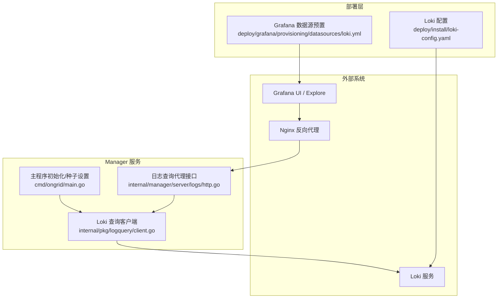
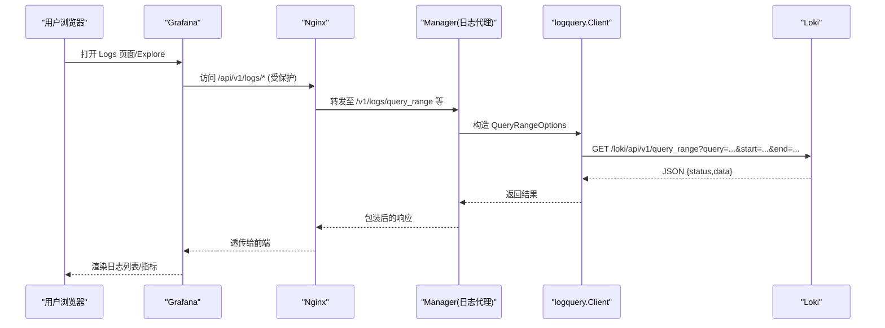
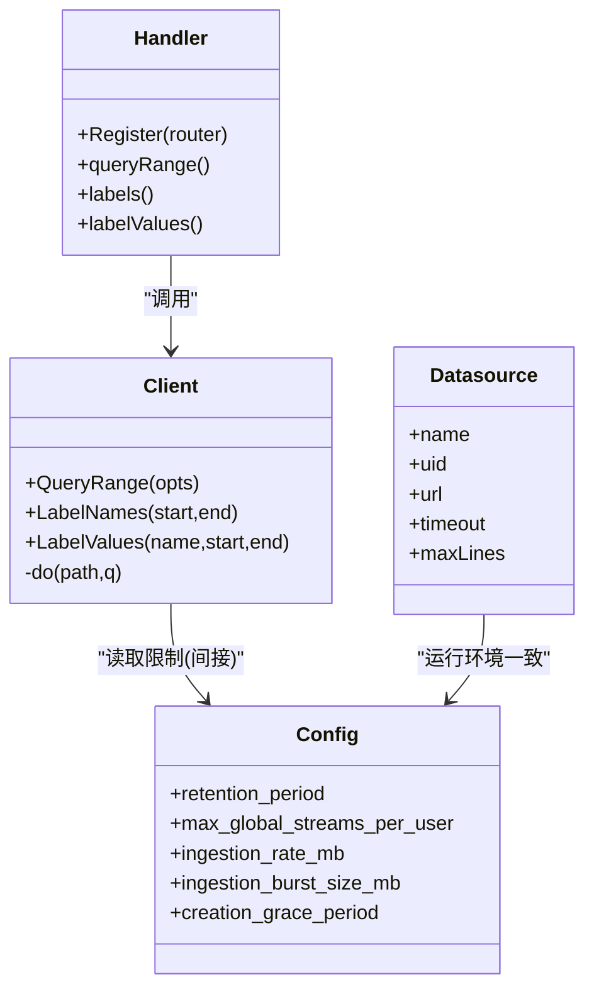

# 日志监控

<cite>
**本文引用的文件**   
- [deploy/install/loki-config.yaml](file://deploy/install/loki-config.yaml)
- [deploy/grafana/provisioning/datasources/loki.yml](file://deploy/grafana/provisioning/datasources/loki.yml)
- [internal/pkg/logquery/client.go](file://internal/pkg/logquery/client.go)
- [internal/manager/server/logs/http.go](file://internal/manager/server/logs/http.go)
- [cmd/ongrid/main.go](file://cmd/ongrid/main.go)
- [internal/manager/biz/knowledge/builtin_vault/diagnostics/loki-ingestion-backpressure.md](file://internal/manager/biz/knowledge/builtin_vault/diagnostics/loki-ingestion-backpressure.md)
- [internal/manager/biz/knowledge/builtin_vault/diagnostics/grafana-datasource-errors.md](file://internal/manager/biz/knowledge/builtin_vault/diagnostics/grafana-datasource-errors.md)
</cite>

## 目录
1. [简介](#简介)
2. [项目结构](#项目结构)
3. [核心组件](#核心组件)
4. [架构总览](#架构总览)
5. [详细组件分析](#详细组件分析)
6. [依赖关系分析](#依赖关系分析)
7. [性能与成本优化建议](#性能与成本优化建议)
8. [故障排查指南](#故障排查指南)
9. [结论](#结论)
10. [附录：配置清单与最佳实践](#附录配置清单与最佳实践)

## 简介
本指南面向使用本仓库内置 Loki 日志聚合能力的运维与开发者，覆盖以下主题：
- Loki 单节点配置与数据源设置（Grafana）
- 日志采集、索引与标签设计要点
- 在 Grafana 中查询与分析日志的方法（LogQL 使用思路）
- 基于 Loki Ruler 的告警规则配置与触发条件
- 日志轮转与清理策略（保留期与压缩）
- 分布式日志关联分析与追踪联动（Loki + Tempo）
- 性能优化与存储成本控制建议

## 项目结构
与日志子系统相关的核心位置如下：
- 部署配置
  - Loki 单节点配置：deploy/install/loki-config.yaml
  - Grafana 数据源预置：deploy/grafana/provisioning/datasources/loki.yml
- 后端服务
  - Manager 侧 Loki 查询客户端：internal/pkg/logquery/client.go
  - Manager 对前端暴露的受保护代理接口：internal/manager/server/logs/http.go
  - 启动时注入默认设置（含 Loki URL）：cmd/ongrid/main.go
- 诊断知识库
  - 入站背压与 429 问题定位：diagnostics/loki-ingestion-backpressure.md
  - Grafana 数据源错误排查：diagnostics/grafana-datasource-errors.md

图表来源
- [deploy/install/loki-config.yaml:1-67](file://deploy/install/loki-config.yaml#L1-L67)
- [deploy/grafana/provisioning/datasources/loki.yml:1-19](file://deploy/grafana/provisioning/datasources/loki.yml#L1-L19)
- [internal/pkg/logquery/client.go:1-280](file://internal/pkg/logquery/client.go#L1-L280)
- [internal/manager/server/logs/http.go:1-200](file://internal/manager/server/logs/http.go#L1-L200)
- [cmd/ongrid/main.go:1276-1308](file://cmd/ongrid/main.go#L1276-L1308)

章节来源
- [deploy/install/loki-config.yaml:1-67](file://deploy/install/loki-config.yaml#L1-L67)
- [deploy/grafana/provisioning/datasources/loki.yml:1-19](file://deploy/grafana/provisioning/datasources/loki.yml#L1-L19)
- [internal/pkg/logquery/client.go:1-280](file://internal/pkg/logquery/client.go#L1-L280)
- [internal/manager/server/logs/http.go:1-200](file://internal/manager/server/logs/http.go#L1-L200)
- [cmd/ongrid/main.go:1276-1308](file://cmd/ongrid/main.go#L1276-L1308)

## 核心组件
- Loki 单节点配置
  - 启用文件系统后端、TSDB 索引、compactor 保留期、ruler 本地规则存储等。
  - 关键限制：全局流上限、入站速率/突发、未来样本容忍窗口、最大查询系列数与回溯时间等。
- Grafana 数据源预置
  - 通过环境变量注入 Loki URL，固定 UID，禁止编辑，设置超时与最大行数。
- Manager 日志查询客户端
  - 封装 query_range、label names/values 调用；统一设置 X-Scope-OrgID；带超时与响应体大小限制。
- Manager 日志查询代理接口
  - 将受保护的 /v1/logs/* 请求转发到 Loki API；参数校验、限幅、方向控制。
- 启动种子设置
  - 首次启动时将 Loki URL 写入系统设置，供前端与工具链使用。

章节来源
- [deploy/install/loki-config.yaml:1-67](file://deploy/install/loki-config.yaml#L1-L67)
- [deploy/grafana/provisioning/datasources/loki.yml:1-19](file://deploy/grafana/provisioning/datasources/loki.yml#L1-L19)
- [internal/pkg/logquery/client.go:1-280](file://internal/pkg/logquery/client.go#L1-L280)
- [internal/manager/server/logs/http.go:1-200](file://internal/manager/server/logs/http.go#L1-L200)
- [cmd/ongrid/main.go:1276-1308](file://cmd/ongrid/main.go#L1276-L1308)

## 架构总览
下图展示了从前端到 Loki 的完整链路，以及关键配置点。

图表来源
- [internal/manager/server/logs/http.go:1-200](file://internal/manager/server/logs/http.go#L1-L200)
- [internal/pkg/logquery/client.go:1-280](file://internal/pkg/logquery/client.go#L1-L280)
- [deploy/grafana/provisioning/datasources/loki.yml:1-19](file://deploy/grafana/provisioning/datasources/loki.yml#L1-L19)

## 详细组件分析

### Loki 配置与数据源设置
- 单节点模式
  - 监听端口、gRPC 端口、common.path_prefix、ring 使用内存 kvstore。
  - schema_config 使用 v13 与 TSDB 索引，对象存储为 filesystem。
  - compactor 开启保留删除，ruler 使用本地存储。
- 限制与容错
  - 保留期 30 天（720h），全局流上限 10000，入站速率/突发限制，拒绝旧样本并设置最大年龄。
  - 针对时钟漂移放宽 future sample 容忍窗口（creation_grace_period）。
- Grafana 数据源
  - 名称 ongrid-loki，UID 固定，access proxy，URL 由环境变量注入，不可编辑。
  - 超时与最大行数可调。

章节来源
- [deploy/install/loki-config.yaml:1-67](file://deploy/install/loki-config.yaml#L1-L67)
- [deploy/grafana/provisioning/datasources/loki.yml:1-19](file://deploy/grafana/provisioning/datasources/loki.yml#L1-L19)

### 日志采集与索引、标签与过滤
- 采集端（Edge/Agent）
  - 通过 push 路径写入 Loki（nginx 数据面已做鉴权），读路径经 Manager 代理。
- 索引与标签
  - 使用 TSDB 索引，schema v13，index period 24h。
  - 标签应低基数，避免高基数维度进入 label（参考诊断文档）。
- 过滤与查询
  - 通过 LogQL 表达式进行行级过滤与聚合；在 Manager 侧提供 labels/label values 辅助选择器。

章节来源
- [internal/manager/server/logs/http.go:1-200](file://internal/manager/server/logs/http.go#L1-L200)
- [internal/pkg/logquery/client.go:1-280](file://internal/pkg/logquery/client.go#L1-L280)
- [internal/manager/biz/knowledge/builtin_vault/diagnostics/loki-ingestion-backpressure.md:1-76](file://internal/manager/biz/knowledge/builtin_vault/diagnostics/loki-ingestion-backpressure.md#L1-L76)

### 在 Grafana 中查询与分析日志（LogQL）
- 数据源
  - 预置 ongrid-loki，UID 固定，便于仪表盘引用。
- 查询入口
  - 可通过 Explore 直接查询；也可通过 Manager 提供的 /v1/logs/* 代理进行受限访问。
- 常用语法思路
  - 标签选择器：{job="...", instance="..."}
  - 行过滤：|= "error"
  - 聚合：count_over_time、rate、sum by(...)
  - 时间窗口：start/end 或相对时间范围
- 注意
  - 合理设置 limit 与 step，避免大窗口无界查询。
  - 标签保持低基数，避免流爆炸。

章节来源
- [deploy/grafana/provisioning/datasources/loki.yml:1-19](file://deploy/grafana/provisioning/datasources/loki.yml#L1-L19)
- [internal/manager/server/logs/http.go:1-200](file://internal/manager/server/logs/http.go#L1-L200)
- [internal/pkg/logquery/client.go:1-280](file://internal/pkg/logquery/client.go#L1-L280)

### 日志告警规则（Loki Ruler）
- 规则存储
  - ruler.storage.type=local，rules 目录位于 /loki/rules，临时目录 /loki/rules-tmp。
- 规则编写
  - 使用 LogQL 定义条件，如 log_volume、log_match 等（按 Loki 官方语法）。
- 触发与通知
  - 可对接 Alertmanager（当前未配置），或在平台侧结合其他机制处理。
- 管理方式
  - 通过本地文件系统放置规则文件，配合 compactor 与保留策略生效。

章节来源
- [deploy/install/loki-config.yaml:1-67](file://deploy/install/loki-config.yaml#L1-L67)

### 日志轮转与清理策略
- 保留期
  - limits_config.retention_period=720h（约 30 天）。
- 压缩与删除
  - compactor.working_directory=/loki/compactor，delete_request_store=filesystem。
- 索引周期
  - index.period=24h，有助于分片与清理。

章节来源
- [deploy/install/loki-config.yaml:1-67](file://deploy/install/loki-config.yaml#L1-L67)

### 分布式日志关联分析与追踪联动
- 数据源联动
  - 同时集成 Prometheus、Tempo，可在同一界面进行指标、日志、追踪的交叉分析。
- 启动种子
  - 首次启动会注入 Grafana Root URL、Loki URL、Traces URL 等基础设置。
- 查询能力
  - 除日志外，还提供 PromQL/TraceQL 工具能力（按需注册）。

章节来源
- [cmd/ongrid/main.go:1276-1308](file://cmd/ongrid/main.go#L1276-L1308)

## 依赖关系分析
- 组件耦合
  - Manager 日志代理依赖 logquery.Client；Client 依赖 HTTP 客户端与 BaseURLResolver。
  - Grafana 数据源通过环境变量指向 Loki，独立于 Manager。
- 外部依赖
  - Nginx 负责对外鉴权与路由；Loki 提供最终存储与查询。
- 潜在风险
  - 高基数标签导致流爆炸；大窗口/大 limit 导致慢查询；时钟漂移导致样本被拒。

图表来源
- [internal/manager/server/logs/http.go:1-200](file://internal/manager/server/logs/http.go#L1-L200)
- [internal/pkg/logquery/client.go:1-280](file://internal/pkg/logquery/client.go#L1-L280)
- [deploy/install/loki-config.yaml:1-67](file://deploy/install/loki-config.yaml#L1-L67)
- [deploy/grafana/provisioning/datasources/loki.yml:1-19](file://deploy/grafana/provisioning/datasources/loki.yml#L1-L19)

章节来源
- [internal/manager/server/logs/http.go:1-200](file://internal/manager/server/logs/http.go#L1-L200)
- [internal/pkg/logquery/client.go:1-280](file://internal/pkg/logquery/client.go#L1-L280)
- [deploy/install/loki-config.yaml:1-67](file://deploy/install/loki-config.yaml#L1-L67)
- [deploy/grafana/provisioning/datasources/loki.yml:1-19](file://deploy/grafana/provisioning/datasources/loki.yml#L1-L19)

## 性能与成本优化建议
- 控制标签基数
  - 避免将高基数字段放入标签；将其放入日志正文，用 LogQL 过滤。
- 限制查询范围
  - 缩小时间窗口、限制 limit/step，避免全量扫描。
- 调整入站限制
  - 根据业务峰值调整 ingestion_rate_mb/ingestion_burst_size_mb，必要时扩容 ingester。
- 时钟同步
  - 确保节点时间同步，避免“too far behind”类丢弃。
- 存储与保留
  - 合理设置 retention_period 与 compactor 工作目录，定期清理。
- 资源隔离
  - 多租户场景下使用 X-Scope-OrgID 隔离读写。

章节来源
- [internal/manager/biz/knowledge/builtin_vault/diagnostics/loki-ingestion-backpressure.md:1-76](file://internal/manager/biz/knowledge/builtin_vault/diagnostics/loki-ingestion-backpressure.md#L1-L76)
- [deploy/install/loki-config.yaml:1-67](file://deploy/install/loki-config.yaml#L1-L67)
- [internal/pkg/logquery/client.go:1-280](file://internal/pkg/logquery/client.go#L1-L280)

## 故障排查指南
- 入站背压与 429
  - 检查 shipper 日志是否出现 429/out of order/stream limit；查看 Loki metrics 中的 loki_discarded_samples_total。
  - 区分速率限制与时序问题，优先降低噪声源或提升限制。
- Grafana 数据源错误
  - 先测试后端健康（/ready），再检查 URL/auth/TLS；确认 provisioning 未被覆盖。
  - “No data”多为时间范围/标签变更导致，建议在 Explore 复现。

章节来源
- [internal/manager/biz/knowledge/builtin_vault/diagnostics/loki-ingestion-backpressure.md:1-76](file://internal/manager/biz/knowledge/builtin_vault/diagnostics/loki-ingestion-backpressure.md#L1-L76)
- [internal/manager/biz/knowledge/builtin_vault/diagnostics/grafana-datasource-errors.md:1-87](file://internal/manager/biz/knowledge/builtin_vault/diagnostics/grafana-datasource-errors.md#L1-L87)

## 结论
本方案以单节点 Loki 为核心，结合 Manager 的安全代理与 Grafana 的数据源预置，提供了开箱即用的日志采集、查询与分析能力。通过合理的标签设计、查询限制与保留策略，可在保证可用性的同时控制成本与复杂度。对于大规模场景，建议逐步引入多副本与更严格的基数治理。

## 附录：配置清单与最佳实践
- 关键配置项
  - Loki
    - 保留期：limits_config.retention_period
    - 全局流上限：limits_config.max_global_streams_per_user
    - 入站速率/突发：ingestion_rate_mb / ingestion_burst_size_mb
    - 未来样本容忍：creation_grace_period
    - 索引周期：schema_config.index.period
    - Compactor 工作目录：compactor.working_directory
  - Grafana 数据源
    - name/uid/url/timeout/maxLines
- 最佳实践
  - 标签低基数、正文高基数
  - 小窗口、限条数、合理 step
  - 时钟同步、唯一 stream 标签
  - 定期评估保留期与磁盘占用

章节来源
- [deploy/install/loki-config.yaml:1-67](file://deploy/install/loki-config.yaml#L1-L67)
- [deploy/grafana/provisioning/datasources/loki.yml:1-19](file://deploy/grafana/provisioning/datasources/loki.yml#L1-L19)