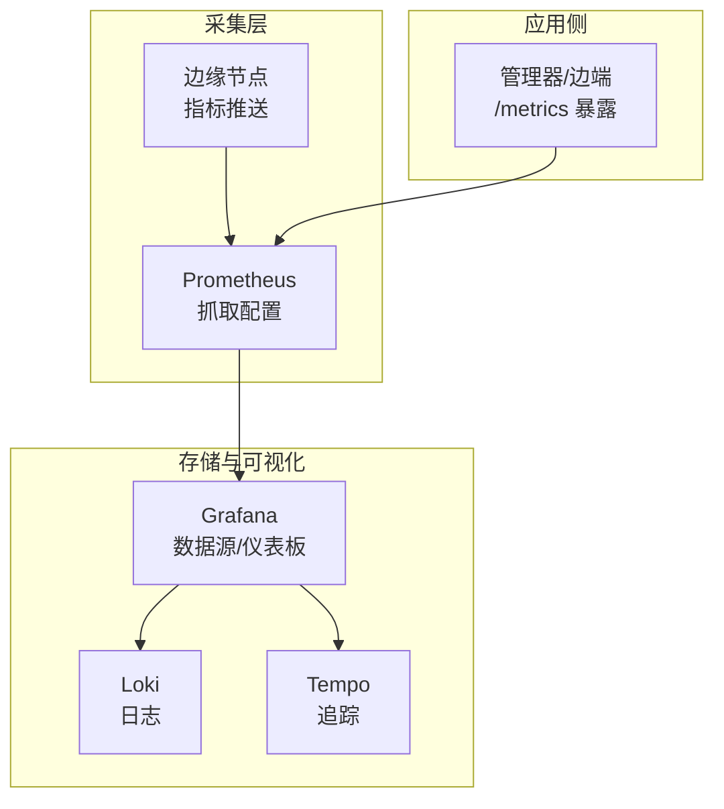
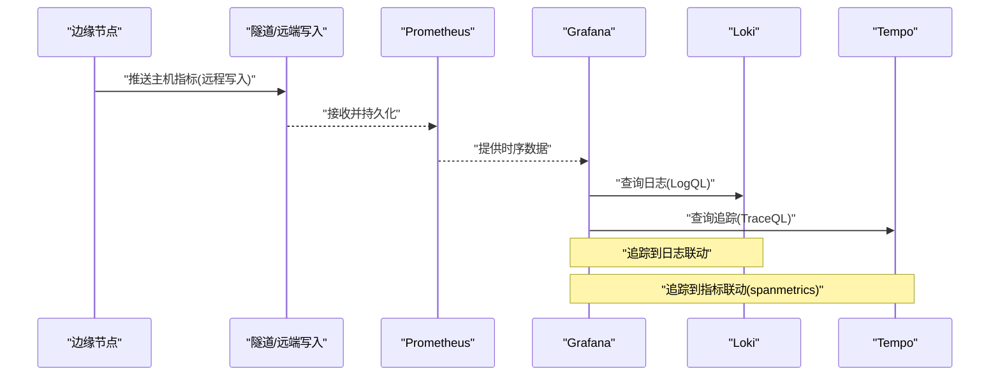
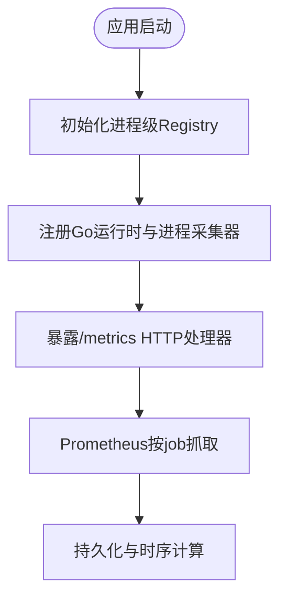
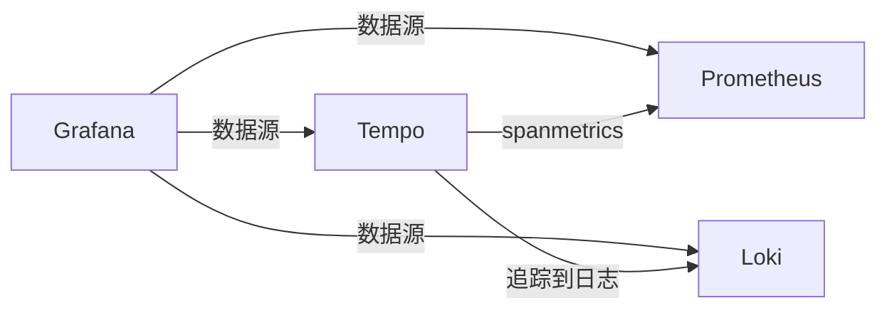
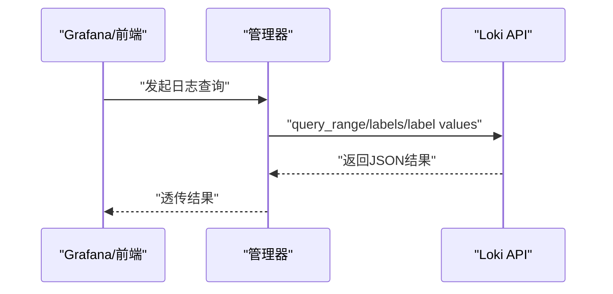
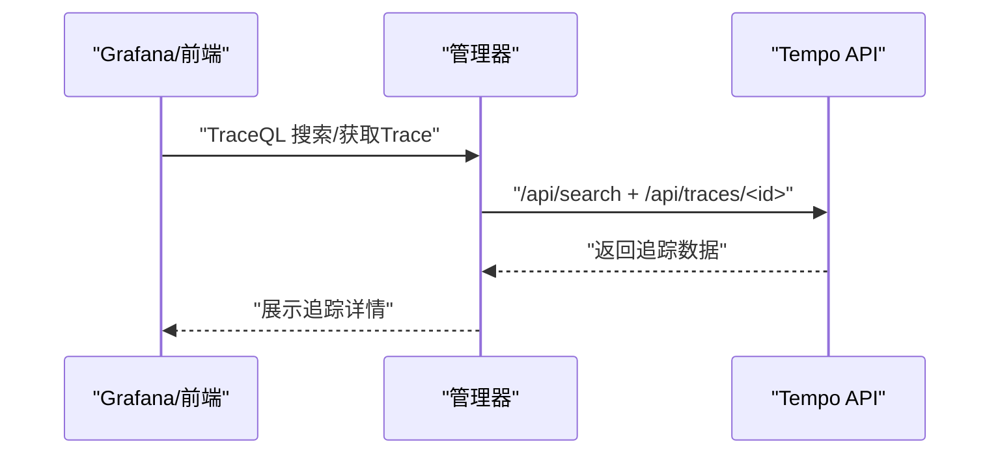
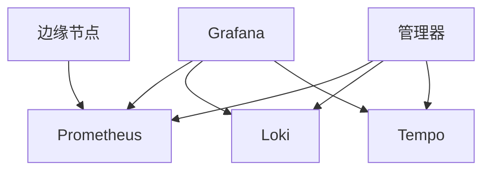

# 监控告警

<cite>
**本文引用的文件**   
- [deploy/prometheus/prometheus.yml](file://deploy/prometheus/prometheus.yml)
- [deploy/grafana/provisioning/datasources/prometheus.yml](file://deploy/grafana/provisioning/datasources/prometheus.yml)
- [deploy/grafana/provisioning/datasources/loki.yml](file://deploy/grafana/provisioning/datasources/loki.yml)
- [deploy/grafana/provisioning/datasources/tempo.yml](file://deploy/grafana/provisioning/datasources/tempo.yml)
- [deploy/grafana/provisioning/dashboards/json/server-detail.json](file://deploy/grafana/provisioning/dashboards/json/server-detail.json)
- [internal/pkg/prom/prom.go](file://internal/pkg/prom/prom.go)
- [internal/pkg/logquery/client.go](file://internal/pkg/logquery/client.go)
- [internal/pkg/tracequery/client.go](file://internal/pkg/tracequery/client.go)
- [deploy/install/prometheus-rules.yml](file://deploy/install/prometheus-rules.yml)
</cite>

## 目录
1. [简介](#简介)
2. [项目结构](#项目结构)
3. [核心组件](#核心组件)
4. [架构总览](#架构总览)
5. [详细组件分析](#详细组件分析)
6. [依赖关系分析](#依赖关系分析)
7. [性能与容量规划](#性能与容量规划)
8. [故障排查指南](#故障排查指南)
9. [结论](#结论)
10. [附录](#附录)

## 简介
本指南面向运维与平台工程师，提供基于 Prometheus、Grafana、Loki、Tempo 的监控、日志与分布式追踪一体化配置与使用手册。内容覆盖：
- Prometheus 指标采集与自定义指标暴露
- Grafana 数据源与仪表板配置及自定义创建
- 告警规则定义与通知渠道集成（邮件、Slack、企业微信等）
- 系统健康关键指标解读与阈值建议
- Loki 日志聚合与分析
- Tempo 分布式追踪与性能分析
- 监控数据备份与恢复策略

## 项目结构
仓库中与可观测性相关的配置与客户端实现分布如下：
- 部署配置
  - Prometheus 抓取配置
  - Grafana 数据源与内置仪表板
  - 安装脚本中的 Prometheus 规则
- 后端能力
  - 进程级 /metrics 注册与处理器
  - Loki 查询客户端
  - Tempo 查询客户端

图表来源
- [deploy/prometheus/prometheus.yml:1-28](file://deploy/prometheus/prometheus.yml#L1-L28)
- [deploy/grafana/provisioning/datasources/prometheus.yml:1-11](file://deploy/grafana/provisioning/datasources/prometheus.yml#L1-L11)
- [deploy/grafana/provisioning/datasources/loki.yml:1-19](file://deploy/grafana/provisioning/datasources/loki.yml#L1-L19)
- [deploy/grafana/provisioning/datasources/tempo.yml:1-51](file://deploy/grafana/provisioning/datasources/tempo.yml#L1-L51)

章节来源
- [deploy/prometheus/prometheus.yml:1-28](file://deploy/prometheus/prometheus.yml#L1-L28)
- [deploy/grafana/provisioning/datasources/prometheus.yml:1-11](file://deploy/grafana/provisioning/datasources/prometheus.yml#L1-L11)
- [deploy/grafana/provisioning/datasources/loki.yml:1-19](file://deploy/grafana/provisioning/datasources/loki.yml#L1-L19)
- [deploy/grafana/provisioning/datasources/tempo.yml:1-51](file://deploy/grafana/provisioning/datasources/tempo.yml#L1-L51)

## 核心组件
- Prometheus 抓取与自监控
  - 全局抓取与评估间隔
  - 对管理器服务的抓取任务
  - 主机指标通过边缘→隧道→remote_write 流入（不在本文件中直接声明静态抓取）
- Grafana 数据源
  - Prometheus、Loki、Tempo 的数据源预置
  - 环境变量注入外部地址
  - 追踪到日志/指标的联动开关
- 内置仪表板
  - 服务器详情仪表板（CPU、内存、Load、网络）
- 后端指标暴露
  - 统一的进程级 Registry 与 /metrics 处理器
- 日志与追踪客户端
  - Loki 查询客户端（LogQL）
  - Tempo 查询客户端（TraceQL）

章节来源
- [deploy/prometheus/prometheus.yml:1-28](file://deploy/prometheus/prometheus.yml#L1-L28)
- [deploy/grafana/provisioning/datasources/prometheus.yml:1-11](file://deploy/grafana/provisioning/datasources/prometheus.yml#L1-L11)
- [deploy/grafana/provisioning/datasources/loki.yml:1-19](file://deploy/grafana/provisioning/datasources/loki.yml#L1-L19)
- [deploy/grafana/provisioning/datasources/tempo.yml:1-51](file://deploy/grafana/provisioning/datasources/tempo.yml#L1-L51)
- [deploy/grafana/provisioning/dashboards/json/server-detail.json:1-457](file://deploy/grafana/provisioning/dashboards/json/server-detail.json#L1-L457)
- [internal/pkg/prom/prom.go:1-30](file://internal/pkg/prom/prom.go#L1-L30)
- [internal/pkg/logquery/client.go:1-280](file://internal/pkg/logquery/client.go#L1-L280)
- [internal/pkg/tracequery/client.go:1-253](file://internal/pkg/tracequery/client.go#L1-L253)

## 架构总览
下图展示了从边缘节点到可视化的端到端链路，以及管理器服务如何暴露自身指标供 Prometheus 抓取。

图表来源
- [deploy/prometheus/prometheus.yml:1-28](file://deploy/prometheus/prometheus.yml#L1-L28)
- [deploy/grafana/provisioning/datasources/tempo.yml:1-51](file://deploy/grafana/provisioning/datasources/tempo.yml#L1-L51)
- [deploy/grafana/provisioning/datasources/loki.yml:1-19](file://deploy/grafana/provisioning/datasources/loki.yml#L1-L19)

## 详细组件分析

### Prometheus 指标收集与自定义指标
- 抓取目标
  - 自监控：Prometheus 自身
  - 管理器服务：固定抓取路径与端口
- 抓取与评估间隔
  - 全局默认 30s；管理器任务可单独设置为 15s
- 主机指标来源
  - 通过 edge → tunnel → remote_write 方式流入，避免重复抓取本地主机
- 自定义指标暴露
  - 使用统一进程级 Registry 与 /metrics 处理器
  - 标签基数红线：禁止使用高基数字段作为标签（如 org_id/user_id/edge_id/完整URL），仅允许方法、状态码、结果等低基数字段

图表来源
- [internal/pkg/prom/prom.go:1-30](file://internal/pkg/prom/prom.go#L1-L30)
- [deploy/prometheus/prometheus.yml:1-28](file://deploy/prometheus/prometheus.yml#L1-L28)

章节来源
- [deploy/prometheus/prometheus.yml:1-28](file://deploy/prometheus/prometheus.yml#L1-L28)
- [internal/pkg/prom/prom.go:1-30](file://internal/pkg/prom/prom.go#L1-L30)

### Grafana 数据源与内置仪表板
- 数据源
  - Prometheus：默认数据源，代理访问
  - Loki：支持超时与最大行数设置，URL 由环境变量注入
  - Tempo：启用“追踪到日志”和“追踪到指标”，并配置 spanmetrics 查询与服务拓扑
- 内置仪表板
  - “服务器详情”包含 CPU、内存、Load1、网络接收速率面板，带设备变量过滤与阈值颜色

图表来源
- [deploy/grafana/provisioning/datasources/prometheus.yml:1-11](file://deploy/grafana/provisioning/datasources/prometheus.yml#L1-L11)
- [deploy/grafana/provisioning/datasources/loki.yml:1-19](file://deploy/grafana/provisioning/datasources/loki.yml#L1-L19)
- [deploy/grafana/provisioning/datasources/tempo.yml:1-51](file://deploy/grafana/provisioning/datasources/tempo.yml#L1-L51)
- [deploy/grafana/provisioning/dashboards/json/server-detail.json:1-457](file://deploy/grafana/provisioning/dashboards/json/server-detail.json#L1-L457)

章节来源
- [deploy/grafana/provisioning/datasources/prometheus.yml:1-11](file://deploy/grafana/provisioning/datasources/prometheus.yml#L1-L11)
- [deploy/grafana/provisioning/datasources/loki.yml:1-19](file://deploy/grafana/provisioning/datasources/loki.yml#L1-L19)
- [deploy/grafana/provisioning/datasources/tempo.yml:1-51](file://deploy/grafana/provisioning/datasources/tempo.yml#L1-L51)
- [deploy/grafana/provisioning/dashboards/json/server-detail.json:1-457](file://deploy/grafana/provisioning/dashboards/json/server-detail.json#L1-L457)

### 告警规则与通知渠道
- 规则文件
  - 安装目录下提供 Prometheus 规则文件，用于集中管理告警规则
- 通知渠道
  - 可通过标准 Alertmanager 或系统集成对接邮件、Slack、企业微信等
  - 建议在规则中为关键指标设置多窗口（短/长）以区分瞬时抖动与持续异常

章节来源
- [deploy/install/prometheus-rules.yml:1-200](file://deploy/install/prometheus-rules.yml#L1-L200)

### 系统健康监控关键指标与阈值建议
- CPU 使用率
  - 指标：基于 idle 比率计算的总体占用
  - 阈值建议：>80% 警告，>90% 严重
- 内存使用率
  - 指标：可用内存占比换算为使用率
  - 阈值建议：>80% 警告，>90% 严重
- Load1
  - 指标：1分钟平均负载
  - 阈值建议：结合CPU核数，>4 警告，>8 严重（示例值）
- 网络接收速率
  - 指标：单位时间接收字节速率
  - 阈值建议：根据带宽上限设定百分比或绝对阈值

章节来源
- [deploy/grafana/provisioning/dashboards/json/server-detail.json:1-457](file://deploy/grafana/provisioning/dashboards/json/server-detail.json#L1-L457)

### 日志聚合与分析（Loki）
- 数据源配置
  - 名称、类型、代理访问、超时与最大行数
  - URL 通过环境变量注入，便于切换内置或外部 Loki
- 查询客户端
  - 支持 query_range、label names/values 等接口
  - 单租户场景下自动注入 X-Scope-OrgID
  - 请求体大小限制与错误截断，避免大响应影响稳定性

图表来源
- [internal/pkg/logquery/client.go:1-280](file://internal/pkg/logquery/client.go#L1-L280)
- [deploy/grafana/provisioning/datasources/loki.yml:1-19](file://deploy/grafana/provisioning/datasources/loki.yml#L1-L19)

章节来源
- [deploy/grafana/provisioning/datasources/loki.yml:1-19](file://deploy/grafana/provisioning/datasources/loki.yml#L1-L19)
- [internal/pkg/logquery/client.go:1-280](file://internal/pkg/logquery/client.go#L1-L280)

### 分布式追踪与性能分析（Tempo）
- 数据源配置
  - 启用“追踪到日志”、“追踪到指标”，配置服务映射与搜索
  - 通过环境变量注入查询地址
- 查询客户端
  - 支持 TraceQL 搜索、标签值枚举、获取单个 Trace
  - 兼容不同版本返回形态，保留原始 JSON 以便上层灵活处理

图表来源
- [internal/pkg/tracequery/client.go:1-253](file://internal/pkg/tracequery/client.go#L1-L253)
- [deploy/grafana/provisioning/datasources/tempo.yml:1-51](file://deploy/grafana/provisioning/datasources/tempo.yml#L1-L51)

章节来源
- [deploy/grafana/provisioning/datasources/tempo.yml:1-51](file://deploy/grafana/provisioning/datasources/tempo.yml#L1-L51)
- [internal/pkg/tracequery/client.go:1-253](file://internal/pkg/tracequery/client.go#L1-L253)

## 依赖关系分析
- 组件耦合
  - Grafana 依赖三个数据源（Prometheus/Loki/Tempo）
  - 管理器通过 HTTP 客户端调用 Loki/Tempo 查询接口
  - Prometheus 负责抓取管理器与自监控，主机指标通过 remote_write 接入
- 外部依赖
  - 环境变量注入外部服务地址（Loki、Tempo）
  - 容器编排中通过 service name 解析内部地址

图表来源
- [deploy/grafana/provisioning/datasources/prometheus.yml:1-11](file://deploy/grafana/provisioning/datasources/prometheus.yml#L1-L11)
- [deploy/grafana/provisioning/datasources/loki.yml:1-19](file://deploy/grafana/provisioning/datasources/loki.yml#L1-L19)
- [deploy/grafana/provisioning/datasources/tempo.yml:1-51](file://deploy/grafana/provisioning/datasources/tempo.yml#L1-L51)
- [deploy/prometheus/prometheus.yml:1-28](file://deploy/prometheus/prometheus.yml#L1-L28)
- [internal/pkg/logquery/client.go:1-280](file://internal/pkg/logquery/client.go#L1-L280)
- [internal/pkg/tracequery/client.go:1-253](file://internal/pkg/tracequery/client.go#L1-L253)

## 性能与容量规划
- 抓取频率
  - 全局 30s，管理器任务 15s；可根据业务规模调整
- 指标基数控制
  - 严格遵循标签基数红线，避免高基数字段导致 TSDB 膨胀
- 日志与追踪
  - 合理设置查询窗口与 limit，避免单次查询过大
  - 利用 spanmetrics 将热点服务 RED 指标回写至 Prometheus，便于告警与大屏展示

[本节为通用指导，不直接分析具体文件]

## 故障排查指南
- 无法抓取管理器指标
  - 检查 prometheus.yml 中 job 与 targets 配置是否正确
  - 确认管理器 /metrics 端口可达且未拦截
- Grafana 数据源不可用
  - 校验数据源 URL 与环境变量注入是否生效
  - 检查代理访问与网络连通性
- Loki 查询失败
  - 检查 BaseURL 与 X-Scope-OrgID 是否匹配
  - 关注非 200 响应与错误截断日志
- Tempo 查询失败
  - 检查 BaseURL 与 API 路径
  - 注意非 2xx 状态码与 not found 情况

章节来源
- [deploy/prometheus/prometheus.yml:1-28](file://deploy/prometheus/prometheus.yml#L1-L28)
- [internal/pkg/logquery/client.go:1-280](file://internal/pkg/logquery/client.go#L1-L280)
- [internal/pkg/tracequery/client.go:1-253](file://internal/pkg/tracequery/client.go#L1-L253)

## 结论
本项目提供了开箱即用的监控、日志与追踪能力：Prometheus 负责指标采集与自监控，Grafana 统一可视化并与 Loki/Tempo 联动，后端提供标准化的指标暴露与查询客户端。通过合理的规则与阈值、严格的标签基数控制与容量规划，可实现稳定高效的运维可观测体系。

[本节为总结，不直接分析具体文件]

## 附录

### 自定义指标最佳实践
- 使用统一 Registry 与 /metrics 处理器暴露指标
- 仅使用低基数字段作为标签（方法、状态码、结果等）
- 避免在高频指标上附加用户/租户/设备等高基数字段

章节来源
- [internal/pkg/prom/prom.go:1-30](file://internal/pkg/prom/prom.go#L1-L30)

### 自定义仪表板创建步骤
- 在 Grafana 中新建仪表板，添加时间序列面板
- 选择 ongrid-prometheus 数据源，编写 PromQL 表达式
- 添加变量（如 device_id）以支持动态筛选
- 保存并打标签，便于共享与管理

章节来源
- [deploy/grafana/provisioning/dashboards/json/server-detail.json:1-457](file://deploy/grafana/provisioning/dashboards/json/server-detail.json#L1-L457)

### 告警规则与通知渠道配置要点
- 在 prometheus-rules.yml 中定义规则，按业务域组织
- 针对关键指标设置多级阈值与持续时间
- 对接 Alertmanager 或系统通知通道（邮件、Slack、企业微信）

章节来源
- [deploy/install/prometheus-rules.yml:1-200](file://deploy/install/prometheus-rules.yml#L1-L200)

### 监控数据备份与恢复策略
- Prometheus
  - 定期快照或复制 TSDB 数据目录
  - 记录 scrape 与 rules 配置文件版本
- Grafana
  - 导出仪表板 JSON 与数据源配置
  - 备份插件与主题配置
- Loki
  - 按分片/块进行对象存储备份
  - 记录索引与配置
- Tempo
  - 备份对象存储中的追踪数据
  - 记录压缩与清理策略

[本节为通用指导，不直接分析具体文件]