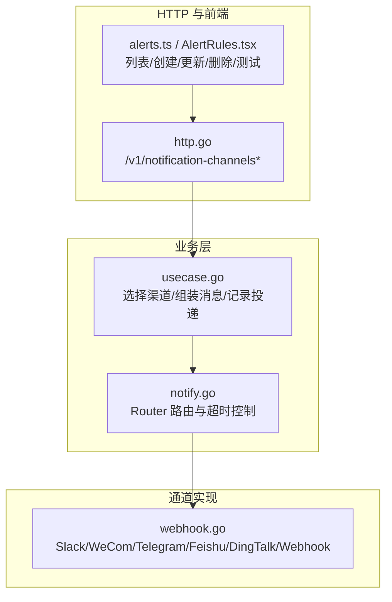
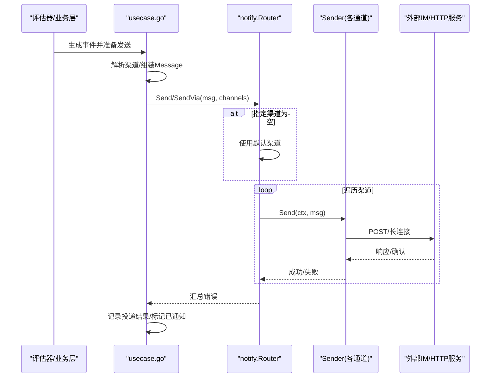
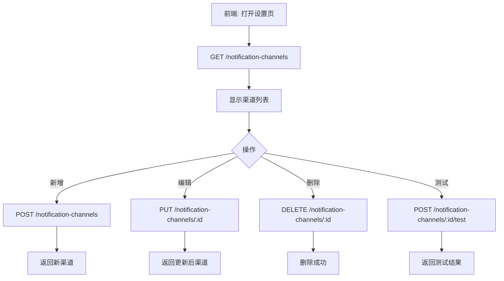
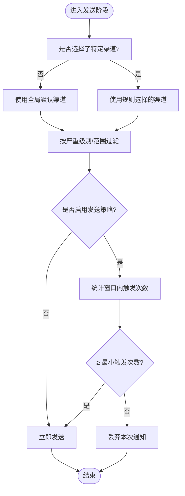
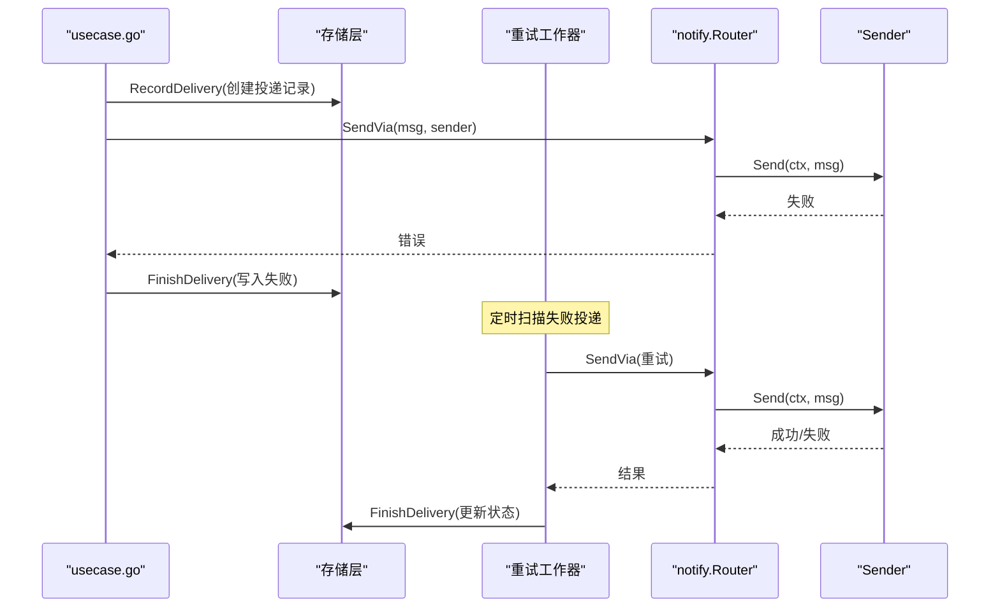

# 通知渠道集成

<cite>
**本文引用的文件**   
- [internal/pkg/notify/doc.go](file://internal/pkg/notify/doc.go)
- [internal/pkg/notify/notify.go](file://internal/pkg/notify/notify.go)
- [internal/pkg/notify/webhook.go](file://internal/pkg/notify/webhook.go)
- [api/manager/notification/v1/notification.proto](file://api/manager/notification/v1/notification.proto)
- [internal/manager/server/alert/http.go](file://internal/manager/server/alert/http.go)
- [web/src/api/alerts.ts](file://web/src/api/alerts.ts)
- [web/src/pages/AlertRules.tsx](file://web/src/pages/AlertRules.tsx)
- [cmd/ongrid/main.go](file://cmd/ongrid/main.go)
- [internal/manager/biz/alert/usecase.go](file://internal/manager/biz/alert/usecase.go)
- [internal/manager/biz/imbridge/dedup.go](file://internal/manager/biz/imbridge/dedup.go)
</cite>

## 目录
1. [简介](#简介)
2. [项目结构](#项目结构)
3. [核心组件](#核心组件)
4. [架构总览](#架构总览)
5. [详细组件分析](#详细组件分析)
6. [依赖关系分析](#依赖关系分析)
7. [性能与可靠性](#性能与可靠性)
8. [故障排查指南](#故障排查指南)
9. [结论](#结论)
10. [附录：自定义渠道扩展指南](#附录自定义渠道扩展指南)

## 简介
本指南面向运维与开发者，系统化说明通知渠道集成的配置方法、消息格式与模板定制、去重与防抖机制、多渠道路由与条件过滤、失败重试与错误处理、健康检查与状态监控，以及自定义通知渠道的扩展方式。覆盖的渠道包括 Slack、企业微信、Telegram、飞书、钉钉及通用 Webhook。

## 项目结构
通知能力由“业务层（告警/事件）— 发送器抽象 — 具体通道实现 — HTTP/前端交互”四层组成：
- 业务层负责选择目标渠道、组装标准化消息、记录投递结果并触发重试。
- 发送器抽象定义统一接口与路由器，屏蔽各平台差异。
- 具体通道实现提供 Slack、WeCom、Telegram、Feishu、DingTalk、Webhook 等适配。
- HTTP 与前端提供渠道管理、测试与规则联动界面。



图表来源
- [internal/manager/biz/alert/usecase.go:1282-1358](file://internal/manager/biz/alert/usecase.go#L1282-L1358)
- [internal/pkg/notify/notify.go:33-156](file://internal/pkg/notify/notify.go#L33-L156)
- [internal/pkg/notify/webhook.go:18-314](file://internal/pkg/notify/webhook.go#L18-L314)
- [internal/manager/server/alert/http.go:165-170](file://internal/manager/server/alert/http.go#L165-L170)
- [web/src/api/alerts.ts:485-503](file://web/src/api/alerts.ts#L485-L503)
- [web/src/pages/AlertRules.tsx:706-724](file://web/src/pages/AlertRules.tsx#L706-L724)

章节来源
- [internal/pkg/notify/doc.go:1-7](file://internal/pkg/notify/doc.go#L1-L7)
- [internal/pkg/notify/notify.go:1-171](file://internal/pkg/notify/notify.go#L1-L171)
- [internal/pkg/notify/webhook.go:1-314](file://internal/pkg/notify/webhook.go#L1-L314)
- [api/manager/notification/v1/notification.proto:1-91](file://api/manager/notification/v1/notification.proto#L1-L91)
- [internal/manager/server/alert/http.go:165-170](file://internal/manager/server/alert/http.go#L165-L170)
- [web/src/api/alerts.ts:485-503](file://web/src/api/alerts.ts#L485-L503)
- [web/src/pages/AlertRules.tsx:706-724](file://web/src/pages/AlertRules.tsx#L706-L724)

## 核心组件
- 标准化消息模型与严重级别
  - 消息包含主题、正文、严重级别、来源、去重键、标签、发生时间等字段，用于跨渠道统一渲染。
  - 严重级别支持 info/warning/critical，未设置时默认 info；发生时间未设置则使用当前 UTC 时间。
- 发送器接口与路由器
  - Sender 接口定义 Name() 与 Send(ctx, msg)，Router 负责按名称分发、超时控制、默认渠道回退与启用开关。
  - NewFromConfig 可从环境配置构建内置渠道集合；SendVia 支持运行时动态构造的 Sender。
- 通道适配器
  - 通用 Webhook：将标准化消息序列化为 JSON，可选 HMAC 签名头。
  - Slack：attachments 格式，带颜色条与结构化字段。
  - 企业微信：text 文本体，URL 中携带密钥。
  - Telegram：sendMessage，chat_id 在请求体中。
  - 飞书/钉钉：text 文本体，支持各自签名或 URL 参数签名。

章节来源
- [internal/pkg/notify/notify.go:13-31](file://internal/pkg/notify/notify.go#L13-L31)
- [internal/pkg/notify/notify.go:33-156](file://internal/pkg/notify/notify.go#L33-L156)
- [internal/pkg/notify/webhook.go:27-192](file://internal/pkg/notify/webhook.go#L27-L192)

## 架构总览
下图展示从告警事件到多通道投递的关键流程，包括渠道解析、消息格式化、发送与结果记录。



图表来源
- [internal/manager/biz/alert/usecase.go:1282-1358](file://internal/manager/biz/alert/usecase.go#L1282-L1358)
- [internal/pkg/notify/notify.go:92-156](file://internal/pkg/notify/notify.go#L92-L156)
- [internal/pkg/notify/webhook.go:220-258](file://internal/pkg/notify/webhook.go#L220-L258)

## 详细组件分析

### 渠道管理与 HTTP 接口
- REST 端点
  - GET/POST/PUT/DELETE /v1/notification-channels
  - POST /v1/notification-channels/{id}/test
- 前端调用
  - listChannels/createChannel/updateChannel/deleteChannel/testChannel
- 用途
  - 统一管理渠道实例，支持在线测试连通性。



图表来源
- [internal/manager/server/alert/http.go:165-170](file://internal/manager/server/alert/http.go#L165-L170)
- [web/src/api/alerts.ts:485-503](file://web/src/api/alerts.ts#L485-L503)

章节来源
- [internal/manager/server/alert/http.go:165-170](file://internal/manager/server/alert/http.go#L165-L170)
- [web/src/api/alerts.ts:485-503](file://web/src/api/alerts.ts#L485-L503)

### 多渠道路由与条件过滤
- 路由策略
  - 若未显式指定渠道，则回退至全局默认渠道。
  - 规则页面支持“默认”模式（命中所有已启用且严重级别达标的渠道）与“自定义”模式（仅通知选中的实例）。
- 严重级别与范围筛选
  - 规则侧根据渠道的严重级别门槛与范围进行匹配，未勾选时由全局级别/范围自动路由。
- 发送策略（防抖/聚合）
  - 支持“窗口+阈值”策略：在指定时间窗口内达到最小触发次数才放行通知，避免风暴。



图表来源
- [web/src/pages/AlertRules.tsx:1938-2083](file://web/src/pages/AlertRules.tsx#L1938-L2083)
- [web/src/pages/AlertRules.tsx:2234-2253](file://web/src/pages/AlertRules.tsx#L2234-L2253)
- [internal/pkg/notify/notify.go:92-130](file://internal/pkg/notify/notify.go#L92-L130)

章节来源
- [web/src/pages/AlertRules.tsx:706-724](file://web/src/pages/AlertRules.tsx#L706-L724)
- [web/src/pages/AlertRules.tsx:1938-2083](file://web/src/pages/AlertRules.tsx#L1938-L2083)
- [web/src/pages/AlertRules.tsx:2234-2253](file://web/src/pages/AlertRules.tsx#L2234-L2253)
- [internal/pkg/notify/notify.go:92-130](file://internal/pkg/notify/notify.go#L92-L130)

### 消息格式与模板定制
- 通用文本模板
  - 多数通道采用 text 文本体，首行以“[严重级别] 主题”，随后拼接正文、来源、去重键等。
- Slack 专用模板
  - attachments 格式，带颜色条与结构化字段（严重级别、来源、规则、事件、设备、去重键），便于快速识别。
- 可定制点
  - 通过为不同通道实现独立的 buildBody 函数，即可替换渲染逻辑，满足平台特性与排版需求。

章节来源
- [internal/pkg/notify/webhook.go:260-272](file://internal/pkg/notify/webhook.go#L260-L272)
- [internal/pkg/notify/webhook.go:41-132](file://internal/pkg/notify/webhook.go#L41-L132)

### 去重与防抖机制
- IM 桥接去重
  - 针对长轮询/流式通道（如 Telegram getUpdates），进程内维护有界去重集合，避免重连导致的重复处理。
- 告警侧防抖
  - 规则级“窗口+阈值”策略限制单位时间内通知频率，降低噪声。

```mermaid
classDiagram
class DedupSet {
+seenOrAdd(key) bool
-mu : Mutex
-cap : int
-cur : map[string]struct{}
-prev : map[string]struct{}
}
```

图表来源
- [internal/manager/biz/imbridge/dedup.go:1-53](file://internal/manager/biz/imbridge/dedup.go#L1-L53)

章节来源
- [internal/manager/biz/imbridge/dedup.go:1-53](file://internal/manager/biz/imbridge/dedup.go#L1-L53)
- [web/src/pages/AlertRules.tsx:2234-2253](file://web/src/pages/AlertRules.tsx#L2234-L2253)

### 失败重试与错误处理
- 发送失败记录
  - 对持久化渠道，发送前记录投递项，发送后写入成功/失败状态与错误信息。
- 重试工作器
  - 启动时拉起重试工作器，周期性扫描失败的投递记录并按线性退避重试。
- 错误聚合
  - 路由器对多个渠道的错误进行聚合返回，便于上层统一处理与日志记录。



图表来源
- [internal/manager/biz/alert/usecase.go:1319-1358](file://internal/manager/biz/alert/usecase.go#L1319-L1358)
- [cmd/ongrid/main.go:2657-2662](file://cmd/ongrid/main.go#L2657-L2662)
- [internal/pkg/notify/notify.go:132-156](file://internal/pkg/notify/notify.go#L132-L156)

章节来源
- [internal/manager/biz/alert/usecase.go:1319-1358](file://internal/manager/biz/alert/usecase.go#L1319-L1358)
- [cmd/ongrid/main.go:2657-2662](file://cmd/ongrid/main.go#L2657-L2662)
- [internal/pkg/notify/notify.go:132-156](file://internal/pkg/notify/notify.go#L132-L156)

### 健康检查与状态监控
- 渠道测试
  - 通过 /v1/notification-channels/{id}/test 发起一次真实发送，返回接受与否与提示信息。
- 运行期信息
  - 暴露评估器间隔与通知冷却时间等运行期指标，便于前端展示与排障。
- 通道可用性
  - 路由器 ChannelNames 可用于就绪检查与诊断，确认已注册渠道名。

章节来源
- [internal/manager/server/alert/http.go:165-170](file://internal/manager/server/alert/http.go#L165-L170)
- [web/src/api/alerts.ts:501-515](file://web/src/api/alerts.ts#L501-L515)
- [internal/pkg/notify/notify.go:158-171](file://internal/pkg/notify/notify.go#L158-L171)

## 依赖关系分析
- 模块耦合
  - usecase 依赖 Router 与 Sender 抽象，不直接感知具体通道细节。
  - webhook.go 集中实现各通道适配，遵循统一的 buildBody/signTarget 钩子。
- 外部依赖
  - HTTP 客户端、各平台 API（Slack Incoming Webhook、企业微信群机器人、Telegram Bot API、飞书/钉钉自定义机器人）。
- 潜在循环依赖
  - 无直接循环依赖；Router 作为中间层解耦业务与通道实现。


图表来源
- [internal/manager/biz/alert/usecase.go:1282-1358](file://internal/manager/biz/alert/usecase.go#L1282-L1358)
- [internal/pkg/notify/notify.go:33-156](file://internal/pkg/notify/notify.go#L33-L156)
- [internal/pkg/notify/webhook.go:18-314](file://internal/pkg/notify/webhook.go#L18-L314)
- [internal/manager/server/alert/http.go:165-170](file://internal/manager/server/alert/http.go#L165-L170)
- [web/src/api/alerts.ts:485-503](file://web/src/api/alerts.ts#L485-L503)
- [web/src/pages/AlertRules.tsx:706-724](file://web/src/pages/AlertRules.tsx#L706-L724)

章节来源
- [internal/manager/biz/alert/usecase.go:1282-1358](file://internal/manager/biz/alert/usecase.go#L1282-L1358)
- [internal/pkg/notify/notify.go:33-156](file://internal/pkg/notify/notify.go#L33-L156)
- [internal/pkg/notify/webhook.go:18-314](file://internal/pkg/notify/webhook.go#L18-L314)
- [internal/manager/server/alert/http.go:165-170](file://internal/manager/server/alert/http.go#L165-L170)
- [web/src/api/alerts.ts:485-503](file://web/src/api/alerts.ts#L485-L503)
- [web/src/pages/AlertRules.tsx:706-724](file://web/src/pages/AlertRules.tsx#L706-L724)

## 性能与可靠性
- 超时控制
  - 路由器为每次发送设置上下文超时，避免阻塞主流程。
- 并发与顺序
  - 路由器按渠道顺序串行发送，保证每个渠道独立错误隔离。
- 重试策略
  - 失败投递进入队列，线性退避重试，提升最终一致性。
- 去重与节流
  - IM 桥接去重避免重复处理；规则级窗口+阈值抑制风暴。

[本节为通用指导，无需源码引用]

## 故障排查指南
- 渠道不可用
  - 使用测试接口验证连通性与签名是否正确。
- 未收到通知
  - 检查规则是否处于“默认”模式且存在已启用渠道；查看严重级别门槛是否达标。
- 重复通知
  - 确认 IM 桥接去重是否生效；检查长连接重连后的 offset 恢复情况。
- 频繁告警
  - 调整“窗口+阈值”策略，适当增大窗口或提高阈值。
- 发送失败
  - 查看投递记录与错误日志；关注网络超时、签名校验失败、平台限流等。

章节来源
- [internal/manager/server/alert/http.go:165-170](file://internal/manager/server/alert/http.go#L165-L170)
- [web/src/pages/AlertRules.tsx:1938-2083](file://web/src/pages/AlertRules.tsx#L1938-L2083)
- [internal/manager/biz/imbridge/dedup.go:1-53](file://internal/manager/biz/imbridge/dedup.go#L1-L53)
- [internal/manager/biz/alert/usecase.go:1319-1358](file://internal/manager/biz/alert/usecase.go#L1319-L1358)

## 结论
本系统通过标准化的消息模型与发送器抽象，实现了多渠道的统一接入与灵活路由；结合去重、防抖与重试机制，提升了通知的可靠性与稳定性；同时提供完善的渠道管理与测试能力，便于日常运维与问题定位。

[本节为总结，无需源码引用]

## 附录：自定义渠道扩展指南
- 步骤概览
  1. 在通道实现层新增一个 Sender 构造函数，封装目标平台的请求构建与签名逻辑。
  2. 在路由器或渠道工厂中注册该类型，使其可通过名称或类型被解析与调用。
  3. 在前端与后端增加对应的配置项与校验提示，确保用户正确填写必要参数。
  4. 编写单元测试，覆盖正常路径与异常路径（签名失败、网络错误、状态码异常等）。
- 关键要点
  - 保持 Message 不变，仅在 buildBody 中做平台适配。
  - 如需签名，实现 signTarget 钩子，返回修改后的 endpoint 与额外请求头。
  - 遵循路由器超时与启用开关，确保行为一致。
  - 对于流式/长连接通道，注意去重与重连场景下的幂等性。

章节来源
- [internal/pkg/notify/webhook.go:194-216](file://internal/pkg/notify/webhook.go#L194-L216)
- [internal/pkg/notify/webhook.go:274-313](file://internal/pkg/notify/webhook.go#L274-L313)
- [internal/pkg/notify/notify.go:75-90](file://internal/pkg/notify/notify.go#L75-L90)
- [internal/manager/biz/alert/usecase.go:1422-1432](file://internal/manager/biz/alert/usecase.go#L1422-L1432)