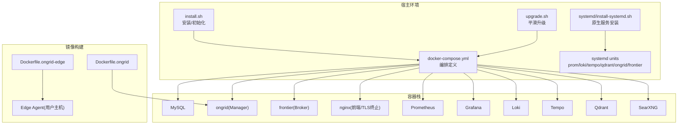
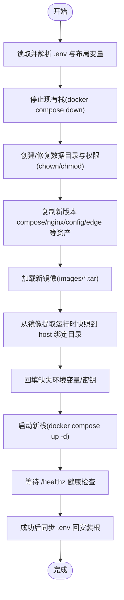
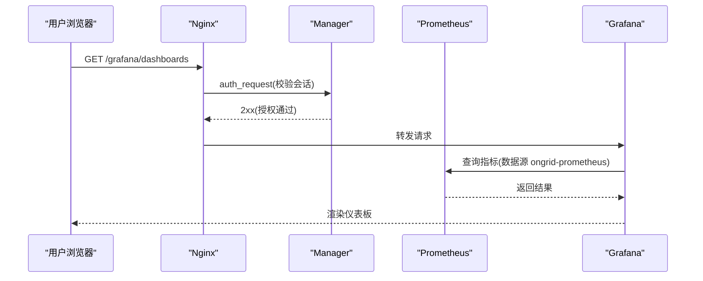
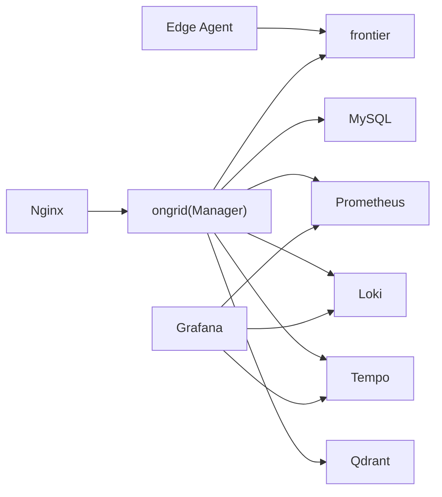

# 部署与运维

<cite>
**本文引用的文件**   
- [deploy/README.md](file://deploy/README.md)
- [deploy/docker-compose.yml](file://deploy/docker-compose.yml)
- [deploy/Dockerfile.ongrid](file://deploy/Dockerfile.ongrid)
- [deploy/Dockerfile.ongrid-edge](file://deploy/Dockerfile.ongrid-edge)
- [deploy/prometheus/prometheus.yml](file://deploy/prometheus/prometheus.yml)
- [deploy/grafana/provisioning/datasources/prometheus.yml](file://deploy/grafana/provisioning/datasources/prometheus.yml)
- [deploy/install/install.sh](file://deploy/install/install.sh)
- [deploy/install/upgrade.sh](file://deploy/install/upgrade.sh)
- [deploy/install/systemd/install-systemd.sh](file://deploy/install/systemd/install-systemd.sh)
- [internal/pkg/prom/manager_metrics.go](file://internal/pkg/prom/manager_metrics.go)
- [internal/manager/service/prometheus/service.go](file://internal/manager/service/prometheus/service.go)
</cite>

## 目录
1. [简介](#简介)
2. [项目结构](#项目结构)
3. [核心组件](#核心组件)
4. [架构总览](#架构总览)
5. [详细组件分析](#详细组件分析)
6. [依赖关系分析](#依赖关系分析)
7. [性能考虑](#性能考虑)
8. [故障排查指南](#故障排查指南)
9. [结论](#结论)
10. [附录](#附录)

## 简介
本指南面向生产环境的部署与运维，覆盖硬件与软件要求、网络与安全配置、容器化构建与编排、系统升级与回滚策略、监控告警（Prometheus/Grafana）、日志与链路追踪（Loki/Tempo）、备份恢复与数据迁移流程，以及日常维护与性能调优最佳实践。文档内容严格基于仓库中提供的安装脚本、Dockerfile、compose 编排与配置文件进行说明。

## 项目结构
仓库提供两类部署形态：
- 本地开发/演示：使用 docker-compose 一键拉起 MySQL、Manager、Frontier、Nginx、Prometheus、Grafana、Loki、Tempo、Qdrant、SearXNG 等组件。
- 生产风格安装：通过 install.sh / upgrade.sh 将镜像与配置落地到宿主机目录，以 bind mount 方式运行；同时提供 systemd 模式安装器。



图示来源
- [deploy/docker-compose.yml:1-397](file://deploy/docker-compose.yml#L1-L397)
- [deploy/Dockerfile.ongrid:1-231](file://deploy/Dockerfile.ongrid#L1-L231)
- [deploy/Dockerfile.ongrid-edge:1-71](file://deploy/Dockerfile.ongrid-edge#L1-L71)
- [deploy/install/install.sh:559-800](file://deploy/install/install.sh#L559-L800)
- [deploy/install/upgrade.sh:370-430](file://deploy/install/upgrade.sh#L370-L430)
- [deploy/install/systemd/install-systemd.sh:220-477](file://deploy/install/systemd/install-systemd.sh#L220-L477)

章节来源
- [deploy/README.md:1-20](file://deploy/README.md#L1-L20)
- [deploy/docker-compose.yml:1-397](file://deploy/docker-compose.yml#L1-L397)

## 核心组件
- Manager（云侧服务）：对外暴露 HTTP API 与 Prometheus /metrics；内置 Grafana 集成、PromQL 查询代理、通知通道、边缘设备管理、AIOps 能力等。
- Frontier（Broker）：边缘节点拨号接入的隧道网关。
- Web/Nginx：TLS 终止、SPA 静态资源托管、反向代理到 Manager，统一鉴权入口。
- 可观测性栈：Prometheus（指标采集与远程写入接收）、Loki（日志）、Tempo（分布式追踪）、Grafana（可视化）。
- 向量数据库：Qdrant（知识库嵌入检索）。
- 元搜索：SearXNG（web_search 技能默认后端）。
- Edge Agent（边缘端）：纯 Go 静态二进制，仅出站连接，不监听入站业务端口。

章节来源
- [deploy/README.md:1-20](file://deploy/README.md#L1-L20)
- [deploy/docker-compose.yml:13-397](file://deploy/docker-compose.yml#L13-L397)
- [deploy/Dockerfile.ongrid:88-231](file://deploy/Dockerfile.ongrid#L88-L231)
- [deploy/Dockerfile.ongrid-edge:1-71](file://deploy/Dockerfile.ongrid-edge#L1-L71)

## 架构总览
下图展示生产风格的单主机部署拓扑与关键数据面/控制面路径。

```mermaid
graph TB
Client["浏览器/客户端"] --> |HTTPS| Nginx["Nginx(TLS终止/鉴权)"]
Nginx --> |/api/*| Manager["ongrid(Manager)"]
Nginx --> |/grafana/*| Grafana["Grafana"]
Nginx --> |/prometheus/*| Prom["Prometheus"]
Nginx --> |/v1/traces/*| Tempo["Tempo"]
Nginx --> |/loki/api/v1/push| Loki["Loki"]
Manager --> |gRPC/HTTP| Frontier["frontier(Broker)"]
Manager --> |读写| DB["MySQL"]
Manager --> |索引/检索| Qdrant["Qdrant"]
Manager --> |拉取| Prom
Manager --> |推送(remote_write)| Prom
Manager --> |写日志| Loki
Manager --> |写追踪| Tempo
Edge["Edge Agent(用户主机)"] --> |出站拨号| Frontier
```

图示来源
- [deploy/docker-compose.yml:180-360](file://deploy/docker-compose.yml#L180-L360)
- [deploy/prometheus/prometheus.yml:1-28](file://deploy/prometheus/prometheus.yml#L1-L28)

## 详细组件分析

### 容器镜像构建与运行时
- Manager 镜像（Dockerfile.ongrid）
  - 多阶段构建：builder 使用 golang:1.25-bookworm，启用 CGO 编译 cgo 依赖（ONNX Runtime），最终镜像基于 debian:bookworm-slim，非 root 运行。
  - 内置 ONNX Runtime 共享库并设置环境变量供 fastembed-go 加载。
  - 暴露 8080(HTTP API)、9100(/metrics)。
- Edge Agent 镜像（Dockerfile.ongrid-edge）
  - 纯 Go 静态二进制（CGO_ENABLED=0），最终镜像为 distroless/static-debian12:nonroot。
  - 仅暴露 9101 用于本地调试 /metrics；正常生产不监听入站业务端口。

章节来源
- [deploy/Dockerfile.ongrid:1-231](file://deploy/Dockerfile.ongrid#L1-L231)
- [deploy/Dockerfile.ongrid-edge:1-71](file://deploy/Dockerfile.ongrid-edge#L1-L71)

### Docker Compose 编排（本地/演示）
- 服务清单：mysql、ongrid、nginx、frontier、prometheus、grafana、loki、tempo、qdrant、searxng。
- 健康检查与启动顺序：MySQL 健康检查通过后 ongrid 才尝试连接；Prometheus 作为 core service 被 manager remote_write 和 query_promql 使用。
- 网络与端口：
  - 9100 暴露给宿主机 Prometheus 抓取。
  - 40012 映射 host 端口供 edge 拨号。
  - 3000 暴露 Grafana（本地开发），生产通过 nginx 子路径访问。
- 数据持久化：各组件状态目录通过 volume 或 bind mount 落盘。

章节来源
- [deploy/docker-compose.yml:1-397](file://deploy/docker-compose.yml#L1-L397)
- [deploy/README.md:22-57](file://deploy/README.md#L22-L57)

### 生产安装与升级（install.sh / upgrade.sh）
- 安装布局
  - 统一根目录（默认 /opt/ongrid），四个子目录职责清晰：
    - ongrid/：compose 根（docker-compose.yml、.env、VERSION、各组件配置）
    - ongrid-web/：nginx 输入（nginx.conf + TLS 证书 + /edge 静态资源）
    - data/：所有有状态服务的数据目录（mysql、prometheus、loki、tempo、qdrant、grafana）及 manager 运行时（embeddings、skills、pages、workspace、tools）
    - logs/：进程 stdout 与容器 json-log 目标
- 预检与环境
  - 自动检测/安装 Docker（优先官方脚本，失败回退到发行版包管理器）。
  - 自动探测 Docker Hub 不可达时配置国内镜像源。
  - 自动收集主机代理与内部域名，注入到 .env（ONGRID_HTTP(S)_PROXY、ONGRID_NO_PROXY）。
  - 自动生成自签名证书（若未提供真实证书）。
- 权限与 UID
  - 按上游镜像运行用户 chown 对应目录（如 mysql:999, prometheus:65534, loki/tempo:10001, grafana:472, manager:65532）。
- 升级流程
  - 停止旧栈 → 准备新镜像与绑定挂载源 → 更新配置与版本 → 拉起新栈 → 健康检查 → 同步 .env 回安装根。
  - 支持 legacy named volumes 迁移（--migrate-volumes 或 --no-migrate-volumes）。
  - 自动回填缺失的环境变量（如 Grafana 管理员密码）。



图示来源
- [deploy/install/upgrade.sh:370-430](file://deploy/install/upgrade.sh#L370-L430)
- [deploy/install/upgrade.sh:637-732](file://deploy/install/upgrade.sh#L637-L732)
- [deploy/install/upgrade.sh:760-800](file://deploy/install/upgrade.sh#L760-L800)
- [deploy/install/install.sh:559-800](file://deploy/install/install.sh#L559-L800)

章节来源
- [deploy/install/install.sh:559-800](file://deploy/install/install.sh#L559-L800)
- [deploy/install/upgrade.sh:370-430](file://deploy/install/upgrade.sh#L370-L430)
- [deploy/install/upgrade.sh:637-732](file://deploy/install/upgrade.sh#L637-L732)
- [deploy/install/upgrade.sh:760-800](file://deploy/install/upgrade.sh#L760-L800)

### Systemd 模式安装（无 Docker）
- 安装器将 manager 与 frontier 二进制安装到 PREFIX_BIN，生成 systemd unit（ongrid.service、ongrid-frontier.service、prometheus.service、loki.service、tempo.service、qdrant.service）。
- 自动创建专用系统用户与组，隔离各组件权限。
- 首次安装生成 ongrid.env（包含数据库、broker、可观测性、LLM、嵌入模型等配置），后续运行保留 operator 修改。
- 可选 Phase 2 辅助脚本安装 OS 包与下载上游二进制（需联网）。

章节来源
- [deploy/install/systemd/install-systemd.sh:220-477](file://deploy/install/systemd/install-systemd.sh#L220-L477)

### 监控与告警（Prometheus + Grafana）
- 指标采集
  - 本地 compose 默认 scrape ongrid:9100/metrics，并启用 remote_write receiver 接收 open-set exporter 样本。
  - 自定义规则文件 prometheus-rules.yml 随安装/升级同步。
- Grafana 数据源与仪表板
  - 预置数据源 ongrid-prometheus（指向 http://prometheus:9090/prometheus）。
  - 预置“服务器详情”仪表板模板。
- 安全访问
  - 生产通过 nginx 子路径访问 /prometheus/ 与 /grafana/，复用 ongrid 会话鉴权。



图示来源
- [deploy/prometheus/prometheus.yml:1-28](file://deploy/prometheus/prometheus.yml#L1-L28)
- [deploy/grafana/provisioning/datasources/prometheus.yml:1-11](file://deploy/grafana/provisioning/datasources/prometheus.yml#L1-L11)
- [deploy/docker-compose.yml:220-360](file://deploy/docker-compose.yml#L220-L360)

章节来源
- [deploy/prometheus/prometheus.yml:1-28](file://deploy/prometheus/prometheus.yml#L1-L28)
- [deploy/grafana/provisioning/datasources/prometheus.yml:1-11](file://deploy/grafana/provisioning/datasources/prometheus.yml#L1-L11)
- [deploy/README.md:28-57](file://deploy/README.md#L28-L57)

### 日志与链路追踪（Loki + Tempo）
- Loki：单二进制日志后端，仅内网端口 3100；外部访问经 nginx /loki/api/v1/push 并由 manager edgeauth 鉴权。
- Tempo：单二进制追踪后端，OTLP gRPC :4317 与 HTTP :4318 不对外暴露；外部访问经 nginx /v1/traces 并由 manager edgeauth 鉴权。
- 配置随安装/升级同步至宿主目录，便于审计与变更。

章节来源
- [deploy/docker-compose.yml:254-286](file://deploy/docker-compose.yml#L254-L286)

### 网络与安全
- 零入站端口设计：Edge Agent 主动拨号到 cloud tunnel，宿主机无需开放 22/80/443 等业务端口。
- TLS 终止：Nginx 负责 HTTPS，支持自签证书或替换为真实证书。
- 代理与内网域名：安装/升级脚本自动探测主机代理并合并内部域名到 NO_PROXY，避免误走企业代理访问内网服务。

章节来源
- [deploy/install/install.sh:125-297](file://deploy/install/install.sh#L125-L297)
- [deploy/install/upgrade.sh:120-246](file://deploy/install/upgrade.sh#L120-L246)

### 备份恢复与数据迁移
- 数据落盘位置
  - MySQL、Prometheus、Loki、Tempo、Qdrant、Grafana 数据均位于 $ONGRID_DATA_DIR 下对应子目录。
  - Manager 运行时（embeddings、skills、pages、workspace、tools）同样落盘。
- 备份建议
  - 对 $ONGRID_DATA_DIR 做定期归档（例如 tar.gz），并结合对象存储异地容灾。
- 迁移与回滚
  - 升级前停止栈，确保数据目录一致性与权限正确。
  - 支持 legacy named volumes 迁移（--migrate-volumes 或 --no-migrate-volumes）。
  - 升级失败时，$INSTALL_DIR/.env 保持原样，便于重试或回滚。

章节来源
- [deploy/install/install.sh:682-772](file://deploy/install/install.sh#L682-L772)
- [deploy/install/upgrade.sh:440-534](file://deploy/install/upgrade.sh#L440-L534)
- [deploy/install/upgrade.sh:782-800](file://deploy/install/upgrade.sh#L782-L800)

### 系统升级与回滚策略
- 推荐流程
  - 准备新版本安装包，复制当前 .env 到新包目录，执行 upgrade.sh。
  - 观察健康检查与日志，确认服务就绪后再切流量。
- 回滚策略
  - 若升级后异常，停止新栈，恢复旧镜像与配置（保留 .env 与数据目录），重新拉起旧版本。
  - 对于 systemd 模式，可通过 systemctl 切换单元与二进制版本。

章节来源
- [deploy/install/upgrade.sh:370-430](file://deploy/install/upgrade.sh#L370-L430)
- [deploy/install/upgrade.sh:760-800](file://deploy/install/upgrade.sh#L760-L800)

### 监控指标与告警实现要点
- Manager 指标
  - 注册了评估延迟、remote_write 成功/失败计数、设备最后可见时间、告警事件总数等。
- 查询代理
  - 通过 JWT ticket 机制在 Nginx 鉴权后放行对 Prometheus 的受控访问。

章节来源
- [internal/pkg/prom/manager_metrics.go:166-201](file://internal/pkg/prom/manager_metrics.go#L166-L201)
- [internal/manager/service/prometheus/service.go:14-55](file://internal/manager/service/prometheus/service.go#L14-L55)

## 依赖关系分析
- 组件耦合
  - Manager 强依赖 MySQL、Frontier、Prometheus、Loki、Tempo、Qdrant。
  - Nginx 作为统一入口，承担鉴权与反向代理。
- 直接/间接依赖
  - Edge Agent 仅依赖 Frontier（出站拨号）。
  - Grafana 依赖 Prometheus/Loki/Tempo 数据源。
- 外部依赖
  - 可选 LLM 提供商（OpenAI/GLM/DeepSeek/Gemini/Kimi 等）。
  - 可选消息通道（Slack/Telegram/飞书/钉钉/企微/Webhook）。



图示来源
- [deploy/docker-compose.yml:13-397](file://deploy/docker-compose.yml#L13-L397)

章节来源
- [deploy/docker-compose.yml:13-397](file://deploy/docker-compose.yml#L13-L397)

## 性能考虑
- 镜像与依赖
  - Manager 镜像包含 ONNX Runtime 与 Python 工具链，注意磁盘空间与 I/O 性能。
  - 使用缓存层（Go module/build cache）加速构建。
- 存储与 I/O
  - 将 $ONGRID_DATA_DIR 置于高性能磁盘（NVMe/SSD），避免 NFS 抖动影响 TSDB 与向量库。
- 网络与代理
  - 合理配置 NO_PROXY，避免内网服务误走代理导致延迟。
- 资源配额
  - 为 Prometheus/Loki/Tempo/Qdrant 分配足够内存与 CPU，避免 GC 抖动与查询超时。

[本节为通用指导，不涉及具体文件分析]

## 故障排查指南
- 常见症状与定位
  - 无法登录：检查首次登录管理员账号是否已播种（两个环境变量均需设置且不存在同名用户）。
  - 指标为空：确认 Prometheus 抓取任务与 remote_write 接收器状态。
  - 仪表板无数据：核对数据源 URL、UID 漂移、时间范围与标签变更。
  - 日志/追踪不可用：检查 nginx 鉴权与后端可达性。
- 快速自检命令
  - 验证 Prometheus 就绪与查询接口。
  - 查看 ongrid 健康检查端点。
- 日志查看
  - 容器日志：docker compose logs <service>。
  - 宿主机日志：journalctl -u ongrid（systemd 模式）。

章节来源
- [deploy/README.md:65-98](file://deploy/README.md#L65-L98)
- [deploy/README.md:28-57](file://deploy/README.md#L28-L57)

## 结论
本指南基于仓库提供的安装与编排资产，给出了从零到一的生产部署路径与运维实践。通过统一的安装布局、幂等的升级脚本、完善的可观测性栈与严格的权限隔离，可在保障业务连续性的前提下高效迭代与排障。建议在正式环境引入自动化备份与演练，持续优化容量与性能。

## 附录
- 环境变量与配置要点
  - 首次登录：设置管理员邮箱与密码。
  - 数据库：MySQL DSN 或 SQLite（仅本地实验）。
  - 可观测性：Prometheus/Loki/Tempo/Qdrant 地址与开关。
  - 代理：HTTP_PROXY/HTTPS_PROXY/NO_PROXY 与内部域名合并。
- 参考文件
  - 安装与升级脚本、compose 编排、Dockerfile、Prometheus 抓取与 Grafana 数据源配置。

章节来源
- [deploy/README.md:65-98](file://deploy/README.md#L65-L98)
- [deploy/docker-compose.yml:55-149](file://deploy/docker-compose.yml#L55-L149)
- [deploy/prometheus/prometheus.yml:1-28](file://deploy/prometheus/prometheus.yml#L1-L28)
- [deploy/grafana/provisioning/datasources/prometheus.yml:1-11](file://deploy/grafana/provisioning/datasources/prometheus.yml#L1-L11)