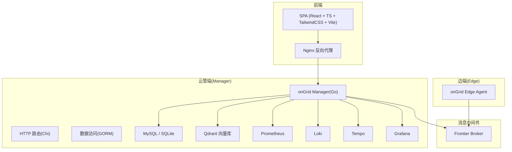
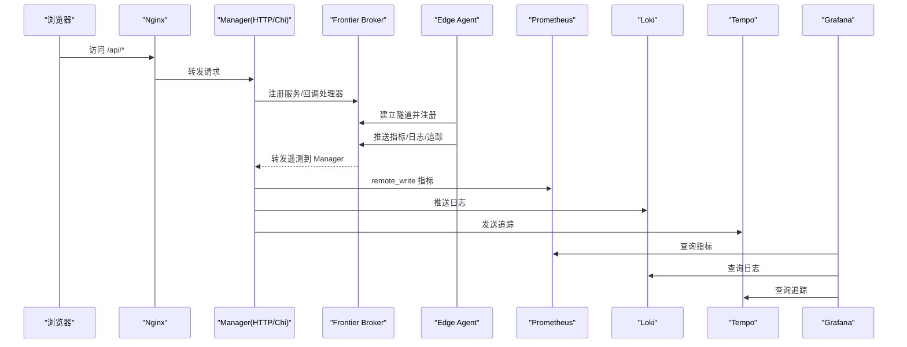
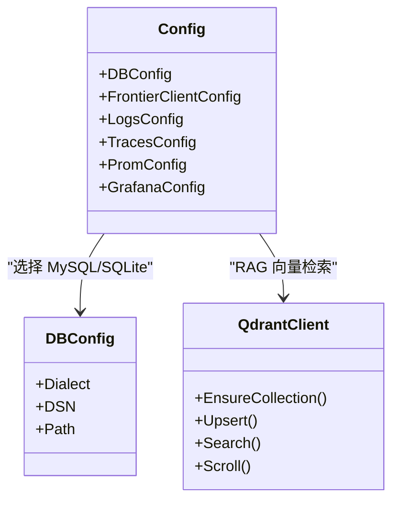
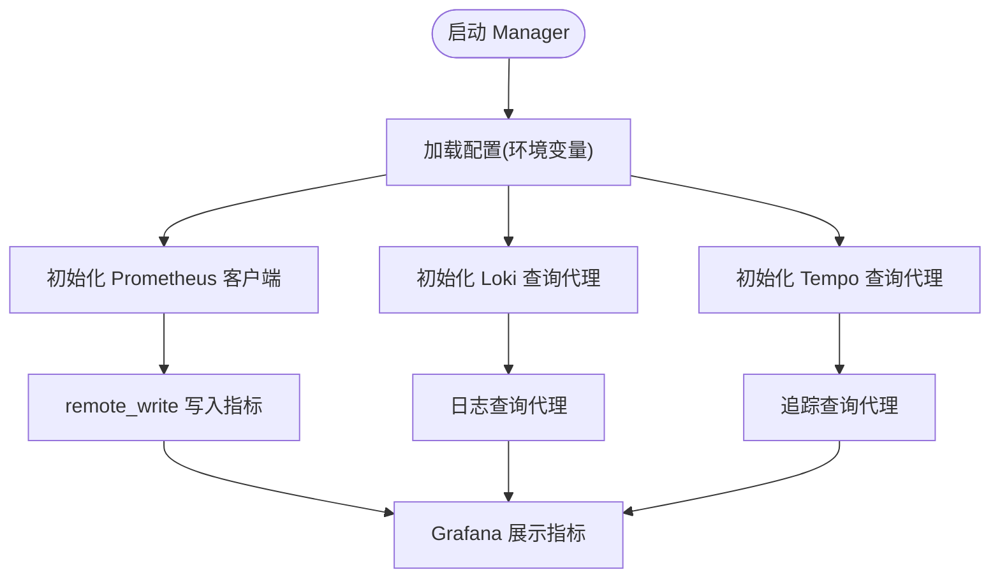
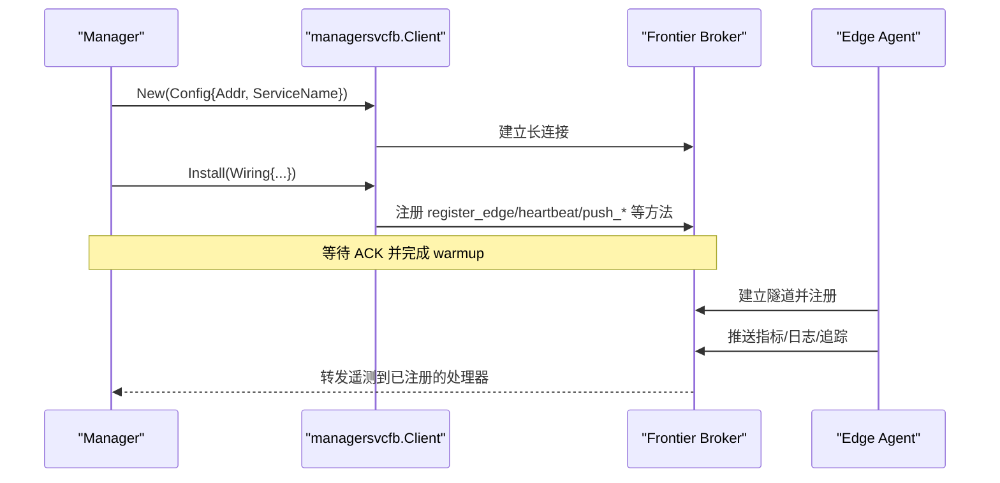
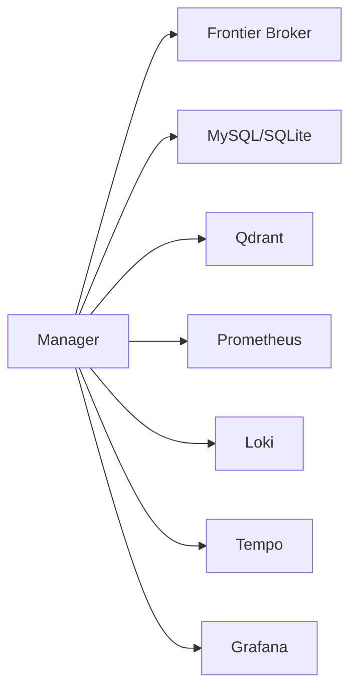

# 技术栈概览

<cite>
**本文引用的文件列表**
- [go.mod](file://go.mod)
- [web/package.json](file://web/package.json)
- [internal/pkg/config/config.go](file://internal/pkg/config/config.go)
- [cmd/ongrid/main.go](file://cmd/ongrid/main.go)
- [deploy/docker-compose.yml](file://deploy/docker-compose.yml)
- [internal/pkg/qdrantx/client.go](file://internal/pkg/qdrantx/client.go)
- [internal/manager/data/metric/store/migrate.go](file://internal/manager/data/metric/store/migrate.go)
- [internal/manager/biz/knowledge/builtin_vault/diagnostics/loki-ingestion-backpressure.md](file://internal/manager/biz/knowledge/builtin_vault/diagnostics/loki-ingestion-backpressure.md)
</cite>

## 目录
1. [简介](#简介)
2. [项目结构](#项目结构)
3. [核心组件](#核心组件)
4. [架构总览](#架构总览)
5. [详细组件分析](#详细组件分析)
6. [依赖关系分析](#依赖关系分析)
7. [性能与可观测性](#性能与可观测性)
8. [故障排查指南](#故障排查指南)
9. [结论](#结论)
10. [附录：版本兼容性与升级建议](#附录版本兼容性与升级建议)

## 简介
本文件为 OnGrid 项目的技术栈概览，覆盖后端（Go、Chi Router、GORM、gRPC）、前端（React、TypeScript、TailwindCSS、Vite）、数据库（MySQL、SQLite、Qdrant 向量库）以及可观测性组件（Prometheus、Loki、Tempo、Grafana）。同时介绍消息中间件 Frontier 的设计与集成方式，给出架构图、通信协议说明、版本兼容性矩阵与升级路径建议。

## 项目结构
仓库采用多语言、多服务编排的形态：
- Go 后端主程序位于 cmd/ongrid，边缘代理位于 cmd/ongrid-edge
- 业务域按 internal/manager、internal/iam、internal/edgeagent 等划分
- 前端 SPA 位于 web/，使用 Vite 构建并通过 Nginx 反向代理
- 部署与可观测性通过 deploy/docker-compose.yml 统一编排

图表来源
- [deploy/docker-compose.yml:13-397](file://deploy/docker-compose.yml#L13-L397)
- [cmd/ongrid/main.go:243-280](file://cmd/ongrid/main.go#L243-L280)
- [internal/pkg/config/config.go:369-486](file://internal/pkg/config/config.go#L369-L486)

章节来源
- [deploy/docker-compose.yml:13-397](file://deploy/docker-compose.yml#L13-L397)
- [cmd/ongrid/main.go:243-280](file://cmd/ongrid/main.go#L243-L280)

## 核心组件
- 后端运行时与依赖
  - Go 1.25+（模块声明），生态成熟、并发模型高效
  - Chi v5 作为 HTTP 路由层，轻量且高性能
  - GORM 作为 ORM，支持 MySQL/SQLite 等多方言，配合 AutoMigrate 管理迁移
  - gRPC/protobuf 用于 API 定义与生成（api/ 下 .proto 文件）
- 前端工程化
  - React 18 + TypeScript + TailwindCSS + Vite，开发体验与打包性能优秀
- 数据存储
  - MySQL 8.0（默认生产型存储）
  - SQLite（本地调试可选）
  - Qdrant 向量数据库（知识检索/RAG）
- 可观测性
  - Prometheus（指标采集与远程写入）
  - Loki（日志聚合）
  - Tempo（分布式追踪）
  - Grafana（可视化与仪表盘）
- 消息中间件
  - singchia/frontier 作为边-云双向长连接的消息总线，承载设备注册、心跳、遥测上报、插件配置下发、WebShell 等能力

章节来源
- [go.mod:1-36](file://go.mod#L1-L36)
- [web/package.json:15-51](file://web/package.json#L15-L51)
- [internal/pkg/config/config.go:259-272](file://internal/pkg/config/config.go#L259-L272)
- [deploy/docker-compose.yml:14-397](file://deploy/docker-compose.yml#L14-L397)

## 架构总览
OnGrid 采用“云-边”协同架构：
- 云侧 Manager 提供 HTTP API、业务编排、AI 工具链、告警与报表等能力
- 边端 Edge Agent 负责主机/进程指标采集、插件运行、命令执行与 WebShell
- Frontier 作为独立 Broker 容器，承担边-云双向通道与 RPC 分发
- 可观测性体系由 Prometheus/Loki/Tempo/Grafana 组成，Manager 通过 HTTP 或 OTLP 接入

图表来源
- [deploy/docker-compose.yml:206-397](file://deploy/docker-compose.yml#L206-L397)
- [cmd/ongrid/main.go:865-1223](file://cmd/ongrid/main.go#L865-L1223)

## 详细组件分析

### 后端技术栈（Go、Chi、GORM、gRPC）
- Go 1.25+：高并发、低内存占用，适合云管与边端场景
- Chi Router：极简、高性能的路由器，易于组合中间件
- GORM：统一的 ORM 抽象，结合 dbx 封装实现多方言切换与迁移
- gRPC/Protobuf：API 契约与代码生成，便于跨语言调用与服务治理

章节来源
- [go.mod:1-36](file://go.mod#L1-L36)
- [internal/pkg/config/config.go:259-272](file://internal/pkg/config/config.go#L259-L272)
- [internal/manager/data/metric/store/migrate.go:1-20](file://internal/manager/data/metric/store/migrate.go#L1-L20)

### 前端技术栈（React 18、TypeScript、TailwindCSS、Vite）
- React 18：现代 UI 框架，生态完善
- TypeScript：类型安全提升大型项目可维护性
- TailwindCSS：原子化样式，快速构建一致界面
- Vite：极速开发与构建体验

章节来源
- [web/package.json:15-51](file://web/package.json#L15-L51)

### 数据库与向量库（MySQL、SQLite、Qdrant）
- MySQL 8.0：默认生产型关系数据库，事务与索引能力强
- SQLite：本地调试便捷，单文件数据库
- Qdrant：向量相似度检索，支撑知识库与 RAG 场景

图表来源
- [internal/pkg/config/config.go:259-272](file://internal/pkg/config/config.go#L259-L272)
- [internal/pkg/qdrantx/client.go:1-432](file://internal/pkg/qdrantx/client.go#L1-L432)

章节来源
- [internal/pkg/config/config.go:259-272](file://internal/pkg/config/config.go#L259-L272)
- [internal/pkg/qdrantx/client.go:1-432](file://internal/pkg/qdrantx/client.go#L1-L432)

### 可观测性组件（Prometheus、Loki、Tempo、Grafana）
- Prometheus：指标采集与远程写入，Manager 将开放集样本写入
- Loki：日志聚合，Manager 提供查询代理；外部通过 Nginx 鉴权后推送
- Tempo：分布式追踪，OTLP 接收，Manager 提供查询代理
- Grafana：统一可视化，预置数据源与仪表盘

图表来源
- [internal/pkg/config/config.go:369-486](file://internal/pkg/config/config.go#L369-L486)
- [deploy/docker-compose.yml:220-359](file://deploy/docker-compose.yml#L220-L359)

章节来源
- [internal/pkg/config/config.go:369-486](file://internal/pkg/config/config.go#L369-L486)
- [deploy/docker-compose.yml:220-359](file://deploy/docker-compose.yml#L220-L359)

### 消息中间件 Frontier 设计与实现
- 角色定位：独立 Broker 容器，面向边-云双向长连接，承载设备注册、心跳、遥测上报、插件配置下发、WebShell 等
- Manager 侧集成：通过 managersvcfb SDK 建立长连接，Install 注册方法处理器，并在启动时进行 warmup 防护避免 race
- Edge 侧接入：Edge Agent 通过隧道端口连接 Frontier，完成注册与后续双向通信

图表来源
- [cmd/ongrid/main.go:865-1223](file://cmd/ongrid/main.go#L865-L1223)
- [deploy/docker-compose.yml:206-219](file://deploy/docker-compose.yml#L206-L219)

章节来源
- [cmd/ongrid/main.go:865-1223](file://cmd/ongrid/main.go#L865-L1223)
- [deploy/docker-compose.yml:206-219](file://deploy/docker-compose.yml#L206-L219)

## 依赖关系分析
- Manager 对 Frontier 的依赖是强耦合的（注册/回调/遥测），但可通过环境变量禁用以支持无 Broker 的测试环境
- 可观测性组件均为可选开关（如 Prometheus 启用开关），未启用时不影响核心功能
- 数据库后端通过 Dialect 切换，MySQL 为默认，SQLite 仅用于本地调试

图表来源
- [internal/pkg/config/config.go:232-257](file://internal/pkg/config/config.go#L232-L257)
- [deploy/docker-compose.yml:13-397](file://deploy/docker-compose.yml#L13-L397)

章节来源
- [internal/pkg/config/config.go:232-257](file://internal/pkg/config/config.go#L232-L257)
- [deploy/docker-compose.yml:13-397](file://deploy/docker-compose.yml#L13-L397)

## 性能与可观测性
- 指标
  - Manager 暴露 metrics 端口供 Prometheus 抓取
  - 支持 remote_write 写入开放集样本，便于 AI 工具查询
- 日志
  - 通过 Loki 聚合，注意标签基数控制与时间顺序
- 追踪
  - 通过 OTLP 向 Tempo 发送追踪，便于端到端链路分析
- 可视化
  - Grafana 预置数据源与仪表盘，支持嵌入与 solo 模式面板

章节来源
- [deploy/docker-compose.yml:220-359](file://deploy/docker-compose.yml#L220-L359)
- [internal/manager/biz/knowledge/builtin_vault/diagnostics/loki-ingestion-backpressure.md:45-76](file://internal/manager/biz/knowledge/builtin_vault/diagnostics/loki-ingestion-backpressure.md#L45-L76)

## 故障排查指南
- Frontier 启动竞态
  - 现象：首个 edge register 成功，但后续 push/heartbeat 报 record not found
  - 处理：利用 Warmup 参数在 Install 完成后等待 broker 表可见性稳定
- Loki 背压与流爆炸
  - 现象：429、max_streams_per_user 超限、entry out of order
  - 处理：降低标签基数、保证时间单调、扩容 ingester
- 数据库迁移失败
  - 现象：AutoMigrate 报错导致启动失败
  - 处理：检查 DSN/Dialect 与权限，确认迁移脚本一致性

章节来源
- [cmd/ongrid/main.go:1213-1223](file://cmd/ongrid/main.go#L1213-L1223)
- [internal/manager/biz/knowledge/builtin_vault/diagnostics/loki-ingestion-backpressure.md:45-76](file://internal/manager/biz/knowledge/builtin_vault/diagnostics/loki-ingestion-backpressure.md#L45-L76)
- [internal/manager/data/metric/store/migrate.go:1-20](file://internal/manager/data/metric/store/migrate.go#L1-L20)

## 结论
OnGrid 的技术栈围绕高性能 Go 后端、现代化前端、灵活的数据存储与完善的可观测性体系构建，并以 Frontier 作为边-云消息中枢，形成可扩展、可运维的云管平台。各组件均具备成熟的生态与社区支持，兼顾性能与易用性。

## 附录：版本兼容性与升级建议
- 后端
  - Go：1.25+（模块声明）
  - Chi：v5.x
  - GORM：v1.31.x
  - gRPC/protobuf：v1.80.0/v1.36.11
- 前端
  - React：18.3.x
  - TypeScript：5.6.x
  - TailwindCSS：3.4.x
  - Vite：5.4.x
- 数据库与向量库
  - MySQL：8.0
  - SQLite：modernc.org/sqlite 1.42.x
  - Qdrant：1.11.x
- 可观测性
  - Prometheus：2.54.x
  - Loki：3.4.x
  - Tempo：2.5.x
  - Grafana：11.1.x
- 消息中间件
  - Frontier：1.2.x（镜像 singchia/frontier:1.2.5）

升级建议
- 小版本优先：保持同大版本内的小版本升级，关注 go.mod 与 docker-compose 中镜像版本
- 数据库：先验证 SQLite 模式下的迁移与读写行为，再切回 MySQL
- 可观测性：升级前校验 remote_write/OTLP 端点与鉴权策略，确保 Grafana 数据源可用
- Frontier：升级后检查 manager 的 Install 与 Warmup 参数，避免首次注册后的短暂不可用窗口

章节来源
- [go.mod:1-175](file://go.mod#L1-L175)
- [web/package.json:1-53](file://web/package.json#L1-L53)
- [deploy/docker-compose.yml:14-397](file://deploy/docker-compose.yml#L14-L397)