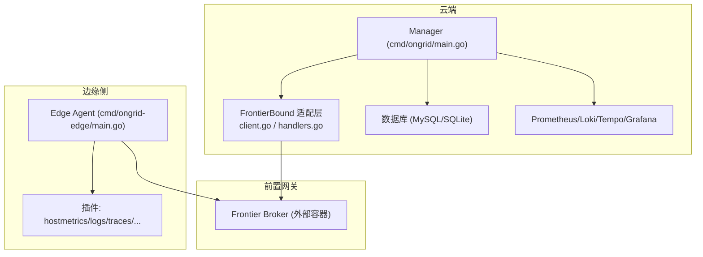
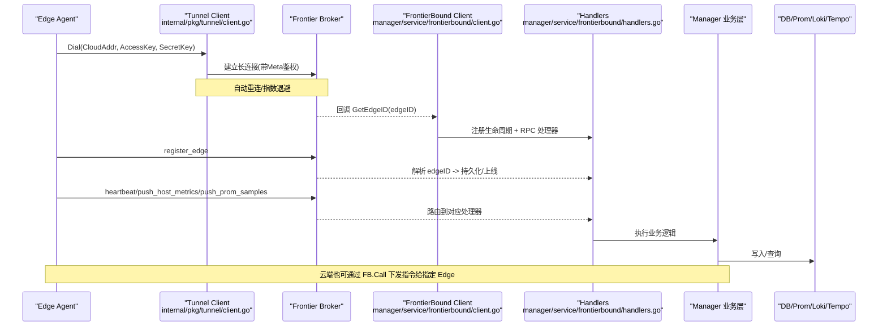
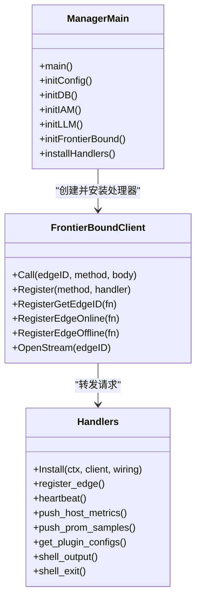
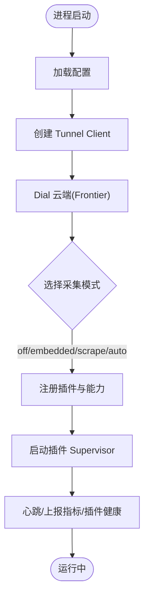
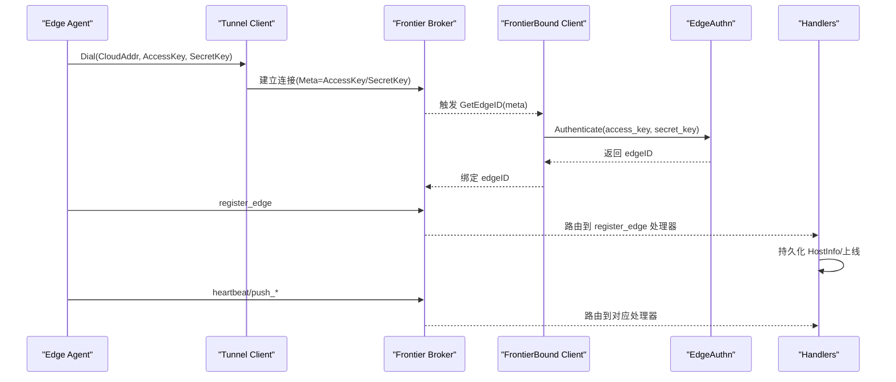
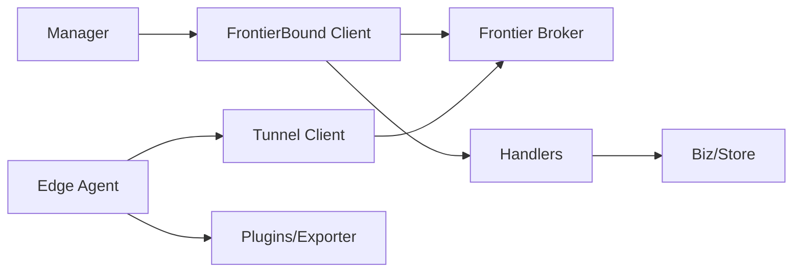
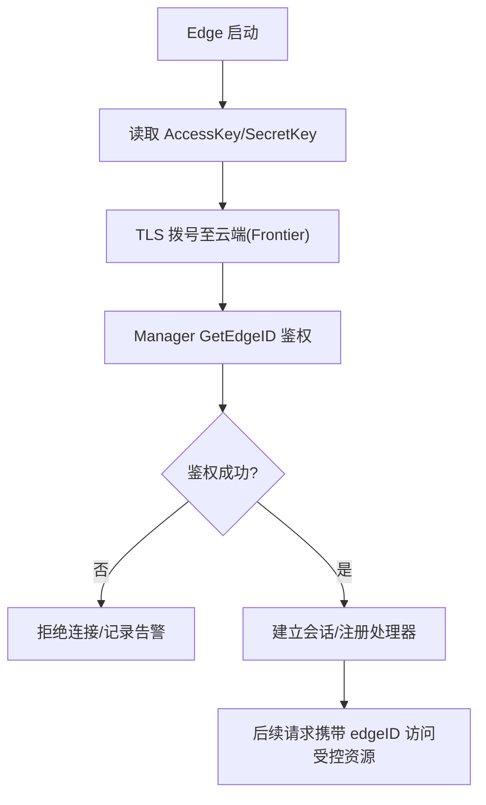
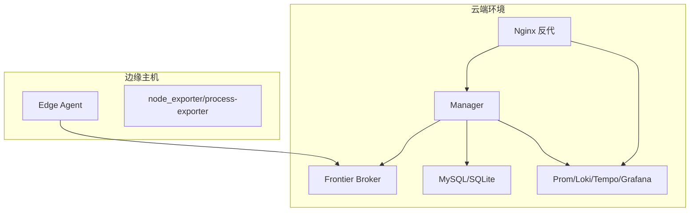

# 架构概览

<cite>
**本文引用的文件列表**
- [cmd/ongrid/main.go](file://cmd/ongrid/main.go)
- [cmd/ongrid-edge/main.go](file://cmd/ongrid-edge/main.go)
- [internal/pkg/tunnel/client.go](file://internal/pkg/tunnel/client.go)
- [internal/manager/service/frontierbound/client.go](file://internal/manager/service/frontierbound/client.go)
- [internal/manager/service/frontierbound/handlers.go](file://internal/manager/service/frontierbound/handlers.go)
- [internal/manager/biz/alert/usecase.go](file://internal/manager/biz/alert/usecase.go)
- [internal/manager/data/metric/store/reader.go](file://internal/manager/data/metric/store/reader.go)
- [deploy/docker-compose.yml](file://deploy/docker-compose.yml)
- [deploy/install.sh](file://deploy/install/install.sh)
- [deploy/systemd/ongrid.service](file://deploy/install/systemd/ongrid.service)
- [deploy/install/edge/ongrid-edge.service](file://deploy/install/edge/ongrid-edge.service)
- [deploy/nginx/nginx.conf](file://deploy/nginx/nginx.conf)
- [README.md](file://README.md)
</cite>

## 目录
1. [简介](#简介)
2. [项目结构](#项目结构)
3. [核心组件](#核心组件)
4. [架构总览](#架构总览)
5. [详细组件分析](#详细组件分析)
6. [依赖关系分析](#依赖关系分析)
7. [性能与扩展性](#性能与扩展性)
8. [安全架构与零入站端口模型](#安全架构与零入站端口模型)
9. [部署拓扑与网络规划](#部署拓扑与网络规划)
10. [故障排查指南](#故障排查指南)
11. [结论](#结论)

## 简介
OnGrid 采用“云端管理器（Manager）+ 边缘代理（Edge Agent）”的双层架构。所有出站连接由 Edge 主动发起，云端不暴露任何面向公网的入站端口，从而实现“零入站端口”的安全模型。通过前置网关 Frontier 作为双向通道，实现设备注册、心跳保活、配置同步、数据采集与指令下发等核心流程。

本概览文档从系统架构、数据流、通信协议、微服务解耦、容错与扩展性、安全模型以及部署拓扑等方面，为开发者与运维人员提供全面理解与落地指导。

## 项目结构
仓库按领域边界组织：
- cmd：可执行程序入口（云端 Manager、边缘 Agent）
- internal：内部包与业务域（IAM、Manager 各子域、Tunnel、FrontierBound 适配层等）
- deploy：容器编排、systemd 安装脚本、Nginx 反向代理与监控栈配置
- web：前端 SPA
- api：gRPC/HTTP 接口定义（proto）
- docs/repowiki：文档与 Wiki 生成产物

图表来源
- [cmd/ongrid/main.go:865-900](file://cmd/ongrid/main.go#L865-L900)
- [internal/manager/service/frontierbound/client.go:60-90](file://internal/manager/service/frontierbound/client.go#L60-L90)
- [internal/manager/service/frontierbound/handlers.go:80-110](file://internal/manager/service/frontierbound/handlers.go#L80-L110)
- [cmd/ongrid-edge/main.go:89-110](file://cmd/ongrid-edge/main.go#L89-L110)

章节来源
- [cmd/ongrid/main.go:1-120](file://cmd/ongrid/main.go#L1-L120)
- [cmd/ongrid-edge/main.go:1-60](file://cmd/ongrid-edge/main.go#L1-L60)

## 核心组件
- 云端管理器（Manager）
  - 负责 HTTP API、IAM、AIops、告警、指标、知识、工作流、WebShell 等能力；通过 FrontierBound 与 Frontier 建立长连接并注册反向调用处理器。
- 前置网关（Frontier）
  - 独立容器，负责边缘到云端的可靠路由、会话管理与方法分发。
- 边缘代理（Edge Agent）
  - 主动拨号至云端，上报主机信息、心跳、指标与日志，执行云端下发的工具与升级任务，承载插件运行时。
- 存储与观测栈
  - 关系型数据库（MySQL/SQLite）、时序与日志追踪（Prometheus/Loki/Tempo）、可视化（Grafana）。

章节来源
- [cmd/ongrid/main.go:195-240](file://cmd/ongrid/main.go#L195-L240)
- [cmd/ongrid-edge/main.go:56-110](file://cmd/ongrid-edge/main.go#L56-L110)
- [internal/manager/service/frontierbound/handlers.go:80-110](file://internal/manager/service/frontierbound/handlers.go#L80-L110)

## 架构总览
下图展示云端-边缘协同的整体交互：Edge 主动拨号至 Frontier，Manager 也通过 FrontierBound 接入同一 Broker，形成“边→管”和“管→边”的双向通道。

图表来源
- [internal/pkg/tunnel/client.go:62-141](file://internal/pkg/tunnel/client.go#L62-L141)
- [internal/manager/service/frontierbound/client.go:128-145](file://internal/manager/service/frontierbound/client.go#L128-L145)
- [internal/manager/service/frontierbound/handlers.go:189-224](file://internal/manager/service/frontierbound/handlers.go#L189-L224)

章节来源
- [cmd/ongrid/main.go:865-900](file://cmd/ongrid/main.go#L865-L900)
- [cmd/ongrid-edge/main.go:89-110](file://cmd/ongrid-edge/main.go#L89-L110)

## 详细组件分析

### 云端管理器（Manager）
- 启动流程
  - 加载配置、初始化日志与 OTel 追踪、打开数据库并执行迁移、构建 IAM/RBAC、初始化 LLM 多提供商路由、注入系统设置种子值。
  - 创建 Prometheus 自监控指标、通知路由器、Grafana 集成、Monitor 面板镜像等。
- FrontierBound 接入
  - 根据配置决定是否启用 Frontier（支持禁用模式用于 e2e），建立 service-end 长连接，注册 getEdgeID/online/offline 生命周期与各类反向调用处理器。
  - 安装后存在 broker 端 service 表可见性 race，已引入 warmup 窗口确保 handler 对外可见后再开放流量。
- 业务域
  - 设备/边缘管理、指标采集、告警评估、AIops、WebShell、技能市场、知识库、报告、审批流等。

图表来源
- [cmd/ongrid/main.go:865-900](file://cmd/ongrid/main.go#L865-L900)
- [internal/manager/service/frontierbound/client.go:60-90](file://internal/manager/service/frontierbound/client.go#L60-L90)
- [internal/manager/service/frontierbound/handlers.go:80-110](file://internal/manager/service/frontierbound/handlers.go#L80-L110)

章节来源
- [cmd/ongrid/main.go:195-240](file://cmd/ongrid/main.go#L195-L240)
- [cmd/ongrid/main.go:865-900](file://cmd/ongrid/main.go#L865-L900)
- [cmd/ongrid/main.go:1189-1223](file://cmd/ongrid/main.go#L1189-L1223)

### 边缘代理（Edge Agent）
- 启动流程
  - 解析配置、创建 Prometheus 本地 /metrics、构造 Tunnel Client 拨号云端、构建 Collector（embedded/scrape/auto/off 模式）、注册插件与能力（host_files、restart_service、bash、webshell）。
  - 启动 Supervisor 管理插件进程，周期性拉取/热重载插件配置，上报插件健康状态。
- 数据采集
  - 支持 gopsutil 内嵌采集与 scrape 模式组合；默认 off 模式配合 hostmetrics/procmetrics 插件直接暴露本地 exporter，云端 Prom 通过 docker 桥抓取。
- 指令执行
  - 接收云端下发的 agent_upgrade、plugin config reload、webshell 流式命令等。

图表来源
- [cmd/ongrid-edge/main.go:56-110](file://cmd/ongrid-edge/main.go#L56-L110)
- [cmd/ongrid-edge/main.go:332-376](file://cmd/ongrid-edge/main.go#L332-L376)
- [cmd/ongrid-edge/main.go:199-252](file://cmd/ongrid-edge/main.go#L199-L252)

章节来源
- [cmd/ongrid-edge/main.go:56-110](file://cmd/ongrid-edge/main.go#L56-L110)
- [cmd/ongrid-edge/main.go:332-376](file://cmd/ongrid-edge/main.go#L332-L376)

### 通信与安全
- 传输层
  - Edge 使用 Tunnel Client 基于 geminio 建立到 Frontiers 的长连接，支持 TLS CA 校验与指数退避重连。
- 认证与会话
  - 首次拨号携带 Meta（AccessKey/SecretKey），Manager 通过 GetEdgeID 进行鉴权并返回 canonical edgeID；后续请求附带 edgeID 以绑定 transport→canonical 映射。
- 方法集
  - register_edge、heartbeat、push_host_metrics、push_prom_samples、get_plugin_configs、shell_output、shell_exit、agent_upgrade、plugin_config_changed 等。

图表来源
- [internal/pkg/tunnel/client.go:62-141](file://internal/pkg/tunnel/client.go#L62-L141)
- [internal/manager/service/frontierbound/handlers.go:111-136](file://internal/manager/service/frontierbound/handlers.go#L111-L136)
- [internal/manager/service/frontierbound/handlers.go:189-224](file://internal/manager/service/frontierbound/handlers.go#L189-L224)

章节来源
- [internal/pkg/tunnel/client.go:62-141](file://internal/pkg/tunnel/client.go#L62-L141)
- [internal/manager/service/frontierbound/handlers.go:111-136](file://internal/manager/service/frontierbound/handlers.go#L111-L136)

## 依赖关系分析
- Manager 对 FrontierBound 的依赖
  - 通过 Config.Addr 与 ServiceName 连接 Frontier，注册生命周期与 RPC 处理器；在 Install 后存在 broker 端 service 表可见性 race，需 warmup 窗口保证稳定。
- Edge 对 Tunnel 的依赖
  - 封装 geminio RetryEnd，处理断线重连、handler 重新注册、错误检测与异步重拨。
- 指标路径
  - 历史 push_host_metrics 仍保留兼容路径，但当前主路径为 push_prom_samples 经 promwrite ingester 写入云端 Prom；旧路径的 ingester 为 Noop 以避免报错风暴。

图表来源
- [internal/manager/service/frontierbound/client.go:60-90](file://internal/manager/service/frontierbound/client.go#L60-L90)
- [internal/manager/service/frontierbound/handlers.go:80-110](file://internal/manager/service/frontierbound/handlers.go#L80-L110)
- [internal/pkg/tunnel/client.go:62-141](file://internal/pkg/tunnel/client.go#L62-L141)
- [internal/manager/biz/alert/usecase.go:32-50](file://internal/manager/biz/alert/usecase.go#L32-L50)

章节来源
- [internal/manager/biz/alert/usecase.go:32-50](file://internal/manager/biz/alert/usecase.go#L32-L50)
- [internal/manager/data/metric/store/reader.go:24-50](file://internal/manager/data/metric/store/reader.go#L24-L50)

## 性能与扩展性
- 连接与重连
  - Tunnel Client 具备指数退避与最大退避上限，并在检测到路由失效时触发异步重拨，避免级联失败。
- 指标写入
  - 主路径 push_prom_samples 走云端 Prom，降低 Manager 内存压力；NoopHostMetricIngester 保证旧边缘兼容且无错误风暴。
- 插件运行时
  - 插件以进程或 in-process 方式运行，Supervisor 统一拉起、健康检查与热重载；通过 tunnel 推送配置变更，边缘侧 60s 安全轮询兜底。
- 可扩展点
  - 新增插件只需注册名称与能力，无需改动核心链路；FrontierBound 的 Handler 注册机制允许按需启用功能。

[本节为通用性能讨论，不直接分析具体文件]

## 安全架构与零入站端口模型
- 零入站端口
  - 所有连接均由 Edge 主动拨号至云端，云端不对公网暴露 22/80/443 等入站端口，显著降低攻击面。
- 认证与授权
  - Edge 使用 AccessKey/SecretKey 进行握手；Manager 通过 EdgeAuthn 鉴权并返回 canonical edgeID；HTTP 层结合 RBAC 中间件保护敏感操作。
- 传输加密
  - Tunnel Client 支持 TLS CA 校验，最小版本 TLS1.2；可选通过 Nginx auth_request 对内部 Loki 推送做二次鉴权。
- 审计与合规
  - 内置审计日志、建议开启哈希链审计与凭据轮换策略（见 Roadmap I 系列）。

图表来源
- [internal/pkg/tunnel/client.go:143-176](file://internal/pkg/tunnel/client.go#L143-L176)
- [internal/manager/service/frontierbound/handlers.go:111-136](file://internal/manager/service/frontierbound/handlers.go#L111-L136)
- [cmd/ongrid/main.go:1001-1009](file://cmd/ongrid/main.go#L1001-L1009)

章节来源
- [README.md:36-42](file://README.md#L36-L42)
- [cmd/ongrid/main.go:1001-1009](file://cmd/ongrid/main.go#L1001-L1009)

## 部署拓扑与网络规划
- 推荐拓扑
  - 云端：Manager + Frontier + 数据库 + 观测栈（Prometheus/Loki/Tempo/Grafana）
  - 边缘：Edge Agent + 可选插件（node_exporter/process-exporter/auditbeat/otelcol-contrib）
- 网络规划
  - 仅要求 Edge 能出站访问云端 Frontier 地址与端口；云端无需对公网开放入站端口。
  - 若需浏览器 SSH，可通过 WebShell 流式通道经由隧道转发，无需在目标主机暴露 SSH 端口。
- 安装与运行
  - 云端一键安装脚本 bring up 全栈；Edge 通过 systemd 服务管理，环境变量集中配置。

图表来源
- [deploy/docker-compose.yml](file://deploy/docker-compose.yml)
- [deploy/install/install.sh](file://deploy/install/install.sh)
- [deploy/systemd/ongrid.service](file://deploy/install/systemd/ongrid.service)
- [deploy/install/edge/ongrid-edge.service](file://deploy/install/edge/ongrid-edge.service)
- [deploy/nginx/nginx.conf](file://deploy/nginx/nginx.conf)

章节来源
- [deploy/docker-compose.yml](file://deploy/docker-compose.yml)
- [deploy/install/install.sh](file://deploy/install/install.sh)
- [deploy/systemd/ongrid.service](file://deploy/install/systemd/ongrid.service)
- [deploy/install/edge/ongrid-edge.service](file://deploy/install/edge/ongrid-edge.service)
- [deploy/nginx/nginx.conf](file://deploy/nginx/nginx.conf)

## 故障排查指南
- 常见问题定位
  - 连接失败：检查 Edge CloudAddr/TLS CA、AccessKey/SecretKey 是否正确；查看 Tunnel Client 日志中的重试与退避信息。
  - 注册失败：确认 Manager 的 frontierbound Install 已完成，warmup 窗口结束后再观察；必要时重启 Manager 或等待 broker 刷新 service 表。
  - 指标缺失：确认 push_prom_samples 是否被接受；若 Prom 未启用，会静默丢弃并返回 Accepted=n；检查 DeviceResolver 是否能将 edge_id 映射到 device_id。
  - 插件异常：查看 Supervisor 健康快照与 last_error；通过 plugin_config_changed 触发热重载。
- 关键日志位置
  - Manager：frontierbound connected/handlers installed、edge online/offline、push/prom 处理结果
  - Edge：tunnel dial/reconnect、collector mode、plugin supervisor 状态

章节来源
- [internal/pkg/tunnel/client.go:258-331](file://internal/pkg/tunnel/client.go#L258-L331)
- [internal/manager/service/frontierbound/handlers.go:189-224](file://internal/manager/service/frontierbound/handlers.go#L189-L224)
- [internal/manager/biz/alert/usecase.go:32-50](file://internal/manager/biz/alert/usecase.go#L32-L50)

## 结论
OnGrid 的双层架构通过“边主动拨号 + 前置网关路由”实现了高安全、低耦合与易扩展的系统形态。Manager 聚焦于业务编排与数据汇聚，Edge 专注数据采集与指令执行，二者通过稳定的隧道与清晰的 RPC 契约协作。配合完善的插件体系与观测栈，既满足大规模设备的统一管理，又为 AIops 与自动化运维提供了坚实基础。