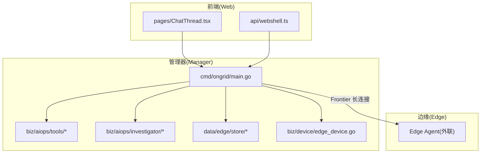
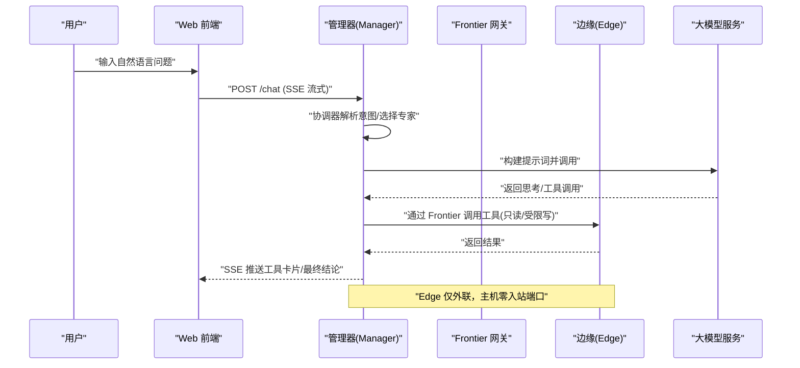
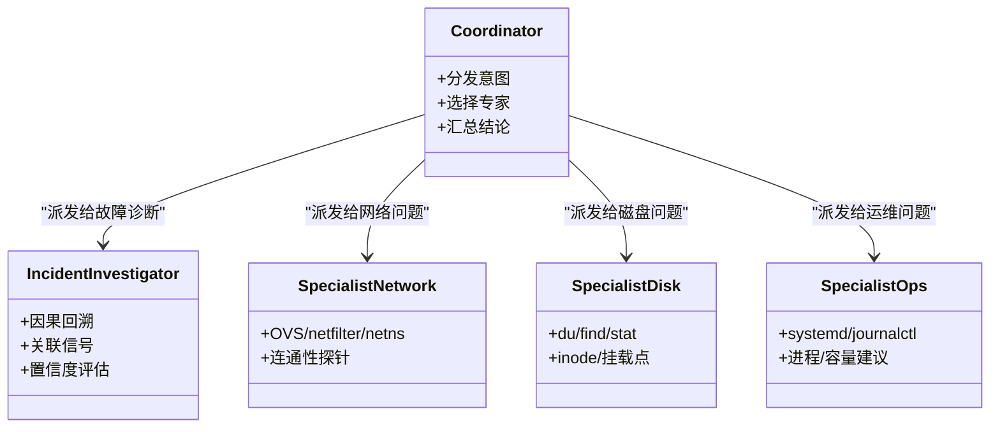
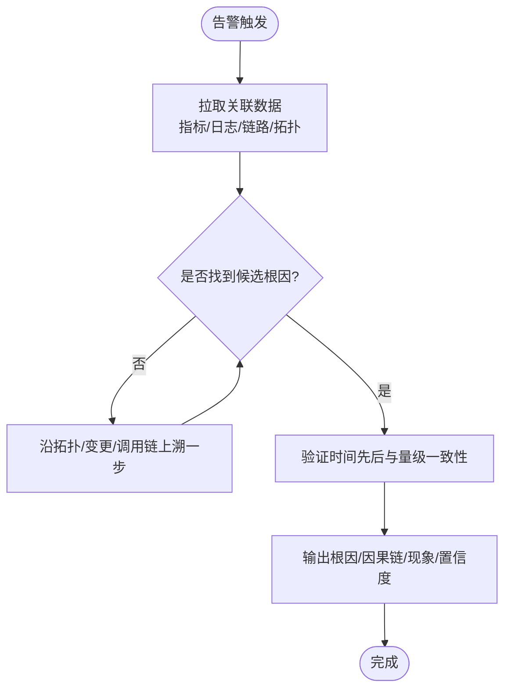
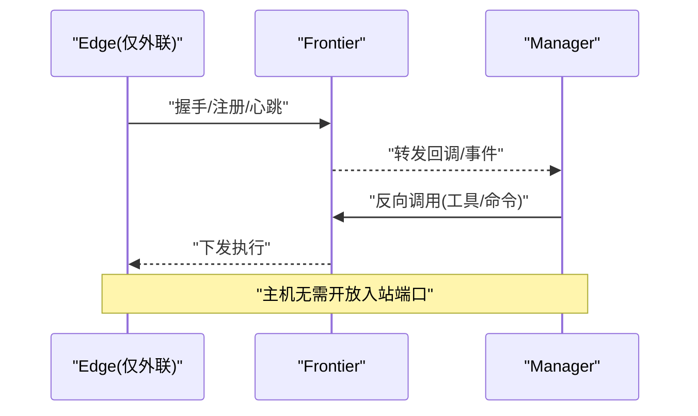
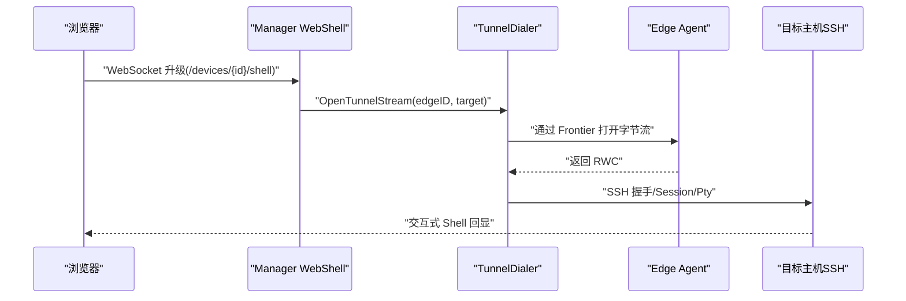
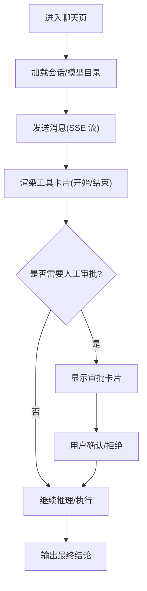
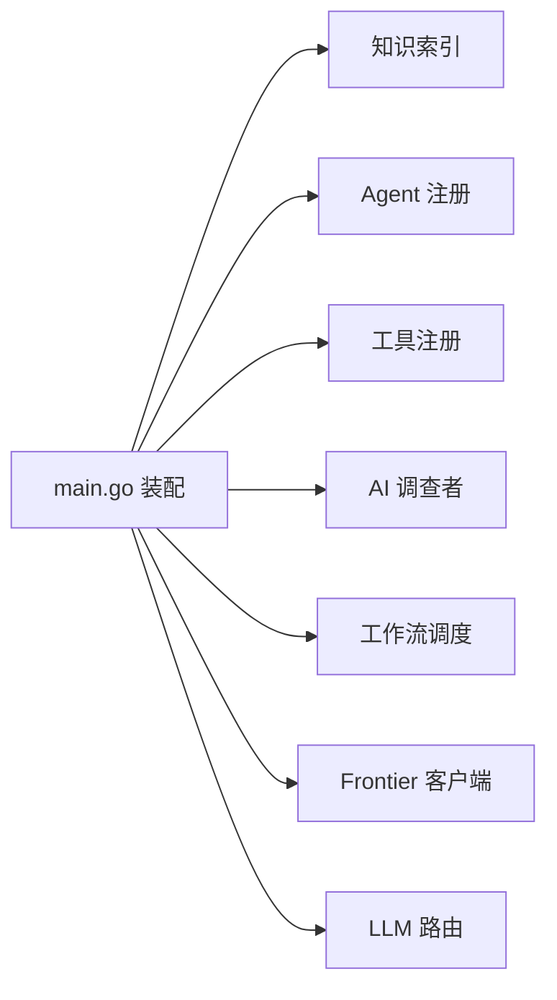

# 项目介绍

<cite>
**本文引用的文件**   
- [README_ZH.md](file://README_ZH.md)
- [cmd/ongrid/main.go](file://cmd/ongrid/main.go)
- [internal/manager/biz/aiops/investigator/investigator.go](file://internal/manager/biz/aiops/investigator/investigator.go)
- [internal/manager/biz/aiops/tools/registry_basetool.go](file://internal/manager/biz/aiops/tools/registry_basetool.go)
- [agents/incident-investigator.md](file://agents/incident-investigator.md)
- [agents/specialist-network.md](file://agents/specialist-network.md)
- [agents/specialist-disk.md](file://agents/specialist-disk.md)
- [agents/specialist-ops.md](file://agents/specialist-ops.md)
- [web/src/pages/ChatThread.tsx](file://web/src/pages/ChatThread.tsx)
- [web/src/api/webshell.ts](file://web/src/api/webshell.ts)
- [internal/manager/biz/devicessh/tunnel.go](file://internal/manager/biz/devicessh/tunnel.go)
- [internal/manager/service/frontierbound/client_test.go](file://internal/manager/service/frontierbound/client_test.go)
- [internal/manager/data/edge/store/edge.go](file://internal/manager/data/edge/store/edge.go)
- [internal/manager/biz/device/edge_device.go](file://internal/manager/biz/device/edge_device.go)
</cite>

## 目录
1. [引言](#引言)
2. [项目结构](#项目结构)
3. [核心组件](#核心组件)
4. [架构总览](#架构总览)
5. [详细组件分析](#详细组件分析)
6. [依赖关系分析](#依赖关系分析)
7. [性能与成本考量](#性能与成本考量)
8. [故障排查指南](#故障排查指南)
9. [结论](#结论)
10. [附录：使用场景与案例](#附录使用场景与案例)

## 引言
OnGrid 是一个以 AI 驱动的运维自动化平台，核心理念是“理解基础设施、发现根因、自动修复”。它通过协调器+专家代理的架构，将告警、指标、日志、链路、拓扑等可观测数据串联起来，实现从“被动响应”到“主动诊断”的跃迁。平台支持零入站端口安全设计、浏览器内 SSH 访问、自然语言交互与 IM 双向集成，帮助团队在复杂系统中快速定位问题并闭环处理。

## 项目结构
仓库采用 Go + TypeScript 全栈组织方式：
- 后端主入口与编排：cmd/ongrid/main.go
- AI 能力与工具注册：internal/manager/biz/aiops/**
- 边缘 Agent 与设备管理：internal/manager/biz/device/**, internal/manager/data/edge/**
- 前端聊天与 WebShell：web/src/pages/**, web/src/api/**
- 专家 Agent 人设与技能说明：agents/*.md

图表来源
- [cmd/ongrid/main.go:1-1020](file://cmd/ongrid/main.go#L1-L1020)
- [internal/manager/biz/aiops/tools/registry_basetool.go:137-156](file://internal/manager/biz/aiops/tools/registry_basetool.go#L137-L156)
- [internal/manager/biz/aiops/investigator/investigator.go:1-329](file://internal/manager/biz/aiops/investigator/investigator.go#L1-L329)
- [internal/manager/data/edge/store/edge.go:1-48](file://internal/manager/data/edge/store/edge.go#L1-L48)
- [internal/manager/biz/device/edge_device.go:1-29](file://internal/manager/biz/device/edge_device.go#L1-L29)
- [web/src/pages/ChatThread.tsx:1-587](file://web/src/pages/ChatThread.tsx#L1-L587)
- [web/src/api/webshell.ts:1-58](file://web/src/api/webshell.ts#L1-L58)

章节来源
- [README_ZH.md:1-96](file://README_ZH.md#L1-L96)
- [cmd/ongrid/main.go:1-1020](file://cmd/ongrid/main.go#L1-L1020)

## 核心组件
- 协调器与专家代理
  - 协调器负责接收用户意图（聊天/IM），按任务类型分派给 SRE、网络、磁盘、运维等专家代理；专家代理具备只读或受限写入权限，输出结构化结论与建议。
  - 参考：[agents/incident-investigator.md](file://agents/incident-investigator.md), [agents/specialist-network.md](file://agents/specialist-network.md), [agents/specialist-disk.md](file://agents/specialist-disk.md), [agents/specialist-ops.md](file://agents/specialist-ops.md)
- 告警驱动自动调查与 RCA
  - 新告警触发后，系统自动拉取关联数据（指标/日志/链路/拓扑）并生成初查报告；RCA worker 顺因果链溯源到“0号病人”，输出根因、证据链与置信度。
  - 参考：[internal/manager/biz/aiops/investigator/investigator.go:1-329](file://internal/manager/biz/aiops/investigator/investigator.go#L1-L329), [internal/manager/biz/aiops/tools/registry_basetool.go:137-156](file://internal/manager/biz/aiops/tools/registry_basetool.go#L137-L156)
- 零入站端口安全设计
  - Edge 主动外联至 Manager/Frontier，主机无需暴露 22/80/443，降低攻击面。
  - 参考：[internal/manager/service/frontierbound/client_test.go:186-228](file://internal/manager/service/frontierbound/client_test.go#L186-L228), [internal/manager/biz/device/edge_device.go:1-29](file://internal/manager/biz/device/edge_device.go#L1-L29)
- 浏览器 SSH 访问
  - 基于反向隧道与 WebSocket，提供无密钥、审计可追溯的交互式 Shell。
  - 参考：[web/src/api/webshell.ts:1-58](file://web/src/api/webshell.ts#L1-L58), [internal/manager/biz/devicessh/tunnel.go:1-417](file://internal/manager/biz/devicessh/tunnel.go#L1-L417)
- 自然语言交互
  - 聊天页面支持流式消息、工具卡片、审批卡片与模型选择，面向初学者友好。
  - 参考：[web/src/pages/ChatThread.tsx:1-587](file://web/src/pages/ChatThread.tsx#L1-L587)

章节来源
- [agents/incident-investigator.md:1-114](file://agents/incident-investigator.md#L1-L114)
- [agents/specialist-network.md:1-67](file://agents/specialist-network.md#L1-L67)
- [agents/specialist-disk.md:1-59](file://agents/specialist-disk.md#L1-L59)
- [agents/specialist-ops.md:1-66](file://agents/specialist-ops.md#L1-L66)
- [internal/manager/biz/aiops/investigator/investigator.go:1-329](file://internal/manager/biz/aiops/investigator/investigator.go#L1-L329)
- [internal/manager/biz/aiops/tools/registry_basetool.go:137-156](file://internal/manager/biz/aiops/tools/registry_basetool.go#L137-L156)
- [web/src/pages/ChatThread.tsx:1-587](file://web/src/pages/ChatThread.tsx#L1-L587)
- [web/src/api/webshell.ts:1-58](file://web/src/api/webshell.ts#L1-L58)
- [internal/manager/biz/devicessh/tunnel.go:1-417](file://internal/manager/biz/devicessh/tunnel.go#L1-L417)
- [internal/manager/service/frontierbound/client_test.go:186-228](file://internal/manager/service/frontierbound/client_test.go#L186-L228)
- [internal/manager/biz/device/edge_device.go:1-29](file://internal/manager/biz/device/edge_device.go#L1-L29)

## 架构总览
OnGrid 由管理器（Manager）、边缘节点（Edge）、前端（Web）组成。Manager 通过 Frontier 与 Edge 建立长连接，Edge 仅外联，不开放入站端口。AI 能力集中在 Manager 侧，包括工具注册、RCA 工作流、会话与审批流。

图表来源
- [cmd/ongrid/main.go:1635-1801](file://cmd/ongrid/main.go#L1635-L1801)
- [internal/manager/biz/aiops/investigator/investigator.go:227-293](file://internal/manager/biz/aiops/investigator/investigator.go#L227-L293)
- [internal/manager/biz/aiops/tools/registry_basetool.go:137-156](file://internal/manager/biz/aiops/tools/registry_basetool.go#L137-L156)
- [internal/manager/service/frontierbound/client_test.go:186-228](file://internal/manager/service/frontierbound/client_test.go#L186-L228)

## 详细组件分析

### 协调器+专家代理体系
- 角色分工
  - 协调器：统一入口，路由到 incident-investigator、specialist-network、specialist-disk、specialist-ops 等。
  - 专家代理：限定工具集与权限模式（多为只读），输出结构化结论与建议。
- 关键约束
  - 最大轮次限制、禁止越权操作、强制先查知识库再动手。
- 参考
  - [agents/incident-investigator.md:1-114](file://agents/incident-investigator.md#L1-L114)
  - [agents/specialist-network.md:1-67](file://agents/specialist-network.md#L1-L67)
  - [agents/specialist-disk.md:1-59](file://agents/specialist-disk.md#L1-L59)
  - [agents/specialist-ops.md:1-66](file://agents/specialist-ops.md#L1-L66)

图表来源
- [agents/incident-investigator.md:1-114](file://agents/incident-investigator.md#L1-L114)
- [agents/specialist-network.md:1-67](file://agents/specialist-network.md#L1-L67)
- [agents/specialist-disk.md:1-59](file://agents/specialist-disk.md#L1-L59)
- [agents/specialist-ops.md:1-66](file://agents/specialist-ops.md#L1-L66)

章节来源
- [agents/incident-investigator.md:1-114](file://agents/incident-investigator.md#L1-L114)
- [agents/specialist-network.md:1-67](file://agents/specialist-network.md#L1-L67)
- [agents/specialist-disk.md:1-59](file://agents/specialist-disk.md#L1-L59)
- [agents/specialist-ops.md:1-66](file://agents/specialist-ops.md#L1-L66)

### 告警驱动自动调查与 RCA
- 流程要点
  - 新告警触发 → 拉取关联数据（指标/日志/链路/拓扑）→ 单轮或多轮推理 → 输出初查/根因报告。
  - 支持变更事件查询、拓扑上溯、最早偏离识别、证据链接。
- 关键实现
  - 后台工作池与超时控制，避免阻塞告警路径。
  - 工具注册按需启用（如变更事件、边缘摘要、关联分析）。
- 参考
  - [internal/manager/biz/aiops/investigator/investigator.go:1-329](file://internal/manager/biz/aiops/investigator/investigator.go#L1-L329)
  - [internal/manager/biz/aiops/tools/registry_basetool.go:137-156](file://internal/manager/biz/aiops/tools/registry_basetool.go#L137-L156)
  - [cmd/ongrid/main.go:1635-1801](file://cmd/ongrid/main.go#L1635-L1801)

图表来源
- [internal/manager/biz/aiops/investigator/investigator.go:227-293](file://internal/manager/biz/aiops/investigator/investigator.go#L227-L293)
- [internal/manager/biz/aiops/tools/registry_basetool.go:137-156](file://internal/manager/biz/aiops/tools/registry_basetool.go#L137-L156)

章节来源
- [internal/manager/biz/aiops/investigator/investigator.go:1-329](file://internal/manager/biz/aiops/investigator/investigator.go#L1-L329)
- [internal/manager/biz/aiops/tools/registry_basetool.go:137-156](file://internal/manager/biz/aiops/tools/registry_basetool.go#L137-L156)
- [cmd/ongrid/main.go:1635-1801](file://cmd/ongrid/main.go#L1635-L1801)

### 零入站端口安全设计
- 设计原则
  - Edge 主动外联至 Manager/Frontier，主机不暴露 22/80/443，减少攻击面。
- 关键实现
  - Frontierbound Client 用于长连接与反向调用；Edge 注册、心跳、推送均走此通道。
- 参考
  - [internal/manager/service/frontierbound/client_test.go:186-228](file://internal/manager/service/frontierbound/client_test.go#L186-L228)
  - [internal/manager/biz/device/edge_device.go:1-29](file://internal/manager/biz/device/edge_device.go#L1-L29)
  - [internal/manager/data/edge/store/edge.go:1-48](file://internal/manager/data/edge/store/edge.go#L1-L48)

图表来源
- [internal/manager/service/frontierbound/client_test.go:186-228](file://internal/manager/service/frontierbound/client_test.go#L186-L228)
- [internal/manager/biz/device/edge_device.go:1-29](file://internal/manager/biz/device/edge_device.go#L1-L29)
- [internal/manager/data/edge/store/edge.go:1-48](file://internal/manager/data/edge/store/edge.go#L1-L48)

章节来源
- [internal/manager/service/frontierbound/client_test.go:186-228](file://internal/manager/service/frontierbound/client_test.go#L186-L228)
- [internal/manager/biz/device/edge_device.go:1-29](file://internal/manager/biz/device/edge_device.go#L1-L29)
- [internal/manager/data/edge/store/edge.go:1-48](file://internal/manager/data/edge/store/edge.go#L1-L48)

### 浏览器 SSH 访问
- 功能特性
  - 通过 WebSocket 建立反向隧道，无需密钥与跳板机，全程审计。
- 关键实现
  - 前端封装 openShellSocket，携带 token 与子协议协商；后端通过 devicessh.tunnel 建立 SSH Session。
- 参考
  - [web/src/api/webshell.ts:1-58](file://web/src/api/webshell.ts#L1-L58)
  - [internal/manager/biz/devicessh/tunnel.go:1-417](file://internal/manager/biz/devicessh/tunnel.go#L1-L417)

图表来源
- [web/src/api/webshell.ts:1-58](file://web/src/api/webshell.ts#L1-L58)
- [internal/manager/biz/devicessh/tunnel.go:108-233](file://internal/manager/biz/devicessh/tunnel.go#L108-L233)

章节来源
- [web/src/api/webshell.ts:1-58](file://web/src/api/webshell.ts#L1-L58)
- [internal/manager/biz/devicessh/tunnel.go:1-417](file://internal/manager/biz/devicessh/tunnel.go#L1-L417)

### 自然语言交互体验
- 聊天页面
  - 支持流式消息、工具卡片、审批卡片、模型选择与多语言。
  - 自动滚动、去重、错误恢复、Esc 中断。
- 参考
  - [web/src/pages/ChatThread.tsx:1-587](file://web/src/pages/ChatThread.tsx#L1-L587)

图表来源
- [web/src/pages/ChatThread.tsx:217-414](file://web/src/pages/ChatThread.tsx#L217-L414)

章节来源
- [web/src/pages/ChatThread.tsx:1-587](file://web/src/pages/ChatThread.tsx#L1-L587)

## 依赖关系分析
- 管理器启动时装配：
  - 知识索引同步、Agent/Skill 注册、AI 调查者、工具注册、工作流调度器等。
- 外部依赖：
  - Frontier（长连接）、LLM 提供商、可观测栈（Prom/Loki/Tempo/Grafana）、IM 通道。
- 参考
  - [cmd/ongrid/main.go:1448-1474](file://cmd/ongrid/main.go#L1448-L1474)
  - [cmd/ongrid/main.go:1635-1801](file://cmd/ongrid/main.go#L1635-L1801)

图表来源
- [cmd/ongrid/main.go:1448-1474](file://cmd/ongrid/main.go#L1448-L1474)
- [cmd/ongrid/main.go:1635-1801](file://cmd/ongrid/main.go#L1635-L1801)

章节来源
- [cmd/ongrid/main.go:1448-1474](file://cmd/ongrid/main.go#L1448-L1474)
- [cmd/ongrid/main.go:1635-1801](file://cmd/ongrid/main.go#L1635-L1801)

## 性能与成本考量
- 并发与队列
  - 调查者使用工作池与缓冲队列，避免阻塞告警路径；超限时丢弃并记录警告。
- 超时与预算
  - LLM 调用设置超时与消息长度上限，防止上下文爆炸与长时间等待。
- 降级策略
  - 当 LLM 不可用时，非 Agent 节点仍可运行；Agent 节点降级为明确错误。
- 参考
  - [internal/manager/biz/aiops/investigator/investigator.go:48-104](file://internal/manager/biz/aiops/investigator/investigator.go#L48-L104)
  - [internal/manager/biz/aiops/investigator/investigator.go:227-293](file://internal/manager/biz/aiops/investigator/investigator.go#L227-L293)
  - [cmd/ongrid/main.go:1635-1801](file://cmd/ongrid/main.go#L1635-L1801)

## 故障排查指南
- 常见问题
  - LLM 未配置：调查者跳过，需检查默认模型路由与凭据。
  - 队列满：高峰期可能丢弃部分调查任务，需扩容工作池或优化规则风暴。
  - 前端无法连接：检查 WebSocket 子协议与 token 传递。
- 参考
  - [internal/manager/biz/aiops/investigator/investigator.go:258-266](file://internal/manager/biz/aiops/investigator/investigator.go#L258-L266)
  - [web/src/api/webshell.ts:1-58](file://web/src/api/webshell.ts#L1-L58)

章节来源
- [internal/manager/biz/aiops/investigator/investigator.go:258-266](file://internal/manager/biz/aiops/investigator/investigator.go#L258-L266)
- [web/src/api/webshell.ts:1-58](file://web/src/api/webshell.ts#L1-L58)

## 结论
OnGrid 以“理解基础设施、发现根因、自动修复”为核心，借助协调器+专家代理、告警驱动调查、RCA 因果回溯、零入站端口与浏览器 SSH 等能力，构建了高可用、低侵入、强安全的智能运维平台。其天然适配现有可观测与 IM 生态，并通过自然语言交互显著降低排障门槛，提升团队效率与稳定性。

## 附录：使用场景与案例
- 场景一：告警自动调查
  - 触发条件：某服务 CPU 飙升告警
  - 行为：系统自动拉取指标/日志/链路，输出“根因/因果链/现象/置信度”，并在聊天中展示。
  - 参考：[internal/manager/biz/aiops/investigator/investigator.go:227-293](file://internal/manager/biz/aiops/investigator/investigator.go#L227-L293)
- 场景二：网络连通性问题
  - 触发条件：DNS 解析慢/TLS 握手失败
  - 行为：network 专家先查知识库，再按步骤探测 OVS/netfilter/conntrack，给出结论与建议。
  - 参考：[agents/specialist-network.md:1-67](file://agents/specialist-network.md#L1-L67)
- 场景三：磁盘空间不足
  - 触发条件：/var 占用上涨
  - 行为：disk 专家分层下钻，定位大文件与 inode 情况，给出清理建议。
  - 参考：[agents/specialist-disk.md:1-59](file://agents/specialist-disk.md#L1-L59)
- 场景四：服务异常重启
  - 触发条件：nginx 频繁重启
  - 行为：ops 专家查看 systemd/journalctl/进程状态，必要时建议重启并走审批流程。
  - 参考：[agents/specialist-ops.md:1-66](file://agents/specialist-ops.md#L1-L66)
- 场景五：浏览器内远程调试
  - 触发条件：需要登录目标主机排查
  - 行为：点击终端按钮，通过反向隧道打开 Shell，无需密钥与跳板机。
  - 参考：[web/src/api/webshell.ts:1-58](file://web/src/api/webshell.ts#L1-L58), [internal/manager/biz/devicessh/tunnel.go:108-233](file://internal/manager/biz/devicessh/tunnel.go#L108-L233)

章节来源
- [internal/manager/biz/aiops/investigator/investigator.go:227-293](file://internal/manager/biz/aiops/investigator/investigator.go#L227-L293)
- [agents/specialist-network.md:1-67](file://agents/specialist-network.md#L1-L67)
- [agents/specialist-disk.md:1-59](file://agents/specialist-disk.md#L1-L59)
- [agents/specialist-ops.md:1-66](file://agents/specialist-ops.md#L1-L66)
- [web/src/api/webshell.ts:1-58](file://web/src/api/webshell.ts#L1-L58)
- [internal/manager/biz/devicessh/tunnel.go:108-233](file://internal/manager/biz/devicessh/tunnel.go#L108-L233)