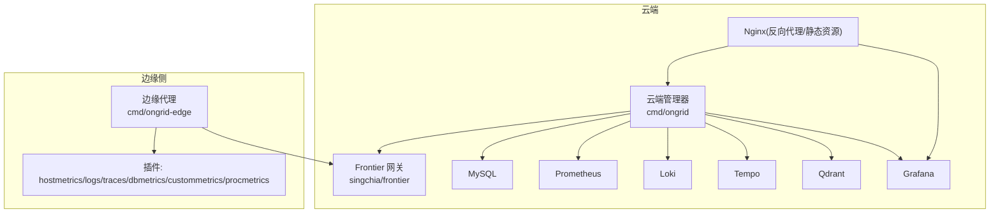
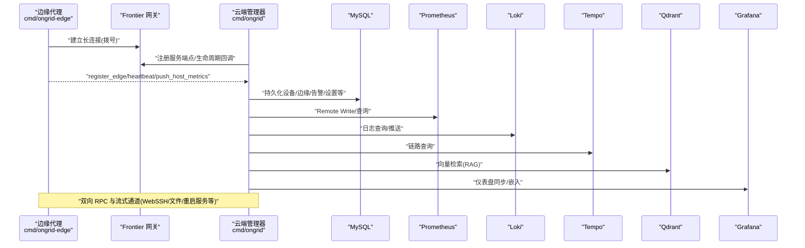
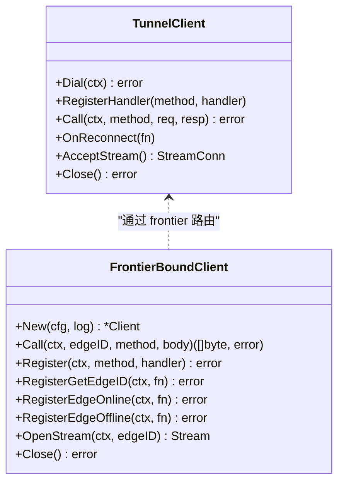
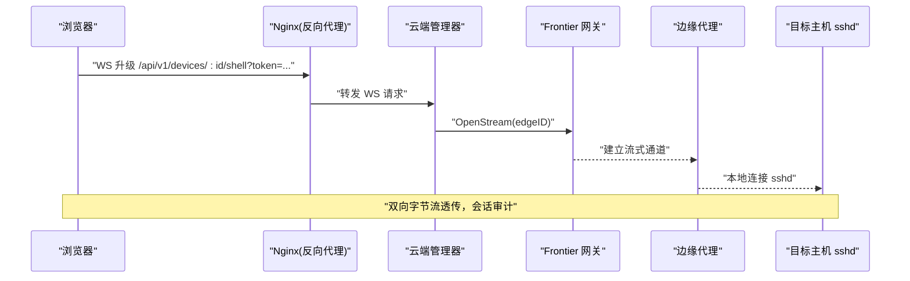
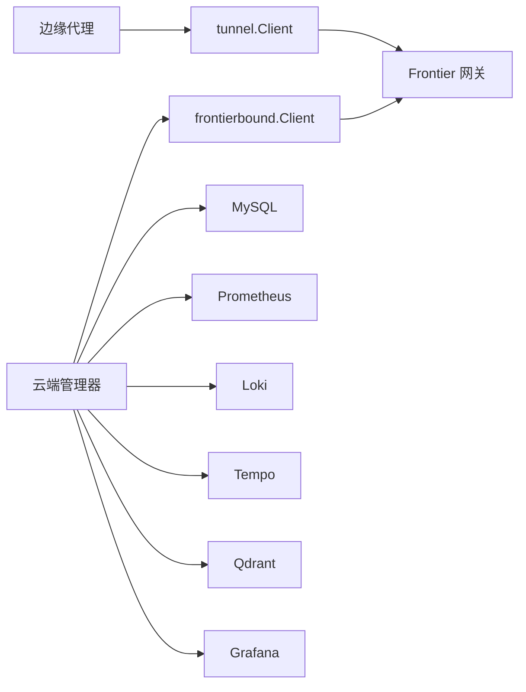
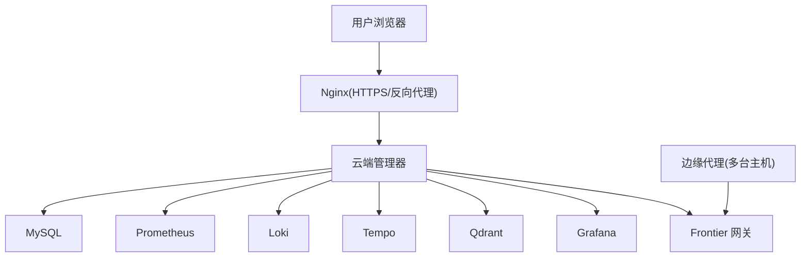

# 项目概述

<cite>
**本文引用的文件**   
- [README.md](file://README.md)
- [cmd/ongrid/main.go](file://cmd/ongrid/main.go)
- [cmd/ongrid-edge/main.go](file://cmd/ongrid-edge/main.go)
- [internal/pkg/tunnel/client.go](file://internal/pkg/tunnel/client.go)
- [internal/manager/service/frontierbound/client.go](file://internal/manager/service/frontierbound/client.go)
- [deploy/install/install.sh](file://deploy/install/install.sh)
- [deploy/docker-compose.yml](file://deploy/docker-compose.yml)
- [deploy/README.md](file://deploy/README.md)
- [web/src/api/webshell.ts](file://web/src/api/webshell.ts)
- [skills/bash/SKILL.md](file://skills/bash/SKILL.md)
- [ROADMAP.md](file://ROADMAP.md)
</cite>

## 目录
1. [简介](#简介)
2. [项目结构](#项目结构)
3. [核心组件](#核心组件)
4. [架构总览](#架构总览)
5. [详细组件分析](#详细组件分析)
6. [依赖关系分析](#依赖关系分析)
7. [性能与可观测性](#性能与可观测性)
8. [故障排查指南](#故障排查指南)
9. [结论](#结论)
10. [附录：快速开始与部署拓扑](#附录快速开始与部署拓扑)

## 简介
Ongrid 是一个 AI 驱动的运维自动化平台，围绕“指标·日志·链路·拓扑·根因关联·远程执行·告警驱动自动调查·RAG 知识与代码检索·专家智能体与技能”构建。其核心价值在于：
- 以云端管理器（Manager）+ 边缘代理（Edge Agent）的协同模式，实现“零入站端口”的安全连接与双向控制面。
- 通过内置的可观测性栈（Prometheus/Loki/Tempo/Grafana）和 AI 能力，提供智能故障诊断、自动调查与闭环修复建议。
- 支持多模型路由与 IM 渠道联动，让 SRE 在 Slack/Telegram/飞书/钉钉/企业微信等环境中完成从发现到处置的全流程。

技术栈选择 Go + TypeScript + React：
- Go 负责高性能服务端、Agent 内核、插件运行时与数据面通道；
- TypeScript + React 提供现代 Web 控制台与工作流编排体验；
- 结合 gRPC/geminio 双工隧道，形成稳定可靠的云边通信基础。

## 项目结构
仓库采用分层与领域边界组织：
- cmd：云端管理器 ongrid 与边缘代理 ongrid-edge 两个二进制入口
- internal：按业务域划分（iam、manager、edgeagent、pkg、skill），内含 biz/data/server 三层
- web：TypeScript + React 前端应用
- deploy：安装脚本、Docker Compose、systemd 部署模板与配置
- api：gRPC/Proto 定义（IAM、AIOPS、Alert、Metric、Edge、Tunnel 等）
- docs：工作流目录、架构文档、数据模型等

图示来源
- [cmd/ongrid/main.go:1-42](file://cmd/ongrid/main.go#L1-L42)
- [cmd/ongrid-edge/main.go:1-47](file://cmd/ongrid-edge/main.go#L1-L47)
- [deploy/docker-compose.yml:13-397](file://deploy/docker-compose.yml#L13-L397)

章节来源
- [README.md:1-96](file://README.md#L1-L96)
- [deploy/docker-compose.yml:13-397](file://deploy/docker-compose.yml#L13-L397)

## 核心组件
- 云端管理器（Manager）
  - 职责：统一 HTTP API、RBAC/IAM、AIOPS 编排、告警评估、设备/边缘管理、WebShell、工作流、知识/RAG、系统设置与集成。
  - 关键启动流程：加载配置 → 初始化 OTel 追踪 → 打开数据库并迁移 → 初始化 IAM/Casbin → 注入系统设置种子 → 构建 LLM 多提供商路由 → 注册各业务服务与中间件 → 暴露 /metrics。
- 边缘代理（Edge Agent）
  - 职责：建立到云端的长连接，上报主机指标，注册工具 RPC（bash 沙箱、host_files、restart_service、webshell 透传等），运行插件（logs/traces/hostmetrics/procmetrics/database metrics/custom metrics）。
  - 采集模式：off/auto/embedded/scrape 多种模式，默认 off 配合插件子进程拉取。
- 云边隧道（geminio + frontier）
  - 边缘主动拨号至 Frontier，Manager 通过 Service-end 订阅回调与反向调用；具备断线重连、路由失效恢复、安全认证（AccessKey/SecretKey）。
- 前端控制台（Web）
  - 基于 TypeScript + React，提供设备/边缘管理、监控面板、WebShell、工作流编排、知识库、设置与集成等。

章节来源
- [cmd/ongrid/main.go:195-241](file://cmd/ongrid/main.go#L195-L241)
- [cmd/ongrid-edge/main.go:56-110](file://cmd/ongrid-edge/main.go#L56-L110)
- [internal/pkg/tunnel/client.go:23-37](file://internal/pkg/tunnel/client.go#L23-L37)
- [web/src/api/webshell.ts:1-58](file://web/src/api/webshell.ts#L1-L58)

## 架构总览
Ongrid 采用“云端管理器 + 边缘代理 + 消息网关（frontier）”的双向隧道架构。边缘侧无需开放入站端口，所有控制面与数据面均通过边缘主动拨号建立，天然规避防火墙与 NAT 问题。

图示来源
- [cmd/ongrid/main.go:1-42](file://cmd/ongrid/main.go#L1-L42)
- [cmd/ongrid-edge/main.go:1-47](file://cmd/ongrid-edge/main.go#L1-L47)
- [internal/manager/service/frontierbound/client.go:1-44](file://internal/manager/service/frontierbound/client.go#L1-L44)
- [internal/pkg/tunnel/client.go:23-37](file://internal/pkg/tunnel/client.go#L23-L37)
- [deploy/docker-compose.yml:13-397](file://deploy/docker-compose.yml#L13-L397)

## 详细组件分析

### 云端管理器（Manager）
- 启动与初始化
  - 加载配置与环境变量，输出关键地址与版本信息
  - 初始化 OpenTelemetry 追踪（对接 Tempo）
  - 打开数据库并执行全量迁移（IAM、Alert、Device、Edge、Metric、AIOPS、Skill、Setting、Marketplace、Secret、MCP、Approval、Monitor、WebShell、Audit、Report、Flow、InstallJob 等）
  - 初始化 IAM（用户/组织/成员/Casbin 策略），必要时引导创建管理员
  - 注入系统设置种子（LLM、Prom、Grafana、Loki、Tempo、WebSearch 等）
  - 构建 LLM 多客户端路由（OpenAI/Anthropic/Zhipu/Gemini/DeepSeek/Kimi），支持热更新
  - 注册各业务层（biz/service/server）、中间件（鉴权/审计）、/metrics 端点
- 关键特性
  - 零入站端口：通过 frontier 进行反向调用
  - 内置可观测性：Prom/Loki/Tempo/Grafana 一体化
  - AI 能力：协调者+专家智能体、RCA 根因分析、工作流编排、审批与通知

章节来源
- [cmd/ongrid/main.go:195-241](file://cmd/ongrid/main.go#L195-L241)
- [cmd/ongrid/main.go:246-276](file://cmd/ongrid/main.go#L246-L276)
- [cmd/ongrid/main.go:282-386](file://cmd/ongrid/main.go#L282-L386)
- [cmd/ongrid/main.go:406-476](file://cmd/ongrid/main.go#L406-L476)
- [cmd/ongrid/main.go:532-605](file://cmd/ongrid/main.go#L532-L605)

### 边缘代理（Edge Agent）
- 启动与初始化
  - 解析配置（云端地址、采集模式、版本等）
  - 建立隧道客户端（geminio），注册各类能力处理器（bash、host_files、restart_service、webshell）
  - 根据采集模式构建 Collector（off/auto/embedded/scrape）
  - 启动本地 /metrics 与 healthz
  - 启动插件 Supervisor（logs、audit、traces、metrics、custommetrics、database metrics、hostmetrics、procmetrics），支持动态配置刷新与健康上报
- 关键特性
  - 插件化扩展：通过 Supervisor 管理子进程或内嵌抓取器
  - 安全沙箱：bash 命令由 cmdpolicy 校验，v1 为只读策略
  - 升级机制：支持 ADR-024 一键升级包与回滚

章节来源
- [cmd/ongrid-edge/main.go:56-110](file://cmd/ongrid-edge/main.go#L56-L110)
- [cmd/ongrid-edge/main.go:112-149](file://cmd/ongrid-edge/main.go#L112-L149)
- [cmd/ongrid-edge/main.go:162-187](file://cmd/ongrid-edge/main.go#L162-L187)
- [cmd/ongrid-edge/main.go:194-305](file://cmd/ongrid-edge/main.go#L194-L305)
- [cmd/ongrid-edge/main.go:316-376](file://cmd/ongrid-edge/main.go#L316-L376)
- [skills/bash/SKILL.md:111-124](file://skills/bash/SKILL.md#L111-L124)

### 云边隧道与网关（geminio + frontier）
- 边缘侧
  - 使用 tunnel.Client 封装 geminio，支持指数退避重拨、TLS CA、方法级 Handler 注册、Call 错误检测触发异步重连、AcceptStream 用于 WebSSH 等流式通道
- 云端侧
  - frontierbound.Client 面向 manager 暴露 Call/Register/OpenStream 等接口，维护 edgeID 与 transportID 映射，屏蔽底层细节

图示来源
- [internal/pkg/tunnel/client.go:23-37](file://internal/pkg/tunnel/client.go#L23-L37)
- [internal/pkg/tunnel/client.go:62-141](file://internal/pkg/tunnel/client.go#L62-L141)
- [internal/pkg/tunnel/client.go:218-243](file://internal/pkg/tunnel/client.go#L218-L243)
- [internal/manager/service/frontierbound/client.go:49-89](file://internal/manager/service/frontierbound/client.go#L49-L89)
- [internal/manager/service/frontierbound/client.go:128-145](file://internal/manager/service/frontierbound/client.go#L128-L145)

章节来源
- [internal/pkg/tunnel/client.go:23-37](file://internal/pkg/tunnel/client.go#L23-L37)
- [internal/pkg/tunnel/client.go:62-141](file://internal/pkg/tunnel/client.go#L62-L141)
- [internal/manager/service/frontierbound/client.go:49-89](file://internal/manager/service/frontierbound/client.go#L49-L89)

### WebShell 与远程执行
- WebShell
  - 前端通过 WebSocket 连接到 /api/v1/devices/{id}/shell，携带 JWT token，协商子协议
  - 后端通过 frontierbound.OpenStream 将 SSH 流量经隧道转发到目标主机 sshd
- 远程执行
  - 通过 bash 技能（read-only v1）与 host_files/restart_service 等插件能力，受 cmdpolicy 沙箱约束

图示来源
- [web/src/api/webshell.ts:1-58](file://web/src/api/webshell.ts#L1-L58)
- [internal/manager/service/frontierbound/client.go:218-242](file://internal/manager/service/frontierbound/client.go#L218-L242)

章节来源
- [web/src/api/webshell.ts:1-58](file://web/src/api/webshell.ts#L1-L58)
- [internal/manager/service/frontierbound/client.go:218-242](file://internal/manager/service/frontierbound/client.go#L218-L242)
- [skills/bash/SKILL.md:111-124](file://skills/bash/SKILL.md#L111-L124)

## 依赖关系分析
- 组件耦合
  - Manager 对 frontierbound 强依赖（服务发现与路由），对 DB/Prom/Loki/Tempo/Qdrant/Grafana 为外部依赖
  - Edge 对 tunnel.Client 强依赖，对插件子系统松耦合（Supervisor 管理）
- 直接/间接依赖
  - Manager → frontierbound → frontier(geminio) → Edge
  - Edge → tunnel.Client → frontier(geminio)
- 潜在循环
  - 通过接口抽象（tunnel.Client、frontierbound.service）避免循环依赖
- 外部依赖与集成点
  - 数据库：MySQL（默认）/SQLite（可选）
  - 可观测性：Prometheus/Loki/Tempo/Grafana
  - 向量库：Qdrant
  - LLM：多提供商（OpenAI/Anthropic/Zhipu/Gemini/DeepSeek/Kimi）
  - IM：Slack/Telegram/飞书/钉钉/企业微信/Webhook

图示来源
- [internal/manager/service/frontierbound/client.go:1-44](file://internal/manager/service/frontierbound/client.go#L1-L44)
- [internal/pkg/tunnel/client.go:23-37](file://internal/pkg/tunnel/client.go#L23-L37)
- [deploy/docker-compose.yml:13-397](file://deploy/docker-compose.yml#L13-L397)

章节来源
- [internal/manager/service/frontierbound/client.go:1-44](file://internal/manager/service/frontierbound/client.go#L1-L44)
- [internal/pkg/tunnel/client.go:23-37](file://internal/pkg/tunnel/client.go#L23-L37)
- [deploy/docker-compose.yml:13-397](file://deploy/docker-compose.yml#L13-L397)

## 性能与可观测性
- 自监控
  - Manager 暴露 /metrics，包含告警评估延迟、promwrite 结果等指标
  - Edge 暴露本地 /metrics 与 /healthz，便于调试
- 追踪
  - 启动时初始化 OTel，上报至 Tempo，支撑 trace_latency/trace_error_rate 等评估器
- 采集优化
  - Edge 支持 scrape 模式与插件子进程（node_exporter/process-exporter），减少频繁 push 开销
  - 默认 off 模式仅保留按需 RPC，降低带宽占用

章节来源
- [cmd/ongrid/main.go:218-241](file://cmd/ongrid/main.go#L218-L241)
- [cmd/ongrid-edge/main.go:169-177](file://cmd/ongrid-edge/main.go#L169-L177)
- [cmd/ongrid-edge/main.go:316-376](file://cmd/ongrid-edge/main.go#L316-L376)

## 故障排查指南
- 常见问题定位
  - 云端无法登录：检查首次管理员环境变量是否设置，参考部署说明
  - Edge 无法上线：确认 AccessKey/SecretKey、CloudAddr 可达性与证书配置
  - WebShell 失败：检查前端 token 传递与子协议协商，确认目标主机 sshd 可达
  - 插件异常：查看插件健康快照与 Supervisor 日志，确认配置刷新与二进制路径
- 相关入口
  - 安装与首登说明、端口与数据卷位置、镜像与网络拓扑

章节来源
- [deploy/README.md:66-98](file://deploy/README.md#L66-L98)
- [web/src/api/webshell.ts:1-58](file://web/src/api/webshell.ts#L1-L58)
- [cmd/ongrid-edge/main.go:194-305](file://cmd/ongrid-edge/main.go#L194-L305)

## 结论
Ongrid 以“零入站端口”的云边协同为基础，结合内置可观测性与 AI 能力，实现了从指标/日志/链路到根因分析与远程执行的闭环。Go + TypeScript + React 的技术栈兼顾了高性能与良好用户体验，插件化与多模型路由为未来扩展提供了坚实基础。

## 附录：快速开始与部署拓扑

### 快速开始（一键安装）
- 下载对应架构的发行包并解压，进入目录后执行安装脚本（Ubuntu 22.04+/Debian 12+/RHEL/Rocky 9）
- 中国大陆可使用 CDN 镜像加速
- 安装完成后访问 Web 控制台，按提示完成首登与基本配置

章节来源
- [README.md:44-72](file://README.md#L44-L72)
- [deploy/install/install.sh:355-414](file://deploy/install/install.sh#L355-L414)

### 本地开发（docker compose）
- 使用 deploy/docker-compose.yml 拉起完整栈（MySQL、Manager、Frontier、Prometheus、Loki、Tempo、Qdrant、Grafana、Nginx）
- 可通过环境变量覆盖监听地址、数据库 DSN、LLM 密钥、Grafana 集成等
- 如需本地演示 Edge，可在 compose 中启用注释掉的 ongrid-edge 服务段

章节来源
- [deploy/docker-compose.yml:13-397](file://deploy/docker-compose.yml#L13-L397)

### 部署拓扑图（生产形态）

图示来源
- [deploy/docker-compose.yml:183-204](file://deploy/docker-compose.yml#L183-L204)
- [deploy/docker-compose.yml:206-218](file://deploy/docker-compose.yml#L206-L218)
- [deploy/docker-compose.yml:224-252](file://deploy/docker-compose.yml#L224-L252)
- [deploy/docker-compose.yml:257-267](file://deploy/docker-compose.yml#L257-L267)
- [deploy/docker-compose.yml:273-285](file://deploy/docker-compose.yml#L273-L285)
- [deploy/docker-compose.yml:304-311](file://deploy/docker-compose.yml#L304-L311)
- [deploy/docker-compose.yml:313-359](file://deploy/docker-compose.yml#L313-L359)