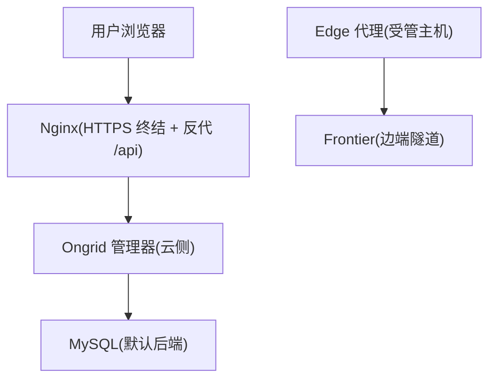
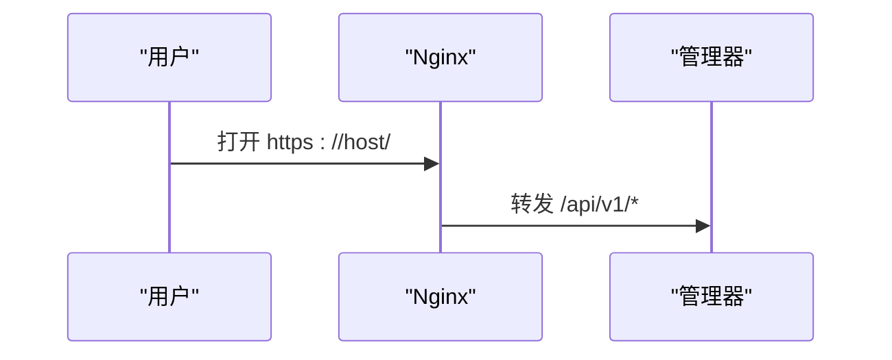
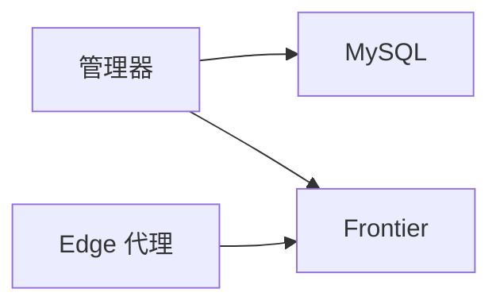
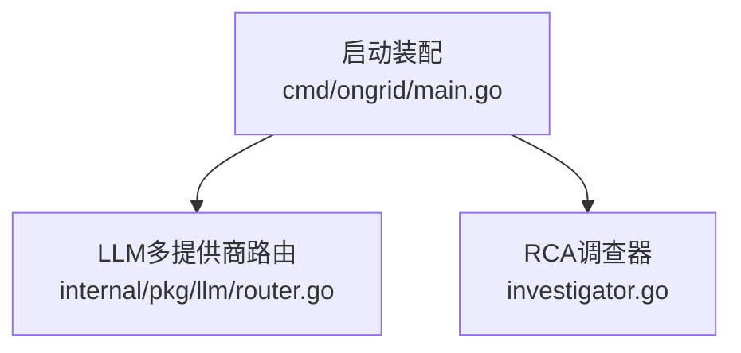
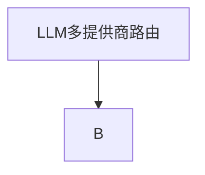
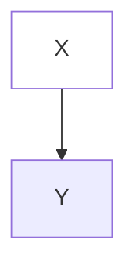

# repowiki-builder · 参考手册

本文件是 [SKILL.md](SKILL.md) 的延伸，包含字段 schema、完整样例片段、反例清单与命令清单。仅在落地细节不清楚时回看。

---

## 1 · `_index.yaml` 字段

### 1.1 顶层字段

| 字段 | 类型 | 必填 | 说明 |
|------|------|------|------|
| `schema_version` | int | ✅ | 当前固定为 `1` |
| `locale` | string | ✅ | BCP-47 风格，例 `zh-CN`、`en-US` |
| `branch` | string | ✅ | 生成时所在 git 分支，例 `main`、`main-local-new` |
| `nodes_managed` | bool | ✅ | 固定 `true`，表示模块树由本 skill 维护 |
| `exported_at` | string (RFC3339 UTC) | ✅ | 例 `2026-07-09T03:59:58Z` |
| `modules` | map | ✅ | 模块树 |

### 1.2 模块节点字段

| 字段 | 类型 | 必填 | 说明 |
|------|------|------|------|
| `dir_name` | string | ✅ | **磁盘目录名原文**，中文/特殊字符保留 |
| `title` | string | ✅ | 与 `dir_name` 保持一致；如不一致须 `dir_name` 优先 |
| `scope` | list[str] | ✅ | 相对仓库根的路径或 glob，至少 1 条 |
| `source_files` | list[str] | ✅ | 占位数组，目前固定 `[]`（预留扩展） |
| `children` | list[str] | ✅ | 子节点 key 列表，叶子为空 `[]` |
| `depends_on` | list[str] | - | 预留字段，目前固定 `[]` |
| `related_to` | list[{path}] | - | 关联节点 key，**不自指、不成环** |

### 1.3 key 命名约定

- 一律使用 ASCII：小写英文 + 下划线 + 数字，不含空格、`/`、中文。
- 多层级用 `/` 连接：`manager_service/aiops/chat_runtime`。
- 与磁盘目录**不要求**字面对应；通过 `dir_name` 关联磁盘事实。

### 1.4 完整骨架

```yaml
# 知识卡导出索引文件
schema_version: 1
locale: zh-CN
branch: main-local-new
nodes_managed: true
exported_at: "2026-07-09T03:59:58Z"
modules:
  "":
    dir_name: Ongrid 云边一体化平台（Go 单体仓库）
    title: Ongrid 云边一体化平台（Go 单体仓库）
    scope:
      - README.md
      - CONTRIBUTING.md
      - go.mod
      - go.sum
      - Makefile
      - ROADMAP.md
      - .env.example
    source_files: []
    children:
      - api_protos
      - deploy_artifacts
      - docs_and_wiki
      - edge_agent
      - frontend
      - iam_service
      - manager_service
      - shared_libs
      - tests
    depends_on: []
    related_to: []
  api_protos:
    dir_name: API 契约与 Proto 定义（buf 构建）
    title: API 契约与 Proto 定义（buf 构建）
    scope:
      - api/
    source_files: []
    children: []
    depends_on: []
    related_to:
      - path: edge_agent/agent_core
      - path: manager_service/main_entrypoint
  manager_service:
    dir_name: onGrid 云侧管理器（Manager）单体服务
    title: onGrid 云侧管理器（Manager）单体服务
    scope:
      - cmd/ongrid/
      - internal/manager/
    source_files: []
    children:
      - manager_service/aiops
      - manager_service/alert
      - manager_service/device_management
      - manager_service/edge_management
    depends_on: []
    related_to:
      - path: shared_libs
      - path: tests
  manager_service/aiops:
    dir_name: AIOps 智能运维子域（AI 聊天与告警编排）
    title: AIOps 智能运维子域（AI 聊天与告警编排）
    scope:
      - internal/manager/biz/aiops/
      - internal/manager/server/aiops/
      - internal/manager/data/aiops/
    source_files: []
    children:
      - manager_service/aiops/chat_runtime
      - manager_service/aiops/http_server
    depends_on: []
    related_to: []
```

---

## 2 · 知识卡 frontmatter 字段

```yaml
---
kind: <专题分类>            # 见 §2.1
name:  <仓库事实命名>        # 必填，磁盘目录同名
category: <同上>            # 与 kind 同值（保留扩展点）
scope:
  - '**'                    # 主题知识卡固定 '**'；模块卡可填子路径
source_files:               # 必填,关键文件清单,必须真实存在
  - go.mod
  - go.sum
  - web/package.json
---
```

### 2.1 `kind` 枚举（推荐值）

| 值 | 适用场景 |
|----|----------|
| `dependency_management` | Go/Node 依赖、buf 契约、第三方二进制 |
| `build_pipeline` | Makefile / Dockerfile / CI / 发布流水线 |
| `theme_system` | Tailwind / CSS 变量 / light-dark 主题 |
| `plugin_runtime` | pluginhost / 沙箱 / 子进程模型 |
| `logging_system` | slog / zap / JSONL / stderr |
| `error_handling` | 错误码 + HTTPStatus + 中间件链路 |
| `security` | Secret / 凭据 / 权限 / 审计 |
| `data_timestamp` | 时钟策略 / 时间戳方案 / 漂移兜底 |
| `data_access` | ORM / 数据访问层 / 迁移 |
| `observability` | Prometheus / Loki / Tempo / 分布式追踪 |
| `aiops` | LLM / RAG / ReAct Agent / 调查器 |
| `domain_<x>` | 业务子域（按需扩展，例 `domain_metric`） |

新增枚举前先确认 §1 中 `_index.yaml` 不会被污染。

### 2.2 完整正文样例（专题卡 · 依赖管理）

参考：`f:\Code\Go\运维\ongrid-new\.qoder\repowiki\knowledge\zh\Go_Node 双栈跨端业务架构模型 + 子仓库\Go_Node 双栈跨端业务架构模型 + 子仓库.md`

```markdown
---
kind: dependency_management
name: Go/Node 双栈依赖管理（单模块 + 子包）
category: dependency_management
scope:
  - '**'
source_files:
  - go.mod
  - go.sum
  - web/package.json
  - web/package-lock.json
  - api/buf.yaml
  - api/buf.gen.yaml
  - resource/auditbeat-9.4.2-linux-arm64.tar.gz
  - resource/auditbeat-9.4.2-linux-x86_64.tar.gz
  - deploy/install/systemd/install-deps.sh
  - deploy/install/edge/build-edge-bundle.sh
---

## 1. 使用的系统与方法
- Go：采用单一 `go.mod` 的单体仓库模式，通过 `require` 声明直接依赖、`// indirect` 标注传递依赖，配合根级 `go.sum` 锁定版本。
- Node.js：前端位于 `web/` 子目录，使用独立的 `package.json` + `package-lock.json` 管理 React/Vite 生态依赖。
- Proto 契约：通过 `api/buf.yaml` + `buf.gen.yaml` 驱动 `buf generate` 生成 Go gRPC stub，作为云边 RPC 契约的唯一事实来源。
- 二进制嵌入：审计采集器 `auditbeat` 等第三方二进制以 tarball 形式随源码分发（`resource/*.tar.gz`），构建时解压到 `bin/linux-{amd64,arm64}/`。

## 2. 关键文件与位置
- Go 依赖清单：`go.mod`、`go.sum`
- 前端依赖清单：`web/package.json`、`web/package-lock.json`、`web/node_modules/`
- Proto 构建配置：`api/buf.yaml`、`api/buf.gen.yaml`
- 预编译二进制与打包脚本：`resource/*.tar.gz`、`deploy/install/edge/build-edge-bundle.sh`、`deploy/install/systemd/install-deps.sh`
- CI 构建入口：`.github/workflows/ci.yml`、`.github/workflows/release.yml`、`Makefile`

## 3. 架构与约定
- 单一 Go module：所有后端代码（云端 ongrid、边端 ongrid-edge、IAM、internal/pkg、internal/skill）共享同一 module path `github.com/ongridio/ongrid`，避免多模块拆分带来的版本对齐成本。
- 依赖分层：核心业务库集中在 `internal/`，可复用能力下沉到 `internal/pkg`。
- 私有/内部包：项目未定义 `GOPRIVATE` 或 `replace` 重写，所有依赖均从公共 Go 代理获取。
- 前端独立：`web/` 子工程完全解耦于 Go 模块，使用 npm 锁文件保证构建可重现。

## 4. 开发者应遵循的规则
- 新增 Go 依赖：统一在根 `go.mod` 添加，提交后同步更新 `go.sum`。
- 禁止本地 `vendor/`：本项目不使用 `go mod vendor`，所有依赖必须通过 `go.sum` 锁定。
- 前端依赖变更：仅在 `web/package.json` 中修改，并重新生成 `web/package-lock.json`；CI 使用 `npm ci` 而非 `npm install`，严禁提交 `node_modules/`。
- Proto 契约变更：修改 `api/*.proto` 后运行 `buf generate` 更新生成的 Go 代码，并在 PR 中一并提交 diff。
- 第三方二进制升级：更新 `resource/*.tar.gz` 及对应 `install-deps.sh` / `build-edge-bundle.sh` 中的校验和与路径。
```

---

## 3 · 内容文档完整样例

参考：`f:\Code\Go\运维\ongrid-new\.qoder\repowiki\zh\content\快速开始.md`、`f:\Code\Go\运维\ongrid-new\.qoder\repowiki\zh\content\AI智能运维\LLM模型集成.md`

### 3.1 完整骨架（`content/快速开始.md`）

```markdown
# 快速开始

<cite>
**本文引用的文件**   
- [README.md](file://README.md)
- [deploy/README.md](file://deploy/README.md)
- [deploy/install/README.md](file://deploy/install/README.md)
- [deploy/install/.env.example](file://deploy/install/.env.example)
- [deploy/install/docker-compose.yml](file://deploy/install/docker-compose.yml)
- [deploy/docker-compose.yml](file://deploy/docker-compose.yml)
- [cmd/ongrid/main.go](file://cmd/ongrid/main.go)
</cite>

## 目录
1. [简介](#简介)
2. [项目结构](#项目结构)
3. [核心组件](#核心组件)
4. [架构总览](#架构总览)
5. [详细组件分析](#详细组件分析)
6. [依赖关系分析](#依赖关系分析)
7. [性能与资源建议](#性能与资源建议)
8. [故障排查指南](#故障排查指南)
9. [结论](#结论)
10. [附录：一键安装与使用示例](#附录一键安装与使用示例)

## 简介
本指南面向新用户，目标是在 30 分钟内完成 Ongrid 的一键安装、首次登录、设备注册与基础操作……

## 项目结构
仓库包含云端管理器、边缘代理、前端 SPA 以及多种可观测性后端（Prometheus/Loki/Tempo/Grafana/Qdrant）。



图表来源
- [deploy/install/docker-compose.yml:51-610](file://deploy/install/docker-compose.yml#L51-L610)
- [cmd/ongrid/main.go:195-240](file://cmd/ongrid/main.go#L195-L240)

章节来源
- [deploy/README.md:1-20](file://deploy/README.md#L1-L20)
- [deploy/install/README.md:1-20](file://deploy/install/README.md#L1-L20)

## 核心组件
- 云侧管理器（onGrid Manager）：对外暴露 HTTP API、指标采集、AI 能力编排、设备与边端管理、告警与通知等。
- 边端代理（Edge Agent）：在受管主机上运行，通过 Frontier 与云端建立反向隧道，上报指标/日志/链路。

## 架构总览
下图展示了"一键安装"后的服务拓扑与数据流向。



## 详细组件分析
### 一键安装（生产形态）
- 支持 Linux amd64/arm64，要求 Docker >= 24 与 docker compose v2。

## 依赖关系分析


## 性能与资源建议
- 最低内存 2 GB、磁盘 10 GB（生产建议更高）。

## 故障排查指南
- 端口冲突：编辑 .env 中的端口变量并重起相关服务。

## 结论
通过一键安装与 Docker Compose 两种方式，Ongrid 可在短时间内完成部署与验证。

## 附录：一键安装与使用示例
### 一键安装（AMD64/ARM64）
- 下载对应架构的发布包并解压，进入目录后以 root 执行安装脚本。
```

### 3.2 引用语法

| 形式 | 例子 |
|------|------|
| 文件链接（无行号） | `[cmd/ongrid/main.go](file://cmd/ongrid/main.go)` |
| 文件链接（带行号区间） | `[cmd/ongrid/main.go:195-240](file://cmd/ongrid/main.go#L195-L240)` |
| 单行 | `[router.go:98](file://internal/pkg/llm/router.go#L98)` |
| 多行区间 | `[client.go:154-187](file://internal/pkg/llm/client.go#L154-L187)` |

行号必须真实存在；落盘前用 Grep/LSP 复核。

### 3.3 mermaid 注意事项

- 节点标签含中文、`(`、`)`、`/`、`#` 时**必须**用双引号 `"..."` 包起。
- 不使用 `style`、`classDef`、`fill`、`class` 等装饰语法。
- `graph TB | BT | LR | RL` 与 `sequenceDiagram`、`stateDiagram` 是允许的根语法。
- 嵌套 `subgraph` 时内部节点同样需要引号。



---

## 4 · `meta/repowiki-metadata.json` 字段

### 4.1 顶层字段

| 字段 | 类型 | 说明 |
|------|------|------|
| `knowledge_relations` | array | 模块节点 PARENT_CHILD 关系 |
| `recovery_checkpoint` | string | 固定 `wiki_generation_completed` |
| `last_commit_id` | string | 生成时的 git HEAD commit |
| `last_commit_update` | string (RFC3339) | 本次更新时间 |
| `gmt_create` | string (RFC3339) | 首次生成时间 |
| `gmt_modified` | string (RFC3339) | 本次更新时间 |
| `extend_info` | string (JSON in string) | 扩展元数据 |

### 4.2 `extend_info` 内嵌字段

```json
{
  "language": "zh",
  "active": true,
  "branch": "main-local-new",
  "shareStatus": "",
  "server_error_code": "",
  "cosy_version": "1.6.0"
}
```

### 4.3 `knowledge_relations` 项字段

| 字段 | 类型 | 说明 |
|------|------|------|
| `id` | int | 自增，从 1 开始 |
| `source_id` | string (uuid 32hex) | 父节点 uuid |
| `target_id` | string (uuid 32hex) | 子节点 uuid |
| `source_type` | string | 固定 `WIKI_ITEM` |
| `target_type` | string | 固定 `WIKI_ITEM` |
| `relationship_type` | string | 固定 `PARENT_CHILD` |
| `extra` | string | `Wiki parent-child relationship: <source_id> -> <target_id>` |
| `gmt_create` | string (RFC3339) | 关系创建时间 |
| `gmt_modified` | string (RFC3339) | 关系最近修改时间 |

### 4.4 uuid 派生算法

```python
import hashlib

def node_uuid(locale: str, slug: str) -> str:
    raw = f"{locale}|{slug}".encode("utf-8")
    return hashlib.sha1(raw).hexdigest()[:32]
```

- `locale = "zh"`；`slug = "manager_service/aiops/chat_runtime"`。
- 同一 (locale, slug) 多次生成必须得到相同 uuid。

### 4.5 关系无环

`knowledge_relations` 描述一棵树：从根 `("")` 出发，每条 PARENT_CHILD 边不形成环。校验：

```python
def has_cycle(edges):
    graph = {}
    for s, t in edges:
        graph.setdefault(s, []).append(t)
    WHITE, GRAY, BLACK = 0, 1, 2
    color = {}
    def dfs(u):
        color[u] = GRAY
        for v in graph.get(u, []):
            if color.get(v, WHITE) == GRAY:
                return True
            if color.get(v, WHITE) == WHITE and dfs(v):
                return True
        color[u] = BLACK
        return False
    for u in list(graph.keys()):
        if color.get(u, WHITE) == WHITE and dfs(u):
            return True
    return False
```

---

## 5 · 反例清单（必须避免）

### 5.1 内容文档缺项

❌ 没有 `<cite>` 块 → ✅ 始终以 `<cite>...</cite>` 开头  
❌ 没有 `## 目录` → ✅ 必须有 1–10 节锚点  
❌ 没有「章节来源」结尾 → ✅ 末尾必须有「章节来源」  
❌ 含 mermaid 但没「图表来源」 → ✅ 加「图表来源」  
❌ 引用 `dist/`、`build/`、`node_modules/` 路径 → ✅ 改回源码路径

### 5.2 引用路径错误

❌ `[router.go](file://../router.go)` → ✅ 相对仓库根  
❌ 行号瞎编 `#L9999-L99999` → ✅ 行号必须真实  
❌ `file://dist/main.js` → ✅ `file://src/main.ts`

### 5.3 mermaid 错误

❌ 节点未引号：

✅ 改用引号：


❌ 装饰语法：

✅ 删除 `style` 行。

### 5.4 frontmatter 错误

❌ 缩进不一致（混用 tab） → ✅ 全 2 空格  
❌ `scope: '**'` 与 `source_files: []` 同时为空 → ✅ `source_files` 至少 1 条  
❌ `kind` 拼写不一致（前后两个文件分别写 `data_access` / `dataAccess`）→ ✅ 统一 snake_case

### 5.5 元数据错误

❌ `knowledge_relations` 出现重复 (source_id, target_id) → ✅ 去重  
❌ 同一节点 uuid 在多次生成间变化 → ✅ 用 SHA1 派生稳定 uuid  
❌ `extend_info` 不是合法 JSON 字符串 → ✅ 严格 JSON.stringify 后再嵌入

---

## 6 · 命令清单

### 6.1 扫描仓库

```powershell
# PowerShell（注意中文路径用 -LiteralPath, 控制台乱码不影响逻辑）
Get-ChildItem -LiteralPath "<repo>" -Recurse -File -Filter "*.go" |
    Select-Object FullName | Out-File modules.txt

# 类 Unix（开发机本地执行）
find . -type f -name "*.go" | head -200
```

### 6.2 校验 `_index.yaml`

```powershell
# 用 Python（环境允许时）
python -c "import yaml; yaml.safe_load(open('knowledge/zh/_index.yaml', encoding='utf-8'))"
```

### 6.3 校验 `meta/repowiki-metadata.json`

```powershell
python -c "import json; json.load(open('meta/repowiki-metadata.json', encoding='utf-8'))"
```

### 6.4 校验引用真实

```powershell
# 把所有 file:// 引用提取出来, 与 git ls-files 校对
$refs = Select-String -Path "<repo>\.qoder\repowiki\**\*.md" -Pattern "file://(.+?)(#L\d+(-\d+)?)?\)" -AllMatches
$refs | ForEach-Object { $_.Matches.Groups[1].Value } | Sort-Object -Unique |
    Where-Object { -not (Test-Path -LiteralPath (Join-Path "<repo>" $_)) } |
    Select-Object -First 20
```

### 6.5 校验无 dist/build 引用

```powershell
Select-String -Path "<repo>\.qoder\repowiki\**\*.md" -Pattern "file://.*(dist|build|node_modules|\.next)\b" -List
```

输出必须为空。

### 6.6 校验 mermaid 节点引号

```powershell
Select-String -Path "<repo>\.qoder\repowiki\**\*.md" -Pattern "^\s*[A-Za-z]\[[^\"\]*$" -List
```

命中行表示节点标签未用引号包裹。

### 6.7 校验只动了 repowiki 与 skill

```bash
git diff --name-only | grep -vE '^\.qoder/repowiki/|^\.qoder/skills/repowiki-builder/'
```

输出必须为空。

---

## 7 · 落地步骤建议（5–10 个子 agent 并发）

1. **Agent A**：扫描 `cmd/`、`api/`、`Makefile`、`go.mod`、`AGENTS.md` 等顶层骨架 → 输出 `scope_paths_roots`。
2. **Agent B**：扫描 `internal/manager/**` → 输出 `manager_service` 全部子模块 key + scope + 简介。
3. **Agent C**：扫描 `internal/edgeagent/**` → 输出 `edge_agent` 全部子模块。
4. **Agent D**：扫描 `web/src/**` → 输出 `frontend` 全部子模块。
5. **Agent E**：扫描 `deploy/`、`install/`、`scripts/`、`resource/` → 输出 `deploy_artifacts` 与跨模块构建/部署专题候选。
6. **Agent F**：扫描 `internal/pkg/`、`internal/skill/`、`internal/pluginhost/` → 输出 `shared_libs` + 插件/日志/错误/主题专题候选。
7. **Agent G**：扫描 `tests/`、`skills/`、`agents/`、`docs/`、`repowiki/` → 输出 `tests` 与 `docs_and_wiki`。
8. **Agent H**：扫描 `internal/iam/` → 输出 `iam_service`。
9. **Agent I（独立）**：从 A–H 结果综合，给出 4–10 个跨模块专题候选 + 每个专题的 frontmatter 草稿。
10. **主 agent 整合**：合并 → 生成 `_index.yaml` → 生成专题卡 → 生成 content 文章 → 生成 `meta/repowiki-metadata.json` → 跑 §1.6 校验。

并发约束：

- 同文件并发写 = 文件锁冲突 → 每个 topic / 模块文件独立 agent 写。
- 跨 agent 副作用（合并、最终落盘）由主 agent 串行。
- 子 agent prompt 必须自包含：仓库根路径、locale、输出 schema、引用语法约束、不允许触碰的文件清单。

---

## 8 · 与现有产物对齐要点

- 中文目录/文件名保留原文（不要 `_` 替换空格、不要 ASCII 化）。
- 引用全部用 `file://` 前缀相对仓库根。
- mermaid 风格统一：节点 `"..."`、无 style、子图用 `subgraph ... end`。
- 章节来源块统一放在文末、所有 mermaid 之后。
- 索引头 `schema_version: 1`、`locale: zh-CN`、`branch` 必填；与现有 `_index.yaml` 字段顺序对齐。
- `meta/repowiki-metadata.json` 的 `cosy_version` 写 `1.6.0`，与现有产物一致；新增字段在 `extend_info` 内追加，不破坏顶层 schema。