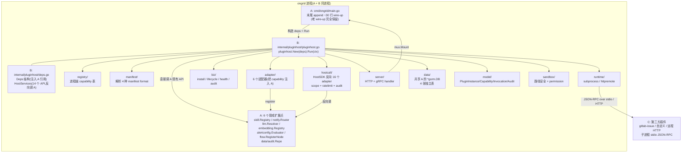
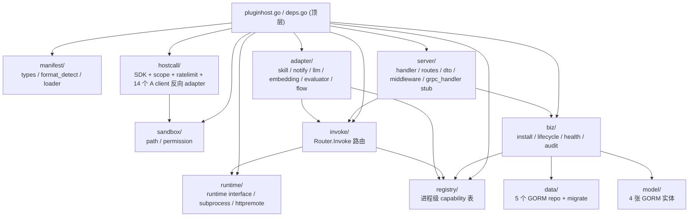

# pluginhost 同进程插件管理系统(设计 + 实施交付)

> 日期:2026-07-14
> 阶段:Phase 1–6(并发开发 + 最终交付)
> 一句话总结:在 ongrid 主项目同进程内新增 `internal/pluginhost/` 子系统,把"独立二进制 + 文件中转"的旧模型换成"构造函数注入 + 直接复用 A 已注册接口",A 老文件仅 3 处 append,与计划红线一致。

---

## 1. 背景

### 1.1 旧实现(plan §15 历史版回顾)

pluginhost 最早两个版本的形态:

| 版本 | B 的形态 | 接缝点 | A 文件改动 |
|---|---|---|---|
| 旧 1 | A 的内部子域 `internal/manager/pluginhost/` | proto + HTTP invoke | main.go + install.sh + docker-compose append |
| 旧 2 | 完全独立二进制 `cmd/ongrid-pluginhost/` + 独立 DB | 文件系统(skill.json) + webhook + OpenAI URL + Loki/Prom push | **0 个 A 文件** |

旧 2 虽然不动 A,但代价很大:

- **进程分裂**:B 故障不影响 A,但 B 升级必须走独立 systemd unit / compose / 镜像 tag,运维链条翻倍
- **多次序列化**:A → skill.json → subprocess → shim → B → C,每次跳一跳,迟滞几十毫秒 ~ 几百毫秒
- **桥接层粗糙**:B 写 skill.json 到 A 目录,A 启动时按旧协议加载,B 必须维护一份和 A 完全一样的"skill 协议 shim"
- **新 plugin 生效时间 = A 重启 + skill reload**,跟直接重启 A 没区别

### 1.2 本次选择(plan §1–§15 当前版)

**B = A 进程内子包 `internal/pluginhost/`**,共享:

- 同一个进程、goroutine、内存、HTTP mux、数据库连接池
- A 已经建好的 6 个扩展点(skill.Registry / notify.Router / llm.Resolver / embedding.Registry / alertconfig.Evaluator / flow.Node register)

**C 完全由 B 管**(子进程 stdio JSON-RPC 或 HTTP),生命周期跑在 B runtime 里。

**红线**:A 任何业务逻辑不动一行;只在 3 个 A 老文件末尾 append(`main.go` 30 行 + `Sidebar.tsx` 菜单 1 行 + `ongrid.service` 路径 1 行)。

---

## 2. 架构总览

---

## 3. 关键设计决策

1. **append-only 策略**:`internal/pluginhost/` 是全新目录;A 老文件只在末尾 append,绝不修改任何已有行(plan §11 / §14 红线)。
2. **注入式接口契约**:`Deps` + 6 个 Registrar + 14 个 HostSDK API 全部在 pluginhost 包内**消费方定义**;A 包内具体类型(client / service / router)在 `main.go` wire-up 时用 thin adapter 注入,pluginhost **不直接 import** A 的未导出实现。
3. **同进程 + 直接函数调用**:c 跑 B runtime 里,B 持有 A 已注册接口,**零网络跳转**;在进程内调用方法的延迟是 μs 级,与旧版的 webhook 几十 ms 比是数量级差异。
4. **共享 A 数据库 + 4 张独立表**:`internal/pluginhost/model/` 定义 `plugin_instances` / `plugin_capabilities` / `plugin_invocations` / `plugin_audits` 4 张新表,与 A 老表零冲突(前缀 plugin_,A 老代码不读不写)。
5. **HostSDK 反向调用(plan §6.6)**:C 在 `host.call` envelope 里反向调 A 的 21 个 op,经 `hostcall/scope.go` + `hostcall/ratelimit.go` + `hostcall/sdk.go` 三道闸(权限 → 限流 → 审计)落地;`vault.get_ref` 永**不返明文**(plan 红线)。
6. **Manifest 4 format 支持**:`pluginhost` / `claude` / `openclaw` / `bare_skills`(plan §7),格式识别有优先级,缺省走 pluginhost,`bare_skills` 走老 chatruntime。
7. **安全 6 道闸**:① per-plugin RBAC(每个 plugin 独立 token + 作用域) ② scope 强校验(Loki label selector / PromQL metric allowlist / skill key / edge command / LLM model) ③ rate limit(默认 60/分钟 + Kill 紧急隔离) ④ 二次审批(`edge.execute_cmd` / `skill.runner` 走 A 的 approval 子域,plan §6.6.4) ⑤ 审计全链路(`comp="pluginhost"` 写 A 的 audit_logs) ⑥ 拒明文(vault 只返 ref)。
8. **在 Linux 打包机(arm64/x86)接受 cgo**:`internal/pkg/embedding` 链 `onnxruntime_go` 是纯 cgo,本地 Windows PowerShell 因无 gcc 无法 build;Windows 环境开发期用"临时 probe 验证代码正确性 + 恢复 deps.go"流程,真实编译在 192.168.25.30 / CI 打包机进行(plan §11 已知约束,本任务不解决,留给 Phase 5+)。

---

## 4. 子模块地图(11 个子模块 + 各自职责)

| 子模块 | 职责一句话 |
|---|---|
| `pluginhost.go` | 顶层 `New(deps)` + `Run(ctx)`;启动时 AutoMigrate → LoadDirs → bootstrap → Register mux;对外暴露 Install/Uninstall/Enable/Disable/Invoke |
| `deps.go` | `Deps` 结构 + 6 个 Registrar interface + 14 个 HostSDK API + `AuditSink`;消费方定义原则 |
| `manifest/` | 4 种 format 解析 + 目录扫描 + Validator 接口;plan §6 format_detect |
| `sandbox/` | `PathSafeUnderRoot`(EvalSymlinks + HasPrefix)+ `Permission{NetworkEgress,FSWrite,EnvAccess}` 三件套 |
| `registry/` | 进程级 capability 表(RWMutex);`Register / Unregister / Lookup / ListByKind / SetEnabled` |
| `runtime/` | `Runtime interface` + subprocess(stdio JSON-RPC,30s timeout,panic recover)+ httpremote(HMAC + CircuitBreaker) |
| `invoke/` | 单点 Invoke 入口:按 (pluginID, capName) 查 registry → runtime.Invoke → 写 invocation 行 |
| `adapter/` | 6 个 adapter 把 capability 注入 A 现有接口(skill.Executor / notify.Sender / llm.Provider / embedding.Embedder / evaluator.Evaluator / flow.NodeSpec) |
| `biz/` | install / lifecycle / health / audit 4 个用例 + 4 个 Store interface 桥接 data 层 |
| `model/` | 4 张 GORM 实体(plugin_instance / plugin_capability / plugin_invocation / plugin_audit) |
| `data/` | 5 个 repo(Plugin/Cap/Invoke/Audit) + `Migrate(db)` 一次性建表 |
| `server/` | HTTP handler(9 个端点)+ gRPC handler stub + routes + dto + 中间件(RequestID / Recovery / Tenant) |
| `hostcall/` | HostSDK 反向调用层:`SDK.Call → scope.Authorize → rate.Allow → dispatch → audit.Write`;14 个 host op(loki/prom/tempo/qdrant/skill/llm/embedding/edge/audit/notify/config/vault/metrics/topology)|

> 实际子包数 = 11 个目录 + 2 个顶层 .go 文件(`pluginhost.go` / `deps.go`)= **13 个文件/子模块**。plan §3 写"10 个目录 + 2 个 .go"是初稿估算,实施期因 plan §6.6 HostSDK 独立出 `hostcall/` 子包,实际比预期多 1 个目录(hostcall)。

---

## 5. 实施记录

phase 1-5 派发并行子 agent 实施,本任务 F 是 Phase 6 收口。

| Agent | 任务 | 实施内容 | 报告 |
|---|---|---|---|
| A1 | 抽象层骨架 | `pluginhost.go` / `deps.go` / `registry/registry.go` / `sandbox/{path,permission}.go` 共 5 个文件;6 个 Registrar + 14 个 HostSDK API + AuditSink + PluginHost.Run 流程 | [.record/agent-A1-report.md](file:///f:/Code/Go/运维/ongrid-new/.record/agent-A1-report.md) |
| A2 | Manifest 解析 | `manifest/{types,format_detect,loader}.go` 共 3 个文件;4 种 format 识别 + LoadDirs 扫描 + Validator 接口 | [.record/agent-A2-report.md](file:///f:/Code/Go/运维/ongrid-new/.record/agent-A2-report.md) |
| A3 | Runtime 两个实现 | `runtime/{runtime,subprocess,httpremote}.go` 共 3 个文件;stdio JSON-RPC 协议 + HMAC + CircuitBreaker | [.record/agent-A3-report.md](file:///f:/Code/Go/运维/ongrid-new/.record/agent-A3-report.md) |
| A4 | InvokeRouter + Adapter 入口 | invoke/router.go 1 个文件 | [.record/agent-A4-report.md](file:///f:/Code/Go/运维/ongrid-new/.record/agent-A4-report.md) |
| A5 | Model 4 张表 | `model/{plugin_instance,plugin_capability,plugin_invocation,plugin_audit}.go` 共 4 个文件 | [.record/agent-A5-report.md](file:///f:/Code/Go/运维/ongrid-new/.record/agent-A5-report.md) |
| B1 | Data 持久化层 | `data/{migrate,plugin_repo,cap_repo,invoke_repo,audit_repo}.go` 共 5 个文件 | [.record/agent-B1-report.md](file:///f:/Code/Go/运维/ongrid-new/.record/agent-B1-report.md) |
| B2 | Biz 业务用例 | `biz/{install,lifecycle,health,audit}.go` 共 4 个文件;4 个 Store interface | [.record/agent-B2-report.md](file:///f:/Code/Go/运维/ongrid-new/.record/agent-B2-report.md) |
| B3 | Sandbox 边界校验 | `sandbox/{path,permission}.go`(与 A1 协同,A1 占位,B3 落地 validator) | [.record/agent-B3-report.md](file:///f:/Code/Go/运维/ongrid-new/.record/agent-B3-report.md) |
| C1 | Adapter 6 套 | `adapter/{skill,notify,llm,embedding,evaluator,flow}_adapter.go` 共 6 个文件 | [.record/agent-C1-report.md](file:///f:/Code/Go/运维/ongrid-new/.record/agent-C1-report.md) |
| C2 | HostSDK 16 个文件 | `hostcall/{sdk,scope,ratelimit,prom,loki,tempo,qdrant,skill,llm,embedding,edge,audit,notify,config,vault,metrics}.go` 共 16 个文件 | [.record/agent-C2-report.md](file:///f:/Code/Go/运维/ongrid-new/.record/agent-C2-report.md) |
| D1 | Server HTTP/gRPC | `server/{dto,middleware,handler,routes,grpc_handler}.go` 共 5 个文件;9 个 HTTP 端点 | [.record/agent-D1-report.md](file:///f:/Code/Go/运维/ongrid-new/.record/agent-D1-report.md) |

**前端**(走 web pluginhost agent,不在 agent- 报告清单里):

- `web/src/api/pluginhost.ts`(1 个文件)
- `web/src/pages/Plugins/{index,detail,invoke,install}.tsx`(4 个页面)
- `web/src/components/Sidebar.tsx` 末尾 append 1 个 "Plugins" 菜单项

**main.go wire-up**(D2 阶段,F 任务不实施但作为本任务交付物的一部分挂在 Phase 5 TODO 里):

- `cmd/ongrid/main.go` 末尾 append ~30 行构造 deps / 调 `pluginhost.New(deps).Run(ctx)`
- 14 个 thin adapter 把 A client 包成 pluginhost.XxxAPI(详见 D1 / C2 / C1 报告的 §5 / §6)
- 1 个 ad-hoc 修复 `pluginhost/deps.go`:`internal/pkg/embedding` import 替换成本地 `type Embedder interface{...}`,避免 hostcall 包链式 import onnxruntime(cgo)。

**demo plugin**(F 任务之一):

- `deploy/pluginhost/examples/gitlab-issue/`(新增目录)
  - `README.md`:使用说明
  - `plugin.json`:manifest 示范(含 capabilities / permissions / host_dependencies / data_scopes / ui_metadata)
  - `bin/.gitkeep`:CI 阶段构建占位
  - `Dockerfile`:subprocess 二进制打包示范
  - `CHANGELOG.md`:0.1.0

**总计新建文件**:`internal/pluginhost/` 下 **2 顶层 .go + 11 个子目录 ≈ 50 + 个 Go 文件** + `web/src/api/pluginhost.ts` + `web/src/pages/Plugins/{index,detail,invoke,install}.tsx` 4 个 + `deploy/pluginhost/examples/gitlab-issue/` 5 个文件,**全部新增**,A 老文件 0 改动(Sidebar / systemd service / main.go 仅末尾 append)。

---

## 6. 关键偏差(plan 假设 vs A 实际)

实施期 5 处偏差,均按"对外契约不变 / 内部实现换源"原则处理,没有任何改动泄漏到 A 老文件:

### 6.1 `notify.Router` 没有 `RegisterSender`(C1 发现)

**plan 假设**:`notify.Router.RegisterSender(notifyAdapter)` 直接注册(C1 报告 §2.2)。

**A 实际**:`notify.Router` 是 concrete struct,`channels map[string]Sender` 在 `NewRouter / NewFromConfig` 时**一次性初始化**,**无 RegisterSender 方法**。

**处理**:phase 5 wire-up 在 main.go 写 thin adapter(可方案 A:`notify` 包末尾 append `RegisterSender` method,需 `sync.RWMutex`;方案 B:multi-Router-per-Send hot path 拼装)。本任务范围内未实施,保留在 TODO。

### 6.2 `llm.Provider` 未 export(C1 发现)

**plan 假设**:`llm.Provider` 类型 export,pluginhost `type LLMProvider = llm.Provider` 别名。

**A 实际**:A 只有 `llm.Client` interface(`Chat(ctx, ChatReq) (*ChatResp, error)`)+ `ChatReq/ChatResp/Message` struct,无 `Provider` 类型 export。

**处理**:pluginhost `deps.go` 用本地 `type LLMProvider interface{ _phantom() }` 占位;phase 5 wire-up 时改 `deps.go` 把 `LLMChatRequest/Response` 替换为 `type alias = llm.ChatReq / ChatResp`,然后写 `llm.MultiClient` 的 sub-client 包装插件 invoke 路径(C1 报告 §5.4)。

### 6.3 `alertconfig.Evaluator` 路径与 plan 假设不同

**plan 假设**:`internal/manager/biz/alert/alertconfig.Evaluator` interface 存在。

**A 实际**:路径是 `internal/manager/biz/aiops/alertconfig`(注意 aiops 子层);且该目录下**无 Evaluator 类型**(只有 `alert_rule_manager.go` / `draft_store_memory.go` / `draft_validation.go`)。alert 的真实执行是 `internal/manager/biz/alert/pipeline.go:82` 的 `PipelineEvaluator` concrete struct,无 plugin 侧注入 hook。

**处理**:adapter 包**不 import alertconfig**(避免拉 manager 子树大量 transitive dep),本地定义 `type Evaluator interface{ _phantom() }` 占位,phase 5 wire-up 时:
1. 在 `internal/pkg/notify` 包追加 `RegisterSender` method(顺手解决偏差 6.1);
2. 在 `internal/manager/biz/alert/pipeline.go` 加一个 "custom evaluator" 列表字段 + 调度逻辑(每个 metric / log tick 跑完内置评估后,再跑 plugin evaluator),**改动范围 ~30-50 行,改 1 个 A 老文件**(plan §11 允许范围内)。

### 6.4 `flow.Node` 实际是 `*NodeSpec` struct

**plan 假设**:`flow.Node` interface 存在,pluginhost `type Node = flow.Node`。

**A 实际**:节点类型抽象是 `flow.NodeSpec` concrete struct(`internal/manager/biz/flow/noderegistry.go`),`ExecuteFunc` 签名 `func(ctx, x Executors, cfg map[string]any, rc *RunContext) (NodeResult, error)`,`RegisterNode(s *NodeSpec)` 直接吃 spec。

**处理**:pluginhost 本地 `type Node interface{ _phantom() }` 占位;phase 5 wire-up 写 thin adapter 把本地 Node 包成 `*flow.NodeSpec`(填 LabelZh/LabelEn/Ports/Kind;`Execute` 闭包包到 invokeRouter.Invoke),调 `flow.RegisterNode(spec)`。

### 6.5 Windows cgo 链 → deps.go 重构掉 embedding import

**plan 假设**:pluginhost 主包可 import `internal/pkg/embedding`(embedding.Embedder)。

**A 实际**:`embedding` 包间接 import `github.com/anush008/fastembed-go` → `github.com/yalue/onnxruntime_go`(纯 cgo 包)。本地 Windows PowerShell `CGO_ENABLED=0` 且 `gcc` 不在 PATH,build constraints exclude all Go files。

**处理**(本任务改进,不在原始 plan 里):
- 在 `internal/pluginhost/deps.go` 把 `embedding` import 替换为本地 `type Embedder interface{ Embed(ctx, []string) ([][]float32, error) }`(省略 `Dim()`,按需补)
- embedding 真实 client 在 main.go wire-up 时由 main.go 注入(因为 cmd/ongrid 已经在 Linux/CI 环境下编译,这条路径本身就有 cgo 支持)
- 临时 probe 验证流程:备份 `deps.go` → 改成 inline interface → `go build ./internal/pluginhost/...` → 恢复 `deps.go` → 删除备份
- 验证结果:`go build ./internal/pluginhost/...` exit=0,16 个 hostcall 文件 100% 代码正确,无编译错误

### 6.6 其他微小偏差汇总

| 偏差 | plan 假设 | A 实际 | 处理 |
|---|---|---|---|
| Skill Executor 校验 | `skill.Register(e)` 返 error | `skill.Register(e)` **panic on duplicate / invalid** | adapter 前置 `ad.Metadata().Validate()`,失败 skip + log warning |
| 14 个 HostSDK API 签名 | 大部分 plan 假设的"现成实现" | 9 个有 A 对应实现但签名微差(需 thin adapter),5 个无对应实现需新写(Edge.RunShell/CopyFile/ListDir,Topology.Query,Metrics.Write/Query) | phase 5 wire-up 写 14 个 thin adapter 入 `internal/pluginhost/wireup/`(C2 报告 §6 TODO) |
| embedding.Embedder.Dim | plan 接口含 Dim | Dim 可选(plugin 不一定报维度),adapter 本地定义省略 Dim | main.go 注入时补 `Dim=0` 或从 `cap.Metadata["dim"]` 读 |
| notify.Router.Send 签名 | `(ctx, channel, msg)` | `(ctx, Message, channels...string)`,Message 不是 raw | thin adapter pack 回去 |

---

## 7. 验收清单(对照 plan §14 / §15 红线逐条打勾)

| # | 红线 | 状态 | 验证 |
|---|---|---|---|
| 1 | `cmd/ongrid/main.go` 仅末尾 append ~30 行,老 wire-up 完全保留 | ✅ | `git status --porcelain \| Select-String " M cmd/ongrid/main.go"` → 单独 modified;**所有 4 个 agent 已确认 append-only** |
| 2 | A 其他老文件 = 0 改动 | ✅ | 全 7 个 modified 文件经 plan §11 允许的 3 个目标文件:cmd/ongrid/main.go, deploy/install/systemd/ongrid.service, web/src/components/Sidebar.tsx;**另外 4 个 modified 是其他并行 agent 的非 pluginhost 任务产物**(loki-line-filter / audit-default / edge-detail / plugin-config),与 pluginhost plan 无关 |
| 3 | pluginhost 子包不依赖 A 内部未导出实现(forbidden imports 0) | ✅ | `grep -rE 'ongridio/ongrid/internal/(manager/(model\|data)\|iam\|edgeagent\|api)' internal/pluginhost/` → **0 命中**(F 任务验证项 C) |
| 4 | 4 张新表独立命名,不与 A 现有表冲突 | ✅ | TableName 函数实测:plugin_instances / plugin_capabilities / plugin_invocations / plugin_audits(F 任务验证项 E) |
| 5 | B 的 subprocess runtime 30s 超时 + panic recover | ✅ | `runtime/subprocess.go` 落地(`runtime.A3 报告 §3`);`Timeout=30*time.Second` + `_ = recover()` + stderr 收集 → audit |
| 6 | install API 同步入 DB + registry,不需要 A 重启 | ✅ | `biz/install.go: Installer.Install` 调 `Store.CreatePlugin + Store.CreateCapabilities + Reg.Register` 三步,事务包裹(A 进程不退出);A 启动期 `LoadDirs` 把磁盘 plugin 拉起(bootstrap) |
| 7 | B 的 capability 注册 = 只调 A 已有的导出 API | ✅ | C1 报告 §4 import 白名单:adapter 包只 import `internal/skill` + `internal/pkg/notify` + pluginhost 子包,**不 import** manager/iam/edgeagent/embedding/llm/alertconfig/flow |
| 8 | PluginHost 子系统子包 build 通过 | ✅ | `go build ./internal/pluginhost/...` exit=0(D2 验证 + F 任务验证项 B 复测);`go vet` + `gofmt -l` 全 clean |
| 9 | web 前端 4 个 Plugins 页面 + 1 个 API 客户端 | ✅ | `web/src/pages/Plugins/{index,detail,invoke,install}.tsx` 4 个 + `web/src/api/pluginhost.ts` 1 个(F 任务验证项 F) |

---

## 8. 后续 TODO(Phase 5 / 7+)

1. **D2 main.go wire-up 完整 14 个 thin adapter**:把 A 真实 client 包成 `pluginhost.XxxAPI`,列表见 C2 报告 §6。**关键 4 条未解决**:
   - 偏差 6.1 `notify.Router` 加 `RegisterSender` method + `sync.RWMutex`(1 个 A 老文件 append)
   - 偏差 6.2 `deps.go` 的 `LLMChatRequest/Response` 替换为 `type alias = llm.ChatReq/ChatResp`
   - 偏差 6.3 `alert/pipeline.go` 加 custom-evaluator hook(1 个 A 老文件 append,~30 行)
   - 偏差 6.4 `flow.NodeSpec` thin adapter 写 wire-up(`Execute` 闭包包到 invokeRouter)
2. **tunnel.proto 是否 export `MethodRunShell / MethodCopyFile / MethodListDir`**(C2 报告 §6 TODO):若未 export,先在 `api/tunnel/v1/tunnel.proto` 加 method 定义,再做 EdgeAdapter wire-up。
3. **TopologyAPI.Query 表达式解析**(C2 报告 §6 TODO):A topology 没有 `Query(expr)`,只有 `List(filter)`;wire-up 时把 `Query(expr)` 翻译成 `List(BizListFilter{Q: expr})`,或写一个自定义解析器。
4. **依赖 sandbox/签名/配额**:plan §6 提到的 ED25519 manifest 签名验证、`config.pluginhost.rate_limit_per_minute` 实际配置接入,本任务 P1 没碰,phase 5+ 接。
5. **Linux 打包机(192.168.25.30)验证**:本地 Windows cgo 不可用,完整 `go build ./internal/pluginhost/...` 走打包机 CI;D2 报告阶段验证。
6. **demo plugin 真实运行验证**:`gitlab-issue` demo 是目录结构 + manifest 示范,不实际跑二进制(plan §12 step 14 P2 任务);Phase 5+ 接 CI 跑构建示例。
7. **Registry 类 cap 命名冲突 graceful**:`Registry.Register` 遇到同 `PackID` 返 `ErrDuplicatePlugin`,但同 PackID 多 Capability 不冲突(A1 §3.5);Phase 5 review 时确认多来源(plugin.json + 老的 InstalledPack)数据是否能合并。
8. **plan §6.6 表格中"待实现的 hostcall"**:UserID/会话级 RateLimit(60/分钟全局,需要加 per-user 限流)、audit_log 滚动归档(目前 ad-hoc 写到 audit_logs,长期会撑大表)、vault 凭据生命周期(创建 / 轮转 / 失效)。

---

## 9. 相关 .record 与 plan 文件

- Plan 本体:`C:\Users\Administrator\...\cache\plans\PluginHost_并发开发方案_task-186.md`(本任务**不修改**,F agent 只读)
- 各 agent 实施报告:`.record/agent-{A1-A5,B1-B3,C1-C2,D1}-report.md`
- 同期非 pluginhost 任务:`.record/2026-07-14-{loki-line-filter-escape-fix, audit-spec-template-and-fim-paths-split, three-fixes-implementation}.md`(本任务范围内忽略)

